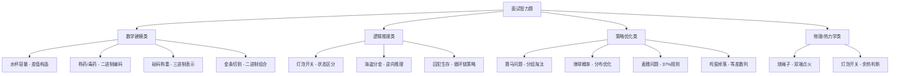

## 引言

你以为算法面试只有 LeetCode 和八股文？错。很多技术面最后一轮，面试官会抛出一道智力题——赛马、毒药、海盗分金。这些题没有标准 API 可查，考察的是你的**逻辑推理、数学建模和创造性思维**。

读完本文你将掌握：
- **13 类高频智力题**：从水杯容量到鸡蛋掉落，覆盖面试所有常见题型
- **底层思维模式**：二进制编码、逆向推理、概率优化——掌握模式而非死记答案
- **解题套路总结**：面对没见过的题，如何快速找到切入点

> **📌 面试场景**：字节跳动和 Google 特别喜欢在终面出智力题。面试官不在乎你能否秒答答案，而是看你的推导过程是否清晰。下面这些题，至少准备 5 道能现场讲清楚思路的。

---

### 1. 水杯容量问题
**题目**：用5升和3升的水杯，如何得到4升的水？  
**解法**：
1. 将5升杯装满，倒入3升杯，5升杯中剩2升。
2. 清空3升杯，将5升杯中的2升倒入3升杯。
3. 再次装满5升杯，用5升杯的水将3升杯填满（此时3升杯已有2升，需再加1升）。
4. 5升杯剩下4升。  
   **关键点**：通过差值逆向构造目标容量。

---

### 2. 赛马问题
**题目**：25匹马和5条赛道，最少比赛次数确定前三名。  
**解法**：
1. **分组赛**：分5组各赛1次，共5场，记录每组前三名。
2. **决赛**：每组第一名赛1场，确定前三名的组。
3. **附加赛**：可能涉及第二名和第三名的马再赛1场。  
   **最少场次**：7场。

---

### 3. 称药问题
**题目**：10瓶药中找出变质的1瓶（每颗变质药重1.1克），仅用一次称量。  
**解法**：
1. 从第\( n \)瓶取\( n \)粒药（如第1瓶取1粒，第2瓶取2粒，…，第10瓶取10粒）。
2. 总重量应为\( 55 \)克（若全正常），实际超重部分为\( 0.1 \times k \)，则第\( k \)瓶变质。  
   **数学原理**：等差数列求和与差值分析。

---

### 4. 概率优化问题
**题目**：红蓝弹球各50个，如何分配使选中红球概率最大？  
**解法**：
1. 将1个红球放入罐A，其余99个球（49红+50蓝）放入罐B。
2. 选中罐A的概率为\( \frac{1}{2} \times 1 + \frac{1}{2} \times \frac{49}{99} \approx 74.7\% \)。  
   **核心策略**：通过概率分布最大化局部确定性。

---

### 5. 三门问题（蒙提霍尔问题）
**题目**：三扇门后一扇有奖品，参赛者选一扇后，主持人打开一扇无奖品的门，问是否换门？  
**答案**：换门中奖概率提升至\( \frac{2}{3} \)。  
**解析**：
- 初始选择正确概率\( \frac{1}{3} \)，错误概率\( \frac{2}{3} \)。
- 主持人排除错误选项后，换门可将错误概率转化为正确概率。

---

### 6. 囚犯生存问题
**题目**：100个囚犯需通过编号匹配策略提高生存率。  
**解法**：
1. **循环链策略**：每个囚犯从自己编号的盒子开始，沿链式路径查找，最多开50次。
2. **成功条件**：所有循环链长度≤50，概率约\( 31\% \)。  
   **数学依据**：概率论中的排列组合分析。

---

### 7. 最优停止问题（麦穗问题）
**题目**：如何选出麦田中最大的麦穗？  
**策略**：
1. **观察期**：前37%的麦穗仅观察不选择。
2. **选择期**：后续遇到第一个比观察期内最大的更大的麦穗时选择。  
   **原理**：最优停止理论（37%规则）。

---

### 8. 毒药问题（二进制编码经典题）
**题目**：  
有1000瓶药水，其中1瓶是毒药，毒药会在24小时后发作致死。现有10只小白鼠，如何通过一次喂药（24小时内）确定哪一瓶是毒药？  
**解法**：
1. **二进制编号**：将1000瓶药按1~1000编号，并转换为10位二进制数（如1号=0000000001，1000号=1111101000）。
2. **分配老鼠**：每只老鼠对应一个二进制位（第1只代表第1位，第2只代表第2位，以此类推）。
3. **喂药策略**：
   - 若某瓶药编号的第\( n \)位为1，则给第\( n \)只老鼠喂一滴该药水。
   - 例如，5号药（0000000101）喂给第1只和第3只老鼠。
4. **结果判定**：
   - 24小时后，观察哪些老鼠死亡。
   - 将死亡老鼠的二进制位设为1，未死亡的设为0，组成的二进制数即为毒药瓶号。  
     **关键点**：利用二进制编码特性，每只老鼠的生死对应一个二进制位，10只老鼠可覆盖\( 2^{10}=1024 \)种可能性。

---

### 9. 分金问题（海盗分金/每日支付问题）

#### 版本一：海盗分金
**题目**：5个海盗分100枚金币，由最资深海盗提出分配方案，若半数及以上同意则通过，否则资深海盗被杀，由下一名海盗提出方案。假设海盗绝对理性且优先保命，其次求财，最后想杀人，问资深海盗如何分配？  
**解法**：
1. **逆向推理**：
   - 只剩2人时，资深海盗可独吞金币（自己同意即可）。
   - 剩3人时，资深海盗需争取1人支持，给第三名海盗1枚金币（否则第三名在下一轮会一无所有）。
   - 剩4人时，资深海盗需争取2人支持，给第二名和第四名各1枚金币（同理）。
   - 最终方案：资深海盗拿97枚，给第三和第五名各1枚，第二和第四名0枚。  
     **核心思想**：通过博弈论逆向排除风险，利用对手的理性决策。

#### 版本二：每日支付问题
**题目**：将一块金条分成若干段，如何切割使得每天可以支付1~7天的工资？  
**解法**：
1. **等比数列分割**：切割为1、2、4段（\( 2^0, 2^1, 2^2 \)）。
2. **组合支付**：
   - 第1天：支付1段。
   - 第2天：支付2段，找回1段。
   - 第3天：支付1+2段。
   - 以此类推，可覆盖1~7天的所有组合。  
     **数学原理**：二进制组合覆盖范围，最少分割次数满足\( 2^n \geq \)最大天数。

---

### 10. 灯泡开关问题（热力学推理）
**题目**：房间内有1盏灯，房间外有3个开关，其中只有1个能控制灯。如何仅进入房间一次，确定哪个开关控制灯泡？  
**解法**：
1. **利用灯泡余热**：
   - 打开开关A，等待5分钟后关闭。
   - 立即打开开关B，进入房间：
      - 若灯亮 → 开关B控制。
      - 若灯灭但温热 → 开关A控制。
      - 若灯灭且冷 → 开关C控制。  
        **关键点**：通过灯泡的热量和亮度状态区分开关。

---

### 11. 烧绳子计时问题
**题目**：两根不均匀燃烧的绳子，每根燃烧完需1小时，如何精确计时45分钟？  
**解法**：
1. 同时点燃绳子A的两端和绳子B的一端。
2. 绳子A将在30分钟烧完，此时点燃绳子B的另一端。
3. 绳子B剩余部分将在15分钟烧完，总计时45分钟。  
   **核心**：利用绳子燃烧速度不均匀的特性，通过双端点火缩短时间。

### 12. 砝码称重问题
**题目**：用最少数量的砝码称出1~40克的所有重量，每个砝码可放天平两侧。  
**解法**：
1. 使用3个砝码：1克、3克、9克、27克（等比数列，\( 3^n \)）。
2. **三进制组合**：通过加减砝码覆盖所有可能值。
   - 例如，称5克：左盘放物体+1克，右盘放9克（9-1=8，但需调整）。  
     **数学原理**：三进制数表示法，每个砝码可表示-1、0、1三种状态。

### 13. 鸡蛋掉落问题（Google经典题）
**题目**：有100层楼和2个鸡蛋，确定鸡蛋从哪层楼开始会碎，最少尝试次数？  
**解法**：
1. **数学优化**：设第一次尝试楼层为\( x \)，若鸡蛋碎，则线性搜索1~x-1层；若未碎，尝试\( x+(x-1) \)层，逐步减少跨度。
2. **方程求解**：\( x+(x-1)+(x-2)+\dots+1 \geq 100 \)，解得\( x=14 \)，最多尝试14次。

---

---

## 总结：智力题的底层思维模式

智力题的核心不是背诵答案，而是识别题目背后的思维模式：

| 思维模式 | 代表题目 | 关键技巧 |
|----------|----------|----------|
| **二进制编码** | 毒药问题、称药问题 | 用 N 位二进制表示 2^N 种可能 |
| **逆向推理** | 海盗分金、水杯问题 | 从目标状态倒推初始状态 |
| **概率优化** | 弹球问题、三门问题 | 改变样本空间/利用条件概率 |
| **进制组合** | 砝码称重、金条切割 | 二进制覆盖范围 / 三进制加减 |
| **等差数列** | 鸡蛋掉落 | 逐步减少跨度的平衡策略 |
| **物理特性** | 灯泡开关、烧绳子 | 利用非数字维度（温度/时间） |

> **💡 核心提示**：面试中最常见的三类模式——二进制编码（毒药/称药）、逆向推理（海盗分金）、概率优化（三门问题/弹球）。掌握这三种思维，可以应对 60% 的智力题。

### 生产环境避坑指南

> **⚠️ 避坑 1**：赛马问题中，很多人会忽略第 6 场之后还需要第 7 场。记住：第 6 场确定第一名所在组，但第 2、3 名可能来自不同组，必须附加赛确定。

> **⚠️ 避坑 2**：三门问题的直觉错误率高达 90%。关键理解：主持人知道门后内容且一定会打开一扇空门，这个"额外信息"改变了概率分布。

> **⚠️ 避坑 3**：砝码称重问题中，如果砝码只能放一侧是二进制（1,2,4,8...），可以放两侧是三进制（1,3,9,27...）。审题时要确认规则。

### 行动清单

1. **必背 5 题**：毒药问题、赛马问题、三门问题、海盗分金、鸡蛋掉落——这 5 题是面试出现频率最高的
2. **推导练习**：每次复习时不要看答案，自己完整推导一遍过程——理解比记忆重要
3. **表达训练**：练习在 2 分钟内把解题思路讲清楚——面试官看重的是思路而非答案
4. **扩展阅读**：推荐阅读《思考，快与慢》中关于直觉偏见的章节，以及《哥德尔、埃舍尔、巴赫》中的逻辑谜题
