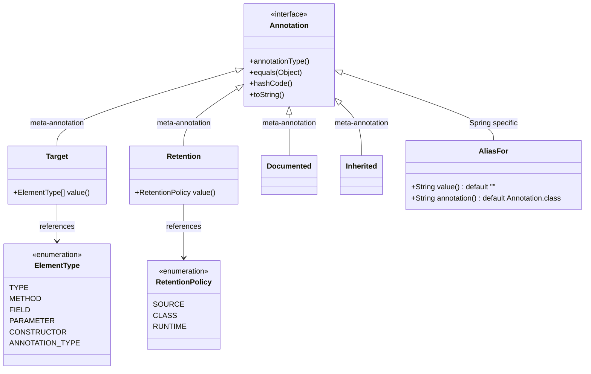
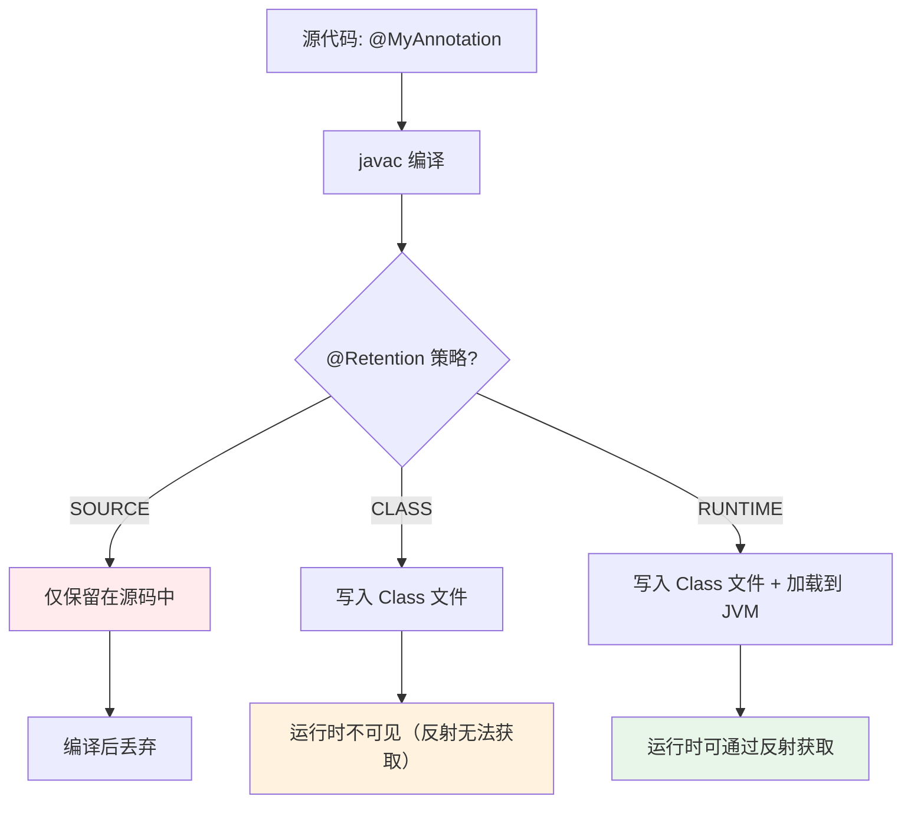
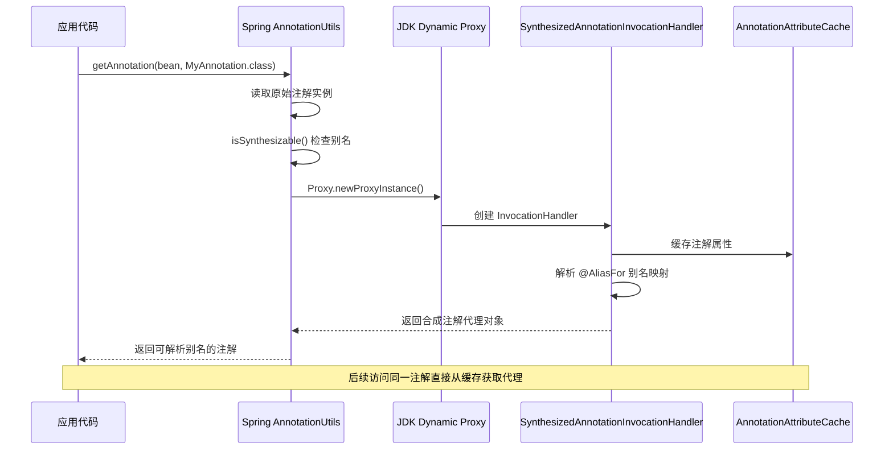

## 引言

Spring 的 `@AliasFor` 是怎么做到代理合成的？一个注解的属性别名，在运行时是如何被动态解析的？这背后是 JDK 动态代理 + 缓存 + 递归注解合成的精密协作。

读完本文你将掌握：注解在 Class 文件中的二进制存储格式、三种 Retention 策略的运行时影响、Spring SynthesizedAnnotation 的代理机制，以及注解处理器（APT）的完整工作原理。这是理解 Spring、MyBatis、JPA 等主流框架注解驱动开发的核心基础。



## 注解在 Class 文件中的存储机制

注解信息通过 `RuntimeVisibleAnnotations` 属性存储在 Class 文件的**属性表**中。

### Class 文件中的注解二进制结构

| 字段 | 大小 | 说明 |
|------|------|------|
| 属性名索引 | 2 字节 | 指向常量池中 `RuntimeVisibleAnnotations` 字符串 |
| 属性长度 | 4 字节 | 整个属性的字节长度 |
| 注解数量 | 2 字节 | 当前元素的注解总数 |
| 注解类型索引 | 2 字节 | 指向常量池中注解类型的全限定名 |
| 键值对数量 | 2 字节 | 注解成员值的数量 |
| 键值对数组 | 变长 | 每个成员由 `u2` 名称索引和 `element_value` 值构成 |

例如，`@DistributedLock(timeout=5000)` 对应的字节码中，`timeout` 作为名称索引指向常量池，值以 `CONSTANT_Integer_info` 形式存储。这种紧凑的二进制结构使得 JVM 能在加载类时快速解析注解。

### 三种 Retention 策略的对比



| Retention 策略 | 保留阶段 | 反射可见 | 典型用途 |
|---------------|---------|---------|---------|
| `SOURCE` | 仅源码 | 否 | 编译器提示、代码生成标记 |
| `CLASS` | 源码 + Class 文件 | 否 | 字节码工具处理、AOP 织入 |
| `RUNTIME` | 源码 + Class + JVM | 是 | 框架运行时注解解析 |

> **💡 核心提示**：`@Override` 是 `SOURCE` 级别的注解，它的作用是让编译器检查方法签名是否正确。编译完成后该注解被丢弃，运行时通过反射无法获取 `@Override`。

## JDK 动态代理的注解合成机制

Java 的注解在运行时通过 `AnnotationInvocationHandler` 动态代理实现属性访问。Spring 在此基础上增强了 `@AliasFor` 的别名解析。

### Spring 的合成注解处理流程



### 源码级解析

```java
// Spring AnnotationUtils 判断是否需要合成
private static boolean isSynthesizable(Class<? extends Annotation> annotationType) {
    for (Method attribute : getAttributeMethods(annotationType)) {
        if (!getAttributeAliasNames(attribute).isEmpty()) return true;
    }
    return false;
}

// 代理对象的 invoke 方法
public Object invoke(Object proxy, Method method, Object[] args) {
    String name = method.getName();
    if (Object.class == method.getDeclaringClass()) {
        return method.invoke(this.annotation, args); // equals/hashCode/toString
    }
    return this.attributeExtractor.getAttributeValue(name); // 别名映射解析
}
```

Spring 通过 `Proxy.newProxyInstance` 创建同时实现原注解接口和 `SynthesizedAnnotation` 标记接口的代理对象，实现属性别名的运行时解析。

> **💡 核心提示**：`@AliasFor` 的代理合成是有代价的——每次获取注解都会创建动态代理实例。Spring 通过缓存 `AnnotationAttributeCache` 来缓解性能开销，但高并发场景仍需要注意。

## ASM 动态修改注解值实战

通过字节码工具 ASM 可以在编译后修改注解值，实现动态配置：

```java
ClassReader cr = new ClassReader(className);
ClassWriter cw = new ClassWriter(cr, ClassWriter.COMPUTE_FRAMES);

cr.accept(new ClassVisitor(ASM9, cw) {
    @Override
    public AnnotationVisitor visitAnnotation(String desc, boolean visible) {
        if (desc.equals("Lcom/example/Config;")) {
            return new AnnotationVisitor(ASM9, super.visitAnnotation(desc, visible)) {
                @Override
                public void visit(String name, Object value) {
                    if ("timeout".equals(name)) {
                        super.visit(name, 10000); // 将 timeout 值改为 10 秒
                    }
                }
            };
        }
        return super.visitAnnotation(desc, visible);
    }
}, 0);

byte[] newClass = cw.toByteArray();
// 通过自定义 ClassLoader 加载修改后的类
```

该技术可用于实现动态配置切换，但需注意修改后的类需重新加载以避免 Metaspace 内存泄漏。

## 声明式分布式锁框架设计

基于 `@DistributedLock` 注解的 AOP 框架实现：

```java
@Target(ElementType.METHOD)
@Retention(RetentionPolicy.RUNTIME)
public @interface DistributedLock {
    String key();
    int timeout() default 30; // 秒
    LockType type() default LockType.REDIS;
}

@Aspect
public class LockAspect {
    @Around("@annotation(lock)")
    public Object doLock(ProceedingJoinPoint pjp, DistributedLock lock) throws Throwable {
        LockClient client = LockFactory.getClient(lock.type());
        String lockKey = parseSpEL(lock.key(), pjp);
        try {
            if (!client.tryLock(lockKey, lock.timeout())) {
                throw new LockConflictException();
            }
            new Thread(() -> renewLock(client, lockKey)).start();
            return pjp.proceed();
        } finally {
            client.release(lockKey);
        }
    }
}
```

**关键技术点**：
- **SPEL 表达式解析**：支持动态锁键生成（如 `#user.id`）
- **锁续期策略**：通过后台线程定期执行 `EXPIRE` 命令
- **降级方案**：当 Redis 不可用时切换本地锁

## Lombok @Getter 的 AST 转换

Lombok 通过 JSR 269 注解处理器在编译期修改 AST：

1. **初始化阶段**：在 `AbstractProcessor` 中注册对 `@Getter` 的监听
2. **AST 修改**：扫描带有 `@Getter` 注解的元素，生成 getter 方法节点并写入 AST
3. **编译时织入**：生成的 getter 方法直接写入字节码，源码中不可见

```java
// Lombok 注解处理器核心流程（简化）
public boolean process(Set<? extends TypeElement> annotations, RoundEnvironment roundEnv) {
    for (Element elem : roundEnv.getElementsAnnotatedWith(Getter.class)) {
        ClassTree ct = (ClassTree) trees.getTree(elem);
        ct = ct.addMember(generateGetterMethod(ct)); // 生成 getter 方法节点
        trees.rewrite(ct); // 重写 AST
    }
    return true;
}
```

这种机制使得 Lombok 能在保持代码简洁性的同时兼容 IDE 的代码提示。

## Java 注解 vs C# Attribute

| 维度 | Java 注解 | C# Attribute |
|------|----------|-------------|
| 元数据保留 | 需显式声明 `@Retention` 策略 | 默认保留至运行时 |
| 作用域 | 仅支持类/方法/字段等元素 | 支持程序集级属性 |
| 元编程能力 | 需 APT 或 AnnotationProcessor | 通过 PostSharp 实现 AOP |
| 默认值处理 | 通过 `default` 关键字声明 | 通过构造函数参数设置 |
| 嵌套注解 | 支持多层嵌套 | 需显式声明 `AllowMultiple` |
| 运行时访问 | JDK 动态代理 | 反射直接读取 |

## 生产环境避坑指南

### 1. 运行时注解不可用（Retention 策略错误）

```java
// 错误：默认 Retention 是 CLASS，运行时反射获取不到
public @interface MyConfig {
    String value(); // 没有 @Retention(RUNTIME)
}

// 正确做法
@Retention(RetentionPolicy.RUNTIME)
public @interface MyConfig {
    String value();
}
```

**对策**：所有需要在运行时通过反射读取的注解，必须显式标注 `@Retention(RetentionPolicy.RUNTIME)`。

### 2. 泛型上的注解在运行时丢失

```java
// 编译后，@NonNull 注解不保留在类型参数上
List<@NonNull String> list;

// 反射无法获取泛型参数上的注解
```

**对策**：使用 Java 8 的 TYPE_USE 目标类型注解，并通过 `getAnnotatedType()` API 访问。

### 3. Spring @AliasFor 需要元注解支持

```java
// 错误：@AliasFor 要求被注解的类上有 @Component 等 Spring 元注解
public @interface MyAnno {
    @AliasFor("value") String name() default "";
}

// 正确：加上 Spring 的元注解
@Component
public @interface MyAnno {
    @AliasFor("value") String name() default "";
}
```

**对策**：确保自定义注解被 Spring 的注解处理器扫描到。

### 4. 注解处理器（APT）性能开销

```java
// APT 在每次编译时都运行，大型项目中可能显著增加编译时间
// 优化：使用 incremental processing（增量处理）
@SupportedOptions("org.gradle.annotation.processing.isolating")
```

**对策**：在 Gradle 中启用增量注解处理，在 CI 中缓存注解处理结果。

### 5. @Inherited 只对类级别有效

```java
@Inherited
public @interface MyAnnotation {}

@MyAnnotation
class Parent {}

class Child extends Parent {} // Child 继承 @MyAnnotation

// 但接口、方法、字段上的注解不会被 @Inherited 继承！
```

**对策**：不要依赖 `@Inherited`，而是在框架中手动遍历父类和接口查找注解。

### 6. 注解代理对象的 hashCode/equals 陷阱

Spring 合成的注解代理对象，其 `hashCode()` 和 `equals()` 基于代理逻辑实现，与原始注解实例不一致。如果将注解实例用作 HashMap 的 key，可能导致意外行为。

**对策**：使用 `AnnotationUtils` 的 `getAnnotation()` 而非直接反射获取。

### 7. 频繁生成注解代理类导致 Metaspace 溢出

```
java.lang.OutOfMemoryError: Metaspace
```

**对策**：设置 `-XX:MaxMetaspaceSize=256m`，并避免在循环中重复创建注解代理。

## 对比表：注解处理方式

| 处理方式 | 时机 | 性能 | 适用场景 | 推荐度 |
|---------|------|------|---------|--------|
| 反射读取（RUNTIME） | 运行时 | 中 | 框架注解解析 | ⭐⭐⭐⭐⭐ |
| 注解处理器（APT） | 编译期 | 快 | 代码生成（Lombok、Dagger） | ⭐⭐⭐⭐⭐ |
| ASM 字节码修改 | 编译后/运行时 | 快 | 动态配置、AOP 增强 | ⭐⭐⭐ |
| JDK 动态代理合成 | 运行时 | 中 | Spring @AliasFor | ⭐⭐⭐⭐ |
| 源码解析（AST） | 编译期 | 快 | IDE 插件、代码分析 | ⭐⭐⭐ |

## 行动清单

1. **检查 Retention 策略**：全局搜索自定义注解，确保需要运行时读取的注解都标注了 `@Retention(RUNTIME)`。
2. **审查 @AliasFor 使用**：确保 Spring 别名注解所在的类有对应的元注解（如 `@Component`）。
3. **避免注解反射热点**：将频繁访问的注解结果缓存，不要每次方法调用都通过反射读取。
4. **监控 Metaspace**：对大量使用动态代理和字节码生成的应用，配置 Metaspace 告警。
5. **启用增量 APT**：在构建工具中启用增量注解处理，缩短编译时间。
6. **理解 @Inherited 局限**：不要依赖 `@Inherited` 继承方法/字段注解，手动实现遍历查找。
7. **注解安全性加固**：对包含敏感信息的注解使用 `SOURCE` 级别 Retention，防止运行时反射读取。
8. **扩展阅读**：推荐阅读 JSR 269（Pluggable Annotation Processing API）规范和 Spring Framework 中 `SynthesizedMergedAnnotationInvocationHandler` 的源码。
