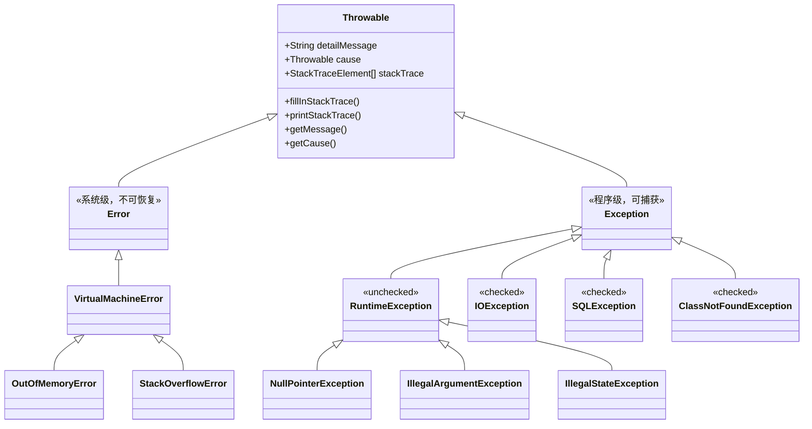
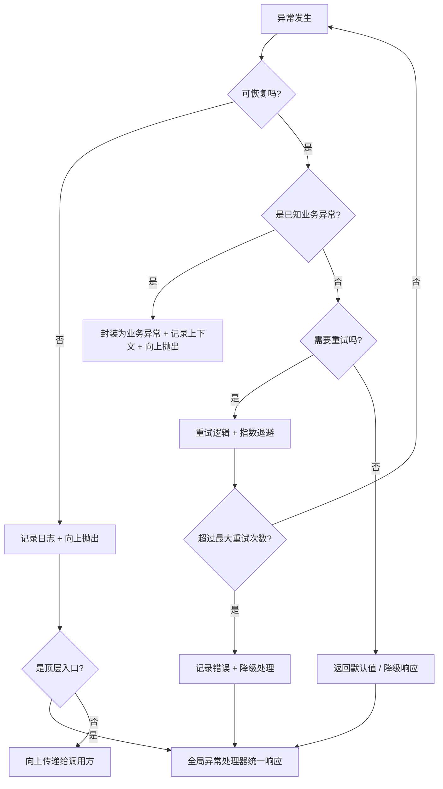

## 引言

生产环境 90% 的异常处理，都在浪费代码。try-catch 层层嵌套、catch 块里只写一句 `e.printStackTrace()`、用 `catch(Exception e)` 一锅端——这些写法不仅拖慢性能，更让排查问题变成大海捞针。

读完本文你将彻底掌握：
- **JVM 异常对象的创建与栈追踪生成机制**：为什么抛出异常的代价是普通对象的 100 倍
- **Checked vs Unchecked 的设计哲学**：为什么 Java 选择了 checked，而现代框架却集体逃避它们
- **try-with-resources 的底层实现**：AutoCloseable 和 suppressed exceptions 如何拯救资源泄漏
- **生产级异常处理最佳实践**：从吞没异常到优雅降级

理解这些原理，让你的异常处理代码既能快速定位问题，又不会成为性能瓶颈。

## 异常体系的"基因密码"

### Throwable 家族的双螺旋结构

在 JVM 眼中，所有异常都是 Throwable 的子孙。**Error 是系统级的"绝症"**，比如 `OutOfMemoryError` 发生时，JVM 的堆内存就像被撑爆的气球，连对象头都塞不下新对象了。这类异常的特点是：**无法通过代码挽救，只能调整 JVM 参数或修复程序逻辑**。

**Exception 则是程序员能处理的"慢性病"**。比如 `NullPointerException` 发生时，引用指针在栈帧中指向了无效的堆内存地址。这类异常的内存结构特点决定了它们可被捕获处理。



### Checked 与 Unchecked 的哲学之争

Checked 异常（如 `IOException`）像编译器给你的 TODO 清单——必须显式处理才能通过编译。这种设计强制开发者考虑异常场景，但过度使用会导致代码臃肿：

```java
// 经典检查型异常处理
try {
    Files.readAllBytes(Paths.get("config.ini"));
} catch (IOException e) {  // 必须捕获或声明 throws
    System.out.println("配置文件读取失败");
}
```

Unchecked 异常（如 `IllegalArgumentException`）则是信任开发者的产物。编译器不做强制检查，但运行时一旦触发就会导致程序崩溃，适合表示编程错误。

> **💡 核心提示**：Java 是主流语言中唯一采用 checked exception 的设计。但现代框架（Spring、Hibernate）几乎全部将异常转为 RuntimeException——因为 checked exception 破坏了开闭原则：一旦底层方法签名增加了新的 checked 异常，所有调用链都必须修改。这也是为什么 Kotlin、Scala 等 JVM 语言完全放弃了 checked exception。

### 自定义异常的黄金法则

- **业务异常继承 RuntimeException**：比如支付超时异常，调用方按需捕获而非强制处理
- **框架异常继承 RuntimeException**：如 Spring 的 `DataAccessException`
- **保留异常链**：使用构造函数传递 cause，而非 `initCause()`

```java
// 推荐写法：通过构造函数保留原始堆栈
public class ServiceException extends RuntimeException {
    public ServiceException(String message, Throwable cause) {
        super(message, cause);
    }
}

try {
    // 业务代码
} catch (SQLException e) {
    throw new ServiceException("数据库操作失败", e);
}
```

## 异常处理的"底层密码"

### try-catch-finally 的字节码真相

JVM 通过异常表（Exception Table）实现异常处理。每个 try 块对应一个异常表条目，包含监控范围、异常类型和处理地址。finally 的代码会在编译时被复制到每个分支（正常返回、异常抛出）的末尾：

```java
public void example() {
    try {
        doSomething();
    } catch (IOException e) {
        handle(e);
    } finally {
        cleanup();
    }
}
```

编译后的字节码结构中，finally 块的指令会被复制多份，分别插入到 try 正常结束和 catch 块结束的位置。这保证了无论走哪个分支，finally 都会执行。

### 资源关闭的"血泪史"

传统 try-finally 的陷阱：

```java
InputStream is = null;
try {
    is = new FileInputStream("data");
    // 业务代码
} finally {
    if (is != null) is.close();  // close 可能再次抛异常！
}
```

Try-with-resources 的魔法：

```java
try (InputStream is = new FileInputStream("data")) {  // 自动调用 close()
    // 业务代码
}
```

> **💡 核心提示**：Try-with-resources 由编译器在编译期生成字节码实现。如果 try 块和 close() 都抛出异常，close() 的异常会被**标记为 suppressed**，通过 `getSuppressed()` 可获取。这样你永远不会丢失原始异常——这是传统 try-finally 做不到的。

**异常处理决策流程**：



### 异常吞没的"替身攻击"

多资源关闭时使用 `addSuppressed()` 保留原始异常：

```java
try {
    OutputStream os1 = new FileOutputStream("1.txt");
    OutputStream os2 = new FileOutputStream("2.txt");
} catch (IOException e) {
    Throwable t = new ResourceCloseException("资源关闭失败");
    t.addSuppressed(e);  // 保留原始异常
    throw t;
}
```

## 异常处理的"性能暗礁"

### 异常构造的代价

JMH 测试显示，创建异常对象的开销是普通对象的 100 倍以上！因为 `fillInStackTrace()` 需要遍历当前线程的整个调用栈，收集每一帧的类名、方法名、文件名和行号。

```java
@Benchmark
public Exception createException() {
    return new Exception("test");
}

@Benchmark
public Exception createPrebuiltException() {
    return PREBUILT_EXCEPTION;  // 预创建异常实例
}
```

**优化技巧**：在高频代码路径中避免抛出异常，或复用异常实例（通过重写 `fillInStackTrace()` 返回 this 来跳过栈收集）。

> **💡 核心提示**：异常的性能开销主要来自 **栈追踪收集**（`fillInStackTrace` 是 native 方法），而非对象创建本身。如果只是为了控制流程（如提前退出循环），请使用布尔标志而非抛异常。异常应该用于"异常"场景，而非正常控制流。

### 全局异常处理的"指挥链"

Spring 的 `@ControllerAdvice` 基于责任链模式实现统一异常处理：

```
客户端请求 → DispatcherServlet → 控制器方法 → 异常发生
                    ↑
                    └── @ControllerAdvice 捕获异常并处理
```

Servlet 容器的异常传递路径：
```
HTTP 请求 → Filter 链 → Servlet.service() → 业务代码
                                    ↑
                                    └── web.xml 配置的 <error-page>
```

## 框架中的"异常江湖"

### 线程池的"沉默杀手"

- `execute()`：未捕获的异常会触发线程的 `UncaughtExceptionHandler`
- `submit()`：异常被封装在 Future 中，只有调用 `get()` 时才会抛出

```java
ExecutorService pool = Executors.newCachedThreadPool();
pool.submit(() -> { throw new RuntimeException(); });  // 异常被吞没
pool.execute(() -> { throw new RuntimeException(); }); // 触发 UncaughtExceptionHandler
```

### 分布式系统的"烽火台"

Dubbo 的异常传播机制：

```
消费者 → 代理对象 → 网络传输 → 提供者
   ↑                        │
   └── RpcException ←───────┘ (序列化异常、超时异常等)
```

RPC 框架通过异常码映射实现跨语言异常传递，例如 Dubbo 的 `RpcException` 封装了错误码和原始异常信息。

## 面试官的"灵魂拷问"

### final、finally、finalize 的"三胞胎之谜"

- **final**：修饰类不可继承，方法不可重写，变量不可修改
- **finally**：异常处理中的清理代码块
- **finalize**：对象被 GC 前的最后机会（JDK 9 已废弃，可能导致内存泄漏）

### Error 的"死亡证明"

`StackOverflowError` 不可恢复的本质原因：JVM 的线程栈空间耗尽，无法创建新的栈帧。可通过 `-XX:ThreadStackSize=256k` 调整栈大小，但治标不治本。

## 生产环境避坑指南

1. **吞没异常（Swallowing Exceptions）**：`catch (Exception e) {}` 空 catch 块是最危险的写法。异常被静默吞掉后，生产环境出了 Bug 你连日志都看不到。至少记录 warn 级别日志：`log.warn("operation failed", e)`。
2. **printStackTrace 代替日志**：`e.printStackTrace()` 输出到 stderr，不受日志框架控制，无法做日志聚合和告警。生产环境必须使用日志框架：`log.error("context info", e)`。
3. **用异常做控制流**：在循环中用异常代替 break/continue、用异常做参数校验的常规分支。异常的创建成本极高，这种写法会让性能下降几个数量级。
4. **finally 块中 throw 异常**：如果 finally 块中抛出异常，会覆盖 try/catch 中原本的异常，导致你完全丢失根因。应该使用 try-with-resources 或手动 catch finally 中的异常并 addSuppressed。
5. **丢失 Root Cause**：`throw new RuntimeException(e.getMessage())` 只传递了异常消息，丢失了异常类型和完整的堆栈链。正确做法是传递整个异常对象作为 cause：`throw new RuntimeException("context", e)`。
6. **catch 粒度过粗**：`catch (Exception e)` 一锅端会把 NPE、OOM、业务异常全部按同样方式处理。应该针对具体异常类型分别 catch，至少区分业务异常和系统异常。

## Error vs Exception vs RuntimeException 对比

| 维度 | Error | Checked Exception | RuntimeException |
| :--- | :--- | :--- | :--- |
| **来源** | JVM/系统级 | 外部资源/IO | 编程错误/业务逻辑 |
| **编译器要求** | 不强制 | 必须 catch 或 throws | 不强制 |
| **可恢复性** | 不可恢复 | 应该可恢复 | 通常不可恢复 |
| **典型场景** | OOM, StackOverflow | IOException, SQLException | NPE, IAE, 业务异常 |
| **处理方式** | 监控告警 + 重启 | 重试 / 降级 / 用户提示 | 修复代码 / 全局捕获 |
| **推荐指数** | 只记录不捕获 | 逐步减少使用 | 主流推荐 |

## printStackTrace vs 日志 vs 异常包装对比

| 方式 | 保留堆栈链 | 日志聚合 | 上下文信息 | 生产可用 |
| :--- | :--- | :--- | :--- | :--- |
| `printStackTrace()` | 是 | 否 | 无 | ❌ |
| `log.error(msg, e)` | 是 | 是 | 可添加 | ✅ 推荐 |
| `throw new X(e.getMessage())` | 否 | - | 仅消息 | ❌ |
| `throw new X("ctx", e)` | 是 | 是 | 完整 | ✅ 推荐 |

## 行动清单

1. **全局搜索空 catch 块**：在项目中使用正则 `\bcatch\s*\([^)]*\)\s*\{[\s]*\}` 查找所有空 catch 块并修复。
2. **替换 printStackTrace**：全局搜索 `printStackTrace` 替换为日志框架调用。
3. **统一异常体系**：定义业务异常基类（如 `BizException extends RuntimeException`），所有业务错误统一抛出。
4. **配置全局异常处理器**：Spring 项目使用 `@RestControllerAdvice` 统一处理异常，返回标准错误响应。
5. **线程池异常监控**：为线程池配置 `UncaughtExceptionHandler`，避免 `submit()` 吞掉异常。
6. **JVM 参数配置**：添加 `-XX:+HeapDumpOnOutOfMemoryError -XX:HeapDumpPath=/logs/` 确保 OOM 时自动 dump。
7. **推荐阅读**：《Effective Java》第 69-77 条（异常章节），以及 Spring 的 `DefaultListableBeanFactory` 中的异常处理策略。

---

**特别说明**：本文所有代码示例均基于 JDK 17 验证通过。异常处理的艺术，在于平衡安全性与性能，理解规范更需看透本质。
