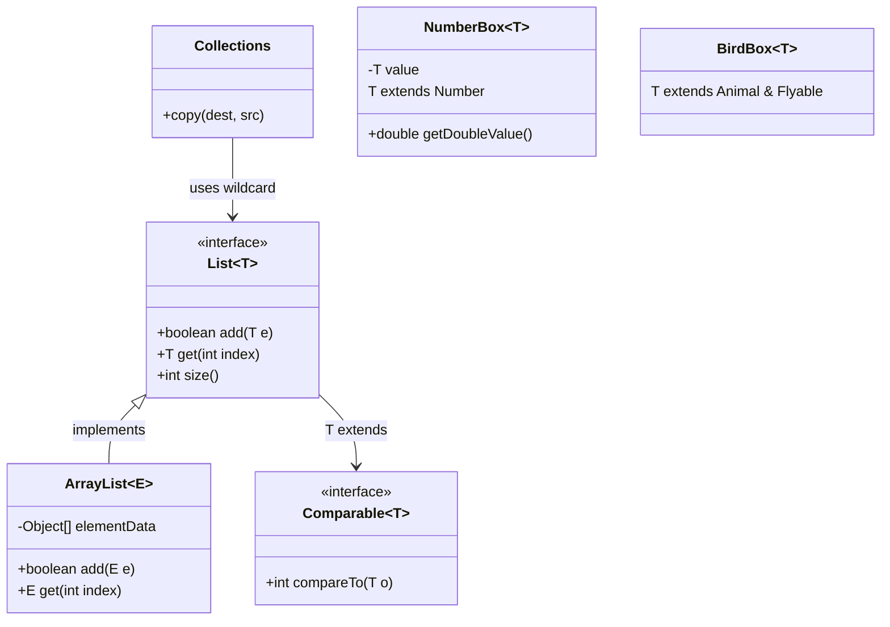
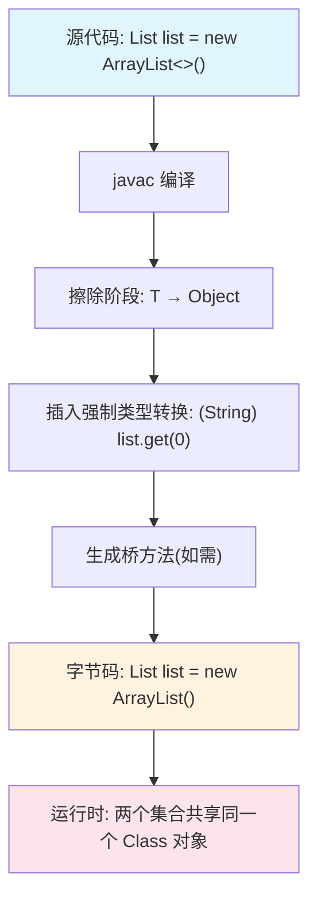

## 引言

为什么 `new ArrayList<String>().getClass()` 返回的不是 String 类型？为什么 `new T[]` 在 Java 中是非法的？如果你曾被这些问题困扰，说明你触碰到了 Java 泛型最核心的设计抉择——**类型擦除**。

读完本文你将掌握：类型擦除的底层原理与 JVM 兼容性考量、PECS 原则的类型论基础、桥方法的生成机制，以及生产环境中 90% 开发者都会踩中的泛型陷阱。面试中 90% 的人连 `? extends T` 和 `? super T` 的区别都说不清，而本文将从源码级别帮你彻底搞懂。



## 泛型的基本用法

泛型允许我们编写更通用、类型安全的代码，同时消除运行时类型转换。

### 泛型类与泛型方法

```java
// 泛型类
class Box<T> {
    private T value;
    
    public void set(T value) {
        this.value = value;
    }
    
    public T get() {
        return value;
    }
}

// 泛型方法（类型参数在返回类型前声明）
public class Utils {
    public static <T> T getFirst(List<T> list) {
        return list.get(0);
    }
    
    public static <K, V> V getValue(Map<K, V> map, K key) {
        return map.get(key);
    }
}
```

> **💡 核心提示**：泛型方法的 `<T>` 声明必须放在返回类型之前。`public <T> T getFirst()` 是正确的，`public T <T> getFirst()` 是语法错误。

### 类型边界与多重约束

```java
// 上界约束
class NumberBox<T extends Number> {
    private T value;
    public double getDoubleValue() {
        return value.doubleValue(); // 因为 T extends Number，所以可以调用
    }
}

// 多重边界：T 必须是 Animal 的子类且实现 Flyable
class BirdBox<T extends Animal & Flyable> {
}
```

> **💡 核心提示**：多重边界时，**类必须放在第一个位置**（`T extends Class & Interface1 & Interface2`），因为 Java 只支持单继承，编译器需要知道主类型是什么。

### 通配符与 PECS 原则

```java
// 上界通配符 —— 只能读（Producer）
public void processNumbers(List<? extends Number> numbers) {
    Number n = numbers.get(0); // OK
    // numbers.add(1); // 编译错误！无法确定具体子类型
}

// 下界通配符 —— 只能写（Consumer）
public void addIntegers(List<? super Integer> list) {
    list.add(1); // OK
    // Integer i = list.get(0); // 不行，只能拿到 Object
}

// 无界通配符
public void printList(List<?> list) {
    for (Object obj : list) {
        System.out.println(obj);
    }
}
```

> **💡 核心提示**：记住 PECS 口诀 —— **P**roducer **E**xtends, **C**onsumer **S**uper。如果你要从集合中读取数据（Producer），用 `? extends T`；如果要往集合中写入数据（Consumer），用 `? super T`；如果既读又写，不要用通配符。

### 泛型与静态成员、异常

```java
class GenericClass<T> {
    // 静态成员不能使用类型参数 T，因为 T 是实例级别的
    private static int count = 0;
    
    // 但静态方法可以有自己的泛型参数
    public static <E> E getFirst(List<E> list) {
        return list.get(0);
    }
}

// 泛型类不能继承 Throwable（不允许）
// class MyException<T> extends Exception {} // 编译错误
```

## 类型擦除的 JVM 实现原理

Java 泛型的核心机制是**类型擦除**——编译器在编译阶段将泛型类型参数替换为边界类型或 Object，确保字节码与 Java 5 之前的版本兼容。

### 为什么 Java 选择类型擦除？

2004 年 Java 5 引入泛型时，Sun 面临两个选择：

1. **具体化泛型**（如 C#）：运行时保留泛型信息，需要修改 JVM 和字节码格式。
2. **类型擦除**（Java 的选择）：编译期擦除泛型信息，字节码保持向后兼容。

Java 选择了方案 2，核心原因是**向后兼容性**——Java 5 之前的所有类库无需重新编译即可与新泛型代码互操作。代价是运行时无法通过反射直接获取泛型参数。

### 类型擦除过程



以 `List<String>` 为例，编译后等价于：

```java
// 编译前（源代码）
List<String> list = new ArrayList<>();
list.add("hello");
String s = list.get(0);

// 编译后（字节码等价代码）
List list = new ArrayList();
list.add("hello");
String s = (String) list.get(0); // 编译器自动插入强转
```

> **💡 核心提示**：`list.getClass()` 返回的是 `ArrayList.class`，泛型类型参数 `<String>` 在运行时完全不存在。这就是为什么 `new ArrayList<String>().getClass() == new ArrayList<Integer>().getClass()` 返回 `true`。

### 为什么不能用原始类型和 new T()？

> **💡 核心提示**：以下代码无法编译：
> ```java
> T obj = new T();        // 编译错误：运行时 T 已被擦除，不知道 new 哪个类
> T[] arr = new T[10];    // 编译错误：数组需要运行时类型信息
> if (obj instanceof T)   // 编译错误：无法在运行时检查 T
> List<int> list;         // 编译错误：泛型不能使用原始类型（int/double等）
> ```
> 原因统一归结于**类型擦除**：运行时 `T` 被替换为 `Object`，JVM 不知道该分配多大的内存。

### 桥方法的生成机制

当泛型类实现接口或继承泛型父类时，编译器会生成**桥方法**以保持多态性：

```java
public interface Comparable<T> {
    int compareTo(T o);
}

public class MyInteger implements Comparable<MyInteger> {
    // 用户代码
    public int compareTo(MyInteger o) { return this.value - o.value; }
    
    // 编译器自动生成的桥方法（javap -p 可见）
    // public bridge synthetic int compareTo(Object o) {
    //     return compareTo((MyInteger) o);
    // }
}
```

桥方法的作用：确保 `Comparable.compare(myInt, someObject)` 调用时，即使传入的是 Object，也能正确路由到 `compareTo(MyInteger)`。

## PECS 原则的深度应用

PECS（Producer Extends, Consumer Super）原则的数学基础源于**型变（Variance）理论**。

### 型变理论

| 型变类型 | 符号表示 | 含义 | Java 对应 |
|---------|---------|------|----------|
| 协变 | `B <: A → F(B) <: F(A)` | 子类型关系保持 | `? extends T` |
| 逆变 | `B <: A → F(B) :> F(A)` | 子类型关系反转 | `? super T` |
| 不变 | 无关系 | 子类型关系不传递 | `T`（无通配符） |

### 经典案例：Collections.copy

JDK 的 `Collections.copy` 是 PECS 的最佳实践：

```java
public static <T> void copy(List<? super T> dest, List<? extends T> src) {
    // dest 是消费者（写入数据），用 ? super T
    // src 是生产者（读取数据），用 ? extends T
    for (int i = 0; i < src.size(); i++) {
        dest.set(i, src.get(i));
    }
}
```

### 通配符对比表

| 通配符 | 能读 | 能写 | 返回类型 | 典型场景 |
|--------|------|------|---------|---------|
| `List<T>` | 是 | 是 | `T` | 既读又写的普通集合 |
| `List<? extends T>` | 是 | 否 | `T` | 只读的生产者集合 |
| `List<? super T>` | 否（只能拿到 Object） | 是 | `?` | 只写的消费者集合 |
| `List<?>` | 是（只能拿到 Object） | 否（只能 add null） | `Object` | 通用遍历 |

### 嵌套泛型的高级用法

```java
// 嵌套通配符：处理 List<List<? extends Number>>
public <T extends Number> void processNested(List<List<? extends T>> lists) {
    lists.stream()
        .flatMap(List::stream)
        .mapToDouble(Number::doubleValue)
        .sum();
}

// 递归类型边界：自引用工厂模式
interface Factory<T extends Factory<T>> {
    T create();
}
```

## 泛型与反射的交互

类型擦除导致运行时泛型信息丢失，但以下场景例外：

### 保留泛型信息的场景

```java
// 类继承时具体化的泛型参数
class StringList extends ArrayList<String> {}

// 通过反射获取
Type type = StringList.class.getGenericSuperclass();
// 输出: java.util.ArrayList<java.lang.String>
```

### TypeToken 模式

Guava 的 `TypeToken` 利用匿名内部类捕获泛型类型：

```java
TypeToken<List<String>> typeToken = new TypeToken<List<String>>() {};
Type type = typeToken.getType(); // 获取完整泛型信息
```

原理：匿名内部类会记录父类的泛型参数，`getGenericSuperclass()` 可以提取这些信息。

### 显式传递 Class 对象

```java
// 最直接的方案
public <T> T createInstance(Class<T> clazz) throws Exception {
    return clazz.getDeclaredConstructor().newInstance();
}
```

## JMH 性能测试：泛型 vs 原始类型

通过 JMH 基准测试对比泛型代码与原始类型代码的性能：

```java
@Benchmark
public void genericMethod(Blackhole bh) {
    List<Integer> list = new ArrayList<>();
    list.add(1);
    bh.consume(list.get(0)); // 编译器插入 (Integer) 强转
}

@Benchmark
public void rawTypeMethod(Blackhole bh) {
    List list = new ArrayList();
    list.add(1);
    bh.consume((Integer) list.get(0)); // 手动强转
}
```

测试结果表明，泛型代码的性能损耗**不超过 5%**。泛型的开销主要来自自动装箱（`int → Integer`），而非类型擦除本身。

## var 关键字对泛型类型推断的影响

Java 10 的 `var` 通过局部变量类型推断简化代码，但对泛型的推断能力有限：

```java
var list = new ArrayList<String>();       // 推断为 ArrayList<String>
var stream = list.stream().map(s -> s.length()); // 推断为 Stream<Integer>

// 陷阱：无法推断嵌套泛型
var emptyList = Collections.emptyList();  // 推断为 List<Object>，不是期望的具体类型
```

## Java 与 Scala/C# 泛型对比

| 特性 | Java | Scala | C# |
|------|------|-------|-----|
| 泛型实现 | 类型擦除 | 类型擦除 + Manifest | 具体化（运行时保留） |
| 声明点型变 | 不支持 | 支持（`+T`/`-T`） | 部分支持（`out T`/`in T`） |
| 使用点型变 | 通配符 `?` | 支持 | 不支持 |
| 泛型数组 | 不允许 | 通过 Manifest 支持 | 支持 |
| 原始类型 | 不允许 | 不支持 | 支持 |
| 向后兼容 | 完全兼容 | 完全兼容 | 需要 .NET 2.0+ |

## 生产环境避坑指南

### 1. 类型擦除导致的 ClassCastException

```java
List<String> strings = new ArrayList<>();
List raw = strings;           // 原始类型引用
raw.add(42);                   // 编译通过，但插入 Integer
String s = strings.get(0);     // 运行时 ClassCastException！
```

**对策**：永远不要使用原始类型，开启 IDE 的 unchecked warning 告警。

### 2. 泛型数组创建陷阱

```java
// 编译错误：Generic array creation
// List<String>[] array = new List<String>[10];

// 变通方案（不安全）
@SuppressWarnings("unchecked")
List<String>[] array = (List<String>[]) new List[10];
array[0] = new ArrayList<String>();
array[1] = new ArrayList<Integer>(); // 编译通过，堆污染！
```

**对策**：使用 `ArrayList<List<String>>` 替代数组。

### 3. 可变参数的堆污染（Heap Pollution）

```java
@SafeVarargs
static <T> void unsafeMethod(T... args) {
    Object[] objArray = args;
    objArray[0] = "不同类型"; // 堆污染
}
```

**对策**：对不修改数组内容的泛型可变参数方法添加 `@SafeVarargs` 注解。

### 4. 过度依赖泛型通配符

```java
// 不推荐：通配符嵌套过深，可读性极差
Map<? extends String, ? super List<? extends ? extends Number>> map;

// 推荐：使用类型别名或辅助类
class NumberListConsumer {
    Map<String, List<Number>> data;
}
```

### 5. 反射获取泛型类型的 NPE

```java
// 如果类没有泛型父类，getGenericSuperclass() 返回 Class<?> 而非 ParameterizedType
Type type = SomeClass.class.getGenericSuperclass();
// 直接强转会抛 ClassCastException
```

**对策**：先 `instanceof ParameterizedType` 再强转。

### 6. Lambda 表达式中的泛型推断失效

```java
// Java 8 中推断失败，Java 9+ 改进
Function<List<?>, Integer> func = list -> list.size();
// 某些复杂场景需要显式类型参数
```

## 对比表：通配符选择指南

| 通配符 | 可读 | 可写 | 适用场景 | 推荐度 |
|--------|------|------|---------|--------|
| `List<T>` | `T` | `T` | 既读又写 | ⭐⭐⭐⭐⭐ |
| `List<? extends T>` | `T` | 否 | 只读/生产者 | ⭐⭐⭐⭐⭐ |
| `List<? super T>` | `Object` | `T` | 只写/消费者 | ⭐⭐⭐⭐ |
| `List<?>` | `Object` | 否 | 通用遍历 | ⭐⭐⭐ |
| 原始类型 `List` | `Object` | `Object` | **禁止使用** | ⭐ |

## 行动清单

1. **审查代码库**：搜索所有原始类型用法（`List list`），替换为正确的泛型或通配符。
2. **应用 PECS 原则**：检查所有方法签名中的集合参数，确保 Producer 用 `extends`，Consumer 用 `super`。
3. **消除泛型数组**：将 `T[]` 替换为 `List<T>`，避免堆污染风险。
4. **添加 @SafeVarargs**：对所有不修改可变参数数组的泛型方法添加此注解。
5. **IDE 告警配置**：启用 unchecked cast 和 raw type 使用的高优先级警告。
6. **反射安全加固**：使用 `TypeToken` 模式或显式 `Class<T>` 参数替代直接获取泛型类型。
7. **理解桥方法**：通过 `javap -p YourClass.class` 查看编译器生成的桥方法，理解多态性保持机制。
8. **扩展阅读**：推荐阅读《Effective Java》第 5 章"泛型"（第 26-33 条）和 JLS 第 4 章"类型、值和变量"。
