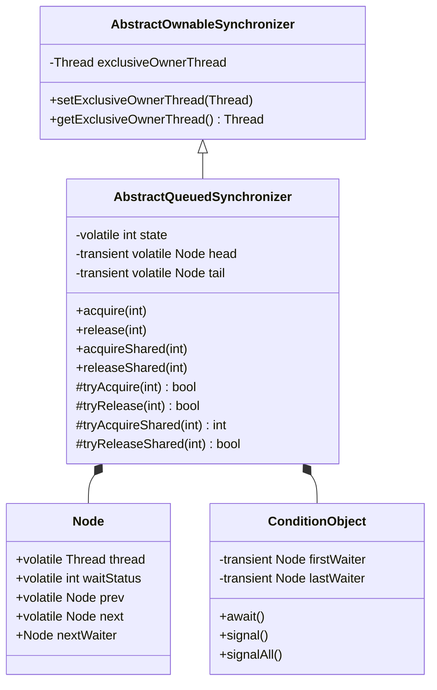
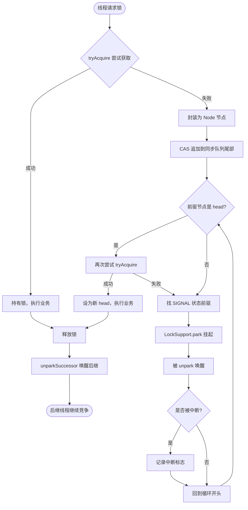
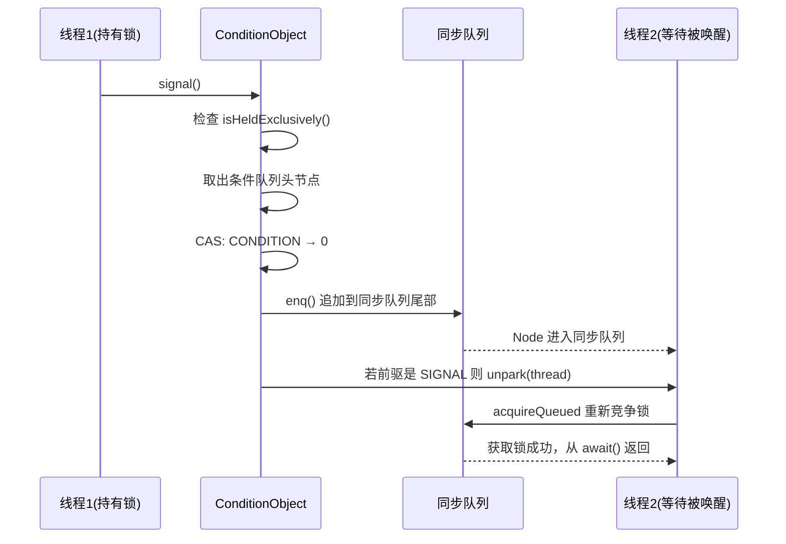

## 引言

ReentrantLock、CountDownLatch、Semaphore 这三个看似完全不同的并发工具，底层竟然都是同一个类？生产环境中因为 AQS 使用不当导致的线程死锁、信号丢失事故屡见不鲜。

`AQS`（AbstractQueuedSynchronizer，抽象队列同步器）是 Java 并发包的基石。`ReentrantLock`、`CountDownLatch`、`Semaphore`、`CyclicBarrier`、`ReentrantReadWriteLock` 全部基于它构建。不理解 AQS，就不可能真正掌握 Java 并发编程。

本文将从零拆解 AQS 的核心设计：CLH 队列变体如何管理等待线程、state 字段在不同子类中如何复写含义、模板方法模式如何编排加锁流程、条件队列与同步队列如何协作。读完本文，你将能看懂任何基于 AQS 构建的同步工具源码。

### 核心架构类图



### state 字段在子类中的语义

同一个 `state` 字段，在不同子类中代表完全不同的含义：

| 子类 | state 含义 | 初始值 | 加锁操作 | 释放操作 |
|:---|:---|:---|:---|:---|
| **ReentrantLock** | 重入次数 | 0 | +1 | -1 |
| **CountDownLatch** | 剩余计数 | N | -1 | 无 |
| **Semaphore** | 剩余许可数 | N | -1 | +1 |
| **ReentrantReadWriteLock** | 高16位=读锁计数，低16位=写锁重入次数 | 0 | 按位操作 | 按位操作 |

## AQS 加锁流程

如果让你设计一个同步锁，你会怎么设计？

一个完整的同步锁需要满足以下核心需求：

1. **互斥访问**：多个线程竞争同一临界资源时，只能有一个线程获取。需要 `state` 记录锁状态和持有线程 `exclusiveOwnerThread`，以及一个同步队列存储等待线程。
2. **条件等待**：持有锁的线程可以主动挂起（调用 `await()`）并释放锁，等待被其他线程唤醒。需要条件队列存储等待唤醒的线程。
3. **队列转移**：条件队列中被唤醒的线程不能直接获取锁，需要转移到同步队列重新竞争。

AQS 的加锁流程正是按上述需求设计的：



## AQS 的数据结构

```java
// AQS 继承自 AbstractOwnableSynchronizer，用于记录锁持有线程
public abstract class AbstractQueuedSynchronizer extends AbstractOwnableSynchronizer {

    // 同步状态：0=无锁，>0=已加锁（值的具体含义由子类决定）
    private volatile int state;

    // 同步队列的头尾节点
    private transient volatile Node head;
    private transient volatile Node tail;

    // Node 节点：包装线程放入队列
    static final class Node {
        volatile Thread thread;       // 节点绑定的线程
        volatile int waitStatus;      // 节点状态
        volatile Node prev;           // 前驱节点
        volatile Node next;           // 后继节点
        Node nextWaiter;              // 条件队列后继 / 同步队列共享标记
    }

    // 条件队列
    public class ConditionObject implements Condition {
        private transient Node firstWaiter;
        private transient Node lastWaiter;
    }
}
```

### 为什么继承 AbstractOwnableSynchronizer

`AbstractOwnableSynchronizer` 只有一个字段 `exclusiveOwnerThread`，用于记录当前持有锁的线程。这使得 AQS 可以判断"当前线程是否就是锁持有者"，这是实现**可重入锁**的基础。

```java
public abstract class AbstractOwnableSynchronizer {
    private transient Thread exclusiveOwnerThread;

    protected final void setExclusiveOwnerThread(Thread thread) {
        exclusiveOwnerThread = thread;
    }

    protected final Thread getExclusiveOwnerThread() {
        return exclusiveOwnerThread;
    }
}
```

### Node 节点与双队列复用

同步队列和条件队列共用同一个 `Node` 类，通过不同字段实现不同数据结构：

- **同步队列**：双向链表，使用 `prev` 和 `next` 链接。`head` 是哑节点（不存线程），`nextWaiter` 仅标记共享/排他模式。
- **条件队列**：单向链表，不使用 `prev` 和 `next`，而是通过 `nextWaiter` 链接。

> **💡 核心提示**：同一个 `Node` 类同时服务于两种队列，这种复用设计减少了内部类数量，也意味着 Node 从条件队列转移到同步队列时不需要创建新对象——只需修改 `waitStatus` 和重新链接 `prev/next` 即可。

### waitStatus 五种状态

| 值 | 常量名 | 含义 |
|:---|:---|:---|
| 1 | CANCELLED | 线程已取消（超时、中断），该节点将被跳过 |
| 0 | 默认 | 新创建的 Node 初始状态 |
| -1 | SIGNAL | 后继线程需要被唤醒，前驱释放锁时必须 unpark 后继 |
| -2 | CONDITION | 节点在条件队列中等待 |
| -3 | PROPAGATE | 共享模式下，释放锁时向后传播唤醒信号 |

状态流转示意：

```
新节点(0) → SIGNAL(-1) → 被唤醒 → 获取锁 → 移出队列
        ↘ CANCELLED(1) → 被跳过 → GC 回收
```

> **💡 核心提示**：为什么状态用负数表示有效值？因为 `waitStatus > 0` 统一表示 CANCELLED，判断"节点是否有效"只需检查 `waitStatus <= 0`，代码简洁且不易出错。

## AQS 方法概览

### 排他模式（独占锁）

```java
acquire(int arg);               // 加锁（不可中断）
acquireInterruptibly(int arg);  // 加锁（可中断）
tryAcquireNanos(int arg, long nanosTimeout); // 加锁（带超时）
release(int arg);               // 释放锁
```

### 共享模式

```java
acquireShared(int arg);               // 加共享锁
acquireSharedInterruptibly(int arg);  // 加共享锁（可中断）
tryAcquireSharedNanos(int arg, long nanosTimeout); // 加共享锁（带超时）
releaseShared(int arg);               // 释放共享锁
```

### 模板方法模式

AQS 定义了加锁/释放锁的流程框架，但**不实现**具体的加锁逻辑：

```java
protected boolean tryAcquire(int arg)              { throw new UnsupportedOperationException(); }
protected boolean tryRelease(int arg)              { throw new UnsupportedOperationException(); }
protected int tryAcquireShared(int arg)            { throw new UnsupportedOperationException(); }
protected boolean tryReleaseShared(int arg)        { throw new UnsupportedOperationException(); }
protected boolean isHeldExclusively()              { throw new UnsupportedOperationException(); }
```

> **💡 核心提示**：这就是模板方法模式的经典应用。AQS 作为抽象模板，定义了"尝试获取 → 入队 → 挂起 → 唤醒"的固定流程；ReentrantLock、Semaphore 等子类只需实现 `tryAcquire`/`tryRelease` 等钩子方法。面试中被问到"读过哪些框架源码用到了设计模式"，AQS 的模板模式是标准答案。

## 条件队列方法

```java
await()            // 等待并释放锁
await(long, TimeUnit)  // 等待指定时间
signal()           // 唤醒条件队列中的单个线程
signalAll()        // 唤醒条件队列中的所有线程
```

## 排他锁加锁详解

### 完整加锁流程

```java
public final void acquire(int arg) {
    // 1. 尝试获取锁（子类实现 tryAcquire）
    // 2. 失败则封装为 Node 追加到同步队列末尾
    // 3. 入队后挂起，等待被唤醒
    if (!tryAcquire(arg) &&
            acquireQueued(addWaiter(Node.EXCLUSIVE), arg)) {
        selfInterrupt();  // 恢复中断标志
    }
}
```

### addWaiter：入队逻辑

```java
private Node addWaiter(Node mode) {
    Node node = new Node(Thread.currentThread(), mode);
    Node pred = tail;
    if (pred != null) {
        node.prev = pred;
        // 快速路径：CAS 直接追加到尾部（竞争不激烈时大概率成功）
        if (compareAndSetTail(pred, node)) {
            pred.next = node;
            return node;
        }
    }
    // 慢速路径：死循环保证入队成功
    enq(node);
    return node;
}

private Node enq(final Node node) {
    for (;;) {
        Node t = tail;
        if (t == null) {
            // 队列为空，初始化 head 哨兵节点
            if (compareAndSetHead(new Node()))
                tail = head;
        } else {
            node.prev = t;
            if (compareAndSetTail(t, node)) {
                t.next = node;
                return t;
            }
        }
    }
}
```

> **💡 核心提示**：`enq` 方法中的 `compareAndSetHead(new Node())` 创建了一个**空哨兵节点**（不包含线程），这就是同步队列的 head。head 永远不代表等待的线程，只有 head.next 才是第一个有效等待节点。

### acquireQueued：排队等待

```java
final boolean acquireQueued(final Node node, int arg) {
    boolean failed = true;
    try {
        boolean interrupted = false;
        for (;;) {
            final Node p = node.predecessor();
            // 前驱是 head，说明轮到自己了，再次尝试获取锁
            if (p == head && tryAcquire(arg)) {
                setHead(node);    // 获取成功，把自己设为新 head
                p.next = null;    // 帮助 GC 回收旧 head
                failed = false;
                return interrupted;
            }
            // 没轮到或获取失败，找安全的节点后挂起
            if (shouldParkAfterFailedAcquire(p, node) &&
                    parkAndCheckInterrupt())
                interrupted = true;
        }
    } finally {
        if (failed)
            cancelAcquire(node);
    }
}
```

### shouldParkAfterFailedAcquire：寻找唤醒者

```java
private static boolean shouldParkAfterFailedAcquire(Node pred, Node node) {
    int ws = pred.waitStatus;
    if (ws == Node.SIGNAL)
        return true;  // 前驱已经是 SIGNAL，可以放心挂起
    if (ws > 0) {
        // 前驱已取消，跳过所有取消节点
        do {
            node.prev = pred = pred.prev;
        } while (pred.waitStatus > 0);
        pred.next = node;
    } else {
        // 将前驱状态设为 SIGNAL，告诉它"别忘了唤醒我"
        compareAndSetWaitStatus(pred, ws, Node.SIGNAL);
    }
    return false;
}
```

> **💡 核心提示**：为什么不能入队后立即 park？因为前驱节点可能已经取消，需要向前遍历找到一个有效节点，并将其状态设置为 SIGNAL。只有 SIGNAL 状态的节点释放锁时才会唤醒后继，否则线程将永久挂起。

### 释放锁

```java
public final boolean release(int arg) {
    if (tryRelease(arg)) {
        Node h = head;
        if (h != null && h.waitStatus != 0)
            unparkSuccessor(h);  // 唤醒后继有效节点
        return true;
    }
    return false;
}

private void unparkSuccessor(Node node) {
    int ws = node.waitStatus;
    if (ws < 0)
        compareAndSetWaitStatus(node, ws, 0);  // 重置 head 状态

    Node s = node.next;
    if (s == null || s.waitStatus > 0) {
        // 后继无效，从尾部向前找第一个有效节点
        s = null;
        for (Node t = tail; t != null && t != node; t = t.prev)
            if (t.waitStatus <= 0)
                s = t;
    }
    if (s != null)
        LockSupport.unpark(s.thread);
}
```

> **💡 核心提示**：为什么从尾向前找有效节点？因为入队时 `node.prev = t` 和 `compareAndSetTail` 是两步操作，在并发情况下 `next` 指针可能为 null，但 `prev` 指针一定可靠。从 tail 沿 `prev` 回溯可以确保不遗漏有效节点。

## await 与 signal：条件队列详解

### 条件队列转移时序图



### await 流程

```java
public final void await() throws InterruptedException {
    if (Thread.interrupted())
        throw new InterruptedException();
    // 1. 追加到条件队列末尾
    Node node = addConditionWaiter();
    // 2. 完全释放锁（保存重入次数）
    int savedState = fullyRelease(node);
    int interruptMode = 0;
    // 3. 在条件队列中挂起，等待被 signal 转移到同步队列
    while (!isOnSyncQueue(node)) {
        LockSupport.park(this);
        if ((interruptMode = checkInterruptWhileWaiting(node)) != 0)
            break;
    }
    // 4. 已转移到同步队列，参与锁竞争
    if (acquireQueued(node, savedState) && interruptMode != THROW_IE)
        interruptMode = REINTERRUPT;
    if (node.nextWaiter != null)
        unlinkCancelledWaiters();
    if (interruptMode != 0)
        reportInterruptAfterWait(interruptMode);
}
```

### signal 流程

```java
public final void signal() {
    if (!isHeldExclusively())
        throw new IllegalMonitorStateException();
    Node first = firstWaiter;
    if (first != null)
        doSignal(first);
}

private void doSignal(Node first) {
    do {
        if ((firstWaiter = first.nextWaiter) == null)
            lastWaiter = null;
        first.nextWaiter = null;
    } while (!transferForSignal(first) &&
            (first = firstWaiter) != null);
}

final boolean transferForSignal(Node node) {
    // CAS 将状态从 CONDITION 改为 0
    if (!compareAndSetWaitStatus(node, Node.CONDITION, 0))
        return false;
    // 追加到同步队列
    Node p = enq(node);
    int ws = p.waitStatus;
    // 设置前驱为 SIGNAL，或直接 unpark（前驱已取消或 CAS 失败时）
    if (ws > 0 || !compareAndSetWaitStatus(p, ws, Node.SIGNAL))
        LockSupport.unpark(node.thread);
    return true;
}
```

> **💡 核心提示**：`signal()` 不会直接唤醒线程，而是将节点从条件队列转移到同步队列。真正的唤醒发生在同步队列中前驱节点释放锁时（或转移时前驱已取消则立即 unpark）。这种两步设计保证了被 signal 的线程必须重新竞争锁，而不是直接拿到锁。

## 共享锁加锁详解

### 加锁流程

```java
public final void acquireShared(int arg) {
    if (tryAcquireShared(arg) < 0) {
        doAcquireShared(arg);
    }
}

private void doAcquireShared(int arg) {
    final Node node = addWaiter(Node.SHARED);
    boolean failed = true;
    try {
        boolean interrupted = false;
        for (;;) {
            final Node p = node.predecessor();
            if (p == head) {
                int r = tryAcquireShared(arg);
                if (r >= 0) {
                    // 获取成功：设为 head 并向后传播
                    setHeadAndPropagate(node, r);
                    p.next = null;
                    if (interrupted)
                        selfInterrupt();
                    failed = false;
                    return;
                }
            }
            if (shouldParkAfterFailedAcquire(p, node) &&
                parkAndCheckInterrupt()) {
                interrupted = true;
            }
        }
    } finally {
        if (failed)
            cancelAcquire(node);
    }
}
```

### setHeadAndPropagate：共享锁的核心差异

```java
private void setHeadAndPropagate(Node node, int propagate) {
    Node h = head;
    setHead(node);
    // 向后传播：唤醒后续共享节点一起获取锁
    if (propagate > 0 || h == null || h.waitStatus < 0 ||
        (h = head) == null || h.waitStatus < 0) {
        Node s = node.next;
        if (s == null || s.isShared()) {
            doReleaseShared();
        }
    }
}
```

> **💡 核心提示**：共享锁与排他锁的关键区别就在 `setHeadAndPropagate`。排他锁获取成功后只把自己设为 head，共享锁获取成功后还要调用 `doReleaseShared()` 向后传播，通知队列中的其他共享节点"一起来拿锁"。这就是 CountDownLatch.await() 可以被多个线程同时等待、同时被唤醒的原因。

### 释放共享锁

```java
public final boolean releaseShared(int arg) {
    if (tryReleaseShared(arg)) {
        doReleaseShared();
        return true;
    }
    return false;
}

private void doReleaseShared() {
    for (;;) {
        Node h = head;
        if (h != null && h != tail) {
            int ws = h.waitStatus;
            if (ws == Node.SIGNAL) {
                if (!compareAndSetWaitStatus(h, Node.SIGNAL, 0))
                    continue;
                unparkSuccessor(h);
            } else if (ws == 0 && !compareAndSetWaitStatus(h, 0, Node.PROPAGATE)) {
                continue;
            }
        }
        if (h == head)
            break;
    }
}
```

## CLH 队列变体设计

AQS 的同步队列基于 CLH（Craig, Landin, and Hagersten）锁队列的变体设计：

| 特性 | 原始 CLH | AQS 变体 |
|:---|:---|:---|
| 链表方向 | 单链表，新节点指向旧节点的 locked 字段 | 双链表，prev + next |
| 自旋方式 | 在前驱节点的 locked 字段上自旋 | 前驱为 SIGNAL 时 park 挂起（非自旋） |
| 节点存储 | 存储 locked 布尔值 | 存储 Thread 引用 + waitStatus |
| 适用场景 | 多处理器 SMP，自旋成本低 | 通用场景，挂起不浪费 CPU |

> **💡 核心提示**：为什么 AQS 不使用原始 CLH 的自旋方式？因为 Java 运行环境从单核 SMP 扩展到 NUMA 架构，自旋在多核竞争下会严重浪费 CPU 资源。AQS 采用"先尝试快速获取 → 入队 → park 挂起 → 被 unpark 唤醒 → 重新竞争"的混合策略，在低竞争和高竞争场景下都表现良好。

## 独占模式 vs 共享模式对比

| 维度 | 独占模式（Exclusive） | 共享模式（Shared） |
|:---|:---|:---|
| 使用场景 | ReentrantLock、写锁 | CountDownLatch、Semaphore、读锁 |
| 同时持有者 | 仅 1 个线程 | 多个线程 |
| tryAcquire 返回值 | boolean（成功/失败） | int（<0 失败，=0 成功无剩余，>0 成功有剩余） |
| 获取成功后 | 仅设置新 head | 设置新 head + doReleaseShared 向后传播 |
| 队列节点标记 | Node.EXCLUSIVE | Node.SHARED |
| 唤醒策略 | unpark 单个后继节点 | 可能同时唤醒多个共享节点 |

## 生产环境避坑指南

1. **AQS 子类实现复杂度高**：自定义同步器必须正确实现 `tryAcquire`/`tryRelease`，任何状态判断错误都可能导致线程永久挂死或活锁。除非有特殊需求，否则优先使用 JDK 内置的同步工具。

2. **可重入次数溢出**：ReentrantLock 的 state 是 int 类型，理论最大重入次数为 `Integer.MAX_VALUE`（2147483647）。虽然实际开发中几乎不可能达到，但如果业务逻辑存在递归加锁或循环嵌套加锁，需要警惕计数异常。

3. **中断处理的两面性**：`acquireInterruptibly` 和 `await` 会响应中断并抛出 `InterruptedException`。如果上层代码吞掉了异常（catch 后不处理），线程将带着中断标志继续运行，可能导致后续逻辑异常。

4. **Condition signal 丢失**：在调用 `signal()` 之前，必须确保已经有线程在 `await()` 中等待。先 signal 后 await 会导致信号丢失，线程永久挂起。正确使用顺序是：先 await，后 signal。

5. **tryRelease 必须保证 state 归零**：自定义同步器的 `tryRelease` 方法返回 `true` 表示锁完全释放。如果存在重入逻辑但忘记判断 `state == 0`，AQS 不会唤醒后继线程，导致死锁。

6. **共享模式的 PROPAGATE 状态竞争**：在高并发共享锁场景下，`doReleaseShared` 的 CAS 竞争可能导致 PROPAGATE 状态设置失败进入循环重试。这不是 bug，但如果频繁出现说明共享锁竞争过于激烈，应重新审视锁粒度设计。

## 总结

AQS 是 Java 并发包的核心骨架，理解它就理解了 ReentrantLock、CountDownLatch、Semaphore 等同步工具的底层原理。

### 关键操作时间复杂度

| 操作 | 无竞争 | 有竞争 | 说明 |
|:---|:---|:---|:---|
| tryAcquire（CAS） | O(1) | - | 一次 CAS 操作 |
| addWaiter（入队） | O(1) | O(1) 均摊 | enq 循环在竞争下可能多次重试 |
| acquireQueued（排队） | - | O(n) | n 为队列长度，每个节点最多被唤醒一次 |
| unparkSuccessor（唤醒） | O(1) | O(n) 最坏 | 从尾部回溯查找有效节点 |
| signal（条件转移） | O(1) | O(1) | 单次 CAS + enq |

### 行动清单

1. **阅读 AQS 源码顺序**：先看数据结构（state/Node/队列），再看排他锁加锁/释放流程，最后看共享锁和条件队列，不要一上来就陷入方法细节。
2. **面试准备**：熟练掌握 AQS 的模板方法模式、CLH 队列变体、waitStatus 五种状态含义、exclusive 和 shared 模式的区别。
3. **自定义同步器**：如果确实需要自定义同步器，继承 `AbstractQueuedSynchronizer` 并只实现 `tryAcquire`/`tryRelease` 方法，流程编排完全由 AQS 接管。
4. **调试技巧**：线上出现线程挂死问题时，通过 `jstack` 查看线程状态，关注 `parking to wait for` 关键字和 AQS 同步队列信息。
5. **性能调优**：高并发场景下，优先选择非公平锁（ReentrantLock 默认），公平锁的 `hasQueuedPredecessors` 检查会显著降低吞吐量。
6. **扩展阅读**：Doug Lea 的论文 "The java.util.concurrent Synchronizer Framework"（2005）是 AQS 的原始设计文档，值得一读。
