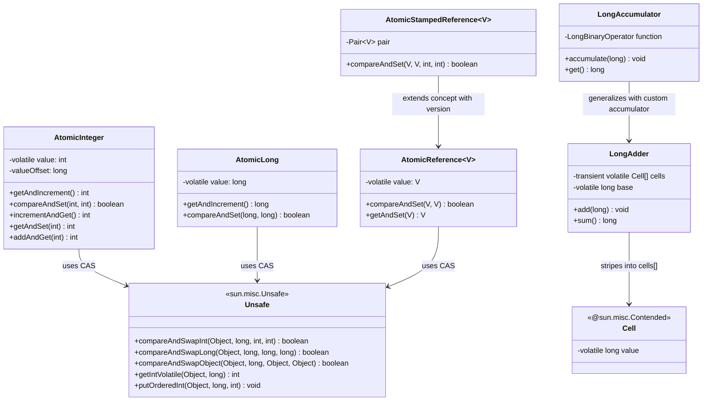
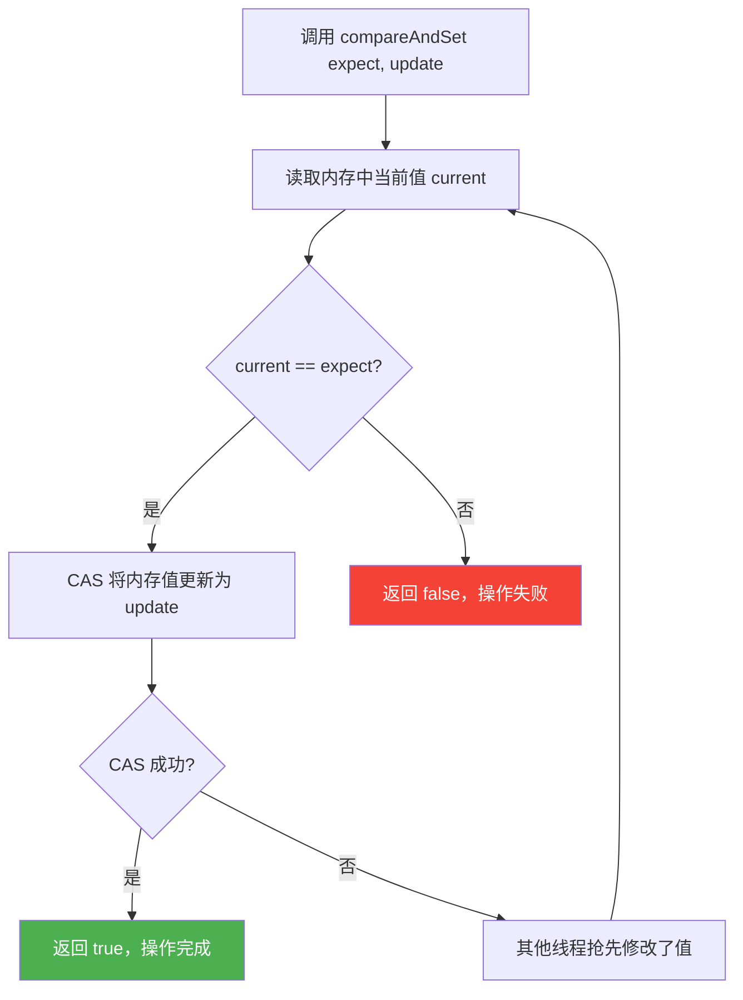
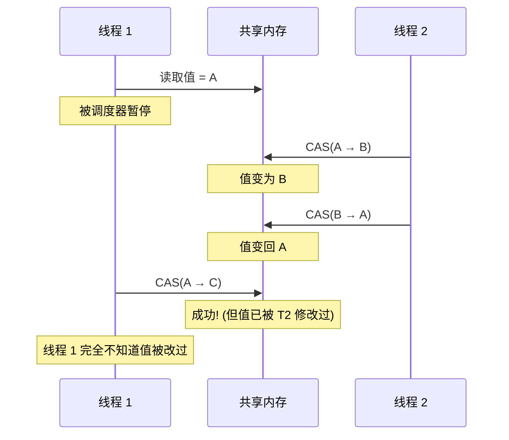

## 引言

`AtomicInteger` 的 `getAndIncrement()` 为什么不用 `synchronized`？答案藏在 CPU 的一条 `cmpxchg` 指令里 —— 它利用硬件级的 CAS 操作实现了 **无锁并发**，性能是 synchronized 的数倍。

然而，AtomicInteger 并非万能药。高竞争场景下 CAS 自旋会导致 **CPU 飙升**，ABA 问题可能引发 **数据静默损坏**，LongAdder 的细胞分段设计又引入了 **最终一致性** 的权衡。本文将从 **Unsafe 类源码**、**CPU cmpxchg 指令**、**ABA 问题实战** 到 **LongAdder 细胞分片**，全面剖析 Java 原子类的底层原理与生产环境最佳实践。

## 类关系图



## CAS 无锁更新机制

### Unsafe 类与 CPU 指令

`AtomicInteger` 的核心是 `Unsafe.compareAndSwapInt()`，它直接调用 CPU 的 **`cmpxchg`（Compare and Exchange）** 指令：

```java
public final class AtomicInteger extends Number {

    // 调用 Unsafe 获取 value 字段在内存中的偏移量
    private static final Unsafe unsafe = Unsafe.getUnsafe();
    private static final long valueOffset;

    static {
        valueOffset = unsafe.objectFieldOffset(AtomicInteger.class.getDeclaredField("value"));
    }

    // volatile 保证可见性
    private volatile int value;

    public final boolean compareAndSet(int expect, int update) {
        return unsafe.compareAndSwapInt(this, valueOffset, expect, update);
    }

    public final int getAndIncrement() {
        return unsafe.getAndAddInt(this, valueOffset, 1);
    }
}
```

`unsafe.getAndAddInt()` 的源码实现：

```java
public final int getAndAddInt(Object var1, long var2, int var4) {
    int var5;
    do {
        var5 = this.getIntVolatile(var1, var2);  // 读取当前值
    } while (!this.compareAndSwapInt(var1, var2, var5, var5 + var4));  // CAS 重试
    return var5;
}
```

### compareAndSet 执行流程



> **💡 核心提示**：CAS 循环**不会阻塞线程**，而是通过**自旋**（busy-waiting）不断重试。这意味着：锁竞争不激烈时 CAS 极快，但高竞争下大量线程空转，CPU 使用率会飙升至接近 100%。这就是所谓的 **CAS livelock**。

### 为什么 CAS 比 synchronized 快

| 对比维度 | synchronized | CAS (AtomicInteger) |
| --- | --- | --- |
| 实现层级 | JVM + OS mutex | CPU 硬件指令 (cmpxchg) |
| 线程调度 | 阻塞 → OS 调度 | 自旋 → 用户态循环 |
| 上下文切换 | 需要（用户态 ↔ 内核态） | 不需要 |
| 适用场景 | 临界区大、竞争激烈 | 临界区小、竞争适中 |
| 失败处理 | 进入等待队列 | 立即重试 |

## ABA 问题

### 什么是 ABA

CAS 操作只检查当前值是否等于预期值，但**无法感知中间是否发生过修改**。典型场景：



**真实场景举例**：

```java
// 银行账户余额问题
AtomicInteger balance = new AtomicInteger(100);

// 线程 1：扣款 30，期望余额 100 → 70
// 线程 2：先扣款 50 (100→50)，然后充值 50 (50→100)
// 线程 1 CAS(100, 70) 成功 —— 但实际上余额已经被动过了！
```

### AtomicStampedReference 解决方案

`AtomicStampedReference` 引入**版本号**（stamp），每次修改同时递增版本号：

```java
// Pair 数据结构
private static class Pair<T> {
    final T reference;
    final int stamp;  // 版本号
    private Pair(T reference, int stamp) {
        this.reference = reference;
        this.stamp = stamp;
    }
}

// CAS 时同时比较 reference 和 stamp
public boolean compareAndSet(V expectedReference, V newReference,
                             int expectedStamp, int newStamp) {
    Pair<V> current = pair;
    return expectedReference == current.reference &&
           expectedStamp == current.stamp &&
           ((newReference == current.reference && newStamp == current.stamp) ||
            casPair(current, Pair.of(newReference, newStamp)));
}
```

> **💡 核心提示**：`AtomicStampedReference` 解决 ABA 问题的核心是**每次修改都产生新的版本对**。即使值从 A → B → A，版本号也从 1 → 2 → 3，线程 1 的预期版本号 1 已经不匹配当前版本号 3，CAS 失败。

## LongAdder 高性能设计

### 为什么需要 LongAdder

在极高并发场景下，`AtomicLong` 的 CAS 自旋会导致大量冲突（多个线程同时对同一个内存地址做 CAS）。`LongAdder` 借鉴了 `ConcurrentHashMap` 的 **分段锁思想**：

```mermaid
flowchart LR
    subgraph LongAdder
        B[base: long]
        C[Cell 数组]
    end

    subgraph CellStriping
        C1["Cell[0] @Contended<br/>value = volatile long"]
        C2["Cell[1] @Contended<br/>value = volatile long"]
        C3["Cell[2] @Contended<br/>value = volatile long"]
        C4["Cell[n-1] @Contended<br/>value = volatile long"]
    end

    T1[线程 1] -->|hash & (n-1) = 0| C1
    T2[线程 2] -->|hash & (n-1) = 0| C1
    T3[线程 3] -->|hash & (n-1) = 2| C3
    T4[线程 4] -->|hash & (n-1) = 1| C2

    C1 --> B
    C2 --> B
    C3 --> B
    C4 --> B

    style B fill:#FFC107
    style C1 fill:#4CAF50,color:#fff
    style C2 fill:#4CAF50,color:#fff
    style C3 fill:#4CAF50,color:#fff
    style C4 fill:#4CAF50,color:#fff
```

### 工作流程

1. **低竞争时**：直接通过 CAS 更新 `base` 字段。
2. **竞争激烈时**：初始化 `Cell[]` 数组，线程通过 `getProbe() & (n - 1)` 计算索引，将值累加到各自对应的 Cell 中。
3. **获取总值时**：`sum()` 方法遍历所有 Cell，将 `base` 和各 Cell 的 value 累加。

```java
public long sum() {
    Cell[] as = cells;
    long sum = base;
    if (as != null) {
        for (Cell a : as) {
            if (a != null) {
                sum += a.value;
            }
        }
    }
    return sum;
}
```

> **💡 核心提示**：LongAdder 的 `sum()` 结果**不是强一致性的**。在累加过程中，如果有其他线程还在更新 Cell，`sum()` 返回的是一个快照值。因此 LongAdder 适用于**计数、统计**等允许最终一致性的场景，不适合对强一致性有要求的场景（如金融余额）。

### @Contended 缓存行填充

每个 Cell 都标注了 `@sun.misc.Contended` 注解，这是**缓存行填充**（Cache Line Padding）机制：

```java
@sun.misc.Contended
static final class Cell {
    volatile long value;
    Cell(long x) { value = x; }
}
```

CPU 缓存以 **缓存行**（通常 64 bytes）为单位读写。如果两个线程频繁修改相邻内存地址（同一个缓存行内），会导致**伪共享**（False Sharing）：一个线程的写入使另一个线程的缓存行失效。`@Contended` 通过填充字节确保每个 Cell 独占一个缓存行，消除伪共享。

> **注意**：启用 `@Contended` 需要在 JVM 启动参数中添加 `-XX:-RestrictContended`，否则该注解在普通代码中不生效。

## 四种原子累加器对比

| 特性 | synchronized (AtomicLong) | AtomicInteger / AtomicLong | LongAdder | LongAccumulator |
| --- | --- | --- | --- | --- |
| 底层机制 | OS mutex | CAS 自旋 | Cell 分段 + CAS | Cell 分段 + 自定义函数 |
| 竞争性能 | 低（阻塞开销大） | 中（高竞争下 CPU 飙升） | **高**（分散竞争） | **高**（分散竞争） |
| 一致性 | 强一致性 | 强一致性 | 最终一致性 | 最终一致性 |
| 功能 | 任意操作 | 固定加减操作 | 仅累加 | 自定义二元运算 |
| 内存开销 | 低 | 极低（1 个 volatile 字段） | 较高（Cell 数组 + 填充） | 较高（Cell 数组 + 填充） |
| 适用场景 | 大临界区操作 | 低竞争计数器 | 高竞争计数器 | 高竞争 + 自定义累积 |

## 生产环境避坑指南

### 1. 高并发下 CAS 活锁（Livelock）

当大量线程同时对同一个 AtomicInteger 做 CAS 时，大部分线程都会失败并重试。CPU 空转不做有意义的工作，使用率飙升至 100%。

```java
// 危险场景：1000 个线程同时 increment
AtomicInteger counter = new AtomicInteger(0);
for (int i = 0; i < 1000; i++) {
    new Thread(() -> {
        for (int j = 0; j < 1_000_000; j++) {
            counter.incrementAndGet();  // 高竞争 → CPU 飙升
        }
    }).start();
}
```

**对策**：高竞争场景改用 `LongAdder`。

### 2. ABA 导致的数据静默损坏

CAS 只检查值是否匹配预期值，不检查中间过程。在链表、栈等数据结构中，ABA 可能导致**野指针**或**数据不一致**：

```java
// 无锁栈的 ABA 问题
AtomicReference<Node> top = new AtomicReference<>();

// 线程 1：pop 操作
Node oldTop = top.get();      // oldTop = A
Node newTop = oldTop.next;    // newTop = B
// 线程 1 被暂停

// 线程 2：pop A，pop B，push A
// top 现在是 A，但 A.next 已经指向了一个被释放的节点

// 线程 1 恢复
top.compareAndSet(oldTop, newTop);  // CAS(A, B) 成功 —— 但栈已损坏！
```

**对策**：使用 `AtomicStampedReference` 或 `AtomicMarkableReference`。

### 3. LongAdder 不强一致

`LongAdder` 的 `sum()` 返回的是调用时刻的快照值，累加过程中可能有线程还在更新 Cell：

```java
LongAdder adder = new LongAdder();
adder.add(10);
// 其他线程同时 add(5)
long total = adder.sum();  // 可能是 10、15，或其他中间值
```

**对策**：需要强一致性的场景（如账户余额、库存扣减）必须使用 `AtomicLong` 或 `synchronized`。

### 4. LongAdder Cell 数组内存开销

`LongAdder` 在高竞争时初始化 `Cell[]` 数组，每个 Cell 通过 `@Contended` 填充了 128 字节（64 字节缓存行 × 2），如果 CPU 核心数多，内存开销不容忽视：

```
4 核 CPU: 4 Cell × 128 bytes = 512 bytes
32 核 CPU: 32 Cell × 128 bytes = 4 KB
64 核 CPU: 64 Cell × 128 bytes = 8 KB
```

**对策**：低竞争场景优先使用 `AtomicLong`，避免无谓的内存开销。

### 5. @Contended 需要 JVM 参数启用

`@sun.misc.Contended` 注解默认只对 JDK 内部类生效（`-XX:RestrictContended` 默认开启）。在自己的代码中使用需要添加 JVM 参数：

```bash
java -XX:-RestrictContended -jar your-app.jar
```

忘记添加此参数时，Cell 不会填充，伪共享问题依然存在，但不会有报错 —— **静默失效**。

### 6. compareAndSet 返回值被忽略

很多开发者调用 `compareAndSet()` 后不检查返回值，导致 CAS 失败时更新丢失：

```java
// 错误：忽略返回值
atomicInt.compareAndSet(expected, newValue);  // 可能失败！

// 正确：使用循环
int current, newValue;
do {
    current = atomicInt.get();
    newValue = compute(current);
} while (!atomicInt.compareAndSet(current, newValue));
```

### 7. AtomicIntegerArray 的陷阱

`AtomicIntegerArray` 的索引计算方式可能出乎意料 —— 它底层使用一个 long 数组，索引需要乘以 4（因为 int 占 4 字节）：

```java
// 注意：AtomicIntegerArray 内部存储做了缩放
AtomicIntegerArray array = new AtomicIntegerArray(1000000);  // 约 4MB
// 如果创建超大数组，注意内存消耗
```

## 总结

Java 原子类的选择取决于**竞争程度**和**一致性要求**：

- **低竞争、强一致**：`AtomicInteger` / `AtomicLong` —— CAS 自旋，简单高效
- **高竞争、可最终一致**：`LongAdder` —— Cell 分段，吞吐量远超 AtomicInteger
- **需要自定义累积**：`LongAccumulator` —— 传入任意二元函数
- **存在 ABA 风险**：`AtomicStampedReference` —— 版本号保护

> **黄金法则**：不要盲目用 CAS 替代 synchronized。当临界区代码超过 3-5 行、竞争激烈时，synchronized 的阻塞方案反而可能更快（因为不会空转消耗 CPU）。

## 行动清单

1. **审计 CAS 循环**：检查项目中所有 `compareAndSet` 调用是否检查了返回值，遗漏的会导致更新静默丢失。
2. **高竞争场景迁移**：将计数器场景的 `AtomicLong` 替换为 `LongAdder`，可获得 5-10 倍的吞吐量提升。
3. **排查 ABA 风险**：审查无锁数据结构（栈、队列）是否存在 ABA 隐患，必要时使用 `AtomicStampedReference`。
4. **启用缓存行填充**：如果使用自定义 Cell 结构，确保 JVM 启动参数包含 `-XX:-RestrictContended`。
5. **一致性评估**：确认 `LongAdder` 的使用场景是否允许最终一致性。金融/库存等强一致场景必须回退到 `AtomicLong`。
6. **JMH 性能测试**：在目标环境中用 JMH 基准测试 AtomicInteger vs LongAdder 的吞吐量，以数据驱动选型。
7. **扩展阅读**：推荐《Java 并发编程实战》第 15 章（原子变量与非阻塞同步机制）和 Doug Lea 的 JSR 166 文档。
