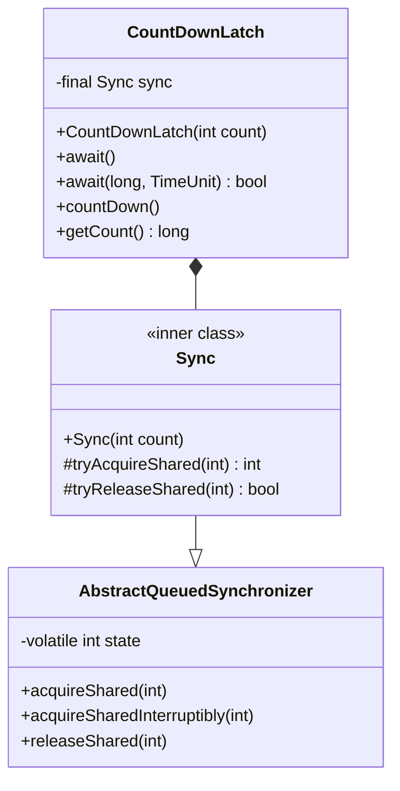
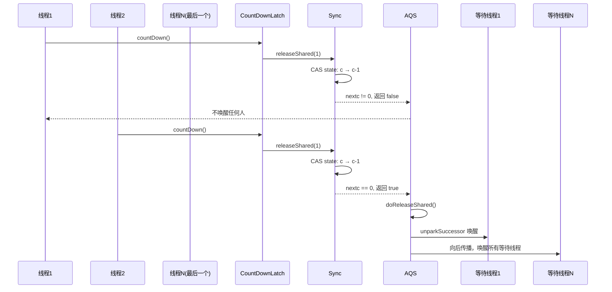

## 引言

主线程等待 5 个子任务完成，还在用 `Thread.join()`？

某电商大促页面加载接口，需要并行查询用户信息、商品库存、优惠券、推荐列表、物流状态 5 个服务。新手用串行调用耗时 500ms，用 Thread.join() 不仅代码冗长，还无法处理超时和异常。换成 CountDownLatch 后，代码行数减少一半，响应时间从 500ms 降到 120ms（最长子任务耗时）。

`CountDownLatch`（倒计时锁/闭锁）是 Java 并发包中最常用的共享同步工具。它通过一个计数器实现条件等待：多个线程执行 `countDown()` 递减计数器，等待线程调用 `await()` 阻塞直到计数器归零。本文将从源码层面解析它的 AQS 共享模式实现、一次性设计原理，以及与 Thread.join/CompletableFuture/CyclicBarrier 的对比选型。

### 核心架构类图



> **💡 核心提示**：CountDownLatch 没有直接继承 AQS，而是采用组合模式持有 Sync 内部类。Sync 继承 AQS，将计数器的值存储在 AQS 的 `state` 字段中。这种设计让 CountDownLatch 复用了 AQS 的整个等待/唤醒机制，自身只需实现 `tryAcquireShared` 和 `tryReleaseShared` 两个方法。

## 使用示例

### 场景一：等待多个子任务完成

最常见的用法：当前线程等待其他 N 个线程都执行完毕后继续执行。

```java
import java.util.concurrent.CountDownLatch;
import java.util.concurrent.ExecutorService;
import java.util.concurrent.Executors;

public class CountDownLatchTest1 {

    public static void main(String[] args) throws InterruptedException {
        ExecutorService executorService = Executors.newFixedThreadPool(3);
        CountDownLatch countDownLatch = new CountDownLatch(3);

        for (int i = 0; i < 3; i++) {
            executorService.submit(() -> {
                try {
                    Thread.sleep(1000); // 模拟查询数据库
                    System.out.println(Thread.currentThread().getName() + " 执行完成");
                    countDownLatch.countDown();
                } catch (InterruptedException e) {
                    Thread.currentThread().interrupt();
                }
            });
        }

        // 阻塞直到 3 个子任务全部完成
        countDownLatch.await();
        System.out.println("所有任务执行完成。");

        executorService.shutdown();
    }
}
```

输出结果：
```
pool-1-thread-2 执行完成
pool-1-thread-1 执行完成
pool-1-thread-3 执行完成
所有任务执行完成。
```

### 场景二：统一启动多个线程

让多个线程在同一时刻开始执行（模拟并发压力测试）：

```java
public class CountDownLatchTest2 {

    public static void main(String() args) throws InterruptedException {
        ExecutorService executorService = Executors.newFixedThreadPool(3);
        // 计数器为 1，所有线程等这一个信号
        CountDownLatch countDownLatch = new CountDownLatch(1);

        for (int i = 0; i < 3; i++) {
            executorService.submit(() -> {
                try {
                    System.out.println(Thread.currentThread().getName() + " 启动完成，等待信号");
                    countDownLatch.await(); // 阻塞等待
                    System.out.println(Thread.currentThread().getName() + " 收到信号，开始执行");
                    Thread.sleep(1000);
                    System.out.println(Thread.currentThread().getName() + " 执行完成");
                } catch (InterruptedException e) {
                    Thread.currentThread().interrupt();
                }
            });
        }

        Thread.sleep(100); // 确保所有线程都已启动并到达 await
        countDownLatch.countDown(); // 统一发令
        System.out.println("发令枪响！");

        executorService.shutdown();
    }
}
```

## countDown 方法源码

### countDown 时序图



`countDown()` 方法底层调用 AQS 的 `releaseShared()`：

```java
public void countDown() {
    sync.releaseShared(1);
}
```

AQS 的 `releaseShared()` 调用子类 Sync 的 `tryReleaseShared()`：

```java
// AQS 父类
public final boolean releaseShared(int arg) {
    if (tryReleaseShared(arg)) {  // 子类实现
        doReleaseShared();        // 唤醒所有等待线程
        return true;
    }
    return false;
}

// Sync 子类
protected boolean tryReleaseShared(int releases) {
    for (;;) {
        int c = getState();
        if (c == 0)
            return false; // 计数器已为 0，无需递减
        int nextc = c - 1;
        if (compareAndSetState(c, nextc))
            return nextc == 0; // 最后一个线程归零时返回 true
    }
}
```

核心逻辑：
1. **CAS 循环**保证计数递减的线程安全
2. 计数器减到 0 时返回 `true`，触发 AQS 的 `doReleaseShared()` 唤醒所有 await 线程
3. 计数器已经为 0 时调用 countDown 是**空操作**，不会有任何效果

> **💡 核心提示**：`tryReleaseShared` 使用 CAS 循环（for;;）而非加锁，是因为 countDown 是高频操作，多个线程可能同时递减计数器。CAS 无锁方式在低竞争下性能远优于加锁，即使在高竞争下也比锁的开销小得多。

## await 方法源码

### await 阻塞与 countDown 递减流程图

```mermaid
flowchart TD
    Start([await() 调用]) --> Acquire["acquireSharedInterruptibly(1)"]
    Acquire --> CheckInterrupt{"线程已中断?"}
    CheckInterrupt -->|是| ThrowIE[抛出 InterruptedException]
    CheckInterrupt -->|否| TryAcquire["tryAcquireShared: state == 0?"]
    TryAcquire -->|是, state=0| ReturnNow[计数器已归零, 立即返回]
    TryAcquire -->|否, state>0| DoAcquire["doAcquireSharedInterruptibly"]
    DoAcquire --> MakeNode["封装为 SHARED Node"]
    MakeNode --> Enqueue["追加到同步队列尾部"]
    Enqueue --> LoopCheck{"前驱是 head?"}
    LoopCheck -->|是| TryAgain["再次 tryAcquireShared"]
    TryAgain -->|state=0| SetHeadPropagate["setHeadAndPropagate, 返回"]
    TryAgain -->|state>0| Park
    LoopCheck -->|否| Park["LockSupport.park 挂起"]
    Park --> WakeUp["被 unpark 唤醒"]
    WakeUp --> LoopCheck

    CountDown([countDown() 调用]) --> CASLoop["CAS 循环递减 state"]
    CASLoop --> CheckZero{"nextc == 0?"}
    CheckZero -->|否| CDNop[返回 false, 不唤醒]
    CheckZero -->|是| CDTrigger["返回 true, 触发 doReleaseShared"]
    CDTrigger --> UnparkAll["唤醒同步队列中所有 SHARED 节点"]
```

```java
public void await() throws InterruptedException {
    sync.acquireSharedInterruptibly(1);
}
```

AQS 父类实现：

```java
public final void acquireSharedInterruptibly(int arg) throws InterruptedException {
    if (Thread.interrupted())
        throw new InterruptedException();
    // 尝试获取：state == 0 表示计数器已归零，立即返回
    if (tryAcquireShared(arg) < 0) {
        // state > 0，需要等待，进入共享模式排队
        doAcquireSharedInterruptibly(arg);
    }
}

// Sync 实现
protected int tryAcquireShared(int acquires) {
    return (getState() == 0) ? 1 : -1;
}
```

`tryAcquireShared` 的逻辑极简：
- `state == 0`：返回 1（成功），await 直接返回
- `state > 0`：返回 -1（失败），进入 AQS 同步队列等待

当计数器归零时，最后一个调用 countDown 的线程触发 `doReleaseShared()`，通过共享锁的传播机制唤醒所有等待线程。

## 总结

CountDownLatch 的源码之所以简洁，是因为 AQS 已经编排好了等待/唤醒的完整流程，CountDownLatch 只需要告诉 AQS"计数器是否归零"这一个信息。

### 与同类工具对比

| 维度 | CountDownLatch | Thread.join() | CompletableFuture | CyclicBarrier |
|:---|:---|:---|:---|:---|
| **可复用** | 否（一次性） | 否 | 否 | 是 |
| **触发方式** | countDown 计数归零 | 线程结束 | complete 完成 | await 到达屏障 |
| **API 复杂度** | 低（2 个方法） | 低（1 个方法） | 高（链式调用） | 中（1 个方法） |
| **支持超时** | 是 | 是 | 是 | 是 |
| **支持中断** | 是 | 是 | 是 | 是 |
| **可获取结果** | 否 | 否 | 是 | 否 |
| **适用场景** | 等待 N 个任务完成 | 等待单个线程结束 | 异步编排 + 结果聚合 | 线程互相等待到屏障点 |

### 关键操作时间复杂度

| 操作 | 复杂度 | 说明 |
|:---|:---|:---|
| countDown() | O(1) | 一次 CAS 操作，不竞争时直接返回 |
| countDown()（竞争） | O(1) 均摊 | CAS 失败时循环重试 |
| await()（未归零） | O(n) | n 为等待线程数，需入队 + park |
| await()（已归零） | O(1) | 直接返回，不阻塞 |

### 生产环境避坑指南

1. **计数器永远不到零（永久阻塞）**：如果某个子任务抛出异常而没有调用 countDown，计数器永远不会归零，await 线程永久挂死。**对策**：在 finally 块中调用 countDown()，或使用 `try { ... } finally { latch.countDown(); }`。

2. **尝试复用已归零的 CountDownLatch**：CountDownLatch 是一次性设计，计数器归零后无法重置。如果需要循环使用，应改用 CyclicBarrier。

3. **countDown 放错位置**：把 countDown 放在业务逻辑中间而不是 finally 中，会导致异常时计数器不减。确保 countDown 在任何执行路径下都被调用。

4. **await 期间线程中断**：`await()` 会响应中断并抛出 `InterruptedException`。如果业务不希望被中断，应捕获异常后重新中断当前线程，或改用 `await(timeout, unit)` 带超时版本。

5. **计数器初始值设置错误**：countDown 的调用次数必须等于构造时传入的初始值。如果启动了 5 个线程但计数器设为 3，会有 2 次 countDown 被忽略；如果设为 5 但只启动 3 个线程，则永远无法归零。

6. **await 放在错误的位置**：主线程必须先提交所有子任务，再调用 await。如果先 await 再提交任务，且子任务数量为 0（计数器也为 0），await 会立即返回导致业务逻辑跳过。

### 行动清单

1. **始终在 finally 中 countDown**：无论业务逻辑是否成功，都要确保计数器被递减，避免 await 永久阻塞。
2. **合理设置初始计数**：确保 countDown 的调用次数与初始值一致，多一次无害，少一次就是死锁。
3. **优先使用带超时的 await**：`await(5, TimeUnit.SECONDS)` 而非 `await()`，避免线上因异常导致永久阻塞。
4. **需要结果聚合时用 CompletableFuture**：CountDownLatch 只能等待，无法获取子任务结果。如果需要汇总结果，使用 `CompletableFuture.allOf()`。
5. **需要循环使用时改用 CyclicBarrier**：CountDownLatch 是一次性的，如果需要多轮屏障同步，使用 CyclicBarrier。
6. **监控计数器状态**：通过 `getCount()` 可以在日志或监控中打印当前计数值，帮助排查"为什么还没放行"的问题。
