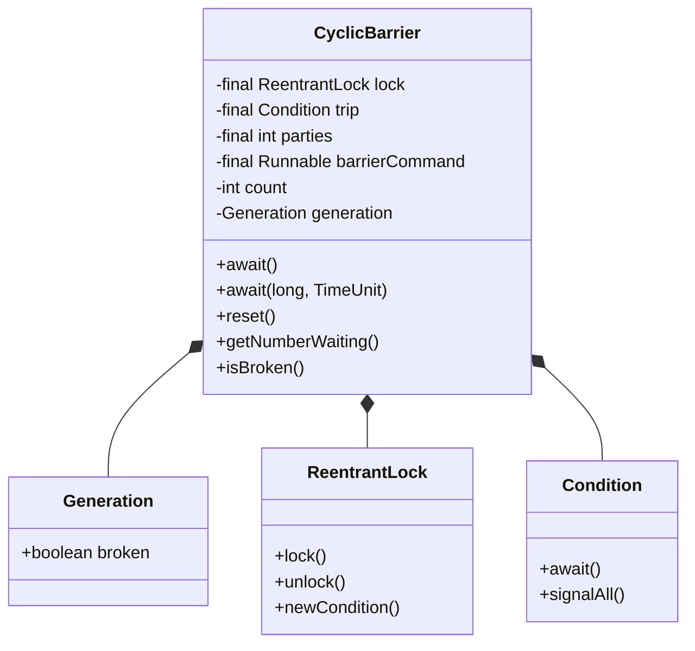
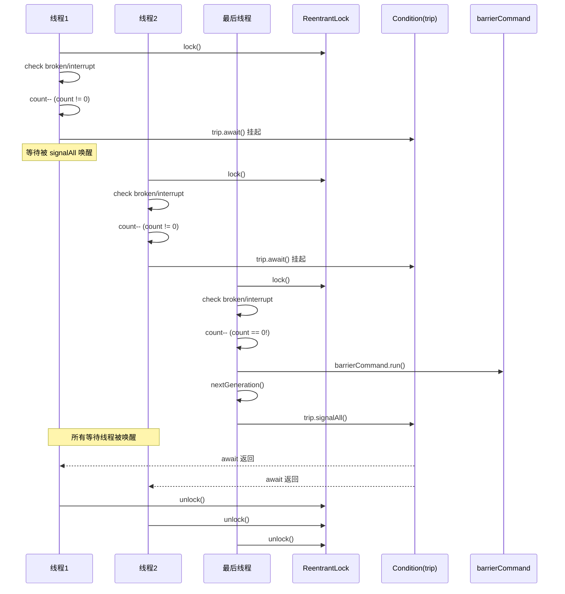
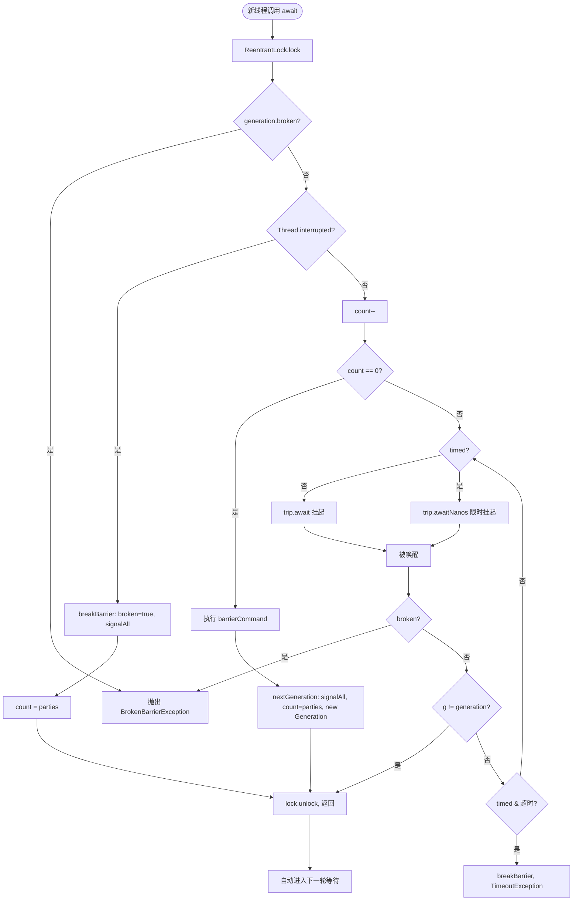

## 引言

10 个玩家等待全员就位再开局，怎么做？

某多人在线游戏中，房间需要等待 10 个玩家全部准备好后才开始匹配。用 10 个 Thread.join 代码混乱且无法复用，用 CountDownLatch 只能玩一局——玩家需要重新创建 latch。`CyclicBarrier`（循环栅栏）天然支持这种"等多轮"的场景：每轮玩家就位后自动重置，下一轮继续使用。

`CyclicBarrier` 内部基于 `ReentrantLock + Condition` 实现，与基于 AQS 共享模式的 CountDownLatch 形成鲜明对比。本文将从源码层面解析它的 Generation 概念、循环复用机制、broken 状态设计，以及与 CountDownLatch/Phaser 的选型对比。

### 核心架构类图



> **💡 核心提示**：CyclicBarrier 与 CountDownLatch 最大的架构差异在于——CyclicBarrier 内部直接使用 `ReentrantLock + Condition`，不经过 AQS 的同步队列；而 CountDownLatch 通过内部 Sync 类继承 AQS，走的是 AQS 共享模式路线。这意味着 CyclicBarrier 的等待/唤醒机制更加直接，但也失去了 AQS 的一些高级特性（如共享锁传播）。

## 使用示例

```java
import lombok.extern.slf4j.Slf4j;
import java.util.concurrent.CyclicBarrier;
import java.util.concurrent.ExecutorService;
import java.util.concurrent.Executors;

@Slf4j
public class CyclicBarrierTest {

    public static void main(String[] args) throws InterruptedException {
        ExecutorService executorService = Executors.newCachedThreadPool();

        // 循环栅栏，线程数为 3
        CyclicBarrier cyclicBarrier = new CyclicBarrier(3);

        // 提交 9 个任务，刚好循环 3 轮
        for (int i = 0; i < 9; i++) {
            Thread.sleep(100); // 避免并发提交
            executorService.execute(() -> {
                try {
                    Thread.sleep(1000); // 模拟任务准备阶段
                    log.info(Thread.currentThread().getName() + " 准备 " + cyclicBarrier.getNumberWaiting());
                    // 阻塞直到 3 个线程都到达栅栏
                    cyclicBarrier.await();
                    log.info(Thread.currentThread().getName() + " 执行完成");
                } catch (Exception e) {
                    // 实际项目中应记录日志
                }
            });
        }

        executorService.shutdown();
    }
}
```

输出结果：
```
10:00:00.001 [pool-1-thread-1] INFO - pool-1-thread-1 准备 0
10:00:00.002 [pool-1-thread-2] INFO - pool-1-thread-2 准备 1
10:00:00.003 [pool-1-thread-3] INFO - pool-1-thread-3 准备 2
10:00:00.003 [pool-1-thread-3] INFO - pool-1-thread-3 执行完成
10:00:00.003 [pool-1-thread-1] INFO - pool-1-thread-1 执行完成
10:00:00.004 [pool-1-thread-2] INFO - pool-1-thread-2 执行完成
10:00:00.010 [pool-1-thread-4] INFO - pool-1-thread-4 准备 0
...（第二轮、第三轮以此类推）
```

`getNumberWaiting()` 返回当前已到达栅栏的线程数。示例中每 3 个线程为一组，到达后一起放行，9 个任务循环执行 3 轮。

## 类属性与初始化

```java
public class CyclicBarrier {

    // 互斥锁，保证线程安全
    private final ReentrantLock lock = new ReentrantLock();

    // 条件变量，等待/唤醒用
    private final Condition trip = lock.newCondition();

    // 每轮需要的线程数（固定不变）
    private final int parties;

    // 所有线程到达后执行的操作（由最后一个到达的线程执行）
    private final Runnable barrierCommand;

    // 当前轮剩余需要到达的线程数（可变）
    private int count;

    // 当前循环轮次（记录是否已 broken）
    private Generation generation = new Generation();

    private static class Generation {
        boolean broken = false;
    }
}
```

### 构造方法

```java
public CyclicBarrier(int parties) {
    this(parties, null);
}

public CyclicBarrier(int parties, Runnable barrierAction) {
    if (parties <= 0) {
        throw new IllegalArgumentException();
    }
    this.parties = parties;
    this.count = parties;
    this.barrierCommand = barrierAction;
}
```

> **💡 核心提示**：`barrierCommand` 由**最后一个到达栅栏的线程**执行，不是由单独的线程执行。这意味着 barrierCommand 的执行时间会计入最后一个线程的 await 耗时。如果 barrierCommand 耗时较长，会延迟整轮线程的放行。建议 barrierCommand 只做轻量操作（如状态标记、计数更新）。

## await 方法源码详解

### 完整调用时序图



### dowait 核心逻辑

```java
public int await() throws InterruptedException, BrokenBarrierException {
    try {
        return dowait(false, 0L);
    } catch (TimeoutException toe) {
        throw new Error(toe);
    }
}

private int dowait(boolean timed, long nanos)
        throws InterruptedException, BrokenBarrierException, TimeoutException {
    final ReentrantLock lock = this.lock;
    lock.lock();
    try {
        final Generation g = generation;

        // 1. 检查当前轮次是否已 broken
        if (g.broken) {
            throw new BrokenBarrierException();
        }

        // 2. 检查线程是否已中断
        if (Thread.interrupted()) {
            breakBarrier();
            throw new InterruptedException();
        }

        // 3. 计数器减一
        int index = --count;
        if (index == 0) {
            // 所有线程都已到达
            boolean ranAction = false;
            try {
                // 执行 barrierCommand（由最后一个到达的线程执行）
                final Runnable command = barrierCommand;
                if (command != null) {
                    command.run();
                }
                ranAction = true;
                // 开启下一轮
                nextGeneration();
                return 0;
            } finally {
                if (!ranAction) {
                    breakBarrier();
                }
            }
        }

        // 4. 不是最后一个线程，挂起等待
        for (;;) {
            try {
                if (!timed) {
                    trip.await();
                } else if (nanos > 0L) {
                    nanos = trip.awaitNanos(nanos);
                }
            } catch (InterruptedException ie) {
                if (g == generation && !g.broken) {
                    breakBarrier();
                    throw ie;
                } else {
                    Thread.currentThread().interrupt();
                }
            }

            if (g.broken) {
                throw new BrokenBarrierException();
            }

            // 正常唤醒（进入了下一轮）
            if (g != generation) {
                return index;
            }

            // 超时
            if (timed && nanos <= 0L) {
                breakBarrier();
                throw new TimeoutException();
            }
        }
    } finally {
        lock.unlock();
    }
}
```

### 打破栅栏

```java
private void breakBarrier() {
    generation.broken = true;  // 标记当前轮次已 broken
    count = parties;           // 重置计数器
    trip.signalAll();          // 唤醒所有等待线程
}
```

### 开启下一轮

```java
private void nextGeneration() {
    trip.signalAll();    // 唤醒所有等待线程
    count = parties;     // 重置计数器
    generation = new Generation(); // 创建新的 Generation
}
```

> **💡 核心提示**：Generation 对象的作用是什么？每一轮等待都会创建一个新的 Generation 实例。`broken` 标志是**针对当前轮次**的——如果某轮出现超时或中断，只打破当前这一代，reset 或自然进入下一轮后会创建新的 Generation，新轮次不受影响。这就是 CyclicBarrier"循环"的关键设计。

### Generation 生命周期流程图



## 其他常用方法

```java
// 带超时的等待
public int await(long timeout, TimeUnit unit)
        throws InterruptedException, BrokenBarrierException, TimeoutException {
    return dowait(true, unit.toNanos(timeout));
}

// 重置栅栏（强制开始新的一轮）
public void reset() {
    final ReentrantLock lock = this.lock;
    lock.lock();
    try {
        breakBarrier();   // 打破当前轮次
        nextGeneration(); // 立即开启新的一轮
    } finally {
        lock.unlock();
    }
}

// 当前轮次是否已 broken
public boolean isBroken() {
    final ReentrantLock lock = this.lock;
    lock.lock();
    try {
        return generation.broken;
    } finally {
        lock.unlock();
    }
}

// 已到达栅栏的线程数
public int getNumberWaiting() {
    final ReentrantLock lock = this.lock;
    lock.lock();
    try {
        return parties - count;
    } finally {
        lock.unlock();
    }
}
```

> **💡 核心提示**：`reset()` 的实现是先 `breakBarrier()` 再 `nextGeneration()`。这意味着 reset 会让当前轮次所有等待线程抛出 `BrokenBarrierException`（因为 broken=true 被 signalAll 唤醒了），然后立即开启新轮次。reset 适合在出现异常后强制重置栅栏，让后续线程可以继续使用。

## 总结

CyclicBarrier 通过 `ReentrantLock + Condition` 实现线程间的栅栏同步，以 `Generation` 概念实现循环复用，是 CountDownLatch 一次性设计的自然补充。

### 与同类工具对比

| 维度 | CyclicBarrier | CountDownLatch | Phaser |
|:---|:---|:---|:---|
| **可复用** | 是（自动重置） | 否（一次性） | 是 |
| **计数修改** | 不可变（构造时固定） | 不可变（构造时固定） | 动态（可 register/bulkRegister/deregister） |
| **屏障操作** | 支持（barrierCommand） | 不支持 | 支持（onAdvance） |
| **底层实现** | ReentrantLock + Condition | AQS 共享模式 | AQS（自旋 + park 混合） |
| **API 复杂度** | 低（await + reset） | 低（await + countDown） | 高（arrive/arriveAndAwait/arriveAndDeregister） |
| **broken 机制** | 是（超时/中断打破当前轮） | 无 | 是 |
| **适用场景** | 多轮线程同步、分阶段计算 | 等待 N 个任务完成 | 动态线程数 + 多阶段同步 |

### 关键操作时间复杂度

| 操作 | 复杂度 | 说明 |
|:---|:---|:---|
| await() | O(n) | n 为等待线程数，需要 acquire lock + 入 Condition 队列 |
| await()（最后一个线程） | O(1) | 执行 barrierCommand + signalAll |
| reset() | O(1) | 标记 broken + 重置 + signalAll |
| isBroken() | O(1) | 读取 boolean 字段 |
| getNumberWaiting() | O(1) | parties - count |

### 生产环境避坑指南

1. **不是所有线程都到达栅栏（永久阻塞）**：如果配置的 parties 为 5，但只有 4 个线程调用 await，第 4 个线程将永久阻塞。**对策**：确保异常路径也调用 await，或使用 `await(timeout, unit)` 带超时版本。

2. **超时导致 BrokenBarrierException**：某个线程 await 超时后，会打破当前栅栏，所有等待的线程都会收到 `BrokenBarrierException`。如果业务不预期此异常，应捕获并做补偿处理。

3. **在等待中的栅栏上调用 reset**：reset 会让当前轮次所有等待线程抛出 `BrokenBarrierException`。如果调用 reset 时有线程正在 await，这些线程不会被优雅唤醒。**对策**：确保 reset 在所有线程已放行后再调用。

4. **barrierCommand 抛出异常打破栅栏**：barrierCommand 由最后到达的线程执行，如果它抛出异常，会触发 `breakBarrier()`，导致当前轮次所有线程收到 `BrokenBarrierException`。**对策**：barrierCommand 中捕获所有异常，或只执行不会失败的操作。

5. **线程中断的连锁反应**：一个线程在 await 时被中断，会触发 breakBarrier，打破整个栅栏。如果业务不希望单个线程中断影响全局，应在中断处理中恢复栅栏状态，或改用超时机制。

6. **barrierCommand 的执行线程**：barrierCommand 由最后到达栅栏的线程执行，不是单独的线程。如果 barrierCommand 耗时长（如 IO 操作），会阻塞最后线程的返回时间。建议将耗时操作移到栅栏外执行。

### 行动清单

1. **优先使用带超时的 await**：`await(30, TimeUnit.SECONDS)` 而非 `await()`，避免单个线程异常导致全局永久阻塞。
2. **barrierCommand 只做轻量操作**：状态标记、日志记录等，避免 IO 或网络调用。耗时操作应在栅栏外执行。
3. **捕获 BrokenBarrierException**：业务代码必须处理 `BrokenBarrierException`，因为超时、中断、reset 都会触发。
4. **理解与 CountDownLatch 的区别**：CountDownLatch 是"等别人完成我再执行"，CyclicBarrier 是"我们互相等到齐了一起执行"。前者是一次性的，后者是可循环的。
5. **线程数不匹配时排查**：如果 parties 设置大于实际到达线程数，会导致永久阻塞。通过 `getNumberWaiting()` 和 `isBroken()` 可以诊断。
6. **扩展阅读**：推荐《Java 并发编程实战》第 5 章（构建块）中关于 CyclicBarrier 和 CountDownLatch 的对比分析，以及 Doug Lea 关于 Phaser 的设计论文。
