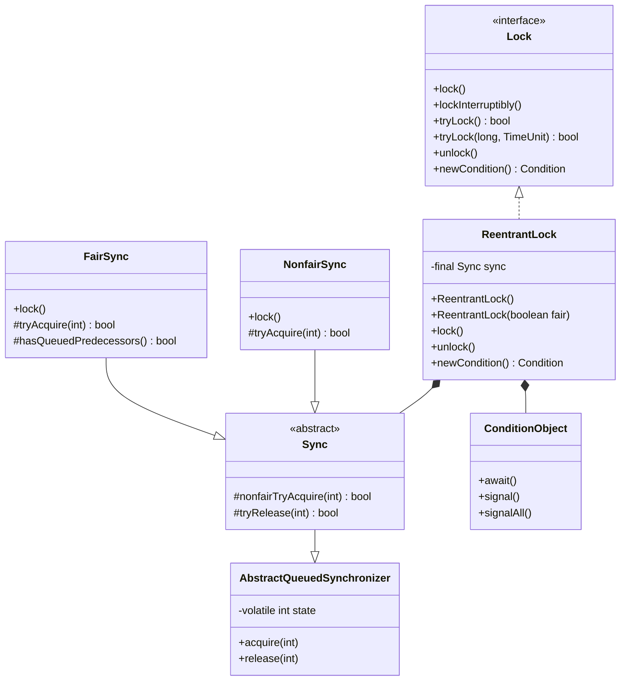
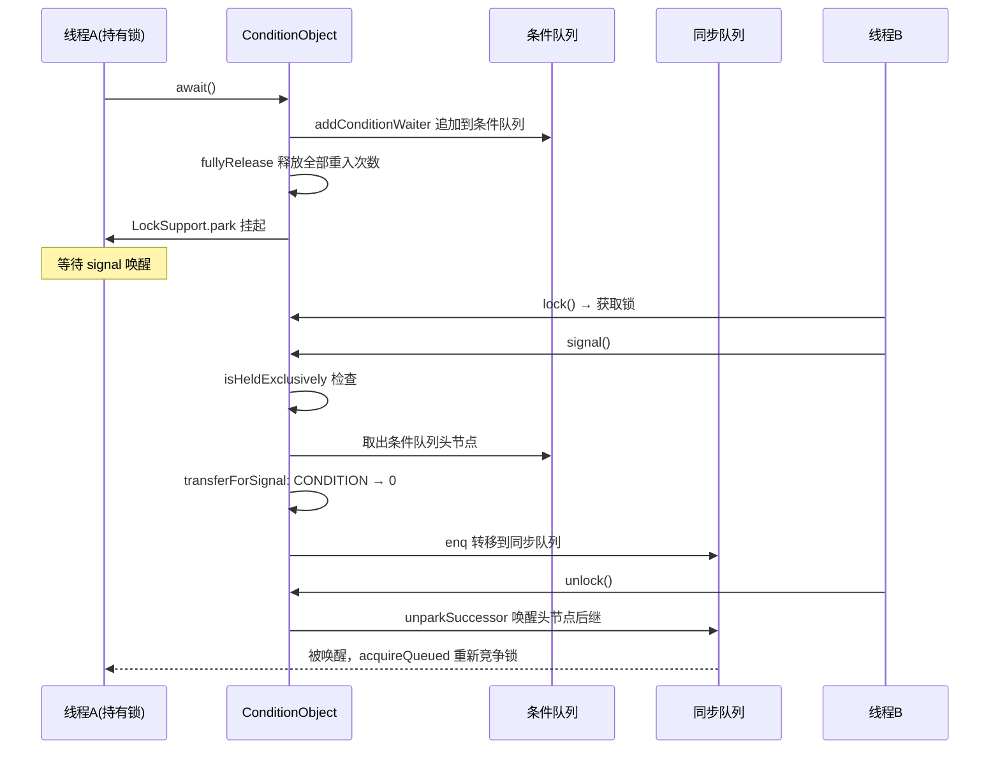

## 引言

synchronized 的替代方案，为什么大厂偏爱 ReentrantLock？

线上某个热点接口 QPS 突然跌零，排查后发现是 synchronized 在极端锁竞争下升级为重量级锁导致的上下文风暴。换成 `ReentrantLock(true)`（公平锁）后，虽然吞吐量略降，但延迟分布变得稳定可控。这就是理解 ReentrantLock 的价值——它给了你 synchronized 没有的选择权。

`ReentrantLock` 基于 AQS 构建，提供了公平/非公平锁、可中断加锁、超时等待、多条件变量等丰富功能。本文将从源码层面拆解它的加锁流程、公平与非公平的实现差异、以及 Condition 变量的底层机制。

### 核心架构类图



### state 字段语义

ReentrantLock 使用 AQS 的 `state` 字段记录**锁的重入次数**：

- `state = 0`：无锁状态
- `state = 1`：被某个线程持有（重入次数为 1）
- `state > 1`：同一线程多次重入

> **💡 核心提示**：ReentrantLock 的 `state` 是 int 类型，最大重入次数为 `Integer.MAX_VALUE`（2147483647）。虽然实际开发中几乎不可能达到，但如果业务逻辑存在递归加锁，需要警惕溢出导致的 `Error("Maximum lock count exceeded")`。

## ReentrantLock 的使用

```java
public class ReentrantLockDemo {

    private final ReentrantLock lock = new ReentrantLock();

    public void doSomething() {
        lock.lock();
        try {
            // 执行临界区代码
        } finally {
            // 必须在 finally 中释放锁，否则异常会导致锁永远不释放
            lock.unlock();
        }
    }
}
```

> **💡 核心提示**：`unlock()` 必须放在 `finally` 块中。如果业务代码抛出异常而没有 finally，锁将永远不会被释放，后续所有等待该锁的线程都会永久挂起——这是生产环境最常见的 ReentrantLock 使用错误。

### 构造方法

```java
// 默认构造：非公平锁
public ReentrantLock() {
    sync = new NonfairSync();
}

// 指定公平性
public ReentrantLock(boolean fair) {
    sync = fair ? new FairSync() : new NonfairSync();
}
```

## Lock 接口方法一览

```java
public interface Lock {
    void lock();                              // 加锁（不可中断，一直等待）
    void lockInterruptibly() throws InterruptedException;  // 可中断加锁
    boolean tryLock();                        // 尝试加锁，立即返回
    boolean tryLock(long time, TimeUnit unit) throws InterruptedException; // 超时等待加锁
    void unlock();                            // 释放锁
    Condition newCondition();                 // 创建条件变量
}
```

## 非公平锁源码解析

### 加锁流程时序图

```mermaid
sequenceDiagram
    participant T as 调用线程
    participant NFL as NonfairSync
    participant AQS as AQS(acquire)
    participant Sync as Sync(nonfairTryAcquire)
    participant QS as 同步队列
    participant LS as LockSupport

    T->>NFL: lock()
    NFL->>NFL: CAS state: 0 → 1
    NFL-->>T|成功| setExclusiveOwnerThread, 返回
    NFL->>AQS|失败| acquire(1)
    AQS->>Sync: tryAcquire(1)
    Sync->>Sync: state == 0? CAS 抢锁
    Sync->>Sync: current == owner? 重入 +1
    Sync-->>AQS|失败| false
    AQS->>QS: addWaiter 入队
    AQS->>QS: acquireQueued 排队等待
    QS->>LS: parkAndCheckInterrupt 挂起
    Note over LS: 等待前驱释放锁时 unpark
    LS-->>QS: 被唤醒
    QS->>Sync: 再次 tryAcquire
    Sync-->>QS|成功| setHead, 返回
```

### lock() 入口

```java
public void lock() {
    sync.lock();
}
```

### NonfairSync.lock()

```java
static final class NonfairSync extends Sync {
    final void lock() {
        // 1. 直接 CAS 抢锁（不管队列中有没有人在等）
        if (compareAndSetState(0, 1)) {
            setExclusiveOwnerThread(Thread.currentThread());
        } else {
            // 2. 抢锁失败，走 AQS 标准流程：入队 → 挂起
            acquire(1);
        }
    }
}
```

非公平锁的核心思想：**新来的线程不排队，直接尝试抢锁**。即使同步队列中已经有等待线程，新线程也有机会通过 CAS 直接获取锁。

### nonfairTryAcquire()：最终加锁方法

```java
abstract static class Sync extends AbstractQueuedSynchronizer {
    final boolean nonfairTryAcquire(int acquires) {
        final Thread current = Thread.currentThread();
        int c = getState();
        if (c == 0) {
            // 无锁状态，CAS 抢锁
            if (compareAndSetState(0, acquires)) {
                setExclusiveOwnerThread(current);
                return true;
            }
        } else if (current == getExclusiveOwnerThread()) {
            // 当前线程已持有锁，执行可重入逻辑
            int nextc = c + acquires;
            if (nextc < 0)  // 溢出保护
                throw new Error("Maximum lock count exceeded");
            setState(nextc);
            return true;
        }
        return false;
    }
}
```

加锁逻辑分三步：
1. `state == 0` 时 CAS 抢锁
2. 当前线程就是 owner 时，重入计数 +1
3. 否则加锁失败，返回 false

### 释放锁（公平与非公平共用）

```java
protected final boolean tryRelease(int releases) {
    int c = getState() - releases;
    if (Thread.currentThread() != getExclusiveOwnerThread()) {
        throw new IllegalMonitorStateException();
    }
    boolean free = false;
    if (c == 0) {
        free = true;
        setExclusiveOwnerThread(null);
    }
    setState(c);
    return free;
}
```

释放锁时，只有当 `state` 归零才算完全释放，此时才会清除 owner 并唤醒后继线程。

## 公平锁源码解析

### 公平 vs 非公平决策树

```mermaid
flowchart TD
    Start([lock() 调用]) --> IsFair{是否公平锁?}
    IsFair -->|非公平| NF_CAS["CAS state: 0→1"]
    NF_CAS -->|成功| NF_Hold["持有锁，返回"]
    NF_CAS -->|失败| NF_Acquire["acquire(1) → 入队"]
    NF_Acquire --> NF_Try{"nonfairTryAcquire"}
    NF_Try -->|state=0| NF_CAS2["CAS 抢锁（不排队）"]
    NF_Try -->|state>0 & 当前线程=owner| NF_Reentrant["重入计数+1"]
    NF_Try -->|否则| NF_Fail["返回false，park等待"]
    NF_CAS2 -->|成功| NF_Hold
    NF_CAS2 -->|失败| NF_Fail

    IsFair -->|公平| F_Check{"hasQueuedPredecessors"}
    F_Check -->|队列中有人| F_Fail["返回false，入队等待"]
    F_Check -->|队列中无人| F_CAS["CAS state: 0→1"]
    F_CAS -->|成功| F_Hold["持有锁，返回"]
    F_CAS -->|失败| F_Fail2["返回false，park等待"]
```

### FairSync.tryAcquire()

```java
static final class FairSync extends Sync {
    protected final boolean tryAcquire(int acquires) {
        final Thread current = Thread.currentThread();
        int c = getState();
        if (c == 0) {
            // 无锁状态：先检查队列中有没有人在等
            if (!hasQueuedPredecessors() &&
                    compareAndSetState(0, acquires)) {
                setExclusiveOwnerThread(current);
                return true;
            }
        } else if (current == getExclusiveOwnerThread()) {
            int nextc = c + acquires;
            if (nextc < 0)
                throw new Error("Maximum lock count exceeded");
            setState(nextc);
            return true;
        }
        return false;
    }

    public final boolean hasQueuedPredecessors() {
        Node t = tail;
        Node h = head;
        Node s;
        return h != t &&
                ((s = h.next) == null || s.thread != Thread.currentThread());
    }
}
```

公平锁与非公平锁的唯一区别：在 `state == 0` 时，公平锁多了一个 `hasQueuedPredecessors()` 判断。该方法检查同步队列中是否有其他线程在等待，如果有，当前线程必须排队，不能直接抢锁。

> **💡 核心提示**：为什么默认使用非公平锁？因为非公平锁的吞吐量更高。当锁刚被释放时，新来的线程通过 CAS 直接获取锁的概率很大（此时刚释放锁的线程可能还在执行中，CPU 缓存还在），避免了唤醒队列头线程的上下文切换开销。公平锁的 `hasQueuedPredecessors()` 检查在高并发下会显著降低吞吐量（可达数倍差距）。

## Condition 条件变量

ReentrantLock 支持创建多个 Condition，实现精细化的线程唤醒控制（synchronized 只有一个 wait/notify 集合）。

```java
ReentrantLock lock = new ReentrantLock();
Condition notFull = lock.newCondition();
Condition notEmpty = lock.newCondition();
```

### Condition 使用时序图



### await() 核心逻辑

```java
public final void await() throws InterruptedException {
    if (Thread.interrupted())
        throw new InterruptedException();
    // 1. 将当前线程包装为 Node，追加到条件队列末尾
    Node node = addConditionWaiter();
    // 2. 释放锁（完全释放，保存重入次数）
    int savedState = fullyRelease(node);
    int interruptMode = 0;
    // 3. 在条件队列中挂起，等待被 signal 转移到同步队列
    while (!isOnSyncQueue(node)) {
        LockSupport.park(this);
        if ((interruptMode = checkInterruptWhileWaiting(node)) != 0)
            break;
    }
    // 4. 已转移到同步队列，重新竞争锁
    if (acquireQueued(node, savedState) && interruptMode != THROW_IE)
        interruptMode = REINTERRUPT;
    if (node.nextWaiter != null)
        unlinkCancelledWaiters();
    if (interruptMode != 0)
        reportInterruptAfterWait(interruptMode);
}
```

### signal() 核心逻辑

```java
public final void signal() {
    if (!isHeldExclusively())
        throw new IllegalMonitorStateException();
    Node first = firstWaiter;
    if (first != null)
        doSignal(first);
}

private void doSignal(Node first) {
    do {
        if ((firstWaiter = first.nextWaiter) == null)
            lastWaiter = null;
        first.nextWaiter = null;
    } while (!transferForSignal(first) &&
            (first = firstWaiter) != null);
}

final boolean transferForSignal(Node node) {
    // CAS 将状态从 CONDITION 改为 0
    if (!compareAndSetWaitStatus(node, Node.CONDITION, 0))
        return false;
    // 追加到同步队列
    Node p = enq(node);
    int ws = p.waitStatus;
    // 前驱已取消或 CAS 失败时，直接 unpark
    if (ws > 0 || !compareAndSetWaitStatus(p, ws, Node.SIGNAL))
        LockSupport.unpark(node.thread);
    return true;
}
```

> **💡 核心提示**：`signal()` 不会直接唤醒线程，而是将节点从条件队列**转移**到同步队列。被 transfer 的线程需要在同步队列中重新竞争锁。这意味着：signal 的线程必须持有锁，而被 signal 的线程从 await() 返回时也已经重新获取了锁。这种设计保证了 await/signal 和 wait/notify 一样的语义契约。

## ReentrantLock vs synchronized 全面对比

| 维度 | synchronized | ReentrantLock |
|:---|:---|:---|
| **实现层面** | JVM 内置，字节码 monitorenter/monitorexit | JDK API 层面，基于 AQS |
| **公平性** | 非公平，无法选择 | 可选公平/非公平 |
| **可中断** | 不支持 | `lockInterruptibly()` 支持 |
| **超时等待** | 不支持 | `tryLock(time, unit)` 支持 |
| **条件变量** | 单 wait/notify 集合 | 可创建多个 Condition |
| **锁状态查询** | 不支持 | `isLocked()`, `getHoldCount()`, `hasQueuedThreads()` |
| **性能（低竞争）** | 优化后接近（偏向锁/轻量锁） | 略低（CAS + 入队开销） |
| **性能（高竞争）** | 重量级锁，上下文切换开销大 | 可控，非公平锁吞吐量更高 |
| **代码简洁性** | 语法简洁（synchronized 块） | 需要 try/finally 手动释放 |
| **死锁排查** | 依赖 jstack 工具 | 可通过 API 查询等待线程 |

## 生产环境避坑指南

1. **忘记在 finally 中 unlock**：这是最常见的错误。如果业务代码抛出异常且没有 finally 块，锁永远不会释放，后续所有线程永久挂死。**规则**：lock() 和 unlock() 必须成对出现，unlock 必须在 finally 中。

2. **重入次数溢出**：state 是 int 类型，最大重入次数 2147483647。虽然极难达到，但递归加锁或嵌套循环加锁的场景需要警惕。到达上限时会抛出 `Error("Maximum lock count exceeded")`。

3. **Condition signal 在 await 之前调用**：如果先调用 signal() 再调用 await()，信号将丢失，await 的线程永久挂起。确保 await 在 signal 之前被调用，或使用 `signalAll()` 配合循环检查条件。

4. **公平锁性能退化**：在高并发场景下，公平锁的吞吐量可能比非公平锁低数倍。除非业务严格要求 FIFO 顺序（如防止线程饥饿），否则**始终使用非公平锁**（即默认构造）。

5. **锁粒度太大**：将整个大方法用 lock/unlock 包裹会导致锁竞争加剧。应尽量缩小临界区范围，只包裹真正需要线程安全保护的代码段。

6. **Condition await 后未检查条件**：被 signal 唤醒的线程从 await() 返回后，应再次检查条件是否满足（使用 while 循环而非 if 判断），以应对虚假唤醒（spurious wakeup）和条件被其他线程改变的情况。

7. **错误使用 tryLock 而不检查返回值**：`tryLock()` 返回 boolean，如果忽略返回值直接执行临界区代码，在未获取锁的情况下会导致数据竞争。必须 `if (lock.tryLock()) { ... }` 判断。

## 总结

ReentrantLock 基于 AQS 构建，通过组合不同 Sync 子类实现公平/非公平锁，通过 ConditionObject 实现多条件变量。它的源码并不复杂，因为核心流程编排已由 AQS 完成，ReentrantLock 只需实现 `tryAcquire`/`tryRelease` 等钩子方法。

### 关键方法性能特征

| 方法 | 无竞争 | 有竞争 | 说明 |
|:---|:---|:---|:---|
| lock()（非公平） | O(1) CAS | O(n) 排队 | 新线程优先 CAS 抢锁 |
| lock()（公平） | O(n) 检查队列 | O(n) 排队 | 每次都要检查前驱 |
| tryLock() | O(1) | O(1) | 立即返回，不入队 |
| tryLock(time) | O(1) | O(n) + 超时 | 入队 + 限时等待 |
| unlock() | O(1) | O(1) + unpark | 更新 state + 唤醒后继 |
| newCondition() | O(1) | O(1) | 创建 ConditionObject 实例 |

### 行动清单

1. **默认使用非公平锁**：`new ReentrantLock()` 即可，除非业务要求严格的 FIFO 顺序才选择公平锁。
2. **lock/unlock 成对出现**：lock() 之后紧跟 try 块，unlock() 必须写在 finally 中，这是铁律。
3. **优先 tryLock 避免死锁**：在可能产生锁顺序依赖的场景，使用 `tryLock(timeout)` 替代 `lock()`，超时后释放已持有的锁，避免死锁。
4. **多条件场景用 Condition**：不要用多个 ReentrantLock 模拟多条件等待，直接使用 `lock.newCondition()` 创建多个 Condition，语义更清晰。
5. **监控锁竞争**：生产环境可通过 `lock.getQueueLength()` 和 `lock.hasQueuedThreads()` 监控锁竞争程度，配合 APM 工具做告警。
6. **扩展阅读**：推荐《Java 并发编程实战》第 13 章（显式锁）和第 14 章（构建自定义同步工具），深入理解锁的设计哲学。
