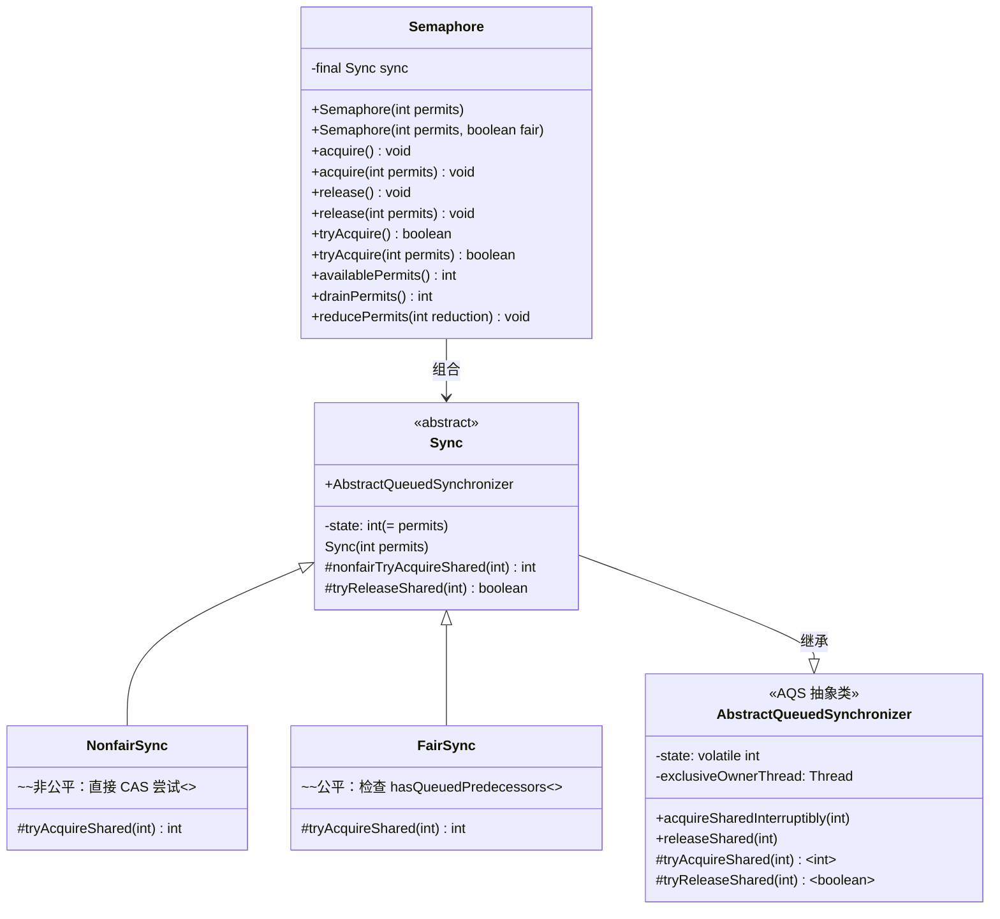
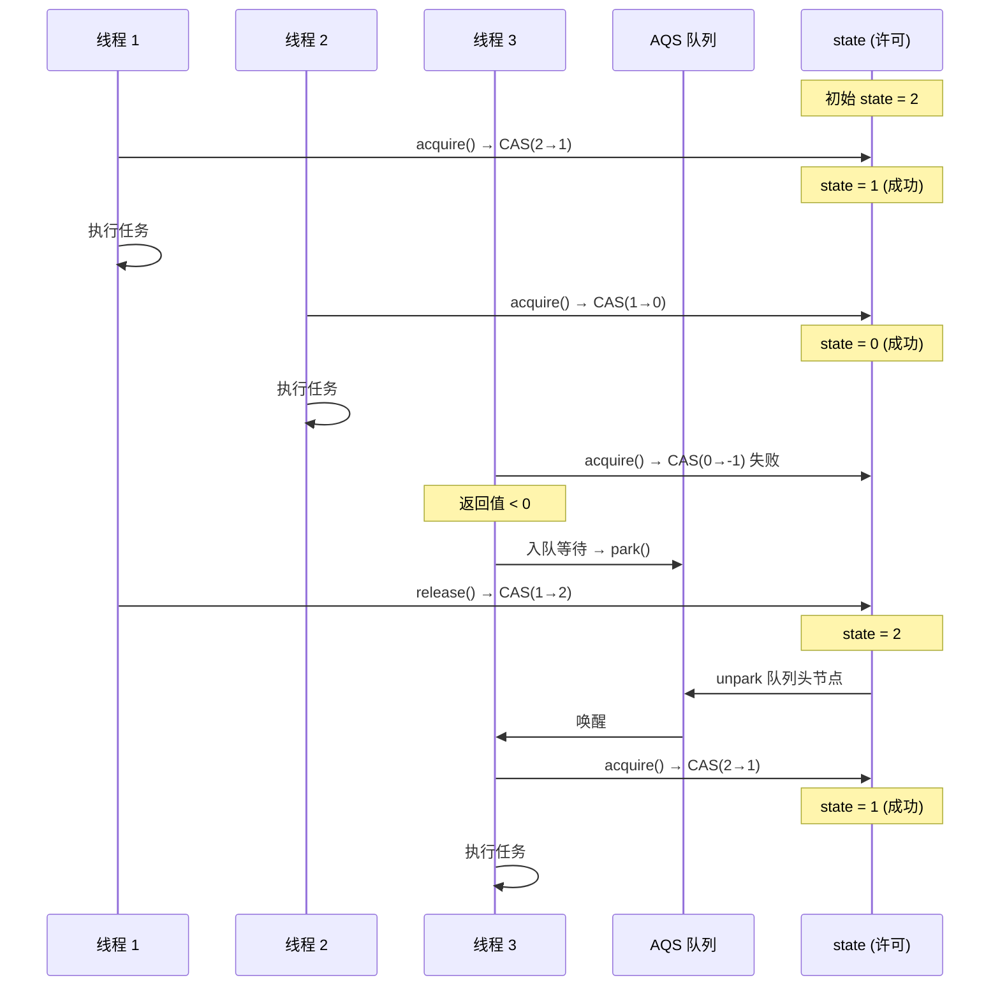

## 引言

数据库连接池最多 10 个连接，怎么控制 50 个线程不超用？答案是 `Semaphore` —— 一个可以控制**多个许可**的共享锁。但 Semaphore 的威力远不止连接池限流：接口 QPS 限流、并发任务批量控制、线程池动态调节，都能靠它实现。

本文将从 **AQS 共享模式源码**出发，深入剖析 Semaphore 的 `state` 许可管理机制、`tryAcquireShared` 返回值含义、公平锁与非公平锁实现差异，以及 **permit 泄漏** 等生产环境陷阱。读完本文，你将理解 Semaphore 如何用一个 `int` 值（AQS state）实现多许可共享控制。

## 类关系图



> **💡 核心提示**：Semaphore 的架构设计与 `ReentrantLock` 如出一辙 —— **组合 Sync + 继承 AQS**。不同之处在于：ReentrantLock 使用 AQS 的**独占模式**（exclusive），Semaphore 使用 **共享模式**（shared）。

## Semaphore 核心原理

### AQS state = 可用许可数

Semaphore 将 AQS 的 `state` 字段用作**可用许可计数器**：

```java
abstract static class Sync extends AbstractQueuedSynchronizer {
    Sync(int permits) {
        setState(permits);  // state 初始化为许可数量
    }
}
```

当线程获取许可时，`state` 减少；当线程释放许可时，`state` 增加。

### 许可获取与释放流程

```mermaid
flowchart TD
    A[acquire() 调用] --> B[AQS.acquireSharedInterruptibly]
    B --> C{检查中断标志}
    C -->|已中断| D[抛出 InterruptedException]
    C -->|未中断| E[调用 tryAcquireShared]
    E --> F{返回值 >= 0?}
    F -->|是 获取成功| G[继续执行]
    F -->|否 获取失败| H[进入 AQS 等待队列]
    H --> I[park 阻塞线程]

    J[release() 调用] --> K[AQS.releaseShared]
    K --> L[tryReleaseShared: CAS 增加 state]
    L --> M{CAS 成功?}
    M -->|否| L
    M -->|是| N[doReleaseShared: unpark 队列头节点]
    N --> O[等待线程被唤醒, 重新 tryAcquireShared]

    style G fill:#4CAF50,color:#fff
    style D fill:#F44336,color:#fff
    style I fill:#FFC107,color:#000
```

### tryAcquireShared 返回值含义

`tryAcquireShared` 的返回值是共享模式的关键约定：

| 返回值 | 含义 | 后续行为 |
| --- | --- | --- |
| **> 0** | 获取成功，且还有剩余许可 | 当前线程 + 后续排队线程可继续获取 |
| **= 0** | 获取成功，但许可已耗尽 | 当前线程获取成功，后续线程需等待 |
| **< 0** | 获取失败 | 当前线程进入 AQS 等待队列阻塞 |

## acquire() 源码分析

### 入口方法

```java
public void acquire() throws InterruptedException {
    sync.acquireSharedInterruptibly(1);  // 获取 1 个许可
}
```

### AQS 父类模板方法

```java
public abstract class AbstractQueuedSynchronizer {

    public final void acquireSharedInterruptibly(int arg) throws InterruptedException {
        if (Thread.interrupted()) {
            throw new InterruptedException();
        }
        // tryAcquireShared 由子类实现
        if (tryAcquireShared(arg) < 0) {
            doAcquireSharedInterruptibly(arg);  // 获取失败 → 入队阻塞
        }
    }
}
```

### 非公平锁实现

```java
static final class NonfairSync extends Sync {

    @Override
    protected int tryAcquireShared(int acquires) {
        return nonfairTryAcquireShared(acquires);
    }
}

abstract static class Sync extends AbstractQueuedSynchronizer {

    final int nonfairTryAcquireShared(int acquires) {
        for (;;) {
            int available = getState();
            int remaining = available - acquires;
            if (remaining < 0 ||
                compareAndSetState(available, remaining)) {
                return remaining;
            }
        }
    }
}
```

非公平锁的策略：线程到达后**直接尝试 CAS 扣减 state**，不管队列中是否有等待的线程。如果恰好有线程刚释放了许可，新线程可以"插队"获取，这就是**permit stealing**。

### 公平锁实现

```java
static final class FairSync extends Sync {

    @Override
    protected int tryAcquireShared(int acquires) {
        for (;;) {
            // 检查队列中是否有前置等待节点
            if (hasQueuedPredecessors()) {
                return -1;  // 返回负数 → 获取失败 → 入队
            }
            int available = getState();
            int remaining = available - acquires;
            if (remaining < 0 ||
                compareAndSetState(available, remaining)) {
                return remaining;
            }
        }
    }
}
```

公平锁多了 `hasQueuedPredecessors()` 检查：如果 AQS 队列中已经有等待的线程，当前线程必须排队，不能插队获取许可。

> **💡 核心提示**：公平锁的吞吐量通常比非公平锁低 **30%-50%**。原因是公平锁需要维护队列顺序，频繁唤醒和阻塞的开销很大。**除非业务严格要求 FIFO 顺序，否则推荐默认的非公平锁。**

## release() 源码分析

### 入口方法

```java
public void release() {
    sync.releaseShared(1);  // 释放 1 个许可
}
```

### AQS 父类模板方法

```java
public abstract class AbstractQueuedSynchronizer {

    public final boolean releaseShared(int arg) {
        // tryReleaseShared 由子类实现
        if (tryReleaseShared(arg)) {
            doReleaseShared();  // 释放成功 → 唤醒等待队列中的线程
            return true;
        }
        return false;
    }
}
```

### Sync 实现

```java
abstract static class Sync extends AbstractQueuedSynchronizer {

    @Override
    protected final boolean tryReleaseShared(int releases) {
        for (;;) {
            int current = getState();
            int next = current + releases;
            if (next < current) {
                throw new Error("Maximum permit count exceeded");
            }
            // CAS 增加 state
            if (compareAndSetState(current, next)) {
                return true;
            }
        }
    }
}
```

释放逻辑：通过 CAS 将 `state` 加 1（或更多），成功后调用 `doReleaseShared()` 唤醒 AQS 队列中等待的线程。注意这里的 **CAS 循环** —— 因为多个线程可能同时调用 `release()`。

### 多线程竞争时序图



## 核心 API 速查

| 方法 | 说明 | 阻塞 | 可中断 |
| --- | --- | --- | --- |
| `acquire()` | 获取 1 个许可 | 是 | 是 |
| `acquire(int permits)` | 获取指定数量许可 | 是 | 是 |
| `acquireUninterruptibly()` | 获取 1 个许可 | 是 | 否 |
| `tryAcquire()` | 尝试获取 1 个许可 | 否 | - |
| `tryAcquire(timeout)` | 超时获取许可 | 是(限时) | 是 |
| `release()` | 释放 1 个许可 | 否 | - |
| `release(int permits)` | 释放指定数量许可 | 否 | - |
| `availablePermits()` | 查询当前可用许可数 | 否 | - |
| `drainPermits()` | 获取所有可用许可 | 否 | - |

## 与其他并发工具对比

| 维度 | Semaphore | CountDownLatch | ReentrantLock | BlockingQueue |
| --- | --- | --- | --- | --- |
| 核心用途 | **限流**（控制并发数） | **倒计时**（等待事件完成） | **互斥**（排他锁） | **生产者-消费者** |
| 许可管理 | state 计数器，可增可减 | state 计数器，只减不增 | state=0(无锁)/1(有锁) | 容量上限 |
| 是否可重用 | 是（释放后许可回归） | 否（计数器归零后不可重置） | 是 | 是 |
| 阻塞行为 | 许可不足时阻塞 | count > 0 时 await 阻塞 | 竞争时阻塞 | 满/空时阻塞 |
| 公平性 | 支持公平/非公平 | 无公平性概念 | 支持公平/非公平 | 支持公平/非公平 |
| 典型场景 | 连接池限流、QPS 限流 | 等待多个异步任务完成 | 临界区保护 | 线程间数据传输 |

> **💡 核心提示**：当 `Semaphore` 的 permit 数量为 1 时，它本质上就是一个 **互斥锁（Mutex）**。但它的优势在于可以动态调整许可数量，且支持共享模式 —— 多个线程可以同时获取许可（只要 permit 足够）。

## Semaphore vs 令牌桶 vs 漏桶

| 维度 | Semaphore | 令牌桶（Token Bucket） | 漏桶（Leaky Bucket） |
| --- | --- | --- | --- |
| 限流粒度 | 并发线程数 | 单位时间请求数 | 固定速率 |
| 突发流量 | 支持（所有 permit 一次性获取） | 支持（桶满时突发） | 不支持（固定速率流出） |
| 实现复杂度 | 低（JDK 内置） | 中（需自己实现或使用 Guava） | 中 |
| 适用场景 | 控制并发连接/线程数 | API 网关 QPS 限流 | 平滑流量峰值 |
| 许可恢复 | 手动 release() | 自动（定时生成令牌） | 自动（固定速率流出） |

## 生产环境避坑指南

### 1. release() 没有匹配的 acquire() —— 许可膨胀

如果在没有 acquire 的情况下调用 release，许可数量会增加，超出初始值，导致限流失效：

```java
// 错误示范
Semaphore semaphore = new Semaphore(3);

// 某处多调用了 release
semaphore.release();  // permits 变成 4
semaphore.release();  // permits 变成 5

// 最终可能有远超预期的线程同时执行
```

**对策**：使用 `acquire()` 和 `release()` 必须成对出现，推荐 try-finally：

```java
semaphore.acquire();
try {
    // 业务逻辑
} finally {
    semaphore.release();  // 确保一定执行
}
```

### 2. 异常导致 Semaphore 泄漏

业务代码抛出异常但没有在 finally 中 release，许可永远不会归还：

```java
// 错误示范
semaphore.acquire();
doSomething();  // 如果抛出异常，permit 永久丢失
semaphore.release();

// 正确示范
semaphore.acquire();
try {
    doSomething();
} finally {
    semaphore.release();
}
```

当泄漏累积到一定程度，`state` 归零，所有后续 acquire 永久阻塞 —— 系统假死。

### 3. 许可数量超过初始值

Semaphore 不会阻止你 release 超过初始许可数量。如果代码中有 bug 导致 permit 持续增长，限流完全失效：

```java
Semaphore semaphore = new Semaphore(3);
// ... 经过一系列 bug 后
semaphore.availablePermits();  // 可能返回 100+
```

**对策**：使用 `Semaphore(int permits, boolean fair)` 构造函数并在关键位置通过 `availablePermits()` 监控许可数量。

### 4. 误用 Semaphore 作为互斥锁

当只需要互斥访问（同一时刻一个线程）时，应该使用 `ReentrantLock` 或 `synchronized`，而不是 `new Semaphore(1)`：

```java
// 不推荐：语义不清晰
Semaphore mutex = new Semaphore(1);
mutex.acquire();
try { /* 临界区 */ } finally { mutex.release(); }

// 推荐：语义清晰
ReentrantLock lock = new ReentrantLock();
lock.lock();
try { /* 临界区 */ } finally { lock.unlock(); }
```

### 5. 公平锁严重影响吞吐量

公平 Semaphore 在高竞争场景下吞吐量比非公平版本低 30%-50%，因为需要维护队列顺序：

```java
// 连接池场景通常不需要公平
Semaphore semaphore = new Semaphore(10);  // 默认非公平，吞吐量更高

// 只有严格要求 FIFO 时才用公平锁
Semaphore fairSemaphore = new Semaphore(10, true);  // 公平，但慢
```

### 6. acquire(int n) 大值许可可能永久阻塞

一次性获取大量许可时，如果并发线程也在获取，可能导致所有线程都获取不到足够许可，全部阻塞：

```java
Semaphore semaphore = new Semaphore(10);

// 线程 1
semaphore.acquire(8);  // 获取 8 个

// 线程 2 和线程 3 同时请求
semaphore.acquire(5);  // 线程 2：需要 5 个，只剩 2 个 → 阻塞
semaphore.acquire(5);  // 线程 3：需要 5 个 → 阻塞
// 线程 1 释放后也只有 10 个，线程 2 和线程 3 互相阻塞 → 死锁风险
```

**对策**：避免一次性获取大量许可，或使用 `tryAcquire(permits, timeout, unit)` 设置超时。

## 总结

Semaphore 的本质是 **AQS 共享模式下对 state 计数器的 CAS 增减**。它用极简的设计实现了灵活的并发控制：

- **state** = 可用许可数，CAS 保证线程安全
- **非公平模式**：新线程可以"窃取"刚释放的许可，吞吐量高
- **公平模式**：按 FIFO 顺序获取，适合严格有序的场景
- **release 必须匹配 acquire**：否则许可泄漏导致系统假死

> **记住**：Semaphore 最擅长的是"并发度控制" —— 限制同时访问某资源的线程数。连接池、限流、批量任务控制，都是它的经典战场。

## 行动清单

1. **审查 acquire/release 配对**：确保项目中所有 Semaphore 使用都包裹在 try-finally 中，防止异常泄漏。
2. **监控 permit 数量**：在关键路径添加 `availablePermits()` 日志或 Metrics 监控，及时发现许可膨胀。
3. **优先使用非公平模式**：除非业务严格要求 FIFO，否则默认非公平 Semaphore 吞吐量更高。
4. **避免大值 acquire**：一次性 `acquire(n)` 中 n 过大时，改用 `tryAcquire(n, timeout, unit)` 防止永久阻塞。
5. **限流场景选型**：QPS 限流优先选 Guava RateLimiter（令牌桶），并发度控制优先选 Semaphore。
6. **连接池适配**：使用 Semaphore 限制连接池最大并发连接数时，确保连接归还时一定调用 release。
7. **扩展阅读**：推荐《Java 并发编程实战》第 14 章（显式锁）和 AQS 源码（`AbstractQueuedSynchronizer` 的 acquireShared 和 releaseShared 方法）。
