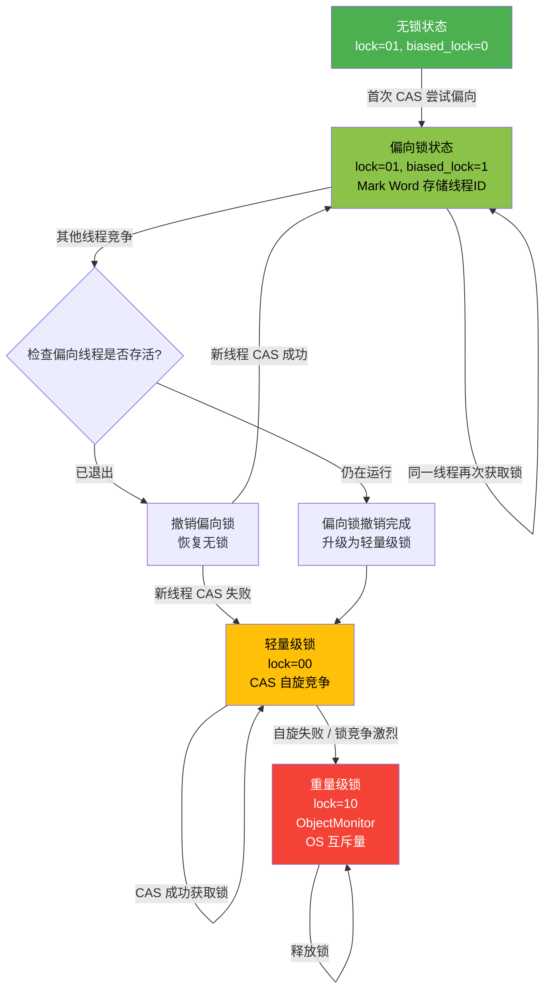
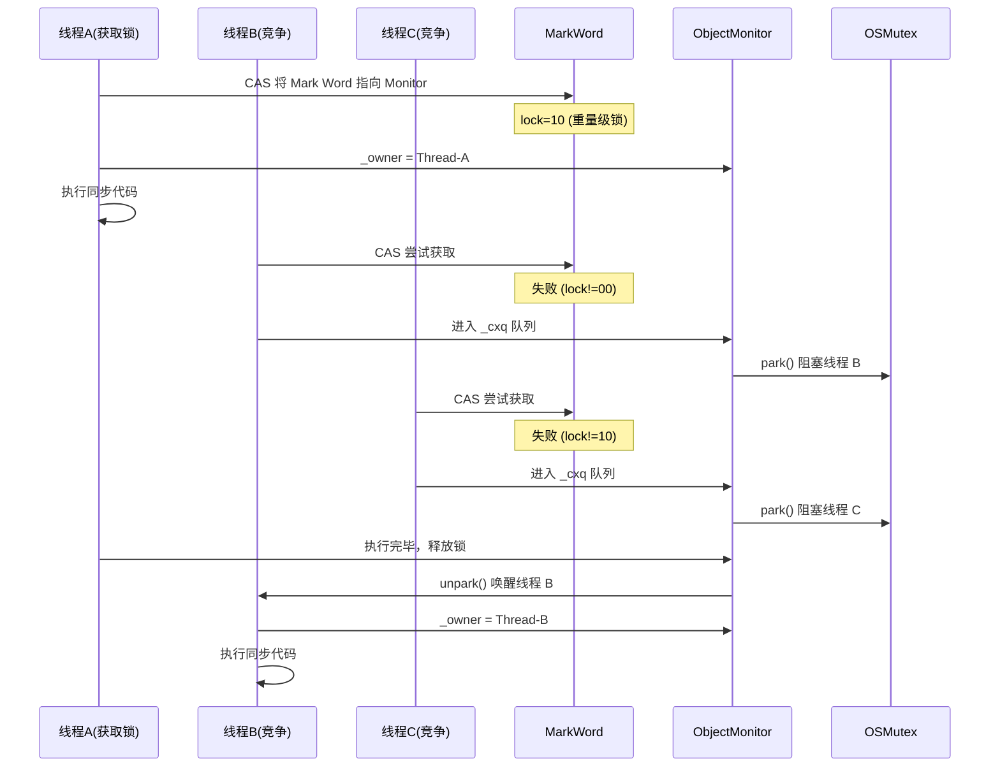

## 引言

谁告诉你 `synchronized` 是重量级锁的？Java 6 之后它的性能已经大幅优化，在无竞争场景下甚至比 `ReentrantLock` 还快。但现实中，大量开发者依然在盲目追求 `ReentrantLock` 而忽视了 JVM 内置锁的进化。

本文将从 **JVM 对象头 Mark Word 的位级布局** 出发，深入剖析 synchronized 的 **四种锁状态升级路径**（无锁 → 偏向锁 → 轻量级锁 → 重量级锁），解读 **monitorenter/monitorexit 字节码指令**、**ObjectMonitor 源码**，以及 JDK 1.6 引入的 **自适应自旋、锁消除、锁粗化** 等优化机制。读完本文，你将彻底理解为什么 90% 的场景下 synchronized 依然是首选。

## synchronized 的作用与用法

`synchronized` 是 Java 提供的一种隐式锁，无需开发者手动加锁和释放锁。它保证多线程并发场景下的数据安全性，实现同一时刻只有一个线程能访问资源，其他线程阻塞等待 —— 也就是互斥同步。

### 五种加锁方式

| 使用位置 | 被锁对象 | 示例代码 |
| --- | --- | --- |
| 实例方法 | 实例对象 | `public synchronized void method() { ... }` |
| 静态方法 | class 类 | `public static synchronized void method() { ... }` |
| 实例对象 | 实例对象 | `synchronized (obj) { ... }` |
| 类对象 | class 类 | `synchronized (Demo.class) { ... }` |
| this 关键字 | 实例对象 | `synchronized (this) { ... }` |

核心规则：
- 静态方法通过类名直接调用，等价于加锁在 class 类上。
- 实例方法、实例对象、this 关键字加锁，锁定范围均为当前实例对象。
- 实例对象上的锁和 class 类上的锁**互不干扰**。

## synchronized 字节码原理

### monitorenter / monitorexit

当在同步代码块上加锁时，JVM 通过 `monitorenter` 和 `monitorexit` 字节码指令实现加锁与释放：

```java
public class SynchronizedDemo {

    public void method() {
        synchronized (SynchronizedDemo.class) {
            System.out.println("Hello world!");
        }
    }
}
```

反编译后，同步代码块前后分别插入了 `monitorenter` 和 `monitorexit` 指令。执行同步代码前使用 `monitorenter` 加锁，执行完毕后使用 `monitorexit` 释放锁；如果抛出异常，同样通过 `monitorexit` 释放锁。

伪代码等价于：

```java
public void method() {
    try {
        monitorenter;      // 加锁
        System.out.println("Hello world!");
        monitorexit;       // 释放锁
    } catch (Exception e) {
        monitorexit;       // 异常时也释放锁
        throw e;
    }
}
```

### ACC_SYNCHRONIZED

当在实例方法上加锁时，底层只使用了一个 `ACC_SYNCHRONIZED` 标志位，实现隐式的加锁与释放：

```java
public class SynchronizedDemo {

    public static synchronized void method() {
        System.out.println("Hello world!");
    }
}
```

反编译后，方法声明上多了一个 `ACC_SYNCHRONIZED` 标志。无论是 `ACC_SYNCHRONIZED` 还是 `monitorenter`/`monitorexit`，底层最终都通过获取 **monitor 锁** 来实现同步。

## ObjectMonitor 数据结构

monitor 锁由 HotSpot 虚拟机中的 `ObjectMonitor`（C++ 实现）来管理：

```cpp
ObjectMonitor() {
    _header       = NULL;
    _count        = 0;        // WaitSet 和 EntryList 的节点数之和
    _waiters      = 0;
    _recursions   = 0;        // 重入次数
    _object       = NULL;
    _owner        = NULL;     // 持有锁的线程
    _WaitSet      = NULL;     // wait() 状态的线程集合
    _WaitSetLock  = 0;
    _Responsible  = NULL;
    _succ         = NULL;
    _cxq          = NULL;     // 竞争线程的单向链表 (Contention Queue)
    FreeNext      = NULL;
    _EntryList    = NULL;     // 等待锁的 block 线程双向链表
    _SpinFreq     = 0;
    _SpinClock    = 0;
    OwnerIsThread = 0;
}
```

工作机制：
1. 多个线程同时访问同步代码时，首先进入 `_EntryList` 队列等待。
2. 某个线程获取 Monitor 锁后进入临界区，`_owner` 设为当前线程，`_count` 加 1。
3. 持有锁的线程调用 `wait()` 时释放 Monitor，`_owner` 恢复为 null，`_count` 减 1，线程进入 `_WaitSet` 等待唤醒。
4. `_WaitSet` 中的线程被唤醒后重新放入 `_EntryList`，再次竞争锁。
5. 线程执行完毕释放 Monitor，复位变量值，其他线程继续竞争。

> **💡 核心提示**：ObjectMonitor 中同时管理着 `_cxq`（单向链表）和 `_EntryList`（双向链表）两个队列。`_cxq` 是 LIFO 队列，新竞争线程通过 CAS 插入到头部；`_EntryList` 是 FIFO 队列，用于被 `_owner` 唤醒的线程。这种双队列设计可以减少 CAS 竞争 —— 新线程只操作 `_cxq` 头部，不干扰 `_EntryList`。

## JVM 对象头与 Mark Word

synchronized 的锁信息存储在对象头（Object Header）中。Java 对象在 JVM 内存中由三部分组成：**对象头**、**实例数据**、**对齐填充**。

### 对象头结构

对象头分为三部分：

| 部分 | 32 位 JVM 大小 | 64 位 JVM 大小 | 说明 |
| --- | --- | --- | --- |
| Mark Word | 32 bit | 64 bit | 存储 hashcode、锁状态、GC 年龄等 |
| Class Pointer | 32 bit | 64 bit | 指向类元数据的指针（-XX:+UseCompressedOops 压缩为 32 bit） |
| 数组长度 | 32 bit | 32 bit | 仅数组对象有此字段 |

- **实例数据**：对象的实际有效信息，包括本类和父类字段。
- **对齐填充**：无特殊含义，因为 JVM 要求对象起始地址必须是 8 字节的整数倍。

### 64 位 JVM 中 Mark Word 的位级布局

Mark Word 是锁升级的核心。在 64 位 JVM 中，其各部分位级布局随锁状态变化：

**无锁 / 未偏向状态** (lock=01, biased_lock=0):

| 位范围 | 字段 | 位数 |
| --- | --- | --- |
| 63-34 | unused (未使用) | 30 bits |
| 33-3 | identity hashcode | 31 bits |
| 2-1 | unused | 2 bits |
| 0 | CMS free bit | 1 bit |
| - | age (GC 分代年龄) | 4 bits |
| - | biased_lock | 1 bit (值为 0) |
| - | lock | 2 bits (值为 01) |

**偏向锁状态** (lock=01, biased_lock=1):

| 位范围 | 字段 | 位数 |
| --- | --- | --- |
| 63-10 | thread ID (偏向线程 ID) | 54 bits |
| 9-8 | epoch (偏向时间戳) | 2 bits |
| 7-4 | age (GC 分代年龄) | 4 bits |
| 3 | biased_lock | 1 bit (值为 1) |
| 2-1 | lock | 2 bits (值为 01) |

**轻量级锁状态** (lock=00):

| 位范围 | 字段 | 位数 |
| --- | --- | --- |
| 63-2 | ptr_to_lock_record (指向栈中 Lock Record) | 62 bits |
| 1-0 | lock | 2 bits (值为 00) |

**重量级锁状态** (lock=10):

| 位范围 | 字段 | 位数 |
| --- | --- | --- |
| 63-2 | ptr_to_heavyweight_monitor (指向 ObjectMonitor) | 62 bits |
| 1-0 | lock | 2 bits (值为 10) |

**GC 标记状态** (lock=11):

| 位范围 | 字段 | 位数 |
| --- | --- | --- |
| 63-2 | ptr_to_forwarding (指向 forwarding 指针) | 62 bits |
| 1-0 | lock | 2 bits (值为 11) |

锁状态由最后两位 `lock` 标志位决定：

| 锁状态 | lock (2 bits) | biased_lock (1 bit) | Mark Word 存储内容 |
| --- | --- | --- | --- |
| 无锁 | 01 | 0 | hashCode + GC 分代年龄 (4 bits) |
| 偏向锁 | 01 | 1 | 线程 ID (54 bits) + epoch (2 bits) + GC 年龄 |
| 轻量级锁 | 00 | - | 指向栈中 Lock Record 的指针 (62 bits) |
| 重量级锁 | 10 | - | 指向 ObjectMonitor 的指针 (62 bits) |
| GC 标记 | 11 | - | 指向 forwarding 指针 (62 bits) |

> **💡 核心提示**：锁状态的判断**同时依赖** `lock` 和 `biased_lock` 两个标志位。`lock = 01` 时，需要再检查 `biased_lock` 才能区分无锁（0）和偏向锁（1）。这种位级设计让 JVM 只需读取 Mark Word 即可判断锁状态，无需额外数据结构。

## synchronized 锁升级

从 JDK 1.6 开始，HotSpot 对 synchronized 进行了重大优化，引入了 **偏向锁**、**轻量级锁**、**自适应自旋**、**锁消除** 和 **锁粗化** 等机制，性能大幅提升。

### 锁升级路径

锁有四种状态：**无锁 → 偏向锁 → 轻量级锁 → 重量级锁**，性能依次降低。锁升级是**单向的**，只能从低到高升级，不会降级。



### 锁升级触发条件

| 升级阶段 | 触发条件 | 性能特征 |
| --- | --- | --- |
| 无锁 → 偏向锁 | 单线程首次获取锁 | 几乎零开销 |
| 偏向锁 → 轻量级锁 | 其他线程竞争且偏向线程仍在运行 | 轻量 CAS 自旋 |
| 轻量级锁 → 重量级锁 | CAS 自旋失败 / 竞争激烈 | OS 级别阻塞 |

### 自旋锁

线程挂起和恢复需要从用户态切换到内核态，频繁阻塞和唤醒对 CPU 是沉重负担。大量场景中，锁持有时间极短，**为了短暂同步而阻塞线程得不偿失**。

> 自旋锁：线程尝试获取锁时，如果锁被占用，就在循环中持续检测锁是否释放，而不是进入阻塞状态。

自旋锁适用于临界区很小的场景。但自旋会占用 CPU 时间，如果持有锁的线程长时间不释放，自旋线程只会空转浪费资源。因此自旋次数必须有上限（JDK 1.6 默认 10 次，可通过 `-XX:PreBlockSpin` 调整）。

### 自适应自旋锁

JDK 1.6 引入了**自适应自旋**，自旋次数不再是固定的，而是由前一次在同一锁上的自旋时间及锁持有者的状态决定：

- 如果上次自旋成功，下次自旋次数会增加（JVM 预测这次也能成功）。
- 如果某锁很少自旋成功，后续自旋次数减少甚至省略，避免浪费 CPU。

> **💡 核心提示**：自适应自旋是 JVM 的 **profile-guided optimization（基于分析的优化）** 的典型应用。JVM 在运行时持续监控锁行为，动态调整策略。随着程序运行，预测会越来越精准。

### 锁消除

JVM 在 JIT 编译时通过**逃逸分析**扫描运行上下文，如果某段代码不存在共享或竞争可能，就会直接**消除锁**：

```java
public void method() {
    final Object LOCK = new Object();
    synchronized (LOCK) {
        // do something
    }
}
```

上面的 `LOCK` 是方法内的局部变量，不可能被其他线程访问，JVM 通过逃逸分析确定它不会逃逸出方法作用域，因此直接消除 synchronized 加锁操作。

### 锁粗化

同步块范围应尽可能小，但**频繁的加锁和解锁本身也有开销**。如果存在连续加锁操作，JVM 会将其**合并为一次范围更大的锁**：

```java
public void method(Object LOCK) {
    synchronized (LOCK) {
        // do something1
    }
    synchronized (LOCK) {
        // do something2
    }
}
```

JVM 在 JIT 编译时将两次加锁合并为一次，减少频繁加锁解锁的开销。

### 偏向锁

HotSpot 团队通过大量研究发现：**大多数场景下锁不存在竞争，通常是一个线程多次获取同一把锁**。为此引入偏向锁：

偏向锁在 Mark Word 中直接存储线程 ID。当同一线程再次获取该锁时，只需检查 Mark Word 中的线程 ID 是否匹配，**无需任何 CAS 操作**，性能接近无锁状态。

> **💡 核心提示**：偏向锁在 **Java 15 及更高版本中默认禁用**（JEP 374）。原因是现代应用中偏向锁撤销（Bulk Revocation）带来的开销经常超过收益。如果你的应用确实是单线程访问场景，可以通过 `-XX:+UseBiasedLocking` 手动开启。

### 轻量级锁

轻量级锁适用于**竞争线程不多且锁持有时间短**的场景。阻塞线程需要从用户态转到内核态，代价较大。轻量级锁通过 **CAS 自旋** 避免阻塞：

**加锁过程**：
1. 线程进入同步块时，在栈帧中创建 `Lock Record` 区域。
2. 将对象头 Mark Word 拷贝到 Lock Record 中。
3. 使用 CAS 将 Mark Word 更新为指向 Lock Record 的指针。
4. CAS 成功 → 获取锁；失败 → 自旋等待。

**解锁过程**：
1. 使用 CAS 将 Lock Record 中的值写回 Mark Word。
2. CAS 成功 → 解锁成功。
3. CAS 失败 → 说明有其他线程竞争，锁膨胀为重量级锁。

### 重量级锁

当竞争激烈时，锁升级为重量级锁。此时依赖底层操作系统的 **Mutex Lock（互斥锁）** 实现：



重量级锁的优势在于：等待线程不消耗 CPU。但线程的阻塞和唤醒需要操作系统介入（用户态 ↔ 内核态切换），开销很大。因此**仅在竞争激烈、锁持有时间长的场景下才使用重量级锁**。

## 四种锁状态性能对比

| 锁状态 | 加锁成本 | 适用场景 | 是否需要 OS 介入 | 典型延迟 |
| --- | --- | --- | --- | --- |
| 无锁 | 0 | 无并发 | 否 | ~0 ns |
| 偏向锁 | ~1 次内存读取 | 单线程重复获取 | 否 | ~1-5 ns |
| 轻量级锁 | CAS + 自旋 | 少量线程短时竞争 | 否 | ~5-50 ns |
| 重量级锁 | OS mutex | 大量线程长时间竞争 | 是 | ~1000+ ns |

> **注意**：以上性能数据因硬件而异。重量级锁的延迟约为偏向锁的 **100-1000 倍**。这就是为什么 Java 6 要对 synchronized 做锁升级优化。

## synchronized vs ReentrantLock

| 维度 | synchronized | ReentrantLock |
| --- | --- | --- |
| 实现层面 | JVM 内置，C++ 实现 | JDK 层面，Java 实现 |
| 锁释放 | 自动释放（异常时也释放） | 必须手动 `unlock()`，通常在 finally 中 |
| 锁类型 | 仅非公平锁 | 公平锁 / 非公平锁可选 |
| 可中断 | 不可中断（除非抛出 InterruptedException） | 支持 `lockInterruptibly()` |
| 超时获取 | 不支持 | 支持 `tryLock(timeout)` |
| 条件变量 | 仅 `wait()/notify()` | 支持多个 `Condition` |
| 锁状态查询 | 不可查询 | 可查询 `isLocked()`, `getHoldCount()` |
| 性能（Java 6+） | 无竞争时接近 ReentrantLock | 高竞争时略有优势 |
| 锁升级 | 支持（偏向 → 轻量 → 重量级） | 不支持（始终 AQS 实现） |

> **💡 核心提示**：Java 6 之后 synchronized 在无竞争和低竞争场景下的性能已经与 ReentrantLock 相当。**推荐优先使用 synchronized**，仅在以下场景选择 ReentrantLock：需要公平锁、可中断锁、超时获取、或需要多个 Condition。

## 生产环境避坑指南

### 1. 锁错对象导致无效同步

最常见的错误是对**每个线程都持有不同对象**加锁，看似 synchronized 了，实际各锁各的：

```java
// 错误示范：每次请求都 new 一个新对象
public void process() {
    Object lock = new Object();  // 每个线程都有自己的 lock
    synchronized (lock) {        // 永远不会互斥
        // 临界区代码
    }
}

// 正确示范：使用共享对象作为锁
private static final Object LOCK = new Object();
public void process() {
    synchronized (LOCK) {  // 所有线程共享同一把锁
        // 临界区代码
    }
}
```

### 2. 锁粒度过粗导致性能瓶颈

将整个方法体用 synchronized 包裹，即使只有少数几行需要同步：

```java
// 不推荐：锁范围太大
public synchronized void process() {
    // 耗时操作（网络 IO、数据库查询）... 其他线程全部阻塞
    fetchDataFromDB();
    // 实际需要同步的只有这一行
    counter++;
}

// 推荐：缩小锁范围
public void process() {
    fetchDataFromDB();  // 不加锁
    synchronized (this) {
        counter++;      // 只同步必要的操作
    }
}
```

### 3. String 字面量锁冲突

使用 String 字面量作为锁对象，可能导致与代码中其他无关的 synchronized 块竞争同一把锁（因为 String 常量池的存在）：

```java
// 危险：String 字面量在常量池中是同一个对象
public void methodA() {
    synchronized ("lock") { ... }  // 指向常量池中的 "lock"
}
public void methodB() {
    synchronized ("lock") { ... }  // 指向同一个常量池中的 "lock"
}
```

### 4. 高并发场景下偏向锁批量撤销开销

在高并发场景中，偏向锁撤销（Bulk Revocation）会产生显著开销。如果大量线程竞争同一个对象，会触发偏向锁撤销甚至批量偏向，反而降低性能。

**对策**：如果明确是高并发场景，启动时添加 `-XX:-UseBiasedLocking` 禁用偏向锁。

### 5. 多个 synchronized 块嵌套导致死锁

```java
// 危险：锁顺序不一致导致死锁
public void transfer(Account from, Account to) {
    synchronized (from) {
        synchronized (to) {
            from.debit();
            to.credit();
        }
    }
}
// 如果线程 A: transfer(X, Y)，线程 B: transfer(Y, X) → 死锁
```

**对策**：始终按照一致的顺序获取锁（如按对象 hashCode 排序）。

### 6. synchronized 不适合长时间持锁的场景

重量级锁会将线程阻塞，如果临界区执行时间过长（如网络调用、数据库操作），大量线程堆积在等待队列中，系统吞吐量急剧下降。

**对策**：使用 `ReentrantLock` + `tryLock(timeout)` 或并发数据结构（如 `ConcurrentHashMap`、`AtomicLong`）。

## 总结

synchronized 经历了 Java 6 的锁升级优化之后，已经从"重量级锁"进化为**智能多态锁**：
- **无竞争**：偏向锁或轻量级锁，性能接近无锁
- **低竞争**：轻量级锁 + 自适应自旋，避免 OS 切换
- **高竞争**：重量级锁 + 双队列管理，公平调度

**记住这个原则**：90% 的场景直接使用 synchronized，它足够简单、安全、高效。仅在需要公平锁、可中断、超时获取、多 Condition 等高级特性时，才选择 ReentrantLock。

## 行动清单

1. **检查现有代码**：确认所有 synchronized 块是否锁在了正确的共享对象上。
2. **缩小锁范围**：将 synchronized 块内的 IO、网络调用移出同步块。
3. **避免 String 锁**：使用 `new Object()` 而非字符串字面量作为锁。
4. **高并发禁用偏向锁**：生产环境启动参数添加 `-XX:-UseBiasedLocking`（Java 8 及以下）。
5. **锁顺序一致性**：多个 synchronized 嵌套时，确保所有线程按相同顺序获取锁。
6. **性能测试验证**：使用 JMH 对同步代码块做基准测试，对比 synchronized vs ReentrantLock 在目标场景下的表现。
7. **扩展阅读**：推荐《Java 并发编程实战》第 2 章（结构化并发应用）和《深入理解 Java 虚拟机》第 12 章（锁优化）。
