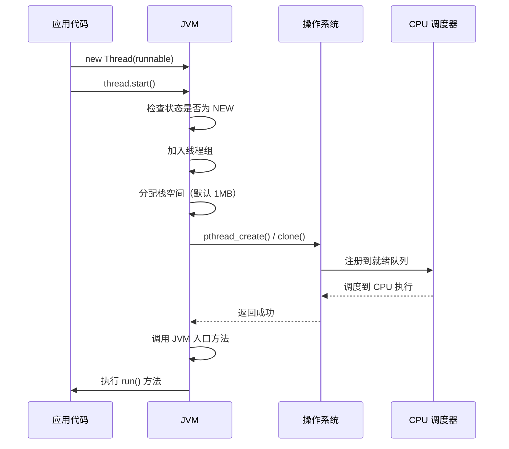

## 引言

`new Thread().start()` 看起来只是一行代码，但这一行背后，JVM 向操作系统发出了创建内核线程的系统调用，OS 为其分配栈空间、创建 PCB 结构、注册到调度器——整个过程消耗的资源远超你的想象。

在生产环境中，**随意 `new Thread` 是引发线上故障的十大常见原因之一**：线程泄漏耗尽文件描述符、未捕获异常导致线程静默死亡、守护线程丢失关键数据……本文将带你从操作系统层面理解 Java 线程的本质，掌握线程生命周期、状态映射、中断机制的核心原理，并总结生产环境必须遵守的线程使用规范。

## Java 线程与操作系统线程的映射

Java 的 `Thread` 并非凭空存在，它直接映射到操作系统的原生线程。在 Linux 系统上，JVM 使用 **1:1 线程模型**——每个 Java 线程对应一个内核级线程（通过 `clone()` 系统调用创建）。

### 线程创建的真实成本

当你调用 `new Thread().start()` 时，系统内部发生了这些事：

```
Java 层 new Thread()
    → JVM 调用 pthread_create()（Linux）
        → 内核分配内核线程结构体（task_struct）
        → 分配线程栈空间（默认 1MB，-Xss 可调）
        → 设置寄存器初始状态（PC 指向 JVM 启动例程）
        → 将线程加入调度器就绪队列
    → 线程开始执行 JVM 的 JavaThread::run()
        → 设置 ThreadLocal 存储
        → 调用 run() 方法
```

> **💡 核心提示**：创建一个线程的成本约为 **创建进程的 1/30**，但仍然需要分配独立的内核数据结构（约 8KB task_struct + 默认 1MB 栈空间）。这就是为什么不能无限创建线程，而应该使用线程池。

### 线程状态与 OS 状态的映射

Java 的 6 种线程状态是对 OS 线程状态的抽象映射：

| Java 状态 | 对应 OS 行为 | 触发条件 |
| :--- | :--- | :--- |
| NEW | 未创建内核线程 | `new Thread()` 后，`start()` 前 |
| RUNNABLE | 就绪态 + 运行态 | `start()` 后，包含 RUNNING 和 READY |
| BLOCKED | 等待内核互斥锁 | 等待进入 synchronized 块 |
| WAITING | 内核级等待队列 | `Object.wait()` / `Thread.join()` / `LockSupport.park()` |
| TIMED_WAITING | 带超时的内核等待 | `Thread.sleep()` / `wait(timeout)` / `parkNanos()` |
| TERMINATED | 内核线程销毁 | `run()` 方法执行完毕 |

## 线程生命周期

```mermaid
flowchart TD
    A[NEW 新建] -->|start()| B[RUNNABLE 可运行]
    B -->|获得 CPU| C(RUNNING 运行中)
    C -->|yield() / 时间片耗尽| B
    C -->|等待 synchronized 锁| D[BLOCKED 阻塞]
    D -->|获得锁| B
    C -->|wait() / join() / park()| E[WAITING 等待]
    E -->|notify() / unpark()| B
    C -->|sleep() / wait(timeout)| F[TIMED_WAITING 超时等待]
    F -->|超时 / notify()| B
    C -->|run() 执行完毕| G[TERMINATED 终止]
```

```mermaid
classDiagram
    class Thread {
        +String name
        +long id
        +Priority priority
        +State state
        +boolean daemon
        +Runnable target
        +start()
        +run()
        +interrupt()
        +join()
        +sleep(long millis)
        +yield()
        +getState()
    }
    class ThreadGroup {
        +String name
        +ThreadGroup parent
        +int maxPriority
        +boolean daemon
        +add(Thread t)
        +interrupt()
    }
    class Runnable {
        <<interface>>
        +run()
    }
    class Callable~V~ {
        <<interface>>
        +call() V
    }
    class ThreadState {
        <<enumeration>>
        NEW
        RUNNABLE
        BLOCKED
        WAITING
        TIMED_WAITING
        TERMINATED
    }
    Thread --> ThreadState : has
    Thread --> ThreadGroup : belongs to
    Thread --> Runnable : wraps
    Callable -.-> Thread : via FutureTask
```

## 线程的四种创建方式

### 继承 Thread 类

```java
public class ThreadDemo {
    public static void main(String[] args) {
        Thread thread = new MyThread();
        thread.start(); // 启动线程
    }
}

class MyThread extends Thread {
    @Override
    public void run() {
        System.out.println("继承 Thread 方式运行");
    }
}
```

`start()` 方法只能调用一次，它通知 JVM 在 JVM 层创建并启动操作系统线程。直接调用 `run()` 只是在当前线程中执行普通方法调用，**不会启动新线程**。

### 实现 Runnable 接口

```java
public class ThreadDemo {
    public static void main(String[] args) {
        MyRunnable myRunnable = new MyRunnable();
        Thread thread1 = new Thread(myRunnable, "线程1");
        Thread thread2 = new Thread(myRunnable, "线程2");
        thread1.start();
        thread2.start();
    }
}

class MyRunnable implements Runnable {
    private int count = 5;

    @Override
    public void run() {
        while (count > 0) {
            System.out.println(Thread.currentThread().getName()
                    + ", count=" + count--);
        }
    }
}
```

相比继承 Thread 类，实现 Runnable 有两个关键优势：

1. **避免 Java 单继承限制**——类还可以继承其他父类
2. **天然适合共享数据**——多个线程可以共享同一个 Runnable 实例

### 实现 Callable 接口

```java
public class ThreadTest {
    public static void main(String[] args) throws ExecutionException, InterruptedException {
        MyCallable myCallable = new MyCallable();
        FutureTask<String> futureTask = new FutureTask<>(myCallable);
        Thread thread = new Thread(futureTask);
        thread.start();
        System.out.println(futureTask.get()); // 阻塞等待结果
    }
}

class MyCallable implements Callable<String> {
    @Override
    public String call() throws Exception {
        return "Callable 可以返回结果";
    }
}
```

`Callable` 相比 `Runnable` 的关键区别：
- **有返回值**：`call()` 方法返回泛型 V
- **可抛异常**：`call()` 声明了 `throws Exception`
- 必须配合 `FutureTask` 使用，`FutureTask` 同时实现了 `Runnable` 和 `Future`

### 使用线程池

```java
public class ThreadDemo {
    public static void main(String[] args) {
        ExecutorService executorService = Executors.newFixedThreadPool(10);
        executorService.execute(() -> System.out.println("线程池执行任务"));
    }
}
```

**这是工作中唯一推荐的方式**。线程池负责：
- 复用已创建的线程，避免频繁创建销毁的开销
- 管理并发度，防止线程爆炸
- 提供任务队列、拒绝策略、定时执行等高级功能

## 线程状态详解

Java 线程共有 6 种状态，定义在 `Thread.State` 枚举中：

- **NEW（新建）**：线程对象已创建，但尚未调用 `start()`。此时调用 `getState()` 返回 `NEW`。
- **RUNNABLE（可运行）**：调用 `start()` 后进入此状态。注意，RUNNABLE 包含了 OS 层面的 **RUNNING（正在 CPU 执行）** 和 **READY（就绪队列中等待调度）** 两种状态。线程可以调用 `yield()` 主动让出 CPU，从 RUNNING 退回 READY。
- **BLOCKED（阻塞）**：等待获取 synchronized 监视器锁。只有进入 synchronized 块/方法竞争失败才会进入此状态。
- **WAITING（无限等待）**：调用 `Object.wait()`、`Thread.join()` 或 `LockSupport.park()` 后进入，需要其他线程显式唤醒（`notify()` / `notifyAll()` / `unpark()`）。
- **TIMED_WAITING（超时等待）**：与 WAITING 类似，但带有超时时间。`Thread.sleep()`、`wait(timeout)`、`join(timeout)`、`parkNanos()` 都会进入此状态。
- **TERMINATED（终止）**：`run()` 方法正常返回或抛出未捕获异常导致线程结束。

## 线程中断机制

线程中断是 Java 线程协作的核心机制，必须理解一个关键事实：

> **💡 核心提示**：Java 的 `interrupt()` 是**协作式中断**，不是**强制式中断**。它只是给线程设置一个中断标志位，线程需要自己检查这个标志位并决定是否退出。这与操作系统的 `pthread_cancel()` 有本质区别。

### interrupt() 的行为规则

| 线程当前状态 | interrupt() 的效果 |
| :--- | :--- |
| 正常运行中 | 设置中断标志位（`isInterrupted()` 返回 true），线程继续执行 |
| 阻塞中（BLOCKED） | 无法中断，标志位设置后等锁释放 |
| WAITING / TIMED_WAITING 中 | 抛出 `InterruptedException`，**清除中断标志位** |

```java
Thread t = new Thread(() -> {
    while (!Thread.currentThread().isInterrupted()) {
        // 正常业务逻辑
        try {
            Thread.sleep(1000); // 会抛出 InterruptedException
        } catch (InterruptedException e) {
            // 异常会清除中断标志，如果需要保持中断状态：
            Thread.currentThread().interrupt(); // 重新设置
            break;
        }
    }
    System.out.println("线程优雅退出");
});
t.start();
t.interrupt();
```

> **💡 核心提示**：捕获 `InterruptedException` 后，**必须重新设置中断标志位**（`Thread.currentThread().interrupt()`），否则外层代码无法感知中断请求。这是最常见的中断处理错误。

## 已废弃的方法及其危险性

以下三个方法在 Java 1.2 已被废弃，**绝对不要在代码中使用**：

| 废弃方法 | 危险原因 |
| :--- | :--- |
| `stop()` | 立即终止线程，可能导致 synchronized 锁不释放、文件句柄不关闭、数据不一致 |
| `suspend()` | 挂起线程但不释放锁，极易造成死锁 |
| `resume()` | 恢复被 suspend 的线程，如果 resume 在 suspend 之前执行，线程将永久挂起 |

> **💡 核心提示**：`stop()` 之所以危险，是因为它会抛出 `ThreadDeath` 异常强制线程退出。如果线程正在持有 synchronized 锁并修改共享数据，stop 会导致：1）锁被释放但数据处于中间状态；2）其他线程获取到不一致的数据。正确的做法是使用 `interrupt()` 协作式中断。

## 守护线程（Daemon Thread）

守护线程是为用户线程服务的后台线程，最典型的例子是 GC 线程。

```java
Thread daemonThread = new Thread(() -> {
    while (true) {
        // 后台任务
    }
});
daemonThread.setDaemon(true); // 必须在 start() 之前调用
daemonThread.start();
```

> **💡 核心提示**：当所有用户线程结束后，JVM 会直接退出，**不会等待守护线程完成**。这意味着守护线程中的 finally 块不一定执行，可能导致数据未持久化、连接未关闭等问题。**不要在守护线程中执行写操作**。

## 线程优先级

Java 线程优先级范围是 1-10（`Thread.MIN_PRIORITY` 到 `Thread.MAX_PRIORITY`），默认是 5（`Thread.NORM_PRIORITY`）。

但有一个残酷的事实：**Linux 内核默认调度器（CFS）完全忽略 Java 线程优先级**。

| OS | 优先级映射 |
| :--- | :--- |
| Linux（默认 CFS） | Java 优先级映射到 nice 值（-20 到 19），但需要 root 权限才能设置 |
| Windows | Java 优先级映射到 7 个 Windows 线程优先级 |
| macOS | 类似 Windows，有优先级映射 |

> **💡 核心提示**：**不要依赖线程优先级来控制执行顺序**。优先级只是给 OS 调度器的建议，不同 OS 行为不一致，甚至同一 OS 在不同版本中行为也可能不同。如果需要精确控制执行顺序，应该使用显式的同步机制（如 CountDownLatch、Semaphore）。

## 线程常用方法

| 方法 | 含义 | 示例 |
| :--- | :--- | :--- |
| `start()` | 启动线程（只能调用一次） | `thread.start()` |
| `currentThread()` | 获取当前线程实例 | `Thread.currentThread()` |
| `yield()` | 让出 CPU 时间片（提示调度器） | `Thread.yield()` |
| `sleep(long millis)` | 线程睡眠指定时间 | `Thread.sleep(1000)` |
| `interrupt()` | 设置中断标志位 | `thread.interrupt()` |
| `isInterrupted()` | 检查中断标志（不清除） | `thread.isInterrupted()` |
| `static interrupted()` | 检查并清除中断标志 | `Thread.interrupted()` |
| `isAlive()` | 判断线程是否存活 | `thread.isAlive()` |
| `getName()` | 获取线程名称 | `thread.getName()` |
| `getState()` | 获取线程状态 | `thread.getState()` |
| `getId()` | 获取线程唯一 ID | `thread.getId()` |
| `join()` | 等待线程执行完成 | `thread.join()` |
| `join(long millis)` | 等待线程，超时则返回 | `thread.join(5000)` |

## 线程 start() 流程



## 生产环境避坑指南

1. **线程泄漏**：每次 `new Thread` 而不复用，在高并发场景下会耗尽文件描述符和内存。生产环境必须使用线程池。
2. **未捕获异常导致线程静默死亡**：线程 `run()` 方法抛出未捕获异常后线程直接终止，没有任何日志。必须通过 `Thread.setUncaughtExceptionHandler()` 注册全局异常处理器。
3. **守护线程丢失数据**：守护线程中的写入操作在 JVM 退出时可能未完成。守护线程只适合做监控和清理。
4. **线程优先级不可靠**：不同 OS 对 Java 优先级的处理方式不同，不能依赖优先级控制执行顺序。
5. **`stop()` 导致资源泄漏和状态不一致**：废弃方法 `stop()` 会强制终止线程，可能导致 synchronized 锁释放但数据处于不一致状态。
6. **未给线程命名**：生产环境排查问题时，`Thread-0`、`Thread-1` 这样的名称毫无帮助。务必通过构造函数或 `ThreadFactory` 指定有意义的名称。

## 关键对比

### 四种创建方式对比

| 方式 | 返回值 | 异常处理 | 资源共享 | 推荐程度 |
| :--- | :--- | :--- | :--- | :--- |
| 继承 Thread | 无 | 需自行 try-catch | 需外部传递 | 不推荐 |
| 实现 Runnable | 无 | 需自行 try-catch | 天然支持 | 推荐 |
| 实现 Callable | 有返回值 | 通过 Future.get() 抛出 | 天然支持 | 推荐 |
| 线程池 | 无/Future | 可通过异常处理器 | 天然支持 | 强烈推荐 |

### 线程状态对比

| 状态 | 是否消耗 CPU | 如何触发 | 如何恢复 |
| :--- | :--- | :--- | :--- |
| RUNNABLE | 是 | start() | - |
| BLOCKED | 否 | 竞争 synchronized 锁失败 | 获得锁 |
| WAITING | 否 | wait() / join() / park() | notify() / unpark() |
| TIMED_WAITING | 否 | sleep() / wait(timeout) | 超时或唤醒 |
| TERMINATED | 否 | run() 结束 | 不可恢复 |

## 总结

Java 线程是对操作系统线程的封装，理解其底层映射关系对于排查性能问题和并发 bug 至关重要。记住以下要点：

- Linux 上 Java 线程与 OS 线程是 1:1 映射，创建成本不低，**务必使用线程池复用**
- Java 的 6 种状态是 OS 状态的抽象，BLOCKED 和 WAITING 的触发条件完全不同
- 中断是协作式的，`interrupt()` 只是设置标志位，线程必须主动检查
- `stop()`、`suspend()`、`resume()` 已废弃，永远不要使用
- 守护线程在 JVM 退出时不会完成收尾工作，不能用于写操作

### 行动清单

1. **检查代码库中所有 `new Thread()` 调用**，替换为通过 `ThreadFactory` 创建并命名有意义的线程名。
2. **为所有线程池配置自定义的 `ThreadFactory`**，线程名称格式建议：`pool-{poolName}-thread-{threadNum}`。
3. **注册全局未捕获异常处理器** `Thread.setDefaultUncaughtExceptionHandler()`，避免线程静默死亡。
4. **检查所有 `catch (InterruptedException e)` 块**，确保重新设置了中断标志位。
5. **搜索代码中的 `thread.stop()`、`thread.suspend()`**，立即替换为协作式中断模式。
6. **审查守护线程中的写操作**，将其迁移到用户线程或使用异步持久化方案。
7. **推荐阅读**：《Java 并发编程实战》第 7 章（取消与关闭）、第 8 章（线程池的使用）。
