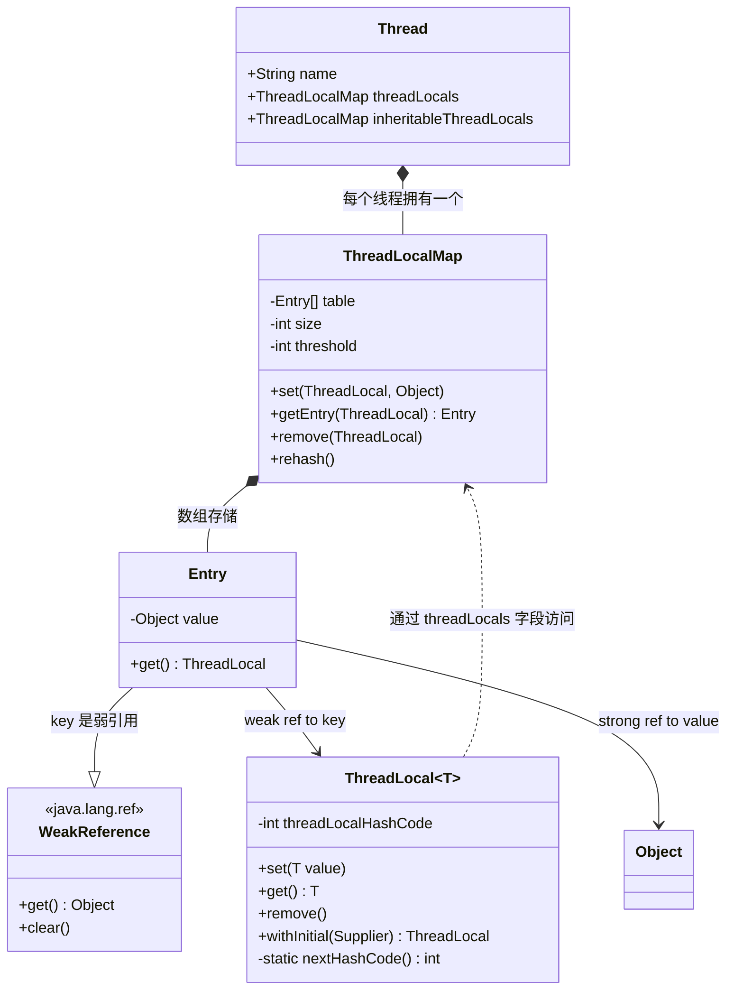
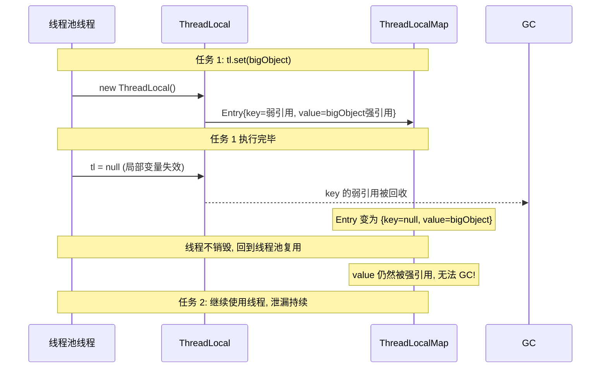

## 引言

ThreadLocal 为什么会内存泄漏？90% 的人只说对了一半——"因为 key 是弱引用"。但这只是答案的一半。另一半更关键：**真正导致内存泄漏的不是 key 被回收，而是 value 的强引用链永远不会断开**。

在面试中，ThreadLocal 是区分"会用"和"懂原理"的分水岭。知道 set/get 只是入门，理解 WeakReference 的设计意图、线性探测的哈希冲突处理、魔法哈希数 0x61c88647 的来源，才是进阶。更关键的是，ThreadLocal 在线程池场景下会引发内存泄漏和数据串扰，这是生产环境最常见的隐蔽 bug 之一。本文将深入 ThreadLocal 源码，剖析内存泄漏的真实成因，并给出生产环境的使用规范。

## ThreadLocal 是什么

**ThreadLocal** 是线程本地变量——每个线程拥有自己独立的变量副本，线程之间完全隔离，无需加锁即可保证线程安全。

**核心目的**：在多线程环境中，通过空间换时间，避免锁竞争带来的性能损耗。

```java
/**
 * @author 一灯架构
 * @apiNote ThreadLocal 示例
 **/
public class ThreadLocalDemo {
    // 1. 创建 ThreadLocal
    static ThreadLocal<String> threadLocal = new ThreadLocal<>();

    public static void main(String[] args) {
        // 2. 给 ThreadLocal 赋值
        threadLocal.set("hello threadlocal");
        // 3. 从 ThreadLocal 中取值
        String result = threadLocal.get();
        System.out.println(result); // 输出 hello threadlocal

        // 4. 删除 ThreadLocal 中的数据
        threadLocal.remove();
        System.out.println(threadLocal.get()); // 输出 null
    }
}
```

不同线程之间的 ThreadLocal 数据完全隔离：

```java
public class ThreadLocalDemo {
    static ThreadLocal<Integer> threadLocal = new ThreadLocal<>();

    public static void main(String[] args) {
        IntStream.range(0, 5).forEach(i -> {
            new Thread(() -> {
                threadLocal.set(i);
                System.out.println(Thread.currentThread().getName()
                        + ", value=" + threadLocal.get());
            }).start();
        });
    }
}
```

```
Thread-0, value=0
Thread-1, value=1
Thread-2, value=2
Thread-3, value=3
Thread-4, value=4
```

## ThreadLocal 核心架构



## ThreadLocal 应用场景

### 场景一：避免参数层层传递

用户信息、请求上下文等跨层传递的参数，使用 ThreadLocal 可以打破方法调用链的约束：

```java
// 拦截器中设置
UserContext.setUser(user);

// 任意深层方法中直接获取
User user = UserContext.getUser();
```

### 场景二：线程安全的对象复用

`SimpleDateFormat` 不是线程安全的，每次都 new 开销大，可以封装在 ThreadLocal 中复用：

```java
public class ThreadLocalDemo {
    static ThreadLocal<SimpleDateFormat> threadLocal =
            ThreadLocal.withInitial(() -> new SimpleDateFormat("yyyy-MM-dd HH:mm:ss"));

    public static void main(String[] args) {
        IntStream.range(0, 5).forEach(i -> {
            new Thread(() -> {
                try {
                    System.out.println(threadLocal.get().parse("2024-11-11 00:00:00"));
                } catch (ParseException e) {
                    throw new RuntimeException(e);
                }
            }).start();
        });
    }
}
```

数据库连接（`java.sql.Connection`）、Spring 事务管理也广泛使用了 ThreadLocal。

## ThreadLocal 实现原理

ThreadLocal 的数据存储在 `Thread` 对象的 `threadLocals` 字段中，这是一个 `ThreadLocalMap` 实例。**每个线程有自己独立的 ThreadLocalMap，线程之间不共享**。

### ThreadLocalMap 内部结构

```java
static class ThreadLocalMap {
    // Entry 继承 WeakReference，key（ThreadLocal 实例）是弱引用
    static class Entry extends WeakReference<ThreadLocal<?>> {
        Object value; // value 是强引用

        Entry(ThreadLocal<?> k, Object v) {
            super(k); // key 作为弱引用
            value = v;
        }
    }

    private Entry[] table;
    private static final int INITIAL_CAPACITY = 16;
    private int threshold; // 扩容阈值 = capacity * 2/3

    private void setThreshold(int len) {
        threshold = len * 2 / 3;
    }
}
```

> **💡 核心提示**：ThreadLocalMap 的数组初始容量是 **16**，扩容阈值是容量的 **2/3**。相比 HashMap 的 0.75 负载因子，ThreadLocalMap 更保守，因为使用线性探测法解决冲突，需要更多空位来减少探测链长度。

### set() 方法源码解析

```java
public void set(T value) {
    Thread t = Thread.currentThread();
    ThreadLocalMap map = getMap(t);
    if (map != null)
        map.set(this, value);
    else
        createMap(t, value);
}
```

实际的 `map.set()` 逻辑：

```java
private void set(ThreadLocal<?> key, Object value) {
    Entry[] tab = table;
    int len = tab.length;
    // 哈希计算: threadLocalHashCode & (len - 1)
    int i = key.threadLocalHashCode & (len - 1);

    // 线性探测法: 从 i 开始向后查找
    for (Entry e = tab[i]; e != null; e = tab[i = nextIndex(i, len)]) {
        ThreadLocal<?> k = e.get();
        if (k == key) {
            // key 相同，覆盖 value
            e.value = value;
            return;
        }
        if (k == null) {
            // key 已被 GC 回收（弱引用），替换陈旧的 entry
            replaceStaleEntry(key, value, i);
            return;
        }
    }
    // 找到空位置，创建新 Entry
    tab[i] = new Entry(key, value);
    int sz = ++size;
    if (!cleanSomeSlots(i, sz) && sz >= threshold)
        rehash();
}
```

### set() 完整流程

```mermaid
flowchart TD
    A[threadLocal.set(value)] --> B[获取当前线程的 ThreadLocalMap]
    B --> C{map 是否存在?}
    C -->|否| D[createMap 初始化 map]
    C -->|是| E[hashCode & (len-1) 计算索引]
    D --> F[创建 Entry[key=弱引用, value=强引用]]
    E --> G{该位置是否为空?}
    G -->|空| H[创建新 Entry]
    G -->|非空| I{key 是否相同?}
    I -->|是| J[覆盖 value]
    I -->|否| K{key 是否为 null?}
    K -->|是| L[replaceStaleEntry 替换陈旧 entry]
    K -->|否| M[线性探测: 索引+1, 继续查找]
    M --> G
    H --> N{size >= threshold?}
    J --> N
    L --> N
    N -->|是| O[rehash 扩容]
    N -->|否| P[完成]
    O --> P
```

### 魔法哈希数 0x61c88647

```java
private static final int HASH_INCREMENT = 0x61c88647;

private static int nextHashCode() {
    return nextHashCode.getAndAdd(HASH_INCREMENT);
}
```

`0x61c88647` 是黄金比例相关的魔数（`(sqrt(5) - 1) / 2 * 2^32 ≈ 0x61c88647`）。每次创建新的 ThreadLocal，`threadLocalHashCode` 递增这个固定值。这属于 **Fibonacci 哈希**（乘法哈希的一种），在容量为 2 的幂时，计算出的索引值分布最均匀，**最大程度减少线性探测的冲突**。

### get() 方法源码解析

```java
public T get() {
    Thread t = Thread.currentThread();
    ThreadLocalMap map = getMap(t);
    if (map != null) {
        ThreadLocalMap.Entry e = map.getEntry(this);
        if (e != null) {
            @SuppressWarnings("unchecked")
            T result = (T) e.value;
            return result;
        }
    }
    return setInitialValue();
}

private Entry getEntry(ThreadLocal<?> key) {
    int i = key.threadLocalHashCode & (table.length - 1);
    Entry e = table[i];
    if (e != null && e.get() == key)
        return e; // 命中
    else
        return getEntryAfterMiss(key, i, e);
}

private Entry getEntryAfterMiss(ThreadLocal<?> key, int i, Entry e) {
    Entry[] tab = table;
    int len = tab.length;
    while (e != null) {
        ThreadLocal<?> k = e.get();
        if (k == key) return e;
        if (k == null)
            expungeStaleEntry(i); // 发现陈旧 entry，帮忙清理
        else
            i = nextIndex(i, len);
        e = tab[i];
    }
    return null;
}
```

### remove() 方法源码解析

```java
public void remove() {
    ThreadLocalMap m = getMap(Thread.currentThread());
    if (m != null) m.remove(this);
}

private void remove(ThreadLocal<?> key) {
    Entry[] tab = table;
    int len = tab.length;
    int i = key.threadLocalHashCode & (len - 1);
    for (Entry e = tab[i]; e != null; e = tab[i = nextIndex(i, len)]) {
        if (e.get() == key) {
            e.clear();       // 清除弱引用
            expungeStaleEntry(i); // 清理 value 和 entry
            return;
        }
    }
}
```

## ThreadLocal 内存泄漏真相

### 为什么 key 用弱引用，value 用强引用？

这是理解 ThreadLocal 内存泄漏的核心。

**弱引用 key 的目的**：当 ThreadLocal 外部引用被置为 null 后，下一次 GC 时 key 被回收，map 中的 Entry 变成 `key=null` 的"陈旧 Entry"。这样至少 key 占用的内存可以被回收。

**但问题是 value 仍然是强引用**！即使 key 被回收，value 的引用链是：

```
Thread → threadLocals(ThreadLocalMap) → Entry[] → Entry.value (强引用)
```

只要线程不结束，这个引用链就一直存在，value 永远不会被 GC 回收。

### 内存泄漏场景（线程池环境）



> **💡 核心提示**：ThreadLocal 内存泄漏**只在线程池场景下才有实际危害**。普通线程执行完后线程销毁，ThreadLocalMap 随之回收，不会泄漏。线程池中的线程是复用的，生命周期远超业务需求，如果不调用 `remove()`，陈旧 value 会一直累积。

### 为什么选择线性探测而非拉链法？

HashMap 使用拉链法（链表+红黑树）解决冲突，ThreadLocalMap 使用线性探测法。原因：

1. **ThreadLocalMap 的设计目标是轻量级**——每个线程一份，如果引入链表节点或树节点，每个 Entry 需要额外对象引用，增加内存开销
2. **哈希冲突概率低**——Fibonacci 哈希数 0x61c88647 确保索引分布均匀，一个线程内使用多个 ThreadLocal 时冲突概率极低
3. **实现简单**——无需额外数据结构，纯数组操作

**代价**：发生哈希冲突时，get/set 的时间复杂度从 O(1) 退化到 **O(n)**，需要遍历数组。

## 常见面试题剖析

### ThreadLocal 是怎么保证线程安全的？

ThreadLocal 底层使用 ThreadLocalMap 存储数据，ThreadLocalMap 是 Thread 的私有字段（`thread.threadLocals`），**每个线程拥有独立的 Map 实例**，线程之间数据隔离。所以即使 set/get/remove 方法没有加锁，也能保证线程安全——因为没有共享数据。

### ThreadLocal 为什么出现内存泄漏？

原因：ThreadLocalMap 的 Entry 继承 WeakReference，key（ThreadLocal 实例）是弱引用，value 是强引用。当 ThreadLocal 外部引用消失后，GC 回收 key，但 **value 仍然被 `Thread → ThreadLocalMap → Entry[] → Entry.value` 这条强引用链持有**，无法被 GC 回收。在线程池环境中线程不销毁，value 持续累积导致内存泄漏。

### ThreadLocal 怎么解决哈希冲突？

使用**线性探测法**：通过 `hash & (len-1)` 计算索引，如果冲突则向后查找（索引+1），到数组末尾后从头开始，直到找到空位置。

### ThreadLocalMap 的 key 为什么要设计成弱引用？

防止使用者忘记调用 remove() 导致 ThreadLocal 对象本身永远不被回收。弱引用 key 确保当外部不再有强引用时，GC 可以回收 key。虽然 value 仍然泄漏，但至少 key 的内存被回收了。配合在 get/set 操作中发现并清理陈旧 Entry（`expungeStaleEntry`），可以部分缓解泄漏。

### 怎么实现父子线程共享 ThreadLocal 数据？

使用 `InheritableThreadLocal`。子线程创建时，会从父线程的 `inheritableThreadLocals` 中**拷贝**一份数据到自己的 ThreadLocalMap。

```java
public class ThreadLocalDemo {
    static ThreadLocal<String> threadLocal = new InheritableThreadLocal<>();

    public static void main(String[] args) {
        threadLocal.set("parent value");
        new Thread(() -> {
            System.out.println(threadLocal.get()); // 输出 parent value
        }).start();
    }
}
```

> **💡 核心提示**：**不要在业务代码中使用 `static ThreadLocal`**。static ThreadLocal 是所有线程共享同一个 ThreadLocal 实例，虽然每个线程的 value 隔离，但 ThreadLocalMap 的数组中所有线程的 Entry 都指向同一个 key（即那个 static ThreadLocal 实例），如果 value 是可变对象且不小心修改了它，会导致数据串扰。

## InheritableThreadLocal 的原理与陷阱

`InheritableThreadLocal` 重写三个方法，使数据存储从 `threadLocals` 切换到 `inheritableThreadLocals`：

```java
public class InheritableThreadLocal<T> extends ThreadLocal<T> {
    ThreadLocalMap getMap(Thread t) {
        return t.inheritableThreadLocals; // 切换字段
    }
    void createMap(Thread t, T firstValue) {
        t.inheritableThreadLocals = new ThreadLocalMap(this, firstValue);
    }
}
```

子线程初始化时（`Thread.init()`），如果父线程的 `inheritableThreadLocals` 不为 null，会将其中的 Entry **深拷贝**到子线程的 Map 中。

> **💡 核心提示**：`InheritableThreadLocal` 的数据泄漏风险是普通 ThreadLocal 的 **2 倍**——父线程和子线程各自持有一份 value 副本，如果两边都不调用 `remove()`，两份内存都无法回收。在线程池场景下，子线程也是复用的，泄漏会持续累积。

## ThreadLocal 与其他并发机制对比

| 机制 | 数据隔离 | 性能 | 适用场景 | 内存安全 |
| :--- | :--- | :--- | :--- | :--- |
| `ThreadLocal` | 线程隔离 | 极高（无锁） | 线程专属数据 | 需手动 remove |
| `synchronized` | 共享数据 | 低（阻塞） | 多线程写同一数据 | 安全 |
| `volatile` | 共享数据 | 高（无锁，仅可见性） | 状态标志位 | 安全 |
| `AtomicReference` | 共享数据 | 高（CAS） | 单变量原子操作 | 安全 |

## 生产环境避坑指南

1. **不在 finally 块中调用 remove()**：这是最常见的错误。set 之后必须在 finally 中 remove，否则线程池复用线程时，下个任务会读取到上个任务的数据（数据串扰），且陈旧 value 持续累积（内存泄漏）。
2. **线程池线程复用导致数据串扰**：线程执行完任务后不销毁，ThreadLocalMap 中的数据不会自动清除。下一个任务 `get()` 会拿到脏数据。**必须在 finally 中调用 remove()**。
3. **static ThreadLocal 存放可变对象**：`static ThreadLocal<MutableObject>` 看似每个线程有独立副本，但如果线程修改了对象内部状态且未清理，下次同一个线程拿到的是被修改过的对象。建议搭配 `ThreadLocal.withInitial()` 使用不可变对象。
4. **InheritableThreadLocal 放大内存泄漏**：父线程和子线程各持一份副本，泄漏量翻倍。配合线程池使用时必须确保两端都调用了 remove()。
5. **大量 ThreadLocal 导致哈希冲突**：一个线程中创建大量 ThreadLocal 实例时，线性探测的 get/set 性能退化为 O(n)。通常一个线程 2-3 个 ThreadLocal 是合理的。
6. **ThreadLocal 与 CompletableFuture 配合问题**：CompletableFuture 可能在不同线程执行回调，ThreadLocal 数据不会自动传递。需要使用 `CompletableFuture.supplyAsync(task, sameThreadExecutor)` 或手动传递上下文。

## 总结

ThreadLocal 是 Java 并发编程中通过"空间换时间"实现线程安全的经典设计。理解其底层 ThreadLocalMap 的数组结构、线性探测的哈希策略、弱引用 key 的设计意图，是掌握 ThreadLocal 的关键。

### 行动清单

1. **检查所有 ThreadLocal 使用处**，确保 `set()` 后在 `finally` 块中调用 `remove()`。
2. **使用 `ThreadLocal.withInitial(Supplier)`** 替代直接 `new ThreadLocal()`，确保初始值一致性和代码可读性。
3. **搜索代码中的 `InheritableThreadLocal`**，评估是否可以改用异步上下文传递方案（如 Arthas 的 `TransmittableThreadLocal`）。
4. **避免在单个线程中使用过多 ThreadLocal**（建议不超过 3 个），防止哈希冲突导致性能下降。
5. **生产环境监控 ThreadLocalMap 的 size**，通过反射或 AOP 检测未清理的 ThreadLocal。
6. **不要在守护线程中使用 ThreadLocal**，守护线程可能被长时间复用，泄漏数据无法及时回收。
7. **推荐阅读**：《深入理解 Java 虚拟机》第 2 章（Java 内存区域）、JDK `ThreadLocal` 源码注释。
