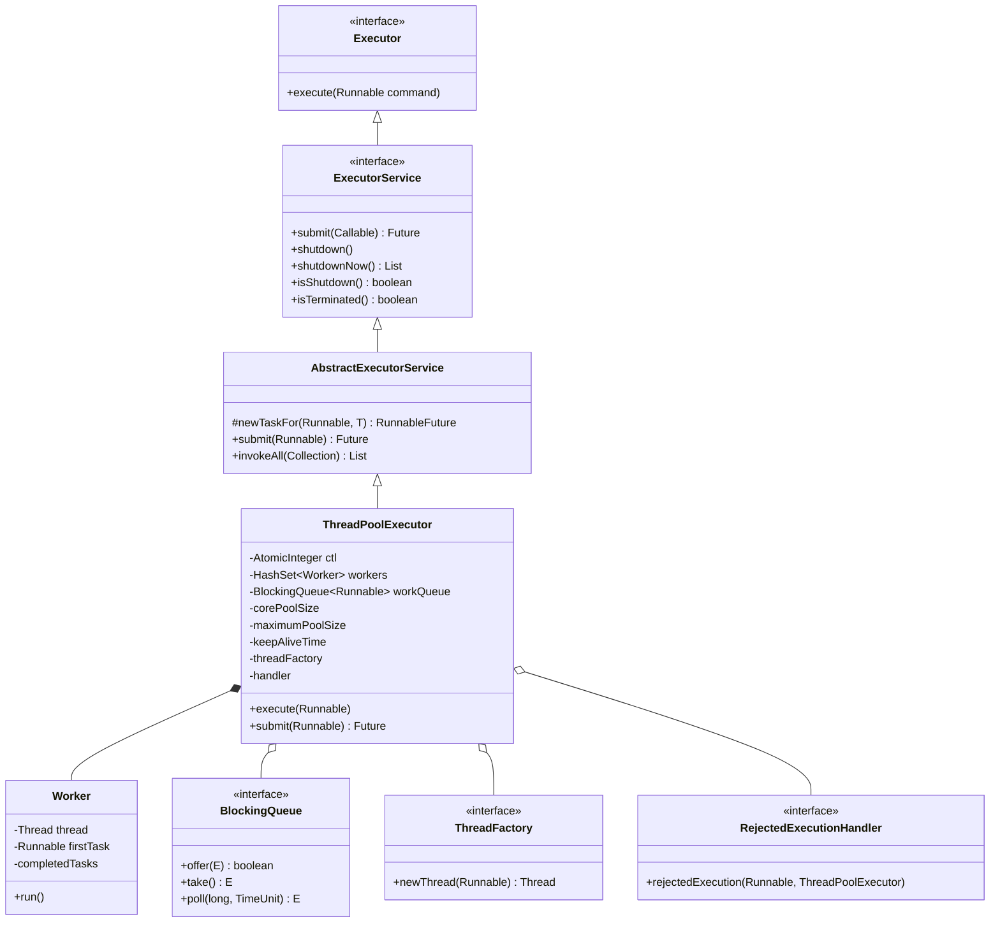
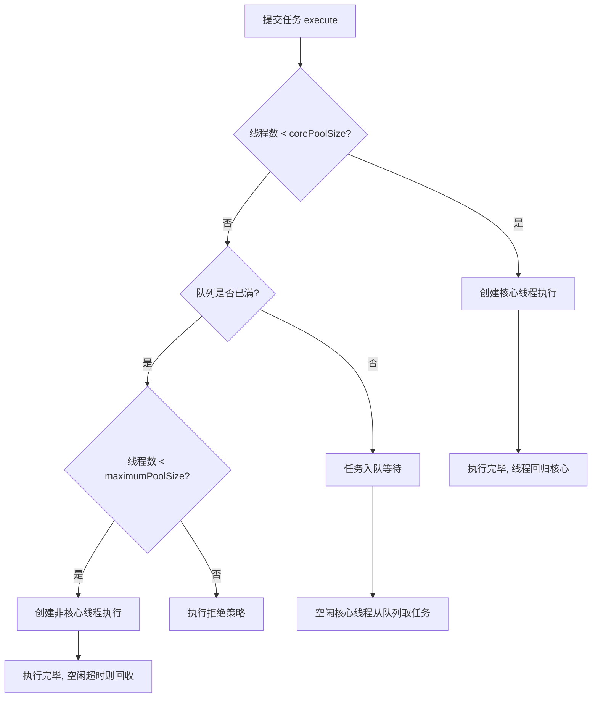
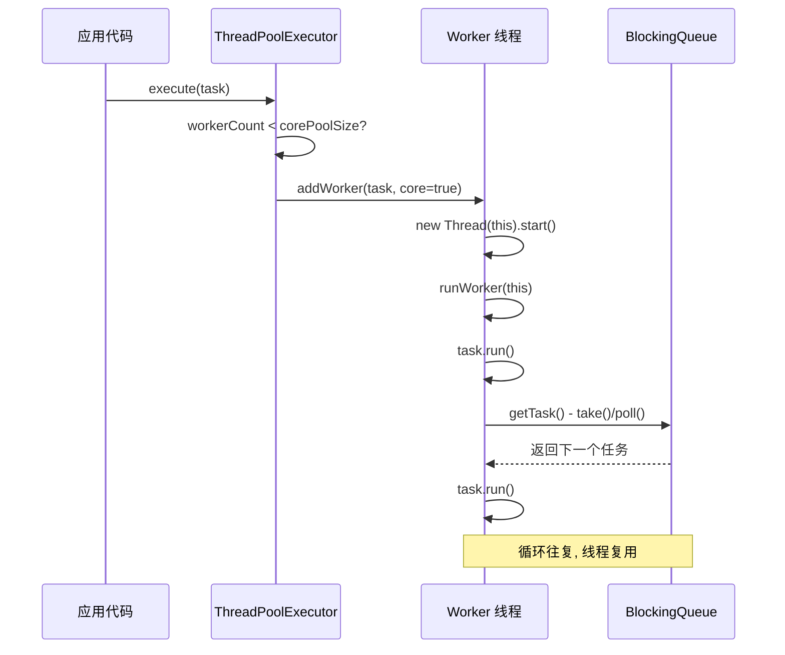

## 引言

阿里巴巴 Java 开发手册中有一条铁律：**禁止使用 Executors 创建线程池，必须通过 ThreadPoolExecutor 手动构造**。这条规范背后是无数次线上 OOM 和线程爆炸的血泪教训。

`Executors.newFixedThreadPool()` 使用无界队列，任务无限堆积最终内存耗尽；`Executors.newCachedThreadPool()` 允许创建 Integer.MAX_VALUE 个线程，瞬间就能耗尽系统资源。本文将深入剖析 ThreadPoolExecutor 的 7 大参数、4 种拒绝策略、worker 线程的完整生命周期，带你掌握线程池的底层原理和生产环境最佳实践。

## 为什么必须使用线程池

频繁创建和销毁线程的代价远超想象：

- **内存开销**：每个线程默认分配 1MB 栈空间（-Xss 参数），创建 1000 个线程就是 1GB
- **CPU 开销**：线程上下文切换（保存寄存器、刷新 TLB）消耗 CPU 周期
- **GC 压力**：线程相关的对象（ThreadLocal、栈帧）增加 GC 负担

线程池的核心价值在于 **复用、管理、控制**：

1. **线程复用**：已创建的线程从任务队列中持续获取任务执行，避免反复创建销毁
2. **并发控制**：通过 corePoolSize 和 maximumPoolSize 精确控制并发度
3. **任务管理**：阻塞队列缓冲任务，拒绝策略兜底防止系统崩溃
4. **资源隔离**：不同业务使用不同线程池，避免相互影响

## 线程池完整架构



## 线程池的七大核心参数

```java
public ThreadPoolExecutor(
    int corePoolSize,          // 核心线程数
    int maximumPoolSize,       // 最大线程数
    long keepAliveTime,        // 空闲线程存活时间
    TimeUnit unit,             // 时间单位
    BlockingQueue<Runnable> workQueue,  // 任务队列
    ThreadFactory threadFactory,        // 线程创建工厂
    RejectedExecutionHandler handler    // 拒绝策略
)
```

### 1. corePoolSize（核心线程数）

提交任务时，如果当前线程数小于 corePoolSize，会直接创建新线程执行任务，**即使已有空闲核心线程**。默认情况下，核心线程永不回收，除非设置了 `allowCoreThreadTimeOut = true`。

### 2. maximumPoolSize（最大线程数）

当核心线程都在忙、阻塞队列已满时，线程池会继续创建线程直到达到 maximumPoolSize。**非核心线程空闲超过 keepAliveTime 会被回收**。

### 3. keepAliveTime（线程存活时间）

非核心线程的空闲时间超过此值就会被回收。配合 `allowCoreThreadTimeOut = true` 也可以回收核心线程。

### 4. workQueue（阻塞队列）

| 队列类型 | 是否有界 | 适用场景 | 风险 |
| :--- | :--- | :--- | :--- |
| `LinkedBlockingQueue` | 默认无界（可指定容量） | 通用场景 | 无界时可能 OOM |
| `ArrayBlockingQueue` | 有界 | 需要精确控制内存 | 容量固定，可能触发拒绝策略 |
| `SynchronousQueue` | 无容量（直接传递） | 配合无界 maximumPoolSize | 线程可能爆炸 |
| `PriorityBlockingQueue` | 无界 | 需要优先级调度 | 可能 OOM |
| `DelayQueue` | 无界 | 延迟/定时任务 | 可能 OOM |

> **💡 核心提示**：**队列的选择比线程数配置更重要**。无界队列看似安全（不会触发拒绝策略），但任务无限堆积最终导致 OOM。有界队列配合合理的拒绝策略才是真正的生产方案。

### 5. threadFactory（线程工厂）

默认工厂创建的线程名称为 `pool-N-thread-M`，排查问题时毫无辨识度。**生产环境务必自定义 ThreadFactory**：

```java
ThreadFactory factory = new ThreadFactory() {
    private final AtomicInteger counter = new AtomicInteger(0);
    @Override
    public Thread newThread(Runnable r) {
        Thread t = new Thread(r, "order-service-pool-" + counter.incrementAndGet());
        t.setDaemon(false);
        t.setPriority(Thread.NORM_PRIORITY);
        return t;
    }
};
```

### 6. handler（拒绝策略）

当线程数达到 maximumPoolSize 且队列已满时触发：

| 策略 | 行为 | 适用场景 |
| :--- | :--- | :--- |
| `AbortPolicy`（默认） | 抛出 `RejectedExecutionException` | 不允许丢失任务的场景 |
| `CallerRunsPolicy` | 调用者线程自己执行该任务 | 需要平滑限流、允许降级 |
| `DiscardPolicy` | 默默丢弃，不抛异常 | 允许丢失的非关键任务 |
| `DiscardOldestPolicy` | 丢弃队列最旧的任务，重试执行当前 | 需要保证最新任务的场景 |

> **💡 核心提示**：**不要盲目使用默认的 AbortPolicy**。在高并发场景下，大量任务被拒绝会导致异常风暴。`CallerRunsPolicy` 提供了一种自然的背压机制——当线程池满时，调用者自己执行任务，自然降低提交速度。

## 线程池工作原理



### execute() 完整流程

1. **判断线程数 < corePoolSize** → 创建新核心线程执行任务
2. **判断队列是否可入队** → 任务入队等待
3. **二次检查线程池状态** → 如果已非 RUNNING，移除任务并执行拒绝策略
4. **判断线程数 < maximumPoolSize** → 创建非核心线程执行任务
5. **达到上限** → 执行拒绝策略

## 线程池源码剖析

### 线程池的控制状态

```java
public class ThreadPoolExecutor extends AbstractExecutorService {
    // ctl 用 32 位整数同时存储线程池状态和线程数量
    // 高 3 位: 状态, 低 29 位: 线程数
    private final AtomicInteger ctl = new AtomicInteger(ctlOf(RUNNING, 0));
    private static final int COUNT_BITS = Integer.SIZE - 3; // 29
    private static final int CAPACITY = (1 << COUNT_BITS) - 1; // 约 5 亿

    private final ReentrantLock mainLock = new ReentrantLock();
    private final HashSet<Worker> workers = new HashSet<>();
    private final Condition termination = mainLock.newCondition();
    private volatile boolean allowCoreThreadTimeOut;
    private int largestPoolSize; // 历史峰值

    // 七大核心参数
    private volatile int corePoolSize;
    private volatile int maximumPoolSize;
    private volatile long keepAliveTime;
    private final BlockingQueue<Runnable> workQueue;
    private volatile ThreadFactory threadFactory;
    private volatile RejectedExecutionHandler handler;
}
```

用一个 `AtomicInteger` 同时存储状态和线程数——高 3 位存状态（5 种），低 29 位存线程数（最大约 5 亿），设计非常巧妙。

### 线程池的五种状态

| 状态 | 二进制值 | 含义 |
| :--- | :--- | :--- |
| RUNNING | 111 | 接收新任务，处理队列中的任务 |
| SHUTDOWN | 000 | 不接收新任务，继续处理队列中的任务 |
| STOP | 001 | 不接收新任务，不处理队列任务，中断所有线程 |
| TIDYING | 010 | 所有任务完成，工作线程数为 0 |
| TERMINATED | 011 | terminated() 方法执行完毕 |

### execute() 源码详解

```java
public void execute(Runnable command) {
    if (command == null) throw new NullPointerException();

    int c = ctl.get();
    // 步骤 1: 线程数 < corePoolSize, 创建核心线程
    if (workerCountOf(c) < corePoolSize) {
        if (addWorker(command, true)) return;
        c = ctl.get();
    }
    // 步骤 2: 尝试将任务入队
    if (isRunning(c) && workQueue.offer(command)) {
        int recheck = ctl.get();
        // 二次检查: 如果线程池已非 RUNNING, 移除任务并拒绝
        if (!isRunning(recheck) && remove(command))
            reject(command);
        // 如果线程数为 0, 创建非核心线程从队列取任务
        else if (workerCountOf(recheck) == 0)
            addWorker(null, false);
    }
    // 步骤 3: 队列满了, 尝试创建非核心线程
    else if (!addWorker(command, false))
        // 步骤 4: 创建失败(达到 maximumPoolSize), 执行拒绝策略
        reject(command);
}
```

### addWorker() 源码

```java
private boolean addWorker(Runnable firstTask, boolean core) {
    retry: for (;;) {
        int c = ctl.get();
        int rs = runStateOf(c);
        // 检查是否可以提交任务
        if (rs >= SHUTDOWN &&
                !(rs == SHUTDOWN && firstTask == null && !workQueue.isEmpty()))
            return false;
        for (;;) {
            int wc = workerCountOf(c);
            // 校验线程数上限
            if (wc >= CAPACITY || wc >= (core ? corePoolSize : maximumPoolSize))
                return false;
            // CAS 增加线程计数
            if (compareAndIncrementWorkerCount(c)) break retry;
            c = ctl.get();
            if (runStateOf(c) != rs) continue retry;
        }
    }
    // 创建 Worker 并启动线程
    boolean workerStarted = false, workerAdded = false;
    Worker w = new Worker(firstTask);
    final Thread t = w.thread;
    if (t != null) {
        final ReentrantLock mainLock = this.mainLock;
        mainLock.lock();
        try {
            int rs = runStateOf(ctl.get());
            if (rs < SHUTDOWN || (rs == SHUTDOWN && firstTask == null)) {
                if (t.isAlive()) throw new IllegalThreadStateException();
                workers.add(w);
                int s = workers.size();
                if (s > largestPoolSize) largestPoolSize = s;
                workerAdded = true;
            }
        } finally { mainLock.unlock(); }
        if (workerAdded) {
            t.start();
            workerStarted = true;
        }
    }
    if (!workerStarted) addWorkerFailed(w);
    return workerStarted;
}
```

### Worker 工作线程的核心逻辑

```java
private final class Worker extends AbstractQueuedSynchronizer implements Runnable {
    final Thread thread;
    Runnable firstTask;

    Worker(Runnable firstTask) {
        setState(-1); // 初始化时不允许中断
        this.firstTask = firstTask;
        this.thread = getThreadFactory().newThread(this);
    }

    public void run() {
        runWorker(this);
    }
}
```

### runWorker() 源码——线程复用的秘密

```java
final void runWorker(Worker w) {
    Thread wt = Thread.currentThread();
    Runnable task = w.firstTask;
    w.firstTask = null;
    w.unlock(); // 允许中断
    boolean completedAbruptly = true;
    try {
        // 循环从队列获取任务，这就是线程复用的核心
        while (task != null || (task = getTask()) != null) {
            w.lock(); // 防止 shutdown() 中断正在执行的任务
            try {
                beforeExecute(wt, task);
                try {
                    task.run(); // 执行用户任务
                } catch (RuntimeException | Error x) {
                    afterExecute(task, x);
                    throw x; // 异常会终止 while 循环, Worker 退出
                } catch (Throwable x) {
                    afterExecute(task, x);
                    throw new Error(x);
                } finally {
                    afterExecute(task, null);
                }
            } finally {
                task = null;
                w.completedTasks++;
                w.unlock();
            }
        }
        completedAbruptly = false;
    } finally {
        processWorkerExit(w, completedAbruptly);
    }
}
```

`runWorker()` 的 while 循环是线程复用的核心：**线程不会因为执行完一个任务就退出，而是持续从队列中获取下一个任务**。

### getTask() 源码——从队列获取任务

```java
private Runnable getTask() {
    boolean timedOut = false;
    for (;;) {
        int c = ctl.get();
        int rs = runStateOf(c);
        // 线程池已停止或队列已空, 返回 null 触发 Worker 退出
        if (rs >= SHUTDOWN && (rs >= STOP || workQueue.isEmpty())) {
            decrementWorkerCount();
            return null;
        }
        int wc = workerCountOf(c);
        // 判断是否需要超时回收（非核心线程 或 开启了 allowCoreThreadTimeOut）
        boolean timed = allowCoreThreadTimeOut || wc > corePoolSize;
        if ((wc > maximumPoolSize || (timed && timedOut))
                && (wc > 1 || workQueue.isEmpty())) {
            if (compareAndDecrementWorkerCount(c)) return null;
            continue;
        }
        try {
            // 核心线程: take() 无限阻塞等待
            // 非核心线程: poll(timeout) 超时返回 null
            Runnable r = timed ?
                    workQueue.poll(keepAliveTime, TimeUnit.NANOSECONDS) :
                    workQueue.take();
            if (r != null) return r;
            timedOut = true;
        } catch (InterruptedException retry) {
            timedOut = false;
        }
    }
}
```

## 线程池任务执行流程



## 线程池的优雅关闭

### shutdown() vs shutdownNow()

| 方法 | 线程池状态 | 是否接收新任务 | 队列任务 | 线程处理 |
| :--- | :--- | :--- | :--- | :--- |
| `shutdown()` | → SHUTDOWN | 否 | 继续处理 | 等待完成任务后退出 |
| `shutdownNow()` | → STOP | 否 | 丢弃（返回列表） | 中断所有线程 |

```java
// 推荐的优雅关闭方式
executor.shutdown();
try {
    if (!executor.awaitTermination(60, TimeUnit.SECONDS)) {
        executor.shutdownNow();
        if (!executor.awaitTermination(10, TimeUnit.SECONDS)) {
            System.err.println("线程池未能正常关闭");
        }
    }
} catch (InterruptedException e) {
    executor.shutdownNow();
    Thread.currentThread().interrupt();
}
```

> **💡 核心提示**：**线程池线程数的黄金公式**——CPU 密集型任务：线程数 = CPU 核数 + 1（多一个防止页故障导致的停顿）；IO 密集型任务：线程数 = CPU 核数 × (1 + 平均等待时间 / 平均计算时间)。实际项目中建议通过压测动态调整，而非死套公式。

## 为什么禁止使用 Executors 工厂方法

### Executors.newFixedThreadPool() 的隐患

```java
public static ExecutorService newFixedThreadPool(int nThreads) {
    return new ThreadPoolExecutor(nThreads, nThreads,
            0L, TimeUnit.MILLISECONDS,
            new LinkedBlockingQueue<Runnable>()); // 无界队列!
}
```

**问题**：`LinkedBlockingQueue` 默认容量是 `Integer.MAX_VALUE`。如果任务提交速度 > 消费速度，任务无限堆积，最终 **OOM**。

### Executors.newCachedThreadPool() 的隐患

```java
public static ExecutorService newCachedThreadPool() {
    return new ThreadPoolExecutor(0, Integer.MAX_VALUE, // 无界线程!
            60L, TimeUnit.SECONDS,
            new SynchronousQueue<Runnable>());
}
```

**问题**：`maximumPoolSize = Integer.MAX_VALUE`。如果任务执行缓慢且提交速度快，线程池会不断创建新线程，最终 **系统资源耗尽**。

### Executors.newSingleThreadExecutor() 的隐患

```java
public static ExecutorService newSingleThreadExecutor() {
    return new FinalizableDelegatedExecutorService
            (new ThreadPoolExecutor(1, 1, 0L, TimeUnit.MILLISECONDS,
                    new LinkedBlockingQueue<Runnable>())); // 同样是无界队列
}
```

与 newFixedThreadPool(1) 相同问题：无界队列可能 OOM。

## 生产环境避坑指南

1. **Executors.newFixedThreadPool 导致 OOM**：无界队列 `LinkedBlockingQueue` 在任务积压时无限增长，堆内存耗尽。解决方案：使用有界 `ArrayBlockingQueue`。
2. **Executors.newCachedThreadPool 线程爆炸**：`Integer.MAX_VALUE` 最大线程数，任务慢时疯狂创建线程，耗尽内存和文件描述符。解决方案：手动设置合理的 `maximumPoolSize`。
3. **默认 AbortPolicy 导致任务丢失**：高并发时大量 `RejectedExecutionException` 被抛出，请求失败。解决方案：根据业务选择 `CallerRunsPolicy` 或自定义拒绝策略（如落盘重试）。
4. **队列容量设为 Integer.MAX_VALUE**：表面上避免拒绝策略，实际是掩耳盗铃——任务只是从被拒绝变成了撑爆内存。解决方案：有界队列 + 合理拒绝策略。
5. **不监控线程池指标**：生产环境不知道线程池的活跃线程数、队列大小、完成任务数。解决方案：通过 `getPoolSize()`、`getQueue().size()`、`getCompletedTaskCount()` 接入监控告警。
6. **任务执行时间过长阻塞其他任务**：线程池是共享资源，一个慢任务会占用工作线程，导致队列中其他任务延迟。解决方案：设置任务超时、使用独立线程池隔离不同业务。
7. **Worker 中未捕获异常导致线程退出**：`run()` 方法中的未捕获异常会使 Worker 退出，线程池需要重新创建线程。解决方案：在任务内部 try-catch 所有异常。

## 关键对比

### 四种线程池工厂方法对比

| 工厂方法 | corePoolSize | maximumPoolSize | 队列类型 | 主要风险 |
| :--- | :--- | :--- | :--- | :--- |
| `newFixedThreadPool` | N | N | 无界 LinkedBlockingQueue | OOM |
| `newCachedThreadPool` | 0 | Integer.MAX_VALUE | SynchronousQueue | 线程爆炸 |
| `newSingleThreadExecutor` | 1 | 1 | 无界 LinkedBlockingQueue | OOM |
| `newScheduledThreadPool` | N | Integer.MAX_VALUE | DelayedWorkQueue | 线程爆炸 |

### 四种拒绝策略对比

| 策略 | 行为 | 性能影响 | 数据安全 | 适用场景 |
| :--- | :--- | :--- | :--- | :--- |
| `AbortPolicy` | 抛异常 | 低（快速失败） | 不丢失 | 关键业务，不能容忍任务丢失 |
| `CallerRunsPolicy` | 调用者执行 | 高（阻塞提交方） | 不丢失 | 需要自然限流的场景 |
| `DiscardPolicy` | 静默丢弃 | 最低 | 丢失 | 日志、监控等非关键任务 |
| `DiscardOldestPolicy` | 丢弃最旧 | 低 | 部分丢失 | 实时性要求高的场景 |

## 总结

线程池是 Java 并发编程中最基础也最重要的组件。理解其 7 大参数的工作机制、Worker 线程的复用原理、拒绝策略的选择，是每一个 Java 开发者的必修课。

### 行动清单

1. **全局搜索并替换所有 `Executors.newXXX()` 调用**，替换为手动构造 `ThreadPoolExecutor`，使用有界队列和合理的线程数。
2. **为每个线程池配置自定义 ThreadFactory**，线程名包含业务标识，如 `order-service-pool-{num}`。
3. **为关键线程池配置监控**，定期输出 `getPoolSize()`、`getActiveCount()`、`getQueue().size()`、`getCompletedTaskCount()`。
4. **检查拒绝策略选择**：核心业务使用 `CallerRunsPolicy` 或自定义策略（落盘 + 重试），非关键任务可用 `DiscardPolicy`。
5. **配置优雅关闭流程**：先 `shutdown()`，等待 `awaitTermination()`，超时再 `shutdownNow()`。
6. **设置 `allowCoreThreadTimeOut = true`** 对于非持续有任务的线程池，避免空闲核心线程浪费资源。
7. **推荐阅读**：《Java 并发编程实战》第 8 章（线程池的使用）、Doug Lea 的 `ThreadPoolExecutor` 源码注释。
