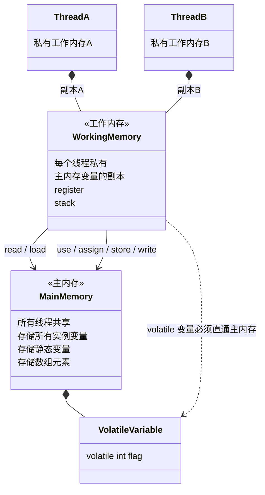
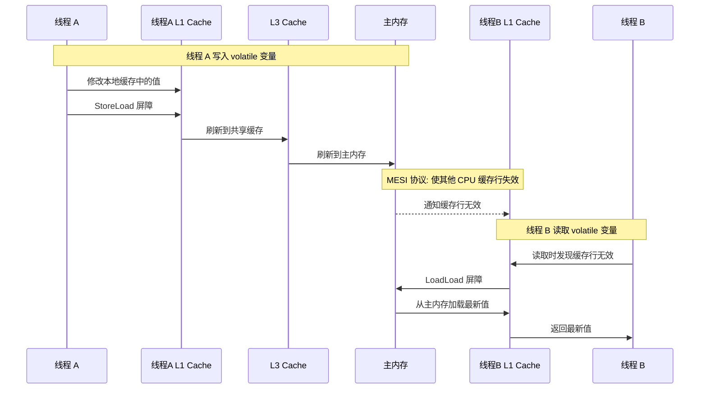
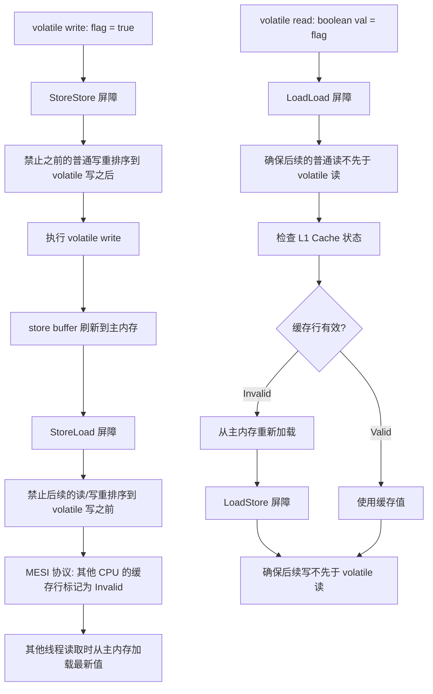

## 引言

volatile 能保证原子性吗？这个看似简单的面试题，淘汰了无数候选人。答案是否定的——volatile 只能保证**可见性**和**有序性**，但**不保证原子性**。`volatile int i; i++` 这个操作在多线程下仍然会出现数据竞争。

volatile 是 Java 并发编程中最基础也最容易被误用的关键字。很多人知道它"防止重排序"和"保证可见性"，但说不清楚底层是怎么做到的、内存屏障是什么、happens-before 规则如何应用、MESI 缓存一致性协议如何协作。本文将深入 Java 内存模型（JMM）、MESI 协议、内存屏障的底层实现，并通过 DCL 单例模式展示 volatile 的经典应用场景。

## volatile 的两大核心作用

### 1. 保证可见性

当一个线程修改了 volatile 变量的值，新值会**立即刷新到主内存**，其他线程读取该变量时，**强制从主内存重新加载**，而不是使用自己工作内存中的缓存副本。

### 2. 禁止指令重排序

编译器和处理器为了优化性能，会对指令进行重排序。volatile 通过在编译期插入**内存屏障（Memory Barrier）** 指令，禁止特定类型的重排序，保证代码的执行顺序符合预期。

> **💡 核心提示**：**volatile 不保证原子性**。复合操作如 `i++`（读取 → 加 1 → 写回）在多线程下仍然会丢失更新。`volatile` 保证的是每次读取都能拿到最新的值，但不能保证在"读取-修改-写回"这个过程中值没有被其他线程修改。

## Java 内存模型（JMM）

JMM（Java Memory Model）定义了 Java 程序中各个线程如何访问共享内存的规范。

### JMM 内存抽象



JMM 规定所有变量都存储在**主内存**中，每个线程有自己的**工作内存**。线程对变量的操作都在工作内存中进行，不能直接操作主内存。

**volatile 变量的特殊性**：读写 volatile 变量时，必须绕过工作内存的缓存，直接与主内存交互。

### JMM 八大原子操作

| 操作 | 说明 |
| :--- | :--- |
| `read` | 从主内存读取变量 |
| `load` | 将 read 的值放入工作内存 |
| `use` | 将工作内存的值传递给执行引擎 |
| `assign` | 将执行引擎的值赋回工作内存 |
| `store` | 将工作内存的值传回主内存 |
| `write` | 将 store 的值放入主内存变量 |
| `lock` | 锁定主内存变量 |
| `unlock` | 解锁主内存变量 |

## volatile 可见性的底层实现

### volatile 读写的主内存交互



> **💡 核心提示**：volatile 的可见性实现依赖于两个层面：1）**JVM 层面**——通过内存屏障禁止工作内存缓存 volatile 变量；2）**硬件层面**——通过 MESI 缓存一致性协议保证多核 CPU 之间的缓存同步。

## 内存屏障详解

JVM 通过在 volatile 读写操作前后插入四种内存屏障来保证有序性：

| 屏障类型 | 插入位置 | 作用 |
| :--- | :--- | :--- |
| `LoadLoad` | volatile 读之前 | 禁止后续的普通读先于 volatile 读执行 |
| `LoadStore` | volatile 读之后 | 禁止后续的写先于 volatile 读执行 |
| `StoreStore` | volatile 写之前 | 禁止之前的写与 volatile 写重排序 |
| `StoreLoad` | volatile 写之后 | 禁止之前的写与后续的读写重排序（最昂贵） |

### volatile 读写的屏障语义

```
volatile read:
    LoadLoad 屏障    ← 确保后续普通读不会先于 volatile 读
    [volatile read]
    LoadStore 屏障   ← 确保后续普通写不会先于 volatile 读

volatile write:
    StoreStore 屏障  ← 确保之前的普通写不会与 volatile 写重排序
    [volatile write]
    StoreLoad 屏障   ← 确保之后的读写不会先于 volatile 写
```

在 x86 架构中，由于硬件本身已经提供了较强的内存序保证，JVM 只需要对 volatile 写插入 **StoreLoad 屏障**（通过 `lock` 前缀指令或 `mfence` 指令实现）。volatile 读在 x86 下不需要额外屏障，因为 x86 处理器不会重排序 Load 操作。

### volatile 完整执行流程



## happens-before 原则

happens-before 是 JMM 中定义的两个操作之间的偏序关系。如果 A happens-before B，那么 A 的执行结果对 B 可见。

JMM 的 happens-before 规则：

| 规则 | 说明 |
| :--- | :--- |
| 程序顺序规则 | 同一个线程中，书写在前的操作 happens-before 书写在后的操作 |
| volatile 变量规则 | 对 volatile 变量的写 happens-before 后续对该变量的读 |
| 传递规则 | A happens-before B，B happens-before C，则 A happens-before C |
| 锁规则 | 解锁 happens-before 后续的加锁 |
| 线程启动规则 | Thread.start() happens-before 该线程的任何操作 |
| 线程终止规则 | 线程的所有操作 happens-before Thread.join() 返回 |
| 中断规则 | Thread.interrupt() happens-before 被中断线程检测到中断 |
| 对象终结规则 | 对象初始化完成 happens-before finalize() 开始 |

**volatile 的核心 happens-before 规则**：线程 A 写入 volatile 变量，happens-before 线程 B 读取同一个 volatile 变量。这意味着线程 A 在写 volatile 之前的所有操作（包括普通变量的修改），对线程 B 在读取 volatile 之后都是可见的。

```java
// 线程 A
data = 42;          // 普通变量写入
volatileFlag = true; // volatile 写入 → happens-before 下面的读

// 线程 B
if (volatileFlag) {  // volatile 读取
    System.out.println(data); // 一定能读到 42，因为 happens-before 保证
}
```

## 为什么 volatile 不保证原子性？

以经典的 `i++` 为例：

```java
volatile int i = 0;

// 线程 1 执行 i++
int temp1 = i;      // 读取 i = 0
temp1 = temp1 + 1;  // temp1 = 1
i = temp1;          // 写入 i = 1

// 线程 2 同时执行 i++
int temp2 = i;      // 读取 i = 0（因为线程1还没写入）
temp2 = temp2 + 1;  // temp2 = 1
i = temp2;          // 写入 i = 1（覆盖线程1的结果）
```

`i++` 是一个**复合操作**（read-modify-write），包含三步：读取 → 修改 → 写回。volatile 只能保证单步操作的可见性，不能保证这三步的**原子性**。

> **💡 核心提示**：当需要对变量进行复合操作（如 `i++`、`check-then-act`）时，必须使用 `synchronized`、`ReentrantLock` 或 `AtomicInteger`（CAS 操作），volatile 无能为力。

## volatile 经典应用：DCL 单例模式

```java
public class Singleton {
    // volatile 必不可少！
    private static volatile Singleton instance;

    private Singleton() {}

    public static Singleton getInstance() {
        if (instance == null) {                    // 第一次检查
            synchronized (Singleton.class) {
                if (instance == null) {            // 第二次检查
                    instance = new Singleton();    // 创建实例
                }
            }
        }
        return instance;
    }
}
```

### 为什么需要 volatile？

`instance = new Singleton()` 不是一个原子操作，JVM 执行时会分解为：

1. 分配内存空间
2. 调用构造函数初始化对象
3. 将 instance 引用指向新分配的内存地址

**如果没有 volatile**，步骤 2 和 3 可能发生指令重排序——instance 引用先指向未初始化的内存，然后另一个线程在第一层检查时发现 `instance != null`，直接返回了一个**未初始化完成的对象**。

**有了 volatile** 之后，`StoreStore` 屏障确保初始化操作（步骤 2）一定在赋值操作（步骤 3）之前完成，`StoreLoad` 屏障确保其他线程一定能看到初始化完成的对象。

### 如果没有 volatile 会发生什么

```
线程 A:                    线程 B:
分配内存 (instance 指向未初始化的对象)
                          getInstance() → 第一层检查: instance != null
                          直接返回 instance (未初始化完成!)
调用构造函数初始化
                          使用 instance → NullPointerException 或数据错误
```

## volatile 与 MESI 缓存一致性协议

现代多核 CPU 中，每个核都有自己的 L1/L2 缓存。MESI 协议保证多个 CPU 核心之间对同一内存地址的访问一致性：

| 状态 | 含义 | 描述 |
| :--- | :--- | :--- |
| **M**odified | 已修改 | 缓存行数据被修改，与主内存不一致，只有当前核持有 |
| **E**xclusive | 独占 | 缓存行数据与主内存一致，只有当前核持有 |
| **S**hared | 共享 | 缓存行数据与主内存一致，多个核可能持有副本 |
| **I**nvalid | 无效 | 缓存行数据无效，需要从主内存重新加载 |

**volatile 与 MESI 的协作**：
1. 线程 A 写入 volatile 变量 → 缓存行标记为 Modified → 刷新到主内存 → 其他核的缓存行标记为 Invalid
2. 线程 B 读取 volatile 变量 → 发现自己的缓存行是 Invalid → 从主内存重新加载

> **💡 核心提示**：MESI 协议是硬件层面的实现，volatile 是 Java 层面的语义。JVM 通过内存屏障指令触发 CPU 的缓存一致性机制，将 Java 的 happens-before 语义映射到硬件行为。

## volatile 与其他并发机制对比

| 机制 | 可见性 | 原子性 | 有序性 | 阻塞 | 适用场景 |
| :--- | :--- | :--- | :--- | :--- | :--- |
| `volatile` | 是 | 否（仅单次读写） | 是 | 否 | 状态标志位、DCL 单例 |
| `synchronized` | 是 | 是 | 是 | 是 | 临界区、复合操作 |
| `AtomicInteger` | 是 | 是（CAS） | 是 | 否 | 计数器、乐观锁 |
| `ReentrantLock` | 是 | 是 | 是 | 是 | 高级锁（可中断、超时、公平） |
| `final` | 是 | 是（只初始化一次） | 是 | 否 | 不可变对象 |

## 生产环境避坑指南

1. **用 volatile 做复合操作（i++）**：`volatile` 不能保证 `i++`、`counter += n` 等复合操作的原子性。应改用 `AtomicInteger` 或 `LongAdder`。
2. **误以为 volatile 提供互斥**：volatile 只保证可见性和有序性，不提供互斥。多个线程可以同时进入 volatile 保护的代码块。需要互斥应使用 `synchronized` 或 `Lock`。
3. **DCL 单例不加 volatile**：双重检查锁定（DCL）模式中的 instance 字段**必须**声明为 volatile，否则可能发生指令重排序，返回未初始化完成的对象。
4. **volatile 引用但对象字段非 volatile**：`volatile List list` 只保证 list 引用本身的可见性，不保证 list 内部元素的可见性。如果多个线程修改 list 内容，仍然需要额外同步。
5. **滥用 volatile 替代 synchronized**：当需要同时保证可见性和原子性时（如检查-然后-执行），volatile 完全不能替代 synchronized。正确做法：能用 volatile 的场景（状态标志）用 volatile，不行的就用 CAS 或锁。
6. **忽略 StoreLoad 屏障的性能开销**：volatile 写的 `StoreLoad` 屏障是四种屏障中最昂贵的，它会阻止所有后续的内存操作先于写操作执行。在高性能场景下频繁 volatile 写可能成为瓶颈，此时应考虑 `AtomicLong` + CAS 方案。

## 总结

volatile 是 Java 并发编程的基石之一。理解其背后的 JMM 内存模型、happens-before 规则、内存屏障和 MESI 协议，是写出正确并发代码的前提。记住核心原则：

- volatile 保证**可见性**和**有序性**，但**不保证原子性**
- 单次读写操作可以用 volatile，复合操作必须用 synchronized / AtomicXxx
- DCL 单例的 volatile 不能省，否则指令重排序会引入隐蔽 bug
- volatile 的性能开销主要来自 StoreLoad 内存屏障

### 行动清单

1. **检查所有 `volatile` 修饰的变量**，确认是否只有单次读写操作。如果是复合操作，替换为 `AtomicInteger` / `LongAdder`。
2. **审查所有 DCL 单例模式**，确保 instance 字段声明为 `volatile`。
3. **检查 volatile 引用类型的内部可变性**——如果 `volatile List<T>` 的内容会被多线程修改，需要额外同步或使用 `CopyOnWriteArrayList` / `ConcurrentHashMap`。
4. **用 volatile 替换 boolean 标志位**——线程间通信的状态标志（如 `shutdown` flag）优先使用 volatile 而非 synchronized，减少锁竞争。
5. **理解 happens-before 规则**——不仅是 volatile，`synchronized` 解锁-happens-before-加锁、Thread.start-happens-before-线程内操作，这些规则可以帮你推理并发代码的正确性。
6. **压测 volatile 写密集场景的性能**——在高并发写入 volatile 变量的场景下，StoreLoad 屏障可能成为瓶颈。考虑使用 `AtomicLong` + CAS 或 `Striped64`（LongAdder 的基类）优化。
7. **推荐阅读**：《Java 并发编程实战》第 16 章（Java 内存模型）、JLS（Java Language Specification）第 17 章（Threads and Locks）、JSR-133 规范。
