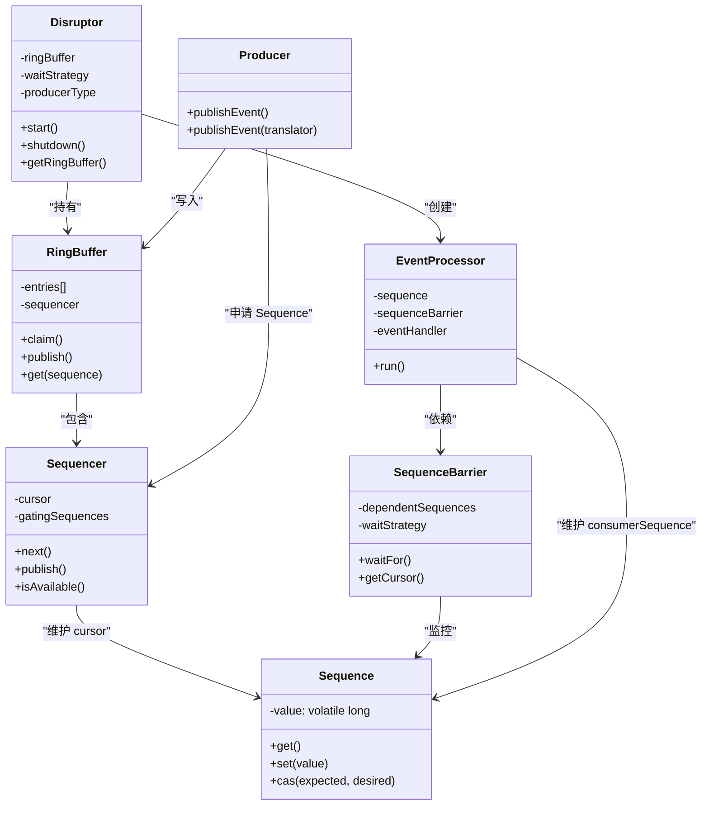
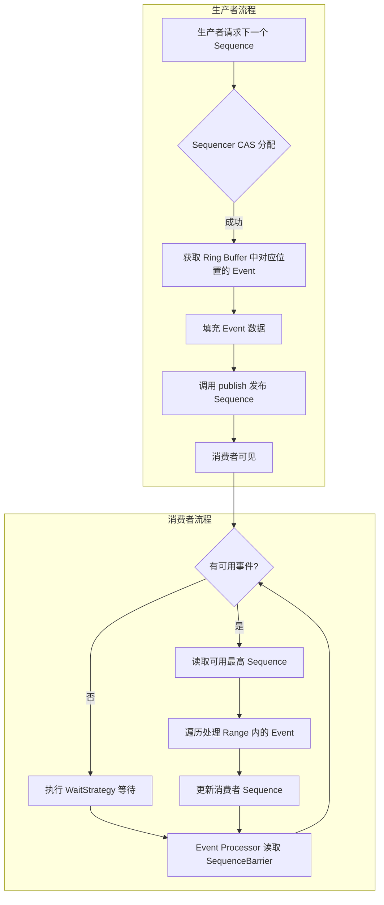

## 引言

在金融交易系统中，一个单线程的队列如何做到每秒处理 600 万笔订单？当传统的 `ArrayBlockingQueue` 在高并发下因锁竞争导致 TPS 腰斩时，是什么设计让 LMAX Disruptor 的延迟降低到纳秒级别？

答案藏在 CPU 缓存行中，藏在环形数组的连续内存里，藏在无锁 CAS 的原子操作里。读完本文，你将掌握：

- **环形缓冲区 (Ring Buffer)** 如何通过数组连续内存实现 Cache-Friendly 的数据访问
- **Sequence & Sequence Barrier** 如何取代传统锁，实现无锁的生产者/消费者协调
- **WaitStrategy 四种策略** 如何在延迟和 CPU 消耗之间做出精准权衡

这不仅是面试中"并发编程"高频题的标准答案，更是你面对"传统队列成为系统瓶颈"时的破局利器。

---

## 深度解析 LMAX Disruptor 架构设计：超越传统队列的极限

### 高性能并发通信的瓶颈

在多线程环境中，不同的线程需要交换数据或通知事件。最直观的方式是使用线程安全的队列。然而，传统并发队列的局限性在于：

* **锁竞争 (Lock Contention)：** 大多数并发队列在读写操作的关键路径上使用锁（如 `synchronized` 或 `ReentrantLock`），在高并发下容易产生锁竞争，导致线程阻塞和上下文切换，降低吞吐量。无锁队列（如 `ConcurrentLinkedQueue`）虽然避免了锁，但在高并发写时也可能面临 CAS 竞争和内存分配开销。
* **缓存未命中 (Cache Miss)：** 传统队列通常基于链表或数组实现，当多个线程访问队列的不同部分时，数据可能分散在内存各处，导致 CPU 缓存未命中，影响性能。
* **内存分配和垃圾回收：** 链表实现的队列在每个节点都需要进行内存分配和 GC，带来额外的开销。

Disruptor 的核心目标就是突破这些局限性，实现极低的延迟和极高的吞吐量。

> **💡 核心提示**：传统并发队列的三大性能杀手——锁竞争（上下文切换）、缓存未命中（内存跳跃访问）、GC 压力（频繁对象创建）。Disruptor 的设计就是逐一击破这三个问题。

### Disruptor 是什么？定位与核心理念

Disruptor 是由英国金融公司 LMAX Exchange 开源的一个**高性能的线程间消息传递框架**。

* **定位：** 它是一个用于在不同线程之间高效安全地交换数据的**并发组件**，常被用作传统并发队列的替代方案。
* **核心理念：** 通过一个**无锁的环形缓冲区 (Ring Buffer)** 和一系列协调机制，实现生产者向缓冲区快速写入数据，消费者从缓冲区快速读取数据，最大化 CPU 缓存利用率，最小化锁竞争。

### 为什么选择 Disruptor？优势分析

* **卓越的性能：** 在高吞吐、低延迟场景下，性能通常远超传统并发队列。
* **无锁或 CAS 操作：** 在数据读写的关键路径上避免了重量级锁，减少了线程阻塞和上下文切换。
* **Cache-Friendly：** 利用环形数组的内存连续性，提高了 CPU 缓存命中率。
* **定长设计：** Ring Buffer 固定大小，避免了运行时动态扩容和内存分配的开销。
* **多生产者/多消费者支持：** 支持多个生产者同时向 Ring Buffer 写入，以及多个消费者或消费者组从 Ring Buffer 读取。
* **灵活的等待策略：** 提供多种等待策略，开发者可以根据延迟和 CPU 消耗的需求进行权衡。

### Disruptor 核心概念详解

理解 Disruptor 需要掌握其几个独特的概念：

#### Ring Buffer (环形缓冲区)

* **定义：** Disruptor 的**核心数据结构**，一个固定大小的环形数组。
* **作用：** 存储生产者和消费者之间交换的**事件 (Event)**。生产者向 Ring Buffer 中写入 Event，消费者从中读取 Event。
* **特点：** 固定大小，数据顺序写入，循环使用。
* **比喻：** 一个有固定数量格子且循环转动的传送带。

#### Event (事件)

* **定义：** 存储在 Ring Buffer 格子中的**数据单元**。它通常是一个 POJO 对象，包含了需要在线程间传递的业务数据。
* **作用：** 生产者填充数据，消费者读取数据。
* **可变性：** 为了避免频繁创建对象，Ring Buffer 中的 Event 对象通常是**可变的**，生产者向格子中写入数据时，直接修改已存在 Event 对象的状态。

> **💡 核心提示**：Event 的可变性设计是 Disruptor 高性能的关键之一。通过预分配 Event 对象并复用，完全避免了运行时的对象创建和 GC 开销。这是"空间换时间"思想的极致应用。

#### Sequence (序号)

* **定义：** 一个简单的**原子计数器 (AtomicLong)**。
* **作用：** 生产者和消费者各自维护自己的 Sequence，用于追踪自己在 Ring Buffer 中的**位置**（即已经处理到哪个格子）。Sequence 的值代表处理的 Ring Buffer 格子的**序号**，它是单调递增的。

#### Sequence Barrier (序号栅栏)

* **定义：** Disruptor 提供的一个机制，用于协调生产者和消费者、以及不同消费者之间的进度。
* **作用：**
    * **流控：** 生产者通过 Sequence Barrier 检查 Ring Buffer 中是否有可写的空间（即，是否所有消费者都已消费完这个位置的数据），防止覆盖尚未被消费的数据。
    * **等待可用事件：** 消费者通过 Sequence Barrier 检查生产者已经发布到哪个 Sequence，以及所有前置消费者（如果存在依赖关系）已经处理到哪个 Sequence，等待新的可用事件出现。
* **比喻：** 一个"协调岗亭"，生产者在写入前要问它"我能写这个格子了吗？"，消费者在读取前要问它"有新的格子可读了吗？"。

#### Event Processor (事件处理器)

* **定义：** 消费者端的处理逻辑。它是一个独立的线程或任务，绑定到一个 Ring Buffer，负责读取 Ring Buffer 中的事件并进行处理。
* **作用：** 包含消费者具体的业务处理逻辑。它维护自己的 Sequence，并与 Sequence Barrier 协作，等待并读取新的可用事件，然后调用开发者提供的 `WorkHandler` 或类似回调函数来处理事件。
* **如何与 Sequence/Sequence Barrier 协作：** Event Processor 不断尝试获取其 `SequenceBarrier` 通知的可用的最高 Sequence。如果高于自己当前的 Sequence，就读取并处理之间的事件，然后更新自己的 Sequence。

#### Producer (生产者)

* **定义：** 负责向 Ring Buffer 发送事件的线程或组件。
* **如何发布事件：** 生产者通过向 Ring Buffer (更准确地说是 Ring Buffer 内部的 `Sequencer`) **申请 (Claim)** 下一个可用的 Sequence 序号，然后在对应序号的 Ring Buffer 格子中**写入** Event 数据，最后**发布 (Publish)** 这个 Sequence，使其对消费者可见。

#### WaitStrategy (等待策略)

* **定义：** 当消费者 (Event Processor) 在 `SequenceBarrier` 处等待新的可用事件时，定义了消费者等待的方式。
* **作用：** 决定消费者在没有可用事件时的 CPU 消耗和等待延迟之间的权衡。
* **常用策略对比及权衡：**
    * **`BlockingWaitStrategy`：** 使用锁和条件变量阻塞等待。CPU 消耗低，但延迟相对较高，可能发生上下文切换。
    * **`SleepingWaitStrategy`：** 在循环等待中，先进行有限次数的自旋，然后调用 `Thread.yield()` 让出 CPU，再调用 `LockSupport.parkNanos()` 休眠一小段时间。在低延迟和高吞吐之间取得平衡，CPU 消耗适中，适合不需要极低延迟且 CPU 竞争不激烈的场景。
    * **`YieldingWaitStrategy`：** 在循环等待中，使用 `Thread.yield()` 让出 CPU。CPU 消耗相对较高，但延迟较低，适合低延迟但 CPU 竞争不激烈的场景（或者生产者和消费者数量相近）。
    * **`BusySpinWaitStrategy`：** 循环等待，不让出 CPU 也不休眠。CPU 消耗最高，但延迟最低。适合对延迟要求极高，且 CPU 资源充足的场景。
* **选型：** 根据业务对延迟和 CPU 消耗的要求进行选择。

### Disruptor 核心组件关系图



### Disruptor 发布与消费流程



### Disruptor 架构设计与工作原理

Disruptor 的核心工作原理在于其**无锁的环形缓冲区设计**和**生产者/消费者通过 Sequence 和 Sequence Barrier 的协调机制**。

#### Ring Buffer 与 Sequence 的协同

* Ring Buffer 是一个用数组实现的循环队列。生产者和消费者通过 Sequence 追踪自己在数组中的位置。
* Sequence 是一个原子长整型 (`AtomicLong`)。生产者 Claim Sequence，消费者读取 Sequence，都是通过 CAS (Compare-And-Swap) 等原子操作完成，避免了重量级锁。
* 通过巧妙的索引计算 (`Sequence % RingBuffer 大小`)，将 Sequence 的单调递增映射到环形数组的循环索引上。

#### 发布流程

* **Claim Sequence：** 生产者首先通过 CAS 操作在全局唯一的 Sequencer (或生产者自己的 Sequencer) 上申请下一个或下一批可用的 Sequence 序号。
* **Write Event：** 生产者根据申请到的 Sequence 序号，直接找到 Ring Buffer 中对应的格子，写入事件数据（通常是修改已有对象的状态）。
* **Publish Sequence：** 生产者写完数据后，通过 CAS 操作更新自己的发布 Sequence，使其对消费者可见。这个 Publish 操作是轻量级的，通常只更新一个原子变量。
* **无锁原理：** 生产者 Claim Sequence 是通过 CAS 完成的。多个生产者竞争同一个 Sequence 时，只有一个成功，失败的重试。生产者写数据时，写在自己 Claim 的格子，不会与其他生产者冲突。消费者只读已 Publish 的格子，不会与生产者冲突。生产者 Claim 前会检查是否覆盖消费者未读的格子（通过 Sequence Barrier），实现流控。整个关键路径避免了重量级锁。

> **💡 核心提示**：多生产者场景下的 CAS 竞争是 Disruptor 唯一的"竞争点"。如果 CAS 失败，生产者会自旋重试。这就是为什么在高竞争场景下 `ProducerType.MULTI` 的性能会有所下降——这是无锁设计的固有限制。

#### 消费流程

* **获取可用 Sequence：** 消费者 (Event Processor) 需要知道目前生产者已经发布到哪个 Sequence (`producerSequence`)，以及所有**前置消费者** (如果有多个消费者形成依赖链) 已经消费到哪个 Sequence (`dependentConsumerSequence`)。
* **等待：** 消费者通过 `SequenceBarrier` 检查 `producerSequence` 和 `dependentConsumerSequence` 是否超过自己当前的 Sequence。如果当前没有新的可用事件（即 `producerSequence` 或 `dependentConsumerSequence` 没有超过自己），消费者会根据配置的 `WaitStrategy` 进行等待。
* **读取事件：** 一旦 `SequenceBarrier` 通知有新的可用事件（达到或超过某个 Sequence），消费者就会从自己当前的 Sequence 读取事件，直到可用的最高 Sequence。读取时直接通过 Sequence 找到 Ring Buffer 中的格子，获取事件数据。
* **处理事件：** 消费者执行开发者提供的业务处理逻辑。
* **更新自己的 Sequence：** 消费者处理完事件后，更新自己的 Sequence，表示自己已经消费到这个位置了。这个 Sequence 对后续消费者可见，也供生产者检查是否可以覆盖。

#### Cache-Friendly 设计

* Ring Buffer 使用连续的内存空间（数组）。生产者和消费者在 Ring Buffer 上进行顺序读写（虽然是循环的，但访问是连续的）。这种连续访问模式有利于 CPU 缓存，减少缓存未命中，提高数据访问速度。

#### 锁消除/减少竞争

* Disruptor 的核心在于将**并发的写入操作**（生产者申请 Sequence）转化为**原子操作和 CAS 竞争**，将**并发的读取操作**（消费者获取可用 Sequence）转化为**等待通知**。
* 每个生产者和消费者都有自己的 Sequence，它们之间的协调通过 Sequence Barrier 和原子操作完成，避免了在共享队列上的锁竞争热点。

### 构建一个简单的 Disruptor 应用

使用 Disruptor 需要进行一些初始化配置：

#### 定义 Event

定义一个 POJO 来存储需要在线程间传递的数据。

```java
public class LongEvent {
    private long value;
    public long getValue() { return value; }
    public void setValue(long value) { this.value = value; }
}
```

#### 定义 Event Factory

实现 `EventFactory<T>` 接口，用于在 Ring Buffer 中创建 Event 对象。Disruptor 初始化时会调用它来填充 Ring Buffer。

```java
import com.lmax.disruptor.EventFactory;

public class LongEventFactory implements EventFactory<LongEvent> {
    @Override
    public LongEvent newInstance() {
        return new LongEvent();
    }
}
```

#### 定义 Event Handler

实现 `EventHandler<T>` 接口，这是消费者处理事件的逻辑。

```java
import com.lmax.disruptor.EventHandler;

public class LongEventHandler implements EventHandler<LongEvent> {
    @Override
    public void onEvent(LongEvent event, long sequence, boolean endOfBatch) {
        System.out.println("Event: " + event.getValue() + ", Sequence: " + sequence + ", EndOfBatch: " + endOfBatch);
    }
}
```

#### 初始化 Disruptor

配置 Ring Buffer 大小、Event Factory、消费者 (Event Handlers)、Wait Strategy 等。

```java
import com.lmax.disruptor.RingBuffer;
import com.lmax.disruptor.dsl.Disruptor;
import com.lmax.disruptor.util.DaemonThreadFactory;
import java.nio.ByteBuffer;

// Ring Buffer 大小，必须是 2 的幂
int bufferSize = 1024;
LongEventFactory eventFactory = new LongEventFactory();
// 选择合适的等待策略
// BlockingWaitStrategy waitStrategy = new BlockingWaitStrategy();
// YieldingWaitStrategy waitStrategy = new YieldingWaitStrategy();

Disruptor<LongEvent> disruptor = new Disruptor<>(
    eventFactory,             // Event Factory
    bufferSize,               // Ring Buffer Size (必须是 2 的幂)
    DaemonThreadFactory.INSTANCE, // 线程工厂
    ProducerType.SINGLE,      // 生产者类型: SINGLE 或 MULTI
    new YieldingWaitStrategy()    // 等待策略
);

// 连接消费者 Handler
disruptor.handleEventsWith(new LongEventHandler());

// 启动 Disruptor
disruptor.start();

// 获取 Ring Buffer 用于发布事件
RingBuffer<LongEvent> ringBuffer = disruptor.getRingBuffer();

// 应用关闭时调用 disruptor.shutdown();
```

#### 发布事件

```java
// 使用 Event Translator 方式发布 (推荐)
EventTranslatorOneArg<LongEvent, ByteBuffer> translator =
    (event, sequence, buffer) -> event.setValue(buffer.getLong(0));

ByteBuffer buffer = ByteBuffer.allocate(8);
buffer.putLong(0, 1234L);

ringBuffer.publishEvent(translator, buffer);
```

> **💡 核心提示**：Ring Buffer 的大小必须是 2 的幂。这是因为 Disruptor 内部使用位运算 `sequence & (bufferSize - 1)` 来替代取模运算 `sequence % bufferSize`，位运算的性能远高于取模。这也是 Disruptor 极致性能优化的一个体现。

### Disruptor vs `java.util.concurrent` 队列 对比分析

| 特性 | LMAX Disruptor | `java.util.concurrent` 队列 | 推荐指数 |
| :--- | :--- | :--- | :--- |
| **核心数据结构** | 环形数组 (Ring Buffer) | 数组或链表 | - |
| **并发控制** | 无锁或 CAS 操作，Sequence Barrier | 锁 (`ReentrantLock`)，条件变量 | - |
| **Cache 利用率** | 高 (数组连续访问) | 相对较低 (链表分散) | - |
| **内存分配** | 初始化时分配固定大小，事件对象可复用 | 运行时可能频繁分配节点 | - |
| **吞吐量/延迟** | 极高/极低 | 相对较低 | - |
| **固定大小** | 是 | `ArrayBlockingQueue` 是，`ConcurrentLinkedQueue` 否 | - |
| **支持模式** | 单/多生产者，单/多消费者，消费者依赖关系链 | 单/多生产者，单/多消费者 | - |
| **复杂性** | 概念复杂，入门曲线陡峭 | 概念简单，易于使用 | - |
| **适用场景** | 对性能有极致要求的线程间通信 | 大多数通用生产者-消费者场景 | - |
| **推荐场景** | 高频交易、日志聚合、高性能数据管道 | 一般业务系统的异步任务处理 | ⭐⭐⭐⭐⭐ |

### WaitStrategy 对比与选型

| 策略 | 延迟 | CPU 消耗 | 上下文切换 | 适用场景 |
| :--- | :--- | :--- | :--- | :--- |
| `BlockingWaitStrategy` | 高 (微秒级) | 最低 | 是 | CPU 资源紧张，对延迟不敏感 |
| `SleepingWaitStrategy` | 中等 | 低 | 偶发 | 平衡型选择，大多数业务场景 |
| `YieldingWaitStrategy` | 低 (微秒级) | 中等 | 否 | 低延迟要求，生产者和消费者数量相近 |
| `BusySpinWaitStrategy` | 最低 (纳秒级) | 最高 (100%) | 否 | 极致延迟要求，独占 CPU 核心 |

### 理解 Disruptor 架构与使用方式的价值

* **掌握高性能并发原理：** 深入理解无锁编程、原子操作、内存屏障等概念在实际框架中的应用。
* **理解锁消除技术：** 学习如何通过设计避免锁竞争。
* **读懂高性能框架源码：** 许多高性能框架（如 Dubbo 的新版本、Reactor Netty 的部分组件）借鉴或使用了 Disruptor 的思想。
* **排查高并发瓶颈：** 当传统队列成为性能瓶颈时，知道 Disruptor 是一个可能的解决方案。
* **应对面试：** Disruptor 是一个经典案例，考察你对并发深度知识的掌握。

### Disruptor 为何是面试热点

* **高性能并发代表：** 它是 Java 领域实现高并发、低延迟的一个标杆。
* **无锁编程经典案例：** 面试官常用它来考察候选人对无锁编程、CAS、原子操作、并发竞争的理解。
* **对比传统队列：** 这是最常见的考察方式，通过对比传统队列的局限性来体现对 Disruptor 价值的理解。
* **考察基础知识：** 涉及操作系统原理（缓存）、CPU 缓存、内存模型等。

### 面试问题示例与深度解析

* **什么是 LMAX Disruptor？它解决了 Java 并发编程中的什么问题？核心理念是什么？** (定义高性能线程间消息框架，解决传统队列高并发性能瓶颈，核心理念是无锁环形缓冲区和 Cache-Friendly)
* **为什么说传统并发队列在高并发下可能有性能问题？** (回答锁竞争、上下文切换、内存分配、Cache Miss)
* **请描述一下 Disruptor 的核心组件：Ring Buffer、Sequence、Sequence Barrier、Event Processor、WaitStrategy。它们分别起什么作用？它们之间如何协作？** (**核心！** 定义每个组件作用。协作：Producer Claim Sequence -> Write Event -> Publish Sequence。Consumer 通过 Barrier 等待 -> 读取 Event -> 更新 Sequence)
* **请解释一下 Disruptor 的"无锁"设计。它在关键路径上如何避免使用锁？** (**核心！** 回答通过 Sequence 的原子操作 (CAS) 来申请和发布位置，消费者和生产者通过 Sequence Barrier 进行协调，避免在共享数据结构上加锁)
* **Disruptor 的 Ring Buffer 设计为什么有利于提高性能？它与 CPU 缓存有什么关系？** (**核心！** 环形数组内存连续，有利于 CPU 缓存预读和命中，减少 Cache Miss)
* **请解释一下 Disruptor 的发布事件流程和消费事件流程。** (**核心！** 发布：Claim Sequence -> Write -> Publish。 消费：获取可用 Sequence -> 等待 (WaitStrategy + Barrier) -> 读取 -> 处理 -> 更新 Sequence)
* **Disruptor 支持哪些 WaitStrategy (等待策略)？它们有什么区别和权衡？如何选择？** (**核心！** Blocking, Sleeping, Yielding, BusySpin。区别：CPU 消耗 vs 延迟。权衡：根据场景需求选择)
* **请对比一下 LMAX Disruptor 和 `java.util.concurrent` 包下的队列 (如 `ArrayBlockingQueue`)。它们在架构和性能上有什么主要区别？各自适用于什么场景？** (**核心！** 深度对比！无锁 vs 锁，环形数组 vs 数组/链表，Cache-Friendly vs 传统，性能特点，适用场景)
* **Disruptor 是固定大小的吗？这有什么影响？** (是的，Ring Buffer 固定大小。影响：需要预估容量，可能导致生产者阻塞如果满了)
* **在 Disruptor 中，如果消费者的处理速度跟不上生产者的速度，会发生什么？** (Ring Buffer 会满。生产者申请不到新的 Sequence，会被 Sequence Barrier 阻塞或根据等待策略等待)

### 生产环境避坑指南

| 坑点 | 症状 | 解决方案 |
| :--- | :--- | :--- |
| **Ring Buffer 大小不当** | 过小导致频繁满溢，过大浪费内存 | 按业务峰值预估，必须是 2 的幂 |
| **WaitStrategy 选型错误** | `BusySpin` 导致 CPU 100%，`Blocking` 导致延迟飙升 | 压测验证：非极致延迟选 `Sleeping`，极致延迟用独占 CPU 配 `BusySpin` |
| **Event 对象过大** | 内存浪费，缓存行利用率低 | Event 只存必要字段，复杂对象存引用或拆分为多个 Event |
| **多生产者 CAS 竞争** | 多生产者场景下吞吐量下降 | 如果可能，使用单生产者 + 事件合并模式 |
| **消费者异常未处理** | 单个 Event 处理异常导致整个消费线程挂起 | 在 `onEvent` 中使用 try-catch 捕获异常，使用 `ExceptionHandlers` |
| **消费者依赖链配置错误** | 消费者处理顺序混乱，数据不一致 | 使用 `then()` 正确配置消费者依赖链 |
| **Shutdown 资源未释放** | 应用重启时线程泄漏，端口占用 | 确保调用 `disruptor.shutdown()`，配合 JVM shutdown hook |
| **忽略缓存行填充 (Cache Line Padding)** | Sequence 变量之间发生伪共享 (False Sharing) | Disruptor 内部已处理，但自定义 Sequence 时需注意 `@sun.misc.Contended` |

### 行动清单

1. **检查点**：确认 Ring Buffer 大小为 2 的幂（1024、4096、16384 等），位运算优化才能生效。
2. **优化建议**：生产环境优先使用 `YieldingWaitStrategy` 或 `SleepingWaitStrategy`，避免 `BusySpinWaitStrategy` 除非有独占 CPU 核心。
3. **架构审查**：检查是否存在"消费者处理速度远低于生产者"的风险——如果是，考虑增加消费者数量或使用批量消费模式。
4. **扩展阅读**：推荐阅读 Martin Fowler 的 Disruptor 技术文章 "LMAX Disruptor - A New Approach to Messaging" 以及 Disruptor 官方 GitHub Wiki。
5. **实践建议**：使用 JMH 对 Disruptor 和 `ArrayBlockingQueue` 进行基准压测，用数据验证性能差距。

### 总结

LMAX Disruptor 是高性能并发编程领域的一个重要突破。它通过独特的无锁环形缓冲区、Sequence 和 Sequence Barrier 机制，以及灵活的等待策略，极大地提升了线程间数据交换的吞吐量和降低了延迟，在极端性能场景下远超传统并发队列。

理解 Disruptor 的核心概念、无锁设计、Cache-Friendly 特点以及发布/消费工作流程，是掌握高性能并发编程、突破传统队列瓶颈的关键。将其与传统 J.U.C 队列进行对比，更能凸显其架构的优势和适用场景。
