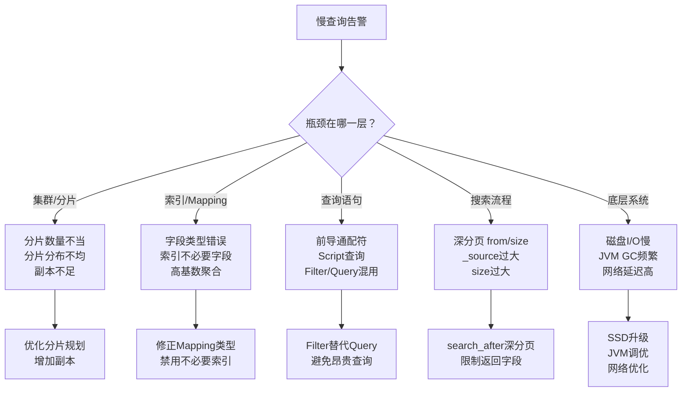
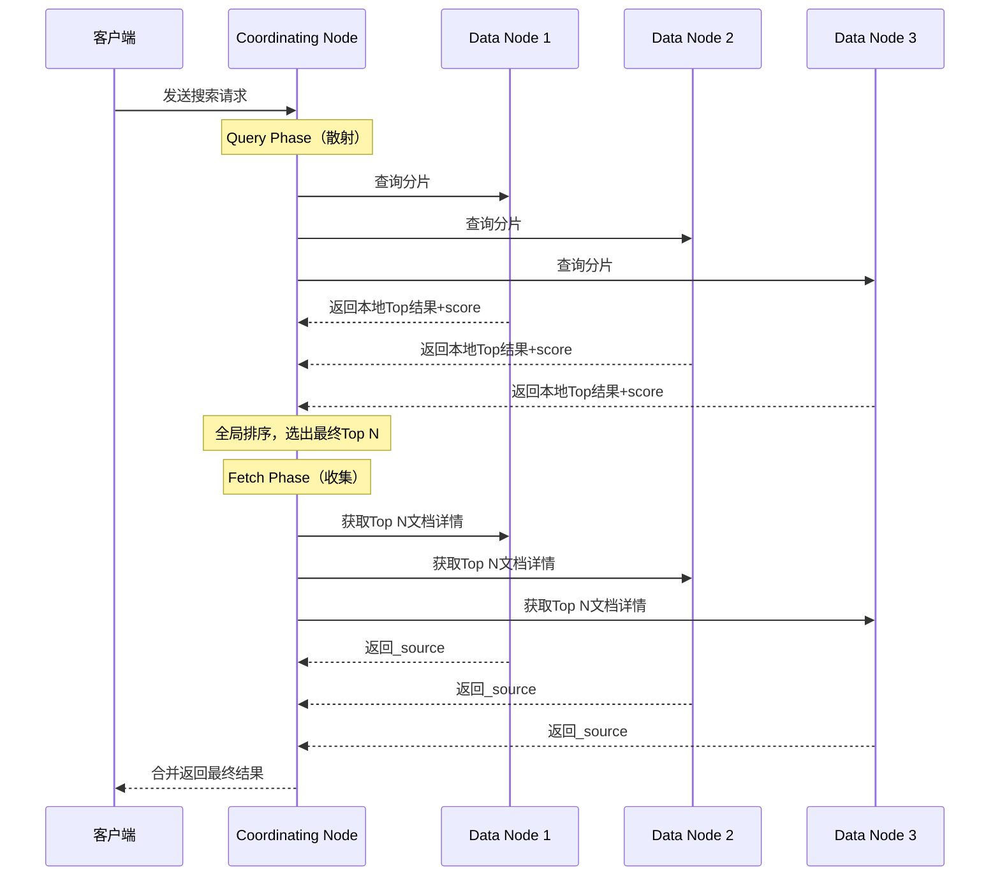

凌晨两点，线上搜索接口响应时间飙升至 8 秒，用户投诉电话被打爆。你盯着监控面板，第一反应是加索引、加机器，但真正的问题往往藏在查询语句的每一个细节里——一个错误的 `text` 类型字段、一次深分页查询、甚至 Filter 和 Query 用反了，都能让 Elasticsearch 集群从「快如闪电」变成「慢如蜗牛」。

为什么同样的查询语句，有的毫秒级返回，有的却要好几秒？为什么有些开发团队用 ES 做搜索得心应手，而另一些团队却被频繁 OOM 和慢查询折磨？答案不在硬件，而在对 ES 内部原理的理解深度。

本文将带你从底层架构到实战调优，系统梳理 Elasticsearch 查询性能优化的完整知识体系。读完之后，你将能够：

- 快速定位慢查询的根本原因（分片？Mapping？查询语句？）
- 掌握 8 个核心优化策略，覆盖索引设计、查询编写、分页、聚合、缓存
- 熟练使用 Slow Logs、Profile API 等诊断工具
- 从容应对高阶面试中的 ES 性能优化问题

---

## 引言

在实时搜索（如电商商品搜索、站内搜索）和实时分析（如监控面板、业务报表）场景下，查询的响应速度直接影响用户体验和业务效率。一个缓慢的查询不仅让用户等待，还会长时间占用集群资源，影响其他查询甚至索引的性能。

**核心问题：** 为什么同样的查询语句，性能差异可能高达几个数量级？

> **💡 核心提示**
> 优化 Elasticsearch 查询性能不是「加机器」那么简单。绝大多数性能问题源于三个层面：Mapping 设计不合理、查询语句选型错误、分片规划不当。先找准瓶颈，再对症下药。

优化 Elasticsearch 查询性能的挑战在于：

- **数据量巨大：** 需要在海量数据中进行查找和分析。
- **查询复杂性：** 用户查询需求多样，涉及全文、结构化、范围、聚合等多种查询类型。
- **分布式特性：** 查询需要在多个节点、多个分片上并行执行并归集结果，引入了协调和归并的开销。

理解 Elasticsearch 查询性能瓶颈的根源，并掌握相应的优化策略，是解决这些挑战的关键。

### ES 查询性能瓶颈全景图



### 集群与分片层面的瓶颈

1. **分片数量不当（过多或过少）：**
    - **分片过多：** 每个分片的维护（Master 节点）、协调请求（Coordinating Node）、散射 (Scatter) 和归集 (Gather) 的开销会增加，尤其对于小型分片。
    - **分片过少：** 限制了索引（写入）和搜索（读取）的并行度，无法充分利用多核 CPU 和多节点资源。单个分片数据量过大也会影响性能。
2. **分片分布不均衡：** 某些节点承担了过多的分片，导致这些节点负载过高成为瓶颈。
3. **副本数量不足：** 无法提供足够的读并发能力和高可用。

### 索引与 Mapping 层面的瓶颈

- **文档过大或字段过多：** 索引和搜索时，处理文档和字段的开销增加。`_source` 字段过大影响 Fetch Phase 性能。
- **Mapping 不合理：**
    - **字段类型错误：** 例如，对不需要全文检索的 ID 或状态字段使用 `text` 类型（会被分词，增加索引和查询开销），而应该使用 `keyword`。
    - **索引不必要字段：** 对从不用于搜索或聚合的字段也进行索引。
- **高基数字段的聚合：** 对 `text` 类型或非常多的唯一值的字段进行聚合，会消耗大量内存 (`fielddata`) 或 CPU (`doc_values`)。

### 查询语句层面的瓶颈

- **昂贵查询类型：**
    - **前导通配符或正则表达式查询：** `*keyword` 或复杂的正则表达式难以利用倒排索引优化，需要扫描大量词条。
    - `script` 查询或聚合：在脚本中进行复杂计算，性能较差。
- **Filter vs Query 使用不当：** 都用于过滤结果，但 Query 计算相关度评分，Filter 不计算。Filter 结果可以被缓存，Query 结果通常不缓存。
- **查询范围过广：** 查询跨越大量索引或分片。

### 搜索工作流程层面的瓶颈

Elasticsearch 的搜索流程分为两个阶段：



- **Query Phase（散射阶段）开销：** 查询复杂、分片过多导致计算和归集本地结果耗时。
- **Fetch Phase（收集阶段）开销：** `_source` 字段过大、返回结果数量过多 (`size` 过大) 导致跨网络传输和反序列化开销大。
- **深分页：** `from`/`size` 参数翻页过深（例如 `from` 达到几千或几万），需要在协调节点对大量跨分片结果进行全局排序，内存和 CPU 开销巨大。

### 底层系统与环境瓶颈

- **磁盘 I/O：** 慢速磁盘，频繁的 Lucene Segment 合并影响读写性能。
- **JVM（Heap & GC）：** 堆内存不足、GC 频繁或耗时过长会暂停或影响请求处理。
- **网络延迟：** Client 与 ES Node 之间，ES Node 之间（特别是 Coordinating Node 与 Data Node 之间）的网络延迟。
- **CPU 与内存：** CPU 不足导致查询计算变慢，内存不足导致缓存效果差或 OOM。

### 索引与 Mapping 优化

这是基础优化，影响后续所有查询。

- **选择正确的字段类型：**
    - **`keyword` vs `text`：** 对需要精确匹配、排序、聚合、别名等操作的字段（如 ID、状态码、国家、用户名），使用 `keyword` 类型。对需要全文检索的文本内容字段使用 `text`。这是最常见的优化，避免对不需要分词的字段进行不必要的分析和索引。
    - **数值、日期、布尔类型：** 使用精确的类型，而不是都用 `text` 或 `keyword`。
- **禁用不必要的字段和功能：**
    - **`_source` 字段：** 如果该索引仅用于搜索（如只返回 ID），而客户端通过 ID 去其他系统获取完整数据，可以在 Mapping 中禁用 `_source` (`"enabled": false`)，减少存储空间和 Fetch Phase 开销。通常不建议完全禁用 `_source`，可以考虑排除特定大字段。
    - **`index: false`：** 对不需要搜索或聚合的字段，在 Mapping 中设置 `"index": false`，减少索引开销和存储空间。
    - **`enabled: false`：** 对完全不希望 Elasticsearch 处理的字段（甚至不存储），设置 `"enabled": false`。
- **使用 `copy_to`：** 如果需要对多个字段进行全文检索，可以使用 `copy_to` 将它们的内容复制到一个新的字段，然后只对新字段进行全文索引，简化查询语句和提高性能。
- **优化文档结构和大小：** 避免单个文档过大（如存储了巨大的 Base64 编码图片或长文本），考虑拆分或存储到其他地方。

> **💡 核心提示**
> Mapping 一经创建就难以修改（部分字段类型不可变更）。在创建索引之前，花时间设计合理的 Mapping，比事后补救要高效得多。

### 查询语句优化

直接优化查询逻辑。

- **偏爱 Filter vs Query：** **这是核心优化手段之一！**
    - **Query：** 计算相关度评分 (`_score`)，结果通常不缓存。
    - **Filter：** 不计算评分，只判断是否匹配，结果可以**缓存**。Filter 的执行效率通常高于 Query。
    - **优化：** 将不需要计算相关度的过滤条件（如范围过滤、精确匹配、是否存在判断 `exists`）放在 `bool` 查询的 `filter` 或 `must_not` 子句中，而不是 `must` 或 `should` 子句。Filter 的缓存能够显著提高重复查询的性能。
- **避免昂贵查询类型：** 尽量避免使用前导通配符 (`*keyword`)、没有限定范围的正则表达式查询。考虑使用 `match_phrase` 或 `prefix` 查询代替部分通配符场景。
- **精确匹配使用 `term` 或 `match` on `keyword`：** 对 `keyword` 类型的字段进行精确匹配，使用 `term` 或 `match` 查询，而不是 `match` on `text`。
- **范围查询优化：** 对数值或日期字段进行范围查询，这是 Elasticsearch 的强项，性能通常很好。确保字段类型正确。
- **使用 `exists` 查询代替 `field != null`：** `exists` 查询更高效地判断字段是否存在且有非空值。

### 分页与排序优化

深分页是性能杀手。

- **避免深分页（`from` / `size`）：** `from`/`size` 分页在深层页码时性能急剧下降，因为它需要在协调节点对所有相关分片返回的、排序后的结果进行全局排序后再截取。
- **使用 `scroll` API（导出大量数据）：** 如果目的是遍历所有或大量数据（如数据导出、数据迁移），使用 `scroll` API。它创建了一个快照，并高效地逐批返回数据，适合大数据量的遍历，但**不适合**实时交互式分页。
- **使用 `search_after`（高效深分页）：** 如果需要实时交互式的深层分页，使用 `search_after` API。它基于上一页最后一条数据的排序值来定位下一页的起始位置，避免了全局排序前面所有页码数据的开销，性能远高于 `from`/`size` 深分页。缺点是不支持跳页，只能下一页。
- **优化排序字段：** 对用于排序的字段，通常建议使用 `keyword` 或数值类型，并确保有足够的内存或使用 `doc_values`。

### 聚合（Aggregations）优化

聚合计算是资源密集型操作。

- **选择正确的聚合字段类型：** 对需要聚合的字段（如统计、分组），使用 `keyword` 类型（对于文本字段）、数值类型或日期类型。**避免**对 `text` 类型字段进行聚合，因为 `text` 会分词，且通常默认禁用 `doc_values`（开启 `fielddata` 开销很大）。
- **利用 `doc_values`：** `doc_values` 是 Elasticsearch 默认为非 `text` 字段开启的一种列式存储结构，非常适合用于排序和聚合，且内存开销可控。确保用于聚合的字段 `doc_values` 未被禁用。
- **避免高基数聚合：** 对唯一值非常多（高基数）的字段进行 `terms` 聚合会消耗大量内存。考虑限制 `size` 或使用 `composite` 聚合进行分批聚合，或重新考虑聚合设计。
- **减少聚合层级和复杂性：** 嵌套过深或包含大量复杂计算的聚合会增加开销。
- **先过滤再聚合：** 在聚合前先应用过滤条件，减少参与聚合计算的数据量。

### 集群与分片优化

合理的集群配置是性能的基础。

- **合理规划 Shard 数量：** 这是影响性能和扩展性的重要决策。创建索引时根据数据量、节点数、未来增长预估设置 Primary Shard 数量。Shards 数量应适中，既能利用并行度，又不至于带来过高的协调开销。通常经验法则是确保每个节点有合适数量的分片，每个分片大小适中（例如几 GB 到几十 GB）。Primary Shard 数量**创建后不可更改**。
- **确保 Shard 分布均衡：** ES 集群会自动均衡分片分布，但需要监控确保各节点分片数量和大小大致均衡，避免热点节点。
- **增加 Replica 数量（读扩展）：** Replica Shard 可以处理读请求。通过增加 Replica 数量，可以在不增加 Primary Shard 的情况下提高读并发能力。同时提高高可用性。
- **节点扩容：** 当单节点资源（CPU、内存、磁盘）成为瓶颈时，增加节点是水平扩展 Elasticsearch 集群处理能力的根本方法。

### 缓存优化

理解和利用 Elasticsearch 的各种缓存。

- **`doc_values`（列式存储）：** 默认对非 `text` 字段开启，用于排序、聚合和脚本访问，Cache-Friendly，内存开销可控。是排序和聚合性能的关键。
- **`fielddata`（堆内存缓存）：** 仅用于 `text` 字段的排序或聚合，消耗大量 JVM 堆内存，容易导致 OOM。**默认禁用**。避免在 `text` 字段上进行排序或聚合。
- **Request Cache（请求缓存）：** 缓存每个 Shard 上精确匹配的查询和聚合结果。对于完全相同的查询和聚合，可以显著提高性能。只缓存每个 Shard 上的结果，不缓存协调节点上的全局结果。对于经常重复的查询很有用。
- **Node Query Cache（节点查询缓存）：** 缓存查询段的结果（不是最终文档或聚合结果）。
- **Shard Request Cache（分片请求缓存）：** 缓存 Shard 级别的搜索请求结果，用于完全相同的搜索请求。

监控缓存的命中率和内存使用，判断缓存是否生效或成为瓶颈。

### JVM 与硬件优化

底层优化必不可少。

- **JVM 堆内存调优：** 合理设置堆内存大小（`ES_HEAP_SIZE` 或 `-Xms/-Xmx`），避免过小导致频繁 GC，过大导致 GC 耗时过长。通常推荐物理内存的 50% 左右，不超过 32GB。
- **GC 调优：** 选择合适的垃圾回收器，监控 GC 日志，减少 GC 暂停时间。
- **升级硬件：** 使用更快的 **SSD 磁盘**（对索引和查询性能至关重要）、增加内存、提升 CPU。
- **网络优化：** 保证节点间网络延迟低、带宽充足。

### 路由优化

- **自定义路由（Custom Routing）：** 在索引文档时指定 `routing` 参数。查询时如果也指定相同的 `routing` 参数，请求将直接路由到特定的 Shard，跳过路由计算和散射到所有 Shards 的过程，提高查询局部性。适合用户数据天然可以按某个维度（如 `user_id`）聚合的场景。

### ES 性能分析工具与方法

要优化，先要找到瓶颈在哪里。

- **Slow Logs（慢日志）：** **最重要的工具之一！** 配置 Elasticsearch 记录索引或查询耗时超过阈值的请求日志。通过分析慢日志，可以发现是哪些查询或索引操作耗时过长，进而针对性优化。
    ```yaml
    # elasticsearch.yml 中配置慢日志阈值
    index.indexing.slowlog.threshold.index.warn: 10s
    index.search.slowlog.threshold.query.warn: 5s
    index.search.slowlog.threshold.fetch.warn: 1s
    ```
- **`_profile` API：** 在搜索请求的 URL 中加上 `?profile=true`。Elasticsearch 会详细记录查询在每个 Shard、每个查询子句、每个处理阶段的耗时，提供精细的性能分析。
    ```bash
    GET /my_index/_search?profile=true
    {
      "query": { ... }
    }
    ```
- **Cat APIs：**（如 `_cat/nodes`、`_cat/shards`、`_cat/indices`、`_cat/health`）快速查看集群、节点、索引、分片的状态、资源使用、健康状况。帮助判断是否存在分片不均衡、节点过载等问题。
- **`_analyze` API：** 理解文本字段如何被分词和索引。有助于验证 Mapping 和分词器的配置是否正确。
- **监控工具：** 使用 Kibana、Prometheus + Grafana 等工具监控集群和节点的关键指标（CPU、内存、磁盘 I/O、网络流量、JVM GC、搜索/索引速率、队列大小、缓存统计），及时发现潜在瓶颈。

### 核心优化策略对比表

| 优化维度 | 典型问题 | 优化策略 | 预期效果 |
|---------|---------|---------|---------|
| Mapping 设计 | `text` 类型用于精确匹配字段 | 改用 `keyword` 类型 | 查询速度提升 3-10 倍 |
| 查询语句 | `must` 子句中使用过滤条件 | 改用 `filter` 子句 | 利用缓存，重复查询提速 50%+ |
| 深分页 | `from: 10000, size: 10` | 改用 `search_after` | 响应时间从秒级降至毫秒级 |
| 分片规划 | 单分片超过 50GB | 增加 Primary Shard | 查询并行度提升 |
| 聚合优化 | 对 `text` 字段做聚合 | 使用 `keyword` + `doc_values` | 避免 OOM，内存降低 80%+ |
| 缓存利用 | 相同查询反复执行 | 开启 Request Cache | 缓存命中时延迟 <10ms |

### ES 查询性能优化的核心价值

- **解决实际性能问题：** 直接提升应用响应速度，改善用户体验。
- **降低基础设施成本：** 更高效地利用集群资源。
- **深入理解 ES 原理：** 优化过程是对 ES 架构、工作流程、索引原理、缓存机制、分布式特性的实战复习。
- **提升排障能力：** 掌握定位慢查询和性能瓶颈的方法。
- **应对面试：** 性能优化是高阶面试必考点，结合 ES 架构回答优化策略能体现技术深度。

### 面试问题示例与深度解析

- **Elasticsearch 查询性能可能受到哪些因素的影响？请列举几个主要的瓶颈。** 常见瓶颈，如 Shard 数不当、昂贵查询、深分页、高基数聚合、慢磁盘等，并简述原因。
- **你如何优化 Elasticsearch 的索引和 Mapping，以提高查询性能？** 选择正确字段类型（`keyword` vs `text`），禁用不必要字段（`_source`、`index: false`），使用 `copy_to`。
- **Filters 和 Queries 有什么区别？在性能优化方面，为什么偏爱使用 Filter？** Filter 不计算评分且结果可缓存，利用缓存执行更快。
- **如何优化 Elasticsearch 的深分页查询？避免使用 `from` / `size` 的替代方案是什么？** 替代方案：`scroll`（导出大量数据）和 `search_after`（实时深分页）。`search_after` 基于排序值定位下一页，避免全局排序开销。
- **如何优化 Elasticsearch 的聚合（Aggregations）性能？** 选择合适字段类型（`keyword`、数值），利用 `doc_values`，避免高基数/复杂聚合，先过滤再聚合。
- **Shard 的数量对查询性能有什么影响？Shard 越多越好吗？** 过多增加协调开销，过少限制并行度。需要根据数据量和节点数平衡。
- **Replica（副本）对查询性能有什么影响？** Replica 不影响索引性能，但可以处理读请求，分担 Primary 的读负载，提高读并发。
- **Elasticsearch 有哪些重要的缓存？它们分别缓存什么？** `doc_values`（列式存储用于排序/聚合）、`fielddata`（text字段，易OOM）、Request Cache（分片级查询结果）。
- **如何找到 Elasticsearch 集群中的慢查询？** 开启 Slow Logs（关键），分析慢日志文件。使用 `_profile` API 分析单个查询。使用 Cat APIs 或监控工具查看集群/节点状态。
- **为什么不建议对 `text` 类型的字段进行排序或聚合？** `text` 字段会分词，排序/聚合需要加载 `fielddata`，消耗大量内存且易 OOM，性能差。
- **JVM 堆内存设置过大或过小对 Elasticsearch 性能有什么影响？** 过小导致 GC 频繁或 OOM，过大导致单次 GC 耗时长。

### 生产环境避坑指南

| 陷阱 | 现象 | 根因 | 解决方案 |
|------|------|------|---------|
| 深分页 from=50000 | 查询超时、OOM | 协调节点全局排序大量数据 | 改用 `search_after` 或 `scroll` |
| text 字段聚合 | JVM 堆内存暴涨 | 触发 fielddata 加载 | 使用 keyword 类型 + doc_values |
| 分片过大（>50GB） | 单节点成为热点 | 无法充分利用分布式能力 | 重新规划分片数量 |
| Filter 用成 Query | 相同查询每次都重新计算 | 未利用 Filter 缓存 | 将过滤条件放入 `filter` 子句 |
| 堆内存超过 32GB | GC 停顿时间激增 | 压缩 Oops 失效，GC 效率骤降 | 限制堆内存不超过 32GB |
| _source 包含大字段 | Fetch 阶段耗时过长 | 网络传输和反序列化开销大 | 使用 `stored_fields` 或 `_source.excludes` |

### 行动清单

- [ ] 审查现有索引的 Mapping，确保字段类型使用正确（`keyword` vs `text`）
- [ ] 检查所有查询语句，将不需要评分的过滤条件移入 `filter` 子句
- [ ] 开启 Slow Logs，设置合理的阈值（query > 5s，fetch > 1s）
- [ ] 评估现有分片数量和大小，单分片控制在 10-50GB 范围
- [ ] 将深分页场景从 `from/size` 迁移至 `search_after`
- [ ] 检查聚合字段是否开启了 `doc_values`，避免在 `text` 字段上聚合
- [ ] 监控 Request Cache 命中率，优化重复查询
- [ ] 确认 JVM 堆内存不超过 32GB，并配置合理的 GC 参数

### 总结

优化 Elasticsearch 查询性能是一个系统性的工程，需要从索引/Mapping 设计、查询语句编写、分页/排序策略、聚合方式、集群与分片配置、缓存利用、到底层系统优化等多个层面进行。理解这些优化策略背后的原理，并结合 Elasticsearch 的架构特性（分片、副本、搜索流程、缓存、Lucene），能够让我们更有效地定位和解决性能瓶颈。

掌握 Elasticsearch 查询性能优化，不仅是解决实际问题的必备技能，更是深入理解其工作原理、提升技术能力、并在面试中展现出色的问题解决能力的体现。
