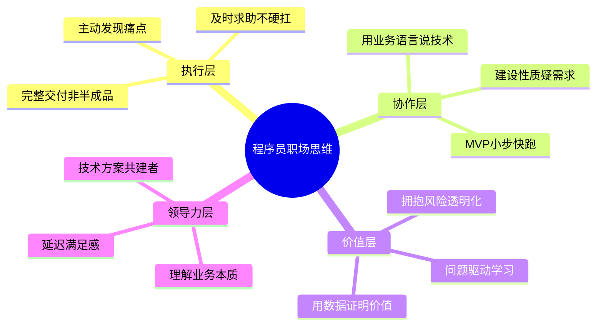

## 告别「学生思维」：程序员从校园到职场的生存法则

---

#### 1. 被动接收 vs 主动探索：角色定位的转变

> **💡 核心心法**：在职场，没有人会给你发试卷。你的绩效取决于你主动发现了多少问题，而不是你完成了多少被分配的任务。

**学生思维**：坐等领导分配任务，对未分配的模块视而不见，认为"这不是我的事"。
**职场高手**：像医生巡房一样，主动观察系统和流程中的痛点，提出优化方案。

**反面教材 vs 正面模板**：

```
反面教材：
新人小王入职3个月，每天等着PM在Jira上派任务，任务做完就刷手机。
Leader问他"有没有发现什么问题"，他说"没安排的事我不清楚"。
结果：试用期评价"缺乏主动性"，未通过。

正面模板：
新人小李发现每次排查线上问题都要翻多个日志文件，耗时2小时。
他主动用ELK搭了一个日志检索平台，把排查时间降到10分钟。
在周报里写了这个优化，Leader直接在团队群里表扬，
月度绩效直接给了S。
```

**📋 话术模板：主动汇报发现**

```
"Leader，我在做XX功能时发现日志格式不统一，排查问题平均要2小时。
  我研究了一下，用ELK搭建日志平台大概需要3天，能把排查时间降到10分钟。
  这个不影响当前排期，我周末抽时间做，您看行吗？"
```

---

#### 2. 单打独斗 vs 团队协作：价值创造的载体

> **💡 核心心法**：职场不是考试，求助不是能力差的表现，是时间成本的理性选择。

**学生思维**：遇到难题自己死磕，通宵达旦也不求助，觉得求助=能力不足。
**职场高手**：卡壳超过1小时就拉群求助，把团队时间看得比个人面子重要。

**反面教材 vs 正面模板**：

```
反面教材：
小张遇到一个Kafka消息丢失的Bug，自己查了2天没搞定，
也没告诉任何人。上线前一天才说"搞不定"，
整个团队连夜救火，项目延期3天。

正面模板：
小赵遇到同样的问题，自己查了40分钟没思路，
立刻在技术群里问："我遇到Kafka消费者重复消费的问题，
已经排查了offset提交和幂等处理，还是有问题，
@大佬 你有遇到过类似情况吗？"
10分钟后得到解答，当天解决。
```

---

#### 3. 追求完美 vs MVP迭代：面对不确定性的态度

> **💡 核心心法**：完美是迭代出来的，不是一步到位的。先让轮子转起来，再让它跑得快。

**学生思维**：所有功能都写完、毫无瑕疵才提交，像完成课程设计一样。
**职场高手**：先上线核心功能验证业务逻辑，根据数据反馈逐步完善。

**反面教材 vs 正面模板**：

```
反面教材：
PM要一个用户反馈功能，小陈觉得要做得完美，
自己加了富文本编辑器、图片上传、分类标签、举报机制，
花了3周才上线。结果上线后发现用户只用了"提交文字"这一个功能，
其他功能月活为0，浪费了2.5周开发时间。

正面模板：
小刘接到同样需求，第一周只做了最核心的"输入文字+提交"，
上线后看数据：每天200条反馈，其中30%提到了"想上传图片"。
第二周加了图片上传功能。
第三周根据用户反馈加了分类标签。
每步都有数据支撑，开发资源零浪费。
```

---

#### 4. 混淆「做完」和「做好」：任务认知的深度

> **💡 核心心法**：代码提交 ≠ 任务完成。完整的交付 = 代码 + 测试 + 文档 + 监控 + 运维就绪。

**学生思维**：写完核心代码就觉得万事大吉，忽略代码Review、单元测试、文档更新、监控埋点。
**职场高手**：交付的是一个完整解决方案，包括可观测性、可维护性的周边配套。

**反面教材 vs 正面模板**：

```
反面教材：
小赵写完了用户注册功能，代码跑通了就喊"做完了"。
结果：没有单元测试、没有API文档、没有注册失败监控。
上线后注册接口报错，没有任何报警，用户投诉了50+才知道出问题。
Leader说："你没做测试？没加监控？" 他说："需求里没写这些。"

正面模板：
小钱写完注册功能后，自己做了这些事：
- 补充了5个单元测试（正常注册、重复注册、非法邮箱、密码过短、验证码过期）
- 更新了Swagger API文档
- 在Grafana加了注册成功率监控面板，失败率>5%自动告警
- 写了部署文档和常见问题FAQ
上线后零故障，Leader评价"交付质量S级"。
```

---

#### 5. 用学术语言沟通 vs 用业务价值表达：沟通对象的差异

> **💡 核心心法**：和非技术同事说话，永远说"业务价值"，不说"技术实现"。

**学生思维**：汇报时强调算法复杂度O(n log n)、底层实现细节。
**职场高手**：把技术成果翻译成业务价值——省了多少钱、提升了多少效率、降低了多少风险。

**错误 vs 正确表达对比**：

| 场景 | 错误说法（学生思维） | 正确说法（职场高手） |
| :--- | :--- | :--- |
| 性能优化 | "我把算法复杂度从O(n)降到了O(log n)" | "订单加载速度提升40%，用户流失率降低15%" |
| 架构升级 | "我们引入了DDD分层架构" | "新架构让需求迭代效率提升2倍，bug率下降60%" |
| 技术重构 | "我把代码从面向过程改成了面向对象" | "重构后新同学上手时间从2周缩短到3天" |
| 数据库优化 | "我加了联合索引覆盖查询" | "慢查询从3秒降到50毫秒，大促期间零超时" |

---

#### 6. 线性学习观 vs 问题驱动学习：成长路径的重点

> **💡 核心心法**：学校是学"工具说明书"，职场是修"待修的机器"。带着问题学，效率翻倍。

**学生思维**：按教科书目录系统学习，先学完Java基础再碰Spring框架。
**职场高手**：遇到问题再学，目标明确，学了立刻用，用了立刻见效。

```
学生思维的学习路径：
Java基础 → 集合框架 → 多线程 → JVM → Spring → Spring Boot → MyBatis
（学了3个月，还在Hello World阶段）

职场高手的学习路径：
问题：需要实现分布式锁
→ 学习Redis的SETNX命令
→ 学习Redisson的看门狗机制
→ 在项目中实际应用
→ 踩坑后学习红锁算法
（3天解决问题，知识立刻变现）
```

---

#### 7. 恐惧犯错 vs 拥抱风险：面对问题的态度

> **💡 核心心法**：掩盖问题不是负责任，及时暴露才是真正的专业素养。

**学生思维**：出了Bug觉得丢脸，试图隐藏或独自解决。
**职场高手**：主动暴露风险，提前预警比完美救火更受领导信任。

**反面教材 vs 正面模板**：

```
反面教材：
小孙发现线上有个数据不一致的Bug，怕被批评就没说，
想着自己偷偷修好。结果修复过程中引发了更严重的连锁反应，
导致资损5万元。事后追责，不仅Bug本身要担责，
隐瞒不报更是加重处罚。

正面模板：
小周发现同样问题后，第一时间在群里说：
"我发现了数据不一致的问题，目前影响范围约200条订单。
  我已经暂停了相关服务防止扩散，正在排查根因，
  预计2小时内给出修复方案。"
Leader回复："处理及时，先止损，修复后复盘。"
事后复盘会上，小周还因此被评为"风险意识标杆"。
```

---

## 学生思维 vs 职场思维 终极对比表

| 场景 | 错误做法（学生思维） | 正确做法（职场高手） | 核心差异 |
| :--- | :--- | :--- | :--- |
| **需求评审** | "这个技术实现不了" | "这个需求可以用A方案快速上线，B方案更完美但需2周" | 提供选项而非判断题 |
| **遇到Bug** | 埋头苦干3天 | 1小时定位，解决不了立刻拉群求助 | 时间成本意识 |
| **任务完成** | "代码写完了" | "代码+测试+文档+监控+部署，全套交付" | 完整交付意识 |
| **工作汇报** | "我写了500行代码" | "这个功能上线后转化率提升了8%" | 价值翻译能力 |
| **学习新技术** | 从教程第一章开始学 | 带着问题去学，边用边学 | 问题驱动 |
| **面对变更** | "怎么又改需求" | "理解业务变化，快速评估影响范围" | 拥抱不确定性 |
| **团队合作** | 自己做更快，不教别人 | 把能力沉淀为文档和工具，放大团队产出 | 杠杆思维 |

---

## 程序员思维转型金字塔



---

## 必死 5 大雷区

1. **等任务派发**：入职3个月还在等领导安排工作，试用期必挂。
2. **死磕不求助**：自己卡壳2天不吭声，项目延期背全锅。
3. **交付半成品**：只写代码不加测试和监控，出故障第一个被追责。
4. **汇报技术细节**：给非技术领导讲算法复杂度，被认为"沟通不合格"。
5. **隐瞒线上问题**：怕担责不报Bug，小问题拖成P0事故，直接开除。

---

## 实操清单

#### 📝 话术抄作业

**主动发现问题时的汇报话术**：
```
"我在做XX时发现[具体问题]，这会导致[具体影响]。
 我初步想了个方案：[方案描述]，预计需要[时间]。
 您看这个方向对吗？需要我深入调研一下吗？"
```

**遇到技术难题求助话术**：
```
"我在做XX时遇到了[具体问题]，已经尝试了[方案A]和[方案B]，
 目前卡在[具体卡点]。@某某 你有经验吗？
 或者我们约10分钟快速过一下？"
```

**需求不合理时的沟通话术（三步法）**：
```
第一步（肯定需求）："这个功能对用户确实有价值。"
第二步（亮出排期）："但当前迭代已经排了A和B，加上这个需要延期3天。"
第三步（提供替代）："建议先上核心版，迭代二再加增强功能，您看行吗？"
```

#### ✅ 转型自测清单

| 自测项 | 你做到了吗？ |
| :--- | :--- |
| 本周是否主动发现并解决了一个流程/系统痛点？ | ☐ |
| 遇到问题是否能在1小时内决定求助还是自己查？ | ☐ |
| 最近一次交付是否包含测试、文档、监控？ | ☐ |
| 汇报时是否用了业务指标而非技术指标？ | ☐ |
| 本周是否暴露了一个潜在风险而非掩盖它？ | ☐ |
| 学习新技术时是否带着具体问题？ | ☐ |

#### 📚 推荐资源

- 《程序员修炼之道》—— 建立职业工程师思维
- 《软技能：代码之外的生存指南》—— 职场沟通、自我管理
- 极客时间《左耳听风》专栏 —— 技术人的成长方法论
