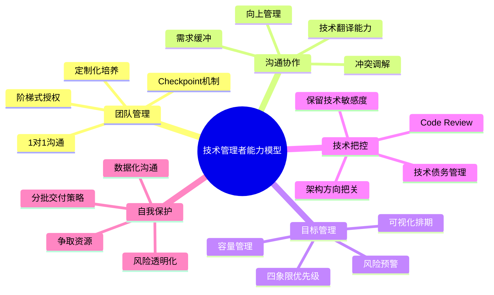

## 技术转管理：从「写代码」到「带团队」的生存手册

---

> **💡 核心心法**：管理的本质不是"自己做出成绩"，而是"让团队做出成绩"。你的产出 = 团队产出 × 杠杆系数。

---

#### 1. 思维模式转变：从「自己做事」到「帮别人成事」

**痛点场景**：团队成员提交的代码质量不如预期，你下意识就想自己动手改。

**反面教材 vs 正面模板**：

```
反面教材：
老张转Team Leader后，看新人代码不顺眼，直接拿过来重写。
  结果：新人觉得"反正leader会改，随便写就行"，越来越差；
  老张天天加班到凌晨，团队产出反而不如以前。

正面模板：
老李转管理后，遇到代码质量问题，做法是：
1. 代码Review时标注问题，附上改进建议
2. 组织15分钟的Code Review会议，引导思考"为什么这样写更好"
3. 建立团队的代码规范文档和Checklist
4. 一周后复查，新人代码质量提升了40%
  结果：老李每天省出3小时做技术规划，团队整体产出提升60%。
```

**📋 教练式对话模板**：
```
"这段代码有个可以优化的地方。你觉得如果在高并发场景下，
  这个实现会有什么问题？……对，就是锁竞争。
  那你觉得可以怎么优化？……很好，你的思路方向是对的，
  回去查一下ConcurrentHashMap的实现，明天我们再过一下。"
```

---

#### 2. 沟通方式升级：从「技术语言」到「共情沟通」

**痛点场景**：对非技术领导汇报时，满嘴微服务、CAP定理、消息队列，领导一头雾水。

**错误 vs 正确对比**：

| 场景 | 错误说法 | 正确说法 |
| :--- | :--- | :--- |
| 架构升级汇报 | "我们引入了Service Mesh做服务治理" | "新架构让系统故障率降低70%，运维成本省了30万/年" |
| 技术债务说明 | "代码耦合度太高，需要重构" | "当前修改一个功能平均要改5个文件，出错率40%。重构后可以降到10%" |
| 人力申请 | "我们需要加2个后端" | "当前人均负载120%，加2人可以让吞吐量提升30%，项目交付提前2周" |
| 线上事故 | "数据库连接池爆了" | "系统不可用15分钟，影响2000用户，已恢复，正在排查根因" |

**📋 向上汇报三步法**：

```
第一步（结论先行）："目前支付系统重构完成80%，整体进度正常。"
第二步（风险透明）："但第三方鉴权方案有合规风险，可能影响上线时间。"
第三步（行动建议）:"我建议本周约法务部评估，最坏情况需要多准备3天。"
```

---

#### 3. 任务分配与授权：从「控制狂」到「信任但验证」

**痛点场景**：担心新人完不成任务，每天问5次进度，团队觉得被监视。

**反面教材 vs 正面模板**：

```
反面教材：
小王分派任务后，每小时问一次"做完了吗"、"到什么进度了"。
  开发人员频繁被打断，一天只能写2小时代码，怨声载道。
  小王也觉得累，说"我不盯着他们就干不好"。

正面模板：
老陈的做法是阶梯式授权+Checkpoint机制：
- 新人：分配明确的独立模块，每天站会同步进度
- 中级：分配子系统，每2天同步一次关键决策
- 高级：只定目标和截止时间，中间不干预
  同时在群里说："每天10点站会同步进度，遇到阻塞问题随时@我。"
```

**📋 授权检查清单**：

```
分配任务前自问：
□ 这个任务的目标和验收标准清晰吗？
□ 这个人的能力是否匹配任务难度？（高估=失败，低估=无聊）
□ 我设定了合理的Checkpoint吗？
□ 我说了"遇到问题随时找我"吗？
□ 我准备好在他求助时给指导而不是直接动手吗？
```

---

#### 4. 目标管理与优先级：让团队不再"救火"

**痛点场景**：团队同时接到5个"紧急需求"，所有人陷入救火状态，士气低落。

**反面教材 vs 正面模板**：

```
反面教材：
PM、运营、客服同时来找你要需求，你全部接下来说"尽快"。
  团队每人手里3个并行任务，上下文切换浪费时间，
  最后所有需求都延期，所有人都投诉你。

正面模板：
老赵的做法：
1. 收到所有需求后，用四象限法分类：
   - 重要且紧急（线上BUG）→ 立即处理
   - 重要不紧急（技术债）→ 排进迭代计划
   - 紧急不重要（改个文案）→ 委托或批量处理
   - 不紧急不重要 → 拒绝或延后
2. 和上级确认优先级，拿到"尚方宝剑"
3. 在看板上公开展示排期："当前迭代容量80人日，已排75人日"
4. 对新需求说："可以加，需要和XX需求换，您看优先级怎么排？"
```

---

#### 5. 冲突处理与向上管理：做团队的盾牌

**痛点场景**：产品经理第5次变更需求，开发团队怨气冲天，要集体抗议。

**反面教材 vs 正面模板**：

```
反面教材：
Leader跟着团队一起骂PM，然后在群里发"需求又改了，大家加班吧"。
  结果：团队觉得"你只会传话没本事挡需求"，
  PM觉得"你们团队不配合"，两头得罪。

正面模板：
老刘的做法：
1. 先安抚团队："大家先继续手上的工作，需求变更我来处理。"
2. 单独找PM沟通："这次变更的原因是什么？影响范围有多大？"
3. 数据化回复："增加这个功能需要3人日，原定交付会延迟。
  我有两个方案：A. 延期3天完整交付；B. 先上核心版按时交付。
  您选哪个？"
4. 同步团队："已经和PM确认，采用B方案先上核心版，
  大家按原排期走，增强版放到下个迭代。"
```

**📋 需求变更应对话术**：

```
对PM说：
"理解这个变更的业务价值。我来评估一下影响：
  开发需要X人日，测试需要Y人日，整体延期Z天。
  如果必须在本迭代加，我建议把[某低优先级需求]移到下个迭代，
  您看可以吗？"

对团队说：
"这次变更已经确认，原因是[业务原因]。
  我已经和PM争取到了额外N天，大家按新的排期走。
  有任何技术问题随时找我。"
```

---

#### 6. 团队赋能与文化建设：让每个人都变强

**痛点场景**：团队成员能力参差不齐，有人躺平，有人想成长但没方向。

**📋 定制化成长路径**：

| 成员级别 | 痛点 | 赋能策略 |
| :--- | :--- | :--- |
| 初级工程师 | 代码质量差、效率低 | 安排代码规范培训 + 配导师 + Code Review重点跟进 |
| 中级工程师 | 遇到瓶颈、缺乏突破 | 授权负责一个子系统 + 鼓励做技术分享 |
| 高级工程师 | 缺乏挑战、动力不足 | 让他主导技术方案设计 + 带新人 + 参与架构决策 |

**实操方法**：
- 每周「午餐学习会」：轮流由成员分享新技术或踩坑经验
- 建立团队Wiki：沉淀最佳实践、常见坑点、排雷指南
- 每月1对1沟通：了解每个人的成长诉求和职业目标

---

#### 7. 自我保护：避免「夹心层」陷阱

**痛点场景**：上级要求压缩工期从2周到1周，团队反馈根本做不完，你夹在中间。

**反面教材 vs 正面模板**：

```
反面教材：
上级说"下周必须上"，你对团队说"老板说了必须上，大家加加班吧"。
  结果：上线后故障频发，团队觉得你"只会压榨"，
  上级觉得你"带团队不行"，两头不是人。

正面模板：
老周的做法：
1. 向上级说明风险："如果砍掉测试周期，预计线上故障率会上升15%。"
2. 提供折中方案："可以分两批交付，第一批核心功能下周上，
  第二批增强功能下下周上，风险可控。"
3. 对团队说："我已经和上级争取到了分批交付的方案，
  大家先把核心功能做好，不需要全部赶工。"
```

---

#### 8. 技术管理者能力模型



---

## 必死 5 大雷区

1. **包揽难题**：遇到难题自己上手写代码，团队退化、自己累死。你的角色是教练，不是替补。
2. **技术鄙视链**：因为推崇某技术栈贬低其他，团队分裂。技术选型看业务，不看偏好。
3. **"我以前..."口头禅**：频繁说"我以前怎么做的"，削弱管理权威。你现在是管理者，不是高级开发者。
4. **只做传话筒**：上级要求原封不动传给团队，团队不满直接甩给上级。你必须做缓冲层。
5. **忽视1对1沟通**：不了解成员的成长诉求和不满，等到提离职才发现"完全没察觉"。

---

## 技术管理者转型路径图

| 阶段 | 时间 | 核心挑战 | 关键动作 |
| :--- | :--- | :--- | :--- |
| 适应期 | 1-3个月 | 忍不住自己动手 | 忍住不写代码，建立Review和沟通机制 |
| 磨合期 | 3-6个月 | 团队不信任、效率低 | 建立规则、展示价值、赢得信任 |
| 发力期 | 6-12个月 | 如何让团队产出翻倍 | 授权、培养骨干、流程优化 |
| 成熟期 | 12个月+ | 跨团队协作和影响力 | 推动技术标准、培养继任者 |

---

## 实操清单

#### 📝 话术抄作业

**需求评审时的"三步拒绝法"**：
```
第一步（肯定）："这个需求方向是对的。"
第二步（量化）："但当前迭代已排满，加这个需要砍掉同等工作量的X需求。"
第三步（替代）："建议下个迭代优先排，或者先上简化版验证效果。"
```

**向上级申请资源**：
```
"目前团队人均负载120%，交付质量已经受到影响，
  最近两个迭代bug率上升了30%。
  如果增加1名后端，预计吞吐量提升30%，
  可以把项目交付提前2周，您看可以吗？"
```

**团队冲突调解**：
```
"我理解你的观点，也理解他的顾虑。
  我们回到目标上——这个需求最核心的用户价值是什么？
  围绕这个核心，有没有一个双方都能接受的方案？"
```

#### ✅ 管理者每日自查清单

| 自测项 | 做到了吗？ |
| :--- | :--- |
| 今天是否和至少1个团队成员有过建设性对话？ | ☐ |
| 今天是否有"忍住没自己动手"的时刻？ | ☐ |
| 是否向上级同步了项目风险（不只是进展）？ | ☐ |
| 是否为团队挡住了至少1个不合理的需求？ | ☐ |
| 今天是否有成员因为你的帮助而成长了？ | ☐ |

#### 📚 推荐资源

- 《技术领导力之路》—— 技术管理者必读
- 《管理的实践》（德鲁克）—— 管理底层逻辑
- 《非暴力沟通》—— 共情沟通经典
