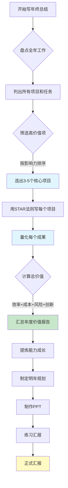

## 程序员年终总结：从「信息传递」到「价值塑造」的体系化方法

---

> **💡 核心心法**：年终总结不是写你做了什么，而是写你为组织创造了什么价值。领导看的不是苦劳，是功劳。

---

#### 1. 日常汇报：建立「决策者思维」

**电梯汇报法（30秒版）**：

```
结构：进展（70%） + 风险（20%） + 求助（10%）

案例：
"支付系统重构已完成80%（进展），
 但第三方接口鉴权方案存在合规隐患（风险），
 需要法务部介入评估（求助）。"
```

**周报三维模型**：

| 模块 | 内容要点 | 数据加持 |
| :--- | :--- | :--- |
| **业务贡献** | 订单处理效率提升 | 平均处理时长↓40% |
| **技术突破** | 自研分布式锁组件 | 减少Redis调用量70% |
| **待办事项** | 灰度发布方案设计 | 预计影响用户范围≤5% |

> **🚫 避坑**：删除"修复若干bug"等无效描述，改为"解决历史订单状态同步异常问题，影响用户量3200人"。

**反面教材 vs 正面模板**：

```
反面教材（普通程序员的周报）：
- 本周完成了订单模块开发
- 修复了一些bug
- 参加了需求评审会
- 学习了Kafka相关知识

（领导看了内心毫无波澜：你干了啥？价值在哪？）

正面模板（高绩效程序员的周报）：
- 【业务贡献】完成订单模块重构，上线后订单处理时长从5s降到3s（↓40%），
  预计每月减少用户投诉200+
- 【技术突破】自研分布式锁组件，替代原Redis轮询方案，
  Redis调用量减少70%，服务器成本预计每月节省2万元
- 【风险预警】支付网关第三方接口即将到期，建议提前2周启动续签流程
- 【下周计划】灰度发布方案评审（已邀请测试和产品），预计影响范围≤5%

（领导看了：这人靠谱，知道业务价值，还能预警风险）
```

---

#### 2. 项目总结：打造「可复用的经验资产」

**技术总结五步法**：

```
业务背景（为什么做）
  → 技术方案（怎么做）
  → 核心难点（卡点突破）
  → 成果数据（量化价值）
  → 经验沉淀（模式总结）
```

**反面教材 vs 正面模板**：

```
反面教材（流水账式总结）：
"今年做了支付系统、订单系统、用户中心，
  用了Spring Cloud、Redis、Kafka等技术。"

（领导：然后呢？你解决了什么问题？带来什么价值？）

正面模板（价值导向总结）：
"为解决大促期间库存超卖问题（背景），
  设计基于Redis+Lua的分布式扣减方案（方案），
  突破热点商品并发锁冲突难题（难点），
  TP99从3s优化至200ms，大促期间零资损（成果），
  总结出'库存预占-异步落库-对冲补偿'三阶防护模型，
  已沉淀为团队标准组件，被3个业务线采用（经验）"
```

**汇报策略选择矩阵**：

| 听众类型 | 侧重方向 | 技术细节占比 | 关键话术 |
| :--- | :--- | :--- | :--- |
| 技术总监 | 架构创新性、性能突破 | 60% | "这个方案在XX场景下比业界标准快30%" |
| 产品VP | 业务指标提升、扩展性 | 30% | "这个改动让转化率提升了X%，支撑了XX业务目标" |
| CEO | 成本节约、战略价值 | 10% | "今年技术优化总共节省了XX万，支撑了XX亿GMV" |

---

#### 3. 年终总结：构建「个人价值坐标系」

**价值量化四维度**：

| 维度 | 计算公式 | 案例 |
| :--- | :--- | :--- |
| **效率提升** | 节省工时 × 人工成本 | 自动化脚本节省1200人天/年 |
| **成本降低** | （旧方案成本 - 新方案成本）× 规模 | 服务器资源消耗降低￥58万/年 |
| **风险控制** | 潜在损失 × 发生概率 | 资损防护系统避免￥220万风险 |
| **创新价值** | 专利/技术方案复用次数 | 流量染色方案被3个事业部采用 |

**PPT设计黄金结构**：

```
1. 战略对齐（领导最在意的3个目标，说明你的工作和这些目标的关联）
2. 关键战役（用STAR法则讲3个核心项目）
   - S（Situation）：当时的情况/问题
   - T（Task）：你的任务/目标
   - A（Action）：你做了什么（突出你的独特贡献）
   - R（Result）：结果数据（量化！量化！量化！）
3. 能力进化（技术栈升级 + 方法论沉淀）
4. 未来展望（明年能为组织创造的新价值点）
```

**反面教材 vs 正面模板**：

```
反面教材（年终总结 = 功能清单）：
"1月：做了A功能
 2月：做了B功能
 3月：做了C功能
 ...
 12月：做了L功能"

（领导：所以呢？这些功能带来了什么？你的成长在哪？）

正面模板（年终总结 = 价值报告）：
"一、今年我主导的3个关键项目，总计节省成本￥180万：
   1. 支付系统重构：故障率降低60%，节省资损￥120万
   2. 自动化部署平台：部署时间从2h降到10min，节省人力￥40万/年
   3. 慢查询优化：核心接口TP99从3s降到200ms，支撑了双11峰值
 二、技术影响力：
   - 主导制定了团队代码规范，新人上手时间缩短50%
   - 输出8篇技术文档，被3个兄弟团队引用
   - 在部门技术大会做了2次分享
 三、明年规划：
   - 推动全链路压测体系建设，支撑明年2倍业务增长
   - 培养2名中级工程师达到高级水平"
```

> **💡 高光技巧**：
> - 在目录页增加「我为组织节省的成本」磁贴图
> - 用技术架构图替代文字堆砌
> - 每个数据都要有对比（优化前 vs 优化后）

---

#### 4. 年终复盘：实施「组织手术刀式剖析」

**五阶复盘法**：

```
1. 目标回溯（原始KPI vs 实际达成）
2. 关键动作（哪些决策带来80%结果）
3. 根因分析（5Why法深挖问题本质）
4. 规律提炼（可复用的成功因子/失败模式）
5. 迭代计划（具体到Q1的3个改进项）
```

**技术人专属复盘模板**：

```markdown
## [项目名称] 复盘报告

**1. 架构决策评估**
- ✅ 正确决策：采用CQRS模式分离读写（查询性能提升3倍）
- ❌ 错误决策：过早引入Service Mesh（增加运维复杂度，收益不明显）

**2. 技术债务台账**
| 债务类型 | 位置 | 修复成本 | 容忍期限 |
| :--- | :--- | :--- | :--- |
| 硬编码 | OrderService.java | 8人天 | Q2 |
| 缺少幂等设计 | PayCallback接口 | 3人天 | Q1 |

**3. 认知升级清单**
- 分布式事务选型应优先考虑业务补偿而非强一致性
- 日志规范需在项目启动时强制执行，后期补的成本是初期的3倍
```

---

## 年终总结流程图



---

## 汇报禁忌清单：技术人常踩的 6 大雷区

1. **用技术术语轰炸非技术领导** —— 大谈CAP定理、最终一致性，领导内心OS："说人话。"
2. **只报喜不报忧** —— 隐藏问题直到爆发，领导最怕的不是问题，是"突然的惊吓"。
3. **把周报写成代码变更记录** —— "写了XX个类、XX行代码"毫无意义，领导关心的是业务影响。
4. **年终总结变成功能清单** —— 按月罗列功能 = 没有总结。价值量化 = 有总结。
5. **复盘流于表面** —— 仅陈述事实无深度归因，等于浪费时间。
6. **忽视汇报视觉化** —— 纯文字PPT让听众3分钟走神，用架构图和数据图表说话。

---

## 必死 5 大雷区

1. **没有量化数据**：通篇"提升了效率""优化了性能"但没有数字，领导认为"没有成果"。
2. **只写执行不写思考**：写"完成了XX开发"不如写"通过分析XX问题，提出XX方案，效果XX"。
3. **不写失败和复盘**：完美报告 = 假报告。主动写"今年最大的失误是XX，教训是XX"反而加分。
4. **没有未来规划**：只总结过去，不规划未来 = 没有上进心。至少要写3个明年改进项。
5. **汇报对象错位**：给技术领导讲业务、给业务领导讲架构，没有根据听众调整内容比重。

---

## 实操清单

#### 📝 话术抄作业

**年终汇报开场白**：
```
"今年我主要围绕3个核心目标开展工作：
 第一，提升系统稳定性，故障率降低60%；
 第二，优化开发效率，部署时间从2小时缩短到10分钟；
 第三，支撑业务增长，双11峰值TPS达到平时的10倍。
 下面我逐项汇报。"
```

**述职答辩模板（STAR法则）**：
```
"关于支付系统重构项目：
 背景（S）：旧系统大促期间故障频发，去年双11出现3次P1事故。
 目标（T）：将故障率降低50%，支撑明年2倍业务增长。
 行动（A）：我主导了架构重构，引入异步化处理、分布式缓存、
           熔断降级机制，并建立了全链路监控。
 结果（R）：今年双11零P1事故，TP99从3s降到200ms，
           预计节省资损120万。"
```

**争取加薪/晋升的铺垫话术**：
```
"今年我主导了3个核心项目，总计节省成本180万，
 故障率降低60%，还培养了2名中级工程师。
 对比当前职级标准，我认为我已经达到了下一级的要求，
 想和您聊聊我的成长路径和明年的规划。"
```

#### ✅ 年终总结前 10 分钟检查清单

| 检查项 | 通过？ |
| :--- | :--- |
| 每个项目是否都有量化数据（前/后对比）？ | ☐ |
| 是否有3-5个核心项目（而不是罗列全部）？ | ☐ |
| 是否写了1-2个失败/教训（展示反思能力）？ | ☐ |
| 是否包含了明年规划（至少3个改进方向）？ | ☐ |
| 技术术语是否已翻译成业务价值？ | ☐ |
| PPT是否有架构图和数据图表（不是纯文字）？ | ☐ |
| 是否根据不同听众调整了内容比重？ | ☐ |
| 是否排练过至少2遍？ | ☐ |

#### 📚 推荐资源

- STAR法则详解：https://en.wikipedia.org/wiki/STAR_method
- 《金字塔原理》—— 结构化表达经典
- 极客时间《技术管理实战36讲》—— 汇报、复盘、述职全覆盖
