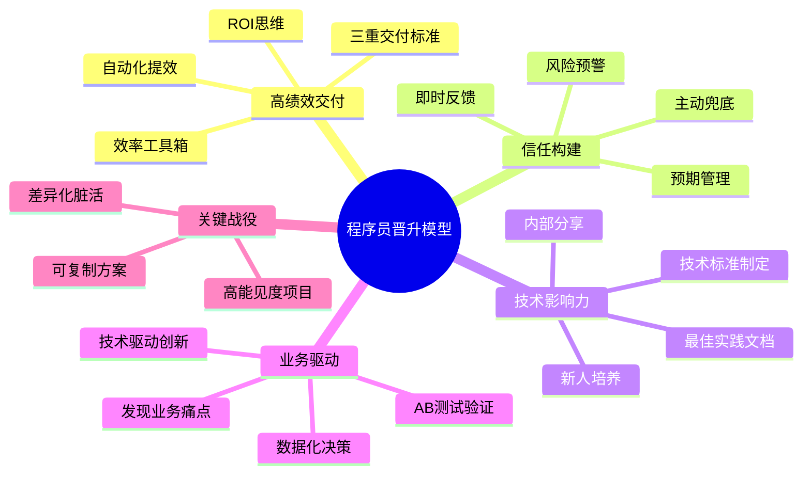

## 程序员职场进阶：从「代码执行者」到「技术领导者」的跃迁路径

---

> **💡 核心心法**：代码只能让你成为合格的程序员，技术领导力 = 代码力 × 业务洞察 × 人性理解。当你的工作成果被同事主动引用、业务方点名要你参与项目，晋升已是水到渠成。

---

#### 1. 高绩效密码：超越预期的价值交付

**精准定位高价值区**：

优先处理「领导高频过问」和「影响业务指标」的任务。优化核心接口响应速度直接提升转化率，这比优化一个没人用的内部工具价值高100倍。

**反面教材 vs 正面模板**：

```
反面教材：
小赵花2周时间写了一个代码生成器，功能很强大，
  但团队没人用，因为大家已有自己的习惯。
  年终汇报时他说"我开发了一个提效工具"，
  Leader问"有多少人在用？节省了多少时间？"他说"0"。

正面模板：
小钱发现每次大促后日志分析耗时3天，主动调研后开发了自动化报表工具。
  上线前先在团队群里问："这个工具能把分析时间从3天压缩到2小时，
  有人愿意试用吗？"3个人报名。
  上线后真的把分析时间降到了2小时，
  在汇报中写："日志分析工具已覆盖5个业务线，年节省300人天。"
  Leader直接给了S绩效。
```

**技术交付三重标准**：

| 维度 | 普通交付 | 高绩效交付 |
| :--- | :--- | :--- |
| **功能** | 满足需求文档 | 预见性补充容错机制 |
| **质量** | 通过测试用例 | 代码覆盖率≥80% + 性能压测 |
| **文档** | 简单注释 | API文档 + 架构图 + 操作手册 |

---

#### 2. 领导认可攻略：构建信任增强回路

**预期管理四象限**：

| 可控性 \ 影响 | 高 | 低 |
| :--- | :--- | :--- |
| **高** | 主动承诺提前交付（惊喜区） | 定期同步进展（安心区） |
| **低** | 预警风险 + 备选方案（止损区） | 及时升级求助（免责区） |

**📋 向上沟通三板斧**：

```
1. 周报心机：用「业务指标变化 → 技术动作 → 后续计划」结构
   例："DAU提升5% → 推荐算法优化 → AB测试迭代中"

2. 述职话术："通过XX技术方案，支撑业务达成XX目标，节省XX成本"

3. 需求博弈：用数据说话
   "这个需求需要5人日，会影响当前迭期的X和Y交付。
    建议放到下个迭代，或者先上简化版验证效果。"
```

**信任账户充值技巧**：

- **即时反馈**：收到任务5分钟内确认理解（避免3天后才发现方向错误）
- **风险预警**：提前暴露问题比完美救火更受青睐（领导最怕突发惊吓）
- **主动兜底**：不是自己的问题但影响了结果，主动说"我来处理"

**反面教材 vs 正面模板**：

```
反面教材：
Leader周五下午布置任务，小王说"好的"就走了。
  结果做了3天，方向和Leader想的完全不同，全部返工。

正面模板：
Leader布置任务后，小陈5分钟内回复：
  "理解一下您的需求：目标是XX，关键交付物是XX，
   优先级在A和B之前，对吗？
   我计划周三给初稿，周四Review，周五完成。"
  Leader："对，按这个来。"
```

---

#### 3. 晋升加速器：打造技术领导力标签

**职级能力对照表**：

| 职级 | 核心能力标志 | 晋升突破口 |
| :--- | :--- | :--- |
| P5→P6 | 模块级解决方案能力 | 技术分享 + 复杂模块攻坚 |
| P6→P7 | 系统架构设计能力 | 技术方案评审主导者 |
| P7→P8 | 跨团队技术规划能力 | 制定技术标准 + 培养梯队 |

**影响力建设三支柱**：

- **技术品牌**：在内部Wiki维护「XX领域最佳实践」文档，让同事遇到问题第一个想到你
- **人才培养**：建立新人Onboarding Checklist（环境配置、代码规范、排雷指南），缩短新人上手时间
- **流程改造**：推动代码评审Checklist标准化（如安全扫描必选项），提升团队整体质量

**关键战役选择法**：

| 选择维度 | 说明 | 案例 |
| :--- | :--- | :--- |
| **能见度** | 选择CEO/高管关注的核心项目 | 新业务线技术中台建设 |
| **差异化** | 聚焦他人不愿碰的「脏活」 | 历史债务重构、性能优化 |
| **可复制** | 解决方案能推广到其他业务线 | 通用缓存组件开发 |

---

#### 4. 成就破局点：从「工具人」到「造浪者」

**技术驱动业务创新**：

- **超前储备**：用20%时间预研新技术（如用LangChain试验智能客服原型）
- **数据说服**：通过AB测试验证技术价值（如算法优化使客单价提升15%）

**反向案例 vs 正向案例**：

```
反面教材（纯执行者）：
PM说做什么就做什么，从不问为什么。
  5年后还是高级开发，因为"你只是执行力强，不可替代性低"。

正面模板（造浪者）：
小孙发现用户流失率高，主动分析数据后发现是注册流程太长。
  他提出"一键登录"方案，推动PM立项，技术主导完成。
  上线后注册转化率提升35%，这个功劳直接写在晋升答辩里。
  关键：不是PM让他做的，是他主动发现并推动的。
```

**杠杆效应运用**：

- **产品化思维**：将内部工具转化为SaaS服务（如日志分析系统开放API）
- **生态建设**：主导开发者社区运营（如举办黑客马拉松吸引外部开发者）

---

## 程序员晋升能力模型



---

## 学生思维 vs 职场高手 晋升对比表

| 场景 | 错误做法（普通程序员） | 正确做法（晋升候选人） | 核心差异 |
| :--- | :--- | :--- | :--- |
| **任务分配** | "让我做啥我做啥" | "我主动选择高价值任务" | 选择权意识 |
| **技术交付** | "代码跑通就行" | "代码+测试+文档+监控全套" | 完整交付意识 |
| **工作汇报** | "我这周写了XX行代码" | "这个优化节省成本XX万" | 价值翻译能力 |
| **问题处理** | "出问题等我修好再汇报" | "出问题立刻预警+给方案" | 风险意识 |
| **团队贡献** | "管好自己的代码就行" | "建立规范、培养新人、沉淀文档" | 杠杆思维 |
| **职业发展** | "等公司给我晋升" | "主动对标下一级标准，找Leader对齐" | 主动权意识 |
| **技术创新** | "学了新技术但没机会用" | "用20%时间做POC验证，推动落地" | 主动创造机会 |

---

## 必死 5 大雷区

1. **技术偏执症**：过度追求新技术忽略业务价值。用最新框架重写一个内部工具，花了3个月，但业务价值为零。
2. **能见度黑洞**：重要工作未向上同步。做了很多事但领导不知道，年终绩效C，因为"没看到你做了什么"。
3. **单点故障风险**：没有培养替代者导致无法晋升。领导不敢提拔你，因为"你走了这块没人能接"。
4. **虚假忙碌**：用加班时长代替成果输出。天天加班到10点，但产出不如别人6点下班的，因为效率低而非工作多。
5. **学习虚胖症**：报课无数却无实战应用。买了10门课，学了0个项目，面试时被问"你学的那个技术用在什么场景"答不上来。

---

## 程序员三维价值坐标系

```
           Z轴（高度）
              ↑
              |    商业本质 / 技术驱动业务
              |          ●
              |        /
              |      /
              |    /
              |  /
              |/_______________→ Y轴（广度）
    技术深度 /                跨团队协作
  （X轴）   /

  合格程序员：X轴强，Y/Z轴弱
  优秀工程师：X/Y轴强，Z轴一般
  技术领导者：X/Y/Z三轴均衡
```

---

## 实操清单

#### 📝 话术抄作业

**主动争取高价值项目**：
```
"Leader，我关注到XX项目是今年部门的重点，
  我研究了技术方案，觉得可以用YY方式解决ZZ问题。
  我想参与这个项目，负责YY模块，您看可以吗？"
```

**和Leader对齐晋升目标**：
```
"我研究了P7的职级标准，对比了自己目前的情况：
  模块级方案（已具备），系统架构设计（在XX项目中有实践），
  跨团队影响力（还需要加强）。
  我想和您对齐一下，接下来半年我应该重点突破哪些能力，
  才能在下次评审时达到P7标准？"
```

**推动技术方案落地**：
```
"我做了一个POC验证，用A方案比现有方案性能提升40%，
  这是测试数据。如果在全量推广，预计每年节省服务器成本XX万。
  我建议先在灰度环境跑1周，验证稳定性后全量上线。"
```

#### ✅ 晋升前自查清单

| 自测项 | 达标？ |
| :--- | :--- |
| 是否有至少1个领域达到团队TOP3水平？ | ☐ |
| 是否能用技术语言与产品/运营高效协作？ | ☐ |
| 是否有技术文档/分享被同事引用？ | ☐ |
| 是否培养过至少1名新人？ | ☐ |
| 是否主动推动过至少1个流程改进？ | ☐ |
| 是否参与过高能见度项目？ | ☐ |
| 是否有量化数据证明业务价值？ | ☐ |
| 是否和Leader对齐过晋升目标和时间表？ | ☐ |
| 是否有继任者能接你当前的工作？ | ☐ |
| 是否有"不可替代性"——别人做不了你能做的事？ | ☐ |

#### 📚 推荐资源

- 《程序员修炼之道》—— 建立职业工程师思维
- 《技术领导力之路》—— 技术管理进阶
- 极客时间《左耳听风》—— 技术人成长方法论
- 各公司职级标准文档（内部Wiki查找，对标差距）
