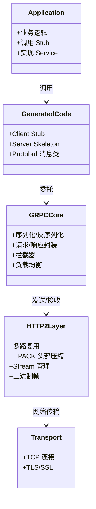
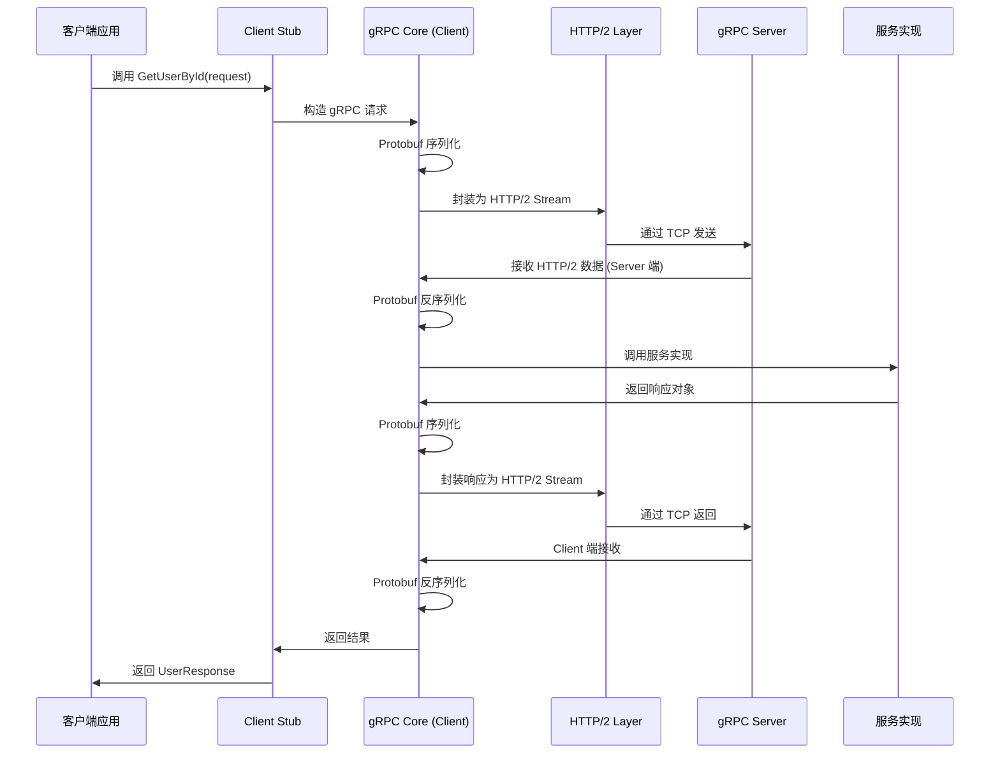

## 引言

你的微服务之间还在用 REST + JSON 通信？当服务调用量从每秒几千飙升到几十万，HTTP/1.1 的连接开销和 JSON 的文本序列化正在悄悄吃掉你的系统性能。**有没有一种方案既能保持跨语言兼容，又能获得接近裸 TCP 的通信效率？**

这篇文章将带你深入 gRPC 的架构设计，理解 HTTP/2 多路复用和 Protobuf 二进制序列化如何让 RPC 调用既快又优雅。读完后你将能够：
- 画出 gRPC 从客户端调用到服务端响应的完整调用链路
- 对比一元调用和四种流式通信模式的适用场景
- 做出 gRPC vs REST 的技术选型决策
- 避开生产环境中连接管理、超时设置、兼容性等常见陷阱

## gRPC 是什么？

gRPC (gRPC Remote Procedure Calls) 是 Google 开发的开源、高性能通用 **RPC 框架**。它基于 HTTP/2 协议和 Protocol Buffers (Protobuf) 序列化，提供了一种高效、跨语言的服务间通信方案。

**核心理念：** 基于服务定义 (`.proto` 文件)，通过代码生成让开发者像调用本地方法一样调用远程服务，底层通过 HTTP/2 和 Protobuf 实现高效的网络传输和数据序列化。

## 服务通信的演进

在分布式系统中，服务间的通信方式主要经历了几个阶段：

1. **传统 RPC (如 Java RMI)：** 强依赖特定语言，耦合度高，跨语言互操作性差。
2. **HTTP/REST：** 通用协议，跨语言好，易于调试。但通常基于 HTTP/1.1，存在连接开销、头部冗余、不支持原生流式通信等问题。JSON/XML 文本格式性能较低。
3. **现代 RPC (如 gRPC, Dubbo)：** 结合传统 RPC 的高性能和 HTTP/REST 的通用性，基于更高效的协议和序列化方式。

gRPC 正是现代 RPC 框架的代表，它结合了 HTTP/2 的高效传输和 Protobuf 的高效序列化。

> **💡 核心提示**：gRPC 的本质是"让远程调用像本地调用一样简单"。通过 `.proto` 文件定义契约，自动生成客户端 Stub 和服务端骨架，开发者只需关注业务逻辑。

## 核心概念与组件

理解 gRPC 需要掌握以下核心概念和组件：

### Protocol Buffers (.proto 文件)

一种语言无关、平台无关、可扩展的结构化数据序列化机制，也是 gRPC 定义服务接口和消息结构的方式。

```protobuf
syntax = "proto3";

package com.example.grpc.proto;

// 定义消息结构
message UserRequest {
  int64 user_id = 1;
}

message UserResponse {
  int64 user_id = 1;
  string username = 2;
  int32 age = 3;
}

// 定义服务接口
service UserService {
  // 一元调用
  rpc GetUserById (UserRequest) returns (UserResponse);

  // 服务器流式
  // rpc ListUsers (UserRequest) returns (stream UserResponse);

  // 客户端流式
  // rpc CreateUsers (stream UserRequest) returns (UserResponse);

  // 双向流式
  // rpc Chat (stream UserRequest) returns (stream UserResponse);
}
```

### Stub (客户端代理)

通过 `.proto` 文件生成的客户端代理代码，负责将本地方法调用转化为 HTTP/2 请求。通常生成同步 (blocking) 和异步 (non-blocking) 两种 Stub。

### Server (服务端)

通过 `.proto` 文件生成的服务端代码骨架，以及开发者实现的服务逻辑。接收 HTTP/2 请求，反序列化后调用服务实现，将结果序列化返回。

### Channel (通道)

表示到 gRPC 服务器端点的连接。客户端通过 Channel 创建 Stub。通常一个应用与某个服务保持一个或少数几个 Channel，复用连接。

### RPC 调用类型

基于 HTTP/2 的 Stream 特性，gRPC 支持四种 RPC 调用类型：

- **Unary RPC (一元调用)：** 客户端发送一个请求，服务器返回一个响应。
- **Server Streaming RPC (服务器流式)：** 客户端发送一个请求，服务器返回一系列响应流。
- **Client Streaming RPC (客户端流式)：** 客户端发送一系列请求流，服务器返回一个响应。
- **Bidirectional Streaming RPC (双向流式)：** 客户端和服务器同时发送消息流，独立操作，顺序可不一致。

## 架构设计与工作原理

gRPC 采用分层架构，核心基于 HTTP/2 协议。



### 分层架构

- **Application Layer：** 开发者编写的业务逻辑代码。
- **Generated Code Layer：** `.proto` 文件生成的客户端 Stub 和服务端骨架。
- **gRPC Core Layer：** 框架核心，处理序列化/反序列化、请求封装、负载均衡、拦截器等。
- **HTTP/2 Layer：** 利用 HTTP/2 的多路复用、头部压缩、流式传输。
- **Transport Layer：** 底层 TCP 连接的建立和维护。

### 基于 HTTP/2 的优势

- **多路复用 (Multiplexing)：** 允许在**一个 TCP 连接**上同时进行多个并行的请求和响应，减少连接建立开销。
- **头部压缩 (HPACK)：** 使用 HPACK 算法压缩 HTTP 头部，减少传输数据量。
- **流 (Streams)：** gRPC 利用 HTTP/2 的 Stream 实现四种不同的 RPC 调用类型，一个 Stream 对应一个 RPC 调用。
- **二进制协议：** HTTP/2 是二进制协议，解析更快、效率更高。

## gRPC 调用流程



### 调用步骤详解

1. **客户端：** 应用程序调用 Stub 的方法 -> Stub 构造 gRPC 请求 -> gRPC Core 用 Protobuf 序列化 -> HTTP/2 层封装为 Stream 发送。
2. **服务端：** 接收 HTTP/2 请求 -> HTTP/2 层传递给 gRPC Core -> Protobuf 反序列化 -> 调用服务实现 -> 结果序列化 -> HTTP/2 层返回。
3. **客户端：** 接收 HTTP/2 响应 -> gRPC Core 反序列化 -> Stub 返回给应用。

> **💡 核心提示**：gRPC 高性能的两个关键支柱——HTTP/2 的多路复用让一个 TCP 连接承载所有并发调用，Protobuf 的二进制序列化比 JSON 快 5~10 倍且体积更小。

## 服务治理与生态

gRPC 本身是通信框架，但与服务治理生态良好集成：

- **服务发现：** Client 可配置使用 Consul、Nacos、Kubernetes Native 等查找服务地址。
- **负载均衡：** 内置客户端负载均衡（如 Round Robin），或通过外部负载均衡器（Nginx、Envoy）代理。
- **监控与追踪：** 支持集成分布式追踪系统（Zipkin、OpenTelemetry）。
- **认证与授权：** 提供拦截器机制，在请求到达服务实现前进行安全校验。

## 构建 gRPC 应用示例

1. **定义 `.proto` 文件：** 编写服务接口和消息定义。
2. **代码生成：**
   ```bash
   protoc --java_out=. --grpc-java_out=. your_service.proto
   ```
3. **实现服务端：**
   ```java
   public class UserServiceImpl extends UserServiceGrpc.UserServiceImplBase {
       @Override
       public void getUserById(UserRequest request, StreamObserver<UserResponse> responseObserver) {
           long userId = request.getUserId();
           UserResponse response = UserResponse.newBuilder()
               .setUserId(userId)
               .setUsername("Test User")
               .setAge(30)
               .build();
           responseObserver.onNext(response);
           responseObserver.onCompleted();
       }
   }
   ```
4. **创建客户端：**
   ```java
   ManagedChannel channel = ManagedChannelBuilder.forAddress("localhost", 50051)
       .usePlaintext()
       .build();

   UserServiceGrpc.UserServiceBlockingStub blockingStub = UserServiceGrpc.newBlockingStub(channel);

   UserRequest request = UserRequest.newBuilder().setUserId(1001L).build();
   UserResponse response = blockingStub.getUserById(request);
   System.out.println("Received: " + response.getUsername());

   channel.shutdown();
   ```

## gRPC vs REST/HTTP 对比

| 特性 | gRPC | REST/HTTP (HTTP/1.1 + JSON) |
| :--- | :--- | :--- |
| **核心协议** | HTTP/2 (二进制) | HTTP/1.1 (文本), 也支持 HTTP/2 |
| **协议特性** | 多路复用、头部压缩、Stream 流式 | 短连接为主，无原生流式 |
| **序列化** | Protobuf (高效二进制)，也支持 JSON | JSON/XML (文本格式) |
| **服务定义** | 强制 `.proto` 文件，Schema-first | API 文档 (Swagger/OpenAPI)，Schema-optional |
| **代码生成** | 自动生成多语言客户端/服务端代码 | 需手动或第三方工具 |
| **性能** | 更优（HTTP/2 + Protobuf） | 相对较低 |
| **通用性** | 需安装 gRPC 库 | 极其通用，浏览器原生支持 |
| **调用类型** | Unary, Server/Client/Bidirectional Streaming | 主要 Unary，流式需 WebSocket |
| **易用性** | 需定义 `.proto` 和生成代码 | 直接使用 HTTP 客户端库 |
| **调试** | 需工具（二进制不易查看） | 文本协议，易于浏览器调试 |

**选型建议：**

- **gRPC** 更适合对性能要求高、跨语言、服务间调用频繁且数据量大、需要流式通信的微服务**内部通信**。
- **REST/HTTP** 更适合对外暴露 API（浏览器或第三方系统）、通用性要求高、易于调试的场景。

实际架构中通常**同时使用**：内部服务间用 gRPC，对外用 REST/HTTP + API Gateway。

## 四种 RPC 调用类型对比

| 类型 | 客户端 | 服务端 | 典型场景 |
| :--- | :--- | :--- | :--- |
| **Unary** | 1 个请求 | 1 个响应 | 简单的查询/修改操作 |
| **Server Streaming** | 1 个请求 | N 个响应流 | 实时数据推送、日志订阅 |
| **Client Streaming** | N 个请求流 | 1 个响应 | 批量上传、数据聚合 |
| **Bidirectional Streaming** | N 个请求流 | N 个响应流 | 实时聊天、协同编辑 |

## 核心参数对比表

| 参数/配置项 | 说明 | 默认值 | 生产建议 |
| :--- | :--- | :--- | :--- |
| `ManagedChannelBuilder.forAddress()` | 服务端地址 | 无 | 使用服务发现动态获取 |
| `.usePlaintext()` | 是否禁用 TLS | 禁用（不安全） | **生产环境必须启用 TLS** |
| `keepAliveTime()` | 心跳间隔 | 禁用 | 建议 30~60s，防止 NAT 超时 |
| `keepAliveTimeout()` | 心跳超时时间 | 20s | 建议 keepAliveTime 的 2 倍 |
| `idleTimeout()` | Channel 空闲超时 | 30min | 根据调用频率调整 |
| `maxInboundMessageSize()` | 最大入站消息大小 | 4MB | 根据业务需求调整 |
| `withDeadlineAfter()` | 调用超时时间 | 无 | 必须设置，防止慢调用堆积 |
| `.enableRetry()` | 是否启用重试 | 禁用 | 幂等调用可开启 |

## 常见问题与面试要点

- **什么是 gRPC？它解决了什么问题？核心理念是什么？** (高性能 RPC 框架，解决传统 RPC 跨语言/效率不足、REST 性能/契约不足。核心理念：基于服务定义，代码生成，HTTP/2 高效调用)
- **为什么 gRPC 选择 HTTP/2？HTTP/2 相较于 HTTP/1.1 有哪些优势？** (多路复用、头部压缩、Stream 流式、二进制协议)
- **Protocol Buffers 在 gRPC 中的作用和特点？** (定义服务接口和消息结构；高效紧凑的二进制序列化，跨语言)
- **gRPC 中的 Stub 和 Server 分别是什么？如何生成的？** (Stub：客户端代理代码；Server：服务端骨架+实现。通过 `protoc` 和 gRPC 插件从 `.proto` 生成)
- **gRPC 支持哪些 RPC 调用类型？** (Unary、Server Streaming、Client Streaming、Bidirectional Streaming)
- **请描述一次 Unary 调用流程。** (Client Stub Call -> 序列化 -> HTTP/2 Stream -> 网络 -> Server 接收 -> 反序列化 -> 服务实现 -> 序列化 -> 返回)
- **对比 gRPC 和 REST/HTTP 的区别。** (协议 HTTP/2 vs HTTP/1.1、序列化 Protobuf vs JSON、性能、服务定义、调用类型)
- **gRPC 如何实现负载均衡？** (Client 端内置 LB 如 Round Robin，或外部代理 LB 如 Nginx、Envoy)
- **gRPC 的跨语言能力体现在哪里？** (`.proto` 文件定义独立于语言的契约，为不同语言生成代码)
- **gRPC 的错误处理机制？** (通过 Status 和 StatusError 实现，可携带结构化错误信息)

## 总结

gRPC 是现代微服务架构中构建高性能、跨语言 RPC 通信的优秀框架。它凭借基于 HTTP/2 的高效传输、Protocol Buffers 的紧凑序列化以及强大的代码生成工具，简化了服务间通信的开发。理解核心概念（Protobuf、服务定义、Stub、Server、Channel、调用类型）、HTTP/2 的优势以及调用流程，并能将其与 REST/HTTP 进行对比，是掌握分布式通信技术栈的关键。

## 生产环境避坑指南

### 1. 未启用 TLS 导致安全风险

开发环境中常用 `usePlaintext()` 禁用 TLS，但生产环境直接暴露会导致数据被窃听或篡改。

**对策：**
- 生产环境必须启用 TLS，使用 `useTransportSecurity()`
- 配置有效的 SSL/TLS 证书
- 定期轮换证书

### 2. 未设置调用超时

不设置超时时间，慢调用会持续堆积，最终耗尽线程池或连接数。

**对策：**
- 每个 RPC 调用都设置合理的超时 `withDeadlineAfter(timeout, TimeUnit.MILLISECONDS)`
- 超时时间应略大于正常调用耗时的 P99 值
- 结合重试机制（幂等调用）

### 3. Channel 连接泄漏

频繁创建和销毁 Channel 会导致连接泄漏和性能下降。

**对策：**
- Channel 是重量级对象，应该复用，一个服务一个 Channel
- 应用关闭时调用 `channel.shutdown().awaitTermination()`
- 使用连接池或 Channel 管理框架

### 4. Protobuf 字段兼容性

`.proto` 文件更新时，如果删除或修改已有字段编号，会导致客户端/服务端不兼容。

**对策：**
- 永远不要修改已有字段的编号 (number)
- 新增字段使用新编号，不要复用已删除字段的编号
- 使用 `reserved` 关键字标记已删除的字段
- 保持向前向后兼容

### 5. 大消息传输问题

默认最大消息大小为 4MB，超出会抛出异常。

**对策：**
- 根据业务需求调整 `maxInboundMessageSize()`
- 大文件传输使用流式 RPC (Streaming) 而非一次性 Unary
- 分片上传/下载

### 6. 长连接管理

HTTP/2 长连接在网络不稳定时可能中断，需要合理的 KeepAlive 机制。

**对策：**
- 配置合理的 `keepAliveTime` 和 `keepAliveTimeout`
- 使用连接健康检查
- 实现自动重连逻辑

## 行动清单

- [ ] 定义 `.proto` 文件，明确服务接口和消息结构
- [ ] 使用 `protoc` 生成目标语言的客户端 Stub 和服务端骨架
- [ ] 实现服务端业务逻辑并启动 gRPC Server
- [ ] 创建客户端 Channel 和 Stub，验证 Unary 调用
- [ ] 根据业务需求选择流式通信模式（Server/Client/Bidirectional Streaming）
- [ ] 生产环境启用 TLS 配置 SSL/TLS 证书
- [ ] 为所有 RPC 调用设置超时时间 `withDeadlineAfter()`
- [ ] 配置 KeepAlive 心跳机制防止连接中断
- [ ] 调整 `maxInboundMessageSize` 满足业务消息大小需求
- [ ] 实现 gRPC 拦截器用于日志、监控、认证
- [ ] 集成服务发现和负载均衡（Nacos/Consul/Envoy）
- [ ] 编写 Protobuf 兼容性测试，验证字段变更不破坏已有客户端
