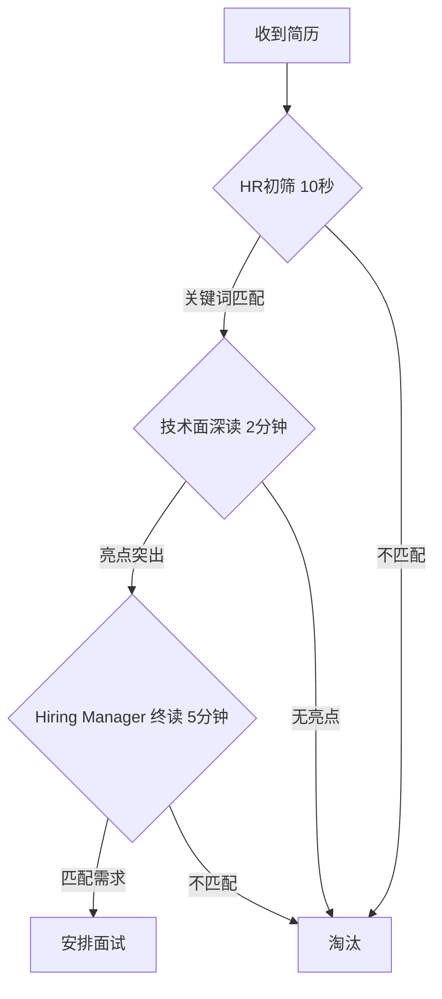
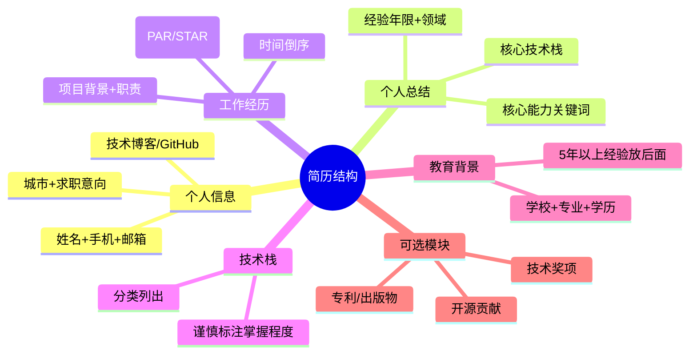
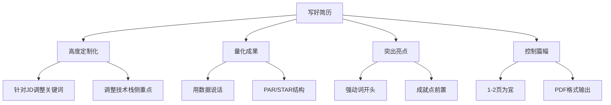

在求职过程中，简历是你向潜在雇主递出的第一张"技术名片"。它不仅仅是一份个人信息的简单罗列，更是你在众多候选人中脱颖而出的**敲门砖**。对于拥有一定工作经验的中高级开发者而言，一份优秀的简历更是至关重要。它需要在有限的篇幅内，精准地展示你的技术深度、项目经验、解决问题的能力、承担的职责以及你所带来的业务价值，从而吸引面试官的注意，为你赢得面试机会。

然而，制作一份优秀的简历并非易事。如何将多年的工作经验浓缩精华？如何在千篇一律的简历中突出亮点？如何让你的简历既能通过招聘者的初步筛选，又能打动技术面试官？

今天，就让我们一起深度剖析如何制作一份优秀的简历，将其打造成你求职过程中的有力武器！

---

> **💡 核心心法**
> 简历不是你的"历史记录"，而是你的"营销手册"。每一份简历都应该为目标岗位量身定制，而不是千篇一律地投递。

---

## 中高级Java工程师简历修炼秘籍：打造一份让你脱颖而出的求职利器

### 简历筛选漏斗：HR眼中的你



| 角色 | 阅读时间 | 关注点 | 淘汰原因 |
|------|----------|--------|----------|
| HR/招聘者 | 10秒 | 工作年限、公司背景、JD关键词 | 缺少JD关键词、年限不符 |
| 技术面试官 | 2分钟 | 技术深度、项目复杂度、量化成果 | 技术栈过时、描述空洞 |
| Hiring Manager | 5分钟 | 团队匹配度、解决复杂问题能力 | 与团队方向不匹配 |

### 一份优秀简历应具备的特质

| 特质 | 说明 | 反例 |
|------|------|------|
| 针对性强 | 高度匹配目标岗位要求 | 一份简历投100个不同岗位 |
| 突出亮点与成果 | 清晰展示技术能力和业务价值 | 只有职责描述，没有成果 |
| 结构清晰 | 信息分类明确，快速定位 | 大段文字，无重点 |
| 内容精炼 | 简洁明了，避免技术黑话堆砌 | 堆砌框架名称但无应用说明 |
| 准确无误 | 无错别字、语病、虚假信息 | "精"通写错、时间线混乱 |

---

## 简历核心模块深度解析



### 个人信息

| 必填项 | 说明 |
|--------|------|
| 姓名 | 真实姓名 |
| 手机号码 | 确保畅通 |
| 电子邮箱 | 使用专业邮箱（避免非主流昵称） |
| 居住城市 | 目标工作城市 |

| 选填项 | 说明 |
|--------|------|
| 求职意向 | 如果写要与目标岗位匹配，写具体（如"Java后端高级工程师"） |
| 技术博客 | 高质量技术文章是加分项 |
| GitHub | 有实质贡献的项目才有意义，空仓库不如不放 |

### 个人总结（Summary）

> **💡 核心心法**
> 个人总结是简历的"电梯演讲"——用3-5句话让面试官产生"这个人值得聊聊"的冲动。

**写作要点：**
- 开头说明经验年限和主要技术领域
- 简洁列出最擅长、最常用的关键技术
- 用关键词说明核心能力（高并发、分布式、DD等）
- 如有团队领导经验，写明管理规模

**示例：**
> "拥有8年+ Java后端开发经验，专注于构建高可用、可伸缩的分布式系统和微服务。精通Spring Boot/Cloud技术栈，在数据存储（MySQL, Redis, Kafka）和容器化部署（Docker, Kubernetes）方面有丰富实践。擅长解决高并发场景下的技术挑战，具备良好的系统分析、设计和问题排查能力。曾带领5人团队完成日均千万级订单的核心系统重构。"

**错误 vs 正确对比：**

| 类型 | 写法 | 问题 |
|------|------|------|
| 错误 | "求职意向：Java开发。本人热爱编程，学习能力强，有责任心。" | 空泛、无差异化、学生气 |
| 正确 | "8年Java后端经验，专注高并发微服务架构。精通Spring Cloud+MySQL+Redis，主导过日均千万级订单系统重构。" | 数据锚点+技术深度+业务价值 |

### 工作经历（最重要部分）

| 要素 | 说明 |
|------|------|
| 排列方式 | 时间倒序（从最近一份工作写起） |
| 项目数量 | 每份工作下列出2-4个关键项目 |
| 动词开头 | 使用强有力的动词（设计、开发、优化、主导、重构） |
| 量化成果 | 核心中的核心！用数据说明贡献 |

**量化维度速查表：**

| 维度 | 示例 |
|------|------|
| 性能 | "将响应时间从500ms降低到50ms，提升90%" |
| 效率 | "将手动流程自动化，减少60%人工操作" |
| 成本 | "优化资源利用率，节约30%服务器成本" |
| 可靠性 | "系统可用性从99.5%提升到99.99%" |
| 业务影响 | "支持500万日活用户，处理10亿级数据" |
| 技术提升 | "主导引入XX技术并落地，解决XX技术难题" |
| 团队领导力 | "带领5人团队完成XX项目，指导3位初级工程师" |

### 用PAR/STAR方法写成就点

**PAR公式：**
> **P（Problem）问题 → A（Action）行动 → R（Result）结果**

**STAR公式：**
> **S（Situation）情境 → T（Task）任务 → A（Action）行动 → R（Result）结果**

**错误写法 vs 正确写法对比：**

| 类型 | 写法 | 问题 |
|------|------|------|
| 错误 | "负责订单系统开发" | 只说做了什么，无成果 |
| 错误 | "熟悉Redis缓存" | 空洞，无应用场景 |
| 正确 | "针对订单查询接口性能瓶颈（P），设计并实现基于Redis的多级缓存方案（A），将接口平均响应时间从500ms降低到50ms以下，提升90%（R）" | PAR结构，数据量化 |

**完整项目经历案例：**

> **电商平台核心交易系统重构** | 2023.03 - 2023.09
>
> **项目背景**：支撑日均500万订单的电商交易系统，原系统单体架构导致迭代效率低、高峰期频繁宕机。
>
> **我的职责**：核心开发，负责订单模块微服务拆分和性能优化。
>
> **核心成果**：
> - **架构升级**：将订单模块从单体拆分为3个微服务，通过领域驱动设计（DDD）重新划分服务边界，迭代周期从2周缩短至3天
> - **性能优化**：设计基于Redis的多级缓存策略，核心接口TP99从2s降至200ms，大促期间零故障
> - **稳定性提升**：引入Sentinel限流降级+全链路监控，系统可用性从99.5%提升至99.99%
> - **团队赋能**：制定代码规范+推行Code Review流程，团队Bug率下降40%

---

## 技术栈（Skills）

**分类建议：**

| 分类 | 示例 |
|------|------|
| 编程语言 | Java, Python, Go |
| 核心框架 | Spring, Spring Boot, Spring Cloud |
| 数据存储 | MySQL, PostgreSQL, Redis, MongoDB |
| 消息中间件 | Kafka, RabbitMQ, RocketMQ |
| 容器化 | Docker, Kubernetes |
| 监控工具 | Prometheus, Grafana, ELK |
| CI/CD | Jenkins, GitLab CI |

> **💡 核心心法**
> "精通"二字是面试官的靶子。写"精通"就要准备好被问到底层源码级别的问题。谨慎使用"精通"，确保真实。

---

## 简历撰写关键技巧



| 技巧 | 说明 | 操作 |
|------|------|------|
| 高度定制化 | 针对不同JD调整关键词和侧重点 | 每投一个岗位微调简历 |
| 量化成果 | 用数据增强说服力 | "优化性能"→"延迟降低80%" |
| 使用强动词 | 描述更具表现力 | "负责"→"主导/设计/实现" |
| 控制篇幅 | 中高级开发者1-2页 | 第一页包含最重要信息 |
| 确保真实性 | 简历每个点都可能被追问 | 不写没把握的内容 |
| 格式规范 | PDF格式，文件名规范 | `姓名-岗位-年限.pdf` |

---

## 简历如何为面试铺路

> **💡 核心心法**
> 你的简历就是面试官为你量身定制面试题的**脚本**。写什么就会被问什么——这既是机会也是风险。

| 策略 | 操作 |
|------|------|
| 引导面试官 | 详细描述你最擅长、最有经验的项目和技术 |
| 准备素材 | 简历上每个成就点都准备好STAR故事 |
| 设置锚点 | 在简历中埋入你想被问到的技术亮点 |
| 避免陷阱 | 不写不熟悉的技术，否则会被问到你答不上来 |

---

## 简历必死 5 大雷区

| 序号 | 雷区 | 表现 | 后果 |
|------|------|------|------|
| 1 | 技术栈注水 | 写"精通"但被问到时说不出原理 | 面试官认为你不诚信，直接淘汰 |
| 2 | 项目描述空洞 | 只有职责没有成果，全是"负责XXX" | 被认为缺乏贡献和价值 |
| 3 | 一份简历海投 | 不针对JD调整，关键词不匹配 | HR初筛10秒内被淘汰 |
| 4 | 时间线造假 | 虚报工作年限、重叠时间线不合理 | 背调发现后Offer撤回 |
| 5 | 格式混乱 | Word格式在不同设备上错位，错别字 | 被认为不够专业和细心 |

---

## 简历优化自查清单

### 内容检查

- [ ] 个人信息完整准确（电话、邮箱、城市）
- [ ] 个人总结3-5句，包含经验年限+核心技术栈+核心价值
- [ ] 工作经历按时间倒序排列
- [ ] 每个项目都有量化成果（性能、效率、成本、业务指标）
- [ ] 使用PAR或STAR结构描述每个成就点
- [ ] 技术栈分类清晰，"精通"项经得起深挖
- [ ] 教育背景简明扼要（5年以上经验放后面）

### 格式检查

- [ ] 篇幅控制在1-2页
- [ ] 排版整洁，无错别字和语法错误
- [ ] 导出为PDF格式
- [ ] 文件名规范：`姓名-岗位-年限.pdf`
- [ ] 无本地图片链接（简历中不要放截图）

### 针对性检查

- [ ] 已针对目标JD调整关键词
- [ ] 核心技术栈与岗位要求匹配
- [ ] 个人总结与目标岗位方向一致
- [ ] 项目经验突出与岗位相关的亮点

### 速查公式模板

```
成就点公式：
"通过[技术方案]解决了[问题]，使得[指标]提升/降低[X]%"

项目一句话概括：
"基于[技术栈]的[系统类型]，解决了[业务痛点]，支撑[数据规模]"

个人总结公式：
"[年限]年[领域]经验，专注于[技术方向]。
精通[核心技术栈]，在[具体场景]有丰富实践。
擅长[核心能力]，曾[突出成就]。"
```
