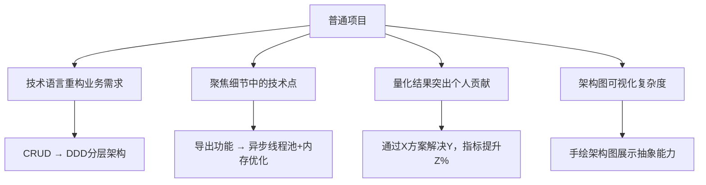

在面试中，即使项目看似"没有难点"，也可以通过 **视角转换** 和 **技术包装** 突出亮点。以下是一套可落地的策略，帮你将普通项目转化为"高价值案例"，附具体话术模板：

---

> **💡 核心心法**
> 技术深度不在于项目规模，而在于你如何思考和解决问题。即使是一个"简单"项目，也能通过**细节深挖** + **架构思维**展现竞争力。

---

## 破除误区：什么是"难点"？

| 认知 | 视角 | 说明 |
|------|------|------|
| 错误认知 | "只有高并发、分布式、秒杀才算难点" | 90%的项目没有这种场景，强行虚构会被追问到死 |
| 正确视角 | 业务复杂性、技术债务、团队协作、隐性挑战 | 从日常工作中挖掘真实价值 |

**技术难点的四个维度：**

1. **业务复杂性**：需求频繁变更下的架构扩展性设计
2. **技术债务**：老旧代码重构、性能优化
3. **团队协作**：跨部门对接、排期冲突解决
4. **隐性挑战**：代码可维护性、异常兜底设计

**示例：**
> "我负责的CRM系统虽然QPS不高，但需要对接5个外部系统，协议差异大，我设计了统一适配层，将接口开发效率提升40%。"

---

## 4步将普通项目包装成"高价值案例"



### 用技术语言重构业务需求

| 原始需求 | 技术视角重构 |
|----------|-------------|
| "用户信息管理功能开发" | "基于DDD分层架构重构用户模块，解耦核心业务与基础设施层，通过CQRS模式分离读写操作，解决历史代码高度耦合导致的迭代效率低问题" |
| "做了一个登录功能" | "实现基于JWT+Redis的单点登录方案，支持多端设备管理、Token自动续期和安全风控策略" |
| "写了个报表查询" | "设计基于Elasticsearch的多维度聚合查询引擎，支持实时数据分析与动态条件过滤" |

### 聚焦细节中的技术点

| 普通描述 | 技术深挖描述 |
|----------|-------------|
| "开发订单导出功能" | "基于EasyExcel实现百万级数据导出，通过分页查询+异步线程池处理，结合动态数据源配置避免主库压力，设计CSV格式模板解决Excel内存溢出问题" |
| "做了一个定时任务" | "基于XXL-JOB实现分布式定时任务调度，解决集群环境下任务重复执行问题，设计分片策略提升处理效率" |

### 量化结果，突出个人贡献

**话术公式：**
> **"通过[技术方案]解决了[问题]，使得[指标]提升[X]%"**

**示例：**
> "引入Redis缓存热点数据，重构SQL联合查询为多次单表查询+内存拼接，将订单查询接口响应时间从1200ms降低至200ms。"

### 用架构图/流程图可视化复杂度

**面试话术：**
> "这个模块虽然业务逻辑简单，但需要兼容老系统数据，我设计了以下防腐层架构，通过抽象接口隔离核心业务与第三方依赖……"
> （附手绘架构图，展示抽象能力）

---

## 高频问题破解话术模板

### "你的项目有什么技术难点？"

| 级别 | 回答 | 效果 |
|------|------|------|
| 低分 | "我的项目就是常规的CRUD，没有难点。" | 直接放弃，暴露无思考 |
| 高分 | "项目初期确实以业务功能为主，但我主动推动了几个优化：1）代码质量：引入SonarQube定制代码规范，将圈复杂度高于10的方法重构比例从30%降到5%；2）性能隐患：发现分页查询全表扫描问题，通过覆盖索引优化将慢SQL数量减少80%；3）可维护性：将硬编码的配置抽离到Apollo，支持动态切换数据源。" | 展现主动性和技术深度 |

**完整STAR案例：**

> **情境**：负责的内部管理系统QPS只有50，但每次上线后都有用户反馈页面加载慢。
>
> **任务**：在不增加服务器成本的前提下，将页面加载时间从3s降至1s以内。
>
> **行动**：
> 1. 用Chrome DevTools分析发现前端加载了2MB的JS Bundle
> 2. 后端接口存在N+1查询问题，单次请求触发20+条SQL
> 3. 前端：开启Gzip压缩+路由懒加载+Tree Shaking，Bundle从2MB降至400KB
> 4. 后端：用MyBatis的`<collection>`标签优化为联合查询，核心接口增加Redis缓存
>
> **结果**：页面首屏加载从3s降至800ms，用户反馈率下降90%，该优化方案被推广到3个其他系统。
>
> **反思**：性能优化要"先监控、再分析、后优化"，凭感觉优化往往事倍功半。

### "这需求很简单，为什么需要你做？"

| 级别 | 回答 | 效果 |
|------|------|------|
| 低分 | "领导安排的任务，我也不清楚。" | 缺乏独立思考能力 |
| 高分 | "虽然功能看似简单，但需要兼顾历史兼容性和扩展性：1）兼容性：老系统使用XML配置，新功能需兼容两种数据源，我抽象出适配器模式统一接口；2）扩展性：预留策略接口，后续新增支付方式只需实现接口，无需修改核心逻辑。" | 展现架构思维 |

### "你在这个项目中的成长是什么？"

| 级别 | 回答 | 效果 |
|------|------|------|
| 低分 | "学会了Spring和MySQL。" | 太浅，像培训班学员 |
| 高分 | "通过这个项目，我掌握了**技术选型方法论**：1）在缓存选型时，对比了Guava与Redis，最终选择Redis保证分布式一致性；2）在解决事务问题时，通过本地事务+消息表方案，避免引入分布式事务框架的复杂度。" | 展现方法论和权衡能力 |

---

## 真实案例：如何包装一个"普通管理后台"

**项目背景**：企业内部审批流程管理系统，日均PV 1k

**原始描述**：
> "负责审批单的增删改查和流程配置"

**技术包装后**：

| 维度 | 具体描述 |
|------|---------|
| 性能优化 | 发现审批列表页N+1查询问题，通过MyBatis的`<collection>`标签优化为联合查询，响应时间从2s降至300ms |
| 性能优化 | 对状态枚举类使用享元模式，减少重复对象创建，GC频率降低15% |
| 可维护性设计 | 基于策略模式实现多级审批流程，新增审批类型只需添加策略类 |
| 可维护性设计 | 使用AOP+注解实现操作日志统一收集，减少代码侵入性 |
| 稳定性保障 | 设计审批状态机，防止非法状态流转（如"已拒绝"不能再"提交"） |
| 稳定性保障 | 对导出功能添加熔断机制，限制单次最大导出10万条 |

---

## 避坑指南

| 行为 | 说明 | 后果 |
|------|------|------|
| 不要虚构高并发场景 | 面试官追问细节容易暴露（如"你们QPS多少？Redis集群配置？"） | 当场翻车，信任归零 |
| 诚实但突出技术思考 | "虽然当前流量不大，但我设计了限流和熔断预案，确保未来可扩展。" | 展现前瞻性 |
| 强调主动性 | "在完成需求之外，我推动落地了代码Review流程，团队Bug率下降30%。" | 展现Owner意识 |

---

## 面试必死 5 大雷区

| 序号 | 雷区 | 表现 | 后果 |
|------|------|------|------|
| 1 | 虚构高并发场景 | 项目日活100却说支撑百万QPS | 技术面追问配置细节直接暴露 |
| 2 | 项目描述流水账 | "我先做了A，然后做了B..." | 无重点、无亮点、无深度 |
| 3 | 只说做了什么不说为什么 | 缺少技术选型对比和权衡过程 | 被视为"工具人"而非"思考者" |
| 4 | 对线上问题一无所知 | "我们系统没出过问题" | 缺乏实战经验，不可信 |
| 5 | 无法清晰描述项目架构 | 画不出自己项目的架构图 | 说明没有全局视角 |

---

## 面试前项目准备清单

### STAR故事准备

- [ ] 准备3-5个完整的STAR案例，覆盖性能优化、架构设计、故障排查、团队协作
- [ ] 每个案例都有**量化结果**（响应时间、错误率、效率提升百分比）
- [ ] 每个案例都准备好被追问3层深度（方案选择→底层原理→替代方案对比）

### 项目描述准备

- [ ] 用一句话概括每个项目（"基于XX技术栈的XX系统，解决了XX问题"）
- [ ] 画出每个项目的架构图（可用手绘），面试时主动展示
- [ ] 列出每个项目的3个技术亮点和2个可改进点

### 面试中速查

- [ ] 被问"有什么难点"时，不要说"没有"，从业务复杂性/技术债务/团队协作角度回答
- [ ] 主动引导面试官提问："这块我有一些深入的实践，您想了解吗？"
- [ ] 被质疑项目简单时，强调"兼容性+扩展性+可维护性"的设计考量

### 速查话术模板

```
技术难点话术：
"虽然项目流量不大，但我关注的是[可维护性/扩展性/稳定性]，
具体做了[XX优化]，带来的效果是[量化指标]。"

项目价值话术：
"这个项目解决了[业务痛点]，我的贡献是[技术方案]，
最终[指标]提升了[数据]，团队反馈[具体评价]。"
```
