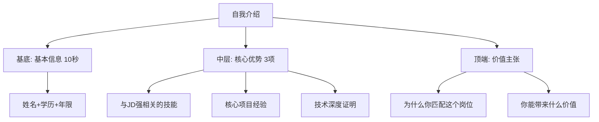
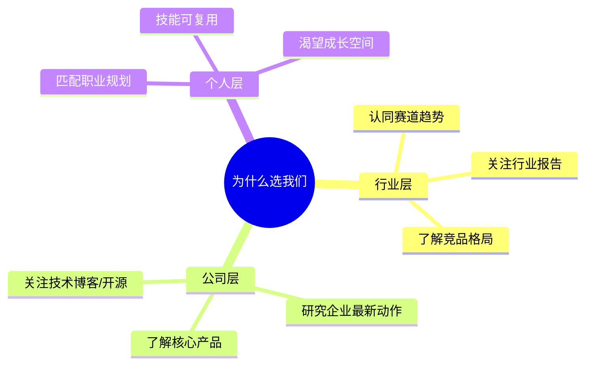

---

### 面试高频问题全解析：从「必答题」到「死亡陷阱」的破解指南
（附回答公式+避坑案例+考察点解码）

---

> **💡 核心心法**
> 面试不是考试，而是**价值交换谈判**——你要证明自己是最优解决方案，而公司是值得托付职业发展的平台。每个问题背后都有一个考察点，回答的核心是"证明你值得被录用"。

---

## 基础必答题：你的「职场身份证」

### 自我介绍（90%概率触发）

| 维度 | 说明 |
|------|------|
| 考察点 | 信息筛选能力、逻辑表达、第一印象塑造 |
| 回答公式 | 3层金字塔结构 |
| 核心原则 | 30秒原则：核心信息在前30秒呈现 |

**3层金字塔结构：**



**错误 vs 正确回答对比：**

| 类型 | 话术 | 问题 |
|------|------|------|
| 错误回答 | "我叫XX，毕业于XX大学，喜欢编程..." | 学生思维，无价值主张，无差异化 |
| 正确回答 | "我是有3年全栈开发经验的李华，主导过日均百万PV的电商系统重构，熟悉微服务性能调优。关注到贵司正在建设云原生中台，我的落地经验或许能快速贡献价值" | 数据锚点+岗位匹配+价值主张 |

### 你的缺点是什么？（死亡问题TOP3）

| 维度 | 说明 |
|------|------|
| 考察点 | 自我认知水平、改进意识、风险预警 |
| 回答公式 | 真实弱点+改进动作 |

**避雷指南：**
- 致命错误：说岗位核心能力缺陷（应聘会计却说"粗心"）
- 隐形地雷：把优点包装成缺点（"我太追求完美"）

**安全话术模板：**
> "我在多任务并行时会优先处理高价值事项，可能导致次要任务进度延迟。现在用Notion建立优先级矩阵，每天同步进展给相关方。"

**初级 vs 高级回答对比：**

| 级别 | 回答方式 | 问题 |
|------|----------|------|
| 初级 | "我最大的缺点是有时候太追求完美" | 把优点包装成缺点，面试官一听就反感 |
| 高级 | "我在公开演讲方面还不够自信，团队技术分享时会紧张。现在每个月主动承担一次内部分享来锻炼，最近一次分享获得了团队好评" | 真实弱点+具体改进动作+正向反馈 |

---

## 动机探测题：你的「选择逻辑」

### 为什么选择我们公司？（出现率85%）

| 维度 | 说明 |
|------|------|
| 考察点 | 求职诚意、行业理解、长期稳定性 |
| 回答公式 | 三层共鸣法 |

**三层共鸣法：**



- 行业层：认同赛道趋势（如"教育科技正在重塑学习范式"）
- 公司层：研究过企业最新动作（如"贵司AI助教系统专利让我印象深刻"）
- 个人层：匹配职业规划（如"我的教育背景+技术积累可助力产品创新"）

> **💡 核心心法**
> 数据加持 > 泛泛而谈。"贵司过去两年用户年增长120%"远比"贵司发展很快"有说服力。

**话术模板：**
> "我注意到贵司过去两年用户年增长120%，希望在快速扩张期贡献我的高并发系统优化经验。特别是看到贵司刚开源了XX中间件，我对这个方向的技术积累也能直接复用。"

### 你的职业规划？（高频灵魂拷问）

| 维度 | 说明 |
|------|------|
| 考察点 | 目标感、与企业发展的契合度 |
| 回答公式 | 能力深耕→价值扩展模型 |

**禁忌回答 vs 安全回答：**

| 类型 | 话术 | 问题 |
|------|------|------|
| 禁忌 | "三年当上总监" | 过于功利，显得浮躁 |
| 禁忌 | "没想清楚" | 显迷茫，缺乏目标感 |
| 安全 | "未来2年希望成为DevOps领域的解决方案专家，同时培养跨团队协作能力，争取能独立负责技术中台建设" | 能力导向+价值扩展 |

---

## 行为测试题：你的「实战能力显微镜」

### 说说你最大的成就/失败（深度挖掘题）

| 维度 | 说明 |
|------|------|
| 考察点 | 成就动机、复盘能力、抗压韧性 |
| 回答公式 | STAR-L变形公式 |

**STAR-L公式：**
Situation（情境）→ Task（任务）→ Action（行动）→ Result（结果）→ Learn（反思）

**完整STAR案例（成就版）：**

> **情境(S)**：去年Q3大促期间，订单系统在高并发下响应时间飙升至8s，导致用户流失率增加15%。
>
> **任务(T)**：我负责在两周内将核心接口TP99降至500ms以内。
>
> **行动(A)**：
> 1. 通过链路追踪定位到数据库慢查询是主因
> 2. 将热点数据接入Redis，设计多级缓存策略
> 3. 重构N+1查询为批量JOIN，添加覆盖索引
> 4. 引入Sentinel做限流兜底
>
> **结果(R)**：接口TP99从8s降至200ms，大促期间零故障，用户流失率回落到正常水平。
>
> **反思(L)**：建立了"性能问题=监控先行"的思维，后续所有核心接口上线前必须通过压测基线。

**失败案例回答模板（同样重要）：**

> **情境(S)**：有一次上线前没有充分压测，导致新功能的慢SQL拖垮了整个数据库连接池。
>
> **任务(T)**：紧急恢复服务并防止再次发生。
>
> **行动(A)**：
> 1. 紧急回滚版本，恢复服务
> 2. 排查慢SQL根因，优化索引
> 3. 推动团队建立上线前压测流程
>
> **结果(R)**：服务10分钟恢复，后续所有核心接口上线前必须通过压测基线，至今未再发生类似故障。
>
> **反思(L)**：对"慢SQL的蝴蝶效应"有了深刻认识，现在写SQL时默认思考执行计划。

### 如何处理团队冲突？（管理潜质探测）

| 维度 | 说明 |
|------|------|
| 考察点 | 情商、沟通策略、问题解决视角 |
| 回答公式 | 三维解题法 |

**三维解题法：**
- 情绪层：先建立共识（如"我们都希望项目成功"）
- 事实层：用数据对齐认知（如"这是上周的埋点数据"）
- 方案层：提供可选路径（如"A方案保证进度，B方案提升扩展性"）

**初级 vs 高级回答对比：**

| 级别 | 回答方式 | 问题 |
|------|----------|------|
| 初级 | "我会找他们聊聊，大家和和气气解决问题" | 无具体方法论，过于理想化 |
| 高级 | "首先我会分别和冲突双方1v1沟通，理解各自立场。然后用数据把争议客观化，最后组织技术评审会，列出各方案的利弊让团队投票决策" | 有流程、有工具、有决策机制 |

---

## 情景模拟题：你的「临场反应试金石」

### 如果入职后发现岗位不符预期怎么办？（压力测试）

| 维度 | 说明 |
|------|------|
| 考察点 | 适应能力、职业成熟度 |
| 回答公式 | 沟通→学习→评估三步法 |

**自杀式回答 vs 安全回答：**

| 类型 | 话术 | 后果 |
|------|------|------|
| 自杀式 | "我会立即辞职" | 直接淘汰，缺乏职业素养 |
| 自杀式 | "要求调岗" | 显得不稳定，缺乏主动性 |
| 安全回答 | "我会先与主管充分沟通，明确能力gap在哪里。如果是短期技能缺失，我愿意加班学习；若是长期方向偏差，相信公司有更合适的人岗匹配机制" | 展现职业成熟度和灵活性 |

### 你有其他offer吗？（博弈心理战）

| 维度 | 说明 |
|------|------|
| 考察点 | 市场竞争力、入职意愿强度 |
| 回答原则 | 诚实但保留谈判空间 |

**话术模板：**
- 有offer："目前有2个机会在谈，但贵司的XX方向最符合我的长期规划"
- 无offer："集中精力准备心仪岗位，上周刚结束XX公司的终面"

---

## 反客为主：你的「最后机会窗口」

### 你还有什么想问的？（反向评估关键题）

**死亡提问 vs 高价值提问：**

| 类型 | 提问 | 问题 |
|------|------|------|
| 死亡提问 | "加班多吗？" | 暗示怕吃苦，不专业 |
| 死亡提问 | "年薪多少？" | 时机不对，应由HR主动谈 |
| 高价值提问 | "这个岗位在业务链条中的核心价值是什么？" | 展现战略思维 |
| 高价值提问 | "公司对这个岗位的长期能力模型规划是怎样的？" | 关注成长路径 |
| 高价值提问 | "未来一年部门最想突破的三个方向是哪些？" | 体现业务关注度 |

---

## 面试应答黄金法则

1. **30秒原则**：每个回答核心信息在前30秒呈现
2. **数据锚点**：用量化结果增强说服力（如"错误率下降70%"）
3. **能量守恒**：保持与面试官相近的语速、音量和肢体语言

---

## 面试必死 5 大雷区

| 序号 | 雷区 | 表现 | 后果 |
|------|------|------|------|
| 1 | 简历造假 | 项目经验/技术栈注水 | 技术面深挖直接暴露，永久进入黑名单 |
| 2 | 负面评价前公司 | "前公司管理混乱""领导很蠢" | 面试官会认为你也会这样评价他们 |
| 3 | 对JD一无所知 | 连岗位核心职责都说不出 | 求职诚意归零，直接淘汰 |
| 4 | 技术栈过时且不自知 | 还在用Struts2/SSH且无升级意识 | 技术敏感度不合格 |
| 5 | 反问环节说"没问题" | 错失最后展示机会 | 显得缺乏思考和不积极 |

---

## 面试前自查清单

### 核心问题准备

- [ ] 自我介绍：准备1分钟和3分钟两个版本，反复练习到自然流畅
- [ ] 缺点问题：准备1个真实弱点+改进动作，避免说"太追求完美"
- [ ] 为什么选公司：准备3层共鸣（行业+公司+个人），至少说1个具体数据
- [ ] 职业规划：准备"能力深耕→价值扩展"话术，避免说"当总监"
- [ ] 成就/失败：各准备1个完整STAR案例，有量化结果

### 面试中速查

- [ ] 开场微笑，自我介绍控制在1-3分钟
- [ ] 每个回答前停顿2秒整理思路
- [ ] 不确定的问题先说思考方向，再尝试解答
- [ ] 结束时主动提问2-3个高质量问题

### 速查话术模板

```
自我介绍模板（1分钟版）：
"我是有X年[方向]开发经验的[姓名]，主导过[核心项目]，
熟悉[3个与JD相关的技术]。关注到贵司正在[公司动作]，
我的[某方面]经验或许能快速贡献价值。"

缺点问题模板：
"我在[非核心能力]方面还有提升空间，现在我通过[具体行动]
来改进，最近[正向反馈]。"

为什么选公司模板：
"我注意到贵司[具体数据]，在[行业趋势]下，
我的[技术/经验]能帮助[解决什么问题]。"

反问模板（根据面试官角色选择）：
- 技术面："团队目前最大的技术挑战是什么？"
- Leader面："这个岗位在业务链条中的核心价值是什么？"
- HR面："公司对这个岗位的长期能力模型规划是怎样的？"
```
