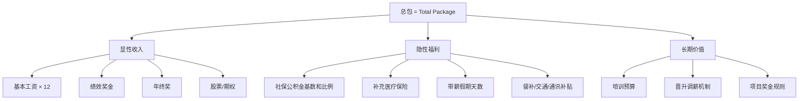
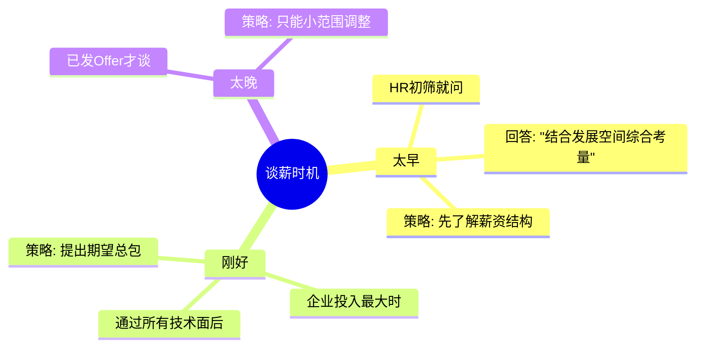

---

### 薪资谈判全攻略：从「心理博弈」到「科学要价」的进阶指南
（附：谈薪公式+压价拆招话术+避坑清单）

---

> **💡 核心心法**
> 薪资不是"要"来的，而是"值"来的。当你证明自己值得200%的薪资，才有底气争取20%的涨幅。

---

## 谈薪前的「战略储备」

### 薪资结构全景图



**薪资对比案例：**
某offer月薪20k但公积金按5%基数缴纳，vs 另一家18k但全额12%公积金。

实际年收入差异：
- A公司：`20k × 12 = 240k`
- B公司：`(18k × 12) + (18k × 12% × 12 × 2) = 216k + 51.8k = 267.8k`

> **💡 核心心法**
> 只看月薪是程序员谈薪最大的坑。公积金比例差7%，一年多出近3万的隐性收入。

### 谈薪时机判断



**最佳时机：通过所有技术面后（企业投入最大时）**

---

## 谈判黄金四步法

### 第一步：推迟报价时机

| 场景 | 错误示范 | 高阶话术 |
|------|----------|----------|
| HR首轮电话问期望薪资 | 直接报出底线数字 | "薪资需要结合岗位发展空间综合考量，您方便先介绍下薪资结构和晋升机制吗？" |
| 猎头问当前薪资 | 如实报出精确数字 | "我的总包大概在XX范围，具体构成比较灵活，您看这个岗位预算范围大概是多少？" |

### 第二步：锚定市场价值

**调研工具：**
- 拉勾/猎聘按「岗位+年限+城市」筛选薪资范围
- Glassdoor查目标公司职级薪酬带宽
- 脉脉看员工分享的薪资信息

**话术模板：**
> "我了解3年经验的全栈开发在本市市场价是25-35k，考虑到我有电商高并发项目经验，希望能争取到中上游水平。"

**薪资调研清单：**
- [ ] 查询目标公司同岗位薪资范围（至少3个渠道交叉验证）
- [ ] 了解同城市、同年限的市场中位数
- [ ] 记录自己可量化的技术亮点（作为溢价理由）

### 第三步：打包报价策略

**组合公式：**
> **期望总包 = 当前总包 × (1+30%) + 跳槽成本补偿**

**案例演示：**
- 现年薪：15k × 15薪 = 225k
- 期望值：225k × 1.3 + 20k（期权损失补偿）= 312.5k → 月薪约26k × 12

**跳槽成本补偿项：**
- 未发的年终奖/项目奖金
- 损失的期权/股票
- 通勤成本增加
- 社保断缴风险

### 第四步：留出弹性空间

**话术设计：**
> "我的底线是28k，但如果贵司能提供每月2天远程办公和每年3万培训预算，25k也可以接受。"

**弹性交换矩阵：**

| 你的让步 | 换取的条件 |
|----------|-----------|
| 月薪降低5% | 增加公积金缴纳比例 |
| 放弃签字费 | 明确半年后调薪幅度 |
| 接受更低职级 | 缩短晋升评估周期 |
| 降低基本工资 | 增加项目奖金比例 |

---

## 破解压薪六大杀招

### 杀招1：HR用「你经验不足」压价

| 环节 | 内容 |
|------|------|
| HR话术 | "你只有2年经验，我们这个岗位通常要求3年以上" |
| 反击策略 | 聚焦可验证价值 |
| 反击话术 | "虽然年限少一年，但我主导的库存系统优化让并发能力提升5倍，这部分经验可以直接复用贵司618大促项目。技术深度比年限更重要，对吧？" |

### 杀招2：HR暗示「很多人竞争这个岗位」

| 环节 | 内容 |
|------|------|
| HR话术 | "这个岗位我们收到了200多份简历" |
| 反击策略 | 反将一军 |
| 反击话术 | "这正是我选择贵司的原因——优秀平台吸引优秀人才。不过能同时满足Java重构和云迁移经验的人，市场上应该不超过10%。我相信贵司也在找最合适的人，而不是最便宜的人。" |

### 杀招3：HR玩拖延战术「先按这个数，半年后调薪」

| 环节 | 内容 |
|------|------|
| HR话术 | "先按这个数入职，半年后表现好再调薪" |
| 反击策略 | 锁定承诺 |
| 反击话术 | "如果能将半年后调薪幅度和标准写入合同补充条款，我愿意适当让步。这样对双方都有保障。" |

### 杀招4：HR对比「你的前公司不如我们」

| 环节 | 内容 |
|------|------|
| HR话术 | "你之前公司平台比较小，薪资参考意义不大" |
| 反击策略 | 转移参照系 |
| 反击话术 | "确实平台规模不同，但我评估的是市场价值。我对比的是同城市、同岗位、同能力的薪资水平，这是我做的调研数据[展示]。" |

### 杀招5：HR给出「低于预期」的首次报价

| 环节 | 内容 |
|------|------|
| HR话术 | "我们能给到的是20k，这是我们的标准" |
| 反击策略 | 锚定+理由 |
| 反击话术 | "感谢您的坦诚。我了解到的市场范围是25-35k，考虑到我[具体亮点]，我的期望是28k。如果20k是标准，请问有哪些因素可以影响这个标准？" |

### 杀招6：HR用「我们有完善的福利体系」压基本工资

| 环节 | 内容 |
|------|------|
| HR话术 | "虽然基本工资不高，但我们的福利很完善" |
| 反击策略 | 拆解福利真实价值 |
| 反击话术 | "我非常认可贵司的福利体系。我计算了一下，[具体福利]折合每月大约X元。加上基本工资后总包是Y，和我期望的Z还有差距，能否在基本工资上再争取一下？" |

---

## 高阶谈判心理学

### 对比效应运用

先列举其他offer的总包价值（即使虚报），再强调更倾向当前公司的原因。

**话术示例：**
> "虽然A公司给到35k，但贵司的技术挑战更符合我的长期规划，如果能调整到32k我会优先考虑。"

### 损失厌恶触发

强调招聘沉没成本。

**话术示例：**
> "贵司技术面已投入3轮，如果因5k差距错过立即能上手的人，下次招聘周期可能超过1个月。"

### BATNA策略（最佳替代方案）

在谈判前明确自己的BATNA（Best Alternative To a Negotiated Agreement）：
- 最好的替代offer是什么？
- 最低接受的底线是多少？
- 如果所有谈判失败，你的退出方案是什么？

---

## 避坑红线清单

| 行为 | 说明 | 后果 |
|------|------|------|
| 说"我的期望是随便多少" | 自降身价，失去谈判主动权 | HR直接按最低标准报价 |
| 终面前暴露当前薪资 | 过早暴露底牌 | 报价贴着当前薪资小幅上涨 |
| 仅比较月薪 | 忽视13薪、项目奖金、公积金差异 | 实际总包可能更低 |
| 撒谎当前薪资 | 背调时被发现 | Offer撤回+行业黑名单 |
| 接受口头承诺 | "半年后肯定调"无书面记录 | 大概率不会兑现 |
| 情绪化谈判 | "不给这个数我就不来了" | 显得不成熟，可能直接取消Offer |

---

## 面试必死 5 大雷区

| 序号 | 雷区 | 表现 | 后果 |
|------|------|------|------|
| 1 | 薪资撒谎 | 虚报当前薪资或已有offer | 背调发现后Offer撤回，行业口碑受损 |
| 2 | 首轮就报底价 | HR一问期望就报最低可接受数字 | 后续无任何谈判空间 |
| 3 | 只看月薪不看总包 | 忽略公积金比例、年终奖、期权 | 实际年收入比预期少20-30% |
| 4 | 接受口头承诺无记录 | "半年后调薪"没写进合同 | 到期后HR"忘了"或"政策变了" |
| 5 | 拿到Offer就停止看机会 | 过早停止求职 | 没有对比就没有谈判筹码 |

---

## 谈薪前自查清单

### 数据准备

- [ ] 查询目标岗位市场薪资范围（3个以上渠道）
- [ ] 计算当前总包（工资+奖金+福利+期权）
- [ ] 计算跳槽成本（未发奖金+通勤变化+社保风险）
- [ ] 设定3个数字：理想值、目标值、底线值

### 话术准备

- [ ] 准备推迟报价的话术（"结合发展空间综合考量"）
- [ ] 准备锚定市场价值的话术（"我了解到的市场范围是..."）
- [ ] 准备6种压价场景的反击话术（见上文）
- [ ] 准备弹性交换的条件清单（远程/培训/公积金等）

### 谈判中速查

- [ ] 永远不要先报价，让HR先给出范围
- [ ] 报价时给出范围而非固定数字（如"25-30k"）
- [ ] 所有承诺要求写入Offer或补充协议
- [ ] 拿到Offer后不要立即接受，至少考虑24小时

### 速查话术模板

```
推迟报价：
"薪资需要结合岗位发展空间综合考量，
您方便先介绍下薪资结构和晋升机制吗？"

锚定市场价值：
"我了解[X年经验]的[岗位]在[城市]市场价是[X-Yk]，
考虑到我有[具体亮点]，希望能争取到中上游水平。"

应对压价（经验不足）：
"虽然年限少，但我主导的[项目]让[指标]提升[X]，
这部分经验可以直接复用贵司的[具体场景]。"

应对拖延战术：
"如果能将调薪幅度和标准写入合同补充条款，
我愿意适当让步。这样对双方都有保障。"

弹性交换：
"我的底线是[Xk]，但如果贵司能提供
[远程办公/培训预算/公积金比例]，
[Yk]也可以接受。"
```

### 谈薪本质三原则

1. **薪资 = 能力贴现率 + 未来增值预期**
2. **谈判底线 = 市场价下限 + 不可妥协项（如公积金基数）**
3. **最佳时机 = 通过所有技术面后（企业投入最大时）**
