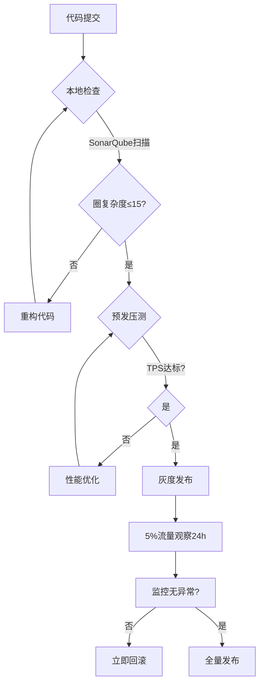
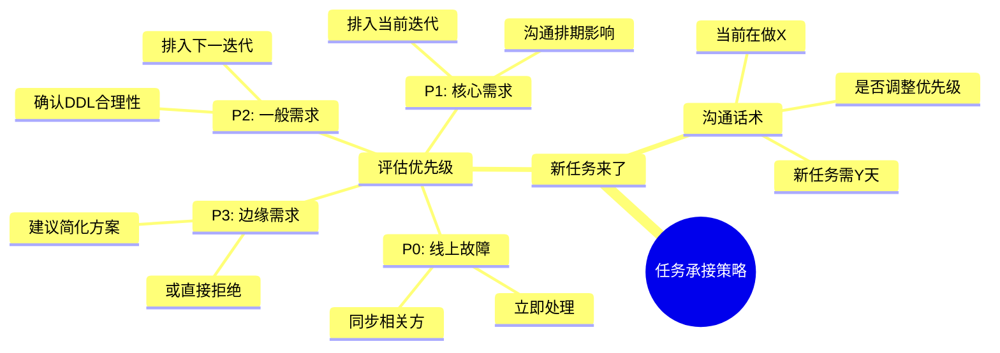
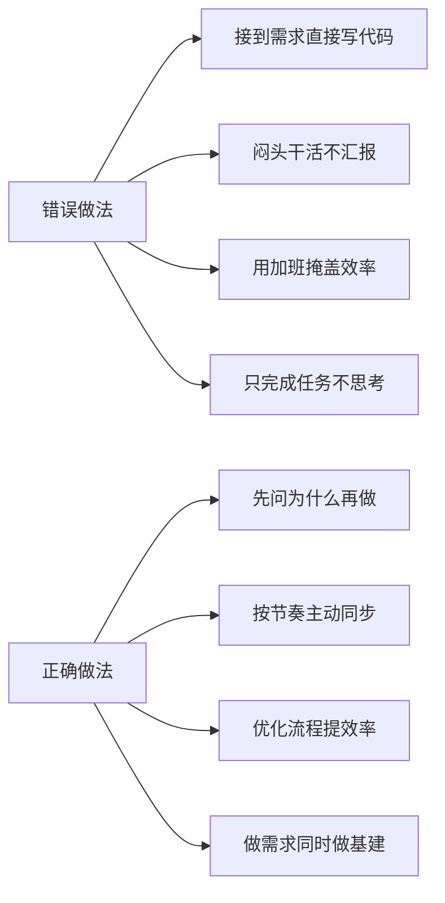
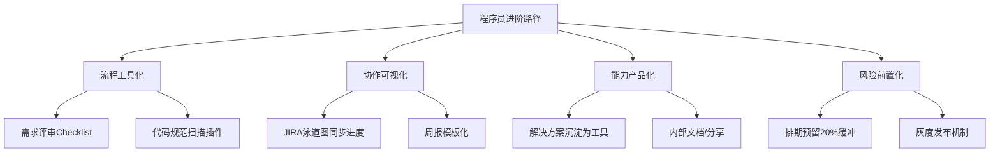

以下是程序员在工作中常见的 **16大典型错误** 及其 **系统性解决方案**，结合工程实践与团队协作视角深度解析：

---

> **💡 核心心法**
> 程序员职场进阶的本质，是从**「功能实现者」**到**「价值设计者」**的蜕变。当你的工作开始为团队降本增效，而非仅完成需求清单时，职业天花板将自然突破。

---

## 时间管理类问题

### 时间观念不强

| 维度 | 说明 |
|------|------|
| 典型表现 | 会议迟到、需求延期成为常态；沉迷技术细节忽略Deadline |
| 解决方案 | 双时间轴管理法 |

**双时间轴管理法：**
- **硬性时间轴**：用日历工具标记会议/交付节点，提前30分钟设置提醒
- **弹性时间轴**：用番茄工作法切割开发任务（如1个番茄钟=25分钟编码+5分钟review）

**案例：**
> 某程序员用Toggl Track记录时间消耗，发现接口联调耗时占比40%，通过Mock工具将耗时压缩至15%。

### 工作量评估过于乐观

| 维度 | 说明 |
|------|------|
| 典型表现 | 承诺"3天搞定"后疯狂加班；忽略联调、测试、部署等隐性成本 |
| 解决方案 | 三段式评估法 |

**评估公式：**
> **实际排期 = 原始评估 × 风险系数（1.2-1.5）+ 缓冲时间（20%）**

**工具加持：** 使用斐波那契数列（1,2,3,5,8）进行故事点估算，避免精确到小时的错觉。

---

## 流程规范类问题

### 文档过于粗糙

| 维度 | 说明 |
|------|------|
| 典型表现 | 技术方案只有流程图无异常处理逻辑；测试用例覆盖率<50% |
| 解决方案 | 文档四要素检查表 |

**文档检查表：**

| 类型 | 必含内容 |
|------|----------|
| 技术方案 | 架构图、核心逻辑伪代码、降级方案 |
| 测试用例 | 正向场景、边界条件、异常流 |
| 发布计划 | 回滚条件、监控指标、负责人通讯录 |

**建议：** 建立Confluence/语雀文档模板库，复用率可提升60%。

### 干活太快导致线上问题

| 维度 | 说明 |
|------|------|
| 典型表现 | 为显效率跳过Code Review；未做压力测试直接上线 |
| 解决方案 | 上线前三级防御 |

**上线前三级防御：**
1. 本地：SonarQube代码扫描（圈复杂度≤15）
2. 预发：全链路压测（TPS达到生产120%）
3. 生产：灰度发布（首批5%流量观察24小时）



---

## 沟通协作类问题

### 汇报极端化

| 维度 | 说明 |
|------|------|
| 典型表现 | 要么憋大招一周不发声；要么每改一行代码都请示 |
| 解决方案 | 沟通频率公式 |

**沟通频率公式：**
> **沟通密度 = 任务复杂度 × 风险等级 ÷ 领导关注度**

**案例：**
- 高复杂度+高风险任务（如支付重构）：每日站会同步进度
- 低风险任务（如文案修改）：合并到周报反馈

**汇报模板（程序员专用）：**
> "当前进度：已完成[X]%，卡在[Y问题]，预计[Z时间]完成。需要的支持：[具体资源/决策]。"

### 超负荷承接任务

| 维度 | 说明 |
|------|------|
| 典型表现 | 用个人加班掩盖资源不足；需求池溢出导致质量下降 |
| 解决方案 | 四象限任务看板 |

**四象限任务看板：**

| 紧急\重要 | 重要 | 不重要 |
|-----------|------|--------|
| **高** | 立即处理（核心功能BUG） | 授权他人（文档整理） |
| **低** | 规划排期（架构优化） | 拒绝或暂缓（彩蛋需求） |

**话术模板：**
> "当前我正在处理A项目的支付模块重构，优先级为P0。您新派的B需求预计需要3人天，是否调整优先级或协调资源？"



---

## 思维模式类问题

### 不思考任务目的

| 维度 | 说明 |
|------|------|
| 典型表现 | 机械执行需求文档；未识别伪需求 |
| 解决方案 | 需求五连问 |

**需求五连问：**
1. 这个功能解决什么业务问题？
2. 不用技术手段能否达成目标？
3. 有哪些替代方案？
4. 上线后如何验证效果？
5. 未来可能如何扩展？

> **💡 核心心法**
> 用户想要"更快的马"，实际需要的是"汽车"。接到需求时先问"为什么"，再想"怎么做"。

### 盲目追求工作量

| 维度 | 说明 |
|------|------|
| 典型表现 | 以代码行数论英雄；重复开发轮子证明价值 |
| 解决方案 | 价值评估矩阵 |

**价值评估矩阵：**

| 技术难度 | 业务价值 | 策略 |
|----------|----------|------|
| 高 | 高 | 重点攻坚，申请资源 |
| 高 | 低 | 简化方案，快速交付 |
| 低 | 高 | 优先处理，建立口碑 |
| 低 | 低 | 拒绝或外包 |

---

## 职业习惯类问题

### 工作不留痕

| 维度 | 说明 |
|------|------|
| 典型表现 | 重要决策仅口头沟通；事故复盘无日志可查 |
| 解决方案 | 数字痕迹三板斧 |

**数字痕迹三板斧：**
1. 会议结论24小时内邮件/文档同步确认
2. 关键决策记录在JIRA/飞书评论区
3. 生产问题处理过程录入Postmortem文档

**案例：**
> 某次线上故障处理仅口头沟通，事后复盘时无人记得当时的决策依据。推行"故障处理记录模板"后，复盘效率提升50%。

### 陷入「小需求陷阱」

| 维度 | 说明 |
|------|------|
| 典型表现 | 被大量小需求淹没，无技术成长 |
| 解决方案 | 需求镀金法 + 影响力杠杆 |

**破解策略：**
- **需求镀金法**：在小需求中附加技术价值
    - 案例：接到"导出Excel优化"需求时，开发成可配置化报表平台
- **影响力杠杆**：将重复性需求封装成工具
    - 案例：把频繁修改的配置项开发成可视化编辑器，减少后续维护成本

---

## 错误做法 vs 正确做法对比



| 场景 | 错误做法 | 正确做法 |
|------|----------|----------|
| 接到需求 | 直接开始写代码 | 先问5个问题，理解业务目标 |
| 进度同步 | 一周不说话或每天汇报 | 按风险等级设定沟通频率 |
| 时间不够 | 疯狂加班赶进度 | 评估时加风险系数+缓冲时间 |
| 文档撰写 | 写完就忘 | 用模板库+沉淀为团队资产 |
| 面对小需求 | 抱怨没技术含量 | 镀金升级+封装为工具 |
| 线上故障 | 口头沟通快速修复 | 记录处理过程+事后复盘 |

---

## 职场必死 5 大雷区

| 序号 | 雷区 | 表现 | 后果 |
|------|------|------|------|
| 1 | 用个人能力掩盖流程缺陷 | 长期靠加班交付，从不推动流程改进 | 被贴上"只能靠加班"的标签，晋升无望 |
| 2 | 只写代码不沟通 | 一周不与领导同步，出问题才被问 | 领导认为你"不可控"，重要项目不交给你 |
| 3 | 接需求不问为什么 | 机械执行，做出不符合业务预期的功能 | 被视为"工具人"，缺乏独立思考能力 |
| 4 | 工作不留痕 | 关键决策口头沟通，出问题无法追溯 | 背锅侠体质，绩效考核无据可查 |
| 5 | 不沉淀不分享 | 做完项目就结束，不总结不输出 | 技术成长停滞，3年经验=1年经验用3年 |

---

## 系统性改进方案



1. **流程工具化**：建立需求评审Checklist、代码规范扫描插件
2. **协作可视化**：使用JIRA泳道图实时同步进度，避免"领导不知道"
3. **能力产品化**：把解决方案沉淀为内部工具/文档，降低重复问题处理成本
4. **风险前置化**：在排期时预留20%缓冲时间应对突发需求

---

## 程序员职场自查清单

### 每日自查

- [ ] 今日任务优先级是否明确？（四象限评估）
- [ ] 是否有需要向上级同步的进展/风险？
- [ ] 今日关键决策是否留有书面记录？

### 每周自查

- [ ] 本周工作量评估是否准确？（实际 vs 预估）
- [ ] 是否有"小需求"可以升级为技术基建？
- [ ] 是否有可沉淀的经验/工具/文档？

### 每月自查

- [ ] 本月是否推动了至少1个流程改进？
- [ ] 是否做了至少1次技术分享/文档输出？
- [ ] 当前技能栈是否有实质性成长？（对比上月）

### 速查话术模板

```
需求确认话术：
"这个功能主要是为了解决什么业务问题？
有没有非技术手段的方案？上线后怎么验证效果？"

排期沟通话术：
"当前我正在处理A项目（P0），新需求预计需要3人天。
考虑到联调和测试成本，我会在原始评估上加30%缓冲，
这样排到[日期]交付，您看是否合理？"

拒绝需求话术：
"这个需求的优先级和当前P0的X项目相比如何？
如果需要同时做，是否需要协调额外资源？
我的建议是先完成X，再排这个需求。"

进度同步话术：
"当前进度60%，核心功能已完成，
卡在[具体问题]，预计[时间]完成。
需要的支持：[具体资源/决策]。"
```
