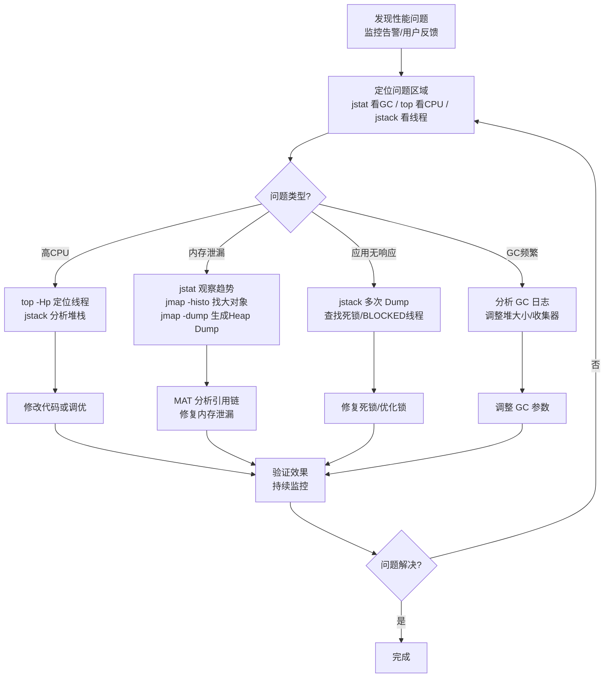
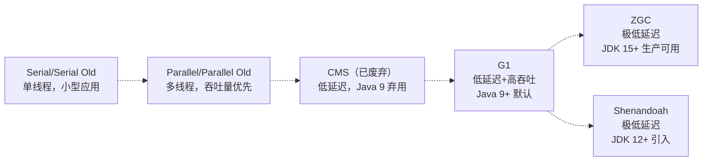

凌晨三点的线上告警：CPU 100%、接口响应超时、Full GC 每分钟一次……你手忙脚乱地 SSH 到服务器，`top` 一看，Java 进程吃掉了所有 CPU；`jstat` 一看，老年代使用率 99%，Full GC 已经执行了上百次。这时候，一个对 JVM 调优一无所知的开发者，和一名能熟练使用诊断工具的专家之间，差距就是「能不能在 10 分钟内定位并解决问题」。

为什么 JVM 会自动进行垃圾回收，却无法避免线上 Full GC 频繁导致的卡顿？为什么 `jstack` 能帮我们找到高 CPU 的元凶，`jmap` 能帮我们揪出内存泄漏的「真凶」？这些问题的答案，藏在你是否真正掌握了 JVM 的命令行工具和调优方法论。

本文将系统梳理 JVM 常用命令、核心配置参数和性能调优策略，让你从「遇到问题靠猜」进化到「遇到问题有据可查」。读完之后，你将能够：

- 熟练使用 `jps`、`jstat`、`jstack`、`jmap`、`jcmd` 五大诊断工具
- 掌握 JVM 核心配置参数的含义和最佳实践
- 独立排查高 CPU、内存泄漏、应用无响应等常见线上问题
- 根据业务特点选择合适的 GC 收集器并配置合理的参数

---

## 引言

在生产环境中，一个 Java 应用可能因为各种 JVM 相关的问题而导致服务不可用或性能不达标：

- **内存问题：** 内存泄漏导致长时间运行后 OOM；堆内存设置不当导致频繁 Full GC。
- **CPU 问题：** 线程死循环或热点代码导致 CPU 持续飙高；大量线程上下文切换消耗 CPU。
- **响应问题：** GC 停顿（Stop-The-World）过长导致应用卡顿；线程阻塞、死锁导致请求无法处理。

**核心问题：** 为什么 JVM 的自动内存管理，反而可能成为线上性能杀手？

> **💡 核心提示**
> JVM 调优的第一原则：**先测量，再优化。** 不要凭感觉改参数，要用工具收集数据，用数据指导决策。GC 日志、线程 Dump、Heap Dump 是你在生产环境中最重要的三把武器。

JVM 性能调优和诊断的目的是在保证应用功能正确性的前提下，最大化资源利用率，提升吞吐量，降低延迟，提高系统稳定性。这需要一套系统化的方法论。

### JVM 性能调优方法论

面对 JVM 性能问题，我们通常遵循以下步骤：

1. **发现问题：** 通过监控系统、用户反馈、日志等方式发现应用存在性能问题（如 CPU 告警、内存上涨、响应时间超标）。
2. **定位问题：** 使用 JVM 诊断工具（命令行工具、可视化工具）深入 JVM 内部，收集运行时的各种信息（内存使用、GC 情况、线程状态、CPU 占用等），初步判断问题可能发生在哪个区域（内存、线程、GC 等）。
3. **分析根源：** 结合收集到的信息（如线程 Dump 分析死锁，Heap Dump 分析内存泄漏，GC Log 分析 GC 瓶颈），找出导致问题的根本原因。
4. **制定解决方案：** 根据根源原因，制定相应的调优或修复方案（修改代码、调整 JVM 参数、升级硬件等）。
5. **实施方案：** 应用解决方案到测试环境或部分生产环境。
6. **监控与评估：** 持续监控应用在实施方案后的性能表现，评估调优效果，验证问题是否解决。
7. **重复：** 如果问题未完全解决或出现新的问题，重复以上步骤。

在这套方法论中，掌握各种 JVM 命令和配置参数是「定位问题」、「分析根源」和「制定方案」阶段的核心技能。

### JVM 监控与诊断常用命令行工具

JDK 自带了一系列强大的命令行工具，是分析 JVM 问题的第一道防线。它们通常在 JDK 的 `bin` 目录下。

1. **`jps`（JVM Process Status）：**
    - **作用：** 列出所有当前用户启动的 Java 进程 ID（PID）和主类名/JAR 包名。
    - **常用用法：** `jps -l`（显示主类名或 JAR 包路径），`jps -v`（显示启动参数）。
    - **排障关联：** 这是所有 JVM 诊断工具的第一步，用于获取目标 Java 进程的 PID。
    - **示例：** `jps -l` -> `12345 MySpringBootApplication`（找到应用 PID）。

2. **`jstat`（JVM Statistics Monitoring Tool）：**
    - **作用：** 监控 JVM 各种运行状态信息，如堆内存、GC、类加载、JIT 编译等。
    - **常用选项与用法：**
        - **`jstat -gc <pid> <interval> <count>`：** 监控 GC 堆状态。例如 `jstat -gc 12345 1000 10`（每秒打印一次 PID 12345 的 GC 信息，共 10 次）。
        - **`jstat -gcutil <pid> <interval> <count>`：** 监控 GC 统计信息（使用率、次数、时间）。输出更简洁。例如 `jstat -gcutil 12345 1000`（每秒持续打印）。
    - **输出解读（GC 相关）：**
        - `S0C`、`S1C`、`EC`、`OC`、`MC`：对应 Survivor 0/1 区、Eden 区、老年代、元空间的总容量。
        - `S0U`、`S1U`、`EU`、`OU`、`MU`：对应各区已使用容量。
        - `YGC`、`YGCT`：Young GC 次数和总耗时。
        - `FGC`、`FGCT`：Full GC 次数和总耗时。
    - **排障关联：**
        - **内存泄漏/高内存：** 观察 EU、OU 持续上涨，FGC 频繁或不下降。
        - **GC 频繁：** 观察 YGC/YGCT 或 FGC/FGCT 是否增长过快。
        - **GC 耗时：** 观察 YGCT/YGC 或 FGCT/FGC 计算每次 GC 的平均耗时。
    - **示例：** `jstat -gcutil 12345 5000`（每 5 秒看一次堆使用和 GC 情况）。

3. **`jstack`（JVM Stack Trace）：**
    - **作用：** 生成指定 PID 进程的所有线程堆栈快照（Thread Dump）。
    - **常用选项与用法：**
        - **`jstack <pid>`：** 打印线程 Dump 到标准输出。
        - `jstack -l <pid>`：打印额外的锁信息。
        - `jstack -F <pid>`：强制 Dump（进程无响应时）。
        - **`jstack <pid> > thread_dump.tdump`：** 将 Dump 保存到文件分析。
    - **Dump 文件解读：**
        - **线程状态：** 关注 `BLOCKED`（等待锁）、`WAITING`（等待通知）、`TIMED_WAITING`（定时等待）、`RUNNABLE`（正在执行或等待 CPU）、`TERMINATED`（已结束）。
        - **死锁：** Dump 文件中可能直接提示发现死锁。检查 `BLOCKED` 线程互相等待对方释放锁的情况。
        - **应用无响应/线程阻塞：** 查找大量处于 `BLOCKED` 或长时间 `WAITING`/`TIMED_WAITING` 状态的业务线程。
        - **高 CPU 线程查找：** 在 Linux 中，结合 `top -Hp <pid>` 找到 CPU 占用率高的线程 ID（tid）。将 tid 转换为 16 进制（`printf "%x\n" tid`）。在 `jstack <pid>` 输出中查找对应 16 进制 ID 的线程，分析其堆栈，看在执行什么代码。
    - **示例：** `jstack 12345 > thread_dump_$(date +%s).log`（保存带时间戳的 Dump）。

4. **`jmap`（JVM Memory Map）：**
    - **作用：** 生成 JVM 堆内存相关信息，如堆的使用情况、对象统计、以及生成 Heap Dump 文件。
    - **常用选项与用法：**
        - `jmap -heap <pid>`：显示堆内存的概要信息（GC 使用的收集器、堆配置参数、各代使用情况等）。
        - `jmap -histo <pid>`：显示堆中对象的统计信息（类名、对象数量、占用的字节数）。**用于查找是哪种对象占用了大量内存。**
        - **`jmap -dump:format=b,file=<filename>.hprof <pid>`：** 生成 Heap Dump 文件。`format=b` 是二进制格式，`file` 指定文件名。**用于内存泄漏的离线分析。**
    - **排障关联：**
        - **内存泄漏/高内存：** 结合 `jstat` 观察内存趋势，当内存使用率高时，使用 `jmap -histo` 查看是哪些对象数量多或占用空间大。生成 Heap Dump 文件（`.hprof`）后，使用 MAT 等工具进行离线分析，查找对象引用链，定位泄漏点。
    - **示例：** `jmap -dump:format=b,file=/tmp/heap_12345.hprof 12345`（生成 Heap Dump）。

5. **`jcmd`（JVM Command）：**
    - **作用：** JDK 7+ 引入的多功能命令行工具，可以替代 `jmap` 和 `jstack` 的部分功能，并提供更多高级诊断能力（如 GC 统计、类加载信息、VM 内部信息）。推荐使用 `jcmd` 代替旧工具。
    - **常用用法：** `jcmd <pid> help`（查看支持的命令），`jcmd <pid> Thread.print`（替代 jstack），`jcmd <pid> GC.heap_info`（替代 jmap -heap），`jcmd <pid> GC.heap_dump <filename>.hprof`（替代 jmap -dump）。
    - **排障关联：** 现代 JVM 诊断首选工具。

6. **可视化工具：**
    - `JConsole`、`VisualVM`、`JMC`（Java Mission Control）。提供 GUI 界面监控 JVM 状态，获取 Dump，插件丰富，比命令行工具更直观。常用于开发和测试环境。

### JVM 常用配置参数深度解析

通过在启动 Java 应用时添加 JVM 参数（`java -X... -XX:... -jar ...`），可以控制 JVM 的内存分配、垃圾回收行为等。

1. **堆内存参数：**
    - `-Xms<size>`：设置 JVM 启动时初始堆内存大小。
    - `-Xmx<size>`：设置 JVM 最大可使用堆内存大小。通常将 `-Xms` 和 `-Xmx` 设置为相同值，避免运行时频繁调整堆大小带来的开销。
    - `-XX:NewRatio=<N>`：设置新生代与老年代的比例。新生代 : 老年代 = 1 : N。NewRatio 值越小，新生代越大。影响 GC 频率和 Full GC 概率（新生代越大 Young GC 越少，但可能导致老年代空间不足触发 Full GC）。与老 GC 收集器关联紧密，G1 GC 中作用减弱。
    - `-XX:SurvivorRatio=<N>`：设置新生代中 Eden 区与 Survivor 区的比例。Eden : Survivor = N : 1。SurvivorRatio 值越小，Survivor 区越大。
    - `-XX:MaxMetaspaceSize=<size>`：设置元空间的最大大小。Java 8+。默认不受限制，只与本地内存大小有关。设置上限可以防止元空间无限增长耗尽本地内存，但可能导致 Metaspace OOM。
    - `-XX:MetaspaceSize=<size>`：设置元空间的初始大小。

2. **GC 收集器参数：**
    - **目标：** 根据应用对吞吐量（Throughput）和延迟（Latency）的要求选择合适的 GC 收集器。
        - **吞吐量优先：** 追求单位时间内处理的事务量或完成的总工作量。GC 停顿时间较长但总 GC 耗时占比较少。
        - **延迟优先：** 追求每次 GC 停顿时间最短，保证应用响应的平滑性。可能以牺牲部分总吞吐为代价。
    - **常用收集器及其启用参数：**
        - `Serial` / `Serial Old`：单线程，简单高效，适用于小型应用或客户端。`-XX:+UseSerialGC`。
        - `Parallel` / `Parallel Old`：多线程，吞吐量优先。适用于后台任务或数据分析等对吞吐量敏感的应用。`-XX:+UseParallelGC`。
        - `CMS`（Concurrent Mark Sweep）：并发收集，低延迟，目标是减少 Full GC 停顿。但有内存碎片、浮动垃圾等问题。**Java 9 已弃用，Java 14 移除。** `-XX:+UseConcMarkSweepGC`。
        - **`G1`（Garbage First）：** Java 9+ 默认 GC。区域化分代收集器，目标是低延迟且高吞吐，能预测 GC 停顿时间。适用于内存较大的服务器端应用。**推荐使用。** `-XX:+UseG1GC`。
        - **`ZGC` / `ShenandoahGC`：** 最新一代低延迟收集器。目标是秒级甚至毫秒级的 GC 停顿，适用于内存超大、对延迟要求极高的应用。`-XX:+UseZGC` / `-XX:+UseShenandoahGC`。需要特定 JDK 版本支持。
    - **设置依据：** 根据应用的特点（对象生命周期、内存大小、请求模式）、业务对延迟/吞吐的要求、以及通过 `jstat`/GC 日志分析的 GC 行为来选择和调整 GC 参数。

3. **GC 日志参数：**
    - **重要性：** GC 日志是分析 GC 行为、定位内存问题、评估调优效果的**最重要依据**。
    - `-XX:+PrintGCDetails`：打印详细的 GC 日志（Java 8）。
    - `-XX:+PrintGCDateStamps`：在 GC 日志中打印时间戳（Java 8）。
    - `-Xloggc:<filename>`：将 GC 日志输出到指定文件，方便离线分析（Java 8）。
    - **示例：** `-XX:+PrintGCDetails -XX:+PrintGCDateStamps -Xloggc:/var/log/app/gc-%t.log`（Java 8 语法）或 `-Xlog:gc*:file=/var/log/app/gc-%t.log:time,tags,pid,tid,level`（Java 9+ 统一日志语法）。

4. **其他常用参数：**
    - `-Xss<size>`：设置每个线程的虚拟机栈大小。影响线程数量（栈越大，可创建线程越少）和 StackOverflowError 的深度。
    - `-XX:CompileThreshold=<N>`：设置热点代码编译阈值。
    - `-XX:+HeapDumpOnOutOfMemoryError`：当发生 OOM 时自动生成 Heap Dump 文件。**生产环境强烈推荐开启。** `-XX:HeapDumpPath=<path>` 指定文件路径。

### GC 收集器演进与选型

### JVM 性能调优实践策略

结合前面介绍的工具和配置参数，我们可以系统地进行 JVM 性能调优和问题诊断。

1. **诊断高 CPU：**
    - **工具：** `top`/`htop`（定位高 CPU 进程）、`top -Hp <pid>`（定位高 CPU 线程）、`jstack <pid>`（获取线程 Dump）、`printf "%x\n" tid`（转换线程 ID）。
    - **流程：** 用 `top`/`htop` 找到 CPU 占用高的 Java 进程 PID。用 `top -Hp <pid>` 找到该进程内 CPU 占用高的线程 ID。将线程 ID 转为 16 进制。用 `jstack <pid>` 生成线程 Dump。在 Dump 文件中搜索该线程的 16 进制 ID，分析其堆栈，看线程在执行什么代码（是否死循环、是否在等待、是否是 GC 线程消耗 CPU 等）。
    - **关联配置：** 如果是业务线程导致的死循环，需要修改代码。如果是 GC 线程导致的 CPU 高，需要分析 GC 日志调优 GC。

2. **诊断内存泄漏/高内存：**
    - **工具：** `jstat -gcutil <pid>`（观察堆内存使用趋势和 GC 次数）、`jmap -histo <pid>`（统计对象数量和大小）、`jmap -dump <filename>.hprof <pid>`（生成 Heap Dump）、MAT/VisualVM（离线分析 Heap Dump）。
    - **流程：** 用 `jstat` 观察老年代（OU）是否持续上涨且 FGC 后不能释放。用 `jmap -histo` 查看是哪种对象数量或大小异常。在内存使用率高时，使用 `jmap -dump` 生成 Heap Dump 文件。使用 MAT 等工具打开 Heap Dump 文件，分析对象引用链，定位泄漏点。
    - **关联配置：** 根据分析结果，修改代码（解除不必要的引用）。如果内存设置不合理，调整 `-Xms`、`-Xmx`。如果 GC 效率低，考虑更换 GC 收集器。开启 `-XX:+HeapDumpOnOutOfMemoryError` 自动捕获现场。

3. **诊断应用无响应/死锁：**
    - **工具：** `jstack <pid>`。
    - **流程：** 多次执行 `jstack <pid>` 生成多个线程 Dump（看线程状态是否变化）。在 Dump 文件中查找是否有死锁信息。查找大量处于 `BLOCKED`（等待锁）或长时间处于 `WAITING`/`TIMED_WAITING` 状态的业务线程，分析其堆栈和等待的资源，定位阻塞原因。
    - **关联配置：** 修改代码（避免死锁，优化等待机制）。

4. **优化堆大小：**
    - **工具：** `jstat`、GC 日志。
    - **策略：** 根据 `jstat`/GC 日志，观察老年代的使用率和 Full GC 的频率。将 `-Xms` 和 `-Xmx` 设置为相同值，避免堆的动态扩缩容。设置一个合适的值，既要避免频繁 Young GC 和 Full GC，也要避免浪费过多内存。根据业务负载测试找到最佳值。
    - **关联配置：** `-Xms`、`-Xmx`、`-XX:NewRatio`（老 GC）。

5. **优化 GC：**
    - **工具：** `jstat`、GC 日志（最重要）。
    - **策略：** 根据 GC 日志分析 Young GC 和 Full GC 的频率、耗时、停顿时间。
        - 如果追求高吞吐，可以适当增大新生代，减少 Young GC 次数（Trade-off 是 Young GC 可能更耗时，且可能更快触发 Full GC）。选择 Parallel GC 或 G1 GC。
        - 如果追求低延迟，尽量减少单次 GC 停顿时间。选择 G1 GC（通过 `MaxGCPauseMillis` 控制）或 ZGC/ShenandoahGC。
        - 观察 Full GC 是否频繁，是否耗时过长。Full GC 通常是性能瓶颈，应尽量避免。可能需要增大老年代、优化代码减少长期存活对象或内存泄漏。
    - **关联配置：** GC 收集器参数（`-XX:+UseG1GC` 等），`-XX:MaxGCPauseMillis`（G1 等的 GC 停顿目标）、`-XX:NewRatio`、`-XX:SurvivorRatio`、`-XX:ParallelGCThreads` 等。

6. **元空间调优（Java 8+）：**
    - **工具：** `jstat -gcutil <pid>`（观察 MU 使用率）、GC 日志。
    - **策略：** 观察元空间使用是否持续上涨。如果设置了 `-XX:MaxMetaspaceSize` 且接近上限可能导致 OOM。如果未设置上限且持续上涨，可能存在 ClassLoader 泄漏。
    - **关联配置：** `-XX:MaxMetaspaceSize`、`-XX:MetaspaceSize`。

### 核心参数与工具对比表

| 工具/参数 | 用途 | 典型场景 | 关键输出 |
|----------|------|---------|---------|
| `jps` | 查看 Java 进程 | 获取 PID | 进程列表 |
| `jstat -gcutil` | 监控 GC 状态 | 观察内存趋势/GC频率 | 各区使用率%、GC次数/耗时 |
| `jstack` | 线程 Dump | 死锁/高CPU/无响应 | 线程堆栈快照 |
| `jmap -histo` | 对象统计 | 内存泄漏初步排查 | 类名、对象数、占用字节 |
| `jmap -dump` | Heap Dump | 内存泄漏深度分析 | `.hprof` 文件（MAT 分析） |
| `jcmd` | 多功能诊断 | 现代 JVM 诊断首选 | 替代 jstack/jmap + 更多 |
| `-Xms/-Xmx` | 堆大小 | 堆内存规划 | 启动时生效 |
| `-XX:+UseG1GC` | GC 收集器 | 推荐默认选择 | 区域化分代收集 |
| `-XX:+HeapDumpOnOutOfMemoryError` | OOM 自动 Dump | 生产环境必备 | OOM 时自动生成 hprof |
| `-Xlog:gc*` | GC 日志 | 调优分析基础 | GC 事件详细记录 |

### 理解 JVM 调优与诊断对开发者和面试的价值

掌握 JVM 调优与诊断技能，是成为一名优秀后端开发者的核心竞争力。它让你：

- 能够独立解决生产环境中的 JVM 相关的疑难问题。
- 对应用的性能有更深的理解和控制力。
- 在系统设计和代码编写时，能够考虑 JVM 的运行特点，避免引入潜在的性能问题。
- 在面试中展现出对 Java 基础、JVM 原理、操作系统、并发编程等多个方面的扎实功底和解决复杂问题的能力。

### JVM 性能调优与诊断为何是面试热点

- **核心技术能力：** 直接考察候选人解决生产环境问题的能力。
- **涉及基础原理：** 调优和诊断需要结合 JVM 运行时数据区、GC、类加载、线程等基础原理。
- **区分度高：** 基础命令大家可能了解，但能够深入解读输出、系统化诊断问题、并进行调优，是区分高级和初中级开发者的重要标志。
- **实用性强：** 这是在任何 Java 后端岗位都可能用到的技能。

### 面试问题示例与深度解析

- **如何诊断一个 Java 进程的 CPU 使用率很高？** 回答 `top`/`htop` 找进程 PID -> `top -Hp <pid>` 找线程 TID -> `printf "%x\n" tid` 转 16 进制 -> `jstack <pid>` 获取 Dump -> 在 Dump 中找对应线程分析堆栈。
- **如何诊断一个 Java 应用是否存在内存泄漏？** 回答 `jstat` 观察老年代趋势 -> `jmap -histo` 看对象统计 -> `jmap -dump` 生成 Heap Dump -> 使用 MAT/VisualVM 离线分析 Dump，找引用链。
- **你的 Java 应用突然没有响应了，可能是死锁导致的，如何使用命令确认？** 多次 `jstack <pid>` 生成 Dump -> 在 Dump 中查找死锁信息或大量 BLOCKED/WAITING 线程，分析等待资源。
- **如何查看 Java 进程的堆内存使用情况和 GC 情况？** `jstat -gcutil <pid>`。关注指标：各区使用率 %（EU%、OU%、MU%）、GC 次数（YGC、FGC）、GC 总耗时（YGCT、FGCT）。
- **请解释一下 `-Xms` 和 `-Xmx` 参数的作用。在设置这两个参数时有什么建议？** 作用：初始堆/最大堆。建议：通常设为相同值避免动态调整开销。
- **请介绍几种常用的垃圾回收器。它们的目标和适用场景有什么区别？** Parallel（吞吐）、CMS（维护/低延迟）、G1（低延迟高吞吐/推荐）、ZGC/Shenandoah（极低延迟）。选择依据：应用特点、业务需求、内存大小。
- **为什么在调优 JVM 性能时，GC 日志非常重要？** 它是分析 GC 行为、定位内存问题、评估调优效果的最重要依据。开启：`-XX:+PrintGCDetails -Xloggc:<filename>` 等。
- **Java 8 以后元空间（Metaspace）的大小如何控制？** 控制：`-XX:MaxMetaspaceSize`。溢出错误：`OutOfMemoryError: Metaspace`。
- **生产环境发生 OOM 时，如何自动捕获当时的内存现场？** 开启 `-XX:+HeapDumpOnOutOfMemoryError` 参数，配置 `-XX:HeapDumpPath`。

### 生产环境避坑指南

| 陷阱 | 现象 | 根因 | 解决方案 |
|------|------|------|---------|
| -Xms 和 -Xmx 不相等 | 运行中堆频繁扩缩容，GC 频率波动 | 堆动态调整带来额外开销 | `-Xms` 和 `-Xmx` 设为相同值 |
| JVM 堆超过 32GB | GC 停顿时间突然暴增 | 压缩 Oops 失效，对象指针从 4 字节变为 8 字节 | 堆内存不超过 32GB（通常 31GB） |
| 未开启 GC 日志 | Full GC 频繁但无法分析原因 | 没有数据支撑调优决策 | 生产环境务必开启 GC 日志 |
| 未开启 OOM 自动 Dump | OOM 后无法追溯根因 | 现场已丢失，只能复现 | `-XX:+HeapDumpOnOutOfMemoryError` |
| -Xss 设置过大 | 线程数受限，并发能力下降 | 每个线程占用过多栈内存 | 根据方法调用深度设置（256K-1M） |
| 线上直接执行 jmap -dump | 触发 Full GC，服务卡顿数秒 | Heap Dump 需要 STW | 低峰期操作，或使用 `jcmd` 替代 |
| Metaspace 不设上限 | ClassLoader 泄漏时本地内存耗尽 | 默认无限制 | 设置 `-XX:MaxMetaspaceSize=256m` |

### 行动清单

- [ ] 确认生产环境 JVM 启动参数包含：`-Xms` 和 `-Xmx` 设为相同值
- [ ] 开启 GC 日志：Java 8 用 `-XX:+PrintGCDetails -Xloggc:<path>`，Java 9+ 用 `-Xlog:gc*`
- [ ] 开启 OOM 自动 Dump：`-XX:+HeapDumpOnOutOfMemoryError -XX:HeapDumpPath=<path>`
- [ ] 设置 Metaspace 上限：`-XX:MaxMetaspaceSize=256m`（根据应用调整）
- [ ] 确认 GC 收集器选择合理：默认推荐 G1（`-XX:+UseG1GC`），低延迟场景考虑 ZGC
- [ ] 将 JVM 堆内存控制在 32GB 以下（推荐 31GB），避免压缩 Oops 失效
- [ ] 熟悉高 CPU 排查完整流程：`top` -> `top -Hp` -> `printf "%x"` -> `jstack`
- [ ] 掌握内存泄漏排查流程：`jstat` 观察趋势 -> `jmap -histo` 定位对象 -> `jmap -dump` 生成 Dump -> MAT 分析
- [ ] 在测试环境模拟 Full GC 场景，验证调优参数效果后再推生产
- [ ] 建立 JVM 监控大盘（Prometheus + Grafana），实时监控 GC 频率、堆使用率、线程数

### 总结

JVM 性能调优和诊断是 Java 开发者走向资深的关键能力。它要求我们不仅理解 JVM 的基础原理，更能熟练运用各种命令行工具来洞察 JVM 内部运行状态，并通过合理的配置参数来控制 JVM 的行为。

掌握 `jps`、`jstat`、`jstack`、`jmap`、`jcmd` 等工具的使用和输出解读，理解堆内存、元空间、GC 收集器、GC 日志等关键概念和配置参数，并能够系统地运用这些知识来诊断和解决高 CPU、内存泄漏、应用无响应等问题，是成为一名 JVM 专家并从容应对面试挑战的必备技能。
