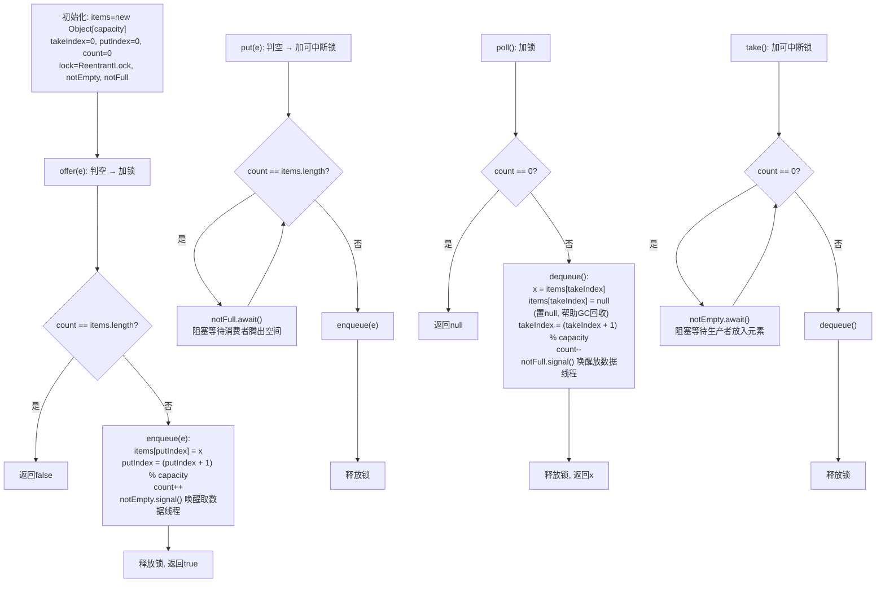

欢迎学习《解读Java源码专栏》，在这个系列中，我将手把手带着大家剖析Java核心组件的源码，内容包含集合、线程、线程池、并发、队列等，深入了解其背后的设计思想和实现细节，轻松应对工作面试。
这是解读Java源码系列的第9篇，将跟大家一起学习Java中的阻塞队列 —— `ArrayBlockingQueue`。

## 引言
在日常开发中，我们好像很少直接用到 `BlockingQueue（阻塞队列）`，`BlockingQueue` 到底有什么作用？应用场景是什么样的？

如果使用过线程池或者阅读过线程池源码，就会知道线程池的核心功能都是基于 `BlockingQueue` 实现的。

大家用过消息队列（MessageQueue），就知道消息队列的作用是解耦、异步、削峰。同样 `BlockingQueue` 的作用也是这三种，区别是 `BlockingQueue` 只作用于本机器，而消息队列相当于分布式 `BlockingQueue`。

`BlockingQueue` 作为阻塞队列，主要应用于生产者-消费者模式的场景，在并发多线程中尤其常用。

1. 比如线程池中的任务调度场景：提交任务和拉取并执行任务。
2. 生产者与消费者解耦的场景：生产者把数据放到队列中，消费者从队列中取数据进行消费。两者进行解耦，不用感知对方的存在。
3. 应对突发流量的场景：业务高峰期突然来了很多请求，可以放到队列中缓存起来，消费者以正常的频率从队列中拉取并消费数据，起到削峰的作用。

`BlockingQueue` 是个接口，定义了几组放数据和取数据的方法，来满足不同的场景。

| 操作 | 抛出异常 | 返回特定值 | 阻塞 | 阻塞一段时间 |
| --- | --- | --- | --- | --- |
| 放数据 | add() | offer() | put() | offer(e, time, unit) |
| 取数据（同时删除） | remove() | poll() | take() | poll(time, unit) |
| 查看数据（不删除） | element() | peek() | 不支持 | 不支持 |

`BlockingQueue` 有 5 个常见的实现类，应用场景不同：

- **ArrayBlockingQueue**：基于数组实现的阻塞队列，创建时需指定容量大小，是有界队列。
- **LinkedBlockingQueue**：基于链表实现的阻塞队列，默认是无界队列，创建时可以指定容量大小。
- **SynchronousQueue**：一种没有缓冲的阻塞队列，生产出的数据需要立刻被消费。
- **PriorityBlockingQueue**：实现了优先级的阻塞队列，基于堆（PriorityQueue）实现，是无界队列。
- **DelayQueue**：实现了延迟功能的阻塞队列，基于 PriorityQueue 实现，是无界队列。

今天重点讲一下 `ArrayBlockingQueue` 的底层实现原理。

`ArrayBlockingQueue` 的核心工作原理可以用下面的流程图概括：



## ArrayBlockingQueue 类结构

先看一下 `ArrayBlockingQueue` 类里面有哪些属性：

```java
public class ArrayBlockingQueue<E>
        extends AbstractQueue<E>
        implements BlockingQueue<E>, java.io.Serializable {

    /**
     * 用来存放元素的数组
     */
    final Object[] items;

    /**
     * 下次取数据的数组下标位置
     */
    int takeIndex;

    /**
     * 下次放数据的数组下标位置
     */
    int putIndex;

    /**
     * 元素个数
     */
    int count;

    /**
     * 独占锁，用来保证存取数据的线程安全
     */
    final ReentrantLock lock;

    /**
     * 取数据的条件队列：当数组非空时唤醒消费者
     */
    private final Condition notEmpty;

    /**
     * 放数据的条件队列：当数组不满时唤醒生产者
     */
    private final Condition notFull;

}
```

可以看出 `ArrayBlockingQueue` 底层是基于数组实现的，使用 `Object[]` 数组 `items` 存储元素。为了实现循环队列特性（一端插入，另一端删除），定义了两个指针：`takeIndex` 表示下次取数据的位置，`putIndex` 表示下次放数据的位置。

另外 `ArrayBlockingQueue` 使用 `ReentrantLock` 保证线程安全，并且定义了两个**条件变量**：

- **`notEmpty`**：当队列中有元素时（非空），生产者调用 `notEmpty.signal()` 唤醒等待的消费者线程
- **`notFull`**：当队列中有空位时（不满），消费者调用 `notFull.signal()` 唤醒等待的生产者线程

生产者-消费者通过这两个条件变量实现协调：队列满时生产者等待在 `notFull` 上，队列空时消费者等待在 `notEmpty` 上。

## 初始化

`ArrayBlockingQueue` 常用的初始化方法有两个：

1. 指定容量大小（默认非公平锁）
2. 指定容量大小和是否是公平锁

```java
/**
 * 指定容量大小的构造方法（默认非公平锁）
 */
BlockingQueue<Integer> queue1 = new ArrayBlockingQueue<>(10);

/**
 * 指定容量大小和公平锁的构造方法
 */
BlockingQueue<Integer> queue2 = new ArrayBlockingQueue<>(10, true);
```

再看一下对应的源码实现：

```java
/**
 * 指定容量大小的构造方法（默认非公平锁）
 */
public ArrayBlockingQueue(int capacity) {
    this(capacity, false);
}

/**
 * 指定容量大小、公平锁的构造方法
 *
 * @param capacity 数组容量
 * @param fair     是否是公平锁
 */
public ArrayBlockingQueue(int capacity, boolean fair) {
    if (capacity <= 0) {
        throw new IllegalArgumentException();
    }
    this.items = new Object[capacity];
    lock = new ReentrantLock(fair);
    notEmpty = lock.newCondition();
    notFull = lock.newCondition();
}
```

`ArrayBlockingQueue` 在初始化时就一次性创建好指定容量的数组，并在构造方法中初始化锁和两个条件变量。公平锁的选择取决于业务场景：公平锁按照线程请求锁的顺序分配，避免线程饥饿，但吞吐量较低；非公平锁吞吐量更高，但某些线程可能长期等待。

## 放数据源码

放数据的方法有四个：

| 操作 | 抛出异常 | 返回特定值 | 阻塞 | 阻塞一段时间 |
| --- | --- | --- | --- | --- |
| 放数据 | add() | offer() | put() | offer(e, time, unit) |

### offer 方法源码

先看一下 `offer()` 方法源码：

```java
/**
 * offer 方法入口
 *
 * @param e 元素
 * @return 是否插入成功
 */
public boolean offer(E e) {
    // 1. 判空，传参不允许为 null
    checkNotNull(e);
    // 2. 加锁
    final ReentrantLock lock = this.lock;
    lock.lock();
    try {
        // 3. 判断数组是否已满，如果满了就直接返回 false
        if (count == items.length) {
            return false;
        } else {
            // 4. 否则执行入队
            enqueue(e);
            return true;
        }
    } finally {
        // 5. 释放锁
        lock.unlock();
    }
}

/**
 * 入队
 *
 * @param x 元素
 */
private void enqueue(E x) {
    // 1. 获取数组
    final Object[] items = this.items;
    // 2. 放入 putIndex 位置
    items[putIndex] = x;
    // 3. putIndex 向后移动一位，到达数组末尾时回到 0（循环队列）
    if (++putIndex == items.length) {
        putIndex = 0;
    }
    // 4. 元素计数加一
    count++;
    // 5. 唤醒因为队列为空而在 notEmpty 上等待的消费者线程
    notEmpty.signal();
}
```

`offer()` 的逻辑：判空 → 加锁 → 检查队列是否已满（`count == items.length`） → 满了返回 `false`，否则调用 `enqueue` 入队 → 释放锁。

`enqueue` 方法中有一个关键设计：`putIndex` 到达数组末尾后会回到 0，这就是**循环队列**的实现方式。数组空间可以被循环利用，不会像普通数组那样因为头部出队而浪费空间。

### add 方法源码

`add()` 方法在队列满的时候会抛出异常，底层基于 `offer()` 实现：

```java
/**
 * add 方法入口
 *
 * @param e 元素
 * @return 是否添加成功
 */
public boolean add(E e) {
    if (offer(e)) {
        return true;
    } else {
        throw new IllegalStateException("Queue full");
    }
}
```

### put 方法源码

`put()` 方法在队列满的时候会一直阻塞，直到有其他线程取走数据、空出位置，才能添加成功。

```java
/**
 * put 方法入口
 *
 * @param e 元素
 */
public void put(E e) throws InterruptedException {
    // 1. 判空，传参不允许为 null
    checkNotNull(e);
    // 2. 加可中断的锁，防止线程无法被唤醒
    final ReentrantLock lock = this.lock;
    lock.lockInterruptibly();
    try {
        // 3. 如果队列已满，就一直阻塞在 notFull 条件上
        while (count == items.length) {
            notFull.await();
        }
        // 4. 队列未满，执行入队
        enqueue(e);
    } finally {
        // 5. 释放锁
        lock.unlock();
    }
}
```

注意这里使用 `while` 循环而不是 `if` 判断，是因为存在**虚假唤醒**的可能——线程可能在没有被 `signal()` 的情况下被唤醒。用 `while` 可以在唤醒后重新检查条件是否真的满足。

### offer(e, time, unit) 源码

`offer(e, time, unit)` 方法在队列满的时候会阻塞指定时间，超时后返回 `false`。

```java
/**
 * offer 方法入口
 *
 * @param e       元素
 * @param timeout 超时时间
 * @param unit    时间单位
 * @return 是否添加成功
 */
public boolean offer(E e, long timeout, TimeUnit unit) throws InterruptedException {
    // 1. 判空，传参不允许为 null
    checkNotNull(e);
    // 2. 把超时时间转换为纳秒
    long nanos = unit.toNanos(timeout);
    // 3. 加可中断的锁
    final ReentrantLock lock = this.lock;
    lock.lockInterruptibly();
    try {
        // 4. 循环判断队列是否已满
        while (count == items.length) {
            if (nanos <= 0) {
                // 5. 如果超时时间已过，返回 false
                return false;
            }
            // 6. 在 notFull 条件上等待指定纳秒数
            nanos = notFull.awaitNanos(nanos);
        }
        // 7. 队列未满，执行入队
        enqueue(e);
        return true;
    } finally {
        // 8. 释放锁
        lock.unlock();
    }
}
```

## 取数据源码

取数据（取出并删除）的方法有四个：

| 操作 | 抛出异常 | 返回特定值 | 阻塞 | 阻塞一段时间 |
| --- | --- | --- | --- | --- |
| 取数据（同时删除） | remove() | poll() | take() | poll(time, unit) |

### poll 方法源码

看一下 `poll()` 方法源码：

```java
/**
 * poll 方法入口
 */
public E poll() {
    // 1. 加锁
    final ReentrantLock lock = this.lock;
    lock.lock();
    try {
        // 2. 如果队列为空，返回 null，否则从队头取出元素
        return (count == 0) ? null : dequeue();
    } finally {
        // 3. 释放锁
        lock.unlock();
    }
}

/**
 * 出队
 */
private E dequeue() {
    // 1. 获取队头元素
    final Object[] items = this.items;
    E x = (E) items[takeIndex];
    // 2. 取出元素后，将该位置置 null（帮助 GC 回收）
    items[takeIndex] = null;
    // 3. takeIndex 向后移动一位，到达数组末尾时回到 0（循环队列）
    if (++takeIndex == items.length) {
        takeIndex = 0;
    }
    // 4. 元素计数减一
    count--;
    // 5. 唤醒因为队列已满而在 notFull 条件上等待的生产者线程
    notFull.signal();
    return x;
}
```

`dequeue` 方法中，取出元素后把 `items[takeIndex]` 置为 `null`，这是一个**GC 友好**的设计。因为循环数组会不断复用，如果不置为 `null`，已经被取走的元素的引用仍然存在，可能导致对象无法被 GC 回收（类似内存泄漏）。

`takeIndex` 同样在到达数组末尾后回到 0，实现循环队列的循环利用。

### remove 方法源码

`remove()` 方法在队列为空时会抛出异常：

```java
/**
 * remove 方法入口
 */
public E remove() {
    // 1. 直接调用 poll 方法
    E x = poll();
    // 2. 如果取到数据，直接返回，否则抛出异常
    if (x != null) {
        return x;
    } else {
        throw new NoSuchElementException();
    }
}
```

除了从队头删除元素外，`ArrayBlockingQueue` 还提供了删除指定元素的方法 `remove(Object o)`：

```java
/**
 * 删除指定元素
 */
public boolean remove(Object o) {
    if (o == null) return false;
    final Object[] items = this.items;
    final ReentrantLock lock = this.lock;
    lock.lock();
    try {
        // 从 takeIndex 开始线性遍历查找
        for (int i = takeIndex, k = count; k > 0; i = inc(i), k--) {
            if (o.equals(items[i])) {
                removeAt(i);
                return true;
            }
        }
        return false;
    } finally {
        lock.unlock();
    }
}
```

`remove(Object o)` 需要从 `takeIndex` 开始线性遍历查找目标元素（O(n)），找到后调用 `removeAt(i)` 删除。`removeAt` 的逻辑比较复杂：如果被删除的元素在队头或队尾，直接 dequeue 或调整 putIndex 即可；如果在中间位置，需要将后面的元素逐个向前移动一位。

### take 方法源码

`take()` 方法在队列为空时会一直阻塞，直到被唤醒：

```java
/**
 * take 方法入口
 */
public E take() throws InterruptedException {
    // 1. 加可中断的锁
    final ReentrantLock lock = this.lock;
    lock.lockInterruptibly();
    try {
        // 2. 如果队列为空，就一直阻塞在 notEmpty 条件上
        while (count == 0) {
            notEmpty.await();
        }
        // 3. 队列不为空，执行出队
        return dequeue();
    } finally {
        // 4. 释放锁
        lock.unlock();
    }
}
```

### poll(time, unit) 源码

`poll(time, unit)` 方法在队列为空时会阻塞指定时间，超时后返回 `null`。

```java
/**
 * poll 方法入口
 *
 * @param timeout 超时时间
 * @param unit    时间单位
 * @return 元素
 */
public E poll(long timeout, TimeUnit unit) throws InterruptedException {
    // 1. 把超时时间转换成纳秒
    long nanos = unit.toNanos(timeout);
    // 2. 加可中断的锁
    final ReentrantLock lock = this.lock;
    lock.lockInterruptibly();
    try {
        // 3. 循环判断队列是否为空
        while (count == 0) {
            if (nanos <= 0) {
                // 4. 如果超时时间已过，返回 null
                return null;
            }
            // 5. 在 notEmpty 条件上等待指定纳秒数
            nanos = notEmpty.awaitNanos(nanos);
        }
        // 6. 队列不为空，执行出队
        return dequeue();
    } finally {
        // 7. 释放锁
        lock.unlock();
    }
}
```

`poll(time, unit)` 与 `take()` 方法逻辑类似，区别在于 `take()` 在队列为空时会一直阻塞，而 `poll(time, unit)` 只会阻塞指定的超时时间。

## 查看数据源码

查看数据，并不删除。

| 操作 | 抛出异常 | 返回特定值 | 阻塞 | 阻塞一段时间 |
| --- | --- | --- | --- | --- |
| 查看数据（不删除） | element() | peek() | 不支持 | 不支持 |

### peek 方法源码

`peek()` 方法在队列为空时返回 `null`：

```java
/**
 * peek 方法入口
 */
public E peek() {
    // 1. 加锁
    final ReentrantLock lock = this.lock;
    lock.lock();
    try {
        // 2. 返回队头元素，如果队列为空则返回 null
        return itemAt(takeIndex);
    } finally {
        // 3. 释放锁
        lock.unlock();
    }
}

/**
 * 返回指定位置的元素
 */
final E itemAt(int i) {
    return (E) items[i];
}
```

### element 方法源码

`element()` 方法在队列为空时抛出异常：

```java
/**
 * element 方法入口
 */
public E element() {
    // 1. 调用 peek 方法查询数据
    E x = peek();
    // 2. 如果查到数据，直接返回
    if (x != null) {
        return x;
    } else {
        // 3. 如果没找到，则抛出异常
        throw new NoSuchElementException();
    }
}
```

## 总结

这篇文章讲解了 `ArrayBlockingQueue` 阻塞队列的核心源码，了解到 `ArrayBlockingQueue` 具有以下特点：

1. `ArrayBlockingQueue` 实现了 `BlockingQueue` 接口，提供了四组放数据和取数据的方法，满足不同场景需求。
2. 底层基于数组实现，采用**循环队列**设计，`takeIndex` 和 `putIndex` 到达数组末尾后回到 0，实现空间复用。
3. 初始化时必须指定容量大小，是**有界的阻塞队列**，需要预估好队列长度，保证生产者和消费者的速率相匹配。
4. 使用 `ReentrantLock` + 两个 `Condition`（`notEmpty` 和 `notFull`）实现线程安全和生产者-消费者协调机制。
5. 取数据后将出队位置**置为 null**，避免循环数组中残留无用引用导致 GC 无法回收对象。

### 关键操作时间复杂度对比

| 操作 | 方法 | 时间复杂度 | 说明 |
| --- | --- | --- | --- |
| 入队 | offer/put/add | O(1) | 直接写入 putIndex 位置 |
| 出队 | poll/take/remove() | O(1) | 直接读取 takeIndex 位置 |
| 查看队头 | peek/element | O(1) | 直接读取 takeIndex 位置 |
| 删除指定元素 | remove(Object) | O(n) | 需从 takeIndex 开始线性遍历查找 |
| 剩余容量 | remainingCapacity | O(1) | 返回 items.length - count |

### 使用建议

1. **有界队列需合理设置容量**：`ArrayBlockingQueue` 是有界队列，创建时必须指定容量。容量过小会导致生产者频繁阻塞，容量过大会占用过多内存。应根据生产者和消费者的速率差异来设置合理的大小。
2. **公平锁 vs 非公平锁**：默认使用非公平锁（`fair=false`），吞吐量更高。只有在需要严格保证线程公平性（防止饥饿）的场景下才使用公平锁。
3. **选择正确的阻塞方法**：如果生产者可以丢弃数据，使用 `offer()` 或 `offer(e, time, unit)`；如果生产者必须等待，使用 `put()`。消费者同理：可以超时返回的用 `poll(time, unit)`，必须等待的用 `take()`。
4. **删除任意元素成本高**：`remove(Object)` 需要 O(n) 线性遍历查找，在循环数组中还可能涉及元素前移。如果需要频繁按值删除元素，应考虑其他数据结构。
