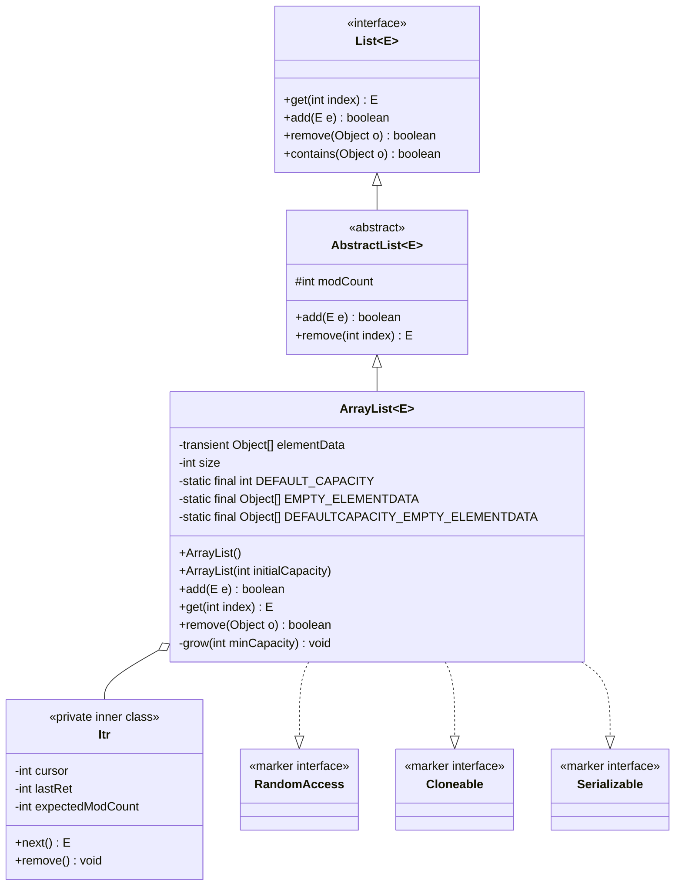
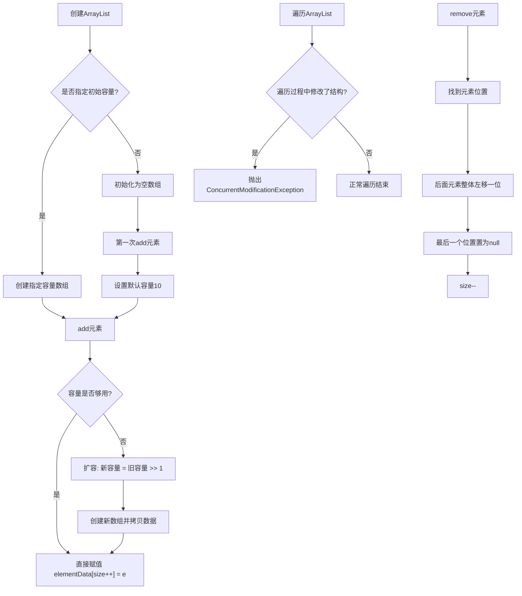
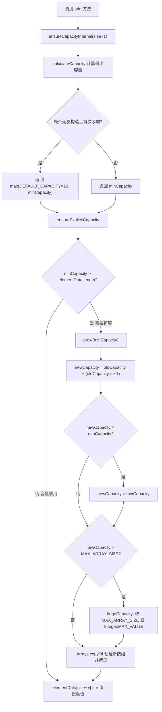

## 引言

你以为 ArrayList 只是一个能动态扩容的普通数组？面试中 90% 的人连它的初始容量都答错。

作为 Java 开发者，每天都在用的 ArrayList，你真的了解它的底层设计吗？为什么扩容因子选 1.5 倍而不是 2 倍？并发修改为什么会抛出 ConcurrentModificationException？如何安全高效地删除元素？

本文将从源码级别剖析 ArrayList 的核心机制，看完以下内容，你将轻松解答这些问题：

1. ArrayList 的初始容量是多少？（90% 的人都会答错）
2. ArrayList 的扩容机制与 1.5 倍设计原理
3. 并发修改 ArrayList 元素会有什么问题
4. 如何快速安全地删除 ArrayList 中的元素

## 简介

ArrayList底层基于数组实现，可以随机访问，内部使用一个Object数组来保存元素。它维护了一个 `elementData` 数组和一个 `size` 字段，`elementData`数组用来存放元素，`size`字段用于记录元素个数。它允许元素为null，可以动态扩容。

### 类图架构



> **💡 核心提示**：ArrayList实现了 `RandomAccess` 标记接口，这是一个**空接口**（marker interface），没有任何方法。它的作用是告诉算法："我支持O(1)随机访问"。Collections.binarySearch等方法会检查这个接口来决定使用索引遍历还是迭代器遍历。

### 核心操作流程



ArrayList的核心操作流程如下：

## 初始化

当我们调用ArrayList的构造方法的时候，底层实现逻辑是什么样的？

```java
// 调用无参构造方法，初始化ArrayList
List<Integer> list1 = new ArrayList<>();

// 调用有参构造方法，初始化ArrayList，指定容量为10
List<Integer> list2 = new ArrayList<>(10);
```

看一下底层源码实现：

```java
// 默认容量大小
private static final int DEFAULT_CAPACITY = 10;

// 空数组，用于有参构造指定容量为0的情况
private static final Object[] EMPTY_ELEMENTDATA = {};

// 默认容量的空数组对象，用于无参构造
private static final Object[] DEFAULTCAPACITY_EMPTY_ELEMENTDATA = {};

// 存储元素的数组
transient Object[] elementData;

// 数组中元素个数，默认是0
private int size;

// 无参初始化，默认是空数组
public ArrayList() {
    this.elementData = DEFAULTCAPACITY_EMPTY_ELEMENTDATA;
}

// 有参初始化，指定容量大小
public ArrayList(int initialCapacity) {
    if (initialCapacity > 0) {
        // 直接使用指定的容量大小
        this.elementData = new Object[initialCapacity];
    } else if (initialCapacity == 0) {
        this.elementData = EMPTY_ELEMENTDATA;
    } else {
        throw new IllegalArgumentException("Illegal Capacity: "+initialCapacity);
    }
}
```

可以看到当我们调用ArrayList的无参构造方法 `new ArrayList<>()` 的时候，只是初始化了一个空对象，并没有指定数组大小，所以初始容量是零。至于什么时候指定数组大小，接着往下看。

**为什么要有两个空数组常量？**

`EMPTY_ELEMENTDATA` 和 `DEFAULTCAPACITY_EMPTY_ELEMENTDATA` 虽然都是空数组，但作用不同：

- `DEFAULTCAPACITY_EMPTY_ELEMENTDATA` 专门用于无参构造，它是一个标记。当第一次添加元素时，通过判断 `elementData == DEFAULTCAPACITY_EMPTY_ELEMENTDATA` 来触发默认容量10的设置。
- `EMPTY_ELEMENTDATA` 用于有参构造且指定容量为0的情况（`new ArrayList<>(0)`）。使用这个标记可以区分"用户明确指定容量为0"和"无参构造尚未确定容量"两种场景，避免在 `calculateCapacity` 中误将用户明确指定为0的容量扩展为10。

这种设计让ArrayList能准确判断是否应该使用默认容量10。

> **💡 核心提示**：为什么 `elementData` 要加 `transient` 关键字？因为ArrayList实现了 `Serializable` 接口，但实际序列化时**不会直接序列化整个数组**（可能包含大量null空位）。ArrayList重写了 `writeObject()` 和 `readObject()` 方法，只序列化实际存在的元素（`size` 个），反序列化时再重新分配数组。这节省了存储空间并提高了序列化效率。

## 添加元素

再看一下往ArrayList中添加元素时，调用的 `add()` 方法源码：

```java
// 添加元素
public boolean add(E e) {
  // 确保数组容量够用，size是元素个数
  ensureCapacityInternal(size + 1);
  // 直接在下个位置赋值
  elementData[size++] = e;
  return true;
}

// 确保数组容量够用
private void ensureCapacityInternal(int minCapacity) {
    ensureExplicitCapacity(calculateCapacity(elementData, minCapacity));
}

// 计算所需最小容量
private static int calculateCapacity(Object[] elementData, int minCapacity) {
  	// 如果是无参构造且第一次添加元素，就设置默认容量为10
    if (elementData == DEFAULTCAPACITY_EMPTY_ELEMENTDATA) {
        return Math.max(DEFAULT_CAPACITY, minCapacity);
    }
    return minCapacity;
}

// 确保容量够用
private void ensureExplicitCapacity(int minCapacity) {
    modCount++;
  	// 如果所需最小容量大于数组长度，就进行扩容
    if (minCapacity - elementData.length > 0)
        grow(minCapacity);
}
```

看一下扩容逻辑：

```java
// 扩容，就是把旧数据拷贝到新数组里面
private void grow(int minCapacity) {
  int oldCapacity = elementData.length;
  // 计算新数组的容量大小，是旧容量的1.5倍
  int newCapacity = oldCapacity + (oldCapacity >> 1);

  // 如果扩容后的容量小于最小容量，扩容后的容量就等于最小容量
  if (newCapacity - minCapacity < 0)
    newCapacity = minCapacity;

  // 如果扩容后的容量超过MAX_ARRAY_SIZE，就取最大值
  if (newCapacity - MAX_ARRAY_SIZE > 0)
    newCapacity = hugeCapacity(minCapacity);
 
  // 扩容并赋值给原数组
  elementData = Arrays.copyOf(elementData, newCapacity);
}

// ArrayList中定义的数组最大容量
private static final int MAX_ARRAY_SIZE = Integer.MAX_VALUE - 8;
```

可以看到：

- 扩容的触发条件是数组全部被占满
- 扩容是以旧容量的1.5倍扩容，并不是2倍扩容
- 最大容量是 `Integer.MAX_VALUE - 8`（`MAX_ARRAY_SIZE`），这是因为部分虚拟机实现需要保留少量的 header words 在数组中
- 添加元素时，没有对元素校验，允许为null，也允许元素重复。

### 为什么选择1.5倍扩容？

这是一个经典的**空间与时间权衡**：

| 扩容因子 | 优点 | 缺点 |
|:---|:---|:---|
| 2倍 | 减少扩容次数 | 空间浪费严重，后期内存占用翻倍 |
| 1.5倍 | 空间利用率高，渐进增长 | 扩容次数稍多，但总体可接受 |
| 1.25倍 | 空间极度紧凑 | 频繁扩容，性能下降明显 |

1.5倍扩容（通过位运算 `oldCapacity >> 1` 实现）既能避免过于频繁的扩容操作，又能控制内存浪费。随着容量增大，1.5倍增长的数组最终会触及 `MAX_ARRAY_SIZE`，此时增长趋于平缓。

> **💡 核心提示**：`oldCapacity >> 1` 是右移一位操作，等价于 `oldCapacity / 2`（向下取整）。使用位运算而不是除法，是因为**位运算在CPU层面更快**，虽然现代JIT编译器会自动优化，但JDK源码保留了这种写法。

### 扩容边界情况分析

```java
private static int hugeCapacity(int minCapacity) {
    if (minCapacity < 0) // overflow
        throw new OutOfMemoryError();
    return (minCapacity > MAX_ARRAY_SIZE) ?
        Integer.MAX_VALUE :
        MAX_ARRAY_SIZE;
}
```

当 `minCapacity` 超过 `MAX_ARRAY_SIZE` 时，会尝试分配接近 `Integer.MAX_VALUE` 的数组。但实际能否成功取决于**JVM堆内存大小**，通常会抛出 `OutOfMemoryError: Java heap space`。

### 数组拷贝的底层实现

再看一下数组拷贝的逻辑，这里都是Arrays类里面的方法了：

```java
/**
 * @param original  原数组
 * @param newLength 新的容量大小
 */
public static <T> T[] copyOf(T[] original, int newLength) {
    return (T[]) copyOf(original, newLength, original.getClass());
}

public static <T,U> T[] copyOf(U[] original, int newLength, Class<? extends T[]> newType) {
    // 创建一个新数组，容量是新的容量大小
    T[] copy = ((Object)newType == (Object)Object[].class)
        ? (T[]) new Object[newLength]
        : (T[]) Array.newInstance(newType.getComponentType(), newLength);
  	// 把原数组的元素拷贝到新数组
    System.arraycopy(original, 0, copy, 0,
                     Math.min(original.length, newLength));
    return copy;
}
```

最终调用了System类的数组拷贝方法，是native方法：

```java
/**
 * @param src     原数组
 * @param srcPos  原数组的开始位置
 * @param dest    目标数组
 * @param destPos 目标数组的开始位置
 * @param length  被拷贝的长度
 */
public static native void arraycopy(Object src,  int  srcPos,
                                    Object dest, int destPos,
                                    int length);
```

> **💡 核心提示**：`System.arraycopy()` 是一个 **native方法**，底层由C/C++实现，通常使用 `memmove` 进行内存块拷贝。它比Java层面的循环拷贝快得多，因为：
> 1. 避免了Java字节码解释执行的开销
> 2. JVM会对它做内联优化
> 3. 底层可能使用SIMD指令进行批量拷贝

总结一下ArrayList的 `add()` 方法的逻辑：

1. 检查容量是否够用，如果够用，直接在下一个位置赋值结束。
2. 如果是第一次添加元素（无参构造），则设置容量默认大小为10。
3. 如果不是第一次添加元素，并且容量不够用，则执行扩容操作。扩容就是创建一个新数组，容量是原数组的1.5倍，再把原数组的元素拷贝到新数组，最后用新数组对象覆盖原数组。

需要注意的是，每次扩容都会创建新数组和拷贝数组，会有一定的时间和空间开销。在创建ArrayList的时候，如果我们可以提前预估元素的数量，最好通过有参构造函数，设置一个合适的初始容量，以减少动态扩容的次数。

## 随机访问

ArrayList支持通过索引快速获取元素，这是数组结构的优势：

```java
public E get(int index) {
    rangeCheck(index);
    return elementData(index);
}

private void rangeCheck(int index) {
    if (index >= size)
        throw new IndexOutOfBoundsException(outOfBoundsMsg(index));
}

E elementData(int index) {
    return (E) elementData[index];
}
```

`get()` 方法的时间复杂度是 **O(1)**，因为底层是连续的数组内存，可以通过索引直接定位到元素位置，无需遍历。

> **💡 核心提示**：ArrayList的 `get(int)` 没有修改 `modCount`，所以多线程并发读取是安全的（前提是元素本身没有被其他线程修改）。但是 `get()` 方法**没有做类型检查**，泛型在运行时会被擦除，实际返回的是Object类型，编译器负责强转。

## 删除单个元素

再看一下删除元素的方法 `remove()` 的源码：

```java
public boolean remove(Object o) {
  	// 判断要删除的元素是否为null
    if (o == null) {
      	// 遍历数组
        for (int index = 0; index < size; index++)
          	// 如果和当前位置上的元素相等，就删除当前位置上的元素
            if (elementData[index] == null) {
                fastRemove(index);
                return true;
            }
    } else {
      	// 遍历数组
        for (int index = 0; index < size; index++)
          	// 如果和当前位置上的元素相等，就删除当前位置上的元素
            if (o.equals(elementData[index])) {
                fastRemove(index);
                return true;
            }
    }
    return false;
}

// 删除该位置上的元素
private void fastRemove(int index) {
    modCount++;
  	// 计算需要移动的元素的个数
    int numMoved = size - index - 1;
    if (numMoved > 0)
      	// 从index+1位置开始拷贝，也就是后面的元素整体向左移动一个位置
        System.arraycopy(elementData, index+1, elementData, index, numMoved);
  	// 设置数组最后一个元素赋值为null，防止会导致内存泄漏
    elementData[--size] = null;
}
```

删除元素的流程是：

1. 判断要删除的元素是否为null，如果为null，则遍历数组，使用双等号比较元素是否相等。如果不是null，则使用 `equals()` 方法比较元素是否相等。这里就显得啰嗦了，可以使用 `Objects.equals()`方法，合并ifelse逻辑。
2. 如果找到相等的元素，则把后面位置的所有元素整体向左移动一个位置，并把数组最后一个元素赋值为null结束。

**为什么最后一个元素要置为null？**

因为删除元素后，`size` 减小了，但 `elementData` 数组的容量并没有变。如果不把最后一个位置（原 `size-1` 位置）置为null，数组仍然持有该对象的引用，会导致该对象无法被GC回收，造成内存泄漏。这是ArrayList的内存泄漏防护机制。

> **💡 核心提示**：这种"过期引用置为null"的做法在Java集合框架中非常普遍。GC判断对象是否存活的标准是**可达性分析**（从GC Roots出发，能到达的对象就是存活的）。如果数组持有不再需要的对象引用，这些对象就无法被回收。类似的场景还有 `ThreadLocal` 的弱引用设计、缓存Map的清理等。

可以看到遍历数组的时候，找到相等的元素，删除就结束了。如果ArrayList中存在重复元素，也只会删除其中一个元素。`remove(Object o)` 方法的时间复杂度是 **O(n)**，因为需要遍历查找 + 数组移动。

### 按索引删除 `remove(int index)`

除了按值删除，ArrayList还支持按索引删除：

```java
public E remove(int index) {
    rangeCheck(index);
    modCount++;
    E oldValue = elementData(index);
    int numMoved = size - index - 1;
    if (numMoved > 0)
        System.arraycopy(elementData, index+1, elementData, index, numMoved);
    elementData[--size] = null;
    return oldValue;
}
```

按索引删除不需要遍历查找，时间复杂度是 **O(n-index)**，删除尾部元素时接近O(1)。

## 批量删除

再看一下批量删除元素方法 `removeAll()` 的源码：

```java
// 批量删除ArrayList和集合c都存在的元素
public boolean removeAll(Collection<?> c) {
    // 非空校验
    Objects.requireNonNull(c);
    // 批量删除
    return batchRemove(c, false);
}

private boolean batchRemove(Collection<?> c, boolean complement){
    final Object[] elementData = this.elementData;
    int r = 0, w = 0;
    boolean modified = false;
    try {
        for (; r < size; r++)
            if (c.contains(elementData[r]) == complement)
                // 把需要保留的元素左移
                elementData[w++] = elementData[r];
    } finally {
        // 当出现异常情况的时候，可能不相等
        if (r != size) {
            // 可能是其它线程添加了元素，把新增的元素也左移
            System.arraycopy(elementData, r,
                             elementData, w,
                             size - r);
            w += size - r;
        }
      	// 把不需要保留的元素设置为null
        if (w != size) {
            for (int i = w; i < size; i++)
                elementData[i] = null;
            modCount += size - w;
            size = w;
            modified = true;
        }
    }
    return modified;
}
```

批量删除元素的逻辑，并不是大家想象的：

> 遍历数组，判断要删除的集合中是否包含当前元素，如果包含就删除当前元素。删除的流程就是把后面位置的所有元素整体左移，然后将最后位置的元素设置为null。

这样删除的操作，涉及到多次的数组拷贝，性能较差，而且还存在并发修改的问题，就是一边遍历，一边更新原数组。

批量删除元素的逻辑，设计充满了巧思，具体流程就是：

1. 使用读写双指针：`r` 是读指针遍历所有元素，`w` 是写指针记录需要保留的元素位置。遍历过程中，需要保留的元素被紧凑地写到数组左边 `elementData[w++] = elementData[r]`，这一步**没有数组拷贝**，只是覆盖写入。
2. 虽然ArrayList不是线程安全的，也考虑了并发修改的问题。如果上面过程中，有其他线程新增了元素，把新增的元素也移动到数组左边。
3. 最后把数组中下标 `w` 右边的元素都设置为null，并更新 `size`。

### 批量删除流程图

```mermaid
flowchart TD
    A[开始 batchRemove] --> B[初始化 r=0, w=0]
    B --> C{r < size?}
    C -->|否| D[进入finally块]
    C -->|是| E{c.contains[elementData[r]] == complement?}
    E -->|是 保留| F["elementData[w++] = elementData[r++]"]
    E -->|否 跳过| G["r++"]
    F --> C
    G --> C
    D --> H{r != size?}
    H -->|是 异常中断| I[拷贝剩余元素]
    H -->|否 正常完成| J{w != size?}
    I --> J
    J -->|是| K[将w右侧元素置null, 更新size]
    J -->|否| L[无修改]
    K --> M[返回modified=true]
    L --> N[返回modified=false]
    M --> O[结束]
    N --> O
```

这种双指针方案只需要遍历一次数组，不需要频繁的 `System.arraycopy`，性能远优于逐个删除。所以当需要批量删除元素的时候，尽量使用 `removeAll()` 方法，性能更好。

> **💡 核心提示**：`batchRemove` 的 `complement` 参数控制是"删除c中存在的元素"（`complement=false`，即 `removeAll`）还是"保留c中存在的元素"（`complement=true`，即 `retainAll`）。一个方法复用了两种逻辑。

## 扩容机制全流程图



## 并发修改的问题

当遍历ArrayList的过程中，同时增删ArrayList中的元素，会发生什么情况？测试一下：

```java
import java.util.ArrayList;
import java.util.List;

public class Test {

    public static void main(String[] args) {
        // 创建ArrayList，并添加4个元素
        List<Integer> list = new ArrayList<>();
        list.add(1);
        list.add(2);
        list.add(2);
        list.add(3);
        // 遍历ArrayList
        for (Integer key : list) {
            // 判断如果元素等于2，则删除
            if (key.equals(2)) {
                list.remove(key);
            }
        }
    }
}
```

运行结果：

```
Exception in thread "main" java.util.ConcurrentModificationException
	at java.util.ArrayList$Itr.checkForComodification(ArrayList.java:911)
	at java.util.ArrayList$Itr.next(ArrayList.java:861)
	at com.yideng.Test.main(Test.java:14)
```

报出了并发修改的错误，`ConcurrentModificationException`。

这是因为 `forEach` 使用了ArrayList内置的迭代器。这个迭代器实现了 **fail-fast（快速失败）** 机制：在迭代的过程中，会校验修改次数 `modCount`，如果 `modCount` 被修改过，则抛出 `ConcurrentModificationException` 异常，快速失败，避免出现不可预料的结果。

**fail-fast 原理：**

```java
// ArrayList内置的迭代器
private class Itr implements Iterator<E> {
    int cursor;       
    int lastRet = -1; 
    int expectedModCount = modCount;
    
    // 迭代下个元素
    public E next() {
        // 校验 modCount
        checkForComodification();
        int i = cursor;
        if (i >= size)
            throw new NoSuchElementException();
        Object[] elementData = ArrayList.this.elementData;
        if (i >= elementData.length)
            throw new ConcurrentModificationException();
        cursor = i + 1;
        return (E)elementData[lastRet = i];
    }

    // 校验 modCount 是否被修改过
    final void checkForComodification() {
        if (modCount != expectedModCount)
            throw new ConcurrentModificationException();
    }
}
```

- 迭代器初始化时，用 `expectedModCount` 记录当前的 `modCount`
- 每次调用 `next()` 时，都会检查 `modCount != expectedModCount`
- ArrayList 的 `add()`、`remove()` 等方法都会递增 `modCount`
- 如果迭代过程中有其他线程修改了列表，`modCount` 会变化，从而触发异常

`modCount` 是 `AbstractList` 中的字段，记录ArrayList结构性修改的次数。每次添加、删除、清空元素时都会递增。

> **💡 核心提示**：`modCount` 是 `volatile` 的吗？**不是**。这意味着在多线程环境下，一个线程修改了 `modCount`，另一个线程**可能看不到最新的值**（可见性问题）。所以 fail-fast 机制**不能保证强一致性**的并发检测，它只是一个"尽力而为"的检查。这也说明ArrayList**绝对不是线程安全的**，不能依赖fail-fast来实现线程安全。

### 为什么迭代器的 remove() 不会触发 fail-fast？

```java
public void remove() {
    if (lastRet < 0)
        throw new IllegalStateException();
    checkForComodification();
    try {
        ArrayList.this.remove(lastRet);
        cursor = lastRet;
        lastRet = -1;
        expectedModCount = modCount;  // 关键！同步 expectedModCount
    } catch (IndexOutOfBoundsException ex) {
        throw new ConcurrentModificationException();
    }
}
```

迭代器的 `remove()` 方法在调用ArrayList的删除方法后，**重新同步了 `expectedModCount = modCount`**，所以下一次 `checkForComodification()` 检查时会通过。

### 安全删除元素的方式

如果想要安全的删除某个元素，可以使用迭代器的 `remove()` 方法，或者使用 `removeIf()` 方法。

```java
import java.util.ArrayList;
import java.util.Iterator;
import java.util.List;

public class Test {

    public static void main(String[] args) {
        // 创建ArrayList，并添加4个元素
        List<Integer> list = new ArrayList<>();
        list.add(1);
        list.add(2);
        list.add(2);
        list.add(3);

        // 方式1：使用迭代器的 remove() 方法（不会触发 fail-fast）
        Iterator<Integer> it = list.iterator();
        while (it.hasNext()) {
            if (it.next().equals(2)) {
                it.remove();
            }
        }

        // 方式2：使用 removeIf() 方法（Java 8+）
        list.removeIf(key -> key.equals(2));
    }

}
```

> **💡 核心提示**：`removeIf()` 方法的内部实现同样使用了双指针技巧（和 `batchRemove` 一样），只需要遍历一次数组。它的底层会调用你传入的 Predicate 函数式接口。

注意：使用传统的 `for (int i = 0; i < list.size(); i++)` 索引遍历虽然不会触发 `ConcurrentModificationException`，但删除元素后后面的元素会左移，可能导致跳过某些元素，逻辑上也是不安全的。

## 线程安全问题深度分析

ArrayList**不是线程安全的**，这在单线程环境下不是问题，但在多线程环境下会引发严重后果：

### 多线程并发 add 的问题

```java
// 多线程同时 add，可能导致：
// 1. 数据覆盖：两个线程同时计算出相同的新容量，创建各自的新数组
// 2. 数组越界：size++ 不是原子操作（读取-加一-写回）
// 3. elementData 引用指向不一致
```

> **💡 核心提示**：`elementData[size++] = e` 这行代码看似简单，实际包含三步操作：① 读取 `size` 的值 ② `size + 1` 计算新值 ③ 将新值写回 `size`。这不是原子操作，在多线程下会出现**竞态条件**，导致元素丢失或被覆盖。

### 多线程并发扩容的问题

扩容过程涉及创建新数组、拷贝数据、替换引用，这些步骤不是原子的。如果线程A正在扩容，线程B执行add，可能出现：
1. 线程B把元素写入了旧数组，随后被线程C的扩容覆盖
2. 线程A和线程B各自创建了新数组，只有一个生效，另一个的修改丢失

### 线程安全的替代方案

| 方案 | 原理 | 适用场景 | 性能 |
|:---|:---|:---|:---|
| `Collections.synchronizedList()` | 在每个方法上加 `synchronized` 锁 | 读写均衡，需要强一致性 | 中等，所有操作串行化 |
| `CopyOnWriteArrayList` | 写时拷贝，读操作无锁 | 读多写少，如监听器列表 | 读极快，写慢（需拷贝全数组） |
| `Vector` | 所有方法加 `synchronized`（遗留类） | 不推荐使用 | 差，已淘汰 |
| `ReentrantLock` 手动控制 | 细粒度锁控制 | 需要特定锁策略的场景 | 灵活但代码复杂 |

```java
// 读多写少的线程安全场景
List<Integer> list1 = new CopyOnWriteArrayList<>();

// 读写均衡的线程安全场景
List<Integer> list2 = Collections.synchronizedList(new ArrayList<>());
```

## 生产环境避坑指南

基于上述源码分析，以下是ArrayList在生产环境中常见的陷阱：

| 陷阱 | 现象 | 解决方案 |
|:---|:---|:---|
| 未预估容量导致频繁扩容 | 性能抖动，CPU突增 | 创建时指定合理初始容量 |
| 遍历时直接 remove | `ConcurrentModificationException` | 使用 `Iterator.remove()` 或 `removeIf()` |
| 多线程共享ArrayList | 数据丢失、数组越界、死锁 | 使用 `CopyOnWriteArrayList` 或 `synchronizedList` |
| 大容量ArrayList长期持有 | 内存泄漏，Old区占满 | 及时 `clear()` 或将不用的引用置null |
| `subList` 强依赖原列表 | 原列表结构修改后 `subList` 操作抛异常 | `subList` 只做只读视图，或 `new ArrayList<>(subList)` 拷贝 |
| `Arrays.asList()` 返回固定大小列表 | 调用 `add/remove` 抛 `UnsupportedOperationException` | 需要增删时 `new ArrayList<>(Arrays.asList(...))` 包装 |

> **💡 核心提示**：`subList` 返回的是ArrayList的一个**视图**（`RandomAccessSubList`），不是独立的列表。对 `subList` 的操作会反映到原列表，对原列表的结构性修改会使 `subList` 失效。

## 总结

现在可以回答文章开头提出的问题了吧：

1. ArrayList的初始容量是多少？

答案：初始容量是0，在第一次添加元素的时候，才会设置容量为10。

2. ArrayList的扩容机制

答案：

   1. 创建新数组，容量是原来的1.5倍（通过位运算 `oldCapacity >> 1` 实现）。
   2. 把旧数组元素拷贝到新数组中（`Arrays.copyOf` → `System.arraycopy` native方法）。
   3. 使用新数组覆盖旧数组对象。

3. 并发修改ArrayList元素会有什么问题

答案：会触发 fail-fast 机制，抛出 `ConcurrentModificationException` 异常。在多线程环境下还可能出现数据丢失、覆盖、数组越界等问题。

4. 如何快速安全的删除ArrayList中的元素

答案：使用迭代器的 `remove()` 方法、`removeIf()` 方法或者 `removeAll()` 方法。

### 核心操作时间复杂度

| 操作 | 方法 | 时间复杂度 | 说明 |
| :--- | :--- | :--- | :--- |
| 添加元素（尾部） | `add(E e)` | O(1) ~ O(n) | 平均O(1)，触发扩容时O(n) |
| 指定位置添加 | `add(int index, E e)` | O(n) | 需移动后续元素 |
| 随机访问 | `get(int index)` | O(1) | 直接通过索引定位 |
| 查找元素 | `indexOf(Object o)` | O(n) | 需要遍历数组 |
| 删除元素（按值） | `remove(Object o)` | O(n) | 查找O(n) + 移动元素O(n) |
| 按索引删除 | `remove(int index)` | O(n) | 移动元素O(n-index) |
| 批量删除 | `removeAll(Collection<?> c)` | O(n×m) | m为集合c的大小 |
| 是否包含 | `contains(Object o)` | O(n) | 底层调用indexOf |

### List 实现类对比表

| 特性 | `ArrayList` | `LinkedList` | `Vector` | `CopyOnWriteArrayList` |
| :--- | :--- | :--- | :--- | :--- |
| 底层结构 | 动态数组 | 双向链表 | 动态数组（synchronized） | 动态数组（写时拷贝） |
| 随机访问 | O(1) ✅ | O(n) ❌ | O(1) ✅ | O(1) ✅ |
| 尾部添加 | O(1) 平均 | O(1) | O(1) 平均 | O(n) 需拷贝 |
| 中间插入/删除 | O(n) 需移动 | O(1) 定位后O(1) | O(n) | O(n) 需拷贝 |
| 线程安全 | ❌ | ❌ | ✅ 全方法加锁 | ✅ 写时拷贝 |
| 内存占用 | 低（紧凑） | 高（每个节点有前后指针） | 低 | 高（写时双倍内存） |
| 迭代器 | fail-fast | fail-fast | fail-fast | **fail-safe**（快照迭代） |
| 推荐场景 | 读多写少，随机访问 | 频繁头尾操作（队列/栈） | **不推荐** | 读极多写极少（事件监听器） |

### 行动清单

1. **检查点**：确认生产环境的JVM参数是否配置了 `-XX:+HeapDumpOnOutOfMemoryError`，方便排查ArrayList容量过大导致的OOM。
2. **优化建议**：创建ArrayList时如果知道大致数量，通过有参构造函数指定初始容量，避免频繁扩容带来的 `System.arraycopy` 开销。
3. **避坑**：不要在 `for-each` 循环中直接调用 `list.remove()`，改用 `Iterator.remove()` 或 `removeIf()`。
4. **避坑**：`subList` 返回的是视图不是拷贝，原列表结构性修改会导致 `subList` 操作抛异常。
5. **避坑**：`Arrays.asList()` 返回的是固定大小的列表，不支持 `add/remove` 操作。
6. **线程安全**：多线程读多写少场景用 `CopyOnWriteArrayList`，读写均衡用 `Collections.synchronizedList()`，不推荐使用 `Vector`。
7. **扩展阅读**：推荐阅读《Java 并发编程实战》第5章、《Effective Java》第3版第26条（优先使用泛型）、第29条（优先考虑类型安全的异构容器）。