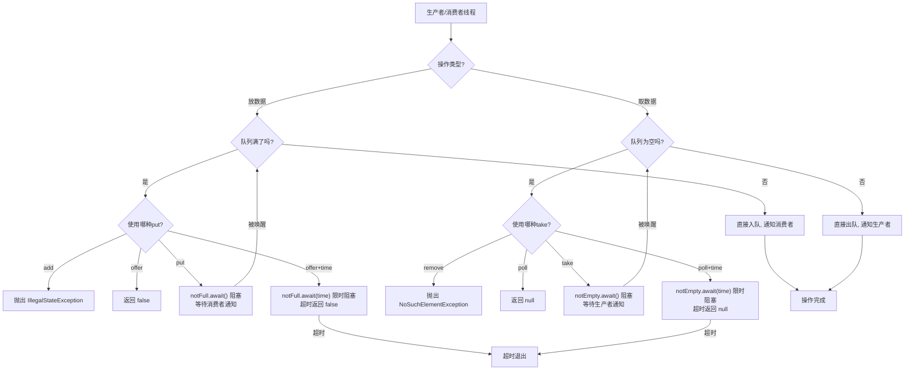

## 引言
最近一个月一直在更新《解读Java源码专栏》，其中跟大家一起剖析了Java的常见的5种阻塞队列，今天就盘点一下这几种阻塞队列的优缺点、区别，以及应用场景。

常见的阻塞队列有以下5种，下面会详细介绍。

- ArrayBlockingQueue

基于数组实现的阻塞队列，创建队列时需指定容量大小，是有界队列。

- LinkedBlockingQueue

基于链表实现的阻塞队列，默认是无界队列，创建可以指定容量大小

- SynchronousQueue

一种没有缓冲的阻塞队列，生产出的数据需要立刻被消费

- PriorityBlockingQueue

实现了优先级的阻塞队列，可以按照元素大小排序，是无界队列

- DelayQueue

实现了延迟功能的阻塞队列，基于PriorityQueue实现的，是无界队列
## BlockingQueue简介
这几种阻塞队列都实现了BlockingQueue接口，在日常开发中，我们好像很少用到`BlockingQueue（阻塞队列）`，`BlockingQueue`到底有什么作用？应用场景是什么样的？
如果使用过线程池或者阅读过线程池源码，就会知道线程池的核心功能都是基于`BlockingQueue`实现的。
大家用过消息队列（MessageQueue），就知道消息队列作用是解耦、异步、削峰。同样`BlockingQueue`的作用也是这三种，区别是`BlockingQueue`只作用于本机器，而消息队列相当于分布式`BlockingQueue`。

`BlockingQueue`作为阻塞队列，主要应用于生产者-消费者模式的场景，在并发多线程中尤其常用。

1. 比如像线程池中的任务调度场景，提交任务和拉取并执行任务。
2. 生产者与消费者解耦的场景，生产者把数据放到队列中，消费者从队列中取数据进行消费。两者进行解耦，不用感知对方的存在。
3. 应对突发流量的场景，业务高峰期突然来了很多请求，可以放到队列中缓存起来，消费者以正常的频率从队列中拉取并消费数据，起到削峰的作用。

`BlockingQueue`是个接口，定义了几组放数据和取数据的方法，来满足不同的场景。

| 操作 | 抛出异常 | 返回特定值 | 阻塞 | 阻塞一段时间 |
| --- | --- | --- | --- | --- |
| 放数据 | add() | offer() | put() | offer(e, time, unit) |
| 取数据（同时删除数据） | remove() | poll() | take() | poll(time, unit) |
| 取数据（不删除） | element() | peek() | 不支持 | 不支持 |

**这四组方法的区别是：**

1. 当队列满的时候，再次添加数据，add()会抛出异常，offer()会返回false，put()会一直阻塞，offer(e, time, unit)会阻塞指定时间，然后返回false。
2. 当队列为空的时候，再次取数据，remove()会抛出异常，poll()会返回null，take()会一直阻塞，poll(time, unit)会阻塞指定时间，然后返回null。

**阻塞队列的核心工作原理：**

## ArrayBlockingQueue

1. `ArrayBlockingQueue`底层基于数组实现，采用循环数组，提升了数组的空间利用率。
2. `ArrayBlockingQueue`初始化的时候，必须指定队列长度，是有界的阻塞队列，所以要预估好队列长度，保证生产者和消费者速率相匹配。
3. `ArrayBlockingQueue`的方法是线程安全的，使用`ReentrantLock`在操作前后加锁来保证线程安全。入队和出队共用一把锁。
4. 内部维护了`notEmpty`和`notFull`两个Condition，生产者用`notFull`等待，消费者用`notEmpty`通知。

## LinkedBlockingQueue

1. `LinkedBlockingQueue`底层基于链表实现，支持从头部弹出数据，从尾部添加数据。
2. `LinkedBlockingQueue`初始化的时候，如果不指定队列长度，默认长度是Integer最大值，相当于无界队列，有内存溢出风险，建议初始化的时候指定队列长度。
3. `LinkedBlockingQueue`的方法是线程安全的，分别使用了读写两把锁（`takeLock`和`putLock`），比`ArrayBlockingQueue`性能更好。入队和出队可以并发执行。
4. 内部也维护了两组Condition：`notEmpty`（配合`takeLock`）和`notFull`（配合`putLock`）。

与`ArrayBlockingQueue`区别是：

1. 底层结构不同，`ArrayBlockingQueue`底层基于数组实现，初始化的时候必须指定数组长度，无法扩容。`LinkedBlockingQueue`底层基于链表实现，链表最大长度是Integer最大值。
2. 占用内存大小不同，`ArrayBlockingQueue`一旦初始化，数组长度就确定了，不会随着元素增加而改变。`LinkedBlockingQueue`会随着元素越多，链表越长，占用内存越大。
3. 性能不同，`ArrayBlockingQueue`的入队和出队共用一把锁，并发较低。`LinkedBlockingQueue`入队和出队使用两把独立的锁，并发情况下性能更高。
4. 公平锁选项，`ArrayBlockingQueue`初始化的时候，可以指定使用公平锁或者非公平锁，公平锁模式下，可以按照线程等待的顺序来操作队列。`LinkedBlockingQueue`只支持非公平锁。
5. 适用场景不同，`ArrayBlockingQueue`适用于明确限制队列大小的场景，防止生产速度大于消费速度的时候，造成内存溢出、资源耗尽。`LinkedBlockingQueue`适用于业务高峰期可以自动扩展消费速度的场景。

## SynchronousQueue
无论是`ArrayBlockingQueue`还是`LinkedBlockingQueue`都是起到缓冲队列的作用，当消费者的消费速度跟不上时，任务就在队列中堆积，需要等待消费者慢慢消费。
如果我们想要自己的任务快速执行，不要积压在队列中，该怎么办？这时候就可以使用`SynchronousQueue`了。
`SynchronousQueue`被称为`同步队列`，当生产者往队列中放元素的时候，必须等待消费者把这个元素取走，否则一直阻塞。消费者取元素的时候，同理也必须等待生产者放队列中放元素。

1. `SynchronousQueue`底层有两种实现方式，分别是基于栈实现非公平策略（TransferStack/LIFO），以及基于队列实现的公平策略（TransferQueue/FIFO）。
2. `SynchronousQueue`初始化的时候，可以指定使用公平策略还是非公平策略，默认非公平。
3. `SynchronousQueue`不存储元素（容量始终为0），不适合作为缓存队列使用。适用于生产者与消费者速度相匹配的场景，可减少任务执行的等待时间。
4. `peek()` 始终返回 null，`isEmpty()` 始终返回 true，`size()` 始终返回 0——因为它从不保存元素。
5. Java 线程池`Executors.newCachedThreadPool()` 使用的就是 `SynchronousQueue`，适合大量短生命周期任务的场景。

## PriorityBlockingQueue

1. `PriorityBlockingQueue` 是真正实现了 `BlockingQueue` 接口的优先级阻塞队列，支持阻塞式 `take()` 和 `put()` 操作。
2. `PriorityBlockingQueue`底层基于数组实现，内部按照最小堆（min-heap）存储，实现了高效的插入和删除。
3. `PriorityBlockingQueue`初始化的时候，可以指定初始容量和自定义比较器。
4. `PriorityBlockingQueue`初始容量是11，当数组容量小于64时采用2倍扩容，否则采用1.5倍扩容。每次扩容使用 `Arrays.copyOf` 拷贝全部元素。
5. 每次 `take()` 都是从堆顶取元素（优先级最高），取之后需要执行 `heapify` 调整最小堆。
6. `put()` 方法不会阻塞（因为是无界队列，总可以扩容），但 `take()` 在队列为空时会阻塞等待。

## DelayQueue

`DelayQueue`是一种本地延迟队列，比如希望我们的任务在5秒后执行，就可以使用`DelayQueue`实现。常见的使用场景有：

- 订单10分钟内未支付，就取消。
- 缓存过期后，就删除。
- 消息的延迟发送等。

1. `DelayQueue`底层采用组合的方式，复用`PriorityQueue`的按照延迟时间排序任务的功能，实现了延迟队列。元素必须实现 `Delayed` 接口。
2. `DelayQueue`是线程安全的，内部使用`ReentrantLock`加锁。
3. `take()` 方法会检查堆顶元素的到期时间，如果未到期则通过 `Condition.awaitNanos()` 精确等待剩余时间，而不是忙等待轮询。
4. `put()` 方法不会阻塞（无界队列），直接入队后 `signal()` 唤醒等待的消费者。
5. 内部使用 **leader-follower 模式**优化等待：第一个等待的线程成为 leader 并计时，后续线程成为 follower 无限等待。leader 到期后释放，从 follower 中选一个新的 leader。

## 五种阻塞队列对比

| 特性 | ArrayBlockingQueue | LinkedBlockingQueue | SynchronousQueue | PriorityBlockingQueue | DelayQueue |
| --- | --- | --- | --- | --- | --- |
| 底层结构 | 循环数组 | 单向链表 | TransferStack/TransferQueue | 数组（最小堆） | 组合PriorityQueue |
| 有界/无界 | 有界（必须指定） | 有界（默认Integer.MAX_VALUE） | 有界（容量0） | 无界 | 无界 |
| 锁机制 | 一把锁（读写共用） | 两把锁（读写分离） | CAS + 自旋/阻塞 | 一把锁 | 一把锁 |
| 排序方式 | FIFO | FIFO | 无（直接传递） | 按元素优先级 | 按延迟到期时间 |
| put是否阻塞 | 是（队列满时） | 是（队列满时） | 是（无消费者时） | 否（无界） | 否（无界） |
| 内存占用 | 固定 | 随元素增长 | 几乎为零 | 随元素增长 | 随元素增长 |
| 公平性 | 可选 | 非公平 | 可选 | 非公平 | 非公平 |

### 关键操作时间复杂度对比

| 操作 | ArrayBlockingQueue | LinkedBlockingQueue | SynchronousQueue | PriorityBlockingQueue | DelayQueue |
| --- | --- | --- | --- | --- | --- |
| offer(e) | O(1) | O(1) | O(n) 最坏 | O(log n) | O(log n) |
| put(e) | O(1) 平均 | O(1) 平均 | O(n) 最坏 | O(log n) | O(log n) |
| take() | O(1) | O(1) | O(n) 最坏 | O(log n) | O(log n) |
| poll() | O(1) | O(1) | O(n) 最坏 | O(log n) | O(log n) |
| size() | O(1) | O(1) | 始终为 0 | O(1) | O(1) |

### 使用建议

1. **明确容量上限选 ArrayBlockingQueue**：当你知道系统能承载的最大队列深度时（比如防止内存溢出），使用 `ArrayBlockingQueue` 设定明确边界。适合资源受限、对内存敏感的场景。
2. **吞吐量优先选 LinkedBlockingQueue**：读写均衡的高并发场景下，两把锁的设计让入队和出队可以并行执行。但务必指定合理的容量上限，默认 `Integer.MAX_VALUE` 在极端情况下会导致 OOM。典型应用：日志系统、消息转发。
3. **零等待、直接交接选 SynchronousQueue**：不缓冲、不排队，生产者必须等待消费者接手。适合生产者与消费者速率基本匹配、追求最低延迟的场景。`Executors.newCachedThreadPool()` 的队列选型就是典型案例。
4. **按优先级消费选 PriorityBlockingQueue**：需要按重要性处理任务的场景，比如告警系统先处理高优先级告警。注意它是无界的，不会因队列满而阻塞 `put()`。
5. **延迟执行选 DelayQueue**：定时任务、过期清理、延迟取消等场景的首选。元素必须实现 `Delayed` 接口定义到期时间。内部 leader-follower 模式避免了无效的忙等待，CPU 占用低。