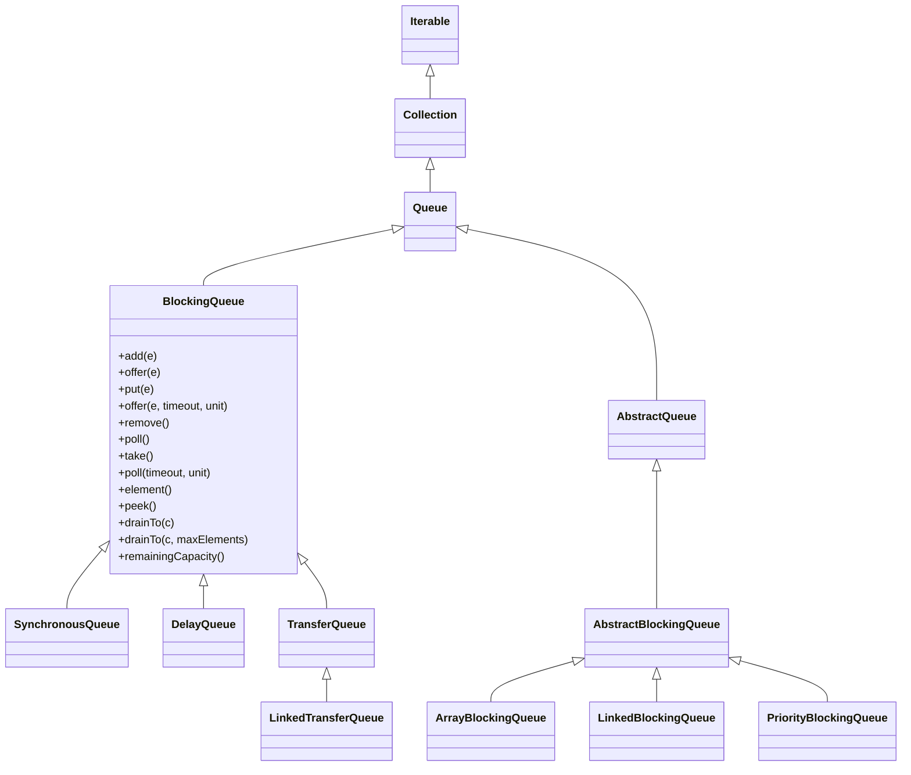
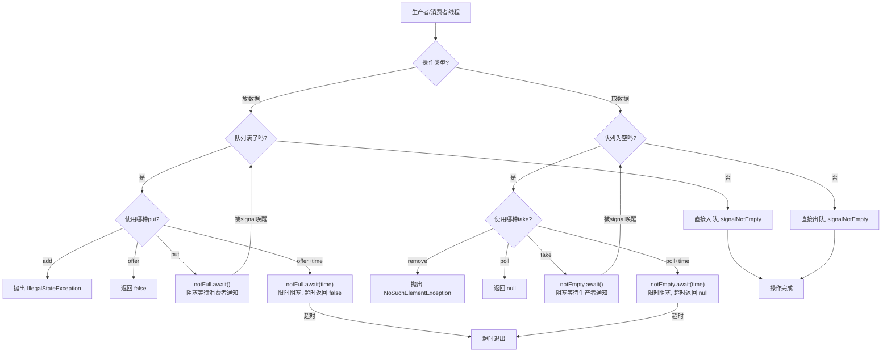
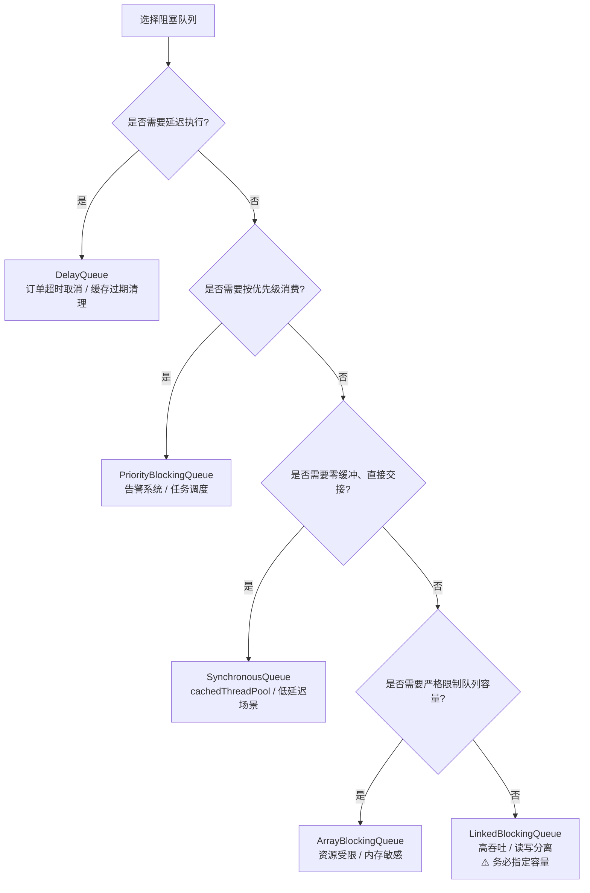

## 引言

同样是阻塞队列，选型错误可能导致 OOM 还是高性能？

Java 并发包提供了 5 种核心阻塞队列：`ArrayBlockingQueue`、`LinkedBlockingQueue`、`SynchronousQueue`、`PriorityBlockingQueue`、`DelayQueue`。它们的接口完全相同，但底层实现和性能特征天差地别：

- 用 `LinkedBlockingQueue` 不指定容量 → 生产高峰期 OOM
- 用 `SynchronousQueue` 搭配 `FixedThreadPool` → 线程池拒绝任务
- 用 `ArrayBlockingQueue` 搭配 `CachedThreadPool` → 失去弹性扩容能力

阻塞队列的本质是一个**本地版的 MessageQueue**：解耦生产者与消费者、缓冲突发流量、协调处理速率。区别在于它只作用于单台机器，而 MQ 是分布式的。选对队列，能让系统在高峰时保持稳定；选错队列，可能让原本健康的系统雪崩。

本文将从源码级别对比分析 5 种阻塞队列的核心差异，帮你建立清晰的选型决策树：

1. 每种队列的底层数据结构、锁机制、时间复杂度
2. `BlockingQueue` 接口的四组方法（add/offer/put/take）的行为差异
3. 生产者-消费者模式的 Condition 等待与唤醒机制
4. 5 种队列的完整对比表与场景选型指南

- **ArrayBlockingQueue**

  基于数组实现的阻塞队列，创建队列时需指定容量大小，是有界队列。

- **LinkedBlockingQueue**

  基于链表实现的阻塞队列，默认是无界队列，创建时可以指定容量大小。

- **SynchronousQueue**

  一种没有缓冲的阻塞队列，生产出的数据需要立刻被消费。

- **PriorityBlockingQueue**

  实现了优先级的阻塞队列，可以按照元素大小排序，是无界队列。

- **DelayQueue**

  实现了延迟功能的阻塞队列，基于 PriorityQueue 实现，是无界队列。

## BlockingQueue 简介

这几种阻塞队列都实现了 `BlockingQueue` 接口。在日常开发中，我们好像很少直接用到 `BlockingQueue（阻塞队列）`，它到底有什么作用？应用场景是什么样的？

如果使用过线程池或者阅读过线程池源码，就会知道线程池的核心功能都是基于 `BlockingQueue` 实现的。

大家用过消息队列（MessageQueue），就知道消息队列的作用是解耦、异步、削峰。同样 `BlockingQueue` 的作用也是这三种，区别是 `BlockingQueue` 只作用于本机器，而消息队列相当于分布式 `BlockingQueue`。

> **💡 核心提示**：可以把 `BlockingQueue` 理解为一个**本地进程内的 MessageQueue**。它不需要网络通信、不需要序列化，但正因如此，它只适用于单机场景。一旦需要跨机器解耦，就该上 Kafka/RocketMQ 了。

`BlockingQueue` 作为阻塞队列，主要应用于生产者-消费者模式的场景，在并发多线程中尤其常用。

1. **线程池任务调度**：提交任务和拉取并执行任务。
2. **生产者与消费者解耦**：生产者把数据放到队列中，消费者从队列中取数据进行消费，两者无需感知对方的存在。
3. **削峰填谷**：业务高峰期突然来了很多请求，可以放到队列中缓存起来，消费者以正常的频率从队列中拉取并消费数据。

`BlockingQueue` 继承了 `Queue` 接口，而 `Queue` 又继承了 `Collection` 接口。其类图关系如下：



`BlockingQueue` 接口定义了几组放数据和取数据的方法，来满足不同的场景。

| 操作 | 抛出异常 | 返回特定值 | 阻塞 | 阻塞一段时间 |
| --- | --- | --- | --- | --- |
| 放数据 | `add(e)` | `offer(e)` | `put(e)` | `offer(e, time, unit)` |
| 取数据（同时删除） | `remove()` | `poll()` | `take()` | `poll(time, unit)` |
| 取数据（不删除） | `element()` | `peek()` | 不支持 | 不支持 |

> **💡 核心提示**：这四组方法对应四种不同的**失败处理策略**：
> - **抛出异常族**（`add`/`remove`/`element`）：适合"断言式"编程，假设队列状态一定满足条件，否则立即暴露问题。
> - **返回特定值族**（`offer`/`poll`/`peek`）：适合"试探式"编程，不阻塞调用方，常用于轮询或非阻塞场景。
> - **阻塞族**（`put`/`take`）：适合"等待式"编程，生产者-消费者模型的标配，内部通过 `Condition.await()/signal()` 实现线程挂起与唤醒。
> - **限时阻塞族**（`offer(e,time,unit)`/`poll(time,unit)`）：适合"超时熔断"场景，避免无限期阻塞导致线程泄漏。

**阻塞队列的核心工作原理：**



## ArrayBlockingQueue

### 底层结构与核心机制

1. **底层基于定长数组实现**，采用循环数组（circular array），通过 `takeIndex` 和 `putIndex` 两个游标分别指向队头和队尾，数组首尾相接，提升了数组的空间利用率。
2. **必须指定队列长度**，是有界阻塞队列。初始化后无法扩容，需要预估好队列长度以保证生产者和消费者速率匹配。
3. **线程安全机制**：使用单个 `ReentrantLock`（`lock` 字段）在操作前后加锁。入队（`enqueue`）和出队（`dequeue`）共用同一把锁，因此入队和出队操作无法并发执行。

```java
// ArrayBlockingQueue 核心字段
final Object[] items;       // 存储元素的数组
int takeIndex;              // 下一次 take/poll/remove/element 的索引
int putIndex;               // 下一次 put/offer/add 的索引
int count;                  // 当前元素数量
final ReentrantLock lock;   // 全局独占锁
private final Condition notEmpty;  // 队列非空条件（消费者等待）
private final Condition notFull;   // 队列非满条件（生产者等待）
```

4. **Condition 机制**：内部维护了 `notEmpty` 和 `notFull` 两个 `Condition`（基于 AQS 的 `ConditionObject` 实现）。生产者执行 `put()` 时若队列满，调用 `notFull.await()` 挂起；消费者执行 `take()` 取出元素后，调用 `notFull.signal()` 唤醒等待的生产者。反之亦然。

### 关键方法源码剖析

**入队方法 `enqueue(e)`**：

```java
private void enqueue(E e) {
    final Object[] items = this.items;
    items[putIndex] = e;                          // 放入数组
    if (++putIndex == items.length) putIndex = 0; // 循环到数组头部
    count++;
    notEmpty.signal();                            // 唤醒一个等待的消费者
}
```

**出队方法 `dequeue()`**：

```java
private E dequeue() {
    final Object[] items = this.items;
    E e = (E) items[takeIndex];
    items[takeIndex] = null;                      // 置 null 帮助 GC
    if (++takeIndex == items.length) takeIndex = 0; // 循环到数组头部
    count--;
    notFull.signal();                             // 唤醒一个等待的生产者
    return e;
}
```

> **💡 核心提示**：注意 `dequeue()` 中 `items[takeIndex] = null` 这一行——这是 Java 集合类中常见的 **GC 友好设计**。如果不清空引用，即使元素已经被消费，数组仍然持有该对象的强引用，导致 GC 无法回收，在长时间运行的系统中会引发隐式内存泄漏。

### 时间复杂度

| 操作 | 时间复杂度 | 说明 |
| --- | --- | --- |
| `offer(e)` / `put(e)` | O(1) | 数组直接索引写入 |
| `take()` / `poll()` | O(1) | 数组直接索引读取 |
| `remove(o)` | O(n) | 需要遍历数组查找目标元素 |
| `contains(o)` | O(n) | 需要遍历数组 |
| `size()` | O(1) | 直接返回 `count` 字段 |

### 公平性选项

构造函数支持 `fair` 参数：

```java
public ArrayBlockingQueue(int capacity, boolean fair)
```

- `fair = true`：`ReentrantLock` 以 FIFO 顺序授予锁，保证线程按等待顺序获得执行权。但吞吐量会降低约 20%-30%。
- `fair = false`（默认）：非公平锁，吞吐量更高，但可能出现线程饥饿。

> **💡 核心提示**：绝大多数场景应该使用**默认的非公平锁**。公平锁虽然能保证顺序，但在高并发下会导致频繁的线程上下文切换，反而降低整体吞吐量。只有在严格需要保证"先来先服务"语义的场景下才开启公平锁。

## LinkedBlockingQueue

### 底层结构与核心机制

1. **底层基于单向链表实现**，每个节点是 `Node<E>` 内部类，`next` 指针指向下一个节点。支持从头部（`head.next`）弹出数据，从尾部（`last`）添加数据。
2. **默认容量为 `Integer.MAX_VALUE`**，如果不指定队列长度，相当于无界队列，存在 OOM 风险。**强烈建议初始化时指定合理的容量上限**。
3. **双锁设计**：分别使用 `takeLock`（读锁）和 `putLock`（写锁）两把独立的 `ReentrantLock`。入队和出队可以并发执行，相比 `ArrayBlockingQueue` 的单锁设计，吞吐量显著提升。

```java
// LinkedBlockingQueue 核心字段
static class Node<E> {
    E item;
    Node<E> next;
    Node(E x) { item = x; }
}

private final int capacity;         // 容量上限（默认 Integer.MAX_VALUE）
final AtomicInteger count;          // 元素数量（AtomicInteger 因为两把锁都要读写）
transient Node<E> head;             // 头哨兵节点
private transient Node<E> last;     // 尾节点
private final ReentrantLock takeLock;  // 取数据专用锁
private final Condition notEmpty;      // 配合 takeLock
private final ReentrantLock putLock;   // 放数据专用锁
private final Condition notFull;       // 配合 putLock
```

4. **为什么 `count` 用 `AtomicInteger`？** 因为 `takeLock` 和 `putLock` 是两把独立的锁，入队和出队操作会同时修改 `count`，使用 `AtomicInteger`（CAS 操作）可以避免引入第三把锁来保护计数器。

### 与 ArrayBlockingQueue 的深度对比

| 对比维度 | ArrayBlockingQueue | LinkedBlockingQueue |
| --- | --- | --- |
| **底层结构** | 定长循环数组 | 单向链表（Node 节点） |
| **初始化** | 必须指定容量，无法扩容 | 可不指定，默认 `Integer.MAX_VALUE` |
| **锁机制** | 单锁（`ReentrantLock` 读写共用） | 双锁（`takeLock` + `putLock` 读写分离） |
| **内存分配** | 初始化时一次性分配数组内存 | 每插入一个元素 new 一个 Node 对象 |
| **内存占用** | 固定，不随元素变化 | 随元素数量线性增长 |
| **GC 压力** | 低（数组已预先分配） | 高（频繁创建/回收 Node 对象） |
| **公平性** | 可配置（构造函数 `fair` 参数） | 仅支持非公平锁 |
| **吞吐量** | 较低（入队出队互斥） | 较高（入队出队可并行） |
| **适用场景** | 资源受限、需严格限制队列深度 | 高吞吐、读写均衡的并发场景 |

> **💡 核心提示**：`LinkedBlockingQueue` 的双锁设计看似完美，但有一个隐式代价——**每次入队都会 new 一个 Node 对象**。在极致高吞吐场景下（如每秒百万级消息），频繁的对象分配和 GC 可能成为瓶颈。如果已知容量上限，`ArrayBlockingQueue` 的预分配数组反而更高效。

## SynchronousQueue

无论是 `ArrayBlockingQueue` 还是 `LinkedBlockingQueue` 都起到缓冲队列的作用——当消费者消费速度跟不上时，任务就在队列中堆积。如果我们希望任务**快速执行、不要积压**，该怎么办？这时候就可以使用 `SynchronousQueue`。

`SynchronousQueue` 被称为**同步队列**或**零容量队列**。当生产者往队列中放元素时，必须等待消费者把这个元素取走，否则一直阻塞。消费者取元素时，同理也必须等待生产者放入元素。

### 底层实现：Transfer 机制

`SynchronousQueue` 的核心在于内部的 `Transferer` 抽象类，它有两种实现策略：

1. **TransferStack（非公平策略，LIFO）**：基于栈实现，默认模式。新来的线程可以尝试"匹配"栈顶的等待线程，匹配成功则直接交接数据并一起退出。LIFO 策略有利于刚到来的线程更可能还在 CPU 缓存中，减少上下文切换开销。
2. **TransferQueue（公平策略，FIFO）**：基于队列实现。按照线程到达顺序排队等待匹配，保证公平性。

```java
// SynchronousQueue 内部结构
abstract static class Transferer<E> {
    abstract E transfer(E e, boolean timed, long nanos);
}

// 构造函数中根据 fair 参数选择实现
public SynchronousQueue(boolean fair) {
    transferer = fair ? new TransferQueue<>() : new TransferStack<>();
}
```

### 核心特性

1. **容量始终为 0**：不存储任何元素。`peek()` 始终返回 `null`，`isEmpty()` 始终返回 `true`，`size()` 始终返回 `0`。
2. **`put(e)` = 阻塞式手递手交接**：生产者调用 `put(e)` 后，会阻塞直到有消费者调用 `take()` 取走该元素。
3. **初始化时可指定公平/非公平策略**，默认非公平（TransferStack）。
4. **线程池选型经典案例**：`Executors.newCachedThreadPool()` 使用的就是 `SynchronousQueue`。核心线程数为 0，最大线程数为 `Integer.MAX_VALUE`，空闲线程存活 60 秒。适合大量短生命周期任务的场景——新任务到来时，如果有空闲线程就复用，否则立即创建新线程。

### 时间复杂度

| 操作 | 时间复杂度 | 说明 |
| --- | --- | --- |
| `offer(e)` | O(1) ~ O(n) | 最佳情况立即匹配到消费者；最坏需遍历等待队列 |
| `put(e)` | O(1) ~ O(n) | 同上，但会阻塞直到匹配成功 |
| `take()` | O(1) ~ O(n) | 同上 |
| `poll()` | O(1) ~ O(n) | 不阻塞，找不到匹配者立即返回 null |

> **💡 核心提示**：`SynchronousQueue` 的本质不是"队列"，而是一个**线程间直接传递数据的通道（channel）**。它适用于生产者与消费者速率基本匹配、追求最低延迟的场景。如果生产速率远大于消费速率，会导致大量生产者线程阻塞甚至 OOM（线程数爆炸）。

## PriorityBlockingQueue

### 底层结构与核心机制

1. **真正实现了 `BlockingQueue` 接口的优先级阻塞队列**，支持阻塞式 `take()` 和 `put()` 操作。
2. **底层基于数组实现的最小堆（min-heap）**。堆顶始终是最小元素（优先级最高），内部使用 `siftUp()` 和 `siftDown()` 维护堆性质。
3. **无界队列**：`put()` 方法不会阻塞（因为总能扩容），但 `take()` 在队列为空时会阻塞等待。
4. **初始化时可指定初始容量和自定义 `Comparator`**。如果不提供 Comparator，元素必须实现 `Comparable` 接口。

```java
// PriorityBlockingQueue 核心字段
private transient Object[] queue;       // 堆数组
private transient int size;             // 元素个数
private transient ReentrantLock lock;   // 全局锁
private transient Condition notEmpty;   // 非空条件
private transient Comparator<? super E> comparator; // 比较器
```

### 扩容机制

这是 `PriorityBlockingQueue` 最容易被忽视的知识点：

- **默认初始容量为 11**。
- **当 `size < 64` 时，采用 2 倍扩容**：`newCapacity = oldCapacity * 2 + 2`。
- **当 `size >= 64` 时，采用 1.5 倍扩容**：`newCapacity = oldCapacity + (oldCapacity >> 1)`。
- 每次扩容使用 `Arrays.copyOf()` 拷贝全部元素，时间复杂度 O(n)。
- 如果扩容失败（达到 `MAX_ARRAY_SIZE`），会触发 `OutOfMemoryError`。

### 堆操作时间复杂度

| 操作 | 时间复杂度 | 说明 |
| --- | --- | --- |
| `offer(e)` / `add(e)` | O(log n) | 插入后执行 `siftUp()` 调整堆 |
| `put(e)` | O(log n) | 同 `offer()`，但不会阻塞 |
| `take()` | O(log n) | 取出堆顶后执行 `siftDown()` 调整堆 |
| `peek()` | O(1) | 直接返回 `queue[0]` |
| `remove(o)` | O(n) | 先线性查找，再调整堆 |

> **💡 核心提示**：`PriorityBlockingQueue` 的迭代器**不保证按优先级顺序遍历**。如果需要按序遍历，应该使用 `Arrays.sort(toArray())`。另外，由于它是无界的，在高吞吐写入场景下要警惕 OOM 风险——建议配合业务监控设置队列容量告警。

## DelayQueue

`DelayQueue` 是一种本地延迟队列，比如希望任务在 5 秒后执行，就可以使用它。常见的使用场景有：

- 订单 10 分钟内未支付，自动取消。
- 缓存过期后，自动清理。
- 消息的延迟发送。

### 底层结构与核心机制

1. **底层组合了 `PriorityQueue`**，复用其按延迟时间排序的功能。元素必须实现 `Delayed` 接口（`Delayed` 继承了 `Comparable`）。
2. **线程安全**：内部使用 `ReentrantLock` 加锁，所有公共方法都在 `lock.lock()` / `lock.unlock()` 之间执行。
3. **`put()` 不阻塞**（无界队列），直接入队后 `signal()` 唤醒等待的消费者。
4. **`take()` 精确等待**：检查堆顶元素的到期时间，如果未到期，则通过 `Condition.awaitNanos(remainingNanos)` 精确等待剩余时间，而不是忙等待轮询。

### Leader-Follower 模式优化

`DelayQueue` 内部使用了经典的 **Leader-Follower 模式**来优化等待效率：

```java
private Thread leader;  // 当前负责等待的线程
```

- **Leader**：第一个调用 `take()` 的线程成为 leader，它会精确等待到最近元素的到期时间。
- **Follower**：后续调用 `take()` 的线程成为 follower，无限期阻塞在 `notEmpty` 上。
- **交接**：leader 等待到期或超时后，将 `leader` 置为 `null`，然后 `signal()` 唤醒一个 follower。被唤醒的 follower 成为新的 leader，重新计算等待时间。

这种设计避免了所有等待线程同时超时醒来检查——**只有一个线程在计时等待，其余线程挂起不消耗 CPU**。

```java
// DelayQueue take() 方法核心逻辑（简化版）
public E take() throws InterruptedException {
    lock.lockInterruptibly();
    try {
        for (;;) {
            E first = q.peek();
            if (first == null) {
                notEmpty.await();                  // 队列为空，无限等待
            } else {
                long delay = first.getDelay(NANOSECONDS);
                if (delay <= 0) return q.poll();   // 已到期，直接返回
                first = null;                       // 等待期间不持有引用
                if (leader != null) {
                    notEmpty.await();               // 已有 leader，无限等待
                } else {
                    Thread thisThread = Thread.currentThread();
                    leader = thisThread;            // 成为 leader
                    try {
                        notEmpty.awaitNanos(delay); // 精确等待剩余时间
                    } finally {
                        if (leader == thisThread) leader = null;
                    }
                }
            }
        }
    } finally {
        if (leader == null && q.peek() != null) notEmpty.signal();
        lock.unlock();
    }
}
```

> **💡 核心提示**：Leader-Follower 模式是 `DelayQueue` 的精髓。如果所有等待线程都设置超时时间，会导致大量线程同时醒来但发现元素未到期，再次挂起——这就是**惊群效应**。通过指定唯一 leader，避免了无效的线程调度开销。

### 时间复杂度

| 操作 | 时间复杂度 | 说明 |
| --- | --- | --- |
| `offer(e)` / `put(e)` | O(log n) | PriorityQueue 的 `offer()` |
| `take()` | O(log n) | 到期后 `poll()` 调整堆 + 等待时间 |
| `peek()` | O(1) | 堆顶元素，不检查到期时间 |
| `remove(o)` | O(n) | 线性查找 + 堆调整 |

## 五种阻塞队列对比

### 核心特性对比

| 特性 | ArrayBlockingQueue | LinkedBlockingQueue | SynchronousQueue | PriorityBlockingQueue | DelayQueue |
| --- | --- | --- | --- | --- | --- |
| **底层结构** | 循环数组 | 单向链表 | TransferStack / TransferQueue | 数组（最小堆） | 组合 PriorityQueue |
| **有界/无界** | 有界（必须指定） | 有界（默认 `Integer.MAX_VALUE`） | 有界（容量 0） | 无界 | 无界 |
| **锁机制** | 一把锁（读写共用） | 两把锁（读写分离） | CAS + 自旋/阻塞 | 一把锁 | 一把锁 |
| **排序方式** | FIFO | FIFO | 无（直接传递） | 按元素优先级 | 按延迟到期时间 |
| **put 是否阻塞** | 是（队列满时） | 是（队列满时） | 是（无消费者时） | 否（无界） | 否（无界） |
| **内存占用** | 固定 | 随元素增长 | 几乎为零 | 随元素增长 | 随元素增长 |
| **公平性** | 可选 | 非公平 | 可选 | 非公平 | 非公平 |
| **GC 压力** | 低 | 高（频繁 new Node） | 极低 | 中 | 中 |

### 关键操作时间复杂度对比

| 操作 | ArrayBlockingQueue | LinkedBlockingQueue | SynchronousQueue | PriorityBlockingQueue | DelayQueue |
| --- | --- | --- | --- | --- | --- |
| `offer(e)` | O(1) | O(1) | O(1) ~ O(n) | O(log n) | O(log n) |
| `put(e)` | O(1) | O(1) | O(1) ~ O(n) | O(log n) | O(log n) |
| `take()` | O(1) | O(1) | O(1) ~ O(n) | O(log n) | O(log n) |
| `poll()` | O(1) | O(1) | O(1) ~ O(n) | O(log n) | O(log n) |
| `peek()` | O(1) | O(1) | 始终返回 null | O(1) | O(1) |
| `size()` | O(1) | O(1) | 始终为 0 | O(1) | O(1) |
| `remove(o)` | O(n) | O(n) | O(1)（无元素可删） | O(n) | O(n) |

## 生产环境避坑指南

以下是基于真实踩坑经验总结的 6 大常见陷阱：

### 1. LinkedBlockingQueue 未指定容量导致 OOM

**问题**：`new LinkedBlockingQueue()` 默认容量为 `Integer.MAX_VALUE`。如果生产者速率远大于消费者，队列会无限增长，最终耗尽堆内存。

**解决**：务必在初始化时指定合理容量：

```java
// 错误
BlockingQueue<Task> queue = new LinkedBlockingQueue<>();

// 正确
BlockingQueue<Task> queue = new LinkedBlockingQueue<>(10000);
```

### 2. ArrayBlockingQueue 容量预估不足导致生产者阻塞雪崩

**问题**：`ArrayBlockingQueue` 固定容量，如果设置过小，多个生产者线程同时调用 `put()` 会全部阻塞在 `notFull.await()` 上。在高并发场景下可能引发线程池耗尽。

**解决**：根据业务峰值 QPS 和平均处理时间计算合理容量，或使用 `offer(e, timeout, unit)` 替代 `put(e)`，避免无限期阻塞。

### 3. SynchronousQueue 搭配固定线程池导致任务被拒绝

**问题**：`SynchronousQueue` 容量为 0，如果线程池的核心线程已满且所有线程都在忙碌，新任务会立即被拒绝（`RejectedExecutionException`）。

**解决**：`SynchronousQueue` 只适合搭配 `newCachedThreadPool`（最大线程数无上限）。如果使用固定线程池，应选用 `LinkedBlockingQueue`。

### 4. PriorityBlockingQueue 元素未实现 Comparable 导致 ClassCastException

**问题**：添加元素时如果没有提供 `Comparator`，且元素类没有实现 `Comparable` 接口，运行时会抛出 `ClassCastException`。

**解决**：要么让元素类实现 `Comparable`，要么在构造函数中传入 `Comparator`：

```java
PriorityBlockingQueue<Order> queue =
    new PriorityBlockingQueue<>(16, Comparator.comparingInt(Order::getPriority));
```

### 5. DelayQueue 元素延迟时间计算错误导致任务永不执行

**问题**：`Delayed.getDelay()` 返回的是**剩余等待时间**（到期时间 - 当前时间）。如果实现时直接返回固定的延迟值而不是计算差值，会导致 `take()` 永远认为元素未到期。

**解决**：正确实现 `getDelay()` 方法：

```java
public long getDelay(TimeUnit unit) {
    long remaining = expireTime - System.nanoTime(); // 关键：计算差值
    return unit.convert(remaining, TimeUnit.NANOSECONDS);
}
```

### 6. drainTo() 方法的并发安全误区

**问题**：`drainTo(Collection)` 可以批量转移队列中的所有元素，但它**不是原子操作**。在转移过程中，其他线程可能同时修改队列。

**解决**：如果需要严格的一致性保证，应在调用 `drainTo()` 前后做好同步或使用本地副本。另外，`drainTo()` 不能将元素导入自身队列（会抛 `IllegalArgumentException`）。

### 7. 迭代遍历时 ConcurrentModificationException

**问题**：所有 BlockingQueue 实现都不保证遍历时的一致性。在遍历过程中如果有其他线程修改队列，可能抛出 `ConcurrentModificationException` 或看到不一致的数据。

**解决**：遍历时使用 `toArray()` 创建快照副本：

```java
for (Object item : queue.toArray()) {
    // 安全遍历
}
```

## 总结与使用建议

### 选型决策树



### 行动清单

1. **检查所有 `LinkedBlockingQueue` 的初始化**：确认生产环境中没有使用无参构造函数，务必指定合理的容量上限，防止 OOM。
2. **优先使用 `offer(e, timeout, unit)` 替代 `put(e)`**：限时阻塞比无限期阻塞更安全，可以避免线程泄漏和死锁风险。
3. **根据业务场景选择公平锁**：90% 的场景使用默认非公平锁即可获得最佳吞吐量；只有在需要严格保证"先来先服务"时才开启公平锁。
4. **监控队列深度指标**：对生产环境中的阻塞队列添加 `size()` 和 `remainingCapacity()` 的监控告警，队列持续满/持续空都是异常信号。
5. **SynchronousQueue 仅搭配缓存线程池使用**：不要在 `ThreadPoolExecutor` 的核心线程数固定且有限的场景使用 `SynchronousQueue`，否则新任务会被直接拒绝。
6. **DelayQueue 元素正确实现 `getDelay()`**：务必返回 `expireTime - System.nanoTime()` 的差值，而非固定延迟值；同时注意系统时钟跳变对 `System.currentTimeMillis()` 的影响，推荐使用 `System.nanoTime()`。
7. **PriorityBlockingQueue 注意 OOM 风险**：它是无界队列，在高吞吐写入场景下建议配合容量监控或在业务层主动限制大小。
8. **遍历时使用 `toArray()` 快照**：避免在迭代过程中因其他线程修改队列而引发 `ConcurrentModificationException`。

### 扩展阅读

- 《Java 并发编程实战》（Java Concurrency in Practice）第 5 章：构建块
- 《Java 核心技术 卷I》第 14 章：并发
- Doug Lea 的 `java.util.concurrent` 包设计论文：[http://gee.cs.oswego.edu/dl/papers/aqs.pdf](http://gee.cs.oswego.edu/dl/papers/aqs.pdf)
