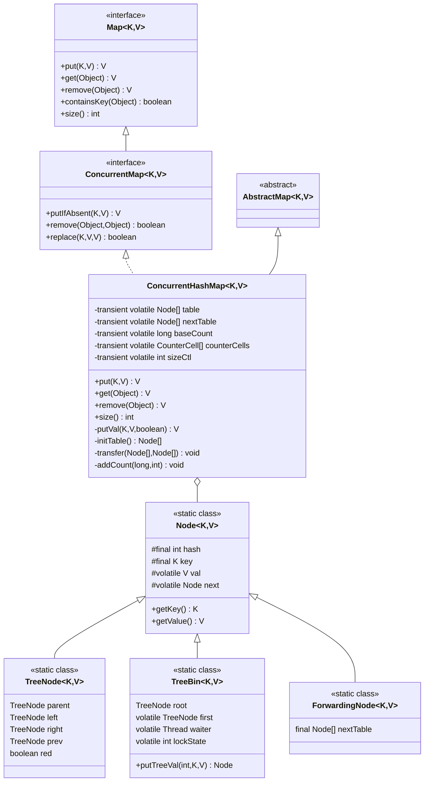
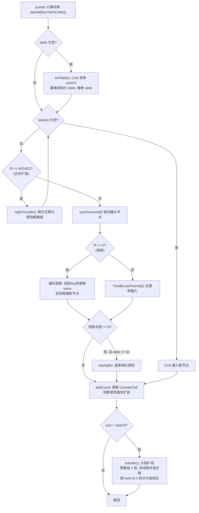
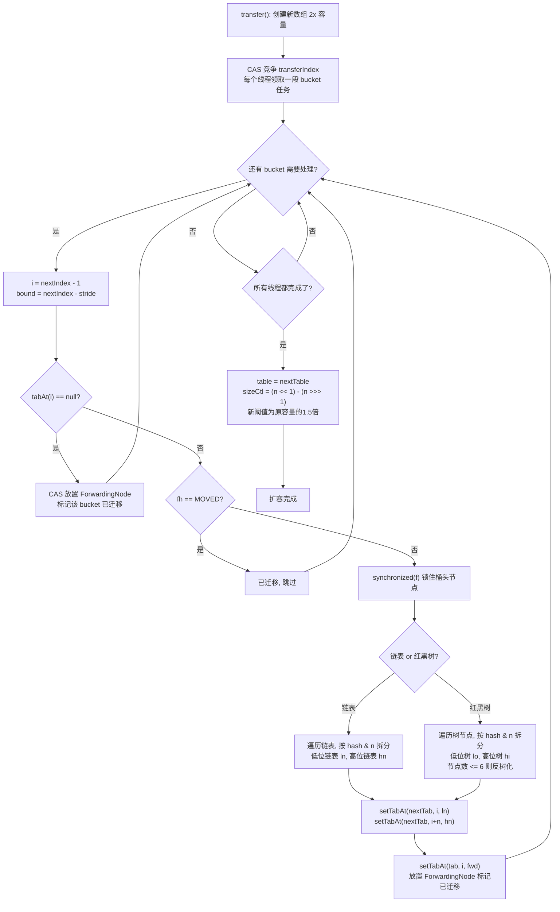

## 引言

HashMap 线程不安全会导致什么生产事故？

HashMap 线程不安全会导致什么生产事故？

在并发场景下，多个线程同时对 HashMap 进行 put 操作，可能导致数据丢失、死循环（Java 7 扩容时的链表成环）、甚至 CPU 100%。`ConcurrentHashMap` 正是为了解决这个问题而生。

但你知道 ConcurrentHashMap 是如何保证线程安全的吗？Java 7 的分段锁（Segment）和 Java 8 的桶级锁有什么本质区别？CAS + synchronized 的组合为什么能比 ReentrantLock 更高效？

本文将从源码级别深入剖析 ConcurrentHashMap 的并发控制机制，带你理解：

1. Java 8 如何从 Segment 分段锁演进为桶级 synchronized 锁
2. CAS + 自旋初始化的并发安全设计
3. 扩容时多线程如何协同迁移桶（transfer 方法）
4. 并发安全的 size 计算方法（CounterCell + @Contended 缓存行填充）

## 简介

ConcurrentHashMap跟HashMap一样的底层数据结构由数组、链表和红黑树组成，核心是基于数组实现的，为了解决哈希冲突，采用拉链法，于是引入了链表结构。为了解决链表过长，造成的查询性能下降，又引入了红黑树结构。

### 类图架构



### 核心工作原理



## 类结构

看一下`ConcurrentHashMap`类结构是什么样的：

1. `ConcurrentHashMap`跟HashMap一样，都是继承自AbstractMap，并实现了Map接口。`ConcurrentHashMap`实现的是ConcurrentMap接口，而ConcurrentMap接口继承自Map接口。所以`ConcurrentHashMap`跟HashMap拥有的方法是一样的，出现的地方可以相互替换。
2. 为什么`ConcurrentHashMap`不选择继承HashMap，在HashMap方法的基础上使用加锁保证线程安全？原因加锁的逻辑写在了方法里面，把方法切割了，并不是在方法前后加锁，所以只能重写。

```java
public class ConcurrentHashMap<K, V>
        extends AbstractMap<K, V>
        implements ConcurrentMap<K, V>, Serializable {

    /**
     * 数组最大容量
     */
    private static final int MAXIMUM_CAPACITY = 1 << 30;

    /**
     * 数组初始容量
     */
    private static final int DEFAULT_CAPACITY = 16;
    
    /**
     * 负载系数（保留常量，Java 8 实际使用 sizeCtl 控制扩容阈值）
     */
    private static final float LOAD_FACTOR = 0.75f;

    /**
     * 树化阈值（节点数超过阈值，需要把链表转换成红黑树）
     */
    static final int TREEIFY_THRESHOLD = 8;

    /**
     * 反树化阈值（当红黑树节点数量小于此阈值，重新转换成链表）
     */
    static final int UNTREEIFY_THRESHOLD = 6;

    /**
     * 转换成红黑树的最少元素数量
     */
    static final int MIN_TREEIFY_CAPACITY = 64;


    /*
     * 特殊节点的哈希值
     */
    static final int MOVED = -1; // 转移节点的哈希值
    static final int TREEBIN = -2; // 红黑树根节点的哈希值
    static final int RESERVED = -3; // 临时节点的哈希值

    /**
     * 节点数组
     */
    transient volatile Node<K, V>[] table;

    /**
     * 备用数组，用于扩容
     */
    private transient volatile Node<K, V>[] nextTable;

    /**
     * 元素个数的基准值（无并发竞争时使用）
     */
    private transient volatile long baseCount;

    /**
     * 并发计数单元数组（多线程竞争时使用，类似 LongAdder 的分段累加思想）
     * 总元素个数 = baseCount + 所有 counterCells 元素的累加和
     */
    private transient volatile CounterCell[] counterCells;

    /**
     * 表大小调整的控制变量
     * 1. -1：表示正在初始化
     * 2. 负数（非 -1）：表示正在扩容，值为 -(1 + 并发扩容的线程数)
     * 3. 0：默认值，表示尚未初始化
     * 4. 正数：表示扩容阈值（初始化为 0 时，第一次 put 后为 16）
     */
    private transient volatile int sizeCtl;

}
```

`ConcurrentHashMap`类里面的属性跟HashMap类似，但也有一些不同。

1. 链表与红黑树的相互转换，当链表长度大于等于TREEIFY_THRESHOLD（树化阈值，默认是8），并且数组大小大于等于MIN_TREEIFY_CAPACITY（默认是64），就会把链表转换成红黑树。当红黑树节点个数小于等于UNTREEIFY_THRESHOLD（反树化阈值，默认是6），就会把红黑树转换成链表。
2. 比如特殊节点的哈希值，MOVED(-1)、TREEBIN(-2)、RESERVED(-3)，都是负数。一般key的哈希值都是正数，`ConcurrentHashMap`把这些节点的哈希值设置成负数，表示这些节点正处于某种状态，相当于复用了节点的哈希值。
3. table数组用于存储元素节点，nextTable数组用在扩容期间临时存储元素。
4. `ConcurrentHashMap`并没有用于记录元素个数的size变量，而是使用baseCount和counterCells相加之和，计算元素数量。无竞争时通过CAS更新baseCount，有竞争时每个线程通过哈希映射到不同的CounterCell单元进行CAS累加。
5. 另外还有一个sizeCtl变量，负数时表示`ConcurrentHashMap`正在初始化或者扩容，正数时表示扩容的阈值，也是一物多用，大家在做架构时也可以参考这种设计。

除了这些基本属性外，`ConcurrentHashMap`还定义了4个节点内部类，分别是链表节点Node、红黑树节点TreeNode、管理红黑树的容器TreeBin、扩容时的临时转移节点ForwardingNode。

```java
public class ConcurrentHashMap<K, V>
        extends AbstractMap<K, V>
        implements ConcurrentMap<K, V>, Serializable {
    
    /**
     * 链表节点类
     */
    static class Node<K, V> implements Map.Entry<K, V> {
        final int hash;
        final K key;
        volatile V val;
        volatile Node<K, V> next;

        Node(int hash, K key, V val, Node<K, V> next) {
            this.hash = hash;
            this.key = key;
            this.val = val;
            this.next = next;
        }
    }

    /**
     * 红黑树节点类
     */
    static final class TreeNode<K, V> extends Node<K, V> {
        TreeNode<K, V> parent;
        TreeNode<K, V> left;
        TreeNode<K, V> right;
        TreeNode<K, V> prev;
        boolean red;

        TreeNode(int hash, K key, V val, Node<K, V> next,
                 TreeNode<K, V> parent) {
            super(hash, key, val, next);
            this.parent = parent;
        }
    }

    /**
     * 管理红黑树的容器
     */
    static final class TreeBin<K, V> extends Node<K, V> {
        TreeNode<K, V> root;
        volatile TreeNode<K, V> first;
        volatile Thread waiter;
        volatile int lockState;
    }

    /**
     * 转移节点（扩容时使用）
     */
    static final class ForwardingNode<K, V> extends Node<K, V> {
        final Node<K, V>[] nextTable;

        ForwardingNode(Node<K, V>[] tab) {
            super(MOVED, null, null, null);
            this.nextTable = tab;
        }
    }

}
```

### 关键机制补充

**spread() 哈希预处理方法：**

`ConcurrentHashMap` 没有直接使用 key 的 `hashCode()`，而是通过 `spread()` 方法预处理：

```java
static final int spread(int h) {
    return (h ^ (h >>> 16)) & HASH_BITS;
}
```

这个方法做了两件事：
1. **高位参与运算**：将哈希值右移 16 位后与原值异或，让高 16 位也参与下标计算。由于数组长度通常较小（如 16、32），`(n-1) & hash` 只用到 hash 的低位。如果高位差异大但低位相同，容易冲突。spread() 让高位信息也混入低位。
2. **掩码过滤**：`& HASH_BITS`（0x7fffffff）确保结果为正数，排除负数哈希值（负数用于表示特殊节点）。

> **💡 核心提示**：Java 8 的 `HashMap` 也使用了完全相同的 `spread()` 算法。这说明 JDK 团队对哈希扰动函数的设计非常重视——即使 key 的 `hashCode()` 低位碰撞严重（如连续的 Integer），经过 spread() 处理后也能均匀分布到各个桶中。

**CounterCell 并发计数机制：**

`ConcurrentHashMap` 没有使用传统的 `size` 变量，而是采用类似 `LongAdder` 的分段累加思想：

```java
private transient volatile long baseCount;
private transient volatile CounterCell[] counterCells;
```

- **无竞争时**：直接通过 CAS 更新 `baseCount`。
- **有竞争时**：CAS 更新 `baseCount` 失败，则创建 `CounterCell[]` 数组，每个线程通过哈希映射到不同的 `CounterCell` 单元进行 CAS 累加，最后 `size()` 返回 `baseCount + 所有 CounterCell 的 value 之和`。

这种设计大幅减少了多线程下的 CAS 竞争，提升了高并发场景下 `put()` 和 `size()` 的性能。

> **💡 核心提示**：CounterCell 类使用了 `@sun.misc.Contended` 注解，这是一个**缓存行填充**（cache line padding）注解。它确保每个 CounterCell 对象独占一个缓存行（通常 64 字节），避免了**伪共享**（false sharing）问题——即两个线程操作的不同变量恰好在同一个缓存行中，导致 CPU 缓存失效。这是 JDK 并发包中一个非常底层但精妙的优化。

**为什么有两个空数组？**

跟 `ArrayList` 类似，`ConcurrentHashMap` 也使用懒加载：初始化时不创建数组，第一次 `put()` 时才通过 `initTable()` 初始化。`table` 初始为 `null`，通过 `sizeCtl` 控制初始容量。

## 初始化

`ConcurrentHashMap`常见的构造方法有四个：

1. 无参构造方法
2. 指定容量大小的构造方法
3. 指定容量大小、负载系数的构造方法
4. 指定容量大小、负载系数、并发度的构造方法

```java
/**
 * 无参初始化
 */
Map<Integer, Integer> map1 = new ConcurrentHashMap<>();

/**
 * 指定容量大小的初始化
 */
Map<Integer, Integer> map2 = new ConcurrentHashMap<>(16);

/**
 * 指定容量大小、负载系数的初始化
 */
Map<Integer, Integer> map3 = new ConcurrentHashMap<>(16, 0.75f);

/**
 * 指定容量大小、负载系数、并发度的初始化
 */
Map<Integer, Integer> map4 = new ConcurrentHashMap<>(16, 0.75f, 1);
```

再看一下对应的构造方法的源码实现：

```java
/**
 * 无参初始化
 */
public ConcurrentHashMap() {
}

/**
 * 指定容量大小的初始化
 */
public ConcurrentHashMap(int initialCapacity) {
    if (initialCapacity < 0) {
        throw new IllegalArgumentException();
    }
    // 计算合适的初始容量（必须是2的倍数）
    int cap = ((initialCapacity >= (MAXIMUM_CAPACITY >>> 1)) ?
            MAXIMUM_CAPACITY :
            tableSizeFor(initialCapacity + (initialCapacity >>> 1) + 1));
    this.sizeCtl = cap;
}

/**
 * 指定容量大小、负载系数的初始化
 */
public ConcurrentHashMap(int initialCapacity, float loadFactor) {
    // 调用下面的构造方法，并发度默认是1
    this(initialCapacity, loadFactor, 1);
}

/**
 * 指定容量大小、负载系数、并发度的初始化
 */
public ConcurrentHashMap(int initialCapacity, float loadFactor, int concurrencyLevel) {
    if (!(loadFactor > 0.0f) || initialCapacity < 0 || concurrencyLevel <= 0) {
        throw new IllegalArgumentException();
    }
    if (initialCapacity < concurrencyLevel) {
        initialCapacity = concurrencyLevel;
    }
    // 计算合适的初始容量（必须是2的倍数）
    long size = (long) (1.0 + (long) initialCapacity / loadFactor);
    int cap = (size >= (long) MAXIMUM_CAPACITY) ?
            MAXIMUM_CAPACITY : tableSizeFor((int) size);
    this.sizeCtl = cap;
}
```

可以看出`ConcurrentHashMap`跟HashMap一样，初始化的时候并没有初始化数组table，只是记录了数组的大小sizeCtl，sizeCtl的大小必须是2的倍数，原因是可以使用与运算计算key所在数组下标位置，比求余更快。

> **💡 核心提示**：构造方法中 `initialCapacity + (initialCapacity >>> 1) + 1` 的计算是为了考虑负载系数 0.75。如果用户传入期望容量 N，实际需要的数组大小应该能容纳 N / 0.75 个元素，即大约 N * 1.33。这里用 N + N/2 + 1 ≈ N * 1.5 来近似，再通过 `tableSizeFor()` 取最近的 2 的幂次。

如果再有面试官问你，`ConcurrentHashMap`初始化的时候数组大小是多少？答案是0，因为`ConcurrentHashMap`初始化的时候，并没有初始化数组，而是在第一次调用`put()`方法时，才初始化数组。

## put源码

再看一下put()方法的源码实现，还是比较复杂的。

```java
/**
 * put 方法入口
 */
public V put(K key, V value) {
    // 调用实际的put方法逻辑
    return putVal(key, value, false);
}

/**
 * 实际的put方法逻辑
 *
 * @param key          键
 * @param value        值
 * @param onlyIfAbsent onlyIfAbsent 如果为true，则只有当key不存在时才会put
 * @return 返回旧值（如果不存在，返回null）
 */
final V putVal(K key, V value, boolean onlyIfAbsent) {
    // 判空，不允许key或者value为空
    if (key == null || value == null) {
        throw new NullPointerException();
    }
    // 1. 计算哈希值
    int hash = spread(key.hashCode());
    int binCount = 0;
    // 2. 循环遍历数组
    for (Node<K, V>[] tab = table; ; ) {
        Node<K, V> f;
        int n, i, fh;
        // 3. 判断如果数组为空，就执行初始化操作
        if (tab == null || (n = tab.length) == 0) {
            tab = initTable();
        } else if ((f = tabAt(tab, i = (n - 1) & hash)) == null) {
            // 4. 如果key对应下标位置元素不存在，直接插入即可
            if (casTabAt(tab, i, null, new Node<K, V>(hash, key, value, null))) {
                break;
            }
        } else if ((fh = f.hash) == MOVED) {
            // 5. 判断如果当前节点哈希值等于MOVED（表示正在扩容），就帮忙扩容
            tab = helpTransfer(tab, f);
        } else {
            // 6. 如果下标位置不为空，先锁住当前节点
            V oldVal = null;
            synchronized (f) {
                // 7. 再次检查当前节点是否被修改过
                if (tabAt(tab, i) == f) {
                    // 8. 判断当前节点哈希值，如果大于0，表示是链表
                    if (fh >= 0) {
                        binCount = 1;
                        // 9. 循环遍历链表
                        for (Node<K, V> e = f; ; ++binCount) {
                            K ek;
                            // 10. 如果找到相同的key，直接返回
                            if (e.hash == hash &&
                                    ((ek = e.key) == key ||
                                            (ek != null && key.equals(ek)))) {
                                oldVal = e.val;
                                if (!onlyIfAbsent) {
                                    e.val = value;
                                }
                                break;
                            }
                            Node<K, V> pred = e;
                            // 11. 如果遍历结束了还没找到，就创建新节点，追加到链表末尾
                            if ((e = e.next) == null) {
                                pred.next = new Node<K, V>(hash, key,
                                        value, null);
                                break;
                            }
                        }
                    } else if (f instanceof TreeBin) {
                        // 12. 判断如果当前节点是红黑树，就执行红黑树的插入逻辑
                        Node<K, V> p;
                        binCount = 2;
                        if ((p = ((TreeBin<K, V>) f).putTreeVal(hash, key, value)) != null) {
                            oldVal = p.val;
                            if (!onlyIfAbsent) {
                                p.val = value;
                            }
                        }
                    }
                }
            }
            // 13. binCount不等于0，表示插入了新节点
            if (binCount != 0) {
                // 14. 如果binCount大于树化阈值，就把链表转换成红黑树
                if (binCount >= TREEIFY_THRESHOLD) {
                    treeifyBin(tab, i);
                }
                if (oldVal != null) {
                    return oldVal;
                }
                break;
            }
        }
    }
    // 15. 添加计数器，并判断是否需要扩容
    addCount(1L, binCount);
    return null;
}
```

put()的源码虽然很长，但是逻辑很清晰，主要步骤如下：

1. 先计算key的哈希值。
2. 然后使用死循环遍历数组，保证put操作必须成功。
3. 判断数组是否为空，如果为空，就执行初始化数组的操作，这时候才进行数组初始化。
4. 如果数组不为空，就计算key所在的数组下标位置，也就是使用哈希值对`数组长度-1`进行与运算，`((n - 1) & hash)`,相当于对`数组长度-1`求余，这就是为什么要求数组长度必须是2的倍数。如果数组下标位置为空，直接插入元素即可，使用CAS保证插入成功。
5. 判断如果当前节点哈希值等于MOVED（-1，表示正在扩容），就帮忙扩容。
6. 如果下标位置不为空，使用synchronized锁住当前节点，防止其他线程并发修改。
7. 再次检查当前节点是否被修改过（双检锁，配合synchronized使用，防止加锁之前刚好被修改）。
8. 判断当前节点哈希值，如果大于0，表示是链表
9. 循环遍历链表
10. 如果在链表中找到相同的key，直接返回
11. 如果遍历链表结束了还没找到，就创建新节点，并追加到链表末尾。
12. 判断如果当前节点类型是红黑树，就执行红黑树的插入逻辑。
13. 如果插入了新节点，就判断链表长度，是否转换成红黑树。
14. 如果链表长度大于等于树化阈值，就把链表转换成红黑树
15. 把本次操作添加到元素计数器中，并判断是否需要扩容，如果需要则执行扩容逻辑。

### 初始化数组

再看一下put方法中第一次初始化数组的时候，需要执行哪些逻辑。

```java
/**
 * 初始化数组
 */
private final Node<K, V>[] initTable() {
    Node<K, V>[] tab;
    int sc;
     // 1. 使用自旋保证初始化成功
    while ((tab = table) == null || tab.length == 0) {
        // 2. 如果sizeCtl小于零，表示有其他线程正在执行初始化，则让出CPU调度权
        if ((sc = sizeCtl) < 0) {
            Thread.yield();
        } else if (U.compareAndSwapInt(this, SIZECTL, sc, -1)) {
            // 3. 使用CAS更新sizeCtl值为-1，表示正在初始化
            try {
                // 4. 再次检查数组是否为空
                if ((tab = table) == null || tab.length == 0) {
                    // 5. 执行初始化数组，容量为默认容量16
                    int n = (sc > 0) ? sc : DEFAULT_CAPACITY;
                    Node<K, V>[] nt = (Node<K, V>[]) new Node<?, ?>[n];
                    table = tab = nt;
                    sc = n - (n >>> 2);
                }
            } finally {
                sizeCtl = sc;
            }
            break;
        }
    }
    return tab;
}
```

可以看到初始化数组的时候，充分考虑了并发的情况，如果一个正在执行初始化数组操作，其他线程该怎么办？

首先使用while死循环保证可以初始化成功，然后判断`sizeCtl`大小，如果小于零，表示其他线程正在执行初始化，则调用`Thread.yield()`让出CPU调度权，而获得CPU调度权线程使用CAS把sizeCtl设置成-1，最后使用双重检查锁，并初始化数组容量是默认大小16。

> **💡 核心提示**：`initTable()` 使用 CAS + 自旋代替锁，是一个**无锁化并发**的经典实现。多个线程同时竞争初始化权时，只有一个 CAS 成功，其他线程通过 `Thread.yield()` 礼让后继续检查 `table` 是否已被初始化，避免了阻塞开销。

### 扩容

再看一下put源码中核心逻辑 —— 扩容。

扩容的源码设计，扩容方法非常长，100多行，看得人头都大了。没有任何注释，而且变量名起的非常随意，非常简化，简化的让人不知道啥意思，比如tab、nexttn、fwd、ln、hn等，无法见文知意。

但是再难，咱们也要把源码这块硬骨头啃下来。阅读源码的技巧就是：
阅读源码的技巧就是，先整体后局部，先理论后细节。不要一上来就陷入细节中不能自拔，有些细枝末节可以跳过。
阅读扩容源码的过程就是这样，掌握大致流程即可，部分细节可以跳过，感兴趣的再私下研究。

### 扩容流程图



**扩容的流程用一句话概括就是：**先创建一个新数组，然后遍历原数组，拷贝元素到新数组中，最后把新数组直接赋值给原数组。

**扩容具体流程如下：**

1. 创建一个新数组，容量是原数组的2倍
2. 遍历原数组，从后向前遍历。
3. 每遍历一个元素，就使用`synchronized`锁住当前下标位置节点，防止其他线程修改。
4. 如果当前下标节点是链表，就执行链表的拷贝方法。如果是红黑树，就执行红黑树的拷贝方法。
5. 把元素拷贝到新数组后，再把原数组下标位置设置成转移节点类型ForwardingNode
6. 遍历完成后，直接把新数组直接赋值给原数组。

```java
/**
 * 扩容方法
 *
 * @param tab     元素数组
 * @param nextTab 临时数组（用来临时存储扩容后的元素），此时传参为null
 */
private final void transfer(Node<K, V>[] tab, Node<K, V>[] nextTab) {
    int n = tab.length, stride;
    if ((stride = (NCPU > 1) ? (n >>> 3) / NCPU : n) < MIN_TRANSFER_STRIDE) {
        stride = MIN_TRANSFER_STRIDE;
    }
    // 1. 初始化临时数组，容量是原数组的2倍
    if (nextTab == null) {
        try {
            Node<K, V>[] nt = (Node<K, V>[]) new Node<?, ?>[n << 1];
            nextTab = nt;
        } catch (Throwable ex) {
            sizeCtl = Integer.MAX_VALUE;
            return;
        }
        nextTable = nextTab;
        transferIndex = n;
    }
    int nextn = nextTab.length;
    ForwardingNode<K, V> fwd = new ForwardingNode<K, V>(nextTab);
    boolean advance = true;
    boolean finishing = false;
    // 2. 循环遍历原数组，并将元素拷贝临时数组
    for (int i = 0, bound = 0; ; ) {
        Node<K, V> f;
        int fh;
        while (advance) {
            int nextIndex, nextBound;
            if (--i >= bound || finishing) {
                advance = false;
            } else if ((nextIndex = transferIndex) <= 0) {
                i = -1;
                advance = false;
            } else if (U.compareAndSwapInt
                    (this, TRANSFERINDEX, nextIndex,
                            nextBound = (nextIndex > stride ?
                                    nextIndex - stride : 0))) {
                bound = nextBound;
                // 3. 从后向前遍历
                i = nextIndex - 1;
                advance = false;
            }
        }
        if (i < 0 || i >= n || i + n >= nextn) {
            int sc;
            if (finishing) {
                nextTable = null;
                // 4. 遍历完成后，将临时数组赋值给原数组
                table = nextTab;
                sizeCtl = (n << 1) - (n >>> 1);
                return;
            }
            if (U.compareAndSwapInt(this, SIZECTL, sc = sizeCtl, sc - 1)) {
                if ((sc - 2) != resizeStamp(n) << RESIZE_STAMP_SHIFT) {
                    return;
                }
                finishing = advance = true;
                i = n;
            }
        } else if ((f = tabAt(tab, i)) == null) {
            advance = casTabAt(tab, i, null, fwd);
        } else if ((fh = f.hash) == MOVED) {
            advance = true;
        } else {
            // 5. 锁住当前下标位置节点，防止其他线程修改
            synchronized (f) {
                if (tabAt(tab, i) == f) {
                    // 6. 哈希值大于0，表示是链表，就执行链表的拷贝方式（拆分成低位链表ln和高位链表hn）
                    Node<K, V> ln, hn;
                    if (fh >= 0) {
                        int runBit = fh & n;
                        Node<K, V> lastRun = f;
                        for (Node<K, V> p = f.next; p != null; p = p.next) {
                            int b = p.hash & n;
                            if (b != runBit) {
                                runBit = b;
                                lastRun = p;
                            }
                        }
                        if (runBit == 0) {
                            ln = lastRun;
                            hn = null;
                        } else {
                            hn = lastRun;
                            ln = null;
                        }
                        for (Node<K, V> p = f; p != lastRun; p = p.next) {
                            int ph = p.hash;
                            K pk = p.key;
                            V pv = p.val;
                            if ((ph & n) == 0) {
                                ln = new Node<K, V>(ph, pk, pv, ln);
                            } else {
                                hn = new Node<K, V>(ph, pk, pv, hn);
                            }
                        }
                        // 7. 将低位链表和高位链表拷贝到临时数组，
                        // 并把原数组的下标位置设置成转移节点ForwardingNode
                        setTabAt(nextTab, i, ln);
                        setTabAt(nextTab, i + n, hn);
                        setTabAt(tab, i, fwd);
                        advance = true;
                    } else if (f instanceof TreeBin) {
                        // 8. 如果节点类型是红黑树，就执行红黑树的拷贝方式，跟链表一样，拆分成低位红黑树和高位红黑树
                        TreeBin<K, V> t = (TreeBin<K, V>) f;
                        TreeNode<K, V> lo = null, loTail = null;
                        TreeNode<K, V> hi = null, hiTail = null;
                        int lc = 0, hc = 0;
                        for (Node<K, V> e = t.first; e != null; e = e.next) {
                            int h = e.hash;
                            TreeNode<K, V> p = new TreeNode<K, V>
                                    (h, e.key, e.val, null, null);
                            if ((h & n) == 0) {
                                if ((p.prev = loTail) == null) {
                                    lo = p;
                                } else {
                                    loTail.next = p;
                                }
                                loTail = p;
                                ++lc;
                            } else {
                                if ((p.prev = hiTail) == null) {
                                    hi = p;
                                } else {
                                    hiTail.next = p;
                                }
                                hiTail = p;
                                ++hc;
                            }
                        }
                        ln = (lc <= UNTREEIFY_THRESHOLD) ? untreeify(lo) :
                                (hc != 0) ? new TreeBin<K, V>(lo) : t;
                        hn = (hc <= UNTREEIFY_THRESHOLD) ? untreeify(hi) :
                                (lc != 0) ? new TreeBin<K, V>(hi) : t;
                        // 9. 将低位红黑树和高位红黑树拷贝到临时数组，
                        // 并把原数组的下标位置设置成转移节点ForwardingNode
                        setTabAt(nextTab, i, ln);
                        setTabAt(nextTab, i + n, hn);
                        setTabAt(tab, i, fwd);
                        advance = true;
                    }
                }
            }
        }
    }
}
```

> **💡 核心提示**：扩容时链表拆分为高低位链表的原理——数组扩容为2倍后，新数组下标 = `(n-1) & hash`。因为 `n` 变成了 `2n`，多了一个二进制位参与运算。每个节点只需要检查新增的那一位（`hash & n`）是0还是1，为0的留在原位置，为1的迁移到 `原位置 + n`。这个巧妙的位运算避免了重新计算哈希值，将元素迁移降到了最低成本。

如果不去揪住源码的细节不放，扩容逻辑也是很简单的。

## get源码

看一下get方法源码，跟前面相比，就比较简单了。

```java
/**
 * get方法入口
 */
public V get(Object key) {
    Node<K, V>[] tab;
    Node<K, V> e, p;
    int n, eh;
    K ek;
    // 1. 计算哈希值
    int h = spread(key.hashCode());
    // 2. 判断如果数组不为空，下标位置也不为空，就进行查找
    if ((tab = table) != null && (n = tab.length) > 0 &&
            (e = tabAt(tab, (n - 1) & h)) != null) {
        // 3. 如果找到对应的key，直接返回
        if ((eh = e.hash) == h) {
            if ((ek = e.key) == key || (ek != null && key.equals(ek))) {
                return e.val;
            }
        } else if (eh < 0) {
            // 4. 如果哈希值小于0，表示是转移节点或者红黑树，则执行特殊查找逻辑
            return (p = e.find(h, key)) != null ? p.val : null;
        }
        // 5. 否则是链表，则循环遍历链表
        while ((e = e.next) != null) {
            if (e.hash == h && ((ek = e.key) == key || (ek != null && key.equals(ek)))) {
                return e.val;
            }
        }
    }
    return null;
}
```

**为什么 get() 不需要加锁？**

`ConcurrentHashMap` 的 `get()` 方法全程无锁，原因在于：
1. `table` 数组引用使用 `volatile` 修饰，保证扩容时新数组对所有线程立即可见。
2. 链表节点的 `val` 和 `next` 字段也使用 `volatile` 修饰（见 Node 内部类定义），保证其他线程的修改可见。
3. `get()` 读取的是某个时刻的快照，即使读取过程中其他线程正在修改，也不会导致数据不一致——这是弱一致性语义的体现，以性能换强一致性。

## remove源码

再看一下remove方法源码，大致跟HashMap差不多，就是遍历链表和红黑树。

```java
/**
 * 删除方法入口
 */
public V remove(Object key) {
    // 调用替换节点的方法
    return replaceNode(key, null, null);
}

/**
 * 替换节点（只是把节点值替换成null，并不删除节点）
 */
final V replaceNode(Object key, V value, Object cv) {
    // 1. 计算哈希值
    int hash = spread(key.hashCode());
    // 2. 遍历数组
    for (Node<K, V>[] tab = table; ; ) {
        Node<K, V> f;
        int n, i, fh;
        // 3. 如果数组为空，或者数组所在下标位置为null，则退出
        if (tab == null || (n = tab.length) == 0 ||
                (f = tabAt(tab, i = (n - 1) & hash)) == null) {
            break;
        } else if ((fh = f.hash) == MOVED) {
            // 4. 判断如果当前节点哈希值等于MOVED（表示正在扩容），就帮忙扩容
            tab = helpTransfer(tab, f);
        } else {
            V oldVal = null;
            boolean validated = false;
            // 5. 如果下标位置不为空，先锁住当前节点
            synchronized (f) {
                // 6. 再次检查当前节点是否被修改过
                if (tabAt(tab, i) == f) {
                    // 7. 判断当前节点哈希值，如果大于0，表示是链表
                    if (fh >= 0) {
                        validated = true;
                        // 8. 循环遍历链表
                        for (Node<K, V> e = f, pred = null; ; ) {
                            K ek;
                            // 9. 如果找到相同的key，就重置value值
                            if (e.hash == hash &&
                                    ((ek = e.key) == key || (ek != null && key.equals(ek)))) {
                                V ev = e.val;
                                if (cv == null || cv == ev || (ev != null && cv.equals(ev))) {
                                    oldVal = ev;
                                    if (value != null) {
                                        e.val = value;
                                    } else if (pred != null) {
                                        pred.next = e.next;
                                    } else {
                                        setTabAt(tab, i, e.next);
                                    }
                                }
                                break;
                            }
                            pred = e;
                            // 10. 如果遍历结束了还没找到，就退出
                            if ((e = e.next) == null) {
                                break;
                            }
                        }
                    } else if (f instanceof TreeBin) {
                        // 11. 判断如果当前节点是红黑树，就执行红黑树的遍历逻辑
                        validated = true;
                        TreeBin<K, V> t = (TreeBin<K, V>) f;
                        TreeNode<K, V> r, p;
                        if ((r = t.root) != null &&
                                (p = r.findTreeNode(hash, key, null)) != null) {
                            V pv = p.val;
                            // 12. 如果找到相同的key，就重置value值
                            if (cv == null || cv == pv || (pv != null && cv.equals(pv))) {
                                oldVal = pv;
                                if (value != null) {
                                    p.val = value;
                                } else if (t.removeTreeNode(p)) {
                                    setTabAt(tab, i, untreeify(t.first));
                                }
                            }
                        }
                    }
                }
            }
            if (validated) {
                // 13. 如果删除成功了，就把元素个数减一
                if (oldVal != null) {
                    if (value == null) {
                        addCount(-1L, -1);
                    }
                    return oldVal;
                }
                break;
            }
        }
    }
    return null;
}
```

## Java 7 vs Java 8 分段锁对比

```mermaid
flowchart LR
    subgraph Java7_Segment["Java 7: Segment[] 分段锁"]
        A1[Segment[0]\nReentrantLock] --> A2[HashEntry[]]
        A3[Segment[1]\nReentrantLock] --> A4[HashEntry[]]
        A5[Segment[N]\nReentrantLock] --> A6[HashEntry[]]
    end
    
    subgraph Java8_Bucket["Java 8: 桶级 synchronized"]
        B1[Node[] table] --> B2[桶0: synchronized(head)]
        B1 --> B3[桶1: synchronized(head)]
        B1 --> B4[桶N: synchronized(head)]
        B1 --> B5[扩容: 多线程并发 transfer]
    end
    
    Java7_Segment -. "并发度=Segment数量" .-> Java8_Bucket
    Java8_Bucket -. "并发度=桶数量(理论上=N)" .-> Java8_Bucket
```

| 特性 | Java 7 (Segment 分段锁) | Java 8 (桶级 synchronized) |
| :--- | :--- | :--- |
| 锁类型 | `ReentrantLock` | `synchronized`（JVM 优化后更轻量） |
| 锁粒度 | Segment 级别（默认 16 段） | 桶级别（理论上每个桶独立） |
| 最大并发度 | Segment 数组长度 | 桶数组长度 |
| 扩容 | 单线程，全 Segment 锁住 | **多线程并发** transfer，按 stride 分片 |
| 数据结构 | 纯链表 | 链表 + 红黑树 |
| 计数 | Segment 独立 count | `baseCount` + `CounterCell[]` |
| 内存开销 | 高（每个 Segment 是独立对象） | 低（无额外 Segment 对象） |

## 生产环境避坑指南

基于上述源码分析，以下是 ConcurrentHashMap 在生产环境中常见的陷阱：

| 陷阱 | 现象 | 解决方案 |
| :--- | :--- | :--- |
| put(null, value) | 直接抛 `NullPointerException` | ConcurrentHashMap **不允许** null key/value |
| 遍历时修改 | `ConcurrentModificationException` | ConcurrentHashMap 的迭代器是**弱一致性**的，不会抛异常，但看不到最新修改 |
| computeIfAbsent 死锁 | 在 lambda 中又调用了同一个 key 的 computeIfAbsent | Java 8 的 computeIfAbsent 会对桶加锁，递归调用会**死锁** |
| size() 不准确 | 返回的是近似值，非精确值 | 需要精确计数时，业务层自行维护 |
| 大量 key 哈希冲突 | 所有 key 落入同一桶，退化为 O(log n) 或 O(n) | 确保 key 的 `hashCode()` 分散，避免恶意构造 |
| 扩容期间性能抖动 | 多线程同时触发 transfer，CPU 飙升 | 预估容量，初始化时指定合理大小 |

## 总结

学完了ConcurrentHashMap的源码，下面就可以回答文章开头提出的问题了。

1. **ConcurrentHashMap是怎么保证线程安全的？**

**答案：** 核心就是使用synchronized和cas，put和扩容的时候，使用synchronized锁住头节点，防止其他线程修改。初始化的时候使用while死循环+cas，保证初始化成功。

2. **ConcurrentHashMap在Java8版本对分段锁做了哪些改进？**

**答案：** 在Java8之前，调用put方法的时候，使用ReentrantLock锁住数组整个下标位置。如果需要扩容，还要等扩容结束，才会释放锁，加锁粒度更大、耗时更长。
在Java8中，调用put方法的时候，使用synchronized锁住下标位置的头节点，put结束后立即释放锁。如果需要扩容，再重新每个下标位置的头节点加锁。与Java8之前相比，加锁粒度更小，耗时更短，而且还引入了cas无锁操作，进一步提升了并发性能。

3. **ConcurrentHashMap的分段锁有哪些缺点？**

如果你没看过源码，肯定无法回答这个问题。
**答案：** ConcurrentHashMap的分段锁不全是优点。首先，ConcurrentHashMap分段锁的设计非常复杂，增加了理解难度和维护成本。由于ConcurrentHashMap使用的是分段锁，而不是整体加锁，导致需要访问所有元素的方法无法保证强一致性，比如containsKey()、size()方法等。

4. **ConcurrentHashMap的扩容流程是什么样的？**

**答案：** ConcurrentHashMap扩容设计的非常巧妙，大家在做架构设计的时候可以学习一下，流程如下。

   1. 新建一个数组，容量是原来的2倍。
   2. 遍历数组，从后向前遍历。
   3. 每遍历一个数组下标位置，使用synchronized锁住头节点，把元素拷贝到新数组中，拷贝完成后，把当前节点设置成ForwardingNode转移节点，并释放锁。
   4. 遍历完成后，直接把新数组赋值给原数组。

### 关键操作时间复杂度对比

| 操作 | 方法 | 时间复杂度 | 说明 |
| :--- | :--- | :--- | :--- |
| 读取 | `get(key)` | O(1) ~ O(log n) | 平均O(1)，红黑树时O(log n) |
| 写入 | `put(key, value)` | O(1) ~ O(log n) | 平均O(1)，触发扩容时O(n) |
| 删除 | `remove(key)` | O(1) ~ O(log n) | 同get，遍历链表或红黑树查找 |
| 扩容 | `transfer()` | O(n) | 创建2倍新数组 + 分段迁移元素 |
| 大小 | `size()` | O(n) | 需要累加 baseCount + 所有 CounterCell |
| 判空 | `isEmpty()` | O(1) | 调用 `mappingCount() > 0`，快速判断 |

### 线程安全 Map 对比

| 特性 | `ConcurrentHashMap` | `Hashtable` | `Collections.synchronizedMap()` |
| :--- | :--- | :--- | :--- |
| 线程安全方式 | 桶级 synchronized + CAS | 全方法 synchronized | 全方法 synchronized |
| 读操作 | **无锁** | 加锁 | 加锁 |
| 写操作 | 锁单个桶 | 锁整个Map | 锁整个Map |
| 允许 null key | ❌ | ✅ | ✅ |
| 允许 null value | ❌ | ✅ | ✅ |
| 迭代器语义 | **弱一致性**（不抛异常） | **fail-fast** | **fail-fast** |
| 并发扩容 | ✅ 多线程并发 transfer | ❌ 单线程 | ❌ 不支持扩容并发读写 |
| 推荐程度 | ⭐⭐⭐⭐⭐ | ❌ 已淘汰 | ⭐⭐ 仅在特殊场景 |

### 使用建议

1. **替代 HashTable 和同步 Map**：在多线程场景下，优先使用 `ConcurrentHashMap` 替代 `Hashtable` 或 `Collections.synchronizedMap()`。`ConcurrentHashMap` 使用分段锁（Java 8 细化到桶级锁），读操作几乎无锁，写操作只锁单个桶，并发性能远优于全局加锁。
2. **key 和 value 都不能为 null**：与 `HashMap` 允许 null key/value 不同，`ConcurrentHashMap` 的 `put()` 方法会直接抛出 `NullPointerException`。这是因为 null 值在并发场景下存在歧义——无法区分"key不存在"和"值为null"。
3. **size() 是弱一致性的近似值**：`ConcurrentHashMap` 的 `size()` 和 `mappingCount()` 返回的是调用时刻的近似值，在并发修改场景下可能不准确。如果需要精确的大小判断，应该使用 `isEmpty()` 或在业务层自行维护计数器。
4. **注意树化条件和初始化时机**：链表转红黑树需要满足两个条件——链表长度 >= 8 且数组大小 >= 64。如果数组较小（< 64），即使链表很长也会优先触发扩容而非树化。另外，`ConcurrentHashMap` 采用懒加载，只有第一次 `put()` 时才初始化数组，构造方法的参数只是预设值。

### 行动清单

1. **检查点**：确认项目中没有对 ConcurrentHashMap 调用 `put(null, ...)` 或 `put(..., null)`，否则运行时直接 NPE。
2. **检查点**：确认没有在 `computeIfAbsent()` 的 lambda 中递归调用同一个 key，否则会在 Java 8 上产生**死锁**。
3. **避坑**：不要在遍历时依赖强一致性语义。ConcurrentHashMap 的迭代器是弱一致性的，遍历时看不到其他线程的最新修改。
4. **优化建议**：初始化时预估元素数量，通过构造函数指定容量，避免运行时频繁扩容。计算公式：`capacity = expectedSize / 0.75 + 1`，并向上取到最近的 2 的幂次。
5. **避坑**：高并发场景下 `size()` 返回的是近似值，如果需要精确计数，建议在业务层自行维护一个 `AtomicLong`。
6. **避坑**：大量 key 的 `hashCode()` 返回相同值会导致所有元素落入同一桶，性能从 O(1) 退化为 O(log n)。确保自定义 key 的 `hashCode()` 分布均匀。
7. **扩展阅读**：推荐阅读《Java Concurrency in Practice》第5章（并发集合）、Doug Lea 的 ConcurrentHashMap 论文。
