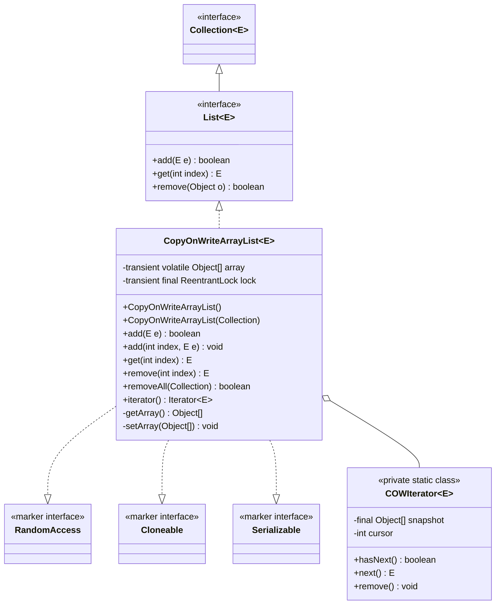
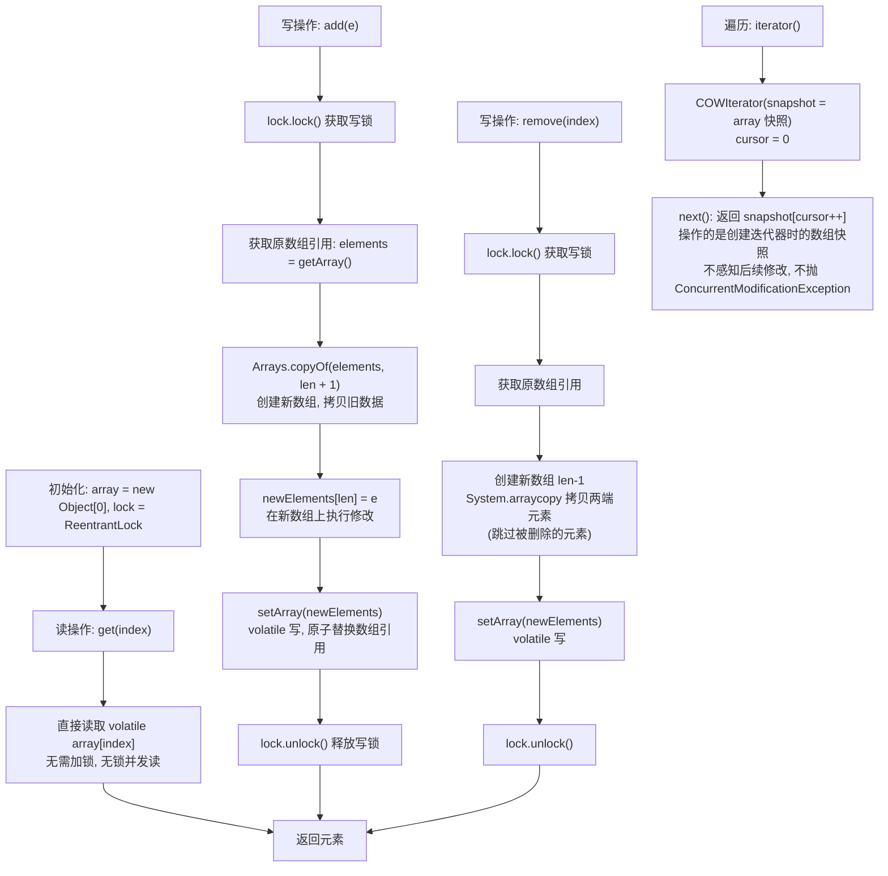

## 引言

一个读多写少的 List，用 synchronized 加锁就完了？

加锁确实能保证线程安全，但代价是所有操作都串行化——读操作也要排队等待写操作释放锁。在读远多于写的场景下（如配置列表、白名单、路由表），这是不必要的性能浪费。

`CopyOnWriteArrayList` 提供了一种更优雅的思路：**写时复制**。读操作完全无锁、零等待，写操作在副本上进行、完成后原子替换引用。这意味着读操作的性能等同于普通 ArrayList，唯一的代价是写操作需要额外分配内存。

本文将从源码级别剖析 CopyOnWriteArrayList 的核心设计，带你理解：

1. CopyOnWriteArrayList 的写时复制机制（ReentrantLock + 数组拷贝 + volatile 引用替换）
2. 为什么读操作完全无锁？弱一致性的迭代器设计
3. 适用场景与性能陷阱（大数组写操作、内存峰值）

## 简介

`CopyOnWriteArrayList` 是一种线程安全的 `ArrayList`，底层基于数组实现，该数组使用了 `volatile` 关键字修饰。

实现线程安全的原理是"人如其名"——**Copy On Write（写时复制）**。在对其进行修改操作时，复制一个新的数组，在新数组上进行修改，最后用新数组替换旧数组的引用。这样读操作始终在旧数组上进行，不会被写操作干扰。

### 类图架构



看一下 `CopyOnWriteArrayList` 内部有哪些数据结构组成：

```java
public class CopyOnWriteArrayList<E>
    implements List<E>, RandomAccess, Cloneable, java.io.Serializable {

    // 排它锁，用来保证写操作的线程安全
    final transient ReentrantLock lock = new ReentrantLock();

    // 存储元素的数组，使用 volatile 修饰
    private transient volatile Object[] array;

    // 获取数组引用
    final Object[] getArray() {
        return array;
    }
    // 设置数组引用
    final void setArray(Object[] a) {
        array = a;
    }

}
```

`CopyOnWriteArrayList` 的内部结构非常简单：使用 `ReentrantLock` 保证写操作的互斥性，使用数组存储元素。数组用 `volatile` 修饰，保证**内存可见性**——当某个线程对 `array` 重新赋值后，其他线程能立即看到新的数组引用。

关于为什么不直接用 `ArrayList` 的 `Collections.synchronizedList()` 包装：`synchronizedList` 对所有操作（包括读）都加锁，而 `CopyOnWriteArrayList` 的读操作**完全不需要加锁**，因为读操作操作的是不可变的数组快照。这使得它在读多写少的场景下性能远优于全局加锁的方案。

> **💡 核心提示**：ReentrantLock 使用的是**排它锁**（互斥锁），同一时间只有一个线程能持有锁执行写操作。为什么不使用 `synchronized`？因为 `ReentrantLock` 支持公平锁、可中断获取锁、超时获取锁等更灵活的特性，虽然在这里只用到了基本的互斥功能，但统一使用 `ReentrantLock` 是 Doug Lea（JUC 包作者）的编码风格。

### 核心工作原理



## 初始化

当我们调用 `CopyOnWriteArrayList` 的构造方法时，底层逻辑是怎么实现的？

```java
List<Integer> list = new CopyOnWriteArrayList<>();
```

`CopyOnWriteArrayList` 初始化的时候，**不支持指定数组长度**。这是因为 `CopyOnWriteArrayList` 没有传统意义上的"扩容"概念——每次修改都会创建一个精确大小的新数组，不需要预留空间。

```java
public CopyOnWriteArrayList() {
    setArray(new Object[0]);
}
```

初始化过程非常简单，就是创建了一个长度为 0 的空数组。

除了无参构造，`CopyOnWriteArrayList` 还支持从集合初始化：

```java
// 从现有集合初始化
List<Integer> list = new CopyOnWriteArrayList<>(Arrays.asList(1, 2, 3));
```

```java
public CopyOnWriteArrayList(Collection<? extends E> c) {
    Object[] elements;
    if (c.getClass() == CopyOnWriteArrayList.class) {
        // 如果源也是 CopyOnWriteArrayList，直接获取其数组引用
        elements = ((CopyOnWriteArrayList<?>) c).getArray();
    } else {
        // 否则将集合转换为数组
        elements = c.toArray();
        // 如果 toArray 返回的不是 Object[]，需要复制一份
        if (elements.getClass() != Object[].class) {
            elements = Arrays.copyOf(elements, elements.length, Object[].class);
        }
    }
    setArray(elements);
}
```

这里有一个巧妙的设计：如果源集合本身就是 `CopyOnWriteArrayList`，直接复用其数组引用（因为数组本身是不可变的快照），避免了不必要的拷贝。如果 `toArray()` 返回的是特定类型数组（如 `Integer[]`），还需要额外拷贝一份转换为 `Object[]`，保证内部数组类型的一致性。

## 添加元素

再看一下往 `CopyOnWriteArrayList` 添加元素时，调用的 `add()` 方法源码实现：

```java
// 添加元素
public boolean add(E e) {
    // 加锁，保证写操作线程安全
    final ReentrantLock lock = this.lock;
    lock.lock();

    try {
        // 获取原数组引用
        Object[] elements = getArray();
        int len = elements.length;
        // 创建一个新数组，长度为原数组长度+1，并把原数组元素拷贝到新数组
        Object[] newElements = Arrays.copyOf(elements, len + 1);
        // 将新元素放到新数组末尾
        newElements[len] = e;
        // 用新数组替换原数组引用
        setArray(newElements);
        return true;
    } finally {
        // 释放锁
        lock.unlock();
    }
}
```

添加元素的流程：

1. 先使用 `ReentrantLock` 加锁，保证写操作的互斥性。
2. 创建一个新数组，长度是原数组长度 +1，并把原数组元素拷贝到新数组。
3. 在新数组末尾位置赋值新元素。
4. 使用 `setArray()` 将新数组引用赋值给 `volatile` 修饰的 `array`。
5. 释放锁。

`add()` 方法并没有在原数组上进行修改，而是创建新数组，修改完成后用新数组替换原数组。这有两个目的：一是利用 `volatile` 的可见性——只有重新对 `array` 赋值（而不是修改数组内容），其他线程才能感知到变化；二是保证读操作的快照语义——正在读的线程引用的仍然是旧数组，不受影响。

> **💡 核心提示**：为什么要在 `finally` 块中释放锁？这是使用 `ReentrantLock` 的**最佳实践**。如果在 try 块中发生异常，没有 finally 块会导致锁永远不释放，其他等待该锁的线程将永久阻塞，形成**死锁**。Doug Lea 的源码严格遵守了这一规范。

还有一个需要注意的点是，每次添加元素都会创建一个新数组，涉及完整的数组拷贝。当数组较大时，性能消耗较为明显。所以 `CopyOnWriteArrayList` 适用于**读多写少**的场景，如果存在较多的写操作，性能是需要重点考虑的因素。

除了尾插的 `add(e)`，`CopyOnWriteArrayList` 还支持在指定位置插入的 `add(index, element)`：

```java
public void add(int index, E element) {
    final ReentrantLock lock = this.lock;
    lock.lock();
    try {
        Object[] elements = getArray();
        int len = elements.length;
        // 检查下标合法性
        if (index > len || index < 0)
            throw new IndexOutOfBoundsException("Index: " + index + ", Size: " + len);
        Object[] newElements;
        int numMoved = len - index;
        if (numMoved == 0) {
            // 插入到末尾，同 add(e)
            newElements = Arrays.copyOf(elements, len + 1);
        } else {
            // 插入到中间位置，需要分两段拷贝
            newElements = new Object[len + 1];
            System.arraycopy(elements, 0, newElements, 0, index);
            System.arraycopy(elements, index, newElements, index + 1, numMoved);
        }
        newElements[index] = element;
        setArray(newElements);
    } finally {
        lock.unlock();
    }
}
```

插入到中间位置时，需要将原数组分成两段：`index` 之前的元素直接拷贝，`index` 及之后的元素向后错一位拷贝。

## 删除元素

再看一下删除元素的方法 `remove()` 的源码：

```java
// 按下标删除元素
public E remove(int index) {
    // 加锁，保证写操作线程安全
    final ReentrantLock lock = this.lock;
    lock.lock();

    try {
        // 获取原数组引用
        Object[] elements = getArray();
        int len = elements.length;
        E oldValue = get(elements, index);
        // 计算需要移动的元素个数
        int numMoved = len - index - 1;
        if (numMoved == 0) {
            // 删除的是数组末尾元素，直接拷贝前 len-1 个
            setArray(Arrays.copyOf(elements, len - 1));
        } else {
            // 创建新数组，长度是原数组长度-1
            Object[] newElements = new Object[len - 1];
            // 把原数组下标前后两段的元素都拷贝到新数组（跳过被删除的元素）
            System.arraycopy(elements, 0, newElements, 0, index);
            System.arraycopy(elements, index + 1, newElements, index,
                numMoved);
            // 替换原数组引用
            setArray(newElements);
        }
        return oldValue;
    } finally {
        // 释放锁
        lock.unlock();
    }
}
```

删除元素的流程：

1. 先使用 `ReentrantLock` 加锁。
2. 创建一个新数组，长度是原数组长度 -1。
3. 把原数组中剩余元素（不包含需要删除的元素）拷贝到新数组。删除中间元素时，使用 `System.arraycopy` 分两段拷贝：`index` 之前和 `index+1` 之后。
4. 使用新数组替换掉原数组引用。
5. 释放锁。

根据对象值删除元素的 `remove(Object o)` 方法源码与之类似：先遍历数组找到目标元素的下标，然后转为下标删除。

## 批量删除

再看一下批量删除元素方法 `removeAll()` 的源码：

```java
// 批量删除元素
public boolean removeAll(Collection<?> c) {
    // 参数判空
    if (c == null) {
        throw new NullPointerException();
    }
    // 加锁，保证写操作线程安全
    final ReentrantLock lock = this.lock;
    lock.lock();

    try {
        // 获取原数组引用
        Object[] elements = getArray();
        int len = elements.length;
        if (len != 0) {
            // 创建临时数组，长度暂时使用原数组长度（因为不知道要保留多少元素）
            Object[] temp = new Object[len];
            // newlen 表示新数组中实际元素个数
            int newlen = 0;
            // 遍历原数组，把需要保留的元素放到临时数组中
            for (int i = 0; i < len; ++i) {
                Object element = elements[i];
                if (!c.contains(element)) {
                    temp[newlen++] = element;
                }
            }
            // 如果新数组长度与原数组不同（有元素被删除），就截断空白并覆盖原数组引用
            if (newlen != len) {
                setArray(Arrays.copyOf(temp, newlen));
                return true;
            }
        }
        return false;
    } finally {
        // 释放锁
        lock.unlock();
    }
}
```

批量删除的流程与单个删除类似：

1. 加锁。
2. 创建临时数组，长度暂时使用原数组长度（因为不知道要删除多少个元素）。
3. 遍历原数组，把不需要删除的元素放到临时数组中。
4. 用 `Arrays.copyOf(temp, newlen)` 截断临时数组中的空白部分，再替换原数组引用。
5. 释放锁。

如果遇到需要一次删除多个元素的场景，尽量使用 `removeAll()` 方法，因为它只涉及**一次**数组拷贝，性能比逐个调用 `remove()` 好得多（逐个删除每次都要创建新数组并拷贝）。

## 并发修改问题

当遍历 `CopyOnWriteArrayList` 的过程中，同时增删其中的元素，会发生什么情况？测试一下：

```java
import java.util.List;
import java.util.concurrent.CopyOnWriteArrayList;

public class Test {

    public static void main(String[] args) {
        List<Integer> list = new CopyOnWriteArrayList<>();
        list.add(1);
        list.add(2);
        list.add(2);
        list.add(3);
        // 遍历 ArrayList
        for (Integer key : list) {
            // 判断如果元素等于2，则删除
            if (key.equals(2)) {
                list.remove(key);
            }
        }
        System.out.println(list);
    }

}
```

输出结果：

```
[1, 3]
```

不但没有抛出异常，还把 `CopyOnWriteArrayList` 中重复的元素也都删除了。

原因是 `CopyOnWriteArrayList` 重写了迭代器，拷贝了一份原数组的**快照**，在快照数组上进行遍历。这样做的优点是：其他线程对数组的修改不影响当前遍历；缺点是：遍历过程中**无法感知**其他线程对数组的最新修改。这就是所谓的**弱一致性**（weakly consistent）语义——有得必有失。

下面是迭代器的源码实现：

```java
static final class COWIterator<E> implements ListIterator<E> {
    /**
     * 创建迭代器时的数组快照
     */
    private final Object[] snapshot;
    /**
     * 迭代游标
     */
    private int cursor;

    private COWIterator(Object[] elements, int initialCursor) {
        cursor = initialCursor;
        snapshot = elements;
    }

    public boolean hasNext() {
        return cursor < snapshot.length;
    }

    // 迭代下个元素
    public E next() {
        if (!hasNext())
            throw new NoSuchElementException();
        return (E) snapshot[cursor++];
    }

    // 以下操作都不支持（因为迭代器操作的是快照，无法反映到原数组）
    public void remove() {
        throw new UnsupportedOperationException();
    }
    public void set(E e) {
        throw new UnsupportedOperationException();
    }
    public void add(E e) {
        throw new UnsupportedOperationException();
    }
}
```

可以看到，`COWIterator` 的 `remove()`、`set()`、`add()` 方法都直接抛出 `UnsupportedOperationException`。这是因为迭代器持有的是快照数组的引用，对快照的修改无法反映到原数组中。如果需要修改，应该直接调用 `CopyOnWriteArrayList` 自身的方法。

## 生产环境避坑指南

基于上述源码分析，以下是 CopyOnWriteArrayList 在生产环境中常见的陷阱：

| 陷阱 | 现象 | 解决方案 |
| :--- | :--- | :--- |
| 大数组频繁写操作 | 每次写都要拷贝全数组，CPU 和内存双重消耗 | 改用 `Collections.synchronizedList()` 或 `ReentrantLock` + `ArrayList` |
| 遍历不感知最新修改 | 迭代器拿到的是旧快照，看不到写入的最新元素 | 如果业务需要强一致遍历语义，不要用 COWAL |
| 迭代器不支持修改 | `iterator.remove()` / `add()` / `set()` 直接抛异常 | 直接调用 `CopyOnWriteArrayList` 自身的方法 |
| 内存峰值 + GC 压力 | 写操作创建大量临时数组，短时间内存翻倍 | 评估数组大小和写入频率，必要时改用其他方案 |
| 误以为完全替代 ArrayList | COWAL 是特殊场景的专用工具，不是 ArrayList 的通用替代 | 非读多写少的线程安全场景不要用它 |

## 线程安全方案对比

| 方案 | 读操作 | 写操作 | 迭代器语义 | 适用场景 |
| :--- | :--- | :--- | :--- | :--- |
| `CopyOnWriteArrayList` | **无锁**，O(1) | O(n)，全量拷贝 | **fail-safe**（快照） | 读极多写极少（事件监听器、配置列表） |
| `Collections.synchronizedList()` | 加锁，O(1) | 加锁，O(1) 平均 | **fail-fast** | 读写均衡的线程安全场景 |
| `Vector` | 加锁，O(1) | 加锁，O(1) 平均 | **fail-fast** | **不推荐**，遗留类 |

## 总结

现在可以回答文章开头提出的问题了：

1. **CopyOnWriteArrayList 初始容量是多少？**

   答案：是 0。无参构造直接创建长度为 0 的空数组。

2. **CopyOnWriteArrayList 是怎么进行扩容的？**

   答案：`CopyOnWriteArrayList` 没有传统意义上的"扩容"概念。每次写操作（add/remove/set）都创建一个精确大小的新数组，拷贝旧数据，然后用新数组替换旧数组引用。

3. **CopyOnWriteArrayList 是怎么保证线程安全的？**

   答案：
   - 使用 `ReentrantLock` 加锁，保证同一时间只有一个线程在执行写操作。
   - 使用 `volatile` 关键字修饰数组引用，保证写线程对新数组的赋值对其他线程立即可见。
   - 读操作完全无锁——读的是不可变的数组快照，天然线程安全。

### 关键操作时间复杂度对比

| 操作 | 方法 | 时间复杂度 | 说明 |
| :--- | :--- | :--- | :--- |
| 读取 | `get(int index)` | O(1) | 直接数组下标访问，无需加锁 |
| 尾插 | `add(E e)` | O(n) | 创建新数组 + 拷贝全部旧元素 |
| 中间插入 | `add(int index, E e)` | O(n) | 创建新数组 + 分两段拷贝 |
| 删除 | `remove(int index)` | O(n) | 创建新数组 + 拷贝剩余元素 |
| 批量删除 | `removeAll(Collection)` | O(n*m) | n 为原数组长度，m 为待删除集合大小 |
| 遍历 | `iterator()` / `forEach` | O(n) | 遍历快照数组，无锁 |
| 查找 | `contains()` / `indexOf()` | O(n) | 线性遍历数组 |

### 使用建议

1. **读多写少场景首选**：`CopyOnWriteArrayList` 的读操作完全无锁，多个线程并发读取时性能极佳。但每次写操作都要创建新数组并拷贝全部旧元素，写操作成本为 O(n)。如果写操作频繁，性能会急剧下降。典型适用场景：配置列表、白名单、事件监听器列表等。
2. **遍历不感知最新修改**：迭代器持有创建时的数组快照，遍历时不会抛出 `ConcurrentModificationException`，但也看不到其他线程的最新修改。如果业务需要强一致的遍历语义，不适合使用 `CopyOnWriteArrayList`。
3. **迭代器不支持修改操作**：`COWIterator` 的 `remove()`、`set()`、`add()` 都会抛出 `UnsupportedOperationException`。需要在遍历时删除元素的话，应该直接调用 `CopyOnWriteArrayList.remove()` 方法。
4. **注意内存峰值**：每次写操作都会创建新数组，在写操作频繁的极端情况下，短时间内会产生大量临时数组对象，可能引发频繁的 GC。如果预估数组较大且有一定写入频率，需要考虑内存和 GC 的影响。

### 行动清单

1. **检查点**：确认项目中 `CopyOnWriteArrayList` 的使用场景确实是"读多写少"，如果写操作频繁，应替换为 `Collections.synchronizedList()`。
2. **检查点**：确认遍历逻辑是否容忍弱一致性语义。如果遍历时需要看到最新数据，不要用 COWAL。
3. **避坑**：不要在 COWAL 的迭代器上调用 `remove()`/`add()`/`set()`——直接抛 `UnsupportedOperationException`。
4. **优化建议**：如果初始化时已知元素集合，使用 `new CopyOnWriteArrayList<>(collection)` 构造方法，避免后续逐个 add 导致的多次全量拷贝。
5. **避坑**：大容量 + 高频写入场景会导致严重的内存抖动和 GC 压力，建议改用 `ReentrantLock` + `ArrayList` 的组合。
6. **扩展阅读**：推荐阅读《Java Concurrency in Practice》第5章（并发集合）、第5.2.3节（CopyOnWriteArrayList 源码分析）。
