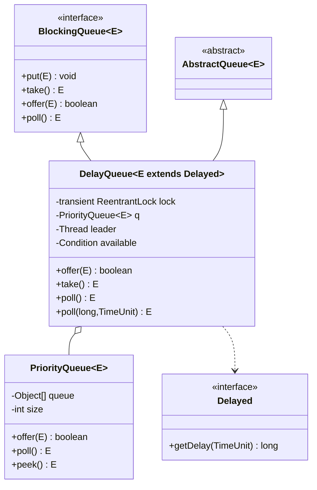
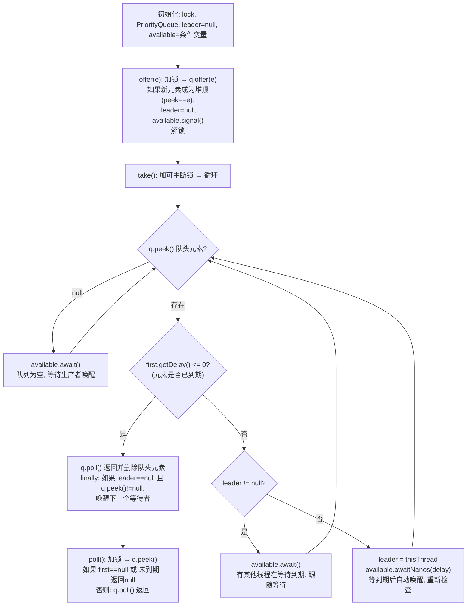

## 引言

订单 30 分钟未支付自动取消，不用定时任务怎么做？

轮询数据库？太浪费资源。定时扫描？延迟不精确。优雅的答案是：`DelayQueue`。元素入队时指定一个延迟时间，消费者调用 `take()` 就会自动阻塞直到元素到期。

`DelayQueue` 的底层设计非常精妙：它组合了 `PriorityQueue`（按到期时间排序的最小堆）和一个 `ReentrantLock`，并通过 **leader-follower 模式**避免了多个消费者线程的无效等待。多个线程同时 `take()` 时，只有 leader 线程会精确计时等待，其他线程无限休眠，leader 消费后再从 follower 中选举新的 leader。这种设计让 CPU 占用极低。

本文将从源码级别深入剖析 DelayQueue 的核心机制，带你理解：

1. Delayed 接口的设计要求（getDelay + compareTo 必须一致）
2. leader-follower 模式如何避免惊群效应
3. 新元素成为堆顶时如何安全重置 leader
4. 常见使用场景（订单超时取消、缓存过期清理、延迟消息）

由于 `DelayQueue` 实现了 `BlockingQueue` 接口，而 `BlockingQueue` 接口中定义了几组放数据和取数据的方法，来满足不同的场景。

| 操作 | 抛出异常 | 返回特定值 | 一直阻塞 | 阻塞指定时间 |
| :--- | :--- | :--- | :--- | :--- |
| 放数据 | `add()` | `offer()` | `put()` | `offer(e, time, unit)` |
| 取数据（同时删除） | `remove()` | `poll()` | `take()` | `poll(time, unit)` |
| 查看数据（不删除） | `element()` | `peek()` | 不支持 | 不支持 |

**这四组方法的区别是：**

1. 当队列满的时候，再次添加数据：`add()` 会抛出异常，`offer()` 会返回 `false`，`put()` 会一直阻塞，`offer(e, time, unit)` 会阻塞指定时间后返回 `false`。
2. 当队列为空（或元素未到期）的时候，再次取数据：`remove()` 会抛出异常，`poll()` 会返回 `null`，`take()` 会一直阻塞，`poll(time, unit)` 会阻塞指定时间后返回 `null`。

### 类图架构



### 核心工作原理

`DelayQueue` 的核心工作原理可以用下面的流程图概括：



## 类结构

先看一下 `DelayQueue` 类里面有哪些属性：

```java
public class DelayQueue<E extends Delayed>
        extends AbstractQueue<E>
        implements BlockingQueue<E> {

    /**
     * 排它锁，用于保证线程安全
     */
    private final transient ReentrantLock lock = new ReentrantLock();

    /**
     * 底层基于 PriorityQueue 实现（二叉堆，按到期时间排序）
     */
    private final PriorityQueue<E> q = new PriorityQueue<E>();

    /**
     * leader 线程：当前正在等待队头元素到期的线程（leader-follower 模式）
     */
    private Thread leader = null;

    /**
     * 条件队列：当队列中没有到期元素时，线程在此等待
     */
    private final Condition available = lock.newCondition();

}
```

`DelayQueue` 实现了 `BlockingQueue` 接口，是一个阻塞队列。元素需要实现 `Delayed` 接口。内部使用 `ReentrantLock` 保证线程安全，使用 `Condition` 作为条件队列，当队列中没有到期元素时，取数据的线程需要在条件队列中等待。

```java
public interface Delayed extends Comparable<Delayed> {

    /**
     * 返回剩余过期时间（与关联的时间单位有关）
     */
    long getDelay(TimeUnit unit);
}
```

`DelayQueue` 的四个核心字段各自有不同的作用：

- **`lock`**：`ReentrantLock` 排它锁，保证所有操作的线程安全
- **`q`**：`PriorityQueue`（二叉堆），按元素的到期时间排序，到期时间最早的在堆顶
- **`leader`**：当前正在等待队头元素到期的线程。这是 **leader-follower 模式**的设计，目的是避免多个线程同时等待同一个到期时间
- **`available`**：条件变量，用于线程间协调

> **💡 核心提示**：`Delayed` 接口继承了 `Comparable<Delayed>`，这意味着实现 `Delayed` 的元素**必须可比较**。`compareTo()` 方法按到期时间排序，`getDelay()` 方法返回剩余时间。这两个方法共同决定了元素在队列中的顺序和是否到期。

## 初始化

`DelayQueue` 常用的初始化方法有两个：无参构造方法和指定元素集合的有参构造方法。

```java
/**
 * 无参构造方法
 */
public DelayQueue() {
}

/**
 * 指定元素集合
 */
public DelayQueue(Collection<? extends E> c) {
    this.addAll(c);
}
```

无参构造方法是空的，底层 `PriorityQueue` 在属性声明时已经初始化。有参构造方法会调用 `addAll`，将集合中的元素逐个添加到 `PriorityQueue` 中，添加时会自动按到期时间排序。

## 使用示例

先定义一个延迟任务，需要实现 `Delayed` 接口，并重写 `getDelay()` 和 `compareTo()` 方法。

```java
/**
 * 自定义延迟任务
 **/
public class DelayedTask implements Delayed {

    /**
     * 任务到期时间（绝对时间戳）
     */
    private long expirationTime;

    /**
     * 任务
     */
    private Runnable task;

    public void execute() {
        task.run();
    }

    public DelayedTask(long delay, Runnable task) {
        // 到期时间 = 当前时间 + 延迟时间
        this.expirationTime = System.currentTimeMillis() + delay;
        this.task = task;
    }

    /**
     * 返回剩余延迟时间
     */
    @Override
    public long getDelay(@NotNull TimeUnit unit) {
        return unit.convert(expirationTime - System.currentTimeMillis(), TimeUnit.MILLISECONDS);
    }

    /**
     * 任务按照到期时间排序
     */
    @Override
    public int compareTo(@NotNull Delayed o) {
        return Long.compare(this.expirationTime, ((DelayedTask) o).expirationTime);
    }
}
```

测试运行延迟任务：

```java
/**
 * DelayQueue 测试类
 **/
public class DelayQueueTest {

    public static void main(String[] args) throws InterruptedException {
        // 初始化延迟队列
        DelayQueue<DelayedTask> delayQueue = new DelayQueue<>();

        // 添加3个任务，延迟时间分别是3秒、1秒、5秒
        delayQueue.add(new DelayedTask(3000, () -> System.out.println("任务2开始运行")));
        delayQueue.add(new DelayedTask(1000, () -> System.out.println("任务1开始运行")));
        delayQueue.add(new DelayedTask(5000, () -> System.out.println("任务3开始运行")));

        // 运行任务
        System.out.println("开始运行任务");
        while (!delayQueue.isEmpty()) {
            // 阻塞获取最先到期的任务
            DelayedTask task = delayQueue.take();
            task.execute();
        }
    }
}
```

输出结果：
```
开始运行任务
任务1开始运行
任务2开始运行
任务3开始运行
```

可以看出，运行任务的时候，会按照任务的到期时间进行排序，先到期的任务先运行。如果没有到期的任务，调用 `take()` 方法的时候会一直阻塞。

## 放数据源码

放数据的方法有四个：

| 操作 | 抛出异常 | 返回特定值 | 阻塞 | 阻塞一段时间 |
| :--- | :--- | :--- | :--- | :--- |
| 放数据 | `add()` | `offer()` | `put()` | `offer(e, time, unit)` |

### offer 方法源码

先看一下 `offer()` 方法源码，其他放数据方法逻辑也是大同小异。
`offer()` 方法在队列满的时候会直接返回 `false`，表示插入失败。

```java
/**
 * offer 方法入口
 *
 * @param e 元素
 * @return 是否插入成功
 */
public boolean offer(E e) {
    // 1. 获取锁
    final ReentrantLock lock = this.lock;
    lock.lock();
    try {
        // 2. 直接调用 PriorityQueue 的 offer 方法
        q.offer(e);
        // 3. 如果新元素成为了堆顶（说明之前堆为空或新元素到期更早）
        //    需要重置 leader 并唤醒在 take() 中阻塞的线程
        if (q.peek() == e) {
            leader = null;
            available.signal();
        }
        return true;
    } finally {
        // 4. 释放锁
        lock.unlock();
    }
}
```

`DelayQueue` 的 `offer()` 方法底层是基于 `PriorityQueue` 的 `offer()` 方法实现的，`PriorityQueue` 内部实现了二叉堆的自动扩容和排序。

关键在于第 3 步的判断：`q.peek() == e` 表示新加入的元素成为了堆顶（到期时间最早）。这说明之前可能没有到期元素，或者有到期的但比新元素晚。此时需要把 `leader` 置为 `null`（之前可能在等待其他元素到期），并调用 `available.signal()` 唤醒在 `take()` 中阻塞的消费者线程，让它重新检查队头元素。

> **💡 核心提示**：为什么新元素成为堆顶时要重置 `leader` 并 `signal()`？假设原来的堆顶元素 5 秒后到期，leader 线程正在等待 5 秒。此时来了一个 1 秒后到期的新元素，如果不重置 leader，leader 线程还要等 5 秒才会醒来处理这个 1 秒的任务，导致任务延迟执行。重置 leader 并 signal，可以让下一个取数据的线程立即重新检查，发现新元素 1 秒后就到期，成为新的 leader 等待 1 秒。

再看另外三个添加元素方法源码：

### add/put/offer(e, time, unit) 方法源码

`add()`、`put()`、`offer(e, time, unit)` 方法底层都是基于 `offer()` 实现，逻辑相同，并没有实现阻塞指定时间的功能。这是因为 `DelayQueue` 是**无界队列**（底层 `PriorityQueue` 会自动扩容），永远不会满，所以所有添加方法都不会阻塞。

```java
public boolean add(E e) {
    return offer(e);
}

public void put(E e) {
    offer(e);
}

public boolean offer(E e, long timeout, TimeUnit unit) {
    return offer(e);
}
```

## 取数据源码

取数据（取出并删除）的方法有四个：

| 操作 | 抛出异常 | 返回特定值 | 阻塞 | 阻塞一段时间 |
| :--- | :--- | :--- | :--- | :--- |
| 取数据（同时删除） | `remove()` | `poll()` | `take()` | `poll(time, unit)` |

### poll 方法源码

看一下 `poll()` 方法源码，其他取数据方法逻辑大同小异，都是从堆顶（二叉堆的头部）弹出元素。
`poll()` 方法在取元素的时候，如果队列为空或者元素未到期，直接返回 `null`。

```java
/**
 * poll 方法入口
 */
public E poll() {
    // 1. 获取锁
    final ReentrantLock lock = this.lock;
    lock.lock();
    try {
        // 2. 获取堆顶元素
        E first = q.peek();
        // 3. 如果堆顶为空，或者还没有到期，则返回 null
        if (first == null || first.getDelay(NANOSECONDS) > 0) {
            return null;
        } else {
            // 4. 否则弹出并返回堆顶元素
            return q.poll();
        }
    } finally {
        // 5. 释放锁
        lock.unlock();
    }
}
```

### remove 方法源码

再看一下 `remove()` 方法源码。`remove()` 先调用 `poll()` 尝试取元素，如果取到（元素已到期）直接返回；如果没取到（队列为空或元素未到期），`poll()` 返回 `null`，`remove()` 会抛出 `NoSuchElementException` 异常。

```java
public E remove() {
    E x = poll();
    if (x != null) {
        return x;
    } else {
        throw new NoSuchElementException();
    }
}
```

### take 方法源码

再看一下 `take()` 方法源码，如果没有到期元素，`take()` 方法会一直阻塞，直到被唤醒。

```java
/**
 * take 方法入口
 */
public E take() throws InterruptedException {
    // 1. 加锁，加可中断的锁
    final ReentrantLock lock = this.lock;
    lock.lockInterruptibly();
    try {
        for (;;) {
            // 2. 获取堆顶元素
            E first = q.peek();
            // 3. 如果堆顶为空，则无限等待（等待生产者添加元素）
            if (first == null) {
                available.await();
            } else {
                // 4. 如果堆顶不为空，获取到期剩余时间
                long delay = first.getDelay(NANOSECONDS);
                // 5. 如果剩余时间 <= 0，表示已到期，弹出并返回
                if (delay <= 0) {
                    return q.poll();
                }
                first = null; // 帮助 GC 回收
                // 6. 如果未到期，判断是否有 leader 线程在等待
                if (leader != null) {
                    // 已有 leader 在等待该元素到期，当前线程只需跟随等待
                    available.await();
                } else {
                    // 没有 leader，当前线程成为 leader，定时等待
                    Thread thisThread = Thread.currentThread();
                    leader = thisThread;
                    try {
                        available.awaitNanos(delay);
                    } finally {
                        if (leader == thisThread)
                            leader = null;
                    }
                }
            }
        }
    } finally {
        // 返回元素后，如果 leader 为空且队列中还有元素，唤醒下一个等待者
        if (leader == null && q.peek() != null) {
            available.signal();
        }
        // 7. 释放锁
        lock.unlock();
    }
}
```

`take()` 方法是 `DelayQueue` 中最核心的方法，包含了 **leader-follower 模式**的完整实现。逻辑分为三种情况：

1. **队列为空**（`first == null`）：调用 `available.await()` 无限等待，等待生产者添加元素后唤醒
2. **元素已到期**（`delay <= 0`）：直接 `q.poll()` 弹出并返回
3. **元素未到期**：进一步判断是否有 `leader` 线程在等待
   - 如果 `leader != null`：说明已经有其他线程在等待这个元素到期，当前线程只需调用 `available.await()` 跟随等待即可（leader 到期后会唤醒它）
   - 如果 `leader == null`：说明没有线程在等待，当前线程成为 `leader`，调用 `available.awaitNanos(delay)` 定时等待到元素到期。等待结束后自动唤醒，回到循环开头重新检查

`finally` 块中的 `available.signal()` 也很关键：当 leader 线程拿到到期元素返回后，如果队列中还有其他未到期的元素，需要唤醒下一个线程来成为新的 leader，继续等待下一个元素到期。

> **💡 核心提示**：leader-follower 模式的本质是**避免多个线程同时等待同一个到期时间**。如果没有这个模式，10 个消费者线程都会各自 `awaitNanos(5000ms)` 等待同一个 5 秒后到期的元素，白白浪费 9 个线程的等待时间。有了 leader-follower 模式，只有一个线程等待 5 秒，其他 9 个线程无限跟随等待（不消耗 CPU，也不消耗定时等待资源），leader 到期后会通过 `signal()` 唤醒其中一个成为新的 leader。

### poll(time, unit) 源码

再看一下 `poll(time, unit)` 方法源码。当队列为空或元素未到期时，`poll(time, unit)` 方法会阻塞指定时间，然后返回 `null`。

```java
/**
 * poll 方法入口
 *
 * @param timeout 超时时间
 * @param unit    时间单位
 * @return 元素
 */
public E poll(long timeout, TimeUnit unit) throws InterruptedException {
    long nanos = unit.toNanos(timeout);
    // 1. 加锁，加可中断的锁
    final ReentrantLock lock = this.lock;
    lock.lockInterruptibly();
    try {
        for (; ; ) {
            // 2. 获取堆顶元素
            E first = q.peek();
            // 3. 如果堆顶为空，判断是否超时
            if (first == null) {
                if (nanos <= 0) {
                    return null;
                } else {
                    nanos = available.awaitNanos(nanos);
                }
            } else {
                // 4. 如果堆顶不为空，获取到期剩余时间
                long delay = first.getDelay(NANOSECONDS);
                // 5. 如果剩余时间 <= 0，表示已到期，弹出并返回
                if (delay <= 0) {
                    return q.poll();
                }
                if (nanos <= 0) {
                    return null;
                }
                first = null; // 帮助 GC 回收
                // 6. 如果未到期，判断等待时间是否足够
                if (nanos < delay || leader != null) {
                    // 剩余等待时间小于元素到期时间，或已有 leader，跟随等待
                    nanos = available.awaitNanos(nanos);
                } else {
                    // 否则成为 leader，等待到元素到期
                    Thread thisThread = Thread.currentThread();
                    leader = thisThread;
                    try {
                        long timeLeft = available.awaitNanos(delay);
                        nanos -= delay - timeLeft;
                    } finally {
                        if (leader == thisThread)
                            leader = null;
                    }
                }
            }
        }
    } finally {
        if (leader == null && q.peek() != null)
            available.signal();
        // 7. 释放锁
        lock.unlock();
    }
}
```

`poll(time, unit)` 与 `take()` 方法逻辑类似，区别在于 `take()` 在队列为空时会一直阻塞，而 `poll(time, unit)` 只会阻塞指定的超时时间。

## 查看数据源码

再看一下查看数据的源码，只查看，不删除。

| 操作 | 抛出异常 | 返回特定值 | 阻塞 | 阻塞一段时间 |
| :--- | :--- | :--- | :--- | :--- |
| 查看数据（不删除） | `element()` | `peek()` | 不支持 | 不支持 |

### peek 方法源码

先看一下 `peek()` 方法源码，如果队列为空，直接返回 `null`，底层基于 `PriorityQueue` 的 `peek()` 方法实现。

```java
/**
 * peek 方法入口
 */
public E peek() {
    final ReentrantLock lock = this.lock;
    lock.lock();
    try {
        return q.peek();
    } finally {
        lock.unlock();
    }
}
```

### element 方法源码

再看一下 `element()` 方法源码，如果队列为空，则抛出异常，底层直接调用 `peek()` 方法。

```java
/**
 * element 方法入口
 */
public E element() {
    E x = peek();
    if (x != null) {
        return x;
    } else {
        throw new NoSuchElementException();
    }
}
```

## 生产环境避坑指南

基于上述源码分析，以下是 DelayQueue 在生产环境中常见的陷阱：

| 陷阱 | 现象 | 解决方案 |
| :--- | :--- | :--- |
| 元素未实现 `Delayed` 接口 | 编译错误 | 任务类必须实现 `Delayed` 接口并重写 `getDelay()` 和 `compareTo()` |
| `compareTo()` 和 `getDelay()` 逻辑不一致 | 堆排序错误，到期元素取不出来 | `compareTo()` 必须与 `getDelay()` 的排序一致 |
| 系统时钟被手动调整（NTP 同步） | 到期时间不准确，任务提前或延迟执行 | 使用 `System.nanoTime()` 代替 `System.currentTimeMillis()` |
| `take()` 永久阻塞 | 队列中没有到期元素或消费者线程被中断 | 确保有生产者放入元素，使用 `poll(time, unit)` 代替 `take()` |
| `remove(Object)` 性能差 | O(n) 线性遍历，在大队列中导致卡顿 | 不要在 DelayQueue 上频繁按值删除，考虑使用其他数据结构 |
| 无界队列内存溢出 | 生产者速度远大于消费者，`PriorityQueue` 无限增长 | 在业务层控制最大队列长度，超过时丢弃或报警 |

## 总结

这篇文章讲解了 `DelayQueue` 阻塞队列的核心源码，了解到 `DelayQueue` 队列具有以下特点：

1. `DelayQueue` 实现了 `BlockingQueue` 接口，提供了四组放数据和取数据的方法，满足不同的使用场景。
2. `DelayQueue` 底层采用组合方式，复用 `PriorityQueue` 的按延迟时间排序功能（二叉堆），实现了延迟队列。
3. `DelayQueue` 是线程安全的，内部使用 `ReentrantLock` 加锁。
4. 采用了 **leader-follower 模式**优化等待：只有一个线程等待元素到期，其他线程跟随等待，避免多个线程同时等待同一个到期时间。

### 关键操作时间复杂度对比

| 操作 | 方法 | 时间复杂度 | 说明 |
| :--- | :--- | :--- | :--- |
| 添加 | `offer`/`add`/`put` | O(log n) | PriorityQueue 的 siftUp 操作 |
| 取到期元素 | `poll`/`take` | O(log n) | PriorityQueue 的 siftDown 操作 |
| 查看堆顶 | `peek`/`element` | O(1) | 直接返回堆顶元素 |
| 删除任意元素 | `remove(Object)` | O(n) | 需线性遍历查找 + PriorityQueue 的 remove |

### 使用建议

1. **元素必须实现 Delayed 接口**：`getDelay()` 返回剩余时间，`compareTo()` 按到期时间排序。注意使用**绝对时间戳**（`System.currentTimeMillis() + delay`）而不是相对延迟，避免多线程竞争时出现时钟偏差。
2. **DelayQueue 是无界队列**：底层 `PriorityQueue` 会自动扩容，永远不会满。所以 `put()`、`offer(e, time, unit)` 等方法的阻塞语义在 `DelayQueue` 中不生效，添加操作永远立即返回。如果需要有界限制，需要自行在业务层控制。
3. **take() 是阻塞消费的核心**：在多线程消费场景下，leader-follower 模式保证只有一个线程在等待元素到期，避免了无效的 CPU 轮询。如果业务需要在元素到期前取消任务，需要使用 `remove(Object)` 方法从队列中移除，时间复杂度为 O(n)。
4. **注意时钟精度和系统时间变化**：`getDelay()` 底层依赖 `System.currentTimeMillis()`，如果系统时钟被手动调整（如 NTP 同步），可能导致到期时间不准确。如果需要更精确的延迟，可以考虑使用 `System.nanoTime()`。

### 行动清单

1. **检查点**：确认自定义的延迟任务类正确实现了 `Delayed` 接口，且 `compareTo()` 和 `getDelay()` 的排序逻辑一致。
2. **检查点**：确认 `getDelay()` 使用的是绝对时间戳（`System.currentTimeMillis() + delay`），避免因相对时间计算导致的多线程竞态问题。
3. **避坑**：如果系统时钟可能被 NTP 调整（如云服务器），改用 `System.nanoTime()` 计算到期时间，避免时钟回跳导致任务提前或延迟执行。
4. **避坑**：`DelayQueue` 是无界队列，生产者在极端情况下可能塞入大量未到期元素导致 OOM，应在业务层监控队列大小。
5. **优化建议**：单线程消费场景直接用 `take()` 即可；多线程消费场景下，leader-follower 模式能自动优化，无需额外配置。
6. **扩展阅读**：推荐阅读《Java Concurrency in Practice》第5章（并发集合）、Doug Lea 的 ConcurrentLinkedQueue 论文中关于 leader-follower 模式的讨论。
