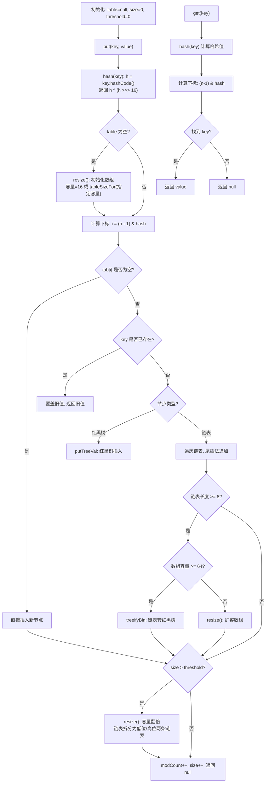

欢迎学习《解读Java源码专栏》，在这个系列中，我将手把手带着大家剖析Java核心组件的源码，内容包含集合、线程、线程池、并发、队列等，深入了解其背后的设计思想和实现细节，轻松应对工作面试。
这是解读Java源码系列的第四篇，将跟大家一起学习Java中最常用、最重要的数据结构 —— HashMap。

## 引言
大家思考一下，为什么 HashMap 是 Java 中最常用、最重要的数据结构？
其中一个原因就是 HashMap 的性能非常好。常见的基础数据结构有数组和链表：数组的查询效率非常高，通过数组下标实现常数级的查询性能，但插入和删除时涉及数组拷贝，性能较差；链表的插入和删除性能更好，不需要扩容与元素拷贝，但查询性能较差，需要遍历整个链表。
HashMap 综合了数组和链表的优点，将查询与插入的效率都控制在常数级的复杂度内。

学完本篇文章，你将会学到以下内容：

1. HashMap 的底层实现原理
2. HashMap 的 put 方法执行流程
3. HashMap 的扩容流程
4. HashMap 为什么是线程不安全的？
5. HashMap 的容量为什么设置成 2 的倍数？并且是 2 倍扩容？
6. HashMap 在 Java 8 版本中做了哪些变更？

## 简介
HashMap 的底层数据结构由数组、链表和红黑树组成，核心是基于数组实现的。为了解决哈希冲突，采用拉链法，于是引入了链表结构。为了解决链表过长导致的查询性能下降，Java 8 引入了红黑树结构。

HashMap 类中有两个关键的阈值常量：

- `TREEIFY_THRESHOLD = 8`：当链表长度达到 8 时，链表会转换为红黑树
- `UNTREEIFY_THRESHOLD = 6`：当红黑树节点数减少到 6 时，红黑树会退化为链表
- `MIN_TREEIFY_CAPACITY = 64`：只有数组容量达到 64 时才会触发树化，否则优先扩容数组而不是树化

这三个常量配合使用，目的是避免频繁的树化和退化操作。如果链表只是短暂变长，不会触发树化；如果红黑树只是短暂变小，不会立即退化。

HashMap 的核心工作原理可以用下面的流程图概括：



## 类属性
再看一下 HashMap 类中有哪些关键属性：

```java
public class HashMap<K, V> extends AbstractMap<K, V>
        implements Map<K, V>, Cloneable, Serializable {

    /**
     * 默认容量大小，1 << 4 = 16
     */
    static final int DEFAULT_INITIAL_CAPACITY = 1 << 4;

    /**
     * 负载系数，容量超过 threshold = capacity * loadFactor 时触发扩容
     * 默认 16 * 0.75 = 12 个元素时扩容
     */
    static final float DEFAULT_LOAD_FACTOR = 0.75f;

    /**
     * 容量最大值，2 的 30 次方
     */
    static final int MAXIMUM_CAPACITY = 1 << 30;

    /**
     * 链表转红黑树的阈值：链表长度 > 8 时树化
     */
    static final int TREEIFY_THRESHOLD = 8;

    /**
     * 红黑树退化为链表的阈值：节点数 < 6 时退化
     */
    static final int UNTREEIFY_THRESHOLD = 6;

    /**
     * 树化的最小数组容量：只有 table 容量 >= 64 才会树化
     */
    static final int MIN_TREEIFY_CAPACITY = 64;

    /**
     * 存储元素的数组，容量始终为 2 的幂
     */
    transient Node<K, V>[] table;

    /**
     * 实际存储的键值对数量
     */
    transient int size;

    /**
     * 扩容阈值，当 size > threshold 时触发扩容
     */
    transient int threshold;

    /**
     * 结构修改次数，用于 fail-fast 机制
     */
    transient int modCount;
}
```

其中 `Node` 是链表的节点：

```java
static class Node<K, V> implements Map.Entry<K, V> {
    final int hash;    // 哈希值（缓存，避免重复计算）
    final K key;       // 键
    V value;           // 值
    Node<K, V> next;   // 后继节点

    Node(int hash, K key, V value, Node<K, V> next) {
        this.hash = hash;
        this.key = key;
        this.value = value;
        this.next = next;
    }
}
```

以及红黑树的节点 `TreeNode`（继承自 `LinkedHashMap.Entry`，本质是 `Node` 的子类）：

```java
static final class TreeNode<K, V> extends LinkedHashMap.Entry<K, V> {
    TreeNode<K, V> parent;  // 父节点
    TreeNode<K, V> left;    // 左子节点
    TreeNode<K, V> right;   // 右子节点
    TreeNode<K, V> prev;    // 前驱节点（继承自 LinkedHashMap.Entry）
    boolean red;            // 节点颜色

    TreeNode(int hash, K key, V val, Node<K, V> next) {
        super(hash, key, val, next);
    }
}
```

## 初始化
HashMap 常见的初始化方法有两个：

1. 无参初始化
2. 有参初始化，指定容量大小

```java
/**
 * 无参初始化
 */
Map<Integer, Integer> map = new HashMap<>();
/**
 * 有参初始化，指定容量大小
 */
Map<Integer, Integer> map = new HashMap<>(10);
```

再看一下构造方法的底层实现：

```java
/**
 * 无参初始化
 */
public HashMap() {
    this.loadFactor = DEFAULT_LOAD_FACTOR;
}

/**
 * 有参初始化，指定容量大小
 */
public HashMap(int initialCapacity) {
    this(initialCapacity, DEFAULT_LOAD_FACTOR);
}

/**
 * 有参初始化，指定容量大小和负载系数
 */
public HashMap(int initialCapacity, float loadFactor) {
    // 校验参数
    if (initialCapacity < 0) {
        throw new IllegalArgumentException("Illegal initial capacity: " +
                initialCapacity);
    }
    if (initialCapacity > MAXIMUM_CAPACITY) {
        initialCapacity = MAXIMUM_CAPACITY;
    }
    if (loadFactor <= 0 || Float.isNaN(loadFactor)) {
        throw new IllegalArgumentException("Illegal load factor: " +
                loadFactor);
    }
    this.loadFactor = loadFactor;
    // 计算出合适的容量大小（2的幂）
    this.threshold = tableSizeFor(initialCapacity);
}
```

可以看出，无参构造方法只初始化了负载系数。指定容量大小的有参构造方法也只是初始化了负载系数和 `threshold`（扩容阈值），**两个方法都没有初始化数组大小**。

`tableSizeFor` 方法会将传入的容量值转换为大于等于它的最小的 2 的幂。例如 `tableSizeFor(10)` 返回 16，`tableSizeFor(20)` 返回 32。

如果再有面试官问你，HashMap 初始化的时候数组大小是多少？答案是 **0**（或者说未初始化），因为 HashMap 采用了**懒加载**策略，数组在第一次 `put` 时才会通过 `resize()` 方法初始化。

## hash 方法

在深入 put 方法之前，先看一下 HashMap 的 `hash()` 方法：

```java
static final int hash(Object key) {
    int h;
    return (key == null) ? 0 : (h = key.hashCode()) ^ (h >>> 16);
}
```

这个方法做了两件事：

1. 如果 key 为 null，返回 0（HashMap 允许 null 作为 key）
2. 否则，取 key 的 `hashCode()`，然后将其**无符号右移 16 位**，再与原值做**异或运算**

为什么要这样做？HashMap 计算数组下标用的是 `(n - 1) & hash`，其中 n 是数组容量（2 的幂）。当 n 较小时（比如 16），`n - 1` 只有低 4 位是 1，高位都是 0，这意味着 `&` 运算只会用到 hash 的低位。**如果不同 key 的 hashCode 只有高位不同、低位相同，就会产生哈希冲突**。通过右移 16 位再异或，把高位的信息混入低位，让高位也参与下标计算，从而**减少哈希冲突**。

## put 源码

put 方法的流程如下：

1. 计算 key 的 hash 值
2. 如果数组为空，调用 `resize()` 初始化
3. 根据 `(n - 1) & hash` 计算数组下标
4. 如果下标位置为空，直接插入
5. 如果下标位置不为空，判断 key 是否已存在，存在则覆盖
6. 如果是红黑树节点，执行红黑树插入
7. 如果是链表节点，遍历链表尾插，长度达到 8 时树化
8. 如果 `size > threshold`，调用 `resize()` 扩容

再看一下 put 方法的具体源码实现：

```java
/**
 * put 方法入口
 */
public V put(K key, V value) {
    return putVal(hash(key), key, value, false, true);
}

/**
 * 计算 hash 值（高位和低位都参与计算）
 */
static final int hash(Object key) {
    int h;
    return (key == null) ? 0 : (h = key.hashCode()) ^ (h >>> 16);
}

/**
 * 实际的put方法逻辑
 * @param hash key对应的hash值
 * @param key 键
 * @param value 值
 * @param onlyIfAbsent 如果为true，则只有当key不存在时才会put，否则会覆盖
 * @param evict 如果为false，表处于创建模式
 * @return 返回旧值
 */
final V putVal(int hash, K key, V value, boolean onlyIfAbsent, boolean evict) {
    Node<K, V>[] tab;
    Node<K, V> p;
    int n, i;
    // 1. 如果数组为空，则执行初始化（resize 同时负责初始化和扩容）
    if ((tab = table) == null || (n = tab.length) == 0) {
        n = (tab = resize()).length;
    }
    // 2. 如果 key 对应下标位置元素不存在，直接插入即可
    if ((p = tab[i = (n - 1) & hash]) == null) {
        tab[i] = newNode(hash, key, value, null);
    } else {
        Node<K, V> e;
        K k;
        // 3. 如果头节点 key 匹配，直接结束，后续判断是否需要覆盖
        if (p.hash == hash &&
                ((k = p.key) == key || (key != null && key.equals(k)))) {
            e = p;
        } else if (p instanceof TreeNode) {
            // 4. 判断下标位置的元素类型，如果是红黑树，则执行红黑树的插入逻辑
            e = ((TreeNode<K, V>) p).putTreeVal(this, tab, hash, key, value);
        } else {
            // 5. 否则执行链表的插入逻辑
            for (int binCount = 0; ; ++binCount) {
                // 6. 遍历链表，直到找到空位置为止
                if ((e = p.next) == null) {
                    // 7. 创建一个新的链表节点，并追加到末尾（尾插法）
                    p.next = newNode(hash, key, value, null);
                    // 8. 如果链表长度达到 8，则转换为红黑树
                    if (binCount >= TREEIFY_THRESHOLD - 1) {
                        treeifyBin(tab, hash);
                    }
                    break;
                }
                // 9. 如果在链表中找到相同的 key，则结束
                if (e.hash == hash &&
                        ((k = e.key) == key || (key != null && key.equals(k)))) {
                    break;
                }
                p = e;
            }
        }
        // 10. 判断是否需要覆盖旧值
        if (e != null) {
            V oldValue = e.value;
            if (!onlyIfAbsent || oldValue == null) {
                e.value = value;
            }
            afterNodeAccess(e);
            return oldValue;
        }
    }
    ++modCount;
    // 11. 判断是否需要扩容
    if (++size > threshold) {
        resize();
    }
    afterNodeInsertion(evict);
    return null;
}
```

其中 `treeifyBin` 方法负责将链表转换为红黑树，但只有在数组容量达到 `MIN_TREEIFY_CAPACITY`（64）时才会真正树化，否则只是扩容数组：

```java
final void treeifyBin(Node<K, V>[] tab, int hash) {
    int n, index;
    Node<K, V> e;
    // 如果数组容量 < 64，优先扩容而不是树化
    if (tab == null || (n = tab.length) < MIN_TREEIFY_CAPACITY) {
        resize();
    } else if ((e = tab[index = (n - 1) & hash]) != null) {
        // 否则，将链表转换为红黑树
        // ... 树化逻辑
    }
}
```

## 扩容

再看一下扩容逻辑的具体实现：

```java
/**
 * 扩容（同时负责首次初始化）
 */
final Node<K, V>[] resize() {
    Node<K, V>[] oldTab = table;
    int oldCap = (oldTab == null) ? 0 : oldTab.length;
    int oldThr = threshold;
    int newCap, newThr = 0;
    // 计算扩容后容量大小
    // 1. 如果原来容量大于0，说明不是第一次扩容，直接扩容为原来的2倍
    if (oldCap > 0) {
        if (oldCap >= MAXIMUM_CAPACITY) {
            threshold = Integer.MAX_VALUE;
            return oldTab;
        } else if ((newCap = oldCap << 1) < MAXIMUM_CAPACITY &&
                oldCap >= DEFAULT_INITIAL_CAPACITY) {
            newThr = oldThr << 1;
        }
    } else if (oldThr > 0) {
        // 2. 把原来的阈值当成新的容量大小（有参构造首次put时走这个分支）
        newCap = oldThr;
    } else {
        // 3. 如果是第一次初始化（无参构造），则容量和阈值都用默认值
        newCap = DEFAULT_INITIAL_CAPACITY;
        newThr = (int) (DEFAULT_LOAD_FACTOR * DEFAULT_INITIAL_CAPACITY);
    }
    // 4. 如果新的阈值未设置，则重新计算扩容后阈值
    if (newThr == 0) {
        float ft = (float) newCap * loadFactor;
        newThr = (newCap < MAXIMUM_CAPACITY && ft < (float) MAXIMUM_CAPACITY ?
                (int) ft : Integer.MAX_VALUE);
    }
    threshold = newThr;

    // 5. 创建一个新数组，容量使用上面计算的大小
    Node<K, V>[] newTab = (Node<K, V>[]) new Node[newCap];
    table = newTab;
    // 6. 遍历原来的数组，将元素插入到新数组
    if (oldTab != null) {
        for (int j = 0; j < oldCap; ++j) {
            Node<K, V> e;
            if ((e = oldTab[j]) != null) {
                oldTab[j] = null;  // 帮助 GC 回收
                // 7. 如果下标位置只有一个元素，则直接插入新数组即可
                if (e.next == null) {
                    newTab[e.hash & (newCap - 1)] = e;
                } else if (e instanceof TreeNode) {
                    // 8. 如果下标位置元素类型是红黑树，则执行红黑树的拆分逻辑
                    ((TreeNode<K, V>) e).split(this, newTab, j, oldCap);
                } else {
                    // 9. 否则执行链表的拆分逻辑，使用 do-while 循环
                    // loHead、loTail表示低位链表的头尾节点
                    // hiHead、hiTail表示高位链表的头尾节点
                    Node<K, V> loHead = null, loTail = null;
                    Node<K, V> hiHead = null, hiTail = null;
                    Node<K, V> next;
                    do {
                        next = e.next;
                        // 10. 判断当前元素 hash & oldCap 是否为0
                        //     为0 → 位置不变，插入低位链表
                        //     不为0 → 位置 = 原下标 + oldCap，插入高位链表
                        if ((e.hash & oldCap) == 0) {
                            if (loTail == null) {
                                loHead = e;
                            } else {
                                loTail.next = e;
                            }
                            loTail = e;
                        } else {
                            if (hiTail == null) {
                                hiHead = e;
                            } else {
                                hiTail.next = e;
                            }
                            hiTail = e;
                        }
                    } while ((e = next) != null);
                    // 11. 将低位链表插入到新数组中（位置不变）
                    if (loTail != null) {
                        loTail.next = null;
                        newTab[j] = loHead;
                    }
                    // 12. 将高位链表插入到新数组中（位置 = j + oldCap）
                    if (hiTail != null) {
                        hiTail.next = null;
                        newTab[j + oldCap] = hiHead;
                    }
                }
            }
        }
    }
    return newTab;
}
```

重点关注第 9 步的链表拆分逻辑。这个方法非常巧妙：不是逐个计算元素在新数组中的下标，而是将原链表**拆成两个链表，整体迁移**。

假设原数组容量是 16，某个下标位置的链表元素分别是 `1 -> 17 -> 33 -> 49`，这些元素的共同特点是对 16 求余等于 1。

扩容后新数组容量是 32，这些元素会拆分成两条链表：
- 下标 1 的链表：`1 -> 33`（`hash & 16 = 0`，位置不变）
- 下标 17 的链表：`17 -> 49`（`hash & 16 = 16`，新位置 = 1 + 16 = 17）

为什么 `hash & oldCap` 能判断元素是否需要移动？因为容量是 2 的幂，扩容后多了一位。如果元素的 hash 值在这一位上是 0，下标不变；如果是 1，新下标 = 原下标 + oldCap。这样就不需要重新计算每个元素的下标，**大幅提升了扩容效率**。

## get 源码

再看一下 get 方法源码实现：

```java
/**
 * get 方法入口
 */
public V get(Object key) {
    Node<K, V> e;
    return (e = getNode(hash(key), key)) == null ? null : e.value;
}

/**
 * 查询节点方法
 */
final Node<K, V> getNode(int hash, Object key) {
    Node<K, V>[] tab;
    Node<K, V> first, e;
    int n;
    K k;
    // 1. 获取下标位置节点元素，命名为 first
    if ((tab = table) != null && (n = tab.length) > 0 &&
            (first = tab[(n - 1) & hash]) != null) {
        // 2. 比较 first 节点哈希值与 key 值
        if (first.hash == hash &&
                ((k = first.key) == key || (key != null && key.equals(k)))) {
            return first;
        }
        if ((e = first.next) != null) {
            // 3. 如果 first 节点类型是红黑树，就执行红黑树的查找逻辑
            if (first instanceof TreeNode) {
                return ((TreeNode<K, V>) first).getTreeNode(hash, key);
            }
            // 4. 否则，就执行链表的查找逻辑
            do {
                if (e.hash == hash &&
                        ((k = e.key) == key || (key != null && key.equals(k)))) {
                    return e;
                }
            } while ((e = e.next) != null);
        }
    }
    // 5. 都没找到就返回 null
    return null;
}
```

get 方法的逻辑与 put 类似：先计算下标 → 检查头节点 → 根据节点类型选择查找方式。头尾节点的比较都优先用 `==` 判断引用是否相同，再用 `equals` 判断值是否相等，这是一种**短路优化**。

## remove 源码

再看一下 remove 方法源码：

```java
/**
 * 删除方法入口
 */
public V remove(Object key) {
    Node<K, V> e;
    return (e = removeNode(hash(key), key, null, false, true)) == null ?
            null : e.value;
}

/**
 * 删除节点方法
 */
final Node<K, V> removeNode(int hash, Object key, Object value,
                            boolean matchValue, boolean movable) {
    Node<K, V>[] tab;
    Node<K, V> p;
    int n, index;
    // 1. 判断数组是否为空，下标位置节点是否为空
    if ((tab = table) != null && (n = tab.length) > 0 &&
            (p = tab[index = (n - 1) & hash]) != null) {
        Node<K, V> node = null, e;
        K k;
        V v;
        // 2. 判断下标节点 key 是否与传入的 key 相等
        if (p.hash == hash &&
                ((k = p.key) == key || (key != null && key.equals(k)))) {
            node = p;
        } else if ((e = p.next) != null) {
            // 3. 如果节点类型是红黑树，就执行红黑树的查找逻辑
            if (p instanceof TreeNode) {
                node = ((TreeNode<K, V>) p).getTreeNode(hash, key);
            } else {
                // 4. 如果节点类型是链表，就执行链表的查找逻辑
                do {
                    if (e.hash == hash &&
                            ((k = e.key) == key ||
                                    (key != null && key.equals(k)))) {
                        node = e;
                        break;
                    }
                    p = e;
                } while ((e = e.next) != null);
            }
        }
        // 5. 当找到节点时，执行删除
        if (node != null && (!matchValue || (v = node.value) == value ||
                (value != null && value.equals(v)))) {
            if (node instanceof TreeNode) {
                ((TreeNode<K, V>) node).removeTreeNode(this, tab, movable);
            } else if (node == p) {
                // 删除的是头节点
                tab[index] = node.next;
            } else {
                // 删除的是中间或尾节点
                p.next = node.next;
            }
            ++modCount;
            --size;
            afterNodeRemoval(node);
            return node;
        }
    }
    return null;
}
```

关于 `ConcurrentModificationException`：HashMap 的迭代器是 **fail-fast** 的。在创建迭代器时会记录当前的 `modCount` 值，每次调用 `next()` 时都会检查 `modCount` 是否与预期值一致。如果不一致（说明在迭代过程中代码修改了 HashMap 的结构），就会抛出 `ConcurrentModificationException`。这是 Java 集合框架的一种快速失败机制，目的是尽早发现并发修改问题，而不是等到数据错乱后才暴露。

## 总结

现在学完了 HashMap 底层源码实现，可以轻松回答开头的问题了。

1. **HashMap 的底层实现原理**

   答案：HashMap 的底层数据结构由数组、链表和红黑树组成，核心是基于数组实现的。为了解决哈希冲突，采用拉链法引入链表结构。为了解决链表过长导致的查询性能下降，Java 8 引入了红黑树结构。

2. **HashMap 的 put 方法执行流程**

   答案：计算 hash → 数组为空则 `resize()` 初始化 → 计算下标 `(n-1) & hash` → 下标为空则直接插入 → 下标不为空则判断 key 是否已存在 → 红黑树节点执行树插入 → 链表节点执行尾插 → 链表长度达 8 时树化 → `size > threshold` 时扩容。

3. **HashMap 的扩容流程**

   答案：容量翻倍（2 倍扩容） → 创建新数组 → 遍历旧数组，单节点直接迁移 → 链表通过 `hash & oldCap` 拆分为低位和高位两条链表 → 红黑树执行 split 方法拆分。

4. **HashMap 为什么是线程不安全的？**

   答案：因为 put、remove 等方法没有加同步锁，多线程并发操作时可能导致数据不一致、覆盖等问题。

   想要实现线程安全，有三种方案：
   - 第一种：使用 `Hashtable`，每个方法都用 `synchronized` 加锁，线程安全但性能差。
     ```java
     Map<Integer, Integer> map = new Hashtable<>();
     ```
   - 第二种：使用 `Collections.synchronizedMap()` 包装 HashMap，原理类似，也是用 `synchronized` 加锁。
     ```java
     Map<Integer, Integer> map = Collections.synchronizedMap(new HashMap<>());
     ```
   - 第三种：使用 `ConcurrentHashMap`，采用 CAS + synchronized 细粒度锁，性能最好，也是推荐方案。
     ```java
     Map<Integer, Integer> map = new ConcurrentHashMap<>();
     ```

5. **HashMap 的容量为什么设置成 2 的倍数？并且是 2 倍扩容？**

   答案：有三个原因：

   - **加快哈希运算效率**：如果容量不是 2 的幂，计算下标时只能通过对容量求余，即 `hash % n`（n 是容量）。如果容量是 2 的幂，可以通过位运算计算下标 `(n - 1) & hash`，效率更高。
   - **散列更均匀**：配合 `hash()` 方法中的高位异或，2 的幂容量能让键值分布更均匀，减少哈希冲突。
   - **扩容效率更高**：扩容时链表通过 `hash & oldCap` 拆分为两条链表，整体迁移，不需要重新计算每个元素的下标。

6. **HashMap 在 Java 8 版本中做了哪些变更？**

   答案：Java 8 对 HashMap 做了较大的重构，主要变更有：

   - 引入了红黑树结构，链表长度超过 8 时转换为红黑树，查询时间复杂度从 O(n) 优化到 O(log n)
   - 优化了链表的扩容机制，原来需要重新计算每个节点下标，现在通过 `hash & oldCap` 拆分为两条链表，整体迁移
   - 扩容时机变化，原来添加元素前扩容，现在添加元素后扩容
   - 链表插入方式变化，Java 7 之前采用头插法（多线程下可能形成环导致死循环），Java 8 开始采用尾插法

### 关键操作时间复杂度对比

| 操作 | 方法 | 平均时间复杂度 | 最坏时间复杂度 | 说明 |
| --- | --- | --- | --- | --- |
| 插入 | put | O(1) | O(log n) | 哈希冲突少时为 O(1)，树化后为 O(log n) |
| 查询 | get | O(1) | O(log n) | 同上 |
| 删除 | remove | O(1) | O(log n) | 同上 |
| 扩容 | resize | O(n) | O(n) | 需要遍历所有元素重新哈希 |
| 遍历 | forEach/entrySet | O(n) | O(n) | n 为实际元素个数 |

### 使用建议

1. **预估容量，减少扩容**：如果能预估 HashMap 的大小，建议通过构造方法指定容量。推荐设置为 `预期大小 / 0.75 + 1`，避免扩容带来的性能损耗。例如预期存 100 个元素，指定容量为 135。
2. **正确重写 hashCode 和 equals**：如果自定义对象作为 key，必须同时重写 `hashCode()` 和 `equals()` 方法，否则会导致 key 无法正确查找。`hashCode` 决定下标位置，`equals` 决定 key 是否匹配。
3. **优先使用 ConcurrentHashMap**：在并发场景下，不要用 `Hashtable` 或 `Collections.synchronizedMap`，它们的全局锁性能差。`ConcurrentHashMap` 采用细粒度锁（Java 8 为 CAS + synchronized），是并发场景的首选。
4. **避免在遍历时修改结构**：如果需要在遍历过程中删除元素，应使用 `Iterator.remove()` 而不是 `HashMap.remove()`，否则会触发 fail-fast 机制抛出 `ConcurrentModificationException`。
