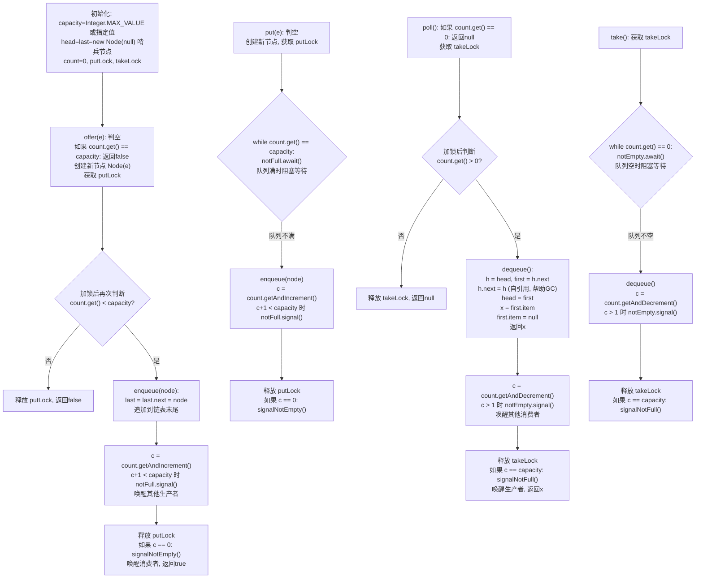
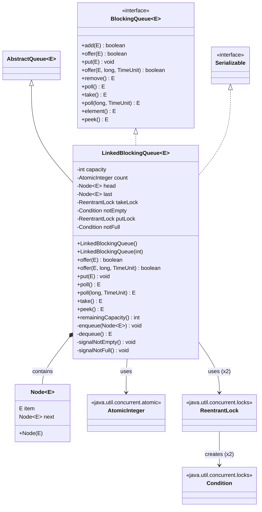

## 引言

为什么 `Executors.newFixedThreadPool()` 和 `newSingleThreadExecutor()` 都默认选择 `LinkedBlockingQueue`？

因为它在生产者和消费者之间存在一个精妙的平衡：两把独立的锁（`putLock` 和 `takeLock`）让入队和出队可以完全并行执行，相比 `ArrayBlockingQueue` 的单锁方案在高并发下有显著的性能优势。但代价是每个元素需要额外分配一个 Node 对象，以及跨锁信号传递带来的微小开销。

本文将从源码级别深入剖析 LinkedBlockingQueue 的核心设计，带你理解：

1. 双锁设计如何实现读写完全并发（putLock + takeLock 的操作域分离）
2. 哨兵节点（Dummy Node）的精妙作用与角色转换
3. `AtomicInteger count` 为什么不用两把锁各自的计数？
4. 默认 `Integer.MAX_VALUE` 容量的 OOM 风险

由于 `LinkedBlockingQueue` 实现了 `BlockingQueue` 接口，而 `BlockingQueue` 接口中定义了几组放数据和取数据的方法，来满足不同的场景。

| 操作 | 抛出异常 | 返回特定值 | 一直阻塞 | 阻塞指定时间 |
| --- | --- | --- | --- | --- |
| 放数据 | add() | offer() | put() | offer(e, time, unit) |
| 取数据（同时删除） | remove() | poll() | take() | poll(time, unit) |
| 查看数据（不删除） | element() | peek() | 不支持 | 不支持 |

**这四组方法的区别是：**

1. 当队列满的时候，再次添加数据：`add()` 会抛出异常，`offer()` 会返回 `false`，`put()` 会一直阻塞，`offer(e, time, unit)` 会阻塞指定时间后返回 `false`。
2. 当队列为空的时候，再次取数据：`remove()` 会抛出异常，`poll()` 会返回 `null`，`take()` 会一直阻塞，`poll(time, unit)` 会阻塞指定时间后返回 `null`。

> [!TIP] 💡 核心提示
> `LinkedBlockingQueue` 是 Java 线程池（`Executors.newFixedThreadPool` 和 `newSingleThreadExecutor`）的默认任务队列，理解它等于理解了线程池的任务调度基石。

Java 线程池中的固定大小线程池就是基于 `LinkedBlockingQueue` 实现的：

```java
// 创建固定大小的线程池
ExecutorService executorService = Executors.newFixedThreadPool(10);
```

对应的源码实现：

```java
// 底层使用 LinkedBlockingQueue 队列存储任务
public static ExecutorService newFixedThreadPool(int nThreads) {
    return new ThreadPoolExecutor(nThreads, nThreads,
                                  0L, TimeUnit.MILLISECONDS,
                                  new LinkedBlockingQueue<Runnable>());
}
```

`LinkedBlockingQueue` 的核心工作原理可以用下面的流程图概括：



## 类结构

先看一下 `LinkedBlockingQueue` 类里面有哪些属性：

```java
public class LinkedBlockingQueue<E>
        extends AbstractQueue<E>
        implements BlockingQueue<E>, java.io.Serializable {

    /**
     * 容量大小（未指定时为 Integer.MAX_VALUE）
     */
    private final int capacity;

    /**
     * 元素个数，使用 AtomicInteger 保证可见性和原子性
     */
    private final AtomicInteger count = new AtomicInteger();

    /**
     * 头节点（哨兵节点，item 始终为 null）
     */
    transient Node<E> head;

    /**
     * 尾节点
     */
    private transient Node<E> last;

    /**
     * 取数据的锁（takeLock），只保护出队操作
     */
    private final ReentrantLock takeLock = new ReentrantLock();

    /**
     * 取数据的条件队列（队列非空时唤醒消费者）
     */
    private final Condition notEmpty = takeLock.newCondition();

    /**
     * 放数据的锁（putLock），只保护入队操作
     */
    private final ReentrantLock putLock = new ReentrantLock();

    /**
     * 放数据的条件队列（队列非满时唤醒生产者）
     */
    private final Condition notFull = putLock.newCondition();

    /**
     * 链表节点类
     */
    static class Node<E> {

        /**
         * 节点元素
         */
        E item;

        /**
         * 后继节点
         */
        Node<E> next;

        Node(E x) {
            item = x;
        }
    }
}
```

可以看出 `LinkedBlockingQueue` 底层是基于链表实现的，定义了头节点 `head` 和尾节点 `last`，由链表节点类 `Node` 可以看出是个单链表。

### Mermaid 类图



`LinkedBlockingQueue` 最核心的设计是**两把独立的锁**：`takeLock` 用于保护出队操作，`putLock` 用于保护入队操作。这意味着生产者和消费者可以**并发执行**，互不阻塞。而 `ArrayBlockingQueue` 只使用了一把锁，入队出队操作共用这把锁。

为什么 `ArrayBlockingQueue` 不能这样设计？因为 `ArrayBlockingQueue` 基于数组实现，所有数据存储在同一个数组对象里，`takeIndex` 和 `putIndex` 都在同一数组上操作，对同一个数组使用两把锁会有数据可见性问题。而 `LinkedBlockingQueue` 从头节点删除、尾节点插入，头尾节点是不同的引用，可以分别使用两把锁，提升并发性能。

`count` 使用 `AtomicInteger` 而不是普通 `int`，是因为生产者和消费者各自持有不同的锁，需要一个跨锁的原子变量来同步元素个数。

## 为什么用两把锁

这是 `LinkedBlockingQueue` 最值得深入理解的设计决策。

### ArrayBlockingQueue 单锁模型的局限

`ArrayBlockingQueue` 使用一把 `ReentrantLock` 同时保护入队和出队：

```
[生产者A] ──┐
[生产者B] ──┤── 争用同一把 lock ──→ [数组 + putIndex/takeIndex]
[消费者C] ──┤
[消费者D] ──┘
```

任何时刻，只有一个线程能执行入队 **或** 出队。即使队列既有空位又有元素，生产者和消费者也不能同时工作。

### LinkedBlockingQueue 双锁模型的突破

```
[生产者A] ──┐                     ┌── [链表尾部 last]
[生产者B] ──┤── putLock ──────────┤
            │                     │
            │    [count: AtomicInteger]  ← 跨锁共享
            │                     │
[消费者C] ──┤── takeLock ─────────┤
[消费者D] ──┘                     └── [链表头部 head]
```

生产者只在 `putLock` 上竞争，消费者只在 `takeLock` 上竞争。两条流水线并行运转，只要队列非空非满，生产和消费可以**同时进行**。

### 性能对比

| 维度 | ArrayBlockingQueue（单锁） | LinkedBlockingQueue（双锁） |
| --- | --- | --- |
| 入队并发 | 串行（互斥） | 串行（putLock 内互斥） |
| 出队并发 | 串行（互斥） | 串行（takeLock 内互斥） |
| **入队 + 出队并发** | 串行（同一把锁） | **并行（不同锁）** |
| 吞吐量（多生产多消费） | 较低 | 较高 |
| 内存开销 | 低（数组预分配） | 高（每元素一个 Node 对象） |

> [!TIP] 💡 核心提示
> 双锁设计的精髓在于**操作区域分离**——入队只操作尾部（`last`），出队只操作头部（`head`），两个操作不共享任何可变对象。`count` 虽然是共享的，但它是原子操作，不需要锁保护。

### 为什么 ArrayBlockingQueue 不能用双锁

根本原因是**数据存储单元的共享**。数组是一个连续内存块，`putIndex` 写入和 `takeIndex` 读取虽然位置不同，但它们：

1. **共享同一个数组对象**，修改 `array[putIndex]` 和读取 `array[takeIndex]` 涉及同一块内存；
2. **环形索引相互依赖**，`putIndex` 和 `takeIndex` 都在循环移动，需要强一致性保证不会覆盖未消费的元素；
3. **内存可见性**，即使将入队和出队分开上锁，对数组元素的写入和读取之间仍然需要 happens-before 关系来保证可见性。

而 `LinkedBlockingQueue` 的链表天然解耦：每个 `Node` 是独立对象，`last.next = newNode` 和 `head = head.next` 操作的是不同的引用，不存在内存可见性冲突。

## 初始化

`LinkedBlockingQueue` 常用的初始化方法有两个：

1. 无参构造方法
2. 指定容量大小的有参构造方法

```java
/**
 * 无参构造方法
 */
BlockingQueue<Integer> queue1 = new LinkedBlockingQueue<>();

/**
 * 指定容量大小的构造方法
 */
BlockingQueue<Integer> queue2 = new LinkedBlockingQueue<>(10);
```

再看一下对应的源码实现：

```java
/**
 * 无参构造方法
 */
public LinkedBlockingQueue() {
    this(Integer.MAX_VALUE);
}

/**
 * 指定容量大小的构造方法
 */
public LinkedBlockingQueue(int capacity) {
    if (capacity <= 0) {
        throw new IllegalArgumentException();
    }
    // 设置容量大小，初始化头尾节点
    this.capacity = capacity;
    last = head = new Node<E>(null);
}
```

可以看出 `LinkedBlockingQueue` 的无参构造方法使用的容量是 `Integer.MAX_VALUE`（约 21 亿），存储大量数据的时候，会有内存溢出的风险，**建议使用有参构造方法，指定容量大小**。

> [!IMPORTANT] 💡 核心提示：哨兵节点的设计精妙之处
>
> `last = head = new Node<E>(null)` 这一行创建了一个**哨兵节点**（dummy node），这是整个队列设计最巧妙的地方：
>
> 1. **统一出队逻辑**：哨兵节点的 `item` 始终为 `null`，真正的第一个元素是 `head.next`。出队时只需删除 `head.next`，无需判断队列是否为空——空队列时 `head.next` 就是 `null`，逻辑天然成立。
> 2. **优雅的角色转换**：每次 `dequeue` 时，原 `head.next` 变成新的 `head`，其 `item` 被取出并置为 `null`，它就变成了新的哨兵节点。节点在"数据节点"和"哨兵节点"之间无缝切换。
> 3. **初始状态简洁**：空队列时 `head == last`，判断队列是否为空只需 `head == last` 或 `count == 0`，不需要额外的边界条件。
> 4. **避免 null 元素歧义**：哨兵节点的 `item` 为 `null`，但这是实现细节而非用户数据（`LinkedBlockingQueue` 不允许插入 `null`），所以不会产生歧义。

有参构造方法还会初始化头尾节点，节点值为 `null`。这里创建的是一个**哨兵节点**（dummy node），`head` 和 `last` 指向同一个节点，节点的 `item` 为 `null`。后续插入元素时，哨兵节点始终是 `head`，真正的第一个元素是 `head.next`。这种设计的好处是 `dequeue` 方法可以统一处理：始终删除 `head.next`，不需要特殊判断队列是否为空。

`LinkedBlockingQueue` 初始化的时候，不支持指定是否使用公平锁，只能使用非公平锁。而 `ArrayBlockingQueue` 是支持指定的。

## 放数据源码

放数据的方法有四个：

| 操作 | 抛出异常 | 返回特定值 | 阻塞 | 阻塞一段时间 |
| --- | --- | --- | --- | --- |
| 放数据 | add() | offer() | put() | offer(e, time, unit) |

### offer 方法源码

先看一下 `offer()` 方法源码：

```java
/**
 * offer 方法入口
 *
 * @param e 元素
 * @return 是否插入成功
 */
public boolean offer(E e) {
    // 1. 判空，传参不允许为 null
    if (e == null) {
        throw new NullPointerException();
    }
    // 2. 快速失败：如果队列已满，直接返回 false（无需加锁）
    final AtomicInteger count = this.count;
    if (count.get() == capacity) {
        return false;
    }
    int c = -1;
    Node<E> node = new Node<E>(e);
    // 3. 获取 put 锁
    final ReentrantLock putLock = this.putLock;
    putLock.lock();
    try {
        // 4. 加锁后再次判断队列是否已满（双重检查），如果未满则入队
        if (count.get() < capacity) {
            enqueue(node);
            // 5. 元素个数加一
            c = count.getAndIncrement();
            // 6. 如果入队后队列仍未满，唤醒其他等待的生产者
            if (c + 1 < capacity) {
                notFull.signal();
            }
        }
    } finally {
        // 7. 释放 put 锁
        putLock.unlock();
    }
    // 8. c 等于 0 表示插入前队列为空，需要唤醒等待的消费者
    if (c == 0) {
        signalNotEmpty();
    }
    return c >= 0;
}

/**
 * 入队
 *
 * @param node 节点
 */
private void enqueue(LinkedBlockingQueue.Node<E> node) {
    // 直接追加到链表末尾
    last = last.next = node;
}

/**
 * 唤醒因为队列为空而等待取数据的线程
 */
private void signalNotEmpty() {
    final ReentrantLock takeLock = this.takeLock;
    takeLock.lock();
    try {
        notEmpty.signal();
    } finally {
        takeLock.unlock();
    }
}
```

`offer()` 的逻辑：判空 → **快速检查**队列是否已满（避免不必要的加锁） → 加 `putLock` → **双重检查**（防止在等待锁期间其他线程已把队列填满） → 入队 → 计数加一 → 如果队列仍未满，唤醒其他等待的生产者 → 释放锁 → 如果插入前队列为空（`c == 0`），唤醒等待的消费者。

**为什么要两次检查 `count`？** 第一次检查（无锁）是为了快速失败，如果队列已满就不需要加锁了。第二次检查（加锁后）是因为在等待锁的过程中，可能有消费者取走了元素，导致队列不再满，所以需要加锁后再次确认。

`signalNotEmpty()` 方法中为什么要获取 `takeLock`？因为 `notEmpty` 条件变量是基于 `takeLock` 创建的，调用 `signal()` 之前必须先持有对应的锁。

> [!TIP] 💡 核心提示
> 注意 `signalNotEmpty()` 是在**释放 putLock 之后**才调用的。这是因为 `notEmpty` 关联的是 `takeLock`，必须在 `putLock` 外获取 `takeLock`。虽然多了一次锁获取，但避免了在持有 `putLock` 时再获取 `takeLock` 造成的锁嵌套。

### add 方法源码

`add()` 方法在队列满的时候会抛出异常，底层基于 `offer()` 实现：

```java
/**
 * add 方法入口
 *
 * @param e 元素
 * @return 是否添加成功
 */
public boolean add(E e) {
    if (offer(e)) {
        return true;
    } else {
        throw new IllegalStateException("Queue full");
    }
}
```

### put 方法源码

`put()` 方法在队列满的时候会一直阻塞，直到有其他线程取走数据、空出位置，才能添加成功。

```java
/**
 * put 方法入口
 *
 * @param e 元素
 */
public void put(E e) throws InterruptedException {
    // 1. 判空，传参不允许为 null
    if (e == null) {
        throw new NullPointerException();
    }
    int c = -1;
    Node<E> node = new Node<E>(e);
    // 2. 加可中断的锁
    final ReentrantLock putLock = this.putLock;
    putLock.lockInterruptibly();
    final AtomicInteger count = this.count;
    try {
        // 3. 如果队列已满，就一直阻塞在 notFull 条件上
        while (count.get() == capacity) {
            notFull.await();
        }
        // 4. 队列未满，直接入队
        enqueue(node);
        c = count.getAndIncrement();
        // 5. 如果入队后队列仍未满，唤醒其他等待的生产者
        if (c + 1 < capacity) {
            notFull.signal();
        }
    } finally {
        // 6. 释放 put 锁
        putLock.unlock();
    }
    // 7. c 等于 0 表示插入前队列为空，需要唤醒等待的消费者
    if (c == 0) {
        signalNotEmpty();
    }
}
```

注意这里使用 `while` 循环而不是 `if` 判断，是因为存在**虚假唤醒**的可能——线程可能在没有被 `signal()` 的情况下被唤醒。用 `while` 可以在唤醒后重新检查条件是否真的满足。

### offer(e, time, unit) 源码

`offer(e, time, unit)` 方法在队列满的时候会阻塞指定时间，超时后返回 `false`。

```java
/**
 * offer 方法入口
 *
 * @param e       元素
 * @param timeout 超时时间
 * @param unit    时间单位
 * @return 是否添加成功
 */
public boolean offer(E e, long timeout, TimeUnit unit) throws InterruptedException {
    // 1. 判空，传参不允许为 null
    if (e == null) {
        throw new NullPointerException();
    }
    // 2. 把超时时间转换为纳秒
    long nanos = unit.toNanos(timeout);
    int c = -1;
    final AtomicInteger count = this.count;
    // 3. 加可中断的锁
    final ReentrantLock putLock = this.putLock;
    putLock.lockInterruptibly();
    try {
        // 4. 循环判断队列是否已满
        while (count.get() == capacity) {
            if (nanos <= 0) {
                // 5. 如果超时时间已过，返回 false
                return false;
            }
            // 6. 在 notFull 条件上等待指定纳秒数
            nanos = notFull.awaitNanos(nanos);
        }
        // 7. 队列未满，执行入队
        enqueue(new Node<E>(e));
        c = count.getAndIncrement();
        // 8. 如果入队后队列仍未满，唤醒其他等待的生产者
        if (c + 1 < capacity) {
            notFull.signal();
        }
    } finally {
        // 9. 释放 put 锁
        putLock.unlock();
    }
    // 10. c 等于 0 表示插入前队列为空，需要唤醒等待的消费者
    if (c == 0) {
        signalNotEmpty();
    }
    return true;
}
```

## 取数据源码

取数据（取出并删除）的方法有四个：

| 操作 | 抛出异常 | 返回特定值 | 阻塞 | 阻塞一段时间 |
| --- | --- | --- | --- | --- |
| 取数据（同时删除） | remove() | poll() | take() | poll(time, unit) |

### poll 方法源码

看一下 `poll()` 方法源码：

```java
/**
 * poll 方法入口
 */
public E poll() {
    // 1. 快速检查：如果队列为空，返回 null
    final AtomicInteger count = this.count;
    if (count.get() == 0) {
        return null;
    }
    E x = null;
    int c = -1;
    // 2. 获取 take 锁
    final ReentrantLock takeLock = this.takeLock;
    takeLock.lock();
    try {
        // 3. 加锁后再次判断队列是否不为空，然后出队
        if (count.get() > 0) {
            x = dequeue();
            // 4. 元素个数减一
            c = count.getAndDecrement();
            // 5. 如果出队后队列仍不为空，唤醒其他等待的消费者
            if (c > 1) {
                notEmpty.signal();
            }
        }
    } finally {
        // 6. 释放 take 锁
        takeLock.unlock();
    }
    // 7. 如果取数据之前队列已满（c == capacity），取数据后队列肯定不满了
    //    唤醒等待的生产者
    if (c == capacity) {
        signalNotFull();
    }
    return x;
}

/**
 * 取出队头元素
 */
private E dequeue() {
    Node<E> h = head;
    // head 是哨兵节点，真正的第一个元素是 head.next
    Node<E> first = h.next;
    // 让哨兵节点的 next 指向自己（帮助 GC 回收旧的 head）
    h.next = h;
    // head 移动到原来的第一个元素
    head = first;
    // 取出元素值
    E x = first.item;
    // 将新 head 的 item 置为 null（新 head 变成哨兵节点）
    first.item = null;
    return x;
}

/**
 * 唤醒因为队列已满而等待放数据的线程
 */
private void signalNotFull() {
    final ReentrantLock putLock = this.putLock;
    putLock.lock();
    try {
        notFull.signal();
    } finally {
        putLock.unlock();
    }
}
```

`dequeue` 方法中有个巧妙的设计：`h.next = h`，让旧哨兵节点的 `next` 指向自己。这使得旧的哨兵节点形成了一个自引用环，与链表断开连接，帮助 GC 回收。然后 `head` 移动到原来第一个元素的位置，该元素的 `item` 被取出返回，同时 `item` 被置为 `null`——新的哨兵节点不持有数据引用，这是 **GC 友好** 的设计。

> [!TIP] 💡 核心提示
> `dequeue` 中的 `h.next = h` 自引用是 JDK 中经典的 GC 辅助技巧。自引用形成一个孤岛环，GC 的可达性分析会将整个环标记为不可达（因为没有外部引用指向它），从而一次性回收。如果不这样做，旧哨兵节点通过 `next` 仍然指向后续节点，可能导致整条旧链表无法被回收。

### remove 方法源码

`remove()` 方法在队列为空时会抛出异常：

```java
/**
 * remove 方法入口
 */
public E remove() {
    // 1. 直接调用 poll 方法
    E x = poll();
    // 2. 如果取到数据，直接返回，否则抛出异常
    if (x != null) {
        return x;
    } else {
        throw new NoSuchElementException();
    }
}
```

除了从队头删除元素外，`LinkedBlockingQueue` 还提供了删除指定元素的方法 `remove(Object o)`：

```java
/**
 * 删除指定元素
 */
public boolean remove(Object o) {
    if (o == null) return false;
    // 需要同时获取两把锁，保证删除期间不会有其他线程修改
    final ReentrantLock putLock = this.putLock;
    final ReentrantLock takeLock = this.takeLock;
    putLock.lock();
    try {
        takeLock.lock();
        try {
            // 从 head.next 开始线性遍历查找
            for (Node<E> trail = head, p = trail.next;
                 p != null;
                 trail = p, p = p.next) {
                if (o.equals(p.item)) {
                    unlink(p, trail);
                    return true;
                }
            }
            return false;
        } finally {
            takeLock.unlock();
        }
    } finally {
        putLock.unlock();
    }
}
```

`remove(Object o)` 需要**同时获取两把锁**，因为删除操作既影响队列的尾部（可能需要通知生产者）又影响头部（可能需要通知消费者）。从 `head.next` 开始线性遍历查找（O(n)），找到后调用 `unlink` 断开节点。

> [!WARNING] 💡 核心提示
> `remove(Object o)` 是性能杀手：O(n) 遍历 + 双锁竞争。在高并发场景下频繁调用会导致严重的锁竞争和遍历开销。如果需要按值删除，应优先在业务层面设计，避免依赖队列的 `remove(Object)`。

### take 方法源码

`take()` 方法在队列为空时会一直阻塞，直到被唤醒：

```java
/**
 * take 方法入口
 */
public E take() throws InterruptedException {
    E x;
    int c = -1;
    final AtomicInteger count = this.count;
    // 1. 加可中断的锁
    final ReentrantLock takeLock = this.takeLock;
    takeLock.lockInterruptibly();
    try {
        // 2. 如果队列为空，就一直阻塞在 notEmpty 条件上
        while (count.get() == 0) {
            notEmpty.await();
        }
        // 3. 队列不为空，执行出队
        x = dequeue();
        // 4. 元素个数减一
        c = count.getAndDecrement();
        // 5. 如果出队后队列仍不为空，唤醒其他等待的消费者
        if (c > 1) {
            notEmpty.signal();
        }
    } finally {
        // 6. 释放 take 锁
        takeLock.unlock();
    }
    // 7. 如果取数据之前队列已满，取数据后队列肯定不满了
    //    唤醒等待的生产者
    if (c == capacity) {
        signalNotFull();
    }
    return x;
}
```

### poll(time, unit) 源码

`poll(time, unit)` 方法在队列为空时会阻塞指定时间，超时后返回 `null`。

```java
/**
 * poll 方法入口
 *
 * @param timeout 超时时间
 * @param unit    时间单位
 * @return 元素
 */
public E poll(long timeout, TimeUnit unit) throws InterruptedException {
    E x = null;
    int c = -1;
    // 1. 把超时时间转换成纳秒
    long nanos = unit.toNanos(timeout);
    final AtomicInteger count = this.count;
    // 2. 加可中断的锁
    final ReentrantLock takeLock = this.takeLock;
    takeLock.lockInterruptibly();
    try {
        // 3. 循环判断队列是否为空
        while (count.get() == 0) {
            if (nanos <= 0) {
                // 4. 如果超时时间已过，返回 null
                return null;
            }
            // 5. 在 notEmpty 条件上等待指定纳秒数
            nanos = notEmpty.awaitNanos(nanos);
        }
        // 6. 队列不为空，执行出队
        x = dequeue();
        // 7. 元素个数减一
        c = count.getAndDecrement();
        // 8. 如果出队后队列仍不为空，唤醒其他等待的消费者
        if (c > 1) {
            notEmpty.signal();
        }
    } finally {
        // 9. 释放 take 锁
        takeLock.unlock();
    }
    // 10. 如果取数据之前队列已满，取数据后队列肯定不满了
    //     唤醒等待的生产者
    if (c == capacity) {
        signalNotFull();
    }
    return x;
}
```

`poll(time, unit)` 与 `take()` 方法逻辑类似，区别在于 `take()` 在队列为空时会一直阻塞，而 `poll(time, unit)` 只会阻塞指定的超时时间。

## 查看数据源码

查看数据，并不删除。

| 操作 | 抛出异常 | 返回特定值 | 阻塞 | 阻塞一段时间 |
| --- | --- | --- | --- | --- |
| 查看数据（不删除） | element() | peek() | 不支持 | 不支持 |

### peek 方法源码

`peek()` 方法在队列为空时返回 `null`：

```java
/**
 * peek 方法入口
 */
public E peek() {
    // 1. 快速检查：如果队列为空，返回 null
    if (count.get() == 0) {
        return null;
    }
    // 2. 加 take 锁
    final ReentrantLock takeLock = this.takeLock;
    takeLock.lock();
    try {
        // 3. 返回队头元素（head.next），如果为 null 则返回 null
        Node<E> first = head.next;
        if (first == null) {
            return null;
        } else {
            return first.item;
        }
    } finally {
        // 4. 释放 take 锁
        takeLock.unlock();
    }
}
```

### element 方法源码

`element()` 方法在队列为空时抛出异常：

```java
/**
 * element 方法入口
 */
public E element() {
    // 1. 调用 peek 方法查询数据
    E x = peek();
    // 2. 如果查到数据，直接返回
    if (x != null) {
        return x;
    } else {
        // 3. 如果没找到，则抛出异常
        throw new NoSuchElementException();
    }
}
```

## 生产环境避坑指南

在实际项目中使用 `LinkedBlockingQueue`，以下陷阱最容易踩到：

| 坑点 | 现象 | 根因 | 解决方案 |
| --- | --- | --- | --- |
| **无参构造默认 Integer.MAX_VALUE** | 生产环境 OOM，堆内存被打满 | 生产者速率 > 消费者速率，队列无限增长，每个元素都是一个 Node 对象 | **始终使用有参构造**指定合理容量，如 `new LinkedBlockingQueue<>(1000)` |
| **remove(Object) 性能杀手** | 频繁调用导致 CPU 飙升、线程阻塞 | O(n) 遍历 + 同时获取两把锁，遍历期间其他线程的入队出队全部阻塞 | 业务层避免调用，改为在消费端做逻辑过滤 |
| **signalNotEmpty/signalNotFull 跨锁获取** | 偶发死锁或性能抖动 | `signalNotEmpty` 在持有 `takeLock` 时调用，如果此时有其他线程也尝试同时获取两把锁 | JDK 已保证不会死锁（先释放再获取），但高并发下频繁跨锁会影响吞吐，**合理控制队列容量可减少跨锁频率** |
| **Node 对象 GC 压力** | Full GC 频繁，停顿时间长 | 每个入队元素都创建一个 Node 对象，高吞吐场景下年轻代快速填满 | 控制队列容量上限；监控 GC 日志；必要时切换到 `ArrayBlockingQueue` |
| **单生产者单消费者场景选错队列** | 性能不如 ArrayBlockingQueue | 双锁优势只在多线程并发时体现，1:1 场景两把锁反而增加了额外开销 | 单生产单消费场景优先选 `ArrayBlockingQueue` 或 `SynchronousQueue` |
| **迭代器弱一致性** | 遍历时看不到最新插入的元素 | `iterator()` 快照只反映创建时刻的状态，后续修改不反映 | 不要在遍历时依赖实时一致性，需要强一致性时先 `drainTo` 到集合 |

## 总结

这篇文章讲解了 `LinkedBlockingQueue` 阻塞队列的核心源码，了解到 `LinkedBlockingQueue` 具有以下特点：

1. `LinkedBlockingQueue` 实现了 `BlockingQueue` 接口，提供了四组放数据和取数据的方法，满足不同场景需求。
2. 底层基于链表实现，支持从头部弹出数据，从尾部添加数据。
3. 如果不指定队列长度，默认容量是 `Integer.MAX_VALUE`（约 21 亿），有内存溢出风险，**建议初始化时指定队列长度**。
4. 使用**两把独立的锁**（`takeLock` 和 `putLock`），生产者和消费者可以并发执行，比 `ArrayBlockingQueue` 的单锁设计性能更好。
5. 采用**哨兵节点**设计，统一了入队出队的边界处理，同时保证 GC 友好。

### ArrayBlockingQueue 与 LinkedBlockingQueue 对比

**相同点：**

1. 都继承自 `AbstractQueue` 抽象类，并实现了 `BlockingQueue` 接口，所以拥有相同的读写方法，在很多场景下可以相互替换。

**不同点：**

| 对比维度 | ArrayBlockingQueue | LinkedBlockingQueue |
| --- | --- | --- |
| **底层结构** | 数组 | 链表（Node） |
| **容量** | 必须指定，固定大小 | 默认 Integer.MAX_VALUE，建议指定 |
| **内存开销** | 低（预分配数组） | 高（每元素一个 Node 对象） |
| **锁设计** | 单把锁，入队出队互斥 | 两把锁，入队出队可并行 |
| **公平锁** | 支持指定 | 仅支持非公平锁 |
| **适用场景** | 明确限制队列大小，防止 OOM | 高并发生产者-消费者，追求高吞吐 |

### 关键操作时间复杂度对比

| 操作 | 方法 | 时间复杂度 | 说明 |
| --- | --- | --- | --- |
| 入队 | offer/put/add | O(1) | 创建节点并追加到链表末尾 |
| 出队 | poll/take/remove() | O(1) | 删除 head.next 节点 |
| 查看队头 | peek/element | O(1) | 直接返回 head.next.item |
| 删除指定元素 | remove(Object) | O(n) | 需线性遍历查找 + 同时获取两把锁 |
| 剩余容量 | remainingCapacity | O(1) | 返回 capacity - count.get() |

### 使用建议

1. **务必指定容量上限**：无参构造的默认容量是 `Integer.MAX_VALUE`，如果生产者速率远大于消费者，会不断创建新节点，最终导致 OOM。除非你明确知道消息量很小，否则都应该指定合理的容量。
2. **高并发场景优先选择 LinkedBlockingQueue**：如果生产者和消费者都是多线程并发执行，`LinkedBlockingQueue` 的两锁设计可以让生产和消费互不干扰，吞吐量显著高于 `ArrayBlockingQueue`。但如果只有一个生产者和一个消费者，两把锁的优势不明显。
3. **注意每个 Node 对象的额外开销**：每个链表节点都是一个 `Node` 对象，除了存储元素本身的数据外，还需要额外的对象头（~12-16 字节）和 `next` 引用（~4-8 字节）。在元素量大的场景下，内存开销会比 `ArrayBlockingQueue` 的数组高不少。
4. **删除任意元素成本高**：`remove(Object)` 需要同时获取两把锁并线性遍历整个链表，在并发场景下性能很差。如果需要频繁按值删除元素，应考虑其他数据结构。

## 行动清单

读完本文后，建议按照以下清单逐项实践，真正把知识转化为能力：

1. **检查现有代码**：搜索项目中的 `new LinkedBlockingQueue<>()`（无参构造），全部替换为 `new LinkedBlockingQueue<>(合理容量)`，避免线上 OOM 风险。
2. **基准测试对比**：在自己的业务场景中，分别用 `ArrayBlockingQueue` 和 `LinkedBlockingQueue` 做压测，对比多线程生产者-消费者场景下的吞吐量差异，用数据说话。
3. **画出内存布局图**：动手画出 `LinkedBlockingQueue` 从空队列到插入 3 个元素后的内存状态（哨兵节点、head/last 的指向变化），加深理解。
4. **阅读 unlink 源码**：本文未展开的 `unlink(Node<E>, Node<E>)` 方法处理了中间节点删除的逻辑，阅读它并理解为什么需要同时获取两把锁。
5. **监控队列深度**：在生产环境中通过 JMX 或 Micrometer 监控队列的 `size()` 和 `remainingCapacity()`，设置告警阈值，提前发现消费瓶颈。
6. **对比 SynchronousQueue**：阅读 `SynchronousQueue` 源码，理解它和 `LinkedBlockingQueue` 在 `newCachedThreadPool` 中的应用差异，建立完整的线程池队列选型知识体系。
