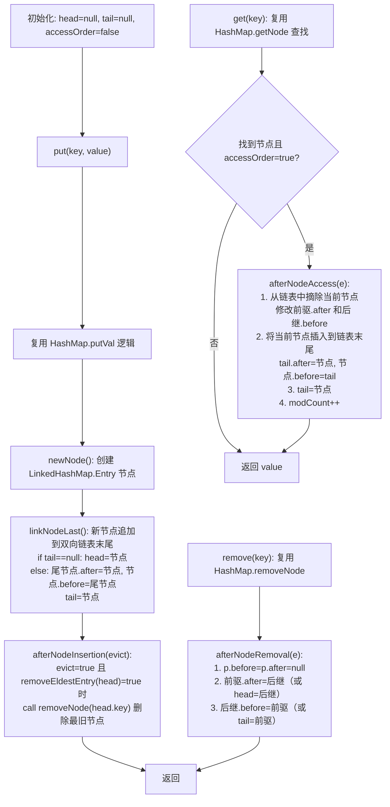

这是解读Java源码系列的第五篇，将跟大家一起学习Java中比较神秘的数据结构 —— LinkedHashMap。

## 引言
新手程序员在使用 `HashMap` 的时候，会有个疑问：为什么存到 `HashMap` 中的数据不是有序的？

这其实跟 `HashMap` 的底层设计有关。`HashMap` 并不是像 `ArrayList` 那样按照元素的插入顺序存储，而是先计算 key 的哈希值，再通过哈希值算出数组下标，存储到对应位置。不同 key 的哈希值差别很大，所以在数组中的存储位置也是无序的。

然而，有时候我们在遍历 `HashMap` 的时候，又希望按照元素插入顺序迭代，有没有什么方式能实现这个需求？

有的，就是今天的主角 `LinkedHashMap`。它在保证 `HashMap` 高性能的同时，实现了按照元素插入顺序或者访问顺序进行迭代。

在这篇文章中，你将学到以下内容：

1. `LinkedHashMap` 与 `HashMap` 的区别？
2. `LinkedHashMap` 的特点有哪些？
3. `LinkedHashMap` 底层实现原理？
4. 怎么使用 `LinkedHashMap` 实现 LRU 缓存？

## 简介
`LinkedHashMap` 继承自 `HashMap`，是 `HashMap` 的子类。它在 `HashMap` 的基础上额外维护了一个双向链表，用来记录元素的插入顺序或访问顺序，用空间换时间。

与 `HashMap` 相比，`LinkedHashMap` 有三个优势：

1. **维护插入顺序**：支持以元素插入顺序进行迭代，遍历时返回的结果与插入顺序一致。
2. **维护访问顺序**：支持以元素访问顺序进行迭代。最近访问或更新的元素会被移动到链表末尾，类似于 `LRU（Least Recently Used，最近最少使用）` 策略。面试时手写 LRU 缓存，可以参考 `LinkedHashMap` 的实现。
3. **迭代效率更高**：遍历时只需遍历双向链表，不需要遍历整个哈希数组。


`LinkedHashMap` 默认按照元素的**插入顺序**进行遍历：

```java
Map<Integer, String> map = new LinkedHashMap<>();
map.put(1, "One");
map.put(2, "Two");
map.put(3, "Three");
System.out.println(map); // 输出: {1=One, 2=Two, 3=Three}

// 访问元素后，不改变元素顺序
map.get(2);
System.out.println(map); // 输出: {1=One, 2=Two, 3=Three}
```

`LinkedHashMap` 也可以指定按照元素的**访问顺序**进行遍历（构造方法第三个参数传 `true`）：

```java
// true 表示按照访问顺序进行遍历
Map<Integer, String> map = new LinkedHashMap<>(16, 0.75f, true);
map.put(1, "One");
map.put(2, "Two");
map.put(3, "Three");
System.out.println(map); // 输出: {1=One, 2=Two, 3=Three}

// 访问元素后，会改变元素顺序（被访问的 key 2 移到末尾）
map.get(2);
System.out.println(map); // 输出: {1=One, 3=Three, 2=Two}
```

`LinkedHashMap` 的核心工作原理可以用下面的流程图概括：



## 类属性
```java
public class LinkedHashMap<K, V> extends HashMap<K, V> implements Map<K, V> {

    /**
     * 双向链表的头节点（最老的节点）
     */
    transient Entry<K, V> head;

    /**
     * 双向链表的尾节点（最新的节点）
     */
    transient Entry<K, V> tail;

    /**
     * 迭代排序方式：true 表示按照访问顺序，false 表示按照插入顺序
     */
    final boolean accessOrder;

    /**
     * 双向链表的节点类，继承自 HashMap.Node
     */
    static class Entry<K, V> extends HashMap.Node<K, V> {
        /**
         * 双链表的前驱节点和后继节点
         */
        Entry<K, V> before, after;

        Entry(int hash, K key, V value, Node<K, V> next) {
            super(hash, key, value, next);
        }
    }

}
```

可以看出，`LinkedHashMap` 继承自 `HashMap`，在 `HashMap` 的 `Node` 节点基础上增加了 `before`（前驱）和 `after`（后继）两个引用，扩展成双向链表的 `Entry` 节点。同时记录了 `head`、`tail` 和迭代排序方式 `accessOrder`。

## 初始化
`LinkedHashMap` 常见的初始化方法有四个：

1. 无参初始化
2. 指定容量大小的初始化
3. 指定容量大小、负载系数的初始化
4. 指定容量大小、负载系数、迭代顺序的初始化

```java
/**
 * 无参初始化
 */
Map<Integer, Integer> map1 = new LinkedHashMap<>();

/**
 * 指定容量大小的初始化
 */
Map<Integer, Integer> map2 = new LinkedHashMap<>(16);

/**
 * 指定容量大小、负载系数的初始化
 */
Map<Integer, Integer> map3 = new LinkedHashMap<>(16, 0.75f);

/**
 * 指定容量大小、负载系数、迭代顺序的初始化
 */
Map<Integer, Integer> map4 = new LinkedHashMap<>(16, 0.75f, true);
```

再看一下构造方法的底层实现：

```java
/**
 * 无参初始化
 */
public LinkedHashMap() {
    super();
    accessOrder = false;
}

/**
 * 指定容量大小的初始化
 */
public LinkedHashMap(int initialCapacity) {
    super(initialCapacity);
    accessOrder = false;
}

/**
 * 指定容量大小、负载系数的初始化
 *
 * @param initialCapacity 初始容量
 * @param loadFactor      负载系数
 */
public LinkedHashMap(int initialCapacity, float loadFactor) {
    super(initialCapacity, loadFactor);
    accessOrder = false;
}

/**
 * 指定容量大小、负载系数、迭代顺序的初始化
 *
 * @param initialCapacity 初始容量
 * @param loadFactor      负载系数
 * @param accessOrder     迭代顺序，true 表示按照访问顺序，false 表示按照插入顺序
 */
public LinkedHashMap(int initialCapacity,
                     float loadFactor,
                     boolean accessOrder) {
    super(initialCapacity, loadFactor);
    this.accessOrder = accessOrder;
}
```

`LinkedHashMap` 的构造方法底层全部调用 `HashMap` 的对应构造方法。`accessOrder` 默认是 `false`（按插入顺序迭代），可以通过第三个参数指定为 `true`（按访问顺序迭代）。

## put 源码

`LinkedHashMap` 的 `put` 方法完全复用 `HashMap` 的 `put` 方法，没有重新实现。不过 `HashMap` 中定义了三个空方法作为钩子（hook），留给子类 `LinkedHashMap` 重写：

```java
public class HashMap<K, V> {

    /**
     * 在访问节点后执行的操作
     */
    void afterNodeAccess(Node<K, V> p) {
    }

    /**
     * 在插入节点后执行的操作
     */
    void afterNodeInsertion(boolean evict) {
    }

    /**
     * 在删除节点后执行的操作
     */
    void afterNodeRemoval(Node<K, V> p) {
    }

}
```

其中 `evict` 参数在 `HashMap` 的 `putVal` 中固定传 `true`，表示处于正常操作模式（而非初始化加载模式）。当 `evict` 为 `true` 时，`afterNodeInsertion` 才会判断是否需要淘汰最老的节点。

### 创建节点 — `newNode()`

在 `HashMap` 的 `put` 流程中，新节点是通过 `newNode()` 方法创建的。`LinkedHashMap` 重写此方法，在创建节点的同时将其追加到双向链表末尾：

```java
public class LinkedHashMap<K, V> extends HashMap<K, V> implements Map<K, V> {

    /**
     * 创建链表节点
     */
    @Override
    Node<K, V> newNode(int hash, K key, V value, Node<K, V> e) {
        // 1. 创建双向链表节点
        LinkedHashMap.Entry<K, V> p = new LinkedHashMap.Entry<K, V>(hash, key, value, e);
        // 2. 追加到链表末尾
        linkNodeLast(p);
        return p;
    }

    /**
     * 创建红黑树节点
     */
    @Override
    TreeNode<K, V> newTreeNode(int hash, K key, V value, Node<K, V> next) {
        // 1. 创建红黑树节点
        TreeNode<K, V> p = new TreeNode<K, V>(hash, key, value, next);
        // 2. 追加到链表末尾
        linkNodeLast(p);
        return p;
    }

    /**
     * 将新节点追加到双向链表末尾
     */
    private void linkNodeLast(LinkedHashMap.Entry<K, V> p) {
        LinkedHashMap.Entry<K, V> last = tail;
        tail = p;
        if (last == null) {
            head = p;
        } else {
            p.before = last;
            last.after = p;
        }
    }
}
```

`linkNodeLast` 的逻辑很简单：如果链表为空（`tail` 为 `null`），说明是第一个节点，同时设置 `head`；否则将新节点链接到原尾节点的 `after` 位置，并更新 `tail`。

### 插入后操作 — `afterNodeInsertion()`

在节点插入完成后，`HashMap` 的 `putVal` 会调用 `afterNodeInsertion()`，判断是否需要删除最旧的节点：

```java
/**
 * 在插入节点后执行的操作（删除最旧的节点）
 */
void afterNodeInsertion(boolean evict) {
    Entry<K, V> first;
    // 判断是否需要删除当前节点
    if (evict && (first = head) != null && removeEldestEntry(first)) {
        K key = first.key;
        // 调用 HashMap 的删除节点方法
        removeNode(hash(key), key, null, false, true);
    }
}

/**
 * 是否删除最旧的节点，默认返回 false，表示不删除
 */
protected boolean removeEldestEntry(Map.Entry<K, V> eldest) {
    return false;
}
```

`removeEldestEntry()` 方法默认返回 `false`，表示不需要删除节点。我们可以通过继承 `LinkedHashMap` 并重写该方法，当元素数量超过阈值时返回 `true`，触发删除链表头部（最老的）节点，从而实现 LRU 缓存。

## get 源码

再看一下 `get` 方法源码。`LinkedHashMap` 的 `get` 方法底层复用 `HashMap` 的 `get` 逻辑获取值，获取到节点后，如果 `accessOrder` 为 `true`，就调用 `afterNodeAccess()` 将该节点移动到链表末尾：

```java
/**
 * get 方法入口
 */
public V get(Object key) {
    Node<K, V> e;
    // 直接调用 HashMap 的 getNode 方法
    if ((e = getNode(hash(key), key)) == null) {
        return null;
    }
    // 如果 accessOrder 为 true（按访问顺序迭代），将节点移到链表末尾
    if (accessOrder) {
        afterNodeAccess(e);
    }
    return e.value;
}
```

`afterNodeAccess()` 方法的逻辑也很简单，核心就是把当前节点从链表中摘除，然后插入到链表末尾：

1. 断开当前节点与前驱、后继节点的连接
2. 把当前节点插入到链表末尾

```java
/**
 * 在访问节点后执行的操作（把节点移动到链表末尾）
 */
void afterNodeAccess(Node<K, V> e) {
    Entry<K, V> last;
    // 只有在 accessOrder 为 true 且当前节点不是尾节点时，才需要移动
    if (accessOrder && (last = tail) != e) {
        Entry<K, V> p = (Entry<K, V>) e, b = p.before, a = p.after;
        // 1. 断开当前节点与后继节点的连接
        p.after = null;
        if (b == null) {
            head = a;
        } else {
            b.after = a;
        }
        // 2. 断开当前节点与前驱节点的连接
        if (a != null) {
            a.before = b;
        } else {
            last = b;
        }
        // 3. 把当前节点插入到链表末尾
        if (last == null) {
            head = p;
        } else {
            p.before = last;
            last.after = p;
        }
        tail = p;
        ++modCount;
    }
}
```

这里有一个巧妙的设计：`afterNodeAccess` 开头判断了 `(last = tail) != e`，如果当前节点已经是尾节点，直接返回，避免不必要的链表操作。同时 `++modCount` 保证了 fail-fast 机制的正确性 —— 即使在遍历时仅调用 `get` 方法（当 `accessOrder=true` 时会修改链表结构），也会触发 `ConcurrentModificationException`。

## remove 源码

`LinkedHashMap` 的 `remove` 方法完全复用 `HashMap` 的 `remove` 方法。`HashMap` 的 `removeNode` 在删除节点后会调用 `afterNodeRemoval()`，`LinkedHashMap` 重写该方法，将节点从双向链表中移除：

```java
/**
 * 在删除节点后执行的操作（从双向链表中删除该节点）
 */
void afterNodeRemoval(Node<K, V> e) {
    LinkedHashMap.Entry<K, V> p =
            (LinkedHashMap.Entry<K, V>) e, b = p.before, a = p.after;
    // 将节点的前驱和后继引用置为 null，帮助 GC 回收
    p.before = p.after = null;
    // 1. 更新前驱节点的后继引用（或删除头节点）
    if (b == null) {
        head = a;
    } else {
        b.after = a;
    }
    // 2. 更新后继节点的前驱引用（或删除尾节点）
    if (a == null) {
        tail = b;
    } else {
        a.before = b;
    }
}
```

删除逻辑分三步：先将待删除节点的 `before` 和 `after` 置为 `null`（帮助 GC 回收），然后更新其前驱节点的 `after` 指向其后继，最后更新其后继节点的 `before` 指向其前驱。如果删除的是头节点或尾节点，同步更新 `head` 或 `tail`。

## 总结

现在可以回答文章开头提出的问题：

1. **`LinkedHashMap` 与 `HashMap` 的区别？**

   答案：`LinkedHashMap` 继承自 `HashMap`，在 `HashMap` 的哈希表结构基础上，额外维护了一个双向链表来记录元素的插入顺序或访问顺序。

2. **`LinkedHashMap` 的特点有哪些？**

   答案：除了保持 `HashMap` 高效的查询和插入性能外，还支持以插入顺序或访问顺序进行迭代。按访问顺序迭代时，最近访问的元素在链表末尾，可实现 LRU 缓存。同时，遍历双向链表的迭代效率优于遍历哈希数组。

3. **`LinkedHashMap` 底层实现原理？**

   答案：`LinkedHashMap` 复用 `HashMap` 的源码实现，使用双向链表维护元素顺序。通过重写 `HashMap` 的三个钩子方法来维护链表：

   - `newNode()` / `newTreeNode()`：创建新节点时，同时追加到双向链表末尾（`linkNodeLast`）
   - `afterNodeAccess()`：访问节点时，将节点移动到链表末尾（仅 `accessOrder=true` 时生效）
   - `afterNodeInsertion()`：插入节点后，判断是否需要淘汰最老节点（`removeEldestEntry`）
   - `afterNodeRemoval()`：删除节点后，从双向链表中移除该节点

4. **怎么使用 `LinkedHashMap` 实现 LRU 缓存？**

   答案：继承 `LinkedHashMap`，构造方法传入 `accessOrder=true`，并重写 `removeEldestEntry()` 方法即可：

```java
import java.util.LinkedHashMap;
import java.util.Map;

/**
 * 使用 LinkedHashMap 实现 LRU 缓存
 */
public class LRUCache<K, V> extends LinkedHashMap<K, V> {

    private final int capacity;

    public LRUCache(int capacity) {
        // accessOrder=true：按访问顺序迭代
        super(capacity, 0.75f, true);
        this.capacity = capacity;
    }

    /**
     * 当缓存容量达到上限时，返回 true 触发删除最久未使用的节点
     */
    @Override
    protected boolean removeEldestEntry(Map.Entry<K, V> eldest) {
        return size() > capacity;
    }

    public static void main(String[] args) {
        LRUCache<Integer, String> cache = new LRUCache<>(3);
        cache.put(1, "One");
        cache.put(2, "Two");
        cache.put(3, "Three");
        System.out.println(cache); // 输出: {1=One, 2=Two, 3=Three}

        cache.get(2);
        System.out.println(cache); // 输出: {1=One, 3=Three, 2=Two}

        cache.put(4, "Four");
        System.out.println(cache); // 输出: {3=Three, 2=Two, 4=Four}
    }
}
```

### 关键操作时间复杂度对比

| 操作 | 方法 | 时间复杂度 | 说明 |
| --- | --- | --- | --- |
| 插入 | put | O(1) | 同 HashMap，同时维护双向链表 O(1) |
| 查询 | get | O(1) | 同 HashMap，accessOrder=true 时需移动节点 O(1) |
| 删除 | remove | O(1) | 同 HashMap，同时从双向链表中删除 O(1) |
| 遍历 | forEach/entrySet | O(n) | 只需遍历双向链表，比 HashMap 遍历数组更高效 |
| 扩容 | resize | O(n) | 同 HashMap，双向链表节点无需重建 |

### 使用建议

1. **需要有序迭代时用 LinkedHashMap**：如果需要按插入顺序或访问顺序遍历 Map，优先使用 `LinkedHashMap` 而非 `HashMap` + 排序，避免额外的排序开销。
2. **实现 LRU 缓存只需几行代码**：继承 `LinkedHashMap`，构造方法设置 `accessOrder=true`，重写 `removeEldestEntry()` 方法即可。无需自己实现双向链表 + 哈希表的复杂数据结构。
3. **遍历时注意 fail-fast**：`afterNodeAccess` 会修改 `modCount`，如果设置了 `accessOrder=true`，在遍历过程中调用 `get` 方法会触发 fail-fast 机制抛出 `ConcurrentModificationException`。遍历时如需访问元素，应使用迭代器或提前收集 key 列表。
4. **额外的内存开销**：每个 `Entry` 节点比 `HashMap` 的 `Node` 多出两个引用（`before` 和 `after`），在大数据量场景下需要考虑额外的内存开销。
