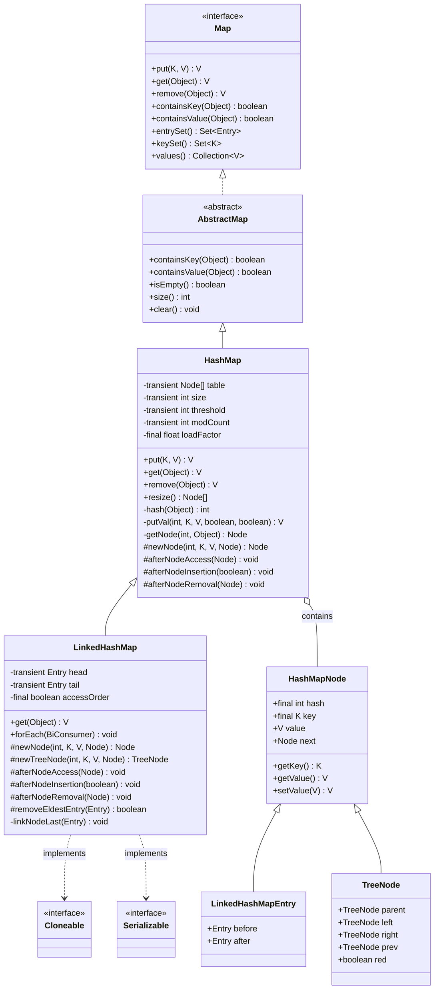
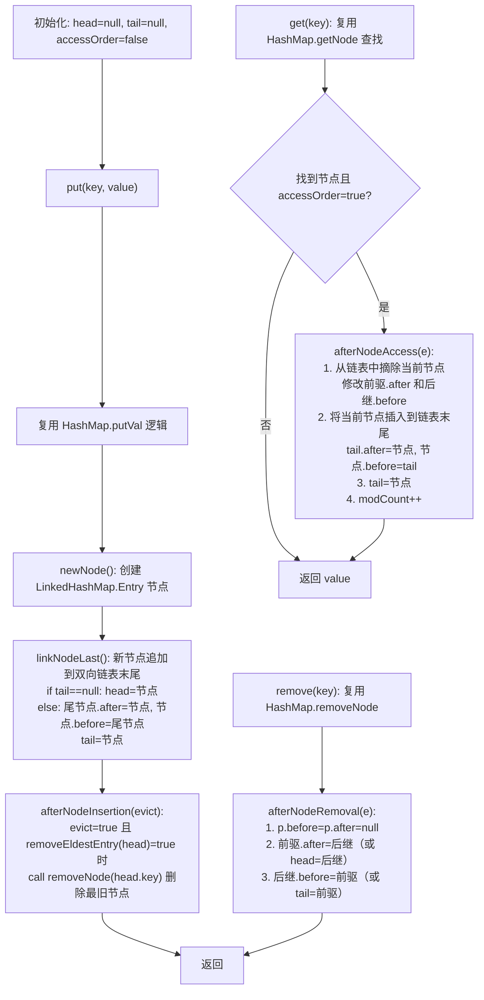

## 引言

HashMap 遍历时为什么不是插入顺序？如果需要一个有序的 Map，你会怎么做？

HashMap 遍历时为什么不是插入顺序？如果需要一个有序的 Map，你会怎么做？

`HashMap` 的底层设计决定了它是无序的——元素通过哈希值分散到数组的不同桶中。但在实际开发中，我们经常需要按照插入顺序遍历，甚至实现一个 LRU 缓存。`LinkedHashMap` 正是为了解决这个问题而生：它在 `HashMap` 的基础上增加了一条双向链表，以极小的额外开销实现了有序迭代。

更强大的是，`LinkedHashMap` 只需重写一个方法 `removeEldestEntry`，就能实现一个完整的 LRU 缓存。本文将带你深入源码，理解：

1. LinkedHashMap 如何在 HashMap 之上维护插入顺序（双向链表的结构）
2. 访问顺序（Access-Order）模式的实现原理与 LRU 缓存
3. 模板方法模式在 removeEldestEntry 中的精妙应用

在这篇文章中，你将学到以下内容：

1. `LinkedHashMap` 与 `HashMap` 的区别？
2. `LinkedHashMap` 的特点有哪些？
3. `LinkedHashMap` 底层实现原理？
4. 怎么使用 `LinkedHashMap` 实现 LRU 缓存？

## 简介

`LinkedHashMap` 继承自 `HashMap`，是 `HashMap` 的子类。它在 `HashMap` 的基础上额外维护了一个双向链表，用来记录元素的插入顺序或访问顺序，用空间换时间。

与 `HashMap` 相比，`LinkedHashMap` 有三个优势：

1. **维护插入顺序**：支持以元素插入顺序进行迭代，遍历时返回的结果与插入顺序一致。
2. **维护访问顺序**：支持以元素访问顺序进行迭代。最近访问或更新的元素会被移动到链表末尾，类似于 `LRU（Least Recently Used，最近最少使用）` 策略。面试时手写 LRU 缓存，可以参考 `LinkedHashMap` 的实现。
3. **迭代效率更高**：遍历时只需遍历双向链表，不需要遍历整个哈希数组。

### LinkedHashMap 类架构图



### LinkedHashMap 核心工作原理流程图

`LinkedHashMap` 的核心工作原理可以用下面的流程图概括：



### 访问顺序机制与 LRU 缓存实现流程

```mermaid
flowchart TD
    subgraph 插入顺序模式 accessOrder=false
        A1["put(1, A)"] --> A2["put(2, B)"]
        A2 --> A3["put(3, C)"]
        A3 --> A4["链表: 1 → 2 → 3"]
        A4 --> A5["遍历输出: {1=A, 2=B, 3=C}"]
    end

    subgraph 访问顺序模式 accessOrder=true
        B1["put(1, A)"] --> B2["put(2, B)"]
        B2 --> B3["put(3, C)"]
        B3 --> B4["链表: 1 → 2 → 3"]
        B4 --> B5["get(2): afterNodeAccess 移动节点2到末尾"]
        B5 --> B6["链表: 1 → 3 → 2"]
        B6 --> B7["遍历输出: {1=A, 3=C, 2=B}"]
        B7 --> B8["put(4, D): 超过容量?"]
        B8 -->|size > capacity| B9["removeEldestEntry=true\n删除 head(1)"]
        B8 -->|否| B10["链表: 1 → 3 → 2 → 4"]
        B9 --> B10
    end

    subgraph LRU Cache 实现
        C1["继承 LinkedHashMap"] --> C2["构造: accessOrder=true"]
        C2 --> C3["重写 removeEldestEntry()\nreturn size() > capacity"]
        C3 --> C4["put 超过容量时自动淘汰最久未访问元素"]
    end
```

> **💡 核心提示**：`LinkedHashMap` 的双向链表并不是独立于哈希表之外的另一套数据结构，而是直接嵌入在 `HashMap.Node` 节点内部的。`HashMap.Node` 的 `next` 指针用于解决哈希冲突（拉链法），而 `LinkedHashMap.Entry` 新增的 `before` 和 `after` 指针用于维护迭代顺序。也就是说，**一个节点同时属于两套链表结构**：哈希桶链表和双向迭代链表。这就是 LinkedHashMap 的"一石二鸟"设计。

`LinkedHashMap` 默认按照元素的**插入顺序**进行遍历：

```java
Map<Integer, String> map = new LinkedHashMap<>();
map.put(1, "One");
map.put(2, "Two");
map.put(3, "Three");
System.out.println(map); // 输出: {1=One, 2=Two, 3=Three}

// 访问元素后，不改变元素顺序
map.get(2);
System.out.println(map); // 输出: {1=One, 2=Two, 3=Three}
```

`LinkedHashMap` 也可以指定按照元素的**访问顺序**进行遍历（构造方法第三个参数传 `true`）：

```java
// true 表示按照访问顺序进行遍历
Map<Integer, String> map = new LinkedHashMap<>(16, 0.75f, true);
map.put(1, "One");
map.put(2, "Two");
map.put(3, "Three");
System.out.println(map); // 输出: {1=One, 2=Two, 3=Three}

// 访问元素后，会改变元素顺序（被访问的 key 2 移到末尾）
map.get(2);
System.out.println(map); // 输出: {1=One, 3=Three, 2=Two}
```

## 类属性

```java
public class LinkedHashMap<K, V> extends HashMap<K, V> implements Map<K, V> {

    /**
     * 双向链表的头节点（最老的节点）
     */
    transient Entry<K, V> head;

    /**
     * 双向链表的尾节点（最新的节点）
     */
    transient Entry<K, V> tail;

    /**
     * 迭代排序方式：true 表示按照访问顺序，false 表示按照插入顺序
     */
    final boolean accessOrder;

    /**
     * 双向链表的节点类，继承自 HashMap.Node
     */
    static class Entry<K, V> extends HashMap.Node<K, V> {
        /**
         * 双链表的前驱节点和后继节点
         */
        Entry<K, V> before, after;

        Entry(int hash, K key, V value, Node<K, V> next) {
            super(hash, key, value, next);
        }
    }

}
```

可以看出，`LinkedHashMap` 继承自 `HashMap`，在 `HashMap` 的 `Node` 节点基础上增加了 `before`（前驱）和 `after`（后继）两个引用，扩展成双向链表的 `Entry` 节点。同时记录了 `head`、`tail` 和迭代排序方式 `accessOrder`。

## 初始化

`LinkedHashMap` 常见的初始化方法有四个：

1. 无参初始化
2. 指定容量大小的初始化
3. 指定容量大小、负载系数的初始化
4. 指定容量大小、负载系数、迭代顺序的初始化

```java
/**
 * 无参初始化
 */
Map<Integer, Integer> map1 = new LinkedHashMap<>();

/**
 * 指定容量大小的初始化
 */
Map<Integer, Integer> map2 = new LinkedHashMap<>(16);

/**
 * 指定容量大小、负载系数的初始化
 */
Map<Integer, Integer> map3 = new LinkedHashMap<>(16, 0.75f);

/**
 * 指定容量大小、负载系数、迭代顺序的初始化
 */
Map<Integer, Integer> map4 = new LinkedHashMap<>(16, 0.75f, true);
```

再看一下构造方法的底层实现：

```java
/**
 * 无参初始化
 */
public LinkedHashMap() {
    super();
    accessOrder = false;
}

/**
 * 指定容量大小的初始化
 */
public LinkedHashMap(int initialCapacity) {
    super(initialCapacity);
    accessOrder = false;
}

/**
 * 指定容量大小、负载系数的初始化
 *
 * @param initialCapacity 初始容量
 * @param loadFactor      负载系数
 */
public LinkedHashMap(int initialCapacity, float loadFactor) {
    super(initialCapacity, loadFactor);
    accessOrder = false;
}

/**
 * 指定容量大小、负载系数、迭代顺序的初始化
 *
 * @param initialCapacity 初始容量
 * @param loadFactor      负载系数
 * @param accessOrder     迭代顺序，true 表示按照访问顺序，false 表示按照插入顺序
 */
public LinkedHashMap(int initialCapacity,
                     float loadFactor,
                     boolean accessOrder) {
    super(initialCapacity, loadFactor);
    this.accessOrder = accessOrder;
}
```

`LinkedHashMap` 的构造方法底层全部调用 `HashMap` 的对应构造方法。`accessOrder` 默认是 `false`（按插入顺序迭代），可以通过第三个参数指定为 `true`（按访问顺序迭代）。

> **💡 核心提示**：`LinkedHashMap` 的 `initialCapacity` 参数同样遵循 2 的幂次规则。构造方法将值传递给 `HashMap.tableSizeFor()`，确保内部数组容量始终是 2 的幂次，以便使用位运算 `(n - 1) & hash` 快速计算下标。此外，`LinkedHashMap` 采用**懒加载**策略，数组在第一次 `put` 时才初始化，构造方法仅记录参数。

## put 源码

`LinkedHashMap` 的 `put` 方法完全复用 `HashMap` 的 `put` 方法，没有重新实现。不过 `HashMap` 中定义了三个空方法作为钩子（hook），留给子类 `LinkedHashMap` 重写：

```java
public class HashMap<K, V> {

    /**
     * 在访问节点后执行的操作
     */
    void afterNodeAccess(Node<K, V> p) {
    }

    /**
     * 在插入节点后执行的操作
     */
    void afterNodeInsertion(boolean evict) {
    }

    /**
     * 在删除节点后执行的操作
     */
    void afterNodeRemoval(Node<K, V> p) {
    }

}
```

其中 `evict` 参数在 `HashMap` 的 `putVal` 中固定传 `true`，表示处于正常操作模式（而非初始化加载模式）。当 `evict` 为 `true` 时，`afterNodeInsertion` 才会判断是否需要淘汰最老的节点。

### 创建节点 — `newNode()`

在 `HashMap` 的 `put` 流程中，新节点是通过 `newNode()` 方法创建的。`LinkedHashMap` 重写此方法，在创建节点的同时将其追加到双向链表末尾：

```java
public class LinkedHashMap<K, V> extends HashMap<K, V> implements Map<K, V> {

    /**
     * 创建链表节点
     */
    @Override
    Node<K, V> newNode(int hash, K key, V value, Node<K, V> e) {
        // 1. 创建双向链表节点
        LinkedHashMap.Entry<K, V> p = new LinkedHashMap.Entry<K, V>(hash, key, value, e);
        // 2. 追加到链表末尾
        linkNodeLast(p);
        return p;
    }

    /**
     * 创建红黑树节点
     */
    @Override
    TreeNode<K, V> newTreeNode(int hash, K key, V value, Node<K, V> next) {
        // 1. 创建红黑树节点
        TreeNode<K, V> p = new TreeNode<K, V>(hash, key, value, next);
        // 2. 追加到链表末尾
        linkNodeLast(p);
        return p;
    }

    /**
     * 将新节点追加到双向链表末尾
     */
    private void linkNodeLast(LinkedHashMap.Entry<K, V> p) {
        LinkedHashMap.Entry<K, V> last = tail;
        tail = p;
        if (last == null) {
            head = p;
        } else {
            p.before = last;
            last.after = p;
        }
    }
}
```

`linkNodeLast` 的逻辑很简单：如果链表为空（`tail` 为 `null`），说明是第一个节点，同时设置 `head`；否则将新节点链接到原尾节点的 `after` 位置，并更新 `tail`。

### 插入后操作 — `afterNodeInsertion()`

在节点插入完成后，`HashMap` 的 `putVal` 会调用 `afterNodeInsertion()`，判断是否需要删除最旧的节点：

```java
/**
 * 在插入节点后执行的操作（删除最旧的节点）
 */
void afterNodeInsertion(boolean evict) {
    Entry<K, V> first;
    // 判断是否需要删除当前节点
    if (evict && (first = head) != null && removeEldestEntry(first)) {
        K key = first.key;
        // 调用 HashMap 的删除节点方法
        removeNode(hash(key), key, null, false, true);
    }
}

/**
 * 是否删除最旧的节点，默认返回 false，表示不删除
 */
protected boolean removeEldestEntry(Map.Entry<K, V> eldest) {
    return false;
}
```

`removeEldestEntry()` 方法默认返回 `false`，表示不需要删除节点。我们可以通过继承 `LinkedHashMap` 并重写该方法，当元素数量超过阈值时返回 `true`，触发删除链表头部（最老的）节点，从而实现 LRU 缓存。

> **💡 核心提示**：`afterNodeInsertion` 中的淘汰逻辑是 LRU 缓存的核心。注意 `evict` 参数在 `HashMap.putVal()` 中始终传 `true`，但在 `LinkedHashMap` 的 `putAll()` 批量插入场景下，`evict` 在内部 `putMapEntries()` 中同样传 `true`。这意味着每个元素插入后都会检查是否需要淘汰，在批量插入大量元素时会频繁触发 `removeNode`，性能开销较大。

## get 源码

再看一下 `get` 方法源码。`LinkedHashMap` 的 `get` 方法底层复用 `HashMap` 的 `get` 逻辑获取值，获取到节点后，如果 `accessOrder` 为 `true`，就调用 `afterNodeAccess()` 将该节点移动到链表末尾：

```java
/**
 * get 方法入口
 */
public V get(Object key) {
    Node<K, V> e;
    // 直接调用 HashMap 的 getNode 方法
    if ((e = getNode(hash(key), key)) == null) {
        return null;
    }
    // 如果 accessOrder 为 true（按访问顺序迭代），将节点移到链表末尾
    if (accessOrder) {
        afterNodeAccess(e);
    }
    return e.value;
}
```

`afterNodeAccess()` 方法的逻辑也很简单，核心就是把当前节点从链表中摘除，然后插入到链表末尾：

1. 断开当前节点与前驱、后继节点的连接
2. 把当前节点插入到链表末尾

```java
/**
 * 在访问节点后执行的操作（把节点移动到链表末尾）
 */
void afterNodeAccess(Node<K, V> e) {
    Entry<K, V> last;
    // 只有在 accessOrder 为 true 且当前节点不是尾节点时，才需要移动
    if (accessOrder && (last = tail) != e) {
        Entry<K, V> p = (Entry<K, V>) e, b = p.before, a = p.after;
        // 1. 断开当前节点与后继节点的连接
        p.after = null;
        if (b == null) {
            head = a;
        } else {
            b.after = a;
        }
        // 2. 断开当前节点与前驱节点的连接
        if (a != null) {
            a.before = b;
        } else {
            last = b;
        }
        // 3. 把当前节点插入到链表末尾
        if (last == null) {
            head = p;
        } else {
            p.before = last;
            last.after = p;
        }
        tail = p;
        ++modCount;
    }
}
```

这里有一个巧妙的设计：`afterNodeAccess` 开头判断了 `(last = tail) != e`，如果当前节点已经是尾节点，直接返回，避免不必要的链表操作。同时 `++modCount` 保证了 fail-fast 机制的正确性 —— 即使在遍历时仅调用 `get` 方法（当 `accessOrder=true` 时会修改链表结构），也会触发 `ConcurrentModificationException`。

> **💡 核心提示**：注意 `afterNodeAccess` 中 `++modCount` 的影响。当 `accessOrder=true` 时，每次 `get()` 都会修改 `modCount`，这意味着**在遍历过程中调用 `get()` 方法会抛出 `ConcurrentModificationException`**。这与 `HashMap`（`accessOrder=false`）的行为完全不同，是生产环境中最容易踩的坑之一。

## remove 源码

`LinkedHashMap` 的 `remove` 方法完全复用 `HashMap` 的 `remove` 方法。`HashMap` 的 `removeNode` 在删除节点后会调用 `afterNodeRemoval()`，`LinkedHashMap` 重写该方法，将节点从双向链表中移除：

```java
/**
 * 在删除节点后执行的操作（从双向链表中删除该节点）
 */
void afterNodeRemoval(Node<K, V> e) {
    LinkedHashMap.Entry<K, V> p =
            (LinkedHashMap.Entry<K, V>) e, b = p.before, a = p.after;
    // 将节点的前驱和后继引用置为 null，帮助 GC 回收
    p.before = p.after = null;
    // 1. 更新前驱节点的后继引用（或删除头节点）
    if (b == null) {
        head = a;
    } else {
        b.after = a;
    }
    // 2. 更新后继节点的前驱引用（或删除尾节点）
    if (a == null) {
        tail = b;
    } else {
        a.before = b;
    }
}
```

删除逻辑分三步：先将待删除节点的 `before` 和 `after` 置为 `null`（帮助 GC 回收），然后更新其前驱节点的 `after` 指向其后继，最后更新其后继节点的 `before` 指向其前驱。如果删除的是头节点或尾节点，同步更新 `head` 或 `tail`。

## HashMap 钩子方法设计模式解析

`LinkedHashMap` 之所以能够优雅地复用 `HashMap` 的全部逻辑，核心在于 `HashMap` 中采用的**模板方法模式**（Template Method Pattern）。`HashMap.putVal()`、`getNode()`、`removeNode()` 等方法在关键节点预留了三个钩子方法：

```java
// HashMap 中的钩子方法定义
void afterNodeAccess(Node<K, V> p) {}          // 访问后回调
void afterNodeInsertion(boolean evict) {}      // 插入后回调
void afterNodeRemoval(Node<K, V> p) {}         // 删除后回调
```

这三个方法在 `HashMap` 中是空实现（空方法体），在 `LinkedHashMap` 中被重写以维护双向链表。这种设计的好处是：

1. **零侵入**：`HashMap` 的核心逻辑不受子类影响
2. **零性能损耗**：空方法会被 JIT 编译器内联消除，不影响 `HashMap` 自身的性能
3. **扩展性**：未来 JDK 团队或第三方库可以继续继承 `HashMap` 实现新的子类

> **💡 核心提示**：模板方法模式在 JDK 中的应用非常广泛。除了 `HashMap` 的钩子方法外，`AbstractList`、`AbstractQueue`、`InputStream` 等抽象类都使用了这种模式。它的设计哲学是"定义算法骨架，将具体步骤延迟到子类实现"。

## 时间复杂度分析

### 各操作时间复杂度详细对比

| 操作 | 方法 | 平均时间复杂度 | 最坏时间复杂度 | 空间复杂度 | 说明 |
| :--- | :--- | :--- | :--- | :--- | :--- |
| 插入 | `put` | O(1) | O(log n) | O(1) | 同 HashMap，链表追加 O(1) |
| 查询 | `get` | O(1) | O(log n) | O(1) | accessOrder=true 时额外移动节点 O(1) |
| 删除 | `remove` | O(1) | O(log n) | O(1) | 同 HashMap，链表删除 O(1) |
| 遍历 | `forEach`/`entrySet` | O(n) | O(n) | O(1) | 只遍历双向链表，比 HashMap 更高效 |
| 扩容 | `resize` | O(n) | O(n) | O(n) | 同 HashMap，双向链表无需重建 |
| containsKey | `containsKey` | O(1) | O(log n) | O(1) | 等价于 `get` 再判断是否为 null |
| containsValue | `containsValue` | O(n) | O(n) | O(1) | 需遍历所有节点 |
| size | `size` | O(1) | O(1) | O(1) | 直接返回 `size` 字段 |

> **💡 核心提示**：虽然 `LinkedHashMap` 维护了双向链表，但所有基本操作（put/get/remove）的时间复杂度与 `HashMap` 完全相同。双向链表的插入和删除都是 O(1) 操作，因为已知头尾指针。唯一的影响是**空间复杂度**——每个 `Entry` 节点多出两个引用（`before` 和 `after`），在 64 位 JVM 上每个节点额外占用约 16 字节。

### 不同 Map 实现全方位对比

| 特性 | HashMap | LinkedHashMap | TreeMap | ConcurrentHashMap |
| :--- | :--- | :--- | :--- | :--- |
| 底层结构 | 数组+链表+红黑树 | 数组+链表+红黑树+双向链表 | 红黑树 | 数组+链表+红黑树 |
| 有序性 | 无序 | 插入顺序/访问顺序 | 按 key 自然顺序或 Comparator | 无序 |
| 线程安全 | 否 | 否 | 否 | 是（CAS+synchronized） |
| 允许 null key | 是（仅 1 个） | 是（仅 1 个） | 否 | 是（仅 1 个） |
| 允许 null value | 是（多个） | 是（多个） | 否 | 是（多个） |
| 查询复杂度 | O(1) | O(1) | O(log n) | O(1) |
| 遍历复杂度 | O(capacity + n) | O(n) | O(n) | O(capacity + n) |
| 内存开销 | 基准 | 基准 + 每个节点 2 个引用 | 基准 + 每个节点 4 个引用 | 基准 + CounterCell[] |
| 迭代器 | fail-fast | fail-fast | fail-fast | weakly consistent |
| LRU 支持 | 不支持 | 原生支持 | 不支持 | 不支持 |
| Java 版本 | 1.2 | 1.4 | 1.2 | 1.5 |

> **💡 核心提示**：`LinkedHashMap` 的遍历时间复杂度为 O(n)，而 `HashMap` 的遍历时间复杂度为 O(capacity + n)。当 HashMap 的容量远大于实际元素数量时（比如初始容量 1024，只存了 10 个元素），`HashMap` 需要遍历整个数组找非空桶位，而 `LinkedHashMap` 直接遍历双向链表只需访问 10 个节点。这也是为什么在需要频繁遍历且数据稀疏的场景下，`LinkedHashMap` 性能更优。

### HashMap vs LinkedHashMap vs TreeMap 选型指南

| 场景 | 推荐选择 | 理由 |
| :--- | :--- | :--- |
| 普通键值对存储，无需有序 | HashMap | 性能最好，内存开销最小 |
| 需要按插入顺序遍历 | LinkedHashMap | 零额外复杂度，迭代效率高 |
| 实现 LRU 缓存 | LinkedHashMap | 原生支持 accessOrder + removeEldestEntry |
| 需要按 key 排序 | TreeMap | 红黑树保证 key 有序 |
| 高并发场景 | ConcurrentHashMap | 线程安全，读写高性能 |
| 序列化后反序列化需保持顺序 | LinkedHashMap | 保证反序列化后遍历顺序一致 |

## 使用 LinkedHashMap 实现 LRU 缓存

继承 `LinkedHashMap`，构造方法传入 `accessOrder=true`，并重写 `removeEldestEntry()` 方法即可：

```java
import java.util.LinkedHashMap;
import java.util.Map;

/**
 * 使用 LinkedHashMap 实现 LRU 缓存
 */
public class LRUCache<K, V> extends LinkedHashMap<K, V> {

    private final int capacity;

    public LRUCache(int capacity) {
        // accessOrder=true：按访问顺序迭代
        super(capacity, 0.75f, true);
        this.capacity = capacity;
    }

    /**
     * 当缓存容量达到上限时，返回 true 触发删除最久未使用的节点
     */
    @Override
    protected boolean removeEldestEntry(Map.Entry<K, V> eldest) {
        return size() > capacity;
    }

    public static void main(String[] args) {
        LRUCache<Integer, String> cache = new LRUCache<>(3);
        cache.put(1, "One");
        cache.put(2, "Two");
        cache.put(3, "Three");
        System.out.println(cache); // 输出: {1=One, 2=Two, 3=Three}

        cache.get(2);
        System.out.println(cache); // 输出: {1=One, 3=Three, 2=Two}

        cache.put(4, "Four");
        System.out.println(cache); // 输出: {3=Three, 2=Two, 4=Four}
    }
}
```

## 生产环境避坑指南

### 1. accessOrder=true 遍历时 get 导致 ConcurrentModificationException

```java
// 错误示例：accessOrder=true 时，遍历中调用 get()
Map<Integer, String> map = new LinkedHashMap<>(16, 0.75f, true);
map.put(1, "A");
map.put(2, "B");

for (Integer key : map.keySet()) {
    String value = map.get(key); // ConcurrentModificationException!
    // afterNodeAccess 修改了 modCount，触发 fail-fast
    System.out.println(key + "=" + value);
}

// 正确示例：先复制 key 列表，再遍历
List<Integer> keys = new ArrayList<>(map.keySet());
for (Integer key : keys) {
    String value = map.get(key);
    System.out.println(key + "=" + value);
}
```

### 2. 线程不安全

`LinkedHashMap` 与 `HashMap` 一样**不是线程安全的**。多线程并发 `put` 或 `get`（当 `accessOrder=true` 时）可能导致：
- 双向链表断裂（`before`/`after` 引用不一致）
- 遍历时死循环
- 数据丢失

```java
// 高并发场景下不要直接使用 LinkedHashMap
// 如需有序 + 线程安全，可考虑以下替代方案：

// 方案一：Collections.synchronizedMap 包装（全局锁，性能差）
Map<K, V> syncMap = Collections.synchronizedMap(new LinkedHashMap<>());

// 方案二：读多写少场景，使用 ConcurrentHashMap + 额外数据结构记录顺序

// 方案三：Guava Cache（推荐，内部基于 ConcurrentHashMap + 自研 LRU 策略）
// Cache<K, V> cache = CacheBuilder.newBuilder().maximumSize(1000).build();
```

### 3. 序列化兼容性

`LinkedHashMap` 实现了自定义的 `writeObject`/`readObject` 方法，序列化时会保存 `accessOrder` 字段。如果序列化时用 `accessOrder=false`，反序列化后也保持插入顺序。但需要注意：

```java
// 序列化前
LinkedHashMap<String, Integer> map = new LinkedHashMap<>(16, 0.75f, true);
map.put("a", 1);
map.put("b", 2);
map.get("a"); // a 移到末尾

// 反序列化后，accessOrder 仍为 true，但链表顺序是序列化时的快照
// 如果业务逻辑依赖特定顺序，务必在反序列化后重新验证
```

### 4. LRU 缓存的初始化容量陷阱

使用 LRU 缓存时，如果初始容量设置过小，频繁的 `resize` 和淘汰操作会严重影响性能：

```java
// 错误：初始容量太小，触发多次扩容
LRUCache<String, Object> cache = new LRUCache<>(10); // 内部数组初始为 16

// 推荐：预估缓存大小，直接指定合理容量
int expectedMaxSize = 10000;
int capacity = (int) Math.ceil(expectedMaxSize / 0.75f) + 1;
LRUCache<String, Object> cache = new LRUCache<>(capacity) {
    @Override
    protected boolean removeEldestEntry(Map.Entry<String, Object> eldest) {
        return size() > expectedMaxSize;
    }
};
```

### 5. 大数据量场景的内存开销

每个 `LinkedHashMap.Entry` 比 `HashMap.Node` 多出两个 `Entry` 引用（`before` 和 `after`）。在 64 位 JVM（开启压缩普通指针 `-XX:+UseCompressedOops`）下，每个引用占 4 字节，即每个节点额外约 8 字节。对于百万级数据量的缓存：

```
1,000,000 个节点 × 8 字节 ≈ 8 MB 额外内存
```

如果内存敏感，建议使用 `ConcurrentHashMap` + 自研 LRU 策略，或者使用 Guava/Caffeine 等第三方库。

### 6. removeEldestEntry 的时机

`removeEldestEntry` 在**每次 `put` 后**都会调用。这意味着：

- 单次 `put` 操作在最坏情况下涉及：哈希计算 → 数组定位 → 链表/树插入 → 双向链表追加 → `removeEldestEntry` 判断 → 可能的删除操作
- 批量插入（如 `putAll`）时，每个元素插入后都会触发 `removeEldestEntry` 检查，如果频繁淘汰，总时间复杂度从 O(n) 退化到 O(n × 淘汰成本)

## 总结

现在可以回答文章开头提出的问题了：

1. **`LinkedHashMap` 与 `HashMap` 的区别？**

   答案：`LinkedHashMap` 继承自 `HashMap`，在 `HashMap` 的哈希表结构基础上，额外维护了一个双向链表来记录元素的插入顺序或访问顺序。

2. **`LinkedHashMap` 的特点有哪些？**

   答案：除了保持 `HashMap` 高效的查询和插入性能外，还支持以插入顺序或访问顺序进行迭代。按访问顺序迭代时，最近访问的元素在链表末尾，可实现 LRU 缓存。同时，遍历双向链表的迭代效率优于遍历哈希数组。

3. **`LinkedHashMap` 底层实现原理？**

   答案：`LinkedHashMap` 复用 `HashMap` 的源码实现，使用双向链表维护元素顺序。通过重写 `HashMap` 的三个钩子方法来维护链表：

   - `newNode()` / `newTreeNode()`：创建新节点时，同时追加到双向链表末尾（`linkNodeLast`）
   - `afterNodeAccess()`：访问节点时，将节点移动到链表末尾（仅 `accessOrder=true` 时生效）
   - `afterNodeInsertion()`：插入节点后，判断是否需要淘汰最老节点（`removeEldestEntry`）
   - `afterNodeRemoval()`：删除节点后，从双向链表中移除该节点

4. **怎么使用 `LinkedHashMap` 实现 LRU 缓存？**

   答案：继承 `LinkedHashMap`，构造方法传入 `accessOrder=true`，并重写 `removeEldestEntry()` 方法即可。

## 行动清单

1. **检查遍历中的 get 调用**：全局搜索所有 `LinkedHashMap` 的使用场景，当 `accessOrder=true` 时，确保遍历时不会直接调用 `get()`，改用先复制 key 列表再遍历的方式，避免 `ConcurrentModificationException`。
2. **审计并发场景误用**：确认所有 `LinkedHashMap` 的使用都在单线程上下文中。多线程场景下替换为 `ConcurrentHashMap` 或使用 `Collections.synchronizedMap()` 包装（注意性能影响），或考虑使用 Guava Cache / Caffeine 等线程安全缓存库。
3. **LRU 缓存初始化容量优化**：对于使用 `LinkedHashMap` 实现的 LRU 缓存，根据预估最大容量设置合理的初始容量（公式：`capacity = maxSize / 0.75 + 1`），避免频繁扩容和淘汰。
4. **评估大数据量内存开销**：对于百万级以上数据量的缓存场景，评估 `LinkedHashMap.Entry` 的额外内存开销（每个节点约多 8 字节），考虑使用 Caffeine 等更高效的缓存方案。
5. **监控缓存命中率**：为基于 `LinkedHashMap` 的 LRU 缓存添加命中率监控（`get` 命中次数 / 总 `get` 次数），根据命中率调整缓存大小或淘汰策略。
6. **扩展阅读**：推荐阅读 Guava 的 `LocalCache` 实现（基于 `ConcurrentHashMap` + 自研 LRU）和 Caffeine 的 `BoundedLocalCache`（基于 Window TinyLfu 算法），了解工业级缓存的设计思路。
7. **扩展阅读**：推荐阅读 JDK 源码中的 `LinkedHashMap` 完整实现，以及 Joshua Bloch 的《Effective Java》第 3 版第 11 条（"始终在覆盖 equals 时覆盖 hashCode"），确保自定义 key 的正确性。
