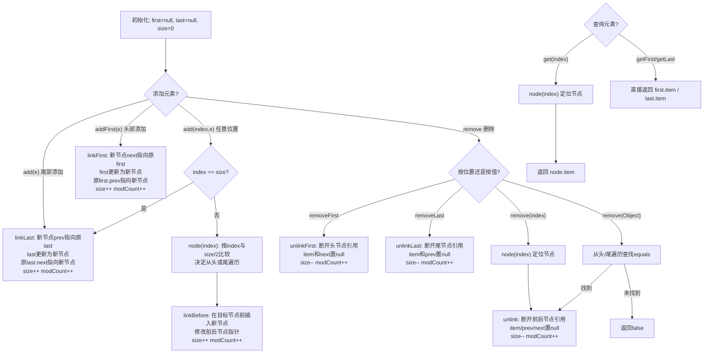

## 引言
`LinkedList` 是一种常见的数据结构，但是大多数开发者并不了解其底层实现原理，以至于存在很多误解。在这篇文章中，将带大家深入剖析 `LinkedList` 的源码，并为你揭露它们背后的真相。
下面提问几个问题，校验一下大家对 `LinkedList` 的了解程度。

1. LinkedList 的底层是基于什么数据结构实现的？
2. LinkedList 的插入和删除操作时间复杂度是否都是 O(1)？
3. LinkedList 和 ArrayList 相比，哪种结构存储数据的时候更占内存？
4. LinkedList 真的不支持随机访问吗？
5. LinkedList 是线程安全的吗？

接下来一起分析一下 LinkedList 的源码，看完之后，就可以轻松解答上面几个问题了。

## 简介
LinkedList 底层是基于双向链表实现的，内部有三个属性：`size` 用来存储元素个数，`first` 指向链表头节点，`last` 指向链表尾节点。

```java
public class LinkedList<E>
        extends AbstractSequentialList<E>
        implements List<E>, Deque<E>, Cloneable, java.io.Serializable {

    // 元素个数
    transient int size = 0;

    // 头节点
    transient Node<E> first;

    // 尾节点
    transient Node<E> last;
}
```

头尾节点都是由 Node 节点组成，Node 节点表示双向链表的一个元素，内部结构如下：

```java
private static class Node<E> {

    // 存储元素数据
    E item;

    // 后继节点，指向下一个元素
    LinkedList.Node<E> next;

    // 前驱节点，指向上一个元素
    LinkedList.Node<E> prev;

    // 构造函数
    Node(LinkedList.Node<E> prev, E element, LinkedList.Node<E> next) {
        this.item = element;
        this.next = next;
        this.prev = prev;
    }
}
```

再看一下 LinkedList 的继承类图：


LinkedList 实现了 List 接口，提供了集合操作的常用方法，当然也包含随机访问的方法，只不过没有像 ArrayList 那样实现 `RandomAccess` 接口，LinkedList 提供的随机访问方法时间复杂度不是常量级别的。

LinkedList 还实现了 `Deque` 接口，Deque 是 `double ended queue` 的缩写，读音是 `/dek/`，读错就尴尬了。
Deque 是双端队列，可以在头尾进行插入和删除操作，兼具栈和队列的性质。

Deque 提供了大量增删查方法，目的是区分不同语义：对于添加操作，`addFirst()` 在队列满时会抛出异常，而 `offerFirst()` 则返回 `false`；对于删除和查询，以 `poll`/`peek` 开头的方法在元素不存在时返回 `null`，而以 `remove`/`get`/`element` 开头的方法则会抛出异常。

常用方法分类如下：

| 操作类型 | 头部操作（抛出异常） | 头部操作（返回特殊值） | 尾部操作（抛出异常） | 尾部操作（返回特殊值） |
| --- | --- | --- | --- | --- |
| 添加 | addFirst(e)、push(e) | offerFirst(e) | addLast(e)、add(e) | offerLast(e)、offer(e) |
| 删除 | removeFirst()、remove()、pop() | pollFirst()、poll() | removeLast() | pollLast() |
| 查询 | getFirst()、element() | peekFirst()、peek() | getLast() | peekLast() |

LinkedList 的核心工作原理可以用下面的流程图概括：



## 初始化
LinkedList 只有一个构造方法——无参构造，并不能像 ArrayList 那样指定初始容量。

```java
List<Integer> list = new LinkedList<>();
```

构造方法的底层实现也是一个空方法，没有做任何操作：

```java
public LinkedList() {
}
```

这意味着 LinkedList 创建时不会预先分配任何节点，所有节点都是在添加元素时才动态创建。

## 添加元素

添加元素的方法根据位置区分，共有三种：在头部添加、在尾部添加、在任意位置添加。

| 方法含义 | 不返回值 | 返回布尔值 |
| --- | --- | --- |
| 在头部添加 | addFirst(e)、push(e) | offerFirst(e) |
| 在尾部添加 | addLast(e) | add(e)、offer(e)、offerLast(e) |
| 在任意位置添加 | add(index, e) | - |

先看一下使用最多的 `add(e)` 方法底层实现：

```java
// 添加元素
public boolean add(E e) {
    // 在末尾添加元素
    linkLast(e);
    return true;
}

// 在末尾添加元素
void linkLast(E e) {
    // 1. 获取尾节点
    final LinkedList.Node<E> l = last;
    // 2. 初始化新节点
    final LinkedList.Node<E> newNode = new LinkedList.Node<>(l, e, null);
    // 3. 追加到末尾
    last = newNode;
    if (l == null) {
        first = newNode;
    } else {
        l.next = newNode;
    }
    size++;
    modCount++;
}
```

`linkLast` 的核心逻辑：保存原尾节点 → 创建新节点（前驱指向原尾节点） → 更新 `last` 指针 → 如果链表为空则同时设置 `first` → 否则将原尾节点的 `next` 指向新节点。

再看一个从头部添加元素的 `push()`：

```java
// 添加元素
public void push(E e) {
    // 在头部添加元素
    addFirst(e);
}

// 在头部添加元素
public void addFirst(E e) {
    linkFirst(e);
}

// 在头部添加元素，底层私有实现
private void linkFirst(E e) {
    // 1. 获取头节点
    final LinkedList.Node<E> f = first;
    // 2. 初始化新节点
    final LinkedList.Node<E> newNode = new LinkedList.Node<>(null, e, f);
    // 3. 追加到头部
    first = newNode;
    if (f == null) {
        last = newNode;
    } else {
        f.prev = newNode;
    }
    size++;
    modCount++;
}
```

`linkFirst` 与 `linkLast` 逻辑对称：保存原头节点 → 创建新节点（后继指向原头节点） → 更新 `first` 指针 → 如果链表为空则同时设置 `last` → 否则将原头节点的 `prev` 指向新节点。

最后看在任意位置添加的 `add(index, e)` 底层实现：

```java
// 在下标index位置添加元素
public void add(int index, E element) {
    // 检查下标是否越界
    checkPositionIndex(index);

    // 如果index等于链表长度，则添加到末尾
    if (index == size) {
        linkLast(element);
    } else {
        // 添加到指定位置前面（先找到index位置的元素）
        linkBefore(element, node(index));
    }
}

// 在当前元素前面添加新元素
void linkBefore(E e, LinkedList.Node<E> succ) {
    final LinkedList.Node<E> pred = succ.prev;
    // 创建新节点，并将新节点插入到当前节点之前
    final LinkedList.Node<E> newNode = new LinkedList.Node<>(pred, e, succ);
    succ.prev = newNode;
    if (pred == null) {
        first = newNode;
    } else {
        pred.next = newNode;
    }
    size++;
    modCount++;
}
```

这里调用了 `checkPositionIndex` 进行越界检查（允许 `index == size`，因为可以在末尾追加）：

```java
// 检查位置下标是否越界
private void checkPositionIndex(int index) {
    if (!isPositionIndex(index)) {
        throw new IndexOutOfBoundsException(outOfBoundsMsg(index));
    }
}

// 判断位置下标是否合法
private boolean isPositionIndex(int index) {
    return index >= 0 && index <= size;
}
```

`add(index, e)` 内部还依赖了 `node(index)` 方法来定位节点，这个方法在查询部分详细分析。

## 查询元素

查询元素的方法按位置区分，共有三种：查询头节点、查询尾节点、查询任意位置元素。

| 方法含义 | 如果不存在则返回null | 如果不存在则抛异常 |
| --- | --- | --- |
| 查询头部 | peek()、peekFirst() | getFirst()、element() |
| 查询尾部 | peekLast() | getLast() |
| 查询任意位置 | - | get(index) |

看一下从头查询的 `element()` 方法的底层实现：

```java
// 查询元素
public E element() {
    return getFirst();
}

// 获取第一个元素
public E getFirst() {
    final LinkedList.Node<E> f = first;
    if (f == null) {
        throw new NoSuchElementException();
    }
    return f.item;
}
```

再看一个查询尾节点的 `getLast()` 方法的底层实现：

```java
// 获取最后一个元素
public E getLast() {
    final LinkedList.Node<E> l = last;
    if (l == null) {
        throw new NoSuchElementException();
    }
    return l.item;
}
```

头尾查询都是 O(1) 时间复杂度，因为直接访问 `first` 和 `last` 指针。

再看一个查询任意位置的方法 `get(index)` 的底层实现：

```java
// 查询下标是index位置的元素
public E get(int index) {
    // 检查下标是否越界
    checkElementIndex(index);
    // 返回对应下标的元素
    return node(index).item;
}

// 返回对应下标的元素
LinkedList.Node<E> node(int index) {
    // 判断下标是否落在前半段
    if (index < (size >> 1)) {
        // 如果在前半段，则从头开始遍历
        LinkedList.Node<E> x = first;
        for (int i = 0; i < index; i++) {
            x = x.next;
        }
        return x;
    } else {
        // 如果在后半段，则从尾开始遍历
        LinkedList.Node<E> x = last;
        for (int i = size - 1; i > index; i--) {
            x = x.prev;
        }
        return x;
    }
}
```

`node(index)` 方法做了一个重要优化：通过 `index < (size >> 1)` 判断索引落在前半段还是后半段，前半段从头节点开始向后遍历，后半段从尾节点开始向前遍历。这样最多只需要遍历链表的一半，将最坏情况的遍历步数从 n 降低到了 n/2。

越界检查 `checkElementIndex` 与 `checkPositionIndex` 不同——它要求 `index < size`（不允许等于），因为查询必须指向已存在的元素：

```java
// 检查下标是否越界
private void checkElementIndex(int index) {
    if (!isElementIndex(index)) {
        throw new IndexOutOfBoundsException(outOfBoundsMsg(index));
    }
}

// 判断下标是否越界
private boolean isElementIndex(int index) {
    return index >= 0 && index < size;
}
```

可见 LinkedList 也支持随机访问，只不过时间复杂度是 O(n)。

除了按索引查询，LinkedList 还提供了按值查找的方法 `indexOf(Object o)`：

```java
// 返回指定元素第一次出现的下标
public int indexOf(Object o) {
    int index = 0;
    if (o == null) {
        for (LinkedList.Node<E> x = first; x != null; x = x.next) {
            if (x.item == null)
                return index;
            index++;
        }
    } else {
        for (LinkedList.Node<E> x = first; x != null; x = x.next) {
            if (o.equals(x.item))
                return index;
            index++;
        }
    }
    return -1;
}
```

`indexOf` 从头到尾线性遍历查找，对 `null` 值做了特殊处理（用 `==` 而不是 `equals`），时间复杂度为 O(n)。

## 删除元素

删除元素的方法按位置区分，也分为三种：删除头节点、删除尾节点、删除任意位置节点。

| 方法含义 | 返回布尔值（不存在返回false） | 返回旧值（不存在抛异常） |
| --- | --- | --- |
| 从头部删除 | remove(o)、removeFirstOccurrence | remove()、poll()、pollFirst()、removeFirst()、pop() |
| 从尾部删除 | removeLastOccurrence | pollLast()、removeLast() |
| 从任意位置删除 | - | remove(index) |

先看一个从头开始删除的方法 `remove()` 的底层实现：

```java
// 删除元素
public E remove() {
    // 删除第一个元素
    return removeFirst();
}

// 从头删除元素
public E removeFirst() {
    final LinkedList.Node<E> f = first;
    if (f == null) {
        throw new NoSuchElementException();
    }
    // 调用实际的删除方法
    return unlinkFirst(f);
}

// 删除第一个元素
private E unlinkFirst(LinkedList.Node<E> f) {
    final E element = f.item;
    final LinkedList.Node<E> next = f.next;
    // 断开头节点与后继节点的连接
    f.item = null;
    f.next = null;
    first = next;
    if (next == null) {
        last = null;
    } else {
        next.prev = null;
    }
    size--;
    modCount++;
    return element;
}
```

`unlinkFirst` 的删除逻辑：备份元素值 → 将待删除节点的 `item` 和 `next` 置为 `null`（帮助 GC 回收） → 更新 `first` 指针 → 如果链表变为空则同时置 `last` 为 `null` → 否则将新头节点的 `prev` 置为 `null`。

再看一个从最后一个节点开始删除的方法 `removeLast()` 的底层实现：

```java
// 删除最后一个元素
public E removeLast() {
    final LinkedList.Node<E> l = last;
    if (l == null) {
        throw new NoSuchElementException();
    }
    // 实际的删除逻辑
    return unlinkLast(l);
}

// 删除最后一个元素
private E unlinkLast(LinkedList.Node<E> l) {
    final E element = l.item;
    // 断开与前一个节点的连接
    final LinkedList.Node<E> prev = l.prev;
    l.item = null;
    l.prev = null;
    last = prev;
    if (prev == null) {
        first = null;
    } else {
        prev.next = null;
    }
    size--;
    modCount++;
    return element;
}
```

再看一个从任意位置删除的方法 `remove(index)` 的底层实现：

```java
// 删除下标是index位置的元素
public E remove(int index) {
    // 检查下标是否越界
    checkElementIndex(index);
    // 删除下标对应的元素（先找到下标对应的元素）
    return unlink(node(index));
}

// 删除下标对应的元素
E unlink(LinkedList.Node<E> x) {
    final E element = x.item;
    // 1. 备份当前节点的前后节点
    final LinkedList.Node<E> next = x.next;
    final LinkedList.Node<E> prev = x.prev;

    // 2. 断开与前驱节点的连接
    if (prev == null) {
        first = next;
    } else {
        prev.next = next;
        x.prev = null;
    }

    // 3. 断开与后继节点的连接
    if (next == null) {
        last = prev;
    } else {
        next.prev = prev;
        x.next = null;
    }

    x.item = null;
    size--;
    modCount++;
    return element;
}
```

`unlink` 是通用的节点删除方法：备份前后节点 → 根据是否为头/尾节点分别处理 → 将待删除节点的三个引用（`item`、`prev`、`next`）全部置为 `null`，帮助 GC 回收。

除了按索引删除，LinkedList 还提供了按值删除的方法 `remove(Object o)`：

```java
// 删除指定元素第一次出现的位置
public boolean remove(Object o) {
    if (o == null) {
        for (LinkedList.Node<E> x = first; x != null; x = x.next) {
            if (x.item == null) {
                unlink(x);
                return true;
            }
        }
    } else {
        for (LinkedList.Node<E> x = first; x != null; x = x.next) {
            if (o.equals(x.item)) {
                unlink(x);
                return true;
            }
        }
    }
    return false;
}
```

同样对 `null` 值做了特殊处理，先遍历找到第一个匹配的节点，然后调用 `unlink` 删除。时间复杂度为 O(n)。

关于 `ConcurrentModificationException`：LinkedList 的迭代器是 **fail-fast** 的。在创建迭代器时会记录当前的 `modCount` 值，每次调用 `next()` 或 `remove()` 时都会检查 `modCount` 是否与预期值一致。如果不一致（说明在迭代过程中有其他线程或代码修改了链表结构），就会抛出 `ConcurrentModificationException`。这是 Java 集合框架的一种快速失败机制，目的是尽早发现并发修改问题，而不是等到数据错乱后才暴露。

## 总结

学完了 LinkedList 核心方法的源码，现在可以很容易回答文章开头的几个问题了。

1. **LinkedList 的底层是基于什么数据结构实现的？**

   答案：双向链表。

2. **LinkedList 的插入和删除操作时间复杂度是否都是 O(1)？**

   答案：不是。在头尾操作的时间复杂度是 O(1)，在中间位置或按索引操作的时间复杂度是 O(n)。

3. **LinkedList 和 ArrayList 相比，哪种结构存储数据的时候更占内存？**

   答案：LinkedList 每个节点额外包含两个引用（前驱和后继），因此存储相同数量的元素时，LinkedList 占用的内存更多。

4. **LinkedList 真的不支持随机访问吗？**

   答案：LinkedList 支持按索引访问（`get(index)`），但时间复杂度是 O(n) 而非 O(1)，因此没有实现 `RandomAccess` 接口。

5. **LinkedList 是线程安全的吗？**

   答案：不是。内部没有提供同步机制来保证线程安全，并发修改可能导致数据错乱。如果需要线程安全，可以使用 `Collections.synchronizedList()` 包装，或者使用 `CopyOnWriteArrayList`。

### 关键操作时间复杂度对比

| 操作 | 方法示例 | 时间复杂度 | 说明 |
| --- | --- | --- | --- |
| 头部插入 | addFirst / push | O(1) | 直接修改 first 指针 |
| 尾部插入 | add / addLast | O(1) | 直接修改 last 指针 |
| 中间插入 | add(index, e) | O(n) | 需 node(index) 定位 |
| 头部删除 | removeFirst / pop | O(1) | 直接修改 first 指针 |
| 尾部删除 | removeLast | O(1) | 直接修改 last 指针 |
| 中间删除 | remove(index) | O(n) | 需 node(index) 定位 |
| 按值删除 | remove(Object) | O(n) | 需线性遍历查找 |
| 头部查询 | getFirst / peek | O(1) | 直接访问 first |
| 尾部查询 | getLast | O(1) | 直接访问 last |
| 随机访问 | get(index) | O(n) | 需 node(index) 定位 |
| 按值查找 | indexOf / contains | O(n) | 需线性遍历 |
| 遍历 | iterator / forEach | O(n) | 逐个节点访问 |

### 使用建议

1. **频繁头尾操作选 LinkedList**：如果业务场景主要是头部或尾部的插入和删除（如实现栈或队列），LinkedList 的 O(1) 性能优于 ArrayList。
2. **频繁随机访问选 ArrayList**：如果需要频繁按索引访问元素或进行中间位置的操作，ArrayList 的 O(1) 随机访问性能远优于 LinkedList。
3. **避免在 LinkedList 中使用二分查找等算法**：由于 LinkedList 不支持高效的随机访问，依赖索引访问的算法（如二分查找）在 LinkedList 上退化为 O(n) 或更差。
4. **遍历时修改要用迭代器的 remove**：如果需要在遍历过程中删除元素，应使用 `Iterator.remove()` 而不是 `LinkedList.remove()`，否则会触发 fail-fast 机制抛出 `ConcurrentModificationException`。
