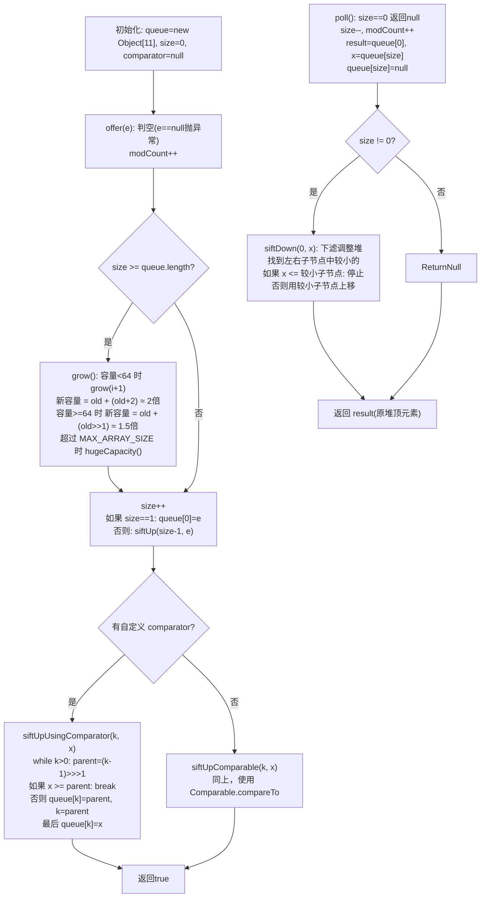

欢迎学习《解读Java源码专栏》，在这个系列中，我将手把手带着大家剖析Java核心组件的源码，内容包含集合、线程、线程池、并发、队列等，深入了解其背后的设计思想和实现细节，轻松应对工作面试。
这是解读Java源码系列的第12篇，将跟大家一起学习Java中的优先队列 —— PriorityQueue。

## 引言
前面文章我们讲解了 `ArrayBlockingQueue` 和 `LinkedBlockingQueue` 源码。这篇文章开始讲解 `PriorityQueue` 源码。从名字上就能看到，`ArrayBlockingQueue` 是基于数组实现的阻塞队列，而 `LinkedBlockingQueue` 是基于链表实现的阻塞队列，而 `PriorityQueue` 是基于什么数据结构实现的？它实现了优先级的队列。

由于 `PriorityQueue` 跟前几个阻塞队列不一样，**它并没有实现 `BlockingQueue` 接口**，只是一个普通的非阻塞队列，只实现了 `Queue` 接口。`Queue` 接口中定义了几组放数据和取数据的方法，来满足不同的场景。


| 操作 | 抛出异常 | 返回特定值 |
| --- | --- | --- |
| 放数据 | add() | offer() |
| 取数据（同时删除） | remove() | poll() |
| 查看数据（不删除） | element() | peek() |

**这两组方法的区别是：**

1. 当队列满的时候，再次添加数据：`add()` 会抛出异常，`offer()` 会返回 `false`。
2. 当队列为空的时候，再次取数据：`remove()` 会抛出异常，`poll()` 会返回 `null`。

不过 `PriorityQueue` 是**无界队列**，底层数组会自动扩容，所以实际上不会出现队列满的情况，`add()` 和 `offer()` 的行为完全相同。

`PriorityQueue` 的核心工作原理可以用下面的流程图概括：



## 类结构
先看一下 `PriorityQueue` 类里面有哪些属性：

```java
public class PriorityQueue<E>
        extends AbstractQueue<E>
        implements java.io.Serializable {

    /**
     * 数组初始容量大小，默认 11
     */
    private static final int DEFAULT_INITIAL_CAPACITY = 11;

    /**
     * 数组，用于存储堆元素（二叉堆的数组表示）
     */
    transient Object[] queue;

    /**
     * 元素个数
     */
    private int size = 0;

    /**
     * 比较器，用于排序元素优先级（null 时使用自然排序）
     */
    private final Comparator<? super E> comparator;

}
```

可以看出 `PriorityQueue` 底层是基于数组实现的，使用 `Object[]` 数组以**二叉堆**的方式存储元素，并且定义了比较器 `comparator`，用于排序元素的优先级。

二叉堆在数组中的映射规则：
- 节点 `i` 的左子节点下标为 `2*i + 1`
- 节点 `i` 的右子节点下标为 `2*i + 2`
- 节点 `i` 的父节点下标为 `(i - 1) >>> 1`

## 初始化
`PriorityQueue` 常用的初始化方法有 4 个：

1. 无参构造方法
2. 指定容量大小的有参构造方法
3. 指定比较器的有参构造方法
4. 同时指定容量和比较器的有参构造方法

```java
/**
 * 无参构造方法
 */
PriorityQueue<Integer> queue1 = new PriorityQueue<>();

/**
 * 指定容量大小的构造方法
 */
PriorityQueue<Integer> queue2 = new PriorityQueue<>(10);

/**
 * 指定比较器的有参构造方法
 */
PriorityQueue<Integer> queue3 = new PriorityQueue<>(Integer::compareTo);

/**
 * 同时指定容量和比较器的有参构造方法
 */
PriorityQueue<Integer> queue4 = new PriorityQueue<>(10, Integer::compare);
```

再看一下对应的源码实现：

```java
/**
 * 无参构造方法
 */
public PriorityQueue() {
    // 使用默认容量大小 11，不指定比较器
    this(DEFAULT_INITIAL_CAPACITY, null);
}

/**
 * 指定容量大小的构造方法
 */
public PriorityQueue(int initialCapacity) {
    this(initialCapacity, null);
}

/**
 * 指定比较器的有参构造方法
 */
public PriorityQueue(Comparator<? super E> comparator) {
    this(DEFAULT_INITIAL_CAPACITY, comparator);
}

/**
 * 同时指定容量和比较器的有参构造方法
 */
public PriorityQueue(int initialCapacity, Comparator<? super E> comparator) {
    if (initialCapacity < 1) {
        throw new IllegalArgumentException();
    }
    this.queue = new Object[initialCapacity];
    this.comparator = comparator;
}
```

可以看出 `PriorityQueue` 的无参构造方法使用默认容量 11，直接初始化数组，并且没有指定比较器（使用元素的自然排序）。所有构造方法最终都会委托给四参数的构造方法完成初始化。

## 放数据源码

放数据的方法有 2 个：

| 操作 | 抛出异常 | 返回特定值 |
| --- | --- | --- |
| 放数据 | add() | offer() |

### offer 方法源码

先看一下 `offer()` 方法源码，其他放数据方法逻辑也是大同小异。
由于 `PriorityQueue` 是无界队列，`offer()` 方法始终返回 `true`（永远不会返回 `false`）。

```java
/**
 * offer 方法入口
 *
 * @param e 元素
 * @return 始终返回 true
 */
public boolean offer(E e) {
    // 1. 判空，传参不允许为 null
    if (e == null) {
        throw new NullPointerException();
    }
    modCount++;
    int i = size;
    // 2. 当数组满的时候，执行扩容
    if (i >= queue.length) {
        grow(i + 1);
    }
    size = i + 1;
    // 3. 如果是第一次插入，就直接把元素放入数组下标 0
    if (i == 0) {
        queue[0] = e;
    } else {
        // 4. 否则通过 siftUp 上浮到合适位置，保持最小堆性质
        siftUp(i, e);
    }
    return true;
}
```

`offer()` 方法逻辑：判空 → 记录 `modCount` → 检查是否需要扩容 → 插入元素。如果是第一个元素，直接放在数组下标 0（堆顶）；否则调用 `siftUp` 将新元素上浮到合适位置，保持最小堆的性质。

再看一下扩容的源码：

```java
/**
 * 扩容
 */
private void grow(int minCapacity) {
    int oldCapacity = queue.length;
    // 1. 容量 < 64 时，新容量 = old + (old + 2) ≈ 2 倍
    //    容量 >= 64 时，新容量 = old + (old >> 1) = 1.5 倍
    int newCapacity = oldCapacity +
            ((oldCapacity < 64) ? (oldCapacity + 2) : (oldCapacity >> 1));
    // 2. 校验新容量是否超过上限
    if (newCapacity - MAX_ARRAY_SIZE > 0) {
        newCapacity = hugeCapacity(minCapacity);
    }
    // 3. 扩容为原数组的副本
    queue = Arrays.copyOf(queue, newCapacity);
}
```

扩容策略的设计比较务实：容量较小时（< 64）采用近似 2 倍扩容，减少扩容次数；容量较大时采用 1.5 倍扩容，避免一次性分配过多空间。超过 `MAX_ARRAY_SIZE`（`Integer.MAX_VALUE - 8`）时，调用 `hugeCapacity` 处理边界情况。

`PriorityQueue` 为了快速插入和删除，采用了**最小堆**（min-heap）结构，而不是直接使用有序数组。最小堆的定义是：**每个节点的值都小于等于其子节点的值**（根节点是最小值）。这样既能保证插入和删除的时间复杂度都是 O(log n)，又能避免移动过多元素。

下面就是一个简单的最小堆和映射数组：


再看一下 `siftUp()` 方法源码，是怎么保证插入元素后堆仍然是有序的？

核心思路就是：新元素从当前位置不断与父节点比较，如果比父节点小就上移，直到不比父节点小为止，找到合适的位置插入。

```java
// 把元素上浮到合适的位置
private void siftUp(int k, E x) {
    // 1. 如果自定义了比较器，就使用自定义比较器的方式
    if (comparator != null) {
        siftUpUsingComparator(k, x);
    } else {
        // 2. 否则使用元素的自然排序（Comparable）
        siftUpComparable(k, x);
    }
}

// 自定义比较器的上浮方法
private void siftUpUsingComparator(int k, E x) {
    while (k > 0) {
        // 1. 找到父节点下标
        int parent = (k - 1) >>> 1;
        Object e = queue[parent];
        // 2. 如果当前元素 >= 父节点元素，说明已满足最小堆性质，停止上浮
        if (comparator.compare(x, (E) e) >= 0) {
            break;
        }
        // 3. 否则将父节点元素下移到当前位置
        queue[k] = e;
        k = parent;
    }
    // 4. 把当前元素插入到最终位置
    queue[k] = x;
}

// 默认比较器（自然排序）的上浮方法
private void siftUpComparable(int k, E x) {
    // 1. 将元素转为 Comparable 类型
    Comparable<? super E> key = (Comparable<? super E>) x;
    while (k > 0) {
        // 2. 找到父节点下标
        int parent = (k - 1) >>> 1;
        Object e = queue[parent];
        // 3. 如果当前元素 >= 父节点元素，停止上浮
        if (key.compareTo((E) e) >= 0) {
            break;
        }
        // 4. 否则将父节点元素下移
        queue[k] = e;
        k = parent;
    }
    // 5. 把当前元素插入到最终位置
    queue[k] = key;
}
```

两种方式逻辑完全一致，只是比较的方式不同。注意代码中并没有做元素交换，而是采用"父节点下移 + 最终位置赋值"的方式，减少了赋值次数。

### add 方法源码

`add()` 方法底层直接调用的是 `offer()` 方法，作用相同。

```java
/**
 * add 方法入口
 *
 * @param e 元素
 * @return 是否添加成功
 */
public boolean add(E e) {
    return offer(e);
}
```

## 取数据源码

取数据（取出并删除）的方法有 2 个：

| 操作 | 抛出异常 | 返回特定值 |
| --- | --- | --- |
| 取数据（同时删除） | remove() | poll() |

### poll 方法源码

看一下 `poll()` 方法源码，其他取数据方法逻辑大同小异，都是从堆顶（数组头部）弹出元素。
`poll()` 方法在取元素的时候，如果队列为空，直接返回 `null`，表示取元素失败。

```java
/**
 * poll 方法入口
 */
public E poll() {
    // 1. 如果数组为空，返回 null
    if (size == 0) {
        return null;
    }
    int s = --size;
    modCount++;
    // 2. 暂存堆顶元素，最后返回
    E result = (E) queue[0];
    // 3. 暂存堆尾元素，用于后续的下滤调整
    E x = (E) queue[s];
    // 4. 将堆尾位置置 null（帮助 GC 回收）
    queue[s] = null;
    // 5. 如果还有剩余元素，用堆尾元素下滤调整最小堆
    if (s != 0) {
        siftDown(0, x);
    }
    return result;
}
```

`poll()` 的逻辑：保存堆顶元素 → 将堆尾元素移到堆顶 → 堆尾置 `null`（GC 友好） → 调用 `siftDown` 将新的堆顶元素下滤到合适位置，恢复最小堆性质。

`poll()` 中使用的 `siftDown` 方法与 `offer()` 中的 `siftUp` 对称：新元素从堆顶不断与**较小的子节点**比较，如果比子节点大就下移，直到不比子节点大为止。

```java
// 把元素下滤到合适的位置
private void siftDown(int k, E x) {
    if (comparator != null) {
        siftDownUsingComparator(k, x);
    } else {
        siftDownComparable(k, x);
    }
}

private void siftDownUsingComparator(int k, E x) {
    int half = size >>> 1; // 只需检查到最后一个非叶子节点
    while (k < half) {
        // 1. 找到左子节点
        int child = (k << 1) + 1;
        Object c = queue[child];
        // 2. 找到右子节点（如果存在），并取左右子节点中较小的一个
        int right = child + 1;
        if (right < size && comparator.compare((E) c, (E) queue[right]) > 0) {
            child = right;
            c = queue[child];
        }
        // 3. 如果当前元素 <= 较小子节点，说明已满足最小堆性质，停止下滤
        if (comparator.compare(x, (E) c) <= 0) {
            break;
        }
        // 4. 否则将较小子节点上移到当前位置
        queue[k] = c;
        k = child;
    }
    // 5. 把当前元素插入到最终位置
    queue[k] = x;
}
```

### remove 方法源码

再看一下 `remove()` 方法源码。`remove()` 先调用 `poll()` 尝试取堆顶元素，如果取到直接返回；如果没取到（队列为空），`poll()` 返回 `null`，`remove()` 会抛出 `NoSuchElementException` 异常。

```java
/**
 * remove 方法入口
 */
public E remove() {
    // 1. 直接调用 poll 方法
    E x = poll();
    // 2. 如果取到数据，直接返回，否则抛出异常
    if (x != null) {
        return x;
    } else {
        throw new NoSuchElementException();
    }
}
```

除了 `remove()` 取堆顶元素外，`PriorityQueue` 还提供了删除任意元素的方法 `remove(Object o)`：

```java
/**
 * 删除指定元素的第一次出现
 */
public boolean remove(Object o) {
    // 1. 在数组中线性查找元素
    int i = indexOf(o);
    if (i == -1) {
        return false;
    }
    // 2. 找到后调用 removeAt 删除
    removeAt(i);
    return true;
}

private int indexOf(Object o) {
    if (o != null) {
        for (int i = 0; i < size; i++) {
            if (o.equals(queue[i])) {
                return i;
            }
        }
    }
    return -1;
}
```

`remove(Object o)` 需要先在数组中线性查找目标元素（O(n)），然后调用 `removeAt` 删除并调整堆结构：

```java
private E removeAt(int i) {
    modCount++;
    int s = --size;
    if (s == i) {
        // 删除的是最后一个元素，直接置 null 即可
        queue[i] = null;
    } else {
        // 用最后一个元素填补删除位置
        E moved = (E) queue[s];
        queue[s] = null;
        // 下滤调整
        siftDown(i, moved);
        // 如果下滤后元素仍在原位，说明需要上浮
        if (queue[i] == moved) {
            siftUp(i, moved);
        }
    }
    return null;
}
```

这里的设计很巧妙：删除任意元素后，用堆尾元素填补空缺，先尝试下滤。如果下滤后元素还在原位（说明它不比子节点大），再尝试上浮（说明它可能比父节点小）。这样无论填补元素是大是小，都能正确恢复最小堆性质。

## 查看数据源码

再看一下查看数据的源码，只查看，不删除。

| 操作 | 抛出异常 | 返回特定值 |
| --- | --- | --- |
| 查看数据（不删除） | element() | peek() |

### peek 方法源码

先看一下 `peek()` 方法源码，如果数组为空，直接返回 `null`。

```java
/**
 * peek 方法入口
 */
public E peek() {
    // 返回堆顶元素
    return (size == 0) ? null : (E) queue[0];
}
```

### element 方法源码

再看一下 `element()` 方法源码，如果队列为空，则抛出异常，底层直接调用 `peek()` 方法。

```java
/**
 * element 方法入口
 */
public E element() {
    // 1. 调用 peek 方法查询数据
    E x = peek();
    // 2. 如果查到数据，直接返回
    if (x != null) {
        return x;
    } else {
        // 3. 如果没找到，则抛出异常
        throw new NoSuchElementException();
    }
}
```

## 总结

这篇文章讲解了 `PriorityQueue` 优先队列的核心源码，了解到 `PriorityQueue` 具有以下特点：

1. `PriorityQueue` 实现了 `Queue` 接口，是一个**非阻塞**的优先队列，提供了两组放数据和取数据的方法。
2. `PriorityQueue` 底层基于数组实现，按照**最小堆**（min-heap）存储，通过 `siftUp` 和 `siftDown` 操作保持堆性质。
3. 初始化时可以指定数组长度和自定义比较器。不指定比较器时使用元素的自然排序（`Comparable`）。
4. 初始容量是 11，当容量小于 64 时采用近似 2 倍扩容，否则采用 1.5 倍扩容。
5. 每次都是从堆顶（数组下标 0）取元素，取之后用 `siftDown` 调整最小堆。

### 关键操作时间复杂度对比

| 操作 | 方法 | 时间复杂度 | 说明 |
| --- | --- | --- | --- |
| 插入 | offer/add | O(log n) | siftUp 上浮操作 |
| 取堆顶 | poll/remove | O(log n) | siftDown 下滤操作 |
| 查看堆顶 | peek/element | O(1) | 直接返回 queue[0] |
| 删除任意元素 | remove(Object) | O(n) | 需线性查找 + siftDown/siftUp 调整 |
| 建堆 | heapify（有参构造传入集合） | O(n) | 批量构建堆 |

### 使用建议

1. **不支持 null 元素**：`PriorityQueue` 不允许插入 `null`，会抛出 `NullPointerException`。如果元素可能为空，需要在插入前做判空处理。
2. **无序迭代**：`PriorityQueue` 的 `iterator()` 方法不保证按优先级顺序遍历，因为它返回的是底层数组的迭代器。如果需要按优先级顺序消费元素，应使用 `poll()` 而不是 `iterator()`。
3. **非线程安全**：`PriorityQueue` 没有做任何同步处理，在多线程环境下使用需要外部加锁，或者改用线程安全的优先队列实现。
4. **正确使用比较器**：使用自然排序时，元素类型必须实现 `Comparable` 接口，否则插入时会抛出 `ClassCastException`。如果元素不实现 `Comparable`，必须在构造时传入自定义 `Comparator`。
