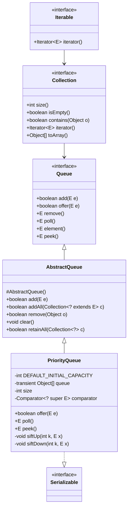
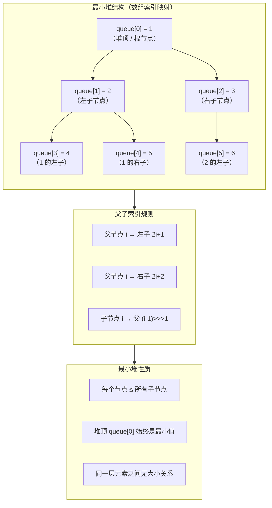
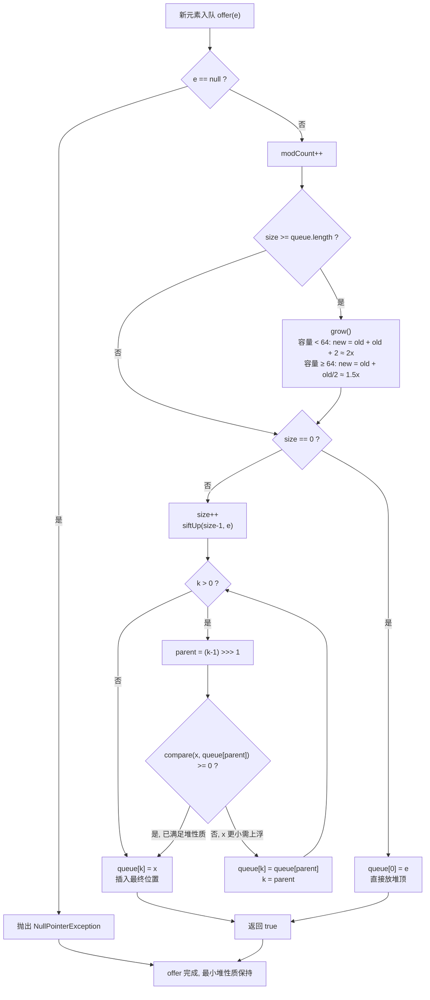

## 引言

Top-K 问题，用 PriorityQueue 一行代码就能解决。

Top-K 问题，用 PriorityQueue 一行代码就能解决。

找出最大的 K 个数、最小的 K 个数、第 K 大的元素——这些面试高频题，本质上都归结为同一个数据结构：二叉堆。`PriorityQueue` 就是 JDK 对二叉堆的实现。

不同于普通的 FIFO 队列，`PriorityQueue` 每次 `poll()` 返回的都是优先级最高（最小或最大）的元素。插入和删除的时间复杂度都是 O(log n)，比排序数组的 O(n) 高效得多。更重要的是，它不仅是理论工具——在实际开发中，堆排序、事件驱动模拟、图算法（Dijkstra、Prim）都依赖它。

本文将从源码级别深入剖析 PriorityQueue 的核心实现，带你理解：

1. 二叉堆的数组映射规则（siftUp 上浮与 siftDown 下滤）
2. 分阶段扩容策略（<64 时 2 倍，>=64 时 1.5 倍）的设计原因
3. 删除任意元素的双重调整策略（先下滤、再上浮）
4. 为什么 PriorityQueue 不实现 BlockingQueue 接口？

由于 `PriorityQueue` 跟前几个阻塞队列不一样，**它并没有实现 `BlockingQueue` 接口**，只是一个普通的非阻塞队列，只实现了 `Queue` 接口。

> **💡 核心提示**：为什么 PriorityQueue 不实现 BlockingQueue 接口？
>
> `BlockingQueue` 的核心语义是"当队列满时阻塞等待空间、当队列空时阻塞等待元素"。但 `PriorityQueue` 是**无界队列**（底层数组可无限扩容），永远不会满，所以不需要"满时阻塞"的语义。同时，优先队列的设计目标是**按优先级消费**而非**按到达顺序消费**，与阻塞队列的"生产者-消费者"协作模型在场景上正交。因此 JDK 的设计者有意将 `PriorityQueue` 定位为"非阻塞的优先级队列"，如果需要阻塞的优先级队列，应该使用 `DelayQueue` 或 `PriorityBlockingQueue`。

`Queue` 接口中定义了几组放数据和取数据的方法，来满足不同的场景。

| 操作 | 抛出异常 | 返回特定值 |
| --- | --- | --- |
| 放数据 | add() | offer() |
| 取数据（同时删除） | remove() | poll() |
| 查看数据（不删除） | element() | peek() |

**这两组方法的区别是：**

1. 当队列满的时候，再次添加数据：`add()` 会抛出异常，`offer()` 会返回 `false`。
2. 当队列为空的时候，再次取数据：`remove()` 会抛出异常，`poll()` 会返回 `null`。

不过 `PriorityQueue` 是**无界队列**，底层数组会自动扩容，所以实际上不会出现队列满的情况，`add()` 和 `offer()` 的行为完全相同。

## 类结构

先看一下 `PriorityQueue` 类里面有哪些属性：

```java
public class PriorityQueue<E>
        extends AbstractQueue<E>
        implements java.io.Serializable {

    /**
     * 数组初始容量大小，默认 11
     */
    private static final int DEFAULT_INITIAL_CAPACITY = 11;

    /**
     * 数组，用于存储堆元素（二叉堆的数组表示）
     */
    transient Object[] queue;

    /**
     * 元素个数
     */
    private int size = 0;

    /**
     * 比较器，用于排序元素优先级（null 时使用自然排序）
     */
    private final Comparator<? super E> comparator;

}
```

可以看出 `PriorityQueue` 底层是基于数组实现的，使用 `Object[]` 数组以**二叉堆**的方式存储元素，并且定义了比较器 `comparator`，用于排序元素的优先级。

### PriorityQueue 继承关系图



### 二叉堆在数组中的映射

二叉堆在数组中的映射规则：
- 节点 `i` 的左子节点下标为 `2*i + 1`
- 节点 `i` 的右子节点下标为 `2*i + 2`
- 节点 `i` 的父节点下标为 `(i - 1) >>> 1`

### 最小堆结构示意图



> **💡 核心提示**：为什么不允许 null 元素？
>
> `PriorityQueue` 在 `offer()` 入口处就做了 `e == null` 判空并抛出 `NullPointerException`。根本原因是**堆调整过程中需要调用 `compareTo()` 或 `Comparator.compare()`**，如果允许 null 进入队列，在 `siftUp` / `siftDown` 时一旦与 null 比较就会触发 NPE。与其在复杂的堆调整逻辑中处处防御，不如在入口处统一拦截——这是典型的 fail-fast 设计。

## 初始化

`PriorityQueue` 常用的初始化方法有 4 个：

1. 无参构造方法
2. 指定容量大小的有参构造方法
3. 指定比较器的有参构造方法
4. 同时指定容量和比较器的有参构造方法

```java
/**
 * 无参构造方法
 */
PriorityQueue<Integer> queue1 = new PriorityQueue<>();

/**
 * 指定容量大小的构造方法
 */
PriorityQueue<Integer> queue2 = new PriorityQueue<>(10);

/**
 * 指定比较器的有参构造方法
 */
PriorityQueue<Integer> queue3 = new PriorityQueue<>(Integer::compareTo);

/**
 * 同时指定容量和比较器的有参构造方法
 */
PriorityQueue<Integer> queue4 = new PriorityQueue<>(10, Integer::compare);
```

再看一下对应的源码实现：

```java
/**
 * 无参构造方法
 */
public PriorityQueue() {
    // 使用默认容量大小 11，不指定比较器
    this(DEFAULT_INITIAL_CAPACITY, null);
}

/**
 * 指定容量大小的构造方法
 */
public PriorityQueue(int initialCapacity) {
    this(initialCapacity, null);
}

/**
 * 指定比较器的有参构造方法
 */
public PriorityQueue(Comparator<? super E> comparator) {
    this(DEFAULT_INITIAL_CAPACITY, comparator);
}

/**
 * 同时指定容量和比较器的有参构造方法
 */
public PriorityQueue(int initialCapacity, Comparator<? super E> comparator) {
    if (initialCapacity < 1) {
        throw new IllegalArgumentException();
    }
    this.queue = new Object[initialCapacity];
    this.comparator = comparator;
}
```

可以看出 `PriorityQueue` 的无参构造方法使用默认容量 11，直接初始化数组，并且没有指定比较器（使用元素的自然排序）。所有构造方法最终都会委托给四参数的构造方法完成初始化。

## 放数据源码

放数据的方法有 2 个：

| 操作 | 抛出异常 | 返回特定值 |
| --- | --- | --- |
| 放数据 | add() | offer() |

### offer 方法源码

先看一下 `offer()` 方法源码，其他放数据方法逻辑也是大同小异。
由于 `PriorityQueue` 是无界队列，`offer()` 方法始终返回 `true`（永远不会返回 `false`）。

```java
/**
 * offer 方法入口
 *
 * @param e 元素
 * @return 始终返回 true
 */
public boolean offer(E e) {
    // 1. 判空，传参不允许为 null
    if (e == null) {
        throw new NullPointerException();
    }
    modCount++;
    int i = size;
    // 2. 当数组满的时候，执行扩容
    if (i >= queue.length) {
        grow(i + 1);
    }
    size = i + 1;
    // 3. 如果是第一次插入，就直接把元素放入数组下标 0
    if (i == 0) {
        queue[0] = e;
    } else {
        // 4. 否则通过 siftUp 上浮到合适位置，保持最小堆性质
        siftUp(i, e);
    }
    return true;
}
```

`offer()` 方法逻辑：判空 → 记录 `modCount` → 检查是否需要扩容 → 插入元素。如果是第一个元素，直接放在数组下标 0（堆顶）；否则调用 `siftUp` 将新元素上浮到合适位置，保持最小堆的性质。

再看一下扩容的源码：

```java
/**
 * 扩容
 */
private void grow(int minCapacity) {
    int oldCapacity = queue.length;
    // 1. 容量 < 64 时，新容量 = old + (old + 2) ≈ 2 倍
    //    容量 >= 64 时，新容量 = old + (old >> 1) = 1.5 倍
    int newCapacity = oldCapacity +
            ((oldCapacity < 64) ? (oldCapacity + 2) : (oldCapacity >> 1));
    // 2. 校验新容量是否超过上限
    if (newCapacity - MAX_ARRAY_SIZE > 0) {
        newCapacity = hugeCapacity(minCapacity);
    }
    // 3. 扩容为原数组的副本
    queue = Arrays.copyOf(queue, newCapacity);
}
```

> **💡 核心提示**：为什么扩容阈值是 64？为什么小容量 2x、大容量 1.5x？
>
> 这是一个经过实践验证的平衡点：
> - **小容量阶段（< 64）**：队列刚创建时元素少，频繁扩容的成本高于"多分配一点空间"的浪费。2 倍增长可以让小队列快速到达合理容量，减少早期扩容次数。
> - **大容量阶段（≥ 64）**：当数组已经较大时，每次扩容分配的绝对内存量已经很大（64 → 96 增加了 32，512 → 768 增加了 256）。如果继续用 2 倍增长，一次性分配过多内存，在内存紧张的场景下容易触发 OOM 或频繁的 GC。1.5 倍增长是一个经过验证的折中值——既不会增长过慢导致频繁 `Arrays.copyOf`，也不会一次分配过多。
> - **64 这个阈值**：恰好是二叉堆深度约为 log₂(64) = 6 层，此时堆操作 O(log n) 的性能已经比较可观，不再需要激进扩容。

扩容策略的设计比较务实：容量较小时（< 64）采用近似 2 倍扩容，减少扩容次数；容量较大时采用 1.5 倍扩容，避免一次性分配过多空间。超过 `MAX_ARRAY_SIZE`（`Integer.MAX_VALUE - 8`）时，调用 `hugeCapacity` 处理边界情况。

`PriorityQueue` 为了快速插入和删除，采用了**最小堆**（min-heap）结构，而不是直接使用有序数组。最小堆的定义是：**每个节点的值都小于等于其子节点的值**（根节点是最小值）。这样既能保证插入和删除的时间复杂度都是 O(log n)，又能避免移动过多元素。

### 最小堆工作原理图



### siftUp 上浮操作源码

下面看一下 `siftUp()` 方法源码，是怎么保证插入元素后堆仍然是有序的？

核心思路就是：新元素从当前位置不断与父节点比较，如果比父节点小就上移，直到不比父节点小为止，找到合适的位置插入。

```java
// 把元素上浮到合适的位置
private void siftUp(int k, E x) {
    // 1. 如果自定义了比较器，就使用自定义比较器的方式
    if (comparator != null) {
        siftUpUsingComparator(k, x);
    } else {
        // 2. 否则使用元素的自然排序（Comparable）
        siftUpComparable(k, x);
    }
}

// 自定义比较器的上浮方法
private void siftUpUsingComparator(int k, E x) {
    while (k > 0) {
        // 1. 找到父节点下标
        int parent = (k - 1) >>> 1;
        Object e = queue[parent];
        // 2. 如果当前元素 >= 父节点元素，说明已满足最小堆性质，停止上浮
        if (comparator.compare(x, (E) e) >= 0) {
            break;
        }
        // 3. 否则将父节点元素下移到当前位置
        queue[k] = e;
        k = parent;
    }
    // 4. 把当前元素插入到最终位置
    queue[k] = x;
}

// 默认比较器（自然排序）的上浮方法
private void siftUpComparable(int k, E x) {
    // 1. 将元素转为 Comparable 类型
    Comparable<? super E> key = (Comparable<? super E>) x;
    while (k > 0) {
        // 2. 找到父节点下标
        int parent = (k - 1) >>> 1;
        Object e = queue[parent];
        // 3. 如果当前元素 >= 父节点元素，停止上浮
        if (key.compareTo((E) e) >= 0) {
            break;
        }
        // 4. 否则将父节点元素下移
        queue[k] = e;
        k = parent;
    }
    // 5. 把当前元素插入到最终位置
    queue[k] = key;
}
```

两种方式逻辑完全一致，只是比较的方式不同。

> **💡 核心提示**：为什么采用"父节点下移 + 最终位置插入"而不是直接 swap？
>
> 传统的堆调整思路是"交换"（swap）当前元素与父/子节点，每次 swap 需要 3 次赋值操作（temp = a; a = b; b = temp）。而 JDK 的做法是：
> 1. 循环中只将父节点**下移覆盖**到子节点位置：`queue[k] = queue[parent]`（1 次赋值）
> 2. 循环结束时才将目标元素插入最终位置：`queue[k] = x`（1 次赋值）
>
> 假设上浮路径长度为 h（二叉堆高度 h ≈ log₂n），传统 swap 需要 3h 次赋值，而 JDK 的"下移 + 最终插入"只需 **h + 1 次赋值**。当 n 较大时，这几乎减少了一半的写操作，对缓存友好度更高。

### add 方法源码

`add()` 方法底层直接调用的是 `offer()` 方法，作用相同。

```java
/**
 * add 方法入口
 *
 * @param e 元素
 * @return 是否添加成功
 */
public boolean add(E e) {
    return offer(e);
}
```

## 取数据源码

取数据（取出并删除）的方法有 2 个：

| 操作 | 抛出异常 | 返回特定值 |
| --- | --- | --- |
| 取数据（同时删除） | remove() | poll() |

### poll 方法源码

看一下 `poll()` 方法源码，其他取数据方法逻辑大同小异，都是从堆顶（数组头部）弹出元素。
`poll()` 方法在取元素的时候，如果队列为空，直接返回 `null`，表示取元素失败。

```java
/**
 * poll 方法入口
 */
public E poll() {
    // 1. 如果数组为空，返回 null
    if (size == 0) {
        return null;
    }
    int s = --size;
    modCount++;
    // 2. 暂存堆顶元素，最后返回
    E result = (E) queue[0];
    // 3. 暂存堆尾元素，用于后续的下滤调整
    E x = (E) queue[s];
    // 4. 将堆尾位置置 null（帮助 GC 回收）
    queue[s] = null;
    // 5. 如果还有剩余元素，用堆尾元素下滤调整最小堆
    if (s != 0) {
        siftDown(0, x);
    }
    return result;
}
```

`poll()` 的逻辑：保存堆顶元素 → 将堆尾元素移到堆顶 → 堆尾置 `null`（GC 友好） → 调用 `siftDown` 将新的堆顶元素下滤到合适位置，恢复最小堆性质。

`poll()` 中使用的 `siftDown` 方法与 `offer()` 中的 `siftUp` 对称：新元素从堆顶不断与**较小的子节点**比较，如果比子节点大就下移，直到不比子节点大为止。

### siftDown 下滤操作源码

```java
// 把元素下滤到合适的位置
private void siftDown(int k, E x) {
    if (comparator != null) {
        siftDownUsingComparator(k, x);
    } else {
        siftDownComparable(k, x);
    }
}

private void siftDownUsingComparator(int k, E x) {
    int half = size >>> 1; // 只需检查到最后一个非叶子节点
    while (k < half) {
        // 1. 找到左子节点
        int child = (k << 1) + 1;
        Object c = queue[child];
        // 2. 找到右子节点（如果存在），并取左右子节点中较小的一个
        int right = child + 1;
        if (right < size && comparator.compare((E) c, (E) queue[right]) > 0) {
            child = right;
            c = queue[child];
        }
        // 3. 如果当前元素 <= 较小子节点，说明已满足最小堆性质，停止下滤
        if (comparator.compare(x, (E) c) <= 0) {
            break;
        }
        // 4. 否则将较小子节点上移到当前位置
        queue[k] = c;
        k = child;
    }
    // 5. 把当前元素插入到最终位置
    queue[k] = x;
}
```

### remove 方法源码

再看一下 `remove()` 方法源码。`remove()` 先调用 `poll()` 尝试取堆顶元素，如果取到直接返回；如果没取到（队列为空），`poll()` 返回 `null`，`remove()` 会抛出 `NoSuchElementException` 异常。

```java
/**
 * remove 方法入口
 */
public E remove() {
    // 1. 直接调用 poll 方法
    E x = poll();
    // 2. 如果取到数据，直接返回，否则抛出异常
    if (x != null) {
        return x;
    } else {
        throw new NoSuchElementException();
    }
}
```

除了 `remove()` 取堆顶元素外，`PriorityQueue` 还提供了删除任意元素的方法 `remove(Object o)`：

```java
/**
 * 删除指定元素的第一次出现
 */
public boolean remove(Object o) {
    // 1. 在数组中线性查找元素
    int i = indexOf(o);
    if (i == -1) {
        return false;
    }
    // 2. 找到后调用 removeAt 删除
    removeAt(i);
    return true;
}

private int indexOf(Object o) {
    if (o != null) {
        for (int i = 0; i < size; i++) {
            if (o.equals(queue[i])) {
                return i;
            }
        }
    }
    return -1;
}
```

`remove(Object o)` 需要先在数组中线性查找目标元素（O(n)），然后调用 `removeAt` 删除并调整堆结构：

```java
private E removeAt(int i) {
    modCount++;
    int s = --size;
    if (s == i) {
        // 删除的是最后一个元素，直接置 null 即可
        queue[i] = null;
    } else {
        // 用最后一个元素填补删除位置
        E moved = (E) queue[s];
        queue[s] = null;
        // 下滤调整
        siftDown(i, moved);
        // 如果下滤后元素仍在原位，说明需要上浮
        if (queue[i] == moved) {
            siftUp(i, moved);
        }
    }
    return null;
}
```

这里的设计很巧妙：删除任意元素后，用堆尾元素填补空缺，先尝试下滤。如果下滤后元素还在原位（说明它不比子节点大），再尝试上浮（说明它可能比父节点小）。这样无论填补元素是大是小，都能正确恢复最小堆性质。

## 查看数据源码

再看一下查看数据的源码，只查看，不删除。

| 操作 | 抛出异常 | 返回特定值 |
| --- | --- | --- |
| 查看数据（不删除） | element() | peek() |

### peek 方法源码

先看一下 `peek()` 方法源码，如果数组为空，直接返回 `null`。

```java
/**
 * peek 方法入口
 */
public E peek() {
    // 返回堆顶元素
    return (size == 0) ? null : (E) queue[0];
}
```

### element 方法源码

再看一下 `element()` 方法源码，如果队列为空，则抛出异常，底层直接调用 `peek()` 方法。

```java
/**
 * element 方法入口
 */
public E element() {
    // 1. 调用 peek 方法查询数据
    E x = peek();
    // 2. 如果查到数据，直接返回
    if (x != null) {
        return x;
    } else {
        // 3. 如果没找到，则抛出异常
        throw new NoSuchElementException();
    }
}
```

> **💡 核心提示**：为什么 iterator() 不保证按优先级顺序遍历？
>
> `PriorityQueue.iterator()` 返回的是底层 `Object[] queue` 数组的直接迭代器。二叉堆只保证**父子节点的偏序关系**（父 ≤ 子），**不保证同一层元素之间的大小关系**，更不保证整个数组的有序性。
>
> 例如堆 `[1, 2, 3, 4, 5, 6]` 对应的树结构是合法的堆，但数组本身不是有序的。如果需要按优先级顺序遍历，应该不断调用 `poll()` 逐个弹出元素，或者先 `new ArrayList<>(queue)` 然后 `Collections.sort()`。

## 生产环境避坑指南

在使用 `PriorityQueue` 时，以下 8 个陷阱是生产环境中最容易踩的坑：

### 坑 1：插入 null 元素直接 NPE

```java
PriorityQueue<String> pq = new PriorityQueue<>();
pq.offer(null); // 直接抛出 NullPointerException
```

**原因**：如前所述，堆调整时需要调用 `compareTo` 或 `compare`，null 会导致 NPE。JDK 选择在入口处统一拦截。
**建议**：业务层做好 null 过滤，或者用 Optional 包装。

### 坑 2：误以为 iterator() 有序，遍历结果"乱序"

```java
PriorityQueue<Integer> pq = new PriorityQueue<>();
pq.addAll(Arrays.asList(3, 1, 4, 1, 5, 9, 2, 6));
for (Integer e : pq) {
    System.out.print(e + " "); // 输出不是 1 1 2 3 4 5 6 9！
}
```

**原因**：`iterator()` 遍历的是底层数组，数组只满足堆的偏序性质，不保证全局有序。
**建议**：需要有序遍历时，使用 `while (!pq.isEmpty()) pq.poll()`。

### 坑 3：多线程环境下 ConcurrentModificationException 或数据错乱

```java
PriorityQueue<Integer> pq = new PriorityQueue<>();
// 线程 A: pq.offer(1);
// 线程 B: pq.poll();
// 可能导致数据丢失、数组越界或 CME
```

**原因**：`PriorityQueue` 没有任何内部同步机制，`size++`、`queue[k] = x` 等操作都不是原子操作。
**建议**：多线程场景使用 `PriorityBlockingQueue`，或外部加锁。

### 坑 4：未实现 Comparable 的元素插入时 ClassCastException

```java
class Task { int id; } // 没有实现 Comparable
PriorityQueue<Task> pq = new PriorityQueue<>();
pq.add(new Task()); // ClassCastException: Task cannot be cast to Comparable
```

**原因**：没有指定 Comparator 时，`siftUpComparable` 会将元素强转为 `Comparable`。
**建议**：自定义类要么实现 `Comparable`，要么构造时传入 `Comparator`。

### 坑 5：元素入队后修改字段值，破坏堆性质

```java
PriorityQueue<Task> pq = new PriorityQueue<>(Comparator.comparingInt(t -> t.priority));
Task t = new Task(1, 5);
pq.add(t);
t.priority = 0; // 入队后修改优先级！堆性质被破坏
pq.poll(); // 取出的可能不是真正的最小元素
```

**原因**：`PriorityQueue` 只在插入/删除时维护堆性质，不会监听元素内部变化。
**建议**：使用不可变对象作为队列元素；或者需要"更新优先级"时先 remove 再 offer。

### 坑 6：remove(Object) 的 O(n) 性能陷阱

```java
// 循环内反复调用 remove
for (int i = 0; i < 100000; i++) {
    pq.remove(target); // 每次都是 O(n) 线性查找 + O(log n) 调整
}
```

**原因**：`remove(Object)` 需要线性扫描整个数组找目标位置，时间复杂度 O(n)。
**建议**：如果频繁删除任意元素，考虑使用 `TreeSet`（O(log n)）或维护额外的索引结构。

### 坑 7：序列化时 comparator 可能丢失

```java
PriorityQueue<Task> pq = new PriorityQueue<>(Comparator.comparingInt(t -> t.id));
// 序列化后再反序列化
ObjectOutputStream oos = new ObjectOutputStream(...);
oos.writeObject(pq);
// 如果 comparator 不是序列化安全的，反序列化后比较器可能为 null
```

**原因**：`comparator` 字段是 `transient` 的，不会参与默认序列化。JDK 通过 `writeObject`/`readObject` 特殊处理来保存比较器信息，但如果比较器本身不可序列化，就会丢失。
**建议**：确保自定义 `Comparator` 实现 `Serializable`。

### 坑 8：误用 PriorityQueue 做"最近 N 个元素"的场景

```java
// 想用 PriorityQueue 维护 top-K 最大元素
PriorityQueue<Integer> pq = new PriorityQueue<>(); // 默认最小堆
// 需要的是最大堆！但 PriorityQueue 没有内置的 max-heap 构造方式
```

**原因**：`PriorityQueue` 默认是最小堆，如果需要最大堆，必须传入 `(a, b) -> b.compareTo(a)`。
**建议**：维护 top-K 最大元素时，构造为 `PriorityQueue<>(k, Collections.reverseOrder())`。

## 总结

这篇文章讲解了 `PriorityQueue` 优先队列的核心源码，了解到 `PriorityQueue` 具有以下特点：

1. `PriorityQueue` 实现了 `Queue` 接口，是一个**非阻塞**的优先队列，提供了两组放数据和取数据的方法。
2. `PriorityQueue` 底层基于数组实现，按照**最小堆**（min-heap）存储，通过 `siftUp` 和 `siftDown` 操作保持堆性质。
3. 初始化时可以指定数组长度和自定义比较器。不指定比较器时使用元素的自然排序（`Comparable`）。
4. 初始容量是 11，当容量小于 64 时采用近似 2 倍扩容，否则采用 1.5 倍扩容。
5. 每次都是从堆顶（数组下标 0）取元素，取之后用 `siftDown` 调整最小堆。

### 关键操作时间复杂度对比

| 操作 | 方法 | 时间复杂度 | 说明 |
| --- | --- | --- | --- |
| 插入 | offer/add | O(log n) | siftUp 上浮操作 |
| 取堆顶 | poll/remove | O(log n) | siftDown 下滤操作 |
| 查看堆顶 | peek/element | O(1) | 直接返回 queue[0] |
| 删除任意元素 | remove(Object) | O(n) | 需线性查找 + siftDown/siftUp 调整 |
| 建堆 | heapify（有参构造传入集合） | O(n) | 批量构建堆 |

### PriorityQueue vs DelayQueue vs TreeSet 对比

| 特性 | PriorityQueue | DelayQueue | TreeSet |
| --- | --- | --- | --- |
| **底层数据结构** | 数组 + 二叉堆（最小堆） | 数组 + 二叉堆（内部委托 PriorityQueue） | 红黑树（平衡二叉搜索树） |
| **排序方式** | 自然排序或自定义 Comparator | 元素的 `getDelay()` 返回值 | 自然排序或自定义 Comparator |
| **是否有序遍历** | 否（iterator 无序） | 否（iterator 无序） | 是（in-order 有序遍历） |
| **是否阻塞** | 否（非阻塞） | 是（take() 等待元素到期） | 否（非阻塞） |
| **线程安全** | 否 | 是（内部使用 ReentrantLock） | 否（可用 `Collections.synchronizedSortedSet` 包装） |
| **是否允许 null** | 否 | 否 | 否 |
| **插入时间复杂度** | O(log n) | O(log n) | O(log n) |
| **获取最小元素** | O(1)（peek） | O(1)（peek），O(log n)（take，含到期等待） | O(log n)（first） |
| **删除任意元素** | O(n) | O(n) | O(log n) |
| **是否支持范围查询** | 否 | 否 | 是（`subSet`, `headSet`, `tailSet`） |
| **典型使用场景** | Top-K 问题、Dijkstra 最短路径、任务调度按优先级排序 | 定时任务调度、延迟消息队列、缓存过期清理 | 需要有序遍历和范围查询的排序集合 |

### 使用建议

1. **不支持 null 元素**：`PriorityQueue` 不允许插入 `null`，会抛出 `NullPointerException`。如果元素可能为空，需要在插入前做判空处理。
2. **无序迭代**：`PriorityQueue` 的 `iterator()` 方法不保证按优先级顺序遍历，因为它返回的是底层数组的迭代器。如果需要按优先级顺序消费元素，应使用 `poll()` 而不是 `iterator()`。
3. **非线程安全**：`PriorityQueue` 没有做任何同步处理，在多线程环境下使用需要外部加锁，或者改用线程安全的 `PriorityBlockingQueue`。
4. **正确使用比较器**：使用自然排序时，元素类型必须实现 `Comparable` 接口，否则插入时会抛出 `ClassCastException`。如果元素不实现 `Comparable`，必须在构造时传入自定义 `Comparator`。
5. **元素入队后不要修改影响比较的字段**：这会破坏堆的偏序性质，导致 `poll()` 取出的不是真正的最小/最大元素。

### 行动清单

1. **检查生产代码**：搜索项目中使用 `PriorityQueue` 的地方，确认没有遗漏 null 检查、没有在不恰当的并发场景直接使用。
2. **替换无序遍历**：如果代码中有 `for (E e : priorityQueue)` 的用法，确认是否真的不关心顺序。如果需要有序消费，改为 `while (!pq.isEmpty()) pq.poll()`。
3. **自定义类入队前**：确保元素类实现了 `Comparable` 或在构造 `PriorityQueue` 时传入了 `Comparator`，避免运行时的 `ClassCastException`。
4. **线程安全升级**：如果当前在多线程环境下使用 `PriorityQueue`，替换为 `PriorityBlockingQueue` 或在外层加锁。
5. **性能评估**：如果需要频繁删除任意元素（而非只删堆顶），评估是否应改用 `TreeSet`（O(log n) 删除）或其他数据结构。
6. **Top-K 场景**：使用 `PriorityQueue` 做 Top-K 时，记住：求最大 K 个元素用最小堆（丢弃比堆顶更小的），求最小 K 个元素用最大堆（丢弃比堆顶更大的）。
7. **Comparator 序列化**：如果 `PriorityQueue` 需要序列化传输，确保自定义的 `Comparator` 实现了 `Serializable` 接口。
8. **扩展阅读**：推荐阅读《算法（第 4 版）》第 2.4 节"优先队列"，深入理解二叉堆的理论基础；推荐阅读 JDK 中 `PriorityBlockingQueue` 源码，了解阻塞优先级队列的锁机制。
