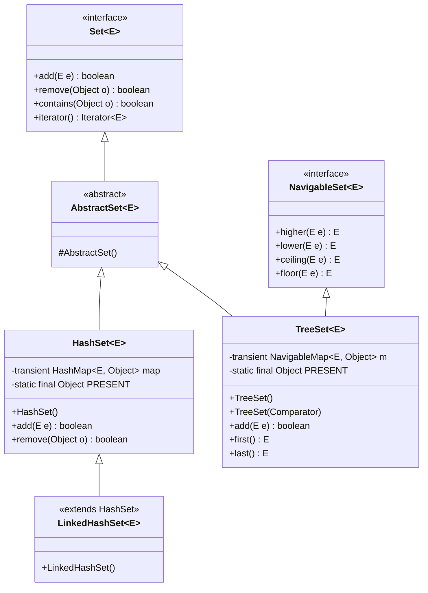
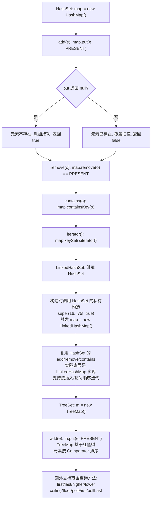

## 引言

HashSet 去重的底层原理，90% 的人说不清楚。

HashSet 去重的底层原理，90% 的人说不清楚。

当你调用 `set.add(element)` 时，JDK 内部究竟发生了什么？为什么自定义对象不重写 `hashCode` 和 `equals` 就会导致去重失效？三个 Set 实现（HashSet、LinkedHashSet、TreeSet）底层分别依赖什么数据结构？

本文将从源码级别剖析 Set 集合的核心机制，带你理解：

1. HashSet 如何用 HashMap 实现去重（PRESENT 对象的设计意图）
2. LinkedHashSet 如何保证插入顺序（访问顺序 LRU 的实现原理）
3. TreeSet 的红黑树排序机制与 Comparator 陷阱

**共同点**

这三个类都实现了 `Set` 接口，所以使用方式相同：用 `add()` 添加元素、`remove()` 删除元素、`contains()` 判断元素是否存在、`iterator()` 迭代遍历元素。它们都可以去除重复元素。

**特性**

1. `HashSet` 是最基础的 Set 集合，可以去除重复元素，元素存储是无序的。
2. `LinkedHashSet` 在 Set 基本功能基础上，增加了按照元素插入顺序或访问顺序迭代的能力。
3. `TreeSet` 可以保证元素按照大小顺序排列，支持范围查询。

**底层实现**

1. `HashSet` 基于 `HashMap` 实现，采用组合方式（内部持有 HashMap），并非继承。
2. `LinkedHashSet` 继承自 `HashSet`，但内部持有的是 `LinkedHashMap`。
3. `TreeSet` 基于 `TreeMap` 实现，同样采用组合方式，与上面两个 Set 没有直接关系。

### 类图架构



### 核心工作原理



三个 Set 集合的核心工作原理如上。

## HashSet 源码实现

### 类属性

```java
public class HashSet<E>
        extends AbstractSet<E>
        implements Set<E>, Cloneable, java.io.Serializable {

    /**
     * 使用 HashMap 存储数据，key 是元素，value 是占位对象
     */
    private transient HashMap<E, Object> map;

    /**
     * 所有 key 对应的 value 值，统一使用同一个空对象
     */
    private static final Object PRESENT = new Object();

}
```

`HashSet` 内部采用 `HashMap` 存储元素，利用 `HashMap` 的 key 不能重复的特性实现元素去重。value 统一使用一个静态空对象 `PRESENT` 占位，不存储任何实际数据。所有 key 共用同一个 value 对象，避免了为每个元素创建额外的 value 实例，节省内存。

> **💡 核心提示**：为什么 `PRESENT` 不使用 `null`？因为 `HashMap.put(key, null)` 是合法操作，返回的是旧值 `null`，这样 `add()` 方法就无法区分"元素已存在且value为null"和"元素不存在添加成功"两种情况。使用一个非null的占位对象，保证了语义的清晰。

### 初始化

`HashSet` 常用的构造方法有两个：无参构造和有参构造（指定初始容量和负载系数）。

```java
/**
 * 无参构造方法
 */
HashSet<Integer> hashSet1 = new HashSet<>();

/**
 * 有参构造方法，指定初始容量和负载系数
 */
HashSet<Integer> hashSet2 = new HashSet<>(16, 0.75f);
```

构造方法的源码实现：

```java
/**
 * 无参构造方法
 */
public HashSet() {
    map = new HashMap<>();
}

/**
 * 有参构造方法，指定初始容量和负载系数
 */
public HashSet(int initialCapacity, float loadFactor) {
    map = new HashMap<>(initialCapacity, loadFactor);
}
```

`HashSet` 的构造方法全部委托给 `HashMap` 的对应构造方法实现。

### 常用方法源码

```java
/**
 * 添加元素
 */
public boolean add(E e) {
    return map.put(e, PRESENT) == null;
}

/**
 * 删除元素
 */
public boolean remove(Object o) {
    return map.remove(o) == PRESENT;
}

/**
 * 判断是否包含元素
 */
public boolean contains(Object o) {
    return map.containsKey(o);
}

/**
 * 迭代器
 */
public Iterator<E> iterator() {
    return map.keySet().iterator();
}
```

`HashSet` 的方法全部委托给 `HashMap` 实现：
- `add(e)` → `map.put(e, PRESENT)`：返回 `null` 表示 key 不存在，添加成功（返回 `true`）；返回旧值表示 key 已存在，添加失败（返回 `false`）
- `remove(o)` → `map.remove(o)`：判断返回值是否等于 `PRESENT` 来确定是否删除成功
- `contains(o)` → `map.containsKey(o)`：直接判断 key 是否存在
- `iterator()` → `map.keySet().iterator()`：返回 key 集合的迭代器

## LinkedHashSet 源码实现

### 类属性

`LinkedHashSet` 继承自 `HashSet`，没有任何私有属性。

```java
public class LinkedHashSet<E>
        extends HashSet<E>
        implements Set<E>, Cloneable, java.io.Serializable {
}
```

### 初始化

`LinkedHashSet` 常用的构造方法有三个：

```java
/**
 * 无参构造方法
 */
Set<Integer> linkedHashSet1 = new LinkedHashSet<>();

/**
 * 有参构造方法，指定初始容量
 */
Set<Integer> linkedHashSet2 = new LinkedHashSet<>(16);

/**
 * 有参构造方法，指定初始容量和负载系数
 */
Set<Integer> linkedHashSet3 = new LinkedHashSet<>(16, 0.75f);
```

构造方法的源码实现：

```java
/**
 * 无参构造方法
 */
public LinkedHashSet() {
    super(16, .75f, true);
}

/**
 * 有参构造方法，指定初始容量
 */
public LinkedHashSet(int initialCapacity) {
    super(initialCapacity, .75f, true);
}

/**
 * 有参构造方法，指定初始容量和负载系数
 */
public LinkedHashSet(int initialCapacity, float loadFactor) {
    super(initialCapacity, loadFactor, true);
}
```

`LinkedHashSet` 的构造方法全部调用父类 `HashSet` 的三参数构造方法，第三个参数 `true` 是一个占位标识符（`dummy`），目的是让这个构造方法区别于 `HashSet` 的其他构造方法，从而在内部创建 `LinkedHashMap` 而不是 `HashMap`。

这个三参数构造方法定义在 `HashSet` 中，是**包级私有**的（没有 `public` 修饰），专门给 `LinkedHashSet` 使用：

```java
/**
 * HashSet 的包级私有构造方法，专门给 LinkedHashSet 使用
 *
 * @param initialCapacity 初始容量
 * @param loadFactor      负载系数
 * @param dummy           占位标识符，用于区分调用哪个构造方法
 */
HashSet(int initialCapacity, float loadFactor, boolean dummy) {
    map = new LinkedHashMap<>(initialCapacity, loadFactor);
}
```

> **💡 核心提示**：这是 JDK 源码中一个经典的**设计模式**——通过包级私有构造方法 + 占位参数，让子类能控制父类内部实现的选择。JDK 开发者不想让外部开发者直接调用这个构造方法创建出"基于 LinkedHashMap 的 HashSet"，但又需要让同包下的 `LinkedHashSet` 使用它。

`LinkedHashSet` 的其他方法（`add`、`remove`、`contains`、`iterator`）全部继承自 `HashSet`，无需重写。它的有序迭代特性完全由底层的 `LinkedHashMap` 实现保证。

## TreeSet 源码实现

### 类属性

```java
public class TreeSet<E> extends AbstractSet<E>
        implements NavigableSet<E>, Cloneable, java.io.Serializable {

    /**
     * 使用 NavigableMap 存储数据，实际类型是 TreeMap
     */
    private transient NavigableMap<E, Object> m;

    /**
     * value 的默认值，与 HashSet 类似
     */
    private static final Object PRESENT = new Object();

}
```

`TreeSet` 内部使用 `NavigableMap` 存储数据，`NavigableMap` 是 `TreeMap` 的父接口，实际运行时会被 `TreeMap` 实例替换。value 同样使用默认空对象 `PRESENT`，与 `HashSet` 的设计一致。

### 初始化

`TreeSet` 有两个构造方法：无参构造（默认升序）和有参构造（指定排序方式）。

```java
/**
 * 无参构造方法，默认升序
 */
TreeSet<Integer> treeSet1 = new TreeSet<>();

/**
 * 有参构造方法，传入排序方式，这里传入倒序
 */
TreeSet<Integer> treeSet2 = new TreeSet<>(Collections.reverseOrder());
```

构造方法的源码实现：

```java
/**
 * 私有构造方法，接收一个 NavigableMap 实例
 */
TreeSet(NavigableMap<E, Object> m) {
    this.m = m;
}

/**
 * 无参构造方法
 */
public TreeSet() {
    this(new TreeMap<E, Object>());
}

/**
 * 有参构造方法，传入排序方式
 */
public TreeSet(Comparator<? super E> comparator) {
    this(new TreeMap<>(comparator));
}
```

`TreeSet` 的构造方法内部创建 `TreeMap` 实例并赋值给 `m`，基于 `TreeMap` 的红黑树实现元素排序。

### 常用方法源码

```java
/**
 * 添加元素
 */
public boolean add(E e) {
    return m.put(e, PRESENT) == null;
}

/**
 * 删除元素
 */
public boolean remove(Object o) {
    return m.remove(o) == PRESENT;
}

/**
 * 判断是否包含元素
 */
public boolean contains(Object o) {
    return m.containsKey(o);
}

/**
 * 迭代器
 */
public Iterator<E> iterator() {
    return m.navigableKeySet().iterator();
}
```

`TreeSet` 的方法全部委托给 `TreeMap` 实现。与 `HashSet` 不同的是，`TreeSet` 的迭代器使用的是 `navigableKeySet().iterator()`，而 `HashSet` 使用的是 `keySet().iterator()`。

`TreeSet` 的元素排序功能由 `TreeMap` 的红黑树实现。由于元素按大小排列，`TreeSet` 相比其他 Set 集合额外提供了很多按元素大小范围查询的方法：

**其他方法列表：**

| 作用 | 方法签名 |
| :--- | :--- |
| 获取第一个（最小）元素 | `E first()` |
| 获取最后一个（最大）元素 | `E last()` |
| 获取大于指定元素的最小元素 | `E higher(E e)` |
| 获取小于指定元素的最大元素 | `E lower(E e)` |
| 获取大于等于指定元素的最小元素 | `E ceiling(E e)` |
| 获取小于等于指定元素的最大元素 | `E floor(E e)` |
| 获取并删除第一个元素 | `E pollFirst()` |
| 获取并删除最后一个元素 | `E pollLast()` |
| 获取小于 toElement 的子集合 | `NavigableSet<E> headSet(E toElement, boolean inclusive)` |
| 获取大于 fromElement 的子集合 | `NavigableSet<E> tailSet(E fromElement, boolean inclusive)` |
| 获取指定范围的子集合（精确控制包含关系） | `NavigableSet<E> subSet(E from, boolean fromInc, E to, boolean toInc)` |
| 获取指定范围的子集合（左闭右开） | `SortedSet<E> subSet(E fromElement, E toElement)` |

## 生产环境避坑指南

基于上述源码分析，以下是 Set 集合在生产环境中常见的陷阱：

| 陷阱 | 现象 | 解决方案 |
| :--- | :--- | :--- |
| 自定义对象未重写 equals/hashCode | `HashSet` 去重失效，相同对象被重复添加 | 自定义类必须正确重写 `equals()` 和 `hashCode()` |
| HashSet 遍历时删除元素 | `ConcurrentModificationException` | 使用 `Iterator.remove()` 或 `removeIf()` |
| TreeSet 的 key 不可比较 | `ClassCastException` | key 必须实现 `Comparable` 或提供 `Comparator` |
| 修改了已加入 TreeSet 的 key | 红黑树结构错乱，get/remove 返回错误 | 不要用可变对象作为 TreeSet 的 key，或修改后重新 add |
| LinkedHashSet 内存膨胀 | 每个节点多了 before/after 两个引用 | 数据量大时评估内存，不需要有序时用 `HashSet` |
| HashSet 的初始容量设置不当 | 频繁扩容或空间浪费 | 预估元素数量 n，设置容量为 `n / 0.75 + 1` |

## 总结

`HashSet`、`LinkedHashSet`、`TreeSet` 三个常用的 Set 集合的共同点是都实现了 `Set` 接口，使用方式相同，都可以去除重复元素。

不同点如下：

**`HashSet` 的关键特性：**

1. 是最基础的 Set 集合，可以去除重复元素，元素无序。
2. 基于 `HashMap` 实现，采用组合方式（内部持有 HashMap）。
3. 利用 `HashMap` 的 key 不重复特性，value 是一个静态空对象 `PRESENT`。

**`LinkedHashSet` 的关键特性：**

1. 继承自 `HashSet`，但内部持有的是 `LinkedHashMap`（通过 `HashSet` 的包级私有构造方法实现）。
2. 在 Set 基本功能基础上，支持按元素插入顺序或访问顺序迭代。
3. 代价是额外维护一个双向链表，增加一倍的引用存储空间。

**`TreeSet` 的关键特性：**

1. 基于 `TreeMap` 实现，采用组合方式，与其他两个 Set 没有直接关系。
2. 可以保证元素按大小顺序排列（默认升序，可自定义 `Comparator`）。
3. 代价是查询、插入、删除操作的时间复杂度从 O(1) 退化到 O(log n)。

### 三种 Set 集合对比

| 特性 | `HashSet` | `LinkedHashSet` | `TreeSet` |
| :--- | :--- | :--- | :--- |
| 底层实现 | HashMap | LinkedHashMap | TreeMap |
| 底层结构 | 数组 + 链表/红黑树 | 数组 + 链表/红黑树 + 双向链表 | 纯红黑树 |
| 元素顺序 | 无序 | 插入/访问顺序 | 大小排序 |
| 是否允许 null | 是（1个） | 是（1个） | 否（自然排序不允许） |
| add 时间复杂度 | O(1) | O(1) | O(log n) |
| contains 时间复杂度 | O(1) | O(1) | O(log n) |
| 遍历时间复杂度 | O(capacity) | O(size) | O(n) |
| 额外内存开销 | 无 | 每个节点多 2 个引用 | 红黑树节点额外引用 |
| 线程安全 | ❌ | ❌ | ❌ |
| 推荐场景 | 通用去重 | 需要保持插入顺序 | 需要排序/范围查询 |

### 行动清单

1. **检查点**：确认自定义类作为 HashSet 元素时，是否同时重写了 `equals()` 和 `hashCode()`，且两者逻辑一致。
2. **优化建议**：HashSet 创建时预估元素数量 n，初始容量设置为 `n / 0.75f + 1`，避免扩容。
3. **避坑**：LinkedHashSet 遍历时删除元素要用 `Iterator.remove()` 或 `removeIf()`，避免 `ConcurrentModificationException`。
4. **避坑**：TreeSet 不允许 null 元素（自然排序），自定义 Comparator 需保证**自反性、传递性、对称性**，否则红黑树行为未定义。
5. **避坑**：不要修改已加入 TreeSet 的元素的比较字段，会导致查找失败。应先 remove 再 add 重新插入。
6. **扩展阅读**：推荐阅读《Effective Java》第3版第14条（覆盖 equals 时总要覆盖 hashCode）、第40条（坚持使用注解@Override）。