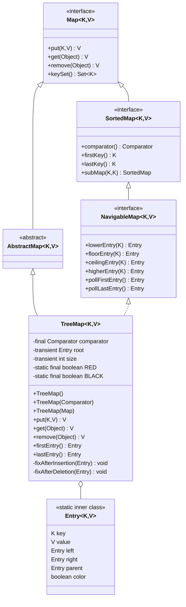
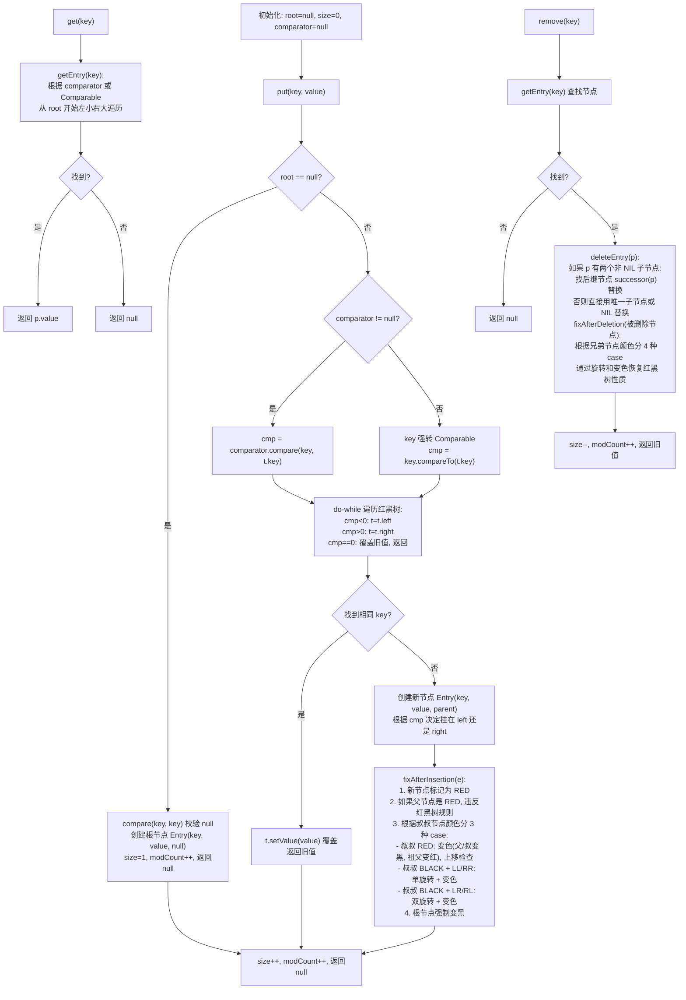

## 引言

如果需要一个天然有序的 Map，你会选什么？
如果需要一个天然有序的 Map，你会选什么？

`HashMap` 查询快但无序，`LinkedHashMap` 能保证插入顺序但无法按 key 排序。当你需要按键的自然顺序或自定义排序时，`TreeMap` 是唯一的选择。它底层基于红黑树实现，每次插入、删除、查询都能稳定保证 O(log n) 的时间复杂度——不像 `HashMap` 在极端情况下会退化为 O(n)。

本文将从源码级别剖析 TreeMap 的核心机制，带你理解：

1. TreeMap 如何用红黑树实现按键排序（红黑树的 5 条特性）
2. 为什么新节点默认是红色？插入后如何自平衡？
3. TreeMap 相比 HashMap 的性能权衡与适用场景

## 简介

`HashMap` 底层结构是基于数组 + 链表/红黑树实现的，而 `TreeMap` 底层结构是**纯粹的红黑树**，没有数组。`TreeMap` 利用红黑树的特性实现对键的排序。

### 红黑树 5 条特性

额外介绍一下红黑树的 5 条特性：

1. 节点是红色或者黑色
2. 根节点是黑色
3. 所有叶子节点（NIL 节点）是黑色
4. 每个红色节点的两个子节点都是黑色（从每个叶子到根的所有路径上不能有两个连续的红色节点）
5. 从任一节点到其每个叶子的所有路径都包含相同数目的黑色节点

红黑树是基于平衡二叉树的改进。平衡二叉树是为了解决二叉搜索树在特殊情况下退化成链表、查找/插入效率退化到 O(n) 的问题，规定左右子树高度差不超过 1，但插入、删除节点时所做的平衡操作比较复杂。而红黑树通过上述 5 条特性，保证了平衡操作实现相对简单，树的高度仅比平衡二叉树略高，查找、插入、删除的时间复杂度都是 O(log n)。

### 类图架构



### 核心工作原理

`TreeMap` 的核心工作原理可以用下面的流程图概括：



## 使用示例

利用 `TreeMap` 可以自动对键进行排序的特性，比较适用一些需要排序的场景，比如排行榜、商品列表等。

```java
Map<Integer, String> map = new TreeMap<>();
map.put(1, "One");
map.put(3, "Three");
map.put(2, "Two");
System.out.println(map); // 输出：{1=One, 2=Two, 3=Three}
```

实现一个简单的热词排行榜功能：

```java
/**
 * 热词
 **/
public class HotWord {

    /**
     * 热词内容
     */
    String word;
    /**
     * 热度
     */
    Integer count;

    public HotWord(String word, Integer count) {
        this.word = word;
        this.count = count;
    }

}
```

```java
import java.util.Comparator;
import java.util.TreeMap;

/**
 * 热词排行榜
 **/
public class Leaderboard {

    /**
     * 自定义排序方式，按照热度降序排列
     */
    private static final Comparator<HotWord> HOT_WORD_COMPARATOR = new Comparator<HotWord>() {
        @Override
        public int compare(HotWord o1, HotWord o2) {
            return Integer.compare(o2.count, o1.count); // 降序排列
        }
    };

    // 使用 TreeMap 存储排行榜数据，key 是热词对象，value 是热词标题
    private TreeMap<HotWord, String> rankMap = new TreeMap<>(HOT_WORD_COMPARATOR);

    // 添加成绩
    public void addHotWord(String name, int score) {
        rankMap.put(new HotWord(name, score), name);
    }

    /**
     * 打印排行榜
     */
    public void printLeaderboard() {
        System.out.println("热词排行榜:");
        int rank = 1;
        for (HotWord hotWord : rankMap.keySet()) {
            System.out.println("#" + rank + " " + hotWord);
            rank++;
        }
    }

    public static void main(String[] args) {
        Leaderboard leaderboard = new Leaderboard();
        leaderboard.addHotWord("闲鱼崩了", 90);
        leaderboard.addHotWord("淘宝崩了", 95);
        leaderboard.addHotWord("闲鱼崩了", 85);
        leaderboard.addHotWord("钉钉崩了", 80);
        leaderboard.printLeaderboard();
    }

}
```

输出结果：

```
热词排行榜:
#1 HotWord(word=淘宝崩了, count=95)
#2 HotWord(word=闲鱼崩了, count=90)
#3 HotWord(word=闲鱼崩了, count=85)
#4 HotWord(word=钉钉崩了, count=80)
```

## 类属性

看一下 TreeMap 的类属性，包含哪些字段：

```java
public class TreeMap<K, V>
        extends AbstractMap<K, V>
        implements NavigableMap<K, V>, Cloneable, java.io.Serializable {

    /**
     * 排序方式（comparator 为 null 时使用 key 的自然排序）
     */
    private final Comparator<? super K> comparator;

    /**
     * 红黑树根节点
     */
    private transient Entry<K, V> root;

    /**
     * 红黑树节点数
     */
    private transient int size = 0;

    /**
     * 红黑树的颜色常量
     * RED = false, BLACK = true
     */
    private static final boolean RED = false;
    private static final boolean BLACK = true;

    /**
     * 红黑树节点对象
     */
    static final class Entry<K, V> implements Map.Entry<K, V> {
        K key;
        V value;
        Entry<K, V> left;    // 左子节点
        Entry<K, V> right;   // 右子节点
        Entry<K, V> parent;  // 父节点
        boolean color = BLACK;  // 颜色标记，默认为黑色

        /**
         * 构造方法
         */
        Entry(K key, V value, Entry<K, V> parent) {
            this.key = key;
            this.value = value;
            this.parent = parent;
        }
    }

}
```

TreeMap 的类属性比较简单，包含排序方式 `comparator`、红黑树根节点 `root`、节点个数 `size` 等。自定义了一个红黑树节点类 `Entry`，内部属性包括键值对、左右子节点、父节点、颜色标记等。

关于颜色常量的设计：`RED = false`、`BLACK = true`，使用 `boolean` 类型而不是 `int` 或 `enum`，节省内存。新创建的 `Entry` 节点默认是 `BLACK`，但实际插入时 `fixAfterInsertion` 方法会先将新节点标记为 `RED`，再进行红黑树调整。

## 初始化

TreeMap 常用的初始化方式有下面三个：

1. 无参初始化，使用默认的排序方式（key 的自然排序）。
2. 指定排序方式的初始化。
3. 将普通 Map 转换为 TreeMap，使用默认的排序方式。

```java
/**
 * 无参初始化
 */
Map<Integer, Integer> map1 = new TreeMap<>();

/**
 * 指定排序方式初始化
 */
Map<Integer, Integer> map2 = new TreeMap<>(new Comparator<Integer>() {
    @Override
    public int compare(Integer o1, Integer o2) {
        return o1.compareTo(o2);
    }
});

/**
 * 将普通 Map 转换为 TreeMap
 */
Map<Integer, Integer> map3 = new TreeMap<>(new HashMap<>());
```

再看一下对应的源码实现：

```java
/**
 * 无参初始化
 */
public TreeMap() {
    comparator = null;
}

/**
 * 指定排序方式初始化
 */
public TreeMap(Comparator<? super K> comparator) {
    this.comparator = comparator;
}

/**
 * 将普通 Map 转换为 TreeMap
 */
public TreeMap(Map<? extends K, ? extends V> m) {
    comparator = null;
    putAll(m);
}
```

TreeMap 的构造方法非常简单，只是设置 `comparator`。注意 TreeMap 采用了**懒初始化**策略，创建时不会初始化红黑树，红黑树在第一次 `put` 时才构建。

## 方法列表

由于 TreeMap 存储是按照键的顺序排列的，所以还可以进行范围查询，下面举一些示例。

```java
import java.util.Collections;
import java.util.Map;
import java.util.TreeMap;

/**
 * TreeMap 方法测试
 */
public class TreeMapTest {

    public static void main(String[] args) {
        // 1. 创建一个热词排行榜（按热度倒序），key 是热度，value 是热词内容
        TreeMap<Integer, String> rankMap = new TreeMap<>(Collections.reverseOrder());
        rankMap.put(80, "阿里云崩了");
        rankMap.put(100, "淘宝崩了");
        rankMap.put(90, "钉钉崩了");
        rankMap.put(60, "闲鱼崩了");
        rankMap.put(70, "支付宝崩了");

        System.out.println("热词排行榜：");
        for (Map.Entry<Integer, String> entry : rankMap.entrySet()) {
            System.out.println("#" + entry.getKey() + " " + entry.getValue());
        }
        System.out.println("-----------");

        // 2. 获取排行榜的第一个元素
        Map.Entry<Integer, String> firstEntry = rankMap.firstEntry();
        System.out.println("firstEntry: " + firstEntry);

        // 3. 获取排行榜的最后一个元素
        Map.Entry<Integer, String> lastEntry = rankMap.lastEntry();
        System.out.println("lastEntry: " + lastEntry);

        // 4. 获取排行榜的大于指定键的最小元素（由于是倒序排列，所以结果是反的）
        Map.Entry<Integer, String> higherEntry = rankMap.higherEntry(70);
        System.out.println("higherEntry: " + higherEntry);

        // 5. 获取排行榜的小于指定键的最大元素
        Map.Entry<Integer, String> lowerEntry = rankMap.lowerEntry(70);
        System.out.println("lowerEntry: " + lowerEntry);

        // 6. 获取排行榜的大于等于指定键的最小元素
        Map.Entry<Integer, String> ceilingEntry = rankMap.ceilingEntry(70);
        System.out.println("ceilingEntry: " + ceilingEntry);

        // 7. 获取排行榜的小于等于指定键的最大元素
        Map.Entry<Integer, String> floorEntry = rankMap.floorEntry(70);
        System.out.println("floorEntry: " + floorEntry);
    }

}
```

输出结果：

```
热词排行榜：
#100 淘宝崩了
#90 钉钉崩了
#80 阿里云崩了
#70 支付宝崩了
#60 闲鱼崩了
-----------
firstEntry: 100=淘宝崩了
lastEntry: 60=闲鱼崩了
higherEntry: 60=闲鱼崩了
lowerEntry: 80=阿里云崩了
ceilingEntry: 70=支付宝崩了
floorEntry: 70=支付宝崩了
```

其他方法还包括：

| 作用 | 方法签名 |
| :--- | :--- |
| 获取第一个键 | `K firstKey()` |
| 获取最后一个键 | `K lastKey()` |
| 获取大于指定键的最小键 | `K higherKey(K key)` |
| 获取小于指定键的最大键 | `K lowerKey(K key)` |
| 获取大于等于指定键的最小键 | `K ceilingKey(K key)` |
| 获取小于等于指定键的最大键 | `K floorKey(K key)` |
| 获取第一个键值对 | `Map.Entry<K,V> firstEntry()` |
| 获取最后一个键值对 | `Map.Entry<K,V> lastEntry()` |
| 获取并删除第一个键值对 | `Map.Entry<K,V> pollFirstEntry()` |
| 获取并删除最后一个键值对 | `Map.Entry<K,V> pollLastEntry()` |
| 获取大于指定键的最小键值对 | `Map.Entry<K,V> higherEntry(K key)` |
| 获取小于指定键的最大键值对 | `Map.Entry<K,V> lowerEntry(K key)` |
| 获取大于等于指定键的最小键值对 | `Map.Entry<K,V> ceilingEntry(K key)` |
| 获取小于等于指定键的最大键值对 | `Map.Entry<K,V> floorEntry(K key)` |
| 获取子 map，左闭右开 | `SortedMap<K,V> subMap(K fromKey, K toKey)` |
| 获取后几个子 map，不包含指定键 | `SortedMap<K,V> headMap(K toKey)` |
| 获取后几个子 map | `NavigableMap<K,V> headMap(K toKey, boolean inclusive)` |
| 获取后几个子 map，不包含指定键 | `SortedMap<K,V> tailMap(K fromKey)` |
| 获取后几个子 map | `NavigableMap<K,V> tailMap(K fromKey, boolean inclusive)` |
| 获取其中一段子 map | `NavigableMap<K,V> subMap(K fromKey, boolean fromInclusive, K toKey, boolean toInclusive)` |

## put 源码

再看一下 `TreeMap` 的 put 源码：

```java
/**
 * put 源码入口
 */
public V put(K key, V value) {
    Entry<K,V> t = root;
    // 1. 如果根节点为空，则创建根节点
    if (t == null) {
        // compare(key, key) 用于校验 key 不能为 null
        compare(key, key);
        root = new Entry<>(key, value, null);
        size = 1;
        modCount++;
        return null;
    }
    int cmp;
    Entry<K,V> parent;
    // 2. 判断是否传入了比较器，如果没有则使用 key 的自然排序
    Comparator<? super K> cpr = comparator;
    if (cpr != null) {
        // 3. 如果传入了比较器，使用 do-while 循环找到目标位置
        do {
            parent = t;
            cmp = cpr.compare(key, t.key);
            // 4. 利用红黑树节点左小右大的特性，进行查找
            if (cmp < 0) {
                t = t.left;
            } else if (cmp > 0) {
                t = t.right;
            } else {
                // key 已存在，覆盖旧值
                return t.setValue(value);
            }
        } while (t != null);
    } else {
        // 5. 没有比较器时，TreeMap 不允许 key 为 null
        if (key == null) {
            throw new NullPointerException();
        }
        // 6. 使用 Comparable 进行比较
        @SuppressWarnings("unchecked")
        Comparable<? super K> k = (Comparable<? super K>) key;
        // 7. 逻辑同上，使用 do-while 循环查找目标位置
        do {
            parent = t;
            cmp = k.compareTo(t.key);
            if (cmp < 0) {
                t = t.left;
            } else if (cmp > 0) {
                t = t.right;
            } else {
                return t.setValue(value);
            }
        } while (t != null);
    }
    // 8. 没有找到相同 key，创建新节点挂在父节点下
    Entry<K,V> e = new Entry<>(key, value, parent);
    if (cmp < 0) {
        parent.left = e;
    } else {
        parent.right = e;
    }
    // 9. 插入新节点后，调整红黑树结构
    fixAfterInsertion(e);
    size++;
    modCount++;
    return null;
}
```

put 源码逻辑：

1. 判断红黑树根节点是否为空，如果为空则创建根节点。
2. 判断是否传入了比较器，如果没有则使用 key 的自然排序（`Comparable`）。
3. 循环遍历红黑树，利用左小右大的特性查找。
4. 如果找到相同 key，就覆盖旧值。如果没找到，就插入新节点。
5. 插入新节点后，调用 `fixAfterInsertion` 调整红黑树结构。

有两个关键细节值得单独说明：

**`compare(key, key)` 的作用**：在创建根节点时，调用了 `compare(key, key)`。这个方法内部会检查 key 是否为 null。如果 key 为 null 且没有自定义比较器，会抛出 `NullPointerException`。这个设计很巧妙：通过 `compare(key, key)` 在第一次插入时就校验 key 的合法性，而不是等到后续操作才暴露问题。

**`fixAfterInsertion` 红黑树调整**：插入新节点后，可能违反红黑树的规则（连续两个红色节点）。`fixAfterInsertion` 方法的核心逻辑是：

1. 先将新节点标记为 **RED**（如果标记为 BLACK 会违反规则 5）
2. 如果父节点是 BLACK，不需要调整（没有违反任何规则）
3. 如果父节点是 RED，需要分情况处理：
   - **叔叔节点是 RED**：将父节点和叔叔节点变黑，祖父节点变红，然后继续向上检查祖父节点
   - **叔叔节点是 BLACK + LL/RR 型**：对祖父节点进行单旋转（右旋/左旋），然后变色
   - **叔叔节点是 BLACK + LR/RL 型**：先对父节点旋转，再对祖父节点旋转（双旋转），然后变色
4. 最后将根节点强制设为 BLACK

> **💡 核心提示**：为什么新节点默认标记为 RED 而不是 BLACK？因为插入 RED 节点最多违反规则 4（两个连续红色节点），只影响局部路径；而插入 BLACK 节点会违反规则 5（所有路径的黑色节点数相同），影响**从根到该节点的所有路径**，调整成本远大于插入 RED 节点。这是红黑树设计的精妙之处——将插入代价降到最低。

## get 源码

再看一下 get 源码：

```java
/**
 * get 源码入口
 */
public V get(Object key) {
    // 调用查找节点的方法
    Entry<K, V> p = getEntry(key);
    return (p == null ? null : p.value);
}

/**
 * 查找节点方法
 */
final Entry<K, V> getEntry(Object key) {
    // 1. 如果传入了比较器，则使用比较器查找
    if (comparator != null) {
        return getEntryUsingComparator(key);
    }
    if (key == null) {
        throw new NullPointerException();
    }
    // 2. 否则使用 key 的自然排序查找
    @SuppressWarnings("unchecked")
    Comparable<? super K> k = (Comparable<? super K>) key;
    Entry<K, V> p = root;
    // 3. 利用红黑树左小右大的特性，循环查找
    while (p != null) {
        int cmp = k.compareTo(p.key);
        if (cmp < 0) {
            p = p.left;
        } else if (cmp > 0) {
            p = p.right;
        } else {
            return p;
        }
    }
    return null;
}

/**
 * 使用传入的比较器查找节点方法
 */
final Entry<K, V> getEntryUsingComparator(Object key) {
    K k = (K) key;
    Comparator<? super K> cpr = comparator;
    if (cpr != null) {
        Entry<K, V> p = root;
        // 逻辑同上，利用红黑树左小右大的特性循环查找
        while (p != null) {
            int cmp = cpr.compare(k, p.key);
            if (cmp < 0) {
                p = p.left;
            } else if (cmp > 0) {
                p = p.right;
            } else {
                return p;
            }
        }
    }
    return null;
}
```

get 方法与 put 方法逻辑类似，都是从根节点开始，利用红黑树左小右大的特性遍历查找。根据是否有自定义比较器，分别调用 `getEntryUsingComparator` 和默认查找逻辑。

> **💡 核心提示**：TreeMap 的 `get()` 时间复杂度是 **O(log n)**，比 HashMap 的 O(1) 差。这就是为什么没有排序需求时，优先使用 HashMap 而不是 TreeMap。但 TreeMap 的 O(log n) 是**最坏情况**保证，不像 HashMap 在哈希冲突严重时会退化到 O(n)。

## remove 源码

再看一下 remove 方法的源码实现：

```java
/**
 * remove 方法入口
 */
public V remove(Object key) {
    Entry<K, V> p = getEntry(key);
    if (p == null) {
        return null;
    }
    V oldValue = p.value;
    deleteEntry(p);
    return oldValue;
}
```

`remove` 方法分为两步：先用 `getEntry` 查找目标节点，再调用 `deleteEntry` 删除并调整红黑树。

```java
/**
 * 删除节点并调整红黑树
 */
private void deleteEntry(Entry<K, V> p) {
    modCount++;
    size--;

    // 1. 如果被删除节点有两个非 NIL 子节点，找到后继节点（右子树的最左节点）
    if (p.left != null && p.right != null) {
        Entry<K, V> s = successor(p);
        // 用后继节点的 key 和 value 替换当前节点
        p.key = s.key;
        p.value = s.value;
        p = s; // 实际要删除的是后继节点
    }

    // 2. 此时 p 最多只有一个非 NIL 子节点
    Entry<K, V> replacement = (p.left != null) ? p.left : p.right;

    if (replacement != null) {
        // 3. 用子节点替换 p
        replacement.parent = p.parent;
        if (p.parent == null) {
            root = replacement;
        } else if (p == p.parent.left) {
            p.parent.left = replacement;
        } else {
            p.parent.right = replacement;
        }
        // 清空 p 的引用，帮助 GC
        p.left = p.right = p.parent = null;
        // 4. 如果被删除的节点是黑色，需要调整红黑树
        if (p.color == BLACK) {
            fixAfterDeletion(replacement);
        }
    } else if (p.parent == null) {
        // 5. 删除的是根节点且无子节点，直接置空
        root = null;
    } else {
        // 6. 删除的是叶子节点
        if (p.color == BLACK) {
            fixAfterDeletion(p);
        }
        // 从父节点断开
        if (p.parent != null) {
            if (p == p.parent.left) {
                p.parent.left = null;
            } else {
                p.parent.right = null;
            }
            p.parent = null;
        }
    }
}
```

删除操作比插入更复杂，核心思路是：

1. 如果节点有两个子节点，找到**中序后继节点**（右子树的最左节点），用后继节点的值替换当前节点，然后转为删除后继节点。这样就把"删除有两个子节点的节点"简化为"删除最多一个子节点的节点"。
2. 用子节点（或 NIL）替换被删除节点的位置。
3. 如果被删除的节点是**黑色**，则调用 `fixAfterDeletion` 调整红黑树，因为删除黑色节点会违反规则 5（路径黑色节点数不一致）。

`fixAfterDeletion` 的调整逻辑比 `fixAfterInsertion` 更复杂，分为 4 种 case，核心思想是通过**兄弟节点**的颜色和兄弟子节点的颜色，来决定是旋转还是变色：

1. **兄弟节点是 RED**：将兄弟变黑、父变红，然后对父节点左旋，更新兄弟，转化为兄弟是 BLACK 的情况
2. **兄弟是 BLACK，兄弟的两个子节点都是 BLACK**：将兄弟变红，向上检查父节点
3. **兄弟是 BLACK，兄弟的右子节点是 BLACK**：将兄弟的左子节点变黑，对兄弟右旋，转化为 case 4
4. **兄弟是 BLACK，兄弟的右子节点是 RED**：将兄弟设为父节点的颜色，父和兄弟右子变黑，对父左旋，最后将 root 设为 BLACK，完成调整

## 生产环境避坑指南

基于上述源码分析，以下是 TreeMap 在生产环境中常见的陷阱：

| 陷阱 | 现象 | 解决方案 |
| :--- | :--- | :--- |
| 自定义 Comparator 违反约定 | 红黑树结构错乱，get/remove 找不到元素 | Comparator 必须满足**自反性、对称性、传递性** |
| 修改了已作为 key 的对象的比较字段 | 后续操作返回错误结果 | 不要用可变对象作为 key，或修改后重新 add |
| 使用自然排序但 key 未实现 Comparable | `ClassCastException` | key 必须实现 `Comparable` 或提供 `Comparator` |
| 自然排序下 put(null, ...) | `NullPointerException` | TreeMap 不支持 null key（无自定义 Comparator 时） |
| subMap 是视图不是副本 | 对 subMap 的修改影响原 Map | 需要独立副本时用 `new TreeMap<>(treeMap.subMap(...))` |
| 大量数据但无排序需求 | 性能浪费，O(log n) 远不如 O(1) | 没有排序需求时优先使用 HashMap |

## 总结

现在可以总结 TreeMap 的核心特性了：

`TreeMap` 是一种有序 Map 集合，具有以下特性：

1. 保证以键的顺序进行排列，支持正向和反向遍历。
2. 提供丰富的范围查询方法，比如 `firstEntry()`、`lastEntry()`、`higherEntry()`、`lowerEntry()`、`ceilingEntry()`、`floorEntry()`、`subMap()` 等。
3. 可以自定义排序方式，初始化时可以指定正序、倒序或自定义 Comparator。
4. **不允许 key 为 null**（使用自然排序时），因为 null 无法参与比较。如果传入了自定义 Comparator 且 Comparator 支持 null，则可以使用 null key。
5. 底层基于红黑树实现，查找、插入、删除的时间复杂度是 O(log n)。

### 关键操作时间复杂度对比

| 操作 | 方法 | 时间复杂度 | 说明 |
| :--- | :--- | :--- | :--- |
| 插入 | `put` | O(log n) | 红黑树查找 + fixAfterInsertion 调整 |
| 查询 | `get` | O(log n) | 红黑树遍历查找 |
| 删除 | `remove` | O(log n) | 查找 + fixAfterDeletion 调整 |
| 查询最小/最大 | `firstEntry`/`lastEntry` | O(log n) | 从根节点一路向左/向右 |
| 范围查询 | `higher`/`lower`/`ceiling`/`floor` | O(log n) | 查找 + 后继/前驱 |
| 子 map | `subMap`/`headMap`/`tailMap` | O(log n) | 创建视图，不复制数据 |
| 遍历 | `forEach`/`entrySet` | O(n) | 中序遍历，按键升序返回 |

### Map 实现类对比

| 特性 | `HashMap` | `LinkedHashMap` | `TreeMap` | `ConcurrentHashMap` |
| :--- | :--- | :--- | :--- | :--- |
| 底层结构 | 数组 + 链表/红黑树 | 数组 + 链表/红黑树 + 双向链表 | 纯红黑树 | 数组 + 链表/红黑树 |
| 元素顺序 | 无序 | 插入/访问顺序 | 键排序 | 无序 |
| 插入/查询 | O(1) 平均 | O(1) 平均 | O(log n) | O(1) 平均 |
| 遍历 | O(capacity) | O(size) | O(n) | O(capacity) |
| null key | ✅ | ✅ | ❌ | ❌ |
| 线程安全 | ❌ | ❌ | ❌ | ✅ |
| 范围查询 | ❌ | ❌ | ✅ | ❌ |
| 推荐场景 | 通用首选 | 需要保持顺序 | 需要排序/范围查询 | 高并发场景 |

### 使用建议

1. **key 必须可比较**：使用自然排序时，key 必须实现 `Comparable` 接口，否则插入时会抛出 `ClassCastException`。如果使用自定义 Comparator，要确保比较逻辑是**一致的、自反的**，否则红黑树的结构会被破坏。
2. **不要修改已作为 key 的对象的属性**：如果 key 是自定义对象，插入后修改了影响比较结果的字段，会导致红黑树结构错乱，后续的 get、remove 操作返回错误结果。
3. **优先用 HashMap 除非需要排序**：`TreeMap` 的 O(log n) 性能比 `HashMap` 的 O(1) 差，如果没有排序或范围查询需求，优先使用 `HashMap`。
4. **SubMap 是视图，不是副本**：`subMap()`、`headMap()`、`tailMap()` 返回的是原 TreeMap 的视图，对 SubMap 的修改会反映到原 Map，反之亦然。如果需要独立的副本，应使用 `new TreeMap<>(treeMap.subMap(...))`。

### 行动清单

1. **检查点**：确认自定义 Comparator 是否满足自反性（compare(x,x)==0）、对称性（sgn(compare(x,y)) == -sgn(compare(y,x))）、传递性（compare(x,y)>0 && compare(y,z)>0 => compare(x,z)>0）。
2. **检查点**：确认作为 TreeMap key 的自定义类，其比较字段是不可变的，或至少在加入 TreeMap 后不会被修改。
3. **避坑**：使用自然排序时，key 必须实现 `Comparable`，否则会抛 `ClassCastException`。
4. **优化建议**：如果只需要按键排序而不需要范围查询，且数据量很大，考虑是否有更高效的替代方案（如排序后的 List + 二分查找）。
5. **避坑**：`subMap` 返回的是视图不是拷贝，对子 Map 的修改会影响原 Map。
6. **扩展阅读**：推荐阅读《算法》第4版第3章（查找树，红黑树部分）、《Java 核心技术卷I》集合框架章节。
