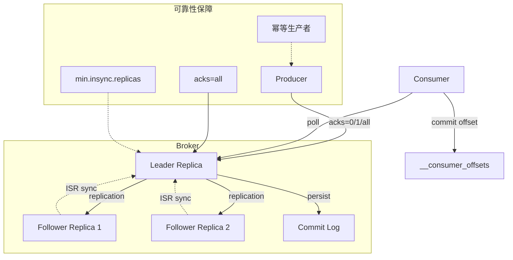
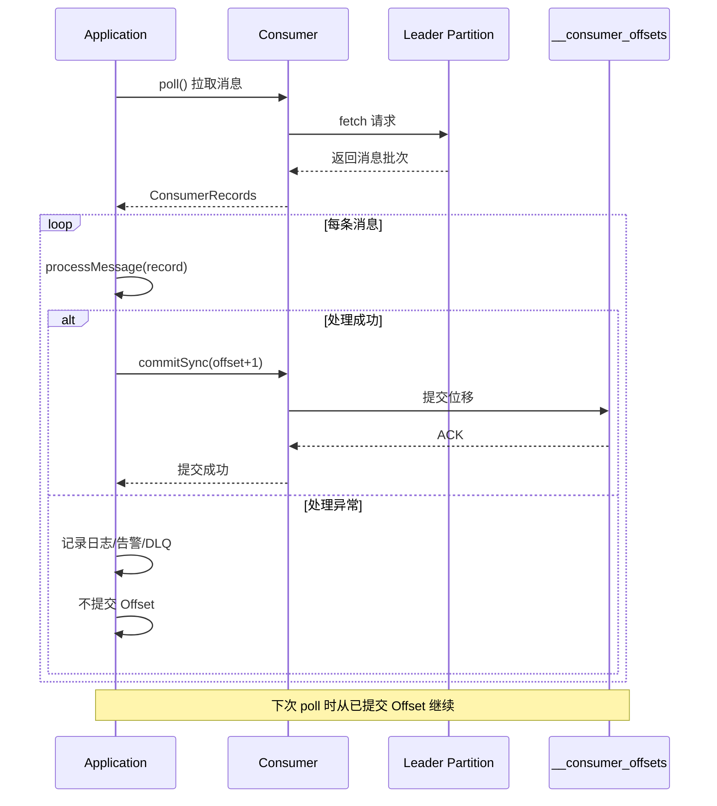

## 引言

你的 Kafka 消费者昨天丢了 10 万条订单消息，却没有任何报错日志。排查后发现：消费者先提交了 Offset，然后处理业务逻辑时发生了 NPE——消息就这样"消失"了。消息丢失、重复消费、消息乱序、消息积压，这四个问题是 Kafka 生产环境中最常见的"四大杀手"。很多人知道设置 `acks=all` 就能不丢消息，但你知道 `min.insync.replicas` 和 `acks=all` 如何配合工作吗？你知道消费者 Rebalance 期间为什么会产生重复消费吗？

本文将从生产者、Broker、消费者三端完整拆解这四大问题的根源和解决方案。你将掌握：`acks` 参数的三档配置如何选择、ISR 与 `min.insync.replicas` 的配合、消费者 Offset 手动提交的正确姿势、以及如何通过 Key 保证消息有序。这些知识点不仅是面试必考题，更是你排查线上 Kafka 问题的武器库。

### Kafka 消息流回顾（简要）

为了更好地理解消息问题，我们先简要回顾一下 Kafka 的核心消息流：

1.  **Producer（生产者）：** 创建消息，发送到指定 Topic 的某个 Partition。
2.  **Broker（代理）：** 接收生产者消息，将消息写入对应 Partition 的 Leader 副本。Leader 副本将消息复制给 Follower 副本。Broker 集群通过 Zookeeper/Kraft 协调。
3.  **Consumer Group & Consumer（消费者组与消费者）：** 消费者属于某个消费组，订阅 Topic。消费组内的消费者共同消费 Topic 的分区，每个分区只能被组内一个消费者实例消费。消费者主动从 Broker 拉取消息。
4.  **Offset（位移）：** 消费者通过 Offset 追踪自己在分区中的消费进度，并将已处理的 Offset 提交给 Kafka（记录在内部 Topic `__consumer_offsets`）。

### Kafka 消息流转架构



### 消费者 Offset 提交流程（手动提交）



### 常见 Kafka 消息问题及处理流程深度解析（重点）

### 消息丢失（Message Loss）

**问题描述：** 生产者发送的消息最终未能被任何订阅该 Topic 的消费者成功消费。

**Why it Happens（根源原因在 Kafka 中）:**

消息丢失可能发生在**生产者发送阶段**、**Broker 存储阶段**或**消费者消费阶段**。

1.  **生产者发送阶段（Producer to Broker Loss）:**
    * **原因：** 生产者发送消息是异步的。如果生产者将消息发送出去，但没有等待 Broker 的确认（Acknowledgement - `acks`）就认为发送成功，此时如果 Broker 在收到消息前宕机、网络抖动导致消息未到达 Broker，消息就会丢失。
    * **关联 Kafka 概念：** `acks` 配置（`acks=0` 或 `acks=1`）。
2.  **Broker 存储阶段（Broker Internal Loss）:**
    * **原因：** Leader 副本接收了消息，但没有同步到足够多的 Follower 副本，此时 Leader 副本所在的 Broker 宕机，而新的 Leader 从没有收到该消息的 Follower 中选出。或者 Broker 数据未刷新到磁盘（`fsync`）前宕机。
    * **关联 Kafka 概念：** `acks` 配置（`acks < all`/`-1`），`min.insync.replicas`（ISR 最小同步副本数），Broker 的数据刷新策略（`log.flush.messages`，`log.flush.interval.ms`）。
3.  **消费者消费阶段（Consumer to Sink Loss）:**
    * **原因：** 消费者从 Broker 拉取了消息，并且**在未处理完消息之前**就提交了 Offset。此时如果消费者处理消息过程中（将消息写入数据库、发送给下游等）发生异常或宕机，该消息虽然 Offset 已提交，但并未真正处理成功，导致消息丢失。
    * **关联 Kafka 概念：** Offset 自动提交（`enable.auto.commit=true`），Offset 手动提交的时机。

**Handling/Prevention Strategies（处理/预防方案）:**

1.  **生产者端：**
    * **提高 `acks` 级别：**
        * **`acks=0`：** 生产者发送即成功，不等待任何 Broker 确认。**吞吐量最高，但最容易丢消息。**
        * **`acks=1`：** 生产者等待 Leader 副本写入成功并收到确认。**吞吐量次之，Leader 宕机 Follower 未同步时可能丢消息。**
        * **`acks=all`（或 `acks=-1`）：** 生产者等待 Leader 副本和 ISR 中的所有 Follower 副本都写入成功并收到确认。**可靠性最高，能保证已提交的消息不丢失**（前提是 ISR 中至少有一个 Follower）。**吞吐量最低。**
    * **配置 `retries`：** 设置生产者自动重试发送的次数。结合 `acks=all` 和 `min.insync.replicas` 可以进一步降低消息丢失概率，但可能导致消息乱序（非幂等生产者）。
    * **配置幂等生产者（Idempotent Producer）：** Kafka 0.11+ 支持，通过 Producer ID 和序列号在 Broker 端去重，保证消息**不重复发送且不乱序**。通常默认启用。这是实现至少一次和精确一次的基础。
    * **配置事务生产者（Transactional Producer）：** Kafka 0.11+ 支持，允许生产者在**跨多个分区**或**跨多个会话**的写入操作中实现原子性。这是实现**精确一次（Exactly-once）** 语义的关键部分。

2.  **Broker 端：**
    * **设置 `min.insync.replicas`：** 配置一个 Topic 必须有多少个 ISR 副本才允许 Leader 接受 `acks=all` 的生产者消息。例如，`replication.factor=3`，`min.insync.replicas=2` 表示副本数为 3，至少 2 个 ISR 才接受 `acks=all` 消息。如果 ISR 数量少于 `min.insync.replicas`，即使生产者设置了 `acks=all`，Leader 也会拒绝写入。
    * **配置数据刷新策略：** 调整 `log.flush.messages` 和 `log.flush.interval.ms` 参数，控制 Broker 将内存数据刷新到磁盘的频率，减少 Broker 突然宕机导致的数据丢失。但过于频繁的刷新会影响性能。

3.  **消费者端：**
    * **禁用自动提交：** 设置 `enable.auto.commit=false`，使用**手动提交 Offset**。
    * **手动提交时机：** 在**消息处理完成之后**再提交 Offset。这是避免消费者端丢失的关键。

    ```java
    // 伪代码示例（手动提交）
    consumer.subscribe(Arrays.asList("my_topic"));
    while (running) {
        ConsumerRecords<String, String> records = consumer.poll(Duration.ofMillis(100));
        for (ConsumerRecord<String, String> record : records) {
            try {
                // 1. 处理消息（写入数据库、调用下游等）
                processMessage(record.value());
                // 2. 消息处理成功后，手动提交当前消息的 Offset
                consumer.commitSync(Collections.singletonMap(
                    record.partition(),
                    new OffsetAndMetadata(record.offset() + 1)
                ));
            } catch (Exception e) {
                // 处理失败，不提交 Offset，下次 Rebalance 或重启后会再次拉到
                // 可以记录日志、报警或将消息发送到死信队列
            }
        }
    }
    ```

> **💡 核心提示**：`acks=all` 只保证 Leader + ISR 全部写入成功。如果 `min.insync.replicas` 未设置，当 ISR 中只剩 Leader 自己时，`acks=all` 退化为 `acks=1`。生产环境必须将 `min.insync.replicas` 至少设为 2，配合 `replication.factor=3`，才能真正保证数据不丢失。

**关联 Kafka 概念：** `acks`, `retries`, 幂等生产者，事务生产者，`min.insync.replicas`, 副本因子（RF）, ISR, Log Flush Config, Offset 自动/手动提交，`enable.auto.commit`, `commitSync`, `commitAsync`.

### 重复消费（Duplicate Consumption）

**问题描述：** 同一条消息被同一个消费者实例或同一个消费组内的不同消费者实例处理了多次。

**Why it Happens（根源原因在 Kafka 中）:**

重复消费主要发生在**消费者端**，通常是由于**Offset 提交时机**或**消费者重平衡**导致。

1.  **Offset 提交时机问题：**
    * **原因：** 消费者**先提交 Offset**，**后处理消息**。此时如果消息处理过程中发生异常或消费者宕机，虽然消息未处理成功，但 Offset 已经提交了。当消费者重启或发生 Rebalance 时，它会从已提交的 Offset 之后开始消费。
    * **关联 Kafka 概念：** Offset 提交时机（自动提交 vs 手动提交）。
2.  **消费者重平衡（Rebalance）：**
    * **原因：** 在消费组发生 Rebalance 时，分区的所有权会在组内消费者之间重新分配。如果在 Rebalance 过程中，某个消费者已经拉取并处理了部分消息，但**未来得及提交 Offset** 就退出了，那么这个分区被重新分配给组内其他消费者时，新的消费者会从**上一次成功提交的 Offset** 之后开始消费，导致那部分已处理但未提交 Offset 的消息被重复消费。
    * **关联 Kafka 概念：** Consumer Group Rebalance, Offset 提交时机。
3.  **At-least-once（至少一次）交付语义：**
    * Kafka 默认提供的就是 At-least-once 语义。这意味着消息**不会丢失，但可能重复**。

**Handling/Prevention Strategies（处理/预防方案）:**

完全杜绝重复消费通常很困难，更现实的目标是允许重复消费，但在**消费者应用层面保证消息处理的幂等性**。

1.  **消费者应用层面保证处理幂等性：**
    * **方案：** 设计消费者端的业务逻辑，使其对同一条消息的多次处理都能产生**相同的结果**，而不会对业务状态造成副作用。
    * **原理：** 利用消息的唯一标识（如业务主键、或结合 Partition + Offset 作为唯一键）。在处理消息前，先检查该消息是否已经被处理过（例如，在数据库中记录已处理消息的 ID）。如果已处理，则直接跳过。
2.  **调整 Offset 提交策略：**
    * **方案：** 禁用自动提交（`enable.auto.commit=false`），并使用**手动提交 Offset**，在**消息处理成功之后**再提交。
    * **手动提交时机选择（权衡）：**
        * **处理一条提交一条（性能差，但重复少）：** 极端情况下，处理完一条消息就提交其 Offset。重复消息最少，但频繁提交 Offset 性能开销大。
        * **批量处理后批量提交（推荐）：** 拉取一批消息，处理完这批消息后，手动提交这批消息中最大的 Offset。这是生产中最常用的方式。
        * **异步提交：** `commitAsync()`，性能好，但提交失败可能导致小范围重复。
        * **同步提交：** `commitSync()`，可靠性高，但可能阻塞消费者。
3.  **生产者端配置（解决生产者重复发送导致的重复）：**
    * **方案：** 配置幂等生产者（`enable.idempotence=true`）。
    * **原理：** 保证生产者在网络重试等情况下，不会向 Broker 重复发送消息。
4.  **使用事务（解决 Producer to Broker + Consumer to Sink 阶段的重复/丢失 - Exactly-once）：**
    * **方案：** 配置事务生产者和事务消费者。
    * **原理：** 将生产者写入 Kafka 和消费者将处理结果写入下游外部系统（Sink）作为一个原子操作。

> **💡 核心提示**：Kafka 默认的 At-least-once 语义意味着"不丢但可能重复"。解决重复消费的终极方案不是配置 Kafka，而是保证消费者业务逻辑的幂等性。例如使用数据库唯一键、Redis 去重表等方案，让"重复消费"变为"幂等执行"。

**关联 Kafka 概念：** Offset 提交（`enable.auto.commit`, Manual commit, `commitSync`, `commitAsync`）, Consumer Group Rebalance, At-least-once 语义，幂等生产者，事务生产者，Exactly-once 语义。

### 消息乱序（Message Ordering Issues）

**问题描述：** 消息的处理顺序与预期的发送顺序不一致。

**Why it Happens（根源原因在 Kafka 中）:**

Kafka **只保证**在**同一个分区内**的消息是有序的。乱序主要发生在**跨分区**或**生产者重试**时。

1.  **跨分区发送：**
    * **原因：** 消息从**同一个生产者**发送到**同一个 Topic**，但被发送到**不同的分区**。由于不同分区是独立的日志，它们之间没有全局顺序保证。
    * **关联 Kafka 概念：** Partitioning（分区）, Global Order vs Partition Order。
2.  **生产者重试：**
    * **原因：** 生产者发送消息失败并重试。如果生产者配置了 `max.in.flight.requests.per.connection > 1`（允许并行发送多个未确认请求）且 `retries > 0`，当发送第一条消息失败并重试时，第二条消息可能先于重试成功的第一条消息到达 Broker。
    * **关联 Kafka 概念：** Producer Retries, `max.in.flight.requests.per.connection`。（注意：在现代 Kafka 版本中，Idempotent Producer 默认将 `max.in.flight.requests.per.connection` 限制为 1 或 5 且配合 Broker 端去重，可以解决这种乱序问题）。

**Handling/Prevention Strategies（处理/预防方案）:**

1.  **保证相关消息进入同一个分区：**
    * **方案：** 对于需要保证顺序的消息（例如，属于同一个订单的所有操作消息），使用消息的**Key**来指定分区。生产者发送消息时，如果指定了 Key，Kafka 会使用默认的或配置的**分区器（Partitioner）**（通常是 Key 的 Hash 值）来决定将消息发送到哪个分区。相同 Key 的消息将被发送到同一个分区。
    * **关联 Kafka 概念：** Message Key, Partitioner（`partitioner.class`）, Partitioning Strategy。
2.  **确保单个消费者处理一个分区：**
    * **方案：** 这是消费者组的默认行为：一个分区只能被组内一个消费者实例消费。只要保证相关消息进入同一个分区，然后由一个消费者负责消费这个分区，就能保证处理顺序。
3.  **配置生产者重试：**
    * **方案：** 如果使用老版本 Kafka 且不希望使用幂等生产者，需要设置 `max.in.flight.requests.per.connection = 1`。
    * **推荐方案：** 使用现代 Kafka 的**幂等生产者**。它默认能解决重试导致的乱序问题。

### 消息积压（Message Backlog）

**问题描述：** 生产者发送消息的速度持续大于消费者处理消息的速度，导致 Topic 的分区中堆积了大量未消费的消息，消费者与 Leader 的 Offset 差距越来越大。

**Why it Happens（根源原因在 Kafka 中）:**

消息积压的根本原因在于**消费者处理能力不足**。

1.  **消费者处理逻辑慢：** 消费者处理每条消息的业务逻辑耗时太长（例如，处理中涉及耗时的数据库操作、网络调用、复杂计算）。
2.  **消费者实例数量不足：** 消费组内的消费者实例数量太少，无法处理所有分区的消息，或者消费者数量少于分区数量。
3.  **下游系统瓶颈：** 消费者处理消息后需要写入下游系统（数据库、缓存、其他服务），下游系统成为瓶颈。
4.  **分区数量不足：** Topic 的分区数量太少，限制了消费组可以并行消费的最大消费者实例数量。

**Handling/Prevention Strategies（处理/预防方案）:**

处理积压的根本方法是**提高消费者的总处理能力**。

1.  **增加消费者实例数量：**
    * **方案：** 在同一个消费组内增加消费者实例数量。Kafka 会自动触发重平衡，将积压严重的分区重新分配给新的消费者实例。
    * **注意：** 消费者实例数量不能超过分区的数量，超过的部分将处于空闲状态。
2.  **优化消费者处理逻辑：**
    * **方案：** 分析消费者处理消息的业务逻辑，找到并优化耗时瓶颈。例如，批量读取下游数据库、优化计算逻辑、使用异步非阻塞调用下游服务等。
3.  **增加分区数量：**
    * **方案：** 增加 Topic 的分区数量。分区数量决定了消费组内并行消费的最大消费者实例数量。
    * **注意：** 分区数量一旦创建，不易减少。分区数量过多也会带来管理和资源开销。
4.  **调整消费者拉取参数：**
    * **方案：** 适当调整 `max.poll.records`（一次拉取消息的最大数量）等参数，平衡拉取消息的效率和内存消耗。
5.  **监控消费延迟：**
    * **方案：** 持续监控消费组的消费延迟（Consumer Lag），及时发现并处理积压问题。

### 综合解决方案：Exactly-once 语义简介

前面提到的消息丢失和重复消费问题，是 At-least-once（至少一次）交付语义下的常见挑战。Kafka 0.11+ 引入了新的特性，可以支持 **Exactly-once（精确一次）** 交付语义。

* **定义：** 消息既不丢失，也不重复，且按顺序处理。
* **实现：** 需要结合 **幂等生产者**、**事务生产者** 和 **消费者端的事务支持**（将消费消息和处理结果写入下游 Sink 作为原子操作）。

实现 Exactly-once 语义需要更复杂的配置和代码逻辑，且通常仅限于特定的场景。对于大多数场景，结合 At-least-once 语义和消费者端处理逻辑的幂等性，已经足够满足需求，且实现复杂度更低。

### 核心参数对比表

| 参数 | 推荐值 | 影响 | 说明 |
| :--- | :--- | :--- | :--- |
| **`acks`** | `all` | 可靠性 vs 吞吐量 | `acks=all` 保证 ISR 全部写入才返回 |
| **`min.insync.replicas`** | `2` | 写入可用性 | 配合 `acks=all`，ISR 少于该值时拒绝写入 |
| **`replication.factor`** | `3` | 容错能力 | 最多容忍 2 个副本丢失 |
| **`enable.auto.commit`** | `false` | 消息可靠性 | 生产环境务必手动提交 Offset |
| **`enable.idempotence`** | `true`（默认） | 去重和保序 | 解决重试导致的重复和乱序 |
| **`max.in.flight.requests.per.connection`** | `5`（幂等时） | 吞吐量 | 幂等生产者允许最大 5 个并发请求 |
| **`retries`** | `Integer.MAX_VALUE` | 可靠性 | 生产环境建议无限重试 |
| **`unclean.leader.election.enable`** | `false`（默认） | 数据一致性 | 开启可能导致数据丢失 |

### 消息问题根因与解决方案速查表

| 问题类型 | 生产者端解决 | Broker 端解决 | 消费者端解决 | 推荐指数 |
| :--- | :--- | :--- | :--- | :--- |
| **消息丢失** | `acks=all`, `retries`, 幂等 | `min.insync.replicas=2` | 手动提交 Offset | ⭐⭐⭐⭐⭐ |
| **重复消费** | `enable.idempotence=true` | - | 业务幂等性 + 手动提交 | ⭐⭐⭐⭐⭐ |
| **消息乱序** | 使用 Key 指定分区 | - | 单消费者处理单分区 | ⭐⭐⭐⭐⭐ |
| **消息积压** | - | 增加分区数 | 增加消费者/优化逻辑 | ⭐⭐⭐⭐ |

### 生产环境避坑指南

1. **自动提交 Offset 是消息丢失的头号元凶：** `enable.auto.commit=true`（默认值）会在 `poll()` 调用时自动提交 Offset。如果消费者在处理消息时宕机，Offset 已经提交，消息将被跳过。生产环境务必设置 `enable.auto.commit=false`。
2. **`acks=1` 在生产环境不够安全：** 很多开发者以为 `acks=1`（Leader 写入成功）就够安全了。但如果 Leader 宕机且 Follower 未同步，数据就会丢失。关键业务请使用 `acks=all` + `min.insync.replicas=2`。
3. **Rebalance 风暴：** 如果 `max.poll.interval.ms` 设置过小，消费者处理慢会被踢出消费组，触发 Rebalance，进而导致更多消费者超时——形成恶性循环。建议根据业务处理时间调整该参数（默认 300000ms）。
4. **幂等生产者的限制：** 幂等性只在单个 Producer Session 内有效。如果 Producer 重启（PID 变化），幂等性失效。跨 Session 的去重仍需业务层幂等保证。
5. **增加分区数不可逆：** 分区数只能增加不能减少。规划时应预估未来 1-2 年的消费能力，合理设置初始分区数。

### 行动清单

1. **检查点**：确认生产环境的 `acks=all`、`min.insync.replicas=2`、`replication.factor=3` 三项配置全部生效。
2. **检查点**：确认消费者 `enable.auto.commit=false`，并在业务处理完成后手动提交 Offset。
3. **优化建议**：为所有消费者业务逻辑增加幂等性保证（如使用唯一业务主键 + 去重表）。
4. **优化建议**：监控 Consumer Lag 指标，设置积压告警阈值。
5. **扩展阅读**：推荐阅读《Kafka: The Definitive Guide》第 7 章"Reliable Data Delivery"。
6. **实操建议**：使用 `kafka-consumer-groups.sh --describe` 命令定期检查消费组 Lag。

### 面试问题示例与深度解析

* **如何保证 Kafka 消息不丢失？请从生产者、Broker、消费者三端说明。**（**核心！** 必考题，涵盖 `acks`，`min.insync.replicas`, Log Flush, Consumer 手动提交时机）
* **如何保证 Kafka 消息不重复消费？**（**核心！** 必考题，涵盖消费者端处理幂等性，手动提交 Offset，幂等生产者，事务）
* **如何保证 Kafka 消息有序？**（**核心！** 必考题，涵盖分区内有序性，通过 Key 将相关消息发往同一分区，由单个消费者消费）
* **`acks` 参数有什么作用？设置为 0、1、all 分别有什么区别？如何选择？**（确认机制，区别在于可靠性 vs 吞吐量，选择取决于对可靠性的要求）
* **`min.insync.replicas`（ISR）有什么作用？它和 `acks` 怎么配合保证不丢消息？**（ISR 定义，配合 `acks=all` 保证已提交消息不丢失）
* **什么是 Kafka 的消息交付语义？有哪几种？Exactly-once 如何实现？**（定义，At-least-once, At-most-once, Exactly-once。Exactly-once 通过幂等生产者 + 事务实现）
* **为什么 Kafka 只保证分区内有序，不能保证全局有序？如何解决全局有序问题？**（Partition 独立写，无全局协调。解决：只用一个分区（牺牲并行度））
* **如何处理 Kafka 消息积压问题？**（增加消费者/分区，优化消费逻辑，使用流处理框架）
* **什么是消费者重平衡（Rebalance）？它可能导致什么问题？如何尽量避免或处理？**（定义，可能导致重复消费。避免：合理设置 Session Timeout，平滑扩缩容。处理：消费者端处理幂等性，调整 Offset 提交时机）
* **在消费者端，Offset 自动提交和手动提交有什么区别？如何选择？**（自动：简单，可能丢失或重复。手动：可靠，代码复杂。根据可靠性要求选择，生产中通常手动提交）
* **幂等生产者有什么作用？它解决了什么问题？**（解决生产者重试导致的消息重复和乱序）

### 总结

理解 Kafka 消息处理中常见的消息丢失、重复消费、消息乱序、消息积压等问题，以及它们在 Kafka 特定架构下的产生原因，是构建可靠、高性能数据流应用的基础。通过合理配置生产者（`acks`，幂等性，事务）、调整 Broker 参数（`min.insync.replicas`，Log Flush）、优化消费者端处理逻辑（幂等性、手动提交 Offset）和扩展消费能力（增加消费者/分区），我们可以有效地预防或处理这些问题。
