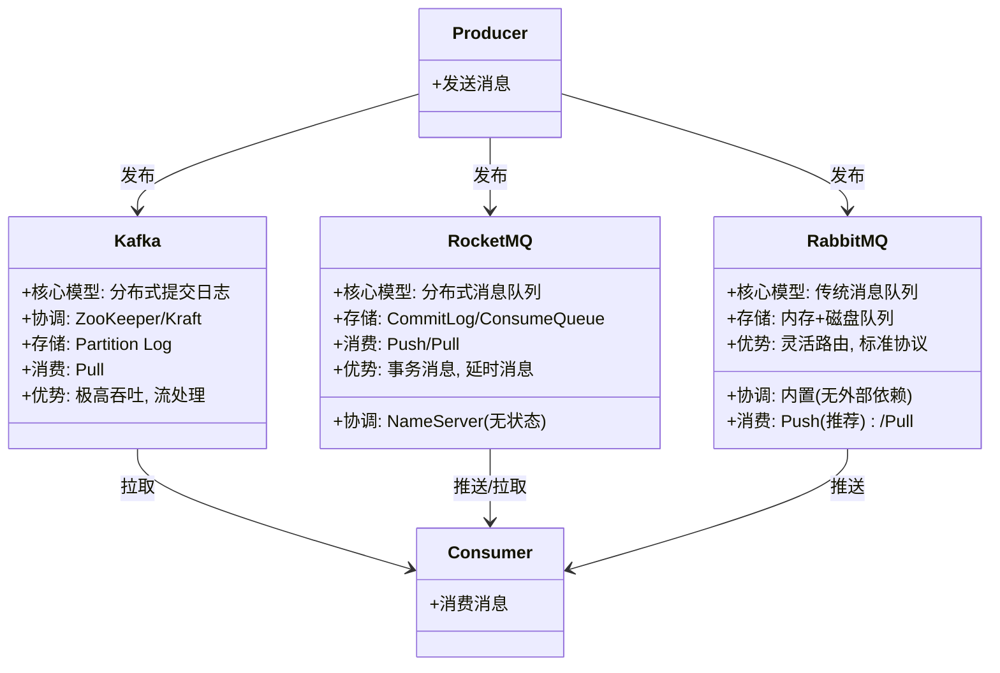
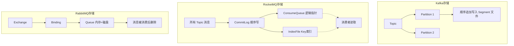
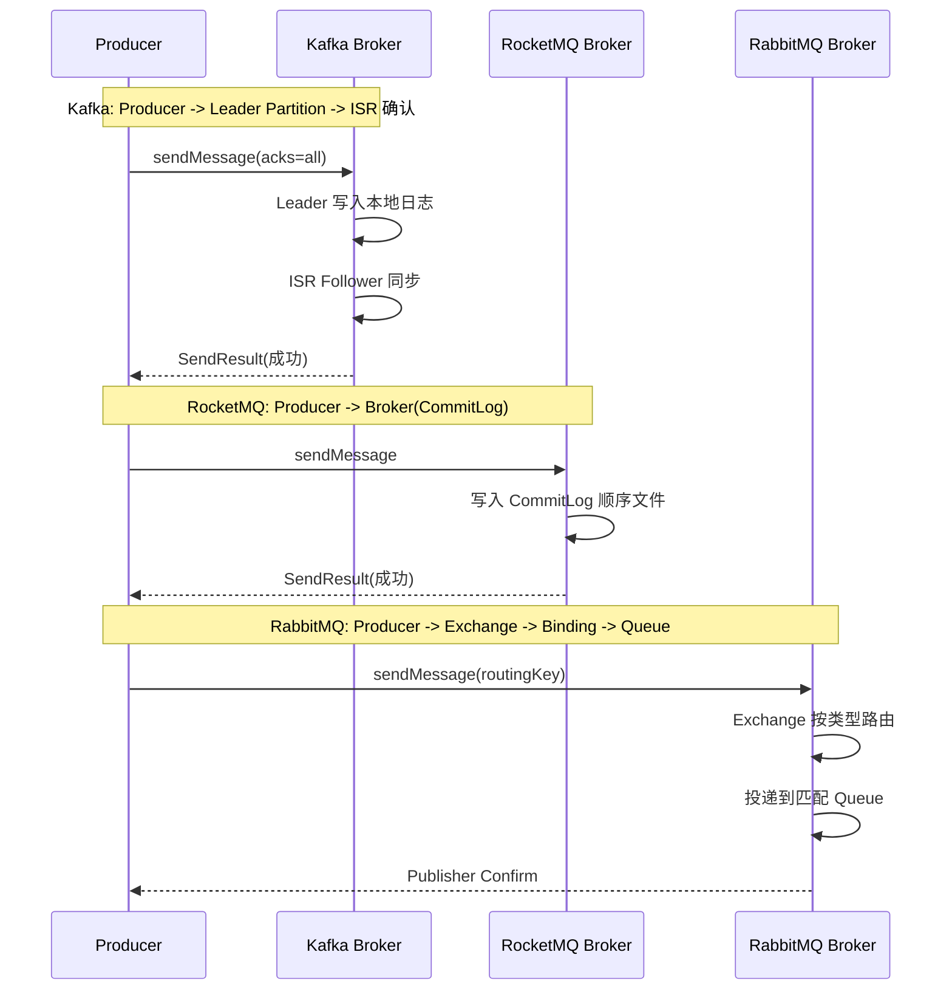

## 引言

你的团队正在技术选型：日志采集平台需要一个高吞吐的消息中间件，订单系统需要一个支持事务消息和延时投递的方案，而内部微服务之间需要灵活的路由能力。你该选 Kafka、RocketMQ 还是 RabbitMQ？选错消息中间件的代价是巨大的——Kafka 不适合做灵活路由，RabbitMQ 扛不住百万 QPS 的日志流，RocketMQ 的运维复杂度在中小团队可能成为负担。本文通过架构、存储、消费模型、核心功能等多个维度，对三大消息中间件进行全方位对比。读完本文，你将掌握：三者的核心设计理念差异、存储架构的优劣、事务消息/延时消息等关键功能的实现方式、以及如何根据业务场景做出正确的技术选型。

### Kafka 是什么？定位与核心理念

Apache Kafka 是一个**分布式流处理平台（Distributed Streaming Platform）**。

* **定位：** 它不仅仅是一个传统的消息队列，更是一个能够处理实时数据流的平台。它提供消息队列的功能，也提供了持久化存储数据流的能力，并且支持流处理应用。
* **核心理念：** 将数据看作是一个不断增长、不可变、有序的**分布式日志（Distributed Log）**。生产者向日志末尾追加数据，消费者从日志中读取数据，并各自独立维护读取位置。

### 为什么选择 Kafka？优势分析

* **极高的吞吐量：** 设计目标就是为了处理每秒百万级的读写请求。
* **持久性：** 数据写入磁盘并进行多副本复制，保证数据不丢失。
* **水平可伸缩性：** 易于通过增加 Broker 节点来扩展系统的存储和处理能力。
* **多消费者支持：** 同一份数据流可以被多个独立的消费者组以各自的速度和进度消费。
* **分区内顺序保证：** 在一个分区内，消息是严格按照发送顺序存储和读取的。
* **丰富的生态系统：** 提供了 Kafka Connect 用于与外部系统集成，Kafka Streams 用于构建流处理应用。

### RocketMQ 是什么？定位与核心理念

Apache RocketMQ 是一个**分布式消息和流处理平台**。

* **定位：** 它是一个为分布式应用提供异步通信、削峰填谷、解耦等功能的**消息中间件**，并支持构建流处理应用。
* **核心理念：** 提供一个**高吞吐、低延迟、高可靠**的消息系统，特别注重在**大规模分布式环境**下的稳定性、事务支持和易用性。

### 为什么选择 RocketMQ？优势分析

* **高吞吐量和低延迟：** 针对高并发场景优化，具有出色的性能表现。
* **可靠性和持久性：** 采用多副本同步/异步复制和多种刷盘机制，保证消息不丢失。
* **独特的存储架构：** 基于文件系统的顺序写和内存映射文件（MMAP），提高了读写性能。
* **分布式事务消息：** 原生支持分布式事务消息，简化分布式事务最终一致性实现。
* **顺序消息：** 支持分区（局部）顺序消息和严格局部顺序消息。
* **定时/延时消息：** 支持发送消息后延迟投递。
* **丰富的功能特性：** 消息过滤、死信队列、消息轨迹、消费者长轮询等。

### RabbitMQ 是什么？定位与核心理念

RabbitMQ 是一个**消息代理（Message Broker）**，实现了 **AMQP（Advanced Message Queuing Protocol）** 标准的开源消息中间件。

* **定位：** 提供一个**可靠的、灵活的**消息路由和传递平台，通过构建生产者、交换器、队列和消费者之间的关系来实现复杂的路由逻辑。
* **核心理念：** 可靠投递 + 灵活路由。

### 为什么选择 RabbitMQ？优势分析

* **可靠性：** 支持消息的持久化、发布者确认（Publisher Confirms）、消费者确认（Consumer Acknowledgements）和高可用集群。
* **灵活的路由能力：** 强大的 Exchange 类型和 Binding 机制，可以实现点对点、发布/订阅、路由、话题等多种消息分发模式。
* **标准协议支持：** 实现 AMQP 标准，也支持 MQTT、STOMP 等协议，方便不同语言和平台的应用进行集成。
* **丰富的功能特性：** 死信队列、消息 TTL、延时消息、优先级队列、管理界面等。
* **易管理：** 提供了友好的管理界面和丰富的监控指标。

### 三大 MQ 架构对比

### 核心存储架构对比

### Kafka vs RocketMQ vs RabbitMQ 全方位对比

| 特性             | Apache Kafka                       | Apache RocketMQ                     | RabbitMQ                           |
| :--------------- | :--------------------------------- | :---------------------------------- | :--------------------------------- |
| **核心模型** | **分布式提交日志/流平台** | **分布式消息队列/流平台** | **传统消息队列（Smart Broker）** |
| **架构** | ZooKeeper/Kraft + Broker（Leader/Follower） | NameServer（无状态） + Broker（Master/Slave） | Broker 集群（节点对等或镜像） |
| **存储** | **分布式日志**（Partition Logs），文件系统顺序写 | **金字塔存储**（CommitLog/ConsumeQueue/IndexFile），基于文件系统 | **基于内存和磁盘**（消息队列） |
| **协议** | **自定义协议**（高性能） | **自定义协议**，支持 OpenMessaging, MQTT | **AMQP（核心）**，MQTT, STOMP |
| **消费模型** | **Pull（拉模式）** | **Push 和 Pull 都支持** | **Push（推模式，推荐）** 和 Pull |
| **消息顺序** | **分区内有序**，无全局顺序 | **局部顺序**（Queue 内），支持严格局部 | 通常队列内有序，发布订阅依赖配置 |
| **事务消息** | 支持事务，需额外集成分布式 | **原生支持两阶段提交分布式事务消息** | 支持 AMQP 事务（非分布式） |
| **定时/延时消息** | 不直接支持（需外部调度） | **内置支持** | 通过插件/TTL+DLX 实现 |
| **消息过滤** | 消费者端过滤 | **Broker 端支持**（Tag/SQL92） | Broker 端（Routing Key, Header） |
| **消息轨迹** | 支持（通过 Sleuth 等集成） | **内置支持** | 支持（通过插件或管理界面） |
| **管理界面** | 功能较基础（通常需第三方工具） | 功能较全 | 功能强大，用户友好 |
| **一致性** | 分区内强一致，分区间最终一致（ISR） | **强一致性**（同步复制/刷盘可选） | 依赖配置（持久化, 副本） |
| **CAP 倾向** | 通常配置为 **AP**（可用性优先） | 通常配置为 **CP**（强一致优先） | 依赖配置 |
| **适合场景** | **高吞吐、流处理、日志收集、大数据管道** | **国内高并发、高可靠、金融/电商级场景** | **传统消息队列、灵活路由、跨语言** |
| **开发语言** | Java/Scala | Java | Erlang |
| **社区活跃度** | 极高（Apache 顶级项目） | 高（Apache 顶级项目，国内活跃） | 高（VMware 维护） |

> **💡 核心提示**：选型的核心原则是"没有最好的，只有最合适的"。Kafka 的优势在于**极致吞吐和流处理生态**，RocketMQ 在**事务消息和国内场景适配**上更胜一筹，RabbitMQ 则是**灵活路由和标准协议**的不二之选。不要为了"技术先进"而选 Kafka，也不要因为"国内流行"而盲目选 RocketMQ。

### 消息投递流程对比

### 核心参数/方法对比表

| 功能 | Kafka 配置 | RocketMQ 配置 | RabbitMQ 配置 | 说明 |
| :--- | :--- | :--- | :--- | :--- |
| **消息确认级别** | `acks=all` | `msgId` + Broker ACK | `Publisher Confirms` | 三者的确认机制 |
| **消费进度管理** | `__consumer_offsets` | Broker 管理 Offset | Consumer ACK 后删除 | Offset 存储方式 |
| **消费模式** | `poll()` 拉取 | `push`/`pull` | Basic.Consume（Push） | 推送 vs 拉取 |
| **顺序保证** | 同 Partition 有序 | 同 Queue 有序 | 同 Queue 有序 | 分区/队列内有序 |
| **消息去重** | `enable.idempotence=true` | 业务层去重 | 业务层去重 | Kafka 原生支持 |
| **死信处理** | 外部实现 | DLQ 内置 | DLX 内置 | 死信机制 |

### 生产环境避坑指南

1. **不要用 Kafka 做复杂路由：** Kafka 没有 Exchange/Routing Key 的概念。如果你需要根据消息内容做灵活路由，请使用 RabbitMQ 或在消费者端做过滤。
2. **RocketMQ 的 NameServer 不是强一致的：** NameServer 节点之间互不通信，每个 Broker 向所有 NameServer 注册。这意味着在 NameServer 切换期间，生产者/消费者可能短暂获取到旧路由信息。这是设计上的取舍（AP 优先）。
3. **RabbitMQ 队列镜像的性能开销：** HA 队列镜像会将数据复制到所有镜像节点，消息量大的场景会导致网络带宽和磁盘占用剧增。对于高吞吐场景，建议使用 Quorum Queues 或考虑迁移到 Kafka/RocketMQ。
4. **Kafka 单分区不能保证高可用 + 有序：** 如果你将 Topic 设为 1 个分区来保证全局有序，那么该分区只有一个 Leader，无法水平扩展，且 Leader 宕机时该分区完全不可用。
5. **RocketMQ 延时消息精度有限：** RocketMQ 的延时消息默认只支持 18 个预定义级别（如 1s、5s、10s、30s、1m、2m...），不支持任意精度的延时。需要任意精度延时请使用其他方案。
6. **跨语言场景优先选 RabbitMQ 或 Kafka：** RabbitMQ 的 AMQP 标准协议使其在多语言支持上最成熟。Kafka 也有丰富的客户端库。RocketMQ 的客户端生态相对集中在 Java。

### 行动清单

1. **检查点**：根据业务场景（高吞吐/事务/路由）选择合适的 MQ，不要一刀切。
2. **检查点**：确认所选 MQ 的副本因子、刷盘策略、确认机制配置与业务的可靠性要求匹配。
3. **优化建议**：在生产环境中部署监控（如 Kafka 的 Consumer Lag、RocketMQ 的消息轨迹、RabbitMQ 的队列深度）。
4. **扩展阅读**：推荐阅读各 MQ 的官方架构文档，以及《Designing Data-Intensive Applications》第 11 章。
5. **实操建议**：在测试环境中搭建三种 MQ 的集群，用基准测试工具（如 openmessaging-benchmark）对比各自在目标场景下的性能表现。

### 面试问题示例与深度解析

* **请对比 Kafka、RocketMQ 和 RabbitMQ 三者的核心设计理念和适用场景。**（**核心！** 综合对比题，从核心模型、架构、存储、消费模型、功能特性等多维度分析）
* **Kafka 为什么能实现高吞吐？**（**核心！** 顺序写磁盘、零拷贝、分区并行、批量发送、数据压缩）
* **RocketMQ 的金字塔存储结构是什么？为什么要这样设计？**（**核心！** CommitLog 顺序写保证写入性能，ConsumeQueue 逻辑指针提高消费性能，IndexFile 提供 Key 索引）
* **RabbitMQ 的 Exchange 类型有哪些？分别适用于什么场景？**（Direct、Fanout、Topic、Headers，解释每种的路由规则和适用场景）
* **Kafka 的 Pull 模式和 RabbitMQ 的 Push 模式各有什么优缺点？**（Pull：消费者控制速率，但可能有延迟；Push：延迟低，但消费者可能被压垮）
* **RocketMQ 的 NameServer 和 Kafka 的 ZooKeeper 有什么区别？**（NameServer 无状态、互不通信、简单；ZooKeeper 强一致、负责选举和元数据管理、较重）

### 总结

Kafka、RocketMQ 和 RabbitMQ 代表了三种不同的消息中间件设计哲学：Kafka 以**分布式提交日志**为核心追求极致吞吐，RocketMQ 以**金字塔存储 + 丰富功能**在高可靠场景中独树一帜，RabbitMQ 以**AMQP 标准 + 灵活路由**在传统消息队列领域占据重要地位。理解它们在设计理念、存储架构、消费模型和功能特性上的差异，是做出正确技术选型的关键。
