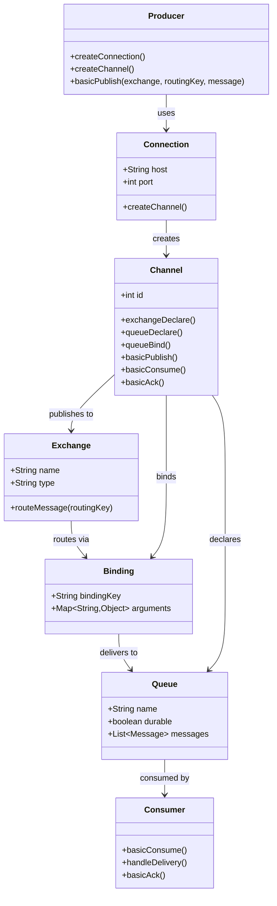
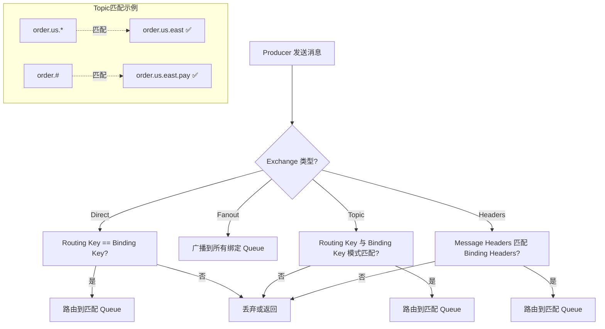
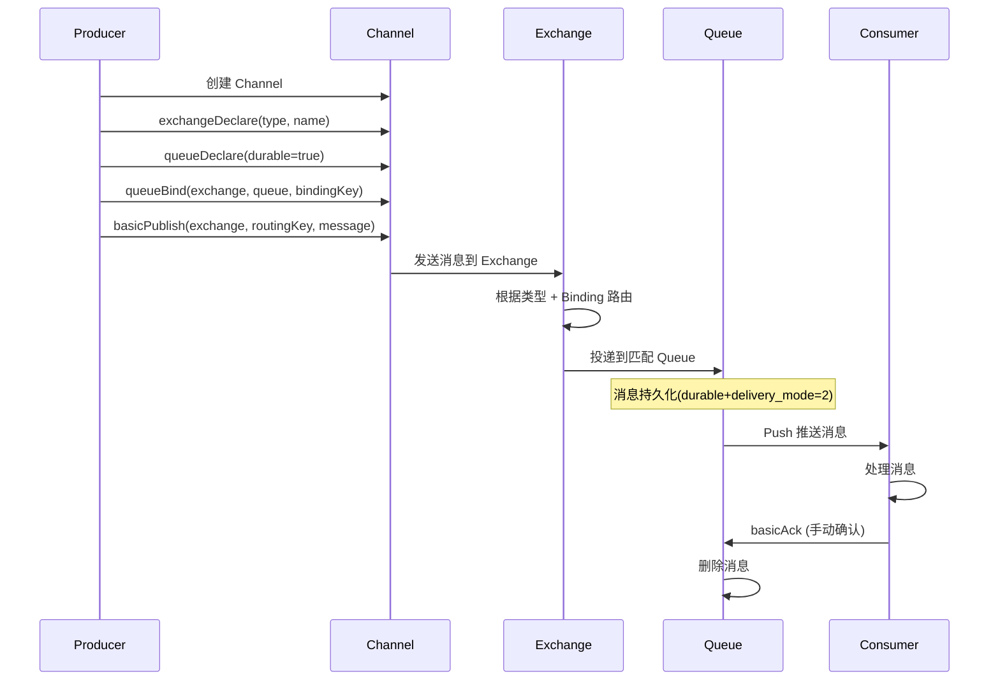

## 引言

你的 RabbitMQ 集群突然出现了消息路由异常：生产者明确指定了 Routing Key，消息却"消失"了。排查后发现——Exchange 没有绑定任何 Queue，而 `mandatory` 参数是 `false`，消息被静默丢弃了。RabbitMQ 看似简单，但 Exchange 类型选错、Binding 规则配错、Consumer Ack 时机不当，都会导致线上消息丢失或重复。本文将从架构设计到消息投递的完整链路，深度剖析 RabbitMQ 的核心机制：四种 Exchange 的路由规则、Channel 与 Connection 的复用原理、Publisher Confirms 和 Consumer Ack 的可靠性保障。读完本文，你将掌握 RabbitMQ 灵活路由的设计精髓，从容应对与 Kafka、RocketMQ 的对比面试题。

### RabbitMQ 架构设计与核心组件

RabbitMQ 的架构围绕着生产者、消费者、Broker 以及 Broker 内部的 Exchange、Queue、Binding 等核心组件构建。

1.  **角色：**
    * **Producer：** 消息生产者，发送消息到 Broker。
    * **Consumer：** 消息消费者，从 Broker 接收消息并消费。
    * **Broker：** **消息服务器**，运行 RabbitMQ 服务。接收消息，路由消息，存储消息，投递消息。

2.  **核心组件（Broker 内部）：**
    * **Exchange（交换器）：** **消息路由的关键！** 生产者发送消息到 Exchange，而不是直接发送到队列。Exchange 根据自身的类型和 Binding 规则，将消息路由到一个或多个队列。
    * **Queue（队列）：** **消息的存储单元！** 消息被路由到 Queue 中，等待消费者拉取或 Broker 推送。
    * **Binding（绑定）：** **连接 Exchange 和 Queue 的规则！** 定义了 Exchange 如何根据 Routing Key 将消息发送到 Queue。
    * **Message（消息）：** 生产者发送到 Broker 的基本单元。包含消息体（payload）和消息属性（properties），重要的属性如 `delivery_mode`（持久化）、`priority`（优先级）、`expiration`（TTL）。
    * **Routing Key（路由键）：** 生产者发送消息时指定的一个字符串属性。Exchange 根据其类型和 Binding 规则，用 Routing Key 来匹配 Binding。
    * **Binding Key（绑定键）：** Binding 定义时指定的一个字符串属性。用于与消息的 Routing Key 进行匹配。
    * **Connection（连接）：** 客户端（生产者或消费者）与 Broker 之间的网络连接。
    * **Channel（信道）：** 在 Connection 内部创建的**逻辑连接**。大多数操作（如声明队列、发送消息、消费消息）都在 Channel 上进行。多个 Channel 复用同一个 Connection，减少 TCP 连接的开销。

### RabbitMQ 核心组件架构

### Exchange 类型详解

Exchange 的类型决定了它如何根据 Routing Key 和 Binding Key 路由消息。

* **Direct Exchange（直连交换器）：** 将消息路由到 Binding Key 与 Routing Key **完全匹配**的队列。
    * **路由规则：** Routing Key == Binding Key。
    * **场景：** 点对点通信，或者需要精确路由到某个队列的场景。
* **Fanout Exchange（扇形交换器）：** 将消息路由到**所有**与该 Exchange 绑定的队列，**忽略 Routing Key**。
    * **路由规则：** 忽略 Routing Key，广播给所有绑定的队列。
    * **场景：** 发布/订阅模式，一条消息需要发送给所有订阅者。
* **Topic Exchange（主题交换器）：** 将消息路由到 Routing Key 与 Binding Key **模式匹配**的队列。Binding Key 中可以使用通配符（`*` 匹配一个单词，`#` 匹配零个或多个单词）。Routing Key 是由 "." 分隔的字符串。
    * **路由规则：** Routing Key 与 Binding Key 进行模式匹配。
    * **场景：** 复杂的发布/订阅模式，根据消息的主题层级进行灵活分发。
* **Headers Exchange（头部交换器）：** 将消息路由到 Binding 中 Header 与消息 Header 匹配的队列，**忽略 Routing Key**。匹配规则可以指定所有 Header 都匹配（`all`）或任意一个 Header 匹配（`any`）。
    * **路由规则：** 根据消息 Header 和 Binding Header 进行匹配。
    * **场景：** 基于消息属性（而非 Routing Key）进行路由，如根据消息的语言、设备类型等。

### 四种 Exchange 路由规则对比

### RabbitMQ 消息投递流程

一个消息在 RabbitMQ 中的完整生命周期：

1.  **生产者发送消息：** 生产者连接到 Broker，创建一个 Channel，构建消息（设置消息体、属性、Routing Key）。通过 Channel 将消息发送到指定的 **Exchange**。
2.  **Exchange 接收消息：** Exchange 接收到生产者发送的消息。
3.  **Exchange 路由消息：** Exchange 根据自身的**类型**、消息的**Routing Key**以及与 Queue 之间的**Binding**规则，将消息复制（如果是多个匹配队列）并发送到匹配的 Queue。
    * **重要：** 如果 Exchange 没有找到任何匹配的队列，且 Exchange 配置为非强制性发送（`mandatory=false`），消息会被丢弃。如果 `mandatory=true`，消息会返回给生产者（`Return` 监听器）。
4.  **消息存储在 Queue：** 被路由到 Queue 的消息存储在队列中，等待消费者消费。如果队列和消息都配置为持久化，消息会被写入磁盘。
5.  **Broker 推送/消费者拉取消息：**
    * **Push 模式：** Broker 将 Queue 中的消息主动推送给订阅的消费者。
    * **Pull 模式：** 消费者主动向 Broker 发送请求拉取消息。
6.  **消费者接收消息：** 消费者接收到 Broker 投递的消息。
7.  **消费者处理消息：** 消费者执行业务逻辑处理消息。
8.  **消费者发送确认（Acknowledgement - Ack）：** 消费者处理完消息后，向 Broker 发送 Ack。Broker 收到 Ack 后，将消息从 Queue 中移除。

> **💡 核心提示**：Channel 是 RabbitMQ 的精髓设计。TCP 连接的创建和销毁代价昂贵，而 Channel 作为轻量级逻辑连接复用同一个 TCP 连接。大多数 RabbitMQ 操作都在 Channel 上进行。一个 Connection 可以创建多个 Channel，但要注意：Channel 不是线程安全的，多线程环境下应为每个线程分配独立的 Channel。

### RabbitMQ 消息可靠性保证

RabbitMQ 提供了多种机制确保消息的可靠投递：

* **消息持久化和队列持久化：** 保证 Broker 重启后消息不丢失。
    * 消息持久化：发送消息时设置 `delivery_mode = 2`。
    * 队列持久化：声明队列时设置 `durable = true`。
* **发布者确认（Publisher Confirms）：** 生产者发送消息后，Broker 会向生产者发送确认（同步等待或异步回调），告知消息是否已成功到达 Exchange 并被路由到至少一个队列。
* **消费者确认（Consumer Acknowledgements）：** 消费者处理完消息后向 Broker 发送 Ack，告知消息已安全处理。Broker 收到 Ack 后才从队列中删除消息。
    * **自动 Ack vs 手动 Ack：** 自动 Ack（可能导致消息丢失或重复），手动 Ack（推荐，处理成功后再 Ack，可以实现 At-least-once）。
* **AMQP 事务（不常用）：** AMQP 协议支持事务，但会显著降低性能。

### RabbitMQ 投递流程时序图

### RabbitMQ vs Kafka vs RocketMQ 对比

| 特性             | RabbitMQ                             | Apache Kafka                             | Apache RocketMQ                        |
| :--------------- | :----------------------------------- | :--------------------------------------- | :------------------------------------- |
| **核心模型** | **传统消息队列**（Smart Broker, 灵活路由） | **分布式提交日志/流平台**（高吞吐, 流处理） | **分布式消息队列/流平台**（高可靠, 事务） |
| **架构** | **Broker 集群**（节点对等或镜像） | ZooKeeper/Kraft + Broker（Leader/Follower） | NameServer + Broker（Master/Slave） |
| **存储** | **基于内存和磁盘队列** | **分布式日志**（Partition Logs） | **金字塔存储**（CommitLog/ConsumeQueue/IndexFile） |
| **协议** | **AMQP（核心）**，MQTT, STOMP | **自定义协议** | **自定义协议**，支持 OpenMessaging, MQTT |
| **消费模型** | **Push（推荐）** 和 Pull | **Pull（拉模式）** | **Push 和 Pull 都支持** |
| **事务消息** | 支持 AMQP 事务（非分布式） | 支持事务，需额外集成分布式 | **原生支持两阶段提交分布式事务消息** |
| **定时/延时消息** | 通过插件/TTL+DLX 实现 | 不直接支持（需外部调度） | **内置支持** |
| **消息过滤** | Broker 端（Routing Key, Header） | 消费者端过滤 | **Broker 端支持**（Tag/SQL92） |
| **CAP 倾向** | 依赖配置 | 通常配置为 **AP** | 通常配置为 **CP** |
| **适合场景** | **传统消息队列、灵活路由、跨语言、标准协议** | **高吞吐、流处理、日志收集、大数据管道** | **国内高并发、高可靠、事务消息、顺序消息** |

### Exchange 类型速查表

| Exchange 类型 | 路由规则 | 是否需要 Routing Key | 典型场景 | 推荐指数 |
| :--- | :--- | :--- | :--- | :--- |
| **Direct** | 完全匹配 | 是 | 点对点通信、精确路由 | ⭐⭐⭐⭐⭐ |
| **Fanout** | 广播到所有 Queue | 否（忽略） | 发布/订阅、配置广播 | ⭐⭐⭐⭐ |
| **Topic** | 模式匹配（`*`, `#`） | 是 | 按主题层级分发、日志分级 | ⭐⭐⭐⭐⭐ |
| **Headers** | Header 匹配 | 否（忽略） | 基于消息属性路由 | ⭐⭐⭐ |

### 生产环境避坑指南

1. **消息被静默丢弃：** 如果 Exchange 没有绑定任何匹配的 Queue 且 `mandatory=false`（默认），消息会被静默丢弃。生产环境建议设置 `mandatory=true` 并注册 `ReturnCallback` 监听未被路由的消息。
2. **自动 Ack 导致消息丢失：** `basicConsume(autoAck=true)` 会在消息投递后立即确认。如果消费者处理失败，消息已丢失。务必使用手动 Ack。
3. **队列镜像的性能陷阱：** 经典镜像队列（Classic Mirrored Queues）会将所有消息复制到所有镜像节点，高吞吐场景下性能急剧下降。建议使用 Quorum Queues（基于 Raft 协议）替代。
4. **Connection 泄漏：** RabbitMQ 的 Connection 是重量级的 TCP 连接。每次操作都创建新 Connection 会导致文件描述符耗尽。建议使用连接池，复用 Connection，为每个线程创建独立的 Channel。
5. **死信队列未配置：** 消息被 Reject/Nack 且不重回队列时，如果没有配置 DLX，消息将被直接丢弃。所有重要队列都应配置 DLX/DLQ。
6. **持久化 ≠ 不丢消息：** 即使设置了 `durable=true` 和 `delivery_mode=2`，消息仍需从页刷入磁盘才能持久化。极端宕机场景下，仍有极少量消息可能丢失。配合 Publisher Confirms 使用。

### 行动清单

1. **检查点**：确认所有重要队列配置了 `durable=true`，关键消息设置 `delivery_mode=2`。
2. **检查点**：确认消费者使用手动 Ack 模式（`autoAck=false`），并在业务处理成功后调用 `basicAck`。
3. **优化建议**：启用 Publisher Confirms（`publisher-confirm-type=correlated`），确保消息可靠到达 Exchange。
4. **优化建议**：为所有队列配置 DLX/DLQ，方便排查未被消费的消息。
5. **扩展阅读**：推荐阅读 RabbitMQ 官方文档"Reliability Guide"和"Highly Available Queues"。
6. **实操建议**：使用 RabbitMQ 管理界面（`http://localhost:15672`）监控队列深度、消费者连接和消息吞吐率。

### 面试问题示例与深度解析

* **请描述 RabbitMQ 的核心组件：Exchange、Queue、Binding。它们在消息投递流程中分别起什么作用？**（**核心！** 定义各自作用，并说明生产者发给 Exchange，Exchange 根据 Binding 路由给 Queue，消费者从 Queue 消费）
* **请详细介绍 RabbitMQ 的 Exchange 类型。它们分别根据什么规则路由消息？**（**核心！** Direct、Fanout、Topic、Headers。详细解释每种如何根据 Routing Key/Binding Key/Header 匹配路由）
* **如何保证 RabbitMQ 消息不丢失？**（**核心！** 生产者端：Publisher Confirms。消费者端：Consumer Acknowledgements（手动 Ack）。Broker 端：消息和队列持久化）
* **RabbitMQ 的 Channel 是什么？为什么需要 Channel？**（轻量级逻辑连接，复用 TCP Connection。Channel 不是线程安全的，多线程需独立 Channel）
* **RabbitMQ 如何实现消息的持久化和高可用？**（持久化：消息和队列标记为 durable；高可用：集群和 Quorum Queues/HA Queues）
* **请对比 RabbitMQ、Kafka 和 RocketMQ 三者的异同。**（**核心！** 从核心模型、架构、存储、消费模型、功能特性、适用场景等多维度分析）

### 总结

RabbitMQ 是一个强大、可靠、灵活的传统消息队列代表。其核心架构围绕着 Exchange、Queue、Binding 展开，通过丰富的 Exchange 类型实现复杂的路由分发。Publisher Confirms 和 Consumer Acknowledgements 机制保障了消息的可靠投递。理解 RabbitMQ 的架构，特别是 Exchange 的路由机制、消息的生命周期和可靠性保障流程，是掌握传统消息队列原理的关键。
