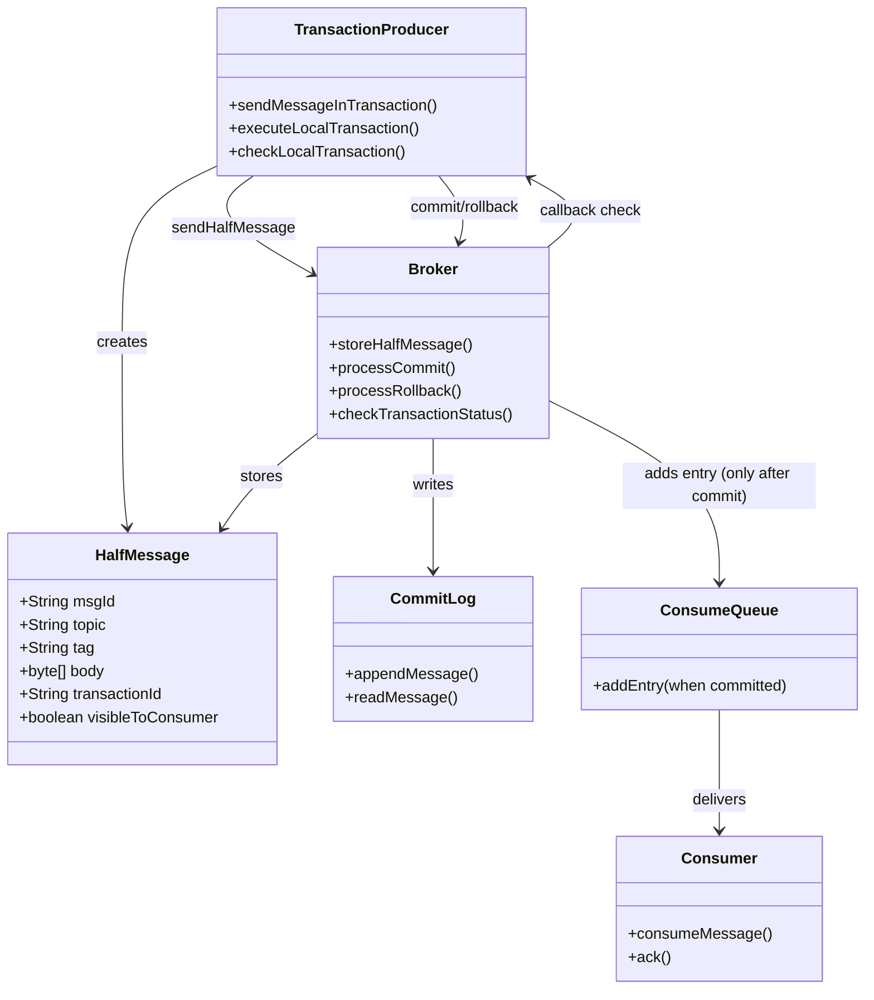
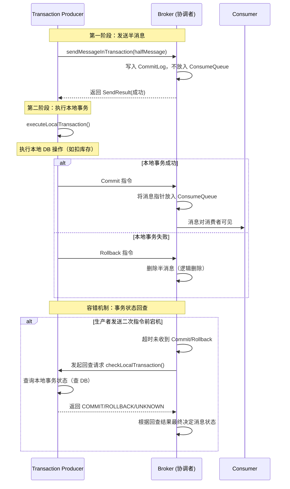
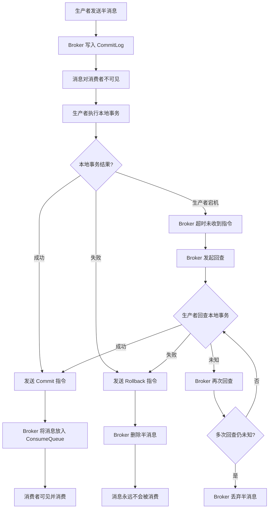

## 引言

用户下单成功，库存已扣减，但"订单已创建"的消息却迟迟没有到达物流系统。排查后发现：生产者先执行了本地事务（扣库存），然后在发送消息前宕机了——数据不一致就此产生。这就是分布式系统中最经典的难题：**如何保证本地事务与消息发送的最终一致性？** 先执行事务再发消息，消息发送失败怎么办？先发消息再执行事务，本地事务回滚怎么办？RocketMQ 的事务消息正是为了解决这个困境而设计。本文将从源码级别拆解 RocketMQ 事务消息的完整流程：半消息（Half Message）的存储原理、两阶段提交的实现细节、Broker 事务状态回查机制的容错设计、以及 Spring Boot 中的完整集成代码。读完本文，你将掌握基于消息实现分布式最终一致性的核心方案，从容应对面试中的高阶分布式事务问题。

### RocketMQ 事务消息是什么？定位与目标

RocketMQ 事务消息是 RocketMQ 提供的一种**特殊类型的消息**。

* **定位：** 它是一种基于消息的**分布式事务解决方案**，用于解决**生产者本地事务**与**消息发送**的最终一致性问题。
* **目标：** 确保消息的发送状态与发送方执行的**本地事务**状态保持一致。如果本地事务成功，消息一定会被投递给消费者；如果本地事务失败，消息一定不会被投递。

### 事务消息架构与核心角色



### 工作原理（重点）

RocketMQ 事务消息的核心是借鉴了二阶段提交（2PC）的原理，并结合 Broker 的存储和回查机制来保证消息的最终状态与本地事务状态一致。

**核心理念：** 通过一个"半消息"（Half Message）作为协调者，在本地事务执行前先将消息发送到 Broker 但不对消费者可见，待本地事务结果确定后，再通知 Broker 将消息设为对消费者可见或删除。

**角色：**

* **Transaction Producer：** 生产者应用，负责发送事务消息和执行本地事务。
* **Broker：** 消息服务器，在事务消息过程中扮演**事务协调者**的角色。负责存储半消息，并处理消息的可见性和回查。

**核心概念：**

* **半消息（Half Message）或预处理消息（Prepared Message）：** 生产者发送给 Broker 的第一阶段消息。Broker 收到后，会将其存储到 CommitLog 中，但**不会放入对应的 ConsumeQueue**，因此对消费者**不可见**。

### 事务消息完整流程



**工作流程（详细步骤）:**

1.  **生产者发送半消息：** 生产者向 Broker 发送一条消息，并将其标记为**事务消息**。Broker 接收到消息后，将其标记为"半消息"，写入 CommitLog，但**不让消费者消费**到（即不将消息指针放入 ConsumeQueue）。Broker 返回发送成功响应给生产者。
    * *关键点：* 这第一阶段确保了消息已经可靠地到达 Broker 并持久化。此时消息处于 Pending 状态，对消费者不可见。

2.  **生产者执行本地事务：** 生产者在收到半消息发送成功响应后，立即**执行本地的数据库事务**。

3.  **生产者根据本地事务结果发送二次提交指令：**
    * 如果本地事务**执行成功**，生产者向 Broker 发送**Commit**指令。
    * 如果本地事务**执行失败**（抛出异常或业务判断失败），生产者向 Broker 发送**Rollback**指令。

4.  **Broker 处理二次提交指令：**
    * 如果 Broker 收到 Commit 指令，它会将该半消息的状态标记为"可提交"，并将消息指针放入对应的 ConsumeQueue，**使消息对消费者可见**。
    * 如果 Broker 收到 Rollback 指令，它会删除该半消息（逻辑删除），**消息永远不会对消费者可见**。

5.  **事务状态回查（Transaction Status Check）- 关键容错机制：**
    * **目的：** 解决在步骤 3 中，生产者在执行完本地事务后、发送二次提交指令**之前**宕机，导致 Broker 无法收到 Commit/Rollback 指令的"悬挂"问题。
    * **机制：** 如果 Broker 在收到半消息后，长时间（可配置的超时时间，默认 10 秒）没有收到生产者的二次提交指令，Broker 会**主动向该生产者组内的所有生产者实例发起回查请求**。

6.  **生产者应用提供本地事务状态查询接口（callback）：**
    * 生产者应用必须实现一个**本地事务监听器（Transaction Producer Listener）**，提供给 Broker 回查时调用的接口。
    * 在这个接口中，生产者需要根据 Broker 提供过来的半消息信息，**查询该消息对应的本地事务的执行状态**（如，查询数据库中订单状态或库存是否已扣减）。

7.  **Broker 根据回查结果最终决定消息状态：**
    * 生产者应用的回查接口返回本地事务的状态：
        * **COMMIT**：本地事务已确定成功。Broker 最终 Commit 消息。
        * **ROLLBACK**：本地事务已确定失败。Broker 最终 Rollback 消息。
        * **UNKNOW**：本地事务状态未知（如正在处理中）。Broker 会在稍后进行**再次回查**。
    * 如果回查多次后状态仍然未知，或者回查失败，Broker 最终会丢弃该半消息。

> **💡 核心提示**：事务状态回查是 RocketMQ 事务消息的灵魂。如果没有回查机制，当生产者在执行完本地事务但发送 Commit/Rollback 之前宕机时，Broker 中的半消息将永远处于"悬挂"状态。回查机制通过"Broker 主动询问 + 生产者查本地 DB 状态"的方式，确保了即使生产者宕机重启，消息的最终状态也能与本地事务保持一致。

### Transaction Producer Listener（本地事务监听器）

生产者应用需要实现 `org.apache.rocketmq.spring.core.RocketMQTransactionListener` 接口（Spring Boot Starter 封装后的接口），它包含两个核心方法：

1.  **`executeLocalTransaction(Message msg, Object arg)`：**
    * **作用：** 生产者发送半消息成功后，立即调用此方法。开发者在此方法中**执行本地数据库事务**。
    * **返回值：** `COMMIT`（本地事务成功，消息最终 Commit）、`ROLLBACK`（本地事务失败，消息最终 Rollback）、`UNKNOW`（本地事务状态未知，需要 Broker 进行回查）。

2.  **`checkLocalTransaction(Message msg)`：**
    * **作用：** 提供给 Broker 回查时调用的方法。开发者在此方法中根据消息信息（如业务主键、订单号等），**查询本地数据库，判断对应的本地事务是否最终成功或失败**。
    * **返回值：** `COMMIT`、`ROLLBACK` 或 `UNKNOW`。

### Spring Cloud 集成示例

1.  **添加依赖：**
    ```xml
    <dependency>
        <groupId>org.apache.rocketmq</groupId>
        <artifactId>rocketmq-spring-boot-starter</artifactId>
        <version>2.2.3</version>
    </dependency>
    ```

2.  **配置 NameServer：**
    ```yaml
    # application.yml
    rocketmq:
      name-server: localhost:9876
      producer:
        group: my_transaction_producer_group
    ```

3.  **实现本地事务监听器：**
    ```java
    @Component
    @RocketMQTransactionListener(producerGroup = "my_transaction_producer_group")
    public class OrderTransactionListener implements RocketMQLocalTransactionListener {

        @Autowired
        private OrderService orderService;

        @Override
        public RocketMQLocalTransactionState executeLocalTransaction(Message msg, Object arg) {
            Long orderId = (Long) arg;
            try {
                orderService.createOrderWithStockDeduction(orderId, new String((byte[]) msg.getPayload()));
                return RocketMQLocalTransactionState.COMMIT;
            } catch (Exception e) {
                return RocketMQLocalTransactionState.ROLLBACK;
            }
        }

        @Override
        public RocketMQLocalTransactionState checkLocalTransaction(Message msg) {
            String orderIdStr = msg.getHeaders().get(RocketMQHeaders.TRANSACTION_ID).toString();
            Long orderId = Long.valueOf(orderIdStr);
            boolean success = orderService.isOrderSuccessfullyCreated(orderId);
            return success ? RocketMQLocalTransactionState.COMMIT : RocketMQLocalTransactionState.ROLLBACK;
        }
    }
    ```

4.  **发送事务消息：**
    ```java
    @Service
    public class OrderCreationService {
        @Autowired
        private RocketMQTemplate rocketMQTemplate;

        public void createOrderAndSendMessage(Long orderId, String orderDetails) {
            Message msg = MessageBuilder.withPayload(orderDetails)
                    .setHeader(RocketMQHeaders.TAGS, "created")
                    .setHeader(RocketMQHeaders.TRANSACTION_ID, orderId)
                    .build();

            SendResult sendResult = rocketMQTemplate.sendMessageInTransaction(
                    "order_events_topic", msg, orderId);
        }
    }
    ```

### 核心方案对比表

| 方案 | 一致性级别 | 性能 | 实现复杂度 | 适用场景 | 推荐指数 |
| :--- | :--- | :--- | :--- | :--- | :--- |
| **RocketMQ 事务消息** | 最终一致性 | 高（非阻塞） | 中（需实现回查接口） | 本地事务 + 消息发送 | ⭐⭐⭐⭐⭐ |
| **XA 事务（2PC）** | 强一致性 | 低（同步阻塞） | 低（框架支持） | 跨 DB 强一致 | ⭐⭐ |
| **Seata AT 模式** | 最终一致性 | 中 | 中（需引入 Seata） | 多服务分布式事务 | ⭐⭐⭐⭐ |
| **Seata TCC 模式** | 最终一致性 | 高 | 高（需实现 Try/Confirm/Cancel） | 高性能分布式事务 | ⭐⭐⭐⭐ |
| **本地消息表** | 最终一致性 | 中 | 中（需建消息表+定时任务） | 无 MQ 事务消息支持 | ⭐⭐⭐ |

### 事务消息状态流转



### 生产环境避坑指南

1. **回查接口必须幂等：** Broker 可能多次发起回查请求，`checkLocalTransaction` 方法必须保证幂等。多次查询不应产生副作用。
2. **回查超时配置：** 默认回查超时时间为 10 秒（`transactionTimeout` 配置），回查次数默认为 15 次。生产环境请根据本地事务执行时间调整这些参数。
3. **本地事务表设计：** `checkLocalTransaction` 方法需要通过业务主键（如订单号）查询本地事务状态。确保本地事务表包含足够的状态字段（如 `order_status`），并且有合适的索引。
4. **消息体不包含敏感信息：** 半消息存储在 CommitLog 中，回查时 Broker 会将消息传递给生产者。避免在消息体中放入密码、token 等敏感信息。
5. **生产者组名称必须匹配：** `@RocketMQTransactionListener` 的 `producerGroup` 必须与发送事务消息的 `RocketMQTemplate` 配置的生产者组一致，否则回查时将找不到监听器。
6. **事务消息不等同于分布式事务框架：** RocketMQ 事务消息只解决"本地事务 + 消息发送"的一致性问题。如果需要跨多个服务的分布式事务，请使用 Seata 等专用框架。

### 行动清单

1. **检查点**：确认 `@RocketMQTransactionListener` 的 `producerGroup` 与发送消息的生产者组名称一致。
2. **检查点**：确认 `checkLocalTransaction` 方法通过查询数据库（而非内存状态）来判断本地事务结果，以保证生产者重启后回查仍能正确执行。
3. **优化建议**：在 `checkLocalTransaction` 中增加日志记录，方便排查事务状态不确定的问题。
4. **优化建议**：将回查超时时间（`transactionCheckInterval`）和最大回查次数（`transactionCheckMax`）调整到合理值，避免回查过于频繁或回查次数不足。
5. **扩展阅读**：推荐阅读 RocketMQ 官方文档的"Transaction Message"章节，以及 Seata 框架的 AT 模式对比。
6. **实操建议**：在测试环境中模拟生产者在发送 Commit 指令前宕机，观察 Broker 回查机制的完整流程。

### 面试问题示例与深度解析

* **什么是 RocketMQ 事务消息？它解决了什么问题？**（定义特殊消息类型，解决本地事务与消息发送的最终一致性问题）
* **请描述 RocketMQ 事务消息的实现原理或工作流程。**（**核心！** 必考题，详细分步骤讲解：发送半消息 -> 执行本地事务 -> 二次提交（Commit/Rollback）-> **事务状态回查机制** -> Broker 最终处理。务必解释半消息和回查的重要性）
* **什么是半消息（Half Message）？它有什么作用？**（定义为第一阶段发送的消息，对消费者不可见。作用：作为事务协调的中间状态）
* **事务状态回查机制有什么作用？为什么需要它？**（**核心！** 必考题，作用：处理生产者在发送二次提交指令前宕机的"悬挂"问题）
* **生产者应用需要实现哪些接口？它们分别在什么时候被调用？**（**核心！** 实现 `RocketMQTransactionListener`，重写 `executeLocalTransaction`（发送半消息后调用）和 `checkLocalTransaction`（Broker 回查时调用））
* **RocketMQ 事务消息是强一致性还是最终一致性？为什么？**（最终一致性，因为本地事务与消息发送不是同步完成的）
* **如果 Broker 多次回查生产者应用，状态一直是 UNKNOW，Broker 会如何处理？**（最终会丢弃这条半消息）

### 总结

RocketMQ 分布式事务消息是解决"生产者本地事务与消息发送最终一致性"问题的优雅方案。它基于精简的两阶段提交原理，通过引入"半消息"和独特的"事务状态回查"机制，保证了即使在生产者宕机等异常情况下，消息的最终投递状态也能够与本地事务的执行结果保持一致。理解事务消息的核心概念（半消息、回查）、工作流程以及生产者端需要实现的回调方法，是掌握分布式环境下基于消息实现最终一致性的关键。
