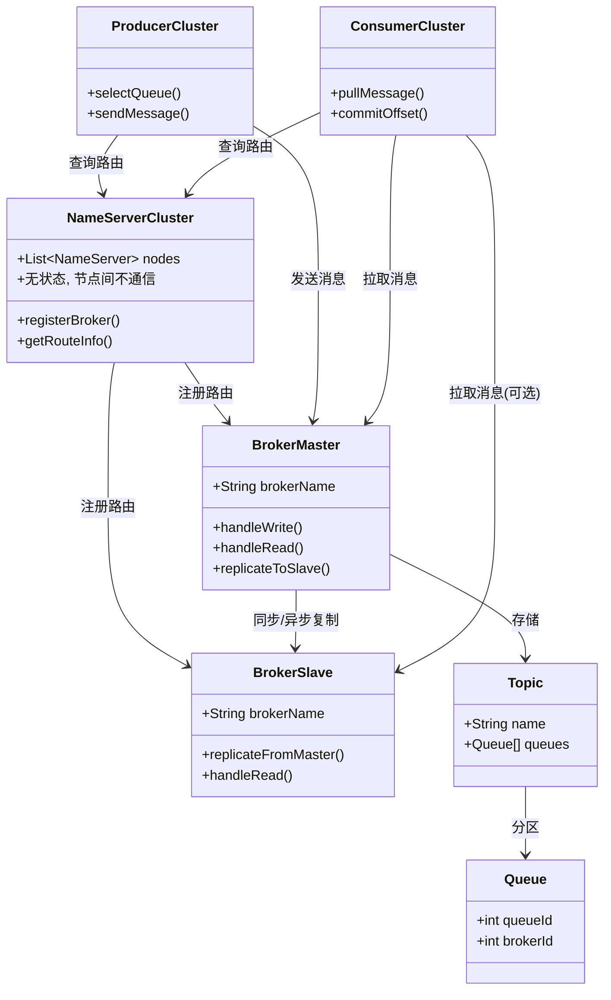
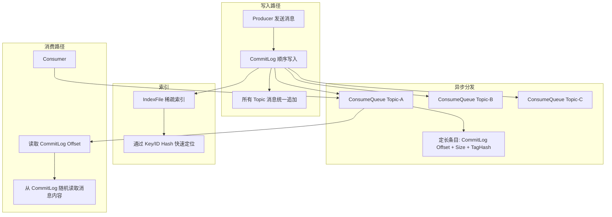
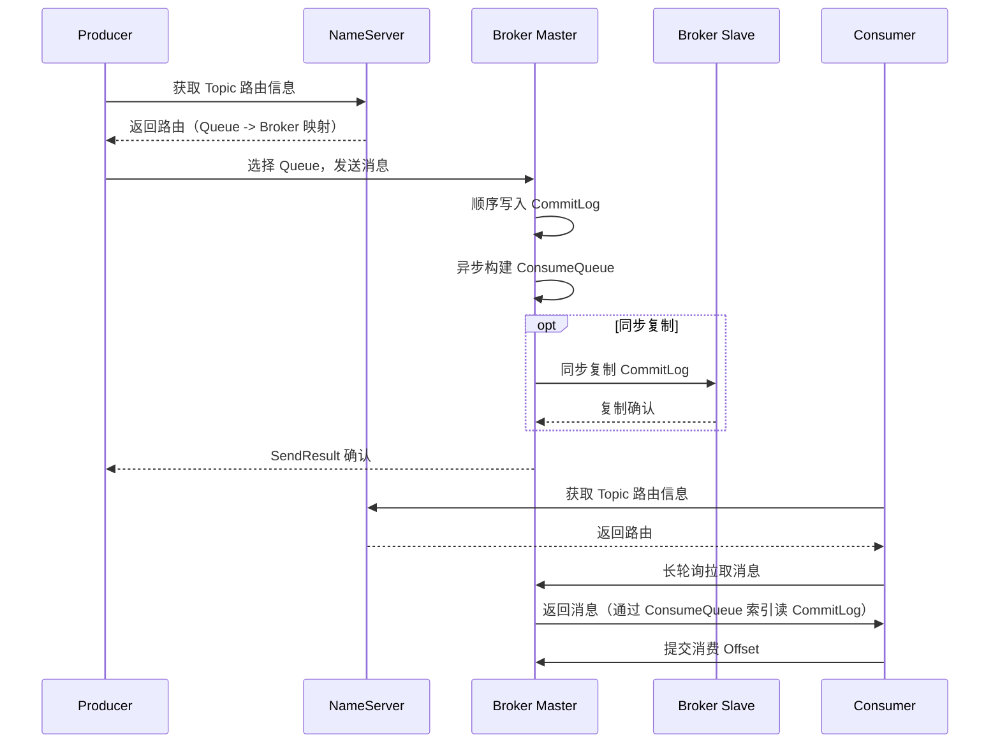

## 引言

双十一零点，你的电商平台订单量暴增 10 倍。RabbitMQ 扛不住了，Kafka 不支持事务消息和延时投递——你需要的正是 RocketMQ：它既能像 Kafka 一样顺序写 CommitLog 实现百万级吞吐，又能原生支持两阶段提交的事务消息和精确延时投递。但 RocketMQ 的"金字塔存储"架构到底是什么？NameServer 和 ZooKeeper 有什么区别？同步复制 + 同步刷盘到底能容忍几台机器宕机？本文将深度拆解 RocketMQ 的整体架构、存储机制、复制与刷盘策略，并与 Kafka、RabbitMQ 进行全方位对比。读完本文，你将掌握 RocketMQ 为何在国内电商和金融场景占据主导地位，以及如何在技术选型中做出正确决策。

### RocketMQ 是什么？定位与核心理念

Apache RocketMQ 是一个**分布式消息和流处理平台**。

* **定位：** 它是一个为分布式应用提供异步通信、削峰填谷、解耦等功能的**消息中间件**，并支持构建流处理应用。
* **核心理念：** 提供一个**高吞吐、低延迟、高可靠**的消息系统，特别注重在**大规模分布式环境**下的稳定性、事务支持和易用性。

### 架构设计与核心组件

RocketMQ 采用经典的分布式架构，主要包含 NameServer 集群、Broker 集群、Producer 集群、Consumer 集群。

1.  **角色：**
    * **Producer：** 消息生产者，负责发送消息。
    * **Consumer：** 消息消费者，负责接收并消费消息。
    * **NameServer：** **注册中心**，无状态。提供路由注册和发现服务。Broker 启动时向 NameServer 注册。生产者和消费者通过 NameServer 查询 Broker 的地址信息。NameServer 集群之间互不通信。
    * **Broker：** **消息服务器**，有状态。负责消息的存储、投递、查询以及高可用保证。Broker 支持**Master/Slave 架构**，一个 Master Broker 可以有多个 Slave Broker。

2.  **整体架构：**
    * 多个 NameServer 节点组成 NameServer 集群，它们之间无状态，互不通信。
    * 多个 Broker 节点组成 Broker 集群，支持 Master/Slave 架构。
    * Producer 发送消息前，先从 NameServer 获取 Topic 的路由信息，然后选择一个队列，向对应的 Master Broker 发送消息。
    * Consumer 订阅 Topic 前，先从 NameServer 获取路由信息，然后向对应的 Broker 发送拉取消息的请求。

### RocketMQ 整体架构

### 存储架构（金字塔存储）

RocketMQ 的消息存储是其高性能和高可靠性的关键。它采用了一种"金字塔"式的存储结构，主要包含三个核心文件：

* **CommitLog 文件：** **消息的物理存储文件**。所有 Topic 的所有消息**顺序写入** CommitLog 文件。这样做的好处是**顺序写**性能极高，且方便进行主从复制。
* **ConsumeQueue 文件：** **消息的逻辑队列文件**。每个 Topic 的每个 Queue 都有一个对应的 ConsumeQueue 文件。它存储的是消息在 CommitLog 中的**物理位置指针**（Offset），以及消息的大小和 Tag 的 Hash 值。ConsumeQueue 文件是**定长条目**，顺序写入。
* **IndexFile 文件：** **消息的索引文件**。通过消息的 Key 或消息 ID 创建索引，提供快速查找能力。IndexFile 是**稀疏索引**，通过 Hash 值进行快速定位。

> **💡 核心提示**：为什么 RocketMQ 不直接按 Topic 分文件存储（类似 Kafka 的 Partition Log）？因为 RocketMQ 需要支持 Topic 的任意创建，而如果按 Topic 分文件，每次创建新 Topic 都需要创建新的物理文件，导致大量随机写。CommitLog 统一顺序写解决了写入性能问题，ConsumeQueue 的定长逻辑指针解决了按 Topic 消费的读取性能问题。这是 RocketMQ 在设计上的一个精妙取舍。

### 金字塔存储架构

### 高可用与数据一致性

* **Master/Slave 复制机制：** Slave Broker 从 Master Broker 异步或同步复制 CommitLog 数据。
    * **同步复制（SYNC_MASTER）：** Master 必须等待至少一个 Slave 复制成功后才向生产者返回确认。保证消息不丢失（只要 Master 和至少一个 Slave 不同时宕机）。但写入延迟相对较高。
    * **异步复制（ASYNC_MASTER）：** Master 写入成功即可向生产者返回确认，无需等待 Slave 复制。写入延迟低，但 Master 宕机时，未及时复制到 Slave 的消息可能丢失。
* **刷盘机制（Flush）：** Broker 将消息从内存写入磁盘的方式。
    * **同步刷盘（SYNC_FLUSH）：** 消息写入内存后，立即将消息对应的物理文件强制刷写到磁盘。可靠性最高，但写入延迟高。
    * **异步刷盘（ASYNC_FLUSH）：** 消息写入内存后立即返回确认，由后台线程异步刷写到磁盘。写入延迟低，但 Broker 突然宕机可能丢失少量内存中的消息。
* **组合策略：** 通过同步复制 + 同步刷盘可以实现最高的可靠性，但性能最低。生产环境常根据业务对可靠性和性能的要求，选择同步复制 + 异步刷盘（高可靠 + 高性能）或异步复制 + 异步刷盘（极高吞吐）。

### 核心概念详解

* **Topic：** 消息的逻辑分类。
* **Queue（消息队列）：** Topic 的分区。一个 Topic 由多个 Queue 组成。消息在 Queue 内是严格有序的。
* **Tag：** 消息的标签。生产者发送消息时可以设置 Tag，消费者可以根据 Tag 进行消息过滤。
* **Key：** 消息的业务标识。常用于发送顺序消息（相同 Key 发送到同一 Queue）或通过 IndexFile 快速查询消息。
* **Consumer Group：** 消费组。在一个消费组内，一个 Queue 的消息**只会被组内的一个消费者实例消费**。
* **Push vs Pull 消费模型：**
    * **Push 模式：** Broker 接收到消息后，**主动**将消息推送给消费者。延迟低，但消费者被动接收，可能因处理能力不足导致 Broker 压力大。RocketMQ 的 Push 模式底层基于长轮询实现。
    * **Pull 模式：** 消费者**主动**向 Broker 发送请求拉取消息。消费者可以根据自己的处理能力控制拉取速率。
* **集群消费 vs 广播消费：**
    * **集群消费（Clustering）：** 同一个消费组内的不同消费者实例分摊消费 Topic 下的 Queue。
    * **广播消费（Broadcasting）：** 同一个消费组内的所有消费者实例都消费 Topic 下的所有 Queue。

### RocketMQ 投递流程

### RocketMQ vs Kafka vs RabbitMQ 对比

| 特性             | Apache RocketMQ                      | Apache Kafka                       | RabbitMQ                         |
| :--------------- | :----------------------------------- | :--------------------------------- | :------------------------------- |
| **核心模型** | **分布式消息队列/流平台** | **分布式提交日志/流平台** | **传统消息队列** |
| **架构** | **NameServer（无状态）** + **Broker（Master/Slave）** | ZooKeeper/Kraft + Broker（Leader/Follower） | Broker 集群（节点对等或镜像） |
| **存储** | **金字塔存储**（CommitLog/ConsumeQueue/IndexFile） | **分布式日志**（Partition Logs） | **基于内存和磁盘**（消息队列） |
| **协议** | **自定义协议**，支持 OpenMessaging, MQTT | **自定义协议** | **AMQP（核心）**，MQTT, STOMP |
| **消费模型** | **Push 和 Pull 都支持** | **Pull（拉模式）** | **Push（推模式）** 和 Pull |
| **消息顺序** | **局部顺序**（Queue 内） | **分区内顺序**（Partition 内） | 通常队列内有序 |
| **事务消息** | **原生支持两阶段提交分布式事务消息** | 支持事务，需额外集成分布式 | 支持 AMQP 事务（非分布式） |
| **定时/延时消息** | **内置支持** | 不直接支持（需外部调度） | 通过插件/TTL+DLX 实现 |
| **消息过滤** | **Broker 端支持**（Tag/SQL92） | 消费者端过滤 | Broker 端（Routing Key, Header） |
| **一致性** | **强一致性**（同步复制/刷盘可选） | **分区内强一致**（ISR） | 依赖配置 |
| **CAP 倾向** | 通常配置为 **CP** | 通常配置为 **AP** | 依赖配置 |
| **适合场景** | **国内高并发、高可靠、金融/电商级场景** | **高吞吐、流处理、日志收集、大数据管道** | **传统消息队列、灵活路由、跨语言** |

### 复制与刷盘策略对比表

| 策略组合 | 可靠性 | 吞吐量 | 延迟 | 适用场景 | 推荐指数 |
| :--- | :--- | :--- | :--- | :--- | :--- |
| **同步复制 + 同步刷盘** | 最高（不丢） | 最低 | 最高 | 金融核心、支付场景 | ⭐⭐⭐⭐ |
| **同步复制 + 异步刷盘** | 高（Master+Slave 不双宕机不丢） | 中高 | 中 | 电商订单、重要业务 | ⭐⭐⭐⭐⭐ |
| **异步复制 + 同步刷盘** | 中高（Master 宕机不丢） | 中 | 中高 | 对延迟敏感但要求持久 | ⭐⭐⭐ |
| **异步复制 + 异步刷盘** | 最低（Master 宕机可能丢） | 最高 | 最低 | 日志采集、非核心通知 | ⭐⭐⭐ |

### 生产环境避坑指南

1. **NameServer 路由信息可能不一致：** NameServer 节点之间互不通信，每个 Broker 定期向所有 NameServer 注册。当某个 NameServer 短暂不可用时，Producer/Consumer 可能从其他 NameServer 获取到旧路由。这是 RocketMQ 在一致性和可用性之间的取舍（AP 优先）。生产环境建议部署至少 2 个 NameServer。
2. **Broker 切换可能导致短暂不可用：** Master 宕机时，Slave 需要时间切换为可写状态。切换期间消息可能短暂无法写入。建议配合 VIP 通道或 DNS 切换实现快速故障转移。
3. **CommitLog 文件大小配置：** CommitLog 默认每个文件 1GB。如果消息量极大，建议监控磁盘空间，避免 CommitLog 文件过多导致磁盘满。
4. **ConsumeQueue 的定长优势：** ConsumeQueue 每条记录固定 20 字节（CommitLog Offset 8 字节 + Size 4 字节 + TagHash 8 字节）。这种定长设计使得消费者可以高效地按偏移量定位，但也意味着 Tag 过滤在 Broker 端只能用 Hash 匹配（存在 Hash 冲突可能），精确过滤需要在消费者端再做一次。
5. **Consumer Group 名称不能重复：** 不同业务线的 Consumer Group 名称如果重复，会导致消息被错误消费。建议加上业务前缀（如 `order-service-consumer-group`）。
6. **消息体大小限制：** 默认消息体最大 4MB（`maxMessageSize=4194304`）。超过限制会直接拒绝。如果需要传输大文件，建议将文件存储到 OSS/MinIO，消息中只传 URL。

### 行动清单

1. **检查点**：确认 NameServer 集群至少部署 2 个节点，Broker Master/Slave 成对部署。
2. **检查点**：根据业务可靠性要求选择复制+刷盘策略组合。金融/支付场景建议使用同步复制 + 同步刷盘。
3. **优化建议**：监控 CommitLog 写入延迟、ConsumeQueue 构建延迟、Broker 复制延迟等关键指标。
4. **优化建议**：定期检查消费组的消费进度，避免消息积压。
5. **扩展阅读**：推荐阅读 RocketMQ 官方博客关于存储架构的深度解析，以及《RocketMQ 技术内幕》一书。
6. **实操建议**：使用 `mqadmin` 命令行工具检查 Broker 状态、Topic 路由和消费组进度。

### 面试问题示例与深度解析

* **请描述 RocketMQ 的架构。它包含哪些核心组件？它们之间如何协同工作？**（**核心！** NameServer、Broker、Producer、Consumer。NameServer 集群无状态，Broker 集群 Master/Slave。生产者/消费者通过 NameServer 发现 Broker）
* **请详细介绍 RocketMQ 的消息存储架构（金字塔存储）。包括哪些文件？它们的作用是什么？为什么要这样设计？**（**核心！** CommitLog（物理顺序写），ConsumeQueue（逻辑定长顺序写，指针），IndexFile（Key 索引））
* **RocketMQ 如何保证消息的高可用和数据不丢失？**（**核心！** Master/Slave 复制（同步/异步），刷盘（同步/异步）。同步复制 + 同步刷盘可靠性最高）
* **RocketMQ 的 Push 模式和 Pull 模式有什么区别？**（**核心！** Push：Broker 主动推，低延迟。Pull：消费者主动拉，控制速率。RocketMQ 的 Push 底层基于长轮询实现）
* **什么是 RocketMQ 的分布式事务消息？**（**核心！** 两阶段提交事务消息，保证消息发送与本地事务最终一致：半消息 -> 本地事务 -> Commit/Rollback -> 回查机制）
* **请对比 RocketMQ、Kafka 和 RabbitMQ 三者的异同。**（**核心！** 从架构、存储、消费模型、核心功能、适用场景等多维度分析）

### 总结

Apache RocketMQ 是一个为大规模分布式系统设计的高性能、高可靠消息中间件。其核心架构包括 NameServer 集群和 Master/Slave Broker 集群。独特的金字塔存储结构（CommitLog、ConsumeQueue、IndexFile）保证了读写性能。它支持灵活的 Push/Pull 消费模型，提供强大的分布式事务消息、定时消息、顺序消息等高级特性。理解 RocketMQ 的架构、存储机制、复制和刷盘策略、以及其与 Kafka、RabbitMQ 等其他主流消息中间件在设计理念和功能特性上的差异，是掌握分布式消息技术栈、进行技术选型并应对面试官考察的关键。
