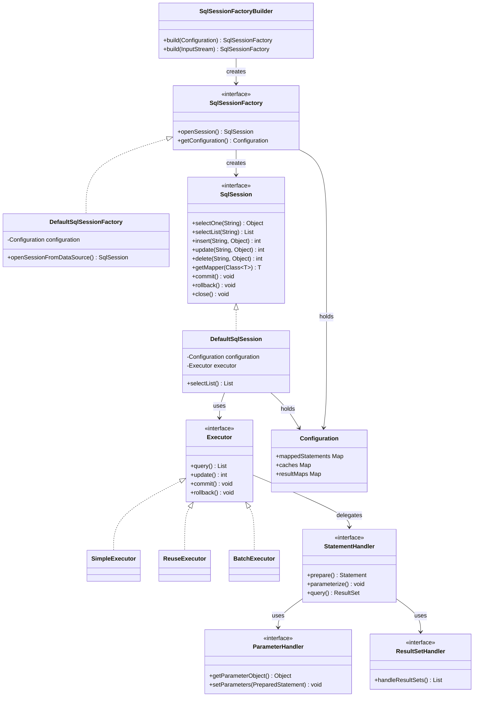
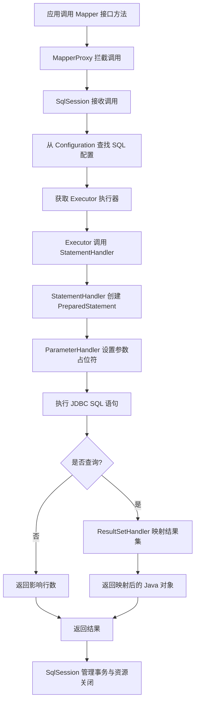
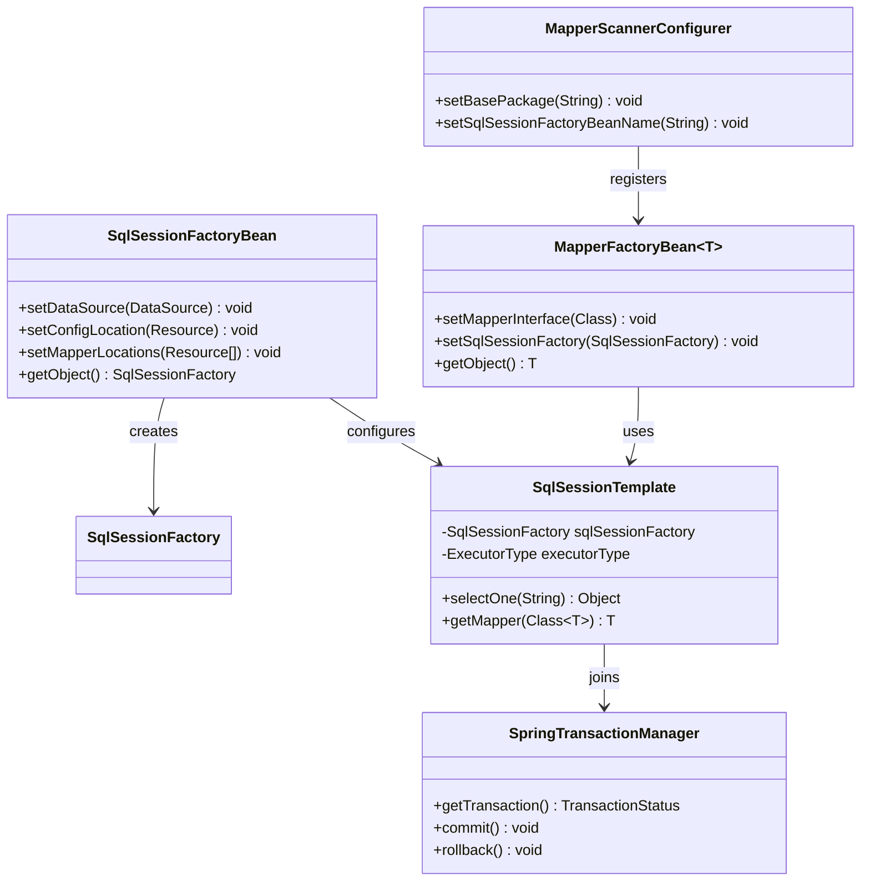

## 引言

你的项目中是否也有这样的场景：Service 层调用 Mapper 接口方法，一行代码就能完成数据库查询，但你却说不出 MyBatis 内部究竟经历了什么？当线上出现慢查询、缓存穿透、或者 `@Transactional` 不生效时，你能否快速定位到是哪个环节出了问题？

国内超过 70% 的 Java 项目在使用 MyBatis，但面试中能清晰说出 `SqlSession` 到 `Executor` 再到 `Handler` 完整调用链的人寥寥无几。本文带你从架构视角拆解 MyBatis：核心组件如何协作、SQL 执行的完整流程、两级缓存的失效陷阱，以及与 Spring 事务集成的底层原理。读完这篇文章，你不仅能写出更优雅的持久层代码，还能在面试中对答如流。

---

## MyBatis 是什么？定位与核心理念

开发者在与数据库交互时，面临以下选择：

* **直接使用 JDBC：** 最底层，灵活性最高，但代码量大，繁琐易错。
* **使用 ORM（如 JPA/Hibernate）：** 极大地简化开发，将对象操作转换为 SQL，开发者通常无需关心 SQL 细节。但在复杂 SQL 或优化场景下，控制权较弱。
* **使用 SQL Mapper（如 MyBatis）：** 介于 JDBC 和 ORM 之间。开发者自己编写 SQL，MyBatis 负责将 SQL 的参数设置和结果集映射到 Java 对象，屏蔽了 JDBC 样板代码。

> **💡 核心提示**：MyBatis 的官方定位是"SQL Mapper"而非"ORM"。这意味着它不会自动生成 SQL，而是将你手写的 SQL 与 Java 方法进行映射，让你保留对 SQL 的完全控制权。

MyBatis 是一个支持定制化 SQL、存储过程以及高级映射的**优秀的持久层框架**。

* **定位：** 它是一个 **SQL Mapper（SQL 映射器）** 框架。它将开发者手动编写的 SQL 语句与 Java 方法进行**映射**。
* **核心理念：** 让开发者完全控制 SQL，同时 MyBatis 负责参数的设置和结果集的映射，将开发者从繁琐的 JDBC 样板代码中解放出来。

MyBatis 凭借其在 SQL 控制权和 JDBC 简化之间的良好平衡，在国内获得了广泛的应用。

## 为什么选择 MyBatis？优势分析

| 优势 | 说明 |
| :--- | :--- |
| **强大的 SQL 控制权** | 开发者可以编写和优化最符合需求的 SQL，充分利用数据库特性 |
| **简化 JDBC 开发** | 屏蔽了连接管理、Statement 创建、参数设置、结果集处理、资源关闭等繁琐细节 |
| **灵活的结果集映射** | 支持将 SQL 查询结果灵活地映射到 Java POJO、Map 或 List |
| **动态 SQL 能力** | 基于 `<if>`、`<where>`、`<foreach>` 等标签，运行时动态构建 SQL |
| **易于学习和使用** | 相比全功能 ORM，概念相对简单，学习曲线平缓 |
| **与 Spring/Spring Boot 集成良好** | 提供了专门的适配模块，可利用 Spring 的 IoC 和声明式事务管理 |

> **💡 核心提示**：选择 MyBatis 还是 JPA/Hibernate，取决于项目对 SQL 控制权的需求。国内项目偏爱 MyBatis，核心原因是复杂的业务查询需要精细的 SQL 调优，而全自动 ORM 在这方面往往力不从心。

## MyBatis 核心组件详解

MyBatis 的架构围绕着 `SqlSessionFactory`、`SqlSession` 以及一系列内部执行处理组件构建。

### SqlSessionFactory（SQL 会话工厂）

* **定义：** 负责创建 `SqlSession` 对象的**工厂**。它是 MyBatis 的**核心对象**。
* **作用：** 负责解析 MyBatis 的配置信息（`mybatis-config.xml` 或 Java Config），构建 `Configuration` 对象，然后创建 `SqlSessionFactory` 实例。由于其构建过程比较耗时且是线程安全的，一个应用通常只需要一个 `SqlSessionFactory` 实例，作为单例存在。
* **生命周期：** 应用启动时构建，应用关闭时销毁。
* **构建过程简述：** `SqlSessionFactoryBuilder` 读取 MyBatis 配置文件或 `Configuration` 对象，解析其中的环境配置（数据源、事务管理器）、Mapper 文件的 SQL 映射信息等，最终构建出 `SqlSessionFactory`。

### SqlSession（SQL 会话）

* **定义：** 代表与数据库的一次**交互会话**。它是 MyBatis 提供给开发者用于执行 SQL 操作的主要接口。
* **作用：** 提供了执行 SQL 的方法（如 `selectOne`、`selectList`、`insert`、`update`、`delete`），获取 Mapper 接口代理对象（`getMapper()`），以及管理事务（`commit`、`rollback`、`close`）。**`SqlSession` 不是线程安全的。**
* **生命周期：** 在需要访问数据库时创建，在数据库访问完成后关闭。它的生命周期与一次请求或一个业务单元绑定。
* **比喻：** 想象 `SqlSessionFactory` 是一个数据库连接池工厂，而 `SqlSession` 就是从连接池中获取的一个数据库连接以及基于这个连接进行的一次会话。

### Mapper 接口与 XML 文件 / 注解

* **定义：** 开发者定义的 Java 接口，接口方法与 SQL 语句进行**映射**。开发者无需编写接口实现类，MyBatis 会在运行时生成一个代理实现。SQL 语句可以定义在与接口同名的 Mapper XML 文件中，或者直接使用注解标注在接口方法上。
* **映射关系：** Mapper XML 文件中的 `<select>`、`<insert>`、`<update>`、`<delete>` 标签的 `id` 属性通常与 Mapper 接口的方法名对应。
* **SQL 定义：** 在 XML 或注解中编写 SQL 语句，使用 `#{}` 或 `${}` 绑定参数，使用 `<resultMap>` 或 `@Results` 定义结果集到对象的映射规则。
* **比喻：** Mapper 接口是你对外暴露的数据库操作 API 契约。Mapper XML / 注解是这些 API 契约的具体实现细节（也就是 SQL 语句）。

### 核心执行处理组件（Executor、Handlers）

这些是 `SqlSession` 内部用于实际执行 SQL 和处理结果的组件。

* **`Executor`（执行器）：** `SqlSession` 的底层实现，负责实际执行 SQL 语句。它会根据配置选择不同的执行器实现（`SimpleExecutor`、`ReuseExecutor`、`BatchExecutor`）。它负责管理事务，并调用 `StatementHandler`。
* **`StatementHandler`（语句处理器）：** 负责准备 SQL 语句，包括处理 SQL 占位符、设置 Statement 参数、执行底层的 JDBC Statement。它会调用 `ParameterHandler` 和 `ResultSetHandler`。
* **`ParameterHandler`（参数处理器）：** 负责将 Java 方法的参数值设置到 JDBC `PreparedStatement` 的参数占位符中。
* **`ResultSetHandler`（结果集处理器）：** 负责处理 JDBC 执行 SQL 后返回的 `ResultSet`。它会根据配置的 `<resultMap>` 或注解，将 `ResultSet` 中的数据映射到 Java 对象、Map 或其他类型。

> **💡 核心提示**：这四个 Handler 组件形成了典型的**责任链模式**。`Executor` 是入口，它把任务委派给 `StatementHandler`，后者再分别委托给 `ParameterHandler` 设置参数、委托给 `ResultSetHandler` 处理结果。这种设计使得每个组件职责单一，且可以通过 MyBatis 的插件机制（Interceptor）进行拦截增强。

## MyBatis SQL 执行流程

理解 MyBatis 架构的关键是理解一个 SQL 调用是如何从 Mapper 接口方法，经过各个核心组件，最终执行到数据库并返回结果的。

### 详细步骤解析

1. **应用调用 Mapper 接口方法：** 应用程序通过 `SqlSession.getMapper()` 获取到的 Mapper 接口代理对象（`MapperProxy`），调用其方法。
2. **`SqlSession` 接收调用：** Mapper 接口代理对象将调用信息（方法、参数）转发给关联的 `SqlSession`。
3. **查找 SQL 配置：** `SqlSession` 根据调用信息（Mapper 接口名、方法名），从 `Configuration` 对象中查找对应的 SQL 语句、参数映射、结果映射等配置信息。
4. **获取 `Executor`：** `SqlSession` 从 `Configuration` 中获取或选择一个 `Executor` 实现。
5. **`Executor` 使用 `StatementHandler`：** `Executor` 将 SQL 配置和参数传递给 `StatementHandler`。
6. **`StatementHandler` 准备语句：** `StatementHandler` 根据 SQL 配置创建 JDBC `PreparedStatement` 或 `Statement`。
7. **`StatementHandler` 使用 `ParameterHandler`：** `StatementHandler` 将方法参数传递给 `ParameterHandler`。`ParameterHandler` 负责将参数值设置到 JDBC 语句的参数占位符中。
8. **执行 JDBC 语句：** `StatementHandler` 调用 JDBC API 执行准备好的 SQL 语句。
9. **`StatementHandler` 使用 `ResultSetHandler`（针对查询）：** 对于查询语句，`StatementHandler` 将 JDBC 返回的 `ResultSet` 传递给 `ResultSetHandler`。
10. **`ResultSetHandler` 映射结果：** `ResultSetHandler` 根据配置（`<resultMap>` 或注解）从 `ResultSet` 中读取数据，并将其映射到 Java 对象。
11. **返回结果：** 结果逐层返回给应用程序。
12. **事务管理与资源关闭：** 在整个过程中，`SqlSession` 负责管理事务，并在会话结束时关闭底层 JDBC 连接和 Statement 等资源。

## MyBatis 缓存机制

MyBatis 提供两级缓存来提高查询性能：

### 一级缓存（SqlSession 级别）

* **默认启用。** 作用域是**同一个 `SqlSession` 对象**。
* 在同一个 `SqlSession` 中，对同一条 SQL（相同的 statement ID 和参数）的查询结果会被缓存。后续对同一 SQL 的查询将直接从缓存中获取结果，不再访问数据库。
* **生命周期：** 随着 `SqlSession` 的创建而存在，随着 `SqlSession` 的关闭而销毁。
* **注意：** 当 `SqlSession` 执行了插入、更新、删除操作，或者手动清空缓存时，一级缓存会失效。

### 二级缓存（SqlSessionFactory 级别）

* **默认不启用。** 作用域是**同一个 `SqlSessionFactory` 对象**，可以跨越不同的 `SqlSession`。
* 当多个 `SqlSession` 查询同一条 SQL（相同的 statement ID 和参数）且开启了二级缓存时，查询结果会被缓存在 `SqlSessionFactory` 共享的区域。后续不同 `SqlSession` 对同一 SQL 的查询可能从二级缓存获取结果，减少数据库访问。
* **启用方式：**
  * 在 `mybatis-config.xml` 中开启全局二级缓存：`<setting name="cacheEnabled" value="true"/>`
  * 在 Mapper XML 文件中配置 `<cache/>` 标签。
  * 缓存的 POJO 对象需要实现 `Serializable` 接口。
* **生命周期：** 随着 `SqlSessionFactory` 的创建而存在，随着 `SqlSessionFactory` 的关闭而销毁。
* **注意：** 二级缓存的粒度是 Mapper 命名空间。当 Mapper 命名空间下的任何一条 SQL 执行了插入、更新、删除操作，该命名空间下的所有二级缓存都会失效。

> **💡 核心提示**：二级缓存默认不启用是有原因的。在分布式环境中，多个应用实例共享同一个 MyBatis 二级缓存会导致数据不一致。生产环境建议使用 Redis 等外部缓存替代 MyBatis 内置二级缓存，以获得更好的可控性和一致性。

### 一级缓存 vs 二级缓存对比

| 特性 | 一级缓存（SqlSession 级别） | 二级缓存（SqlSessionFactory 级别） |
| :--- | :--- | :--- |
| **作用域** | 同一个 `SqlSession` | 同一个 `SqlSessionFactory`（跨 `SqlSession`） |
| **默认状态** | 启用 | 不启用 |
| **生命周期** | 随 `SqlSession` 存亡 | 随 `SqlSessionFactory` 存亡 |
| **缓存粒度** | `SqlSession` 级别 | Mapper 命名空间级别 |
| **失效时机** | 执行 CUD 操作或手动清空 | 命名空间内执行 CUD 操作 |
| **线程安全** | 天然安全（单 `SqlSession`） | 需要额外保证 |
| **分布式友好** | 不涉及（单会话） | **不友好**，多实例数据不一致 |
| **适用场景** | 同一会话内重复查询 | 读多写少的单实例场景 |

## MyBatis 与 Spring 集成方式

在实际开发中，MyBatis 常常与 Spring Framework 结合使用，利用 Spring 的 IoC、声明式事务等功能。MyBatis 提供了专门的 **`mybatis-spring`** 适配模块来简化集成。

### 核心集成组件

1. **`SqlSessionFactoryBean`：** Spring 提供的 FactoryBean 实现，用于在 Spring 容器中构建并暴露 `SqlSessionFactory` Bean。它负责加载 MyBatis 的配置信息，并将构建好的 `SqlSessionFactory` 注册到 Spring 容器。
2. **`MapperScannerConfigurer` / `@MapperScan`：** 自动扫描指定包下的 Mapper 接口，并将它们注册为 Spring 容器中的 Bean。`MapperScannerConfigurer` 用于 XML 配置，`@MapperScan` 用于 Java Config。
3. **`MapperFactoryBean`：** Spring 提供的 FactoryBean 实现，用于创建 Mapper 接口的代理对象 Bean。`MapperScannerConfigurer` / `@MapperScan` 在底层就是使用 `MapperFactoryBean` 为每个扫描到的 Mapper 接口生成代理 Bean。
4. **`SqlSessionTemplate`：** `SqlSession` 的**线程安全**实现。它封装了 `SqlSession` 的创建、使用和关闭逻辑，并能够**自动集成 Spring 的声明式事务**。在 Spring 环境下，通常使用 `SqlSessionTemplate` 来代替直接操作 `SqlSession`。

### 与 Spring 声明式事务（@Transactional）集成

* 在 Spring 环境下，通常由 Spring 的事务管理器管理事务。你只需要在 Service 层方法上添加 `@Transactional` 注解。
* `mybatis-spring` 的 `SqlSessionTemplate` 会感知到当前的 Spring 事务。当 `@Transactional` 方法被调用时，Spring 事务管理器会先开启事务，然后调用 MyBatis 操作。`SqlSessionTemplate` 会加入到这个由 Spring 管理的事务中，确保同一个事务中的所有 MyBatis 操作使用同一个数据库连接。
* 当 Spring 事务提交或回滚时，`SqlSessionTemplate` 也会跟着执行底层的 MyBatis（`SqlSession`）提交或回滚操作。

### 与 Spring Boot 集成

* Spring Boot 提供了 `mybatis-spring-boot-starter`，它在 `mybatis-spring` 的基础上提供了自动配置能力。
* 只需要引入 Starter，配置数据源和 `mybatis.*` 相关属性，Spring Boot 会自动配置 `SqlSessionFactoryBean` 和 `SqlSessionTemplate`，并默认扫描 `main` 方法所在包及其子包下的 Mapper 接口，极大地简化了配置。

> **💡 核心提示**：`SqlSessionTemplate` 之所以是线程安全的，是因为它内部使用 `ThreadLocal` 来绑定当前线程的 `SqlSession`。在 Spring 事务环境中，同一个事务内的所有操作都通过同一个 `SqlSession` 执行，从而保证了事务的一致性。

## MyBatis vs JPA/Hibernate 对比分析

| 对比维度 | MyBatis（SQL Mapper） | JPA/Hibernate（Full ORM） |
| :--- | :--- | :--- |
| **SQL 控制权** | 开发者手写 SQL，完全可控 | 框架自动生成，控制权弱 |
| **学习曲线** | 平缓，上手快 | 陡峭，概念多 |
| **复杂查询** | 灵活，原生 SQL 支持 | 需要 JPQL / Criteria API |
| **对象映射** | 手动配置 `<resultMap>` | 全自动，注解驱动 |
| **性能调优** | 直接优化 SQL，直观高效 | 需理解 N+1、懒加载等概念 |
| **数据库移植性** | 较低（SQL 可能依赖方言） | 较高（自动适配方言） |
| **适用场景** | 复杂 SQL、精细调优、国内项目 | 对象模型驱动、快速 CRUD |
| **推荐指数** | 国内业务场景 ⭐⭐⭐⭐⭐ | 国际化产品 ⭐⭐⭐⭐ |

## 面试高频问题解析

以下是 MyBatis 面试中最高频的问题及答题要点：

| 面试问题 | 核心答题要点 |
| :--- | :--- |
| **什么是 MyBatis？与 JPA/Hibernate 有什么区别？** | 定位为 SQL Mapper，解决 JDBC 繁琐问题，区别于 ORM 的 SQL 控制权特点 |
| **请描述 MyBatis 的核心组件及作用** | `SqlSession`、`SqlSessionFactory`、Mapper、Executor、StatementHandler、ParameterHandler、ResultSetHandler |
| **请描述 SQL 查询的执行流程** | Mapper → SqlSession → Executor → StatementHandler → ParameterHandler → JDBC 执行 → ResultSetHandler 结果映射 → 返回 |
| **MyBatis 有几种缓存？有什么区别？** | 两级缓存：一级（SqlSession 级，默认启用）vs 二级（SqlSessionFactory 级，需手动启用） |
| **二级缓存如何配置？使用注意事项？** | 全局 `<setting>` + Mapper `<cache/>`，对象需实现 `Serializable`，CUD 操作会使缓存失效 |
| **MyBatis 如何与 Spring 集成？关键组件有哪些？** | `mybatis-spring` 模块，核心：`SqlSessionFactoryBean`、`@MapperScan`、`MapperFactoryBean`、`SqlSessionTemplate` |
| **`@Transactional` 如何与 MyBatis 一起工作？** | Spring 事务管理器管理事务，`SqlSessionTemplate` 自动加入事务，保证同一事务内使用同一连接 |
| **`#{}` 和 `${}` 的区别是什么？** | `#{}` 预编译参数，防止 SQL 注入；`${}` 字符串替换，可能导致 SQL 注入，常用于动态列名或表名 |
| **MyBatis 的动态 SQL 是如何实现的？** | 基于 XML 中的 `<if>`、`<where>`、`<foreach>` 等标签，运行时通过 OGNL 表达式动态构建 SQL |

## 生产环境避坑指南

在实际项目中使用 MyBatis，以下陷阱需要特别警惕：

| 坑点 | 问题描述 | 解决方案 |
| :--- | :--- | :--- |
| **一级缓存导致脏读** | 同一个 `SqlSession` 中，先查询再更新（通过其他途径），再查询会命中一级缓存返回旧数据 | 手动调用 `clearCache()` 或在查询间插入 CUD 操作刷新缓存 |
| **二级缓存数据不一致** | 分布式多实例场景下，各实例二级缓存独立，修改后数据不一致 | **禁用内置二级缓存**，使用 Redis 等外部分布式缓存 |
| **`${}` SQL 注入风险** | `${}` 直接拼接字符串，用户可控参数使用会导致注入 | 优先使用 `#{}`，`${}` 仅用于动态表名、列名等不可参数化的场景 |
| **`SqlSession` 未关闭** | 手动管理 `SqlSession` 时忘记 `close()`，导致连接泄漏 | Spring 环境下使用 `SqlSessionTemplate` 自动管理，或 try-finally 确保关闭 |
| **N+1 查询问题** | `<association>` 或 `<collection>` 懒加载导致循环内反复查询数据库 | 使用 `<fetchProfile>` 或一次性 JOIN 查询，或在 Mapper 中手动编写关联查询 |
| **`@Transactional` 不生效** | Mapper 方法直接调用或同类内方法调用，未经过 Spring AOP 代理 | 确保通过 Spring 代理 Bean 调用，或使用 `AopContext.currentProxy()` |
| **批量插入性能差** | 循环内逐条 `insert`，每次一个 SQL 语句 | 使用 `<foreach>` 批量插入或 `ExecutorType.BATCH` 模式 |
| **Mapper 扫描遗漏** | `@MapperScan` 的 basePackages 未覆盖所有 Mapper 包 | 统一使用根包扫描或显式列出所有包路径 |

## 总结

MyBatis 是 Java 数据库访问领域一个非常实用的 SQL Mapper 框架。它在保留开发者 SQL 控制权的同时，极大地简化了 JDBC 开发，并通过 `SqlSessionFactory`、`SqlSession`、Mapper、Executor、Handlers 等核心组件以及两级缓存机制，提供了高效灵活的数据持久层解决方案。

理解 MyBatis 的架构设计，特别是 SQL 执行流程中各组件的职责、两级缓存的区别、以及它与 Spring 的无缝集成方式，是掌握 MyBatis 核心技术、应对实际开发需求并从容面对面试的关键。

## 行动清单

1. **检查点**：确认你的项目是否启用了 MyBatis 二级缓存，如果是分布式部署，建议禁用并改用 Redis。
2. **优化建议**：将 Mapper XML 中的 `${}` 替换为 `#{}`（除非确实需要动态表名），排查所有潜在的 SQL 注入风险。
3. **优化建议**：检查批量插入操作，将循环内的逐条 `insert` 改为 `<foreach>` 批量插入或使用 `ExecutorType.BATCH`。
4. **扩展阅读**：阅读 MyBatis 官方文档中关于插件（Interceptor）机制的章节，理解 AOP 拦截在 MyBatis 中的实现方式。
5. **扩展阅读**：推荐阅读《MyBatis 从入门到精通》，深入学习动态 SQL 和复杂结果映射的最佳实践。
